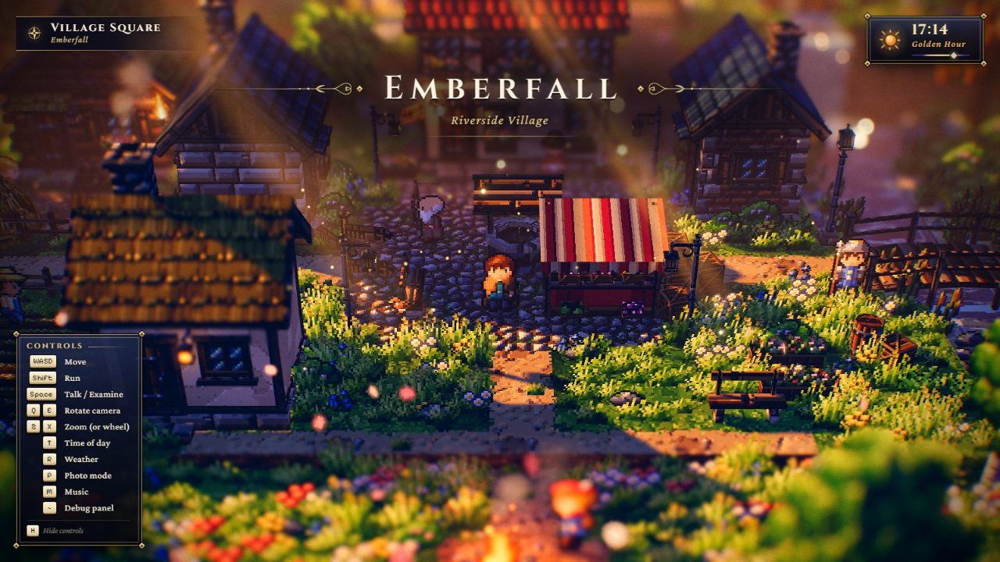
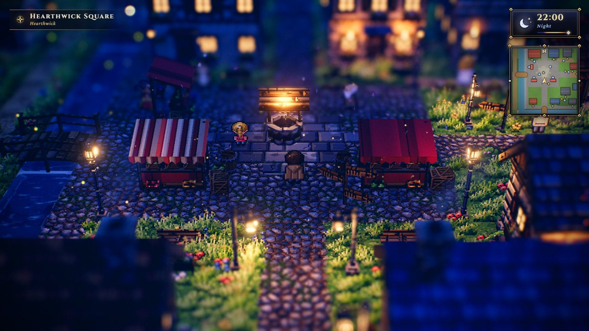
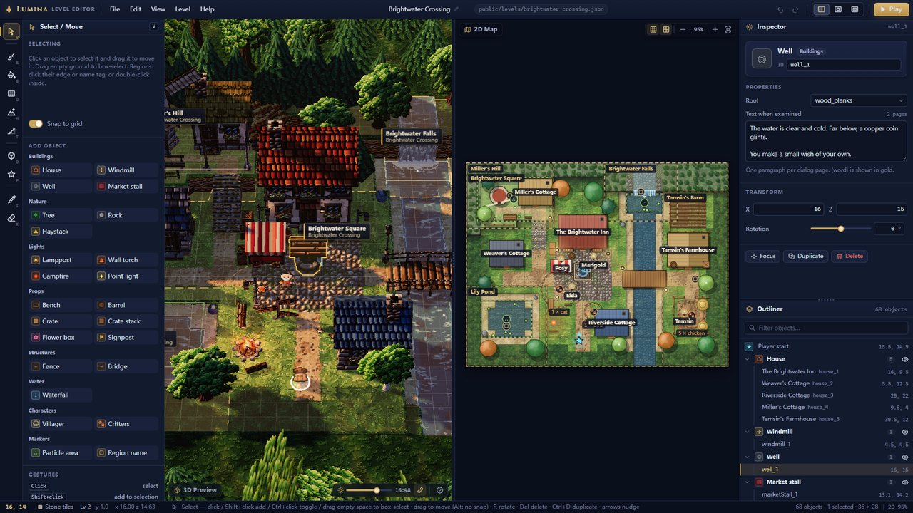
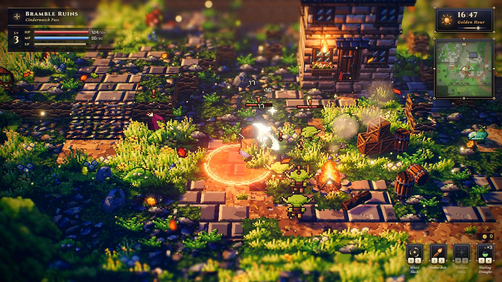
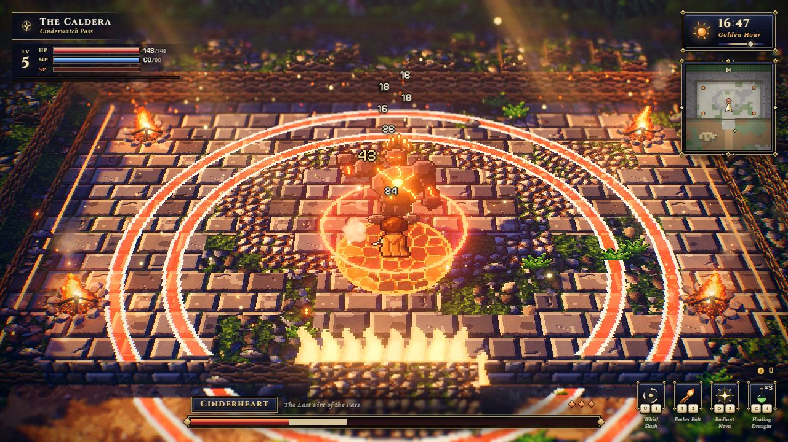
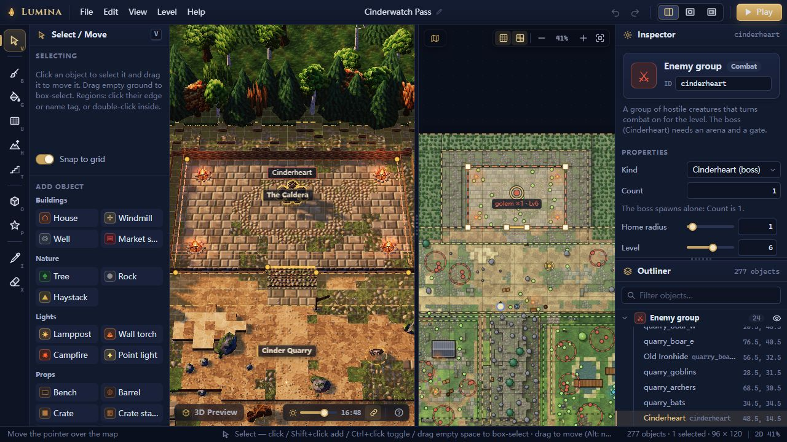
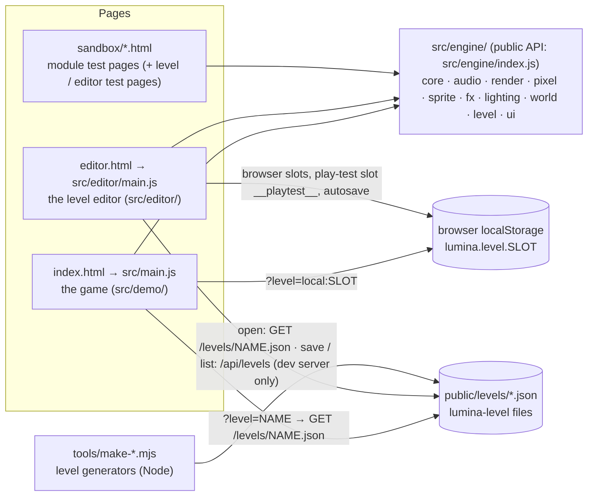
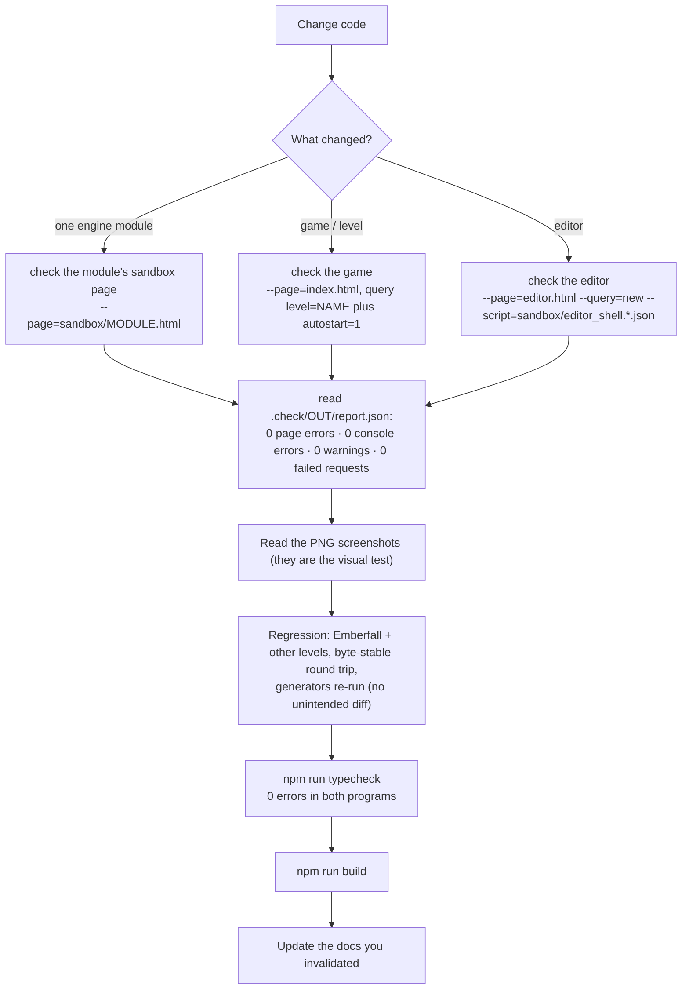

# AI agent onboarding — start here

> **Purpose.** The first file a fresh AI coding session (or a new human contributor) should read.
> It says what Lumina is, which documents to read for which kind of task, where everything lives,
> the invariants that are easy to break, how to verify a change, and how earlier sessions worked.
> It is deliberately short on API detail and links to the canonical references instead.
>
> **Audience.** AI agents starting work on the project with no prior context; humans who want the
> fast tour.
>
> **Source of truth.** The code: [`src/`](../../src/), [`tools/`](../../tools/),
> [`sandbox/`](../../sandbox/), [`public/levels/`](../../public/levels/). Binding contracts:
> [`ARCHITECTURE.md`](../../ARCHITECTURE.md) (engine) and
> [`docs/contracts/LEVEL_EDITOR.md`](../contracts/LEVEL_EDITOR.md) (level format, editor). Where a
> document and the code disagree, **the code wins** — record the discrepancy
> ([KNOWN_ISSUES.md § Documentation](KNOWN_ISSUES.md#documentation-discrepancies)).
>
> **Related.** [TASK_PLAYBOOKS.md](TASK_PLAYBOOKS.md) (step-by-step recipes) ·
> [KNOWN_ISSUES.md](KNOWN_ISSUES.md) (limitations and gotchas) · [`CLAUDE.md`](../../CLAUDE.md)
> (the compact brief Claude Code loads automatically) · [docs index](../README.md) ·
> [glossary](../GLOSSARY.md) (terms, including the words with two meanings).

---

## 1. What Lumina is

**Lumina** is an *HD-2D* engine in the style of *Octopath Traveler II*: pixel-art sprites standing
in a lit, shadowed, tilt-shift-blurred 3D diorama. It runs on **three.js r186**, is written in
**plain JavaScript ES modules** (type-checked through their JSDoc by `tsc` — no `.ts` files —
no framework, no test runner, no linter) and
**generates every asset procedurally at runtime** — textures, character sheets, particles, sound
effects and music. The repository contains no image or audio files (the screenshots under
`docs/assets/` are documentation only).

| Emberfall (48 × 40), golden hour | Starfall Vale (128 × 128), night | The level editor |
| --- | --- | --- |
|  |  |  |
| **Cinderwatch Pass (96 × 120), combat** | **Cinderheart, the boss** | **Enemy groups in the editor** |
|  |  |  |

Three front ends share one engine:



Size: about 46 k lines of JavaScript in `src/` (engine ≈ 27 k, editor ≈ 15 k, game ≈ 4 k), plus
≈ 3 k in `tools/` and ≈ 7 k in `sandbox/`.

The shipped levels (all in [`public/levels/`](../../public/levels/)):

| File | Level | Size | Objects | Made by | Play |
| --- | --- | --- | --- | --- | --- |
| `emberfall.json` | Emberfall — Riverside Village (default level) | 48 × 40 | 136 (8 villagers) | converted once from the old hand-written map; now edited as JSON / in the editor | `index.html` |
| `starfall-vale.json` | Starfall Vale — Where the Stars Come Home | 128 × 128 | 874 (29 villagers, 95 light descriptors) | **generated** by [`tools/make-starfall-vale.mjs`](../../tools/make-starfall-vale.mjs) | `index.html?level=starfall-vale` |
| `brightwater-crossing.json` | Brightwater Crossing — A Riverside Hamlet | 36 × 28 | 68 (4 villagers) | built by hand in the editor UI | `index.html?level=brightwater-crossing` |
| `sample-hamlet.json` | Willowmere — A Hamlet by the Pond | 28 × 22 | 38 (3 villagers) | **generated** by [`tools/make-sample-hamlet.mjs`](../../tools/make-sample-hamlet.mjs) | `index.html?level=sample-hamlet` |
| `gildhaven.json` | Gildhaven — Market Day on the River Gild (a walled river town) | 128 × 128 | 518 (68 villagers, 53 houses, 86 light descriptors) | **generated** by [`tools/make-gildhaven.mjs`](../../tools/make-gildhaven.mjs) | `index.html?level=gildhaven` |
| `cinderwatch-pass.json` | Cinderwatch Pass — Where the Old Fires Wake (the **combat** level) | 96 × 120 | 277 (5 villagers, 24 enemy groups = 53 enemies, 6 chests, 3 waystones) | **generated** by [`tools/make-cinderwatch-pass.mjs`](../../tools/make-cinderwatch-pass.mjs) | `index.html?level=cinderwatch-pass` |

Only Cinderwatch Pass has `enemy` objects, so it is the only level with combat
([contracts/COMBAT.md](../contracts/COMBAT.md)); the other five stay peaceful and must not notice
the combat code at all (rule 14).

Per-level design notes: [design/levels/](../design/levels/). Feature overview:
[features/FEATURES.md](../features/FEATURES.md).

---

## 2. The 10-minute orientation

Everyone reads the first row. Then pick the row for your task.

| Task | Read, in this order |
| --- | --- |
| **Any task** | this file → [`CLAUDE.md`](../../CLAUDE.md) → the part of [KNOWN_ISSUES.md](KNOWN_ISSUES.md) for your area → [architecture/OVERVIEW.md](../architecture/OVERVIEW.md) → the matching recipe in [TASK_PLAYBOOKS.md](TASK_PLAYBOOKS.md) |
| Change an engine module | [`ARCHITECTURE.md`](../../ARCHITECTURE.md) §1–2 and the module's §4.x contract → [architecture/modules/](../architecture/modules/README.md) `<module>.md` → that module's section of [contracts/MODULE_NOTES.md](../contracts/MODULE_NOTES.md) → its sandbox page |
| Rendering, look, lighting, post | [architecture/RENDER_PIPELINE.md](../architecture/RENDER_PIPELINE.md) → [design/VISUAL_DESIGN.md](../design/VISUAL_DESIGN.md) → [modules/render.md](../architecture/modules/render.md), [modules/lighting.md](../architecture/modules/lighting.md) → [architecture/PERFORMANCE.md](../architecture/PERFORMANCE.md) |
| Level format / level content | [specs/LEVEL_FORMAT.md](../specs/LEVEL_FORMAT.md) → [specs/OBJECT_CATALOG.md](../specs/OBJECT_CATALOG.md) → [contracts/LEVEL_EDITOR.md](../contracts/LEVEL_EDITOR.md) §1–5 (binding) → [design/LEVEL_DESIGN_GUIDE.md](../design/LEVEL_DESIGN_GUIDE.md) → [design/levels/](../design/levels/) |
| Game behaviour (player, villagers, dialogue, weather, HUD) | [architecture/GAME.md](../architecture/GAME.md) → [specs/INPUT_AND_CONTROLS.md](../specs/INPUT_AND_CONTROLS.md) → [specs/AUTOMATION_API.md](../specs/AUTOMATION_API.md) → [user/PLAYING_THE_GAME.md](../user/PLAYING_THE_GAME.md) |
| Combat (rules, enemies, boss, Cinderwatch Pass) | [contracts/COMBAT.md](../contracts/COMBAT.md) §1–4, §22 and the section of your area (binding; §27 lists what the code does differently) → [architecture/GAME.md §15](../architecture/GAME.md#15-combat-combat-levels-only) → the COMBAT-xx rows of [KNOWN_ISSUES.md](KNOWN_ISSUES.md#combat) → [TASK_PLAYBOOKS §19 / §20](TASK_PLAYBOOKS.md#19-add-an-enemy-kind) → [design/levels/cinderwatch-pass.md](../design/levels/cinderwatch-pass.md) |
| Level editor | [architecture/EDITOR.md](../architecture/EDITOR.md) → [contracts/LEVEL_EDITOR.md](../contracts/LEVEL_EDITOR.md) §6–9 → [user/LEVEL_EDITOR_GUIDE.md](../user/LEVEL_EDITOR_GUIDE.md) → [specs/LEVEL_STORAGE_API.md](../specs/LEVEL_STORAGE_API.md) |
| Performance | [architecture/PERFORMANCE.md](../architecture/PERFORMANCE.md) → [TASK_PLAYBOOKS § Profile](TASK_PLAYBOOKS.md#14-profile-and-fix-a-performance-problem) → perf items in [KNOWN_ISSUES.md](KNOWN_ISSUES.md) |
| Tooling, tests, workflow | [development/TESTING_AND_VERIFICATION.md](../development/TESTING_AND_VERIFICATION.md) → [development/DEVELOPMENT_WORKFLOW.md](../development/DEVELOPMENT_WORKFLOW.md) → [development/CONVENTIONS.md](../development/CONVENTIONS.md) → header of [`tools/check.mjs`](../../tools/check.mjs) |
| Why something is the way it is | [history/DECISIONS.md](../history/DECISIONS.md) → [history/PROJECT_HISTORY.md](../history/PROJECT_HISTORY.md) |
| Documentation work | [docs/README.md](../README.md) (§ Keeping the docs correct) → [contracts/README.md](../contracts/README.md) → `npm run docs:check` after every change |

Then open the code you are going to change and read it — the module headers are detailed and
current. Do not trust a number or a signature from any document (this one included) without
checking the code.

---

## 3. Repository map

```text
3d_pixel/
├─ index.html · editor.html      the two Vite entry pages (game, editor); multi-page build in vite.config.js
├─ package.json                  scripts: dev · build · preview · check · typecheck · docs:check · level:check
│                                (deps: three, lil-gui, @fontsource/*; dev: vite, puppeteer-core,
│                                typescript, @types/three, @types/node)
├─ tsconfig.json                 the type check of src/ + sandbox/ (allowJs, checkJs, noEmit, strict off)
├─ vite.config.js                dev server 127.0.0.1:5173 + the level-save API plugin
├─ ARCHITECTURE.md               BINDING engine contract (visual target §1, conventions §2, module APIs §4)
├─ CLAUDE.md                     compact brief for Claude Code (commands, architecture, invariants)
├─ README.md                     features, controls, editor workflow, performance numbers
├─ src/
│  ├─ globals.d.ts               types of the window.__* hooks (type check only)
│  ├─ main.js                    game entry: resolves ?level=, shows loading errors, boots demo/Game
│  ├─ engine/                    the engine (public barrel: index.js)
│  │  ├─ constants.js · utils/math.js · render/GlobalUniforms.js   shared foundation
│  │  ├─ core/        Engine (loop, systems, resize) · Input · CameraRig · EventEmitter
│  │  ├─ audio/       AudioSystem (procedural WebAudio sfx, ambience, music)
│  │  ├─ render/      PostFX + shaders/ (DOF, bloom, grade)
│  │  ├─ pixel/       PixelCanvas · Palette · Textures (TextureLibrary) · CharacterSprites · PropSprites
│  │  ├─ sprite/      Sprite3D · SpriteManager · Foliage · BlobBatch
│  │  ├─ fx/          Particles · GodRays
│  │  ├─ lighting/    LightingSystem (24 h palette) · LightPool · Sky
│  │  ├─ world/       TileMap · Water · WaterShore + shoreWorker · Props (PropFactory) + props/* ·
│  │  │               SpatialSplit · ShadowCasters
│  │  ├─ level/       LevelFormat · ObjectCatalog · ObjectBuilder · LevelStorage · LevelMap ·
│  │  │               types.d.ts (the level document's types; other folders have a types.d.ts too)
│  │  └─ ui/          UI · DialogBox · Banner · TitleScreen · HUD · Minimap/WorldMap · InteractPrompt ·
│  │                  Fader · DebugPanel · ui.css
│  ├─ demo/          the game: Game · World · Player · Npc · Critters · dialogue · Weather · Scenery ·
│  │                 GroundDetail · SnowCover · AudioDirector · ResolutionGovernor · AtmosphereFog ·
│  │                 DebugControls · config
│  └─ editor/        the level editor: EditorApp · EditorState · autosave · icons · editor.css ·
│                    tools/* · ui/* · map2d/Map2DView · viewport3d/*
├─ public/levels/*.json          level files (served as /levels/<name>.json, copied into dist/ by the build)
├─ tools/
│  ├─ check.mjs                  headless-Chrome verification harness (npm run check)
│  ├─ typecheck.mjs              the type check (npm run typecheck); tools/tsconfig.json: the Node program
│  ├─ vite-level-api.js          dev-server REST API GET/PUT/DELETE /api/levels
│  ├─ make-starfall-vale.mjs     Starfall Vale generator + validator
│  ├─ make-sample-hamlet.mjs     Willowmere generator
│  ├─ make-cinderwatch-pass.mjs  Cinderwatch Pass generator + validator (the combat level)
│  ├─ make-gildhaven.mjs         Gildhaven generator + validator (the 128 × 128 town)
│  ├─ lib/levelgen.mjs           helpers shared by the Cinderwatch and Gildhaven generators
│  ├─ lib/levelcheck.mjs         the level checks (checkLevel), shared by make-gildhaven and check-level
│  ├─ check-level.mjs            the level checks on any level file (npm run level:check)
│  ├─ convert-emberfall.mjs      historical one-off conversion (do not re-run, see KNOWN_ISSUES)
│  └─ check-docs-links.mjs       docs link checker (npm run docs:check)
├─ sandbox/                      module test pages (*.html/*.js) + scripted checks (*.json);
│                                /sandbox/ is a gallery page
├─ docs/                         this documentation (contracts/ holds the binding level/editor contract)
├─ .claude/launch.json           preview server "emberfall" (npm run dev, port 5173)
├─ .gitattributes                "* text=auto eol=lf", "*.png binary"
├─ .gitignore                    node_modules/ · dist/ · .check/ · *.log
├─ dist/                         build output (gitignored; may be stale)
└─ .check/                       LOCAL-ONLY harness output (gitignored)
```

About **`.check/`**: every `npm run check` writes `.check/<out>/report.json` plus PNG screenshots.
It holds only harness output, and anything in it may be deleted at any time; the build history
that used to live there (one JSON report per multi-agent workflow, the timeline and the early
helper scripts) is archived in [`docs/history/reports/`](../history/reports/README.md). It is **not
in git**: never link to it from documentation, never assume another machine has it, and copy
anything worth keeping into `docs/` (the curated screenshots in
[`docs/assets/screenshots/`](../assets/screenshots/) came from harness runs this way). Use a fresh `--out` name per run: the harness
deletes the PNGs and `report.json` already in that folder.

---

## 4. Golden rules (invariants that are easy to break)

Each rule says what, why and how to comply. The recipes in [TASK_PLAYBOOKS.md](TASK_PLAYBOOKS.md)
apply them step by step.

1. **At most 12 point lights, all created before the first frame; the count never changes
   afterwards.** Adding or removing a light, or toggling `light.visible`, changes three.js' light
   count and recompiles every lit shader (a visible hitch). Fade intensities instead. The game
   hands all light descriptors to [`LightPool`](../../src/engine/lighting/LightPool.js)
   (`MAX_POINT_LIGHTS = 12` in [`src/demo/World.js`](../../src/demo/World.js)): with ≤ 12
   descriptors each gets one permanent light (so a small level has *fewer* than 12 lights —
   Emberfall 12, Brightwater 10, Willowmere 6); with more, exactly 12 lights are shared around the
   camera focus with fade-out → move → fade-in (Starfall: 95 descriptors). The editor's 3D
   preview uses the same engine `LightPool` with `fixed: true` and `size: LIGHT_POOL_SIZE` (12,
   [`viewport3d/ObjectPreview.js`](../../src/editor/viewport3d/ObjectPreview.js)): it always has
   exactly 12 THREE lights (spares parked at intensity 0), follows the descriptor count into static
   or pooled mode as the game does, and edits hand it new descriptor sets through
   `setDescriptors` without adding or removing lights. A level may contain any number of lights.
2. **Warm shaders against `postfx.sceneTarget`.** three.js keys programs by the bound render
   target's colour space; the scene renders into PostFX's linear HDR target, so compiling for the
   canvas builds unused variants. `Game._compileScene()` binds `postfx.sceneTarget` and calls
   `renderer.compileAsync`; `postfx.warmup()` compiles the post passes; `Game.start()` draws five
   frames (`WARM_FRAMES`) with rain and snow forced on behind the loading screen; one-shot bursts
   are primed with one particle far below the world (`footstep` always, `splash` and `sparkle`
   when the level has a splashing waterfall). Anything new that can appear
   mid-game (a material, an emitter preset, a burst) must exist or be primed **before** that
   warm-up, or it hitches on first use. Check: `renderer.info.programs.length` must not grow
   during play (Emberfall: 57).
3. **Deterministic procedural content.** Use the seeded `RNG`, `hash2`, `fbm2`, `hashString`
   from [`src/engine/utils/math.js`](../../src/engine/utils/math.js); never `Math.random()` for
   anything that shapes the world. (`Math.random` appears only for runtime jitter — dialogue blip
   pitch and waterfall spray positions in `Game.js` —, in the editor for the Place tool's next
   variation seed (`PlaceTool.js`; the seed is then stored in the object's `opts.seed`), for
   autosave / session and DOM ids, and in the harness' port choice. Object ids are deterministic:
   `generateObjectId` → `<type>_<n>`.) Props seed from kind + position + `opts.seed`
   (`PropFactory.rng`), textures from their name and the library seed (`TextureLibrary.seedOf`;
   the game uses seed 1337), terrain tint from the level name (rule 7), so the same level builds
   identically every load.
4. **Contract changes are additive only.** Never rename or change the meaning of a member of
   `ARCHITECTURE.md` §4 or `docs/contracts/LEVEL_EDITOR.md`. Add optional members, options and
   level fields; document them in the same change (contract file, its typed copy — rule 15 —,
   `MODULE_NOTES.md` for engine modules, the matching `docs/` pages, `README.md` if
   user-visible).
5. **Byte-stable level files.** `parseLevel` → `serializeLevel` must reproduce a saved file
   exactly; opening a level in the editor and saving it unchanged must leave `git diff` empty.
   Consequences: `normalizeObject` keeps key order; new *defaults* (a key added to an object
   type's `defaults`, to `DEFAULT_ENVIRONMENT`, or a new `TILE_TYPES` char in the default
   legend) get written into every file on its next save — so prefer optional fields that are
   absent by default, and if you must add a default, re-save / regenerate every shipped level in
   the same change. Check with the round-trip snippet in §5.
6. **Generated levels change only through their generator.** `starfall-vale.json` ←
   `node tools/make-starfall-vale.mjs`, `sample-hamlet.json` ← `node tools/make-sample-hamlet.mjs`,
   `cinderwatch-pass.json` ← `node tools/make-cinderwatch-pass.mjs` (its own `validate()` of 20
   rules and a `coverage()` of every combat type, enemy kind and chest upgrade; `--check`).
   Never hand-edit their JSON (the next run overwrites it). The Starfall generator refuses to
   write when its validation fails (`--force` writes for inspection and still exits 1), and its
   coverage checklist requires **every** tile type, object type, NPC action / behaviour, critter
   kind and particle-area preset to appear in the level (see
   [TASK_PLAYBOOKS § Before any recipe](TASK_PLAYBOOKS.md#0-before-any-recipe)). Both
   generators reproduce their committed files byte for byte; `make-sample-hamlet.mjs` writes each
   object in a key order of its own (`id, type`, position keys, catalog defaults, other keys) and
   refuses to write unless its output round-trips through `parseLevel` → `serializeLevel`.
7. **No regressions in the shipped levels.** Emberfall is the reference look; it and the other
   small levels must render and play exactly as before unless the task is to change them
   (compare with the screenshots in [`docs/assets/screenshots/`](../assets/screenshots/) and a
   before/after fingerprint — draw calls, triangles, lights, programs; see
   [TASK_PLAYBOOKS § Regression check](TASK_PLAYBOOKS.md#16-regression-check-before-you-finish)).
   Do not rename a shipped level casually: the terrain noise is seeded from `level.name`
   ([KNOWN_ISSUES LVL-10](KNOWN_ISSUES.md#levels-and-generators)).
8. **Two build paths: small levels vs big levels.** `World.isBigLevel(level)` is true when either
   side is **> 64 tiles** (`SMALL_LEVEL = 64` in [`src/demo/World.js`](../../src/demo/World.js)).
   Big levels (Starfall Vale) get `BIG_LEVEL_BATCHING`: k-d split batches culled by box,
   shadow-only proxy casters, a shadow depth range, worker shore bake, far-actor throttling,
   particle culling at 34 units, one instanced blob-shadow call (`BlobBatch`). Levels up to
   64 × 64 keep the original single-merge path and **must render identically** — gate every
   big-level optimisation on `this.batching` / `World.isBigLevel`. The editor has the same split
   (`BATCH_CHUNK` 16 vs `BATCH_CHUNK_BIG` 32 tiles).
9. **Colour management and tone mapping have single owners.** `Engine` sets
   `renderer.outputColorSpace = SRGBColorSpace`, `toneMapping = ACESFilmicToneMapping` and the
   shadow-map type (`PCFShadowMap`); colour textures are `SRGBColorSpace`, data textures (normal
   maps, masks) `NoColorSpace`. Tone mapping is applied **once**, by the `OutputPass` inside
   PostFX (it reads the renderer's settings); the grade runs after it in display space.
   `LightingSystem` owns `renderer.toneMappingExposure`, `scene.fog` (FogExp2), the sun / hemi
   lights and the `uNight` / `uSunDirection` / `uSunColor` / `uFogColor` uniforms (its
   `settings.shadows` switches the sun's shadow off). In the game, `Weather.update` rewrites
   `postfx.settings.grade.temperature` / `.saturation` and `lighting.settings.*Mul` every frame
   from `weather.tuning` — change those base values, not the live settings.
10. **Coordinate conventions.** Y is up. Tile `(i, j)` covers `x ∈ [i, i+1]`, `z ∈ [j, j+1]`
    (centre `i + 0.5, j + 0.5`); rows of `tiles` / `heights` run toward +Z. World height =
    level × `LEVEL_HEIGHT` (0.5); height chars `'0'–'9'`, `'a'–'z'` = levels 0–35. `PPU = 16`
    texels per world unit. Camera yaw 0 sits on the +Z side looking toward −Z, so screen-down is
    +Z; sprite directions: `down` = +Z (faces the camera), `up` = −Z, `left` = −X, `right` = +X;
    stairs `'N'` rise toward −Z. Object `rotation` is radians about Y. Pixel textures go through
    `makePixelTexture` / `PixelCanvas#toTexture` (NEAREST magnification). See
    [`src/engine/constants.js`](../../src/engine/constants.js).
11. **Leave untracked levels you did not create alone.** A level file in `public/levels/` that is
    not in git belongs to the user: do not edit, delete, regenerate, "clean up" or commit it. Mind
    that saving a level named "Untitled" (the default name of a new level, `createEmptyLevel`) or
    with a blank name to the project folder writes `public/levels/untitled.json`
    (`slugify('Untitled') === slugify('') === 'untitled'`). The editor's Save As asks for a real name while the level is still "Untitled"
    and confirms before replacing a file, but scripts calling `saveProjectLevel` or
    `PUT /api/levels/untitled` bypass that. Scripts that save levels must use their own names and
    delete their temporary files afterwards.
12. **Budgets** (GTX 1060, 1600 × 900, 60 fps): ≤ ~300 scene draw calls including the shadow pass,
    one 2048² sun shadow map, DOF at half resolution, ≤ 12 point lights. Measure with `state()` and
    PostFX GPU timings, not with the headless frame rate (see §7).
13. **Everything else from the conventions:** no binary assets (fonts come from `@fontsource/*`),
    no global side effects on import (except UI CSS / fonts), every GPU-allocating class has
    `dispose()`, JSDoc on public APIs (checked — rule 15), custom shaders reference
    `globalUniforms` objects directly and include the fog chunks when they should be fogged.
14. **Combat is opt-in per level and must stay invisible elsewhere.** `Game` creates a
    `CombatSystem` only when `levelHasCombat(level)` (an `enemy` object, or `environment.combat:
    true`); on every other level `game.combat === null`, no combat sheet, material, burst pool,
    DOM node or binding exists and the fingerprints stay as they were (Emberfall 57 programs). The
    combat clock is sub-stepped and its hit-stop is combat-local — never touch
    `engine.time.timeScale`. Every combat material, batch and burst is created and warmed at load
    (`combat.warmup`), so `stats().programs` after a full fight equals the count at load
    (`sandbox/combat.programs.json`). Existing sprite sheets stay pixel-identical: after an
    intended change to a plain sheet, re-take `sprite_art.html?mode=hashes` into
    `sandbox/sprite_art.hashes.json` in the same commit ([COMBAT.md §2](../contracts/COMBAT.md#2-must-not-change)).
15. **The type check stays at zero.** `npm run typecheck` runs `tsc` over the JavaScript and its
    JSDoc in two programs (`tsconfig.json`: `src/` + `sandbox/`; `tools/tsconfig.json`: the Node
    tools) and must report 0 errors in both; Vite never type-checks, so a broken type does not
    show in the browser. Type new public APIs with JSDoc; fix the declared type rather than cast
    (`/** @type {X} */ (expr)` only where the checker cannot follow correct code); a
    `@ts-expect-error` carries its reason; fields created lazily are declared by module
    augmentation in the folder's `types.d.ts`, never in a `Foo.d.ts` beside `Foo.js`. The
    contracts have typed copies — the level document (`src/engine/level/types.d.ts`), the combat
    interfaces (`src/demo/combat/types.d.ts`), the tool interface (`src/editor/tools/index.js`),
    the hooks (`GameHooks`, `EditorHooks`, `LuminaHooks`, `src/globals.d.ts`) — so renaming a
    member fails at every use: fix the uses. Modules the Node generators import must not pull
    browser modules in through their types. The check does not see the `eval` strings of action
    scripts, and with `strict` off an untyped value is `any`
    ([CONVENTIONS.md §3.1](../development/CONVENTIONS.md#31-the-type-check), KNOWN_ISSUES
    [TC-01 – TC-05](KNOWN_ISSUES.md#type-check)).
16. **Names from level data are untrusted keys.** A level can come from any file (a project
    file, a browser slot, a file picked on disk, the dev API), and `TABLE[name]` finds
    `Object.prototype` members, so `"constructor"` or `"__proto__"` would pass a table test and
    break on the value. Look such names up with `isOwnKey` / `ownValue` from
    [`src/engine/utils/own.js`](../../src/engine/utils/own.js) (or `includes` on a list, a
    `Map`); keep level-keyed dictionaries prototype-free (`Object.create(null)`); at load, convert
    with `toText` / `toNumber` and format messages with `showValue`
    ([CONVENTIONS.md §13](../development/CONVENTIONS.md#13-error-handling-and-logging),
    [KNOWN_ISSUES LVL-17](KNOWN_ISSUES.md#resolved-2026-10-01)). Check with
    `sandbox/game_levels.html?case=hostile` and its script `sandbox/game_levels.hostile.json`.

---

## 5. The standard verification loop

There is no unit-test runner. "Testing" means driving the real pages in headless Chrome on the
real GPU with [`tools/check.mjs`](../../tools/check.mjs) and reading the result.



1. **Run the narrowest page first.** A module's sandbox (`sandbox/<module>.html`, list in
   [development/TESTING_AND_VERIFICATION.md](../development/TESTING_AND_VERIFICATION.md)), then
   the game or the editor.

   ```bash
   npm run check -- --page=sandbox/terrain.html --out=terrain
   npm run check -- --page=index.html --query=autostart=1 --out=game --wait=6000
   npm run check -- --page=index.html --query="level=starfall-vale&autostart=1" --out=sv --wait=9000
   npm run check -- --page=editor.html --query=open=emberfall --out=ed --fps=0
   npm run check -- --page=editor.html --query=new --out=perf --fps=0 --script=sandbox/editor_perf.json
   ```

   Options: `--page` (default `index.html`), `--query` (default **`autostart=1`** — pass
   `--query=` for none), `--out` (folder under `.check/`; default: the page's base name),
   `--wait` ms before the first shot (default 4000), `--fps` ms of frame-rate measurement
   (default 3000, `0` = skip), `--width` / `--height` (default 1600 × 900),
   `--script=<actions.json>` (path relative to the repo root), `--headful`, `--keep-cache` (keep the
   Vite dependency cache, which each run otherwise deletes). After the wait the
   harness always saves `initial.png`, then runs the script. The action-script steps (`wait`,
   `key`, `press`, `eval`, `shot`, `fps`, `click`, `dblclick`, `move`, `mouse`, `drag`, `wheel`,
   `type`, `combo`, `goto`, `tab`) are documented in the file header. Page hooks:
   `window.__game`, `window.__editor`, `window.__lumina`, `window.__engine` — see
   [specs/AUTOMATION_API.md](../specs/AUTOMATION_API.md).
2. **Read the report.** The console summary lists page errors, console errors, warnings, failed
   requests and every `eval` result. **The exit code is 1 only for page errors** (uncaught
   exceptions, harness failures; 2 when no Chrome / Edge is found); console errors, warnings,
   failed requests and an `eval` that throws (stored as `evals[].error` in `report.json`) do not
   fail the run — you must read them. The goal is zero of each (level-normalisation warnings such
   as `[Lumina] …` are real findings).
3. **Look at the screenshots.** Open `.check/<out>/*.png` with the Read tool. A blank, black,
   magenta-checkered (unknown texture) or washed-out frame is a failure even with a clean report.
4. **Regression checks.** For anything that can touch rendering or level building: Emberfall plus
   the other shipped levels (fingerprint before/after — recipe 16), and the level round trip:

   ```bash
   node --input-type=module -e "
   import fs from 'node:fs';
   import { parseLevel, serializeLevel } from './src/engine/level/LevelFormat.js';
   for (const f of fs.readdirSync('public/levels').filter((n) => n.endsWith('.json'))) {
     const text = fs.readFileSync('public/levels/' + f, 'utf8');
     const { level, warnings } = parseLevel(text);
     console.log(f.padEnd(28), serializeLevel(level) === text ? 'byte-stable' : 'CHANGED', warnings.length ? warnings : '');
   }"
   ```

   If you changed the level format, catalog or generators, re-run the generators and confirm
   `git diff public/levels` shows only what you intended. Both generators reproduce their files
   byte for byte. To try them without touching the committed files:
   `node tools/make-starfall-vale.mjs --out=<scratch>/sv.json` (then compare, e.g. with
   `git hash-object`) and `node tools/make-sample-hamlet.mjs --check` (writes nothing; exit 0 when
   the file matches, else exit 1 saying whether the data or only the key order / formatting
   differs) or `--out=<scratch>/hamlet.json`.
5. **Type check.** `npm run typecheck` must report 0 errors in both programs (about a second
   each). It catches renamed or misspelled members, wrong shapes and arities in typed code — fix
   the cause, do not cast it away ([CONVENTIONS.md §3.1](../development/CONVENTIONS.md#31-the-type-check);
   recipe: [TASK_PLAYBOOKS §21](TASK_PLAYBOOKS.md#21-fix-a-failing-type-check)).
6. **Build.** `npm run build` (Vite multi-page build of `index.html` + `editor.html` into
   `dist/`; a few seconds). It must succeed. (To leave `dist/` alone, e.g. while another session
   uses it: `npx vite build --outDir <some temp dir> --emptyOutDir`.)
7. **Update the docs** you made stale — contract, module notes, `README.md`, the pages under
   `docs/`. Documentation is part of "done" in this project.

A task is not done while a sandbox or page shows an error, a screenshot looks wrong, a shipped
level changed unintentionally, the type check reports an error, or the build fails.

---

## 6. How previous sessions worked

The project was built between 2026-09-25 and 2026-09-27 by Claude Code orchestrating multi-agent
workflows (five user requests: the engine + demo, the level editor, the 128 × 128 level,
`CLAUDE.md`, and this documentation). The pattern, which works well and is worth repeating for
large changes:

1. **Contract first.** The orchestrator wrote the shared foundation (`constants.js`,
   `utils/math.js`, `GlobalUniforms.js`, `PixelCanvas.js`, `Palette.js`), the harness and the
   binding contract (`ARCHITECTURE.md`; later `docs/contracts/LEVEL_EDITOR.md` together with
   `LevelFormat`, `ObjectCatalog`, `ObjectBuilder`, `LevelStorage` and `EditorState`) before any
   builder started.
2. **Parallel builders, one module each, each with its own sandbox page.** Builders could not
   rely on each other's unfinished modules, so every module got a standalone test page that
   stubs what it needs (hence `sandbox/`). "A module is not done until its sandbox renders
   correctly with zero errors."
3. **Independent auditors / reviewers.** Each builder was followed by an auditor; integrations by
   reviewers with different lenses (runtime, art, performance, gameplay / UX / data / explorer)
   using real key presses and mouse drags. Findings went to a fixer, then a final verifier
   re-ran every repro. Numbers: 18 agents for the engine modules, 57 findings on the Emberfall
   demo (43 applied), 53 on the editor (all addressed), 50 on Starfall Vale (all handled).
4. **Additive deviations, written down.** Where a builder deviated from the contract (e.g.
   `PCFShadowMap` instead of the removed `PCFSoftShadowMap`), it was recorded in
   [contracts/MODULE_NOTES.md](../contracts/MODULE_NOTES.md) instead of silently changed.

The detailed story, the decisions and the measurements are in
[history/PROJECT_HISTORY.md](../history/PROJECT_HISTORY.md) and
[history/DECISIONS.md](../history/DECISIONS.md). What remained open is in
[KNOWN_ISSUES.md](KNOWN_ISSUES.md).

For a single-agent session the same discipline scales down: read the contract, change one module,
prove it in its sandbox, then integrate and run the regression checks.

---

## 7. Environment facts

| Fact | Consequence |
| --- | --- |
| Windows 10; the Bash tool is **Git Bash** (POSIX syntax, `/e/workspace/3d_pixel`); PowerShell is also available | Use forward slashes and POSIX commands in Bash; quote paths. |
| Node 24 (v24.13.0 at the time of writing), npm; Vite 8, puppeteer-core 25; TypeScript 7 with `@types/three` 0.186 and `@types/node` 24 (type check only) | `npm install` once; no global tools needed (`npm run typecheck` uses the local `tsc`). |
| GPU: **GTX 1060 3 GB**, 12 logical CPUs | This is the performance reference machine for every budget. |
| `npm run check` launches the locally installed Chrome (or Edge; override with `CHROME_PATH`) headless with `--use-angle=d3d11`: it **renders on the real GPU** | Visual results and GPU timings are real. Other apps (and parallel agents) share the GPU, so averages are noisy: use `postfx.timingsMin` (best-case per stage), CPU timings and draw calls. |
| Headless frame rate is capped by the compositor at **~57–60 Hz** (a blank page measures the same) | fps says nothing about headroom. The engine clamps frame time to 1/20 s, so a slow machine makes the player walk slower in real time. |
| Each check starts its own Vite server on a random port 5200–5899 **with the level API active** | Scripts that save a level to the project folder really write `public/levels/<name>.json`. |
| Line endings: `.gitattributes` normalises to LF (`core.autocrlf=false`) | Tools that write CRLF (e.g. Python on Windows) produce noisy working-tree diffs; convert back to LF. |
| No audio output in headless Chrome | Audio was only verified by state flags and offline analysis; nobody has listened to the mix (see KNOWN_ISSUES). |

---

## 8. Git conventions

- One branch (`master`), no remote. **Commit finished, verified changes without waiting to be
  asked** (subagents inside a parallel workflow leave committing to the orchestrating session);
  never commit untracked user levels, `.check/`, `dist/` or temporary levels.
- Commit messages so far: one summary line, often `Area: what changed; what else` (60–130
  characters in practice, e.g. *"Starfall Vale: apply 50 review findings; Starfall night event,
  sightline and light-pool fixes"*), optionally a blank line and a `-` bullet list or a short
  paragraph, then a blank line and the trailer that all 14 commits so far carry

  ```text
  Co-Authored-By: Claude Opus 5.5 <noreply@anthropic.com>
  ```

  (follow the attribution rules of your own session if they differ).
- Never skip hooks or rewrite history; prefer new commits over amends.
- LF line endings everywhere (see §7).

---

## 9. Where to find X

| Looking for | Where |
| --- | --- |
| Public engine API | [`src/engine/index.js`](../../src/engine/index.js) (barrel) · module references in [architecture/modules/](../architecture/modules/README.md) |
| Frame order / systems wiring | `Game.init` in [`src/demo/Game.js`](../../src/demo/Game.js) (lighting −10, game 0, audio 20, UI on `lateUpdate`, PostFX as render fn); `Engine` in [`core/Engine.js`](../../src/engine/core/Engine.js) |
| Shared shader uniforms | [`render/GlobalUniforms.js`](../../src/engine/render/GlobalUniforms.js) (`uTime`, `uNight`, `uWind`, `uWindStrength`, `uCameraYaw`, `uCameraPosition`, `uSunDirection`, `uSunColor`, `uFogColor`) |
| Key bindings | `DEFAULT_BINDINGS` / `DEFAULT_PAD_BINDINGS` in [`core/Input.js`](../../src/engine/core/Input.js); HUD legend `CONTROLS` in `Game.js`; editor shortcuts: command table in [`EditorApp.js`](../../src/editor/EditorApp.js) + each tool's `shortcut` |
| Day palette | `DEFAULT_KEYFRAMES` in [`lighting/LightingSystem.js`](../../src/engine/lighting/LightingSystem.js) + `KEYFRAME_OVERRIDES` in [`demo/config.js`](../../src/demo/config.js) |
| Game look (DOF, bloom, grade values) | `Game._tunePost`; weather offsets `WEATHER_PARAMS` in [`demo/WeatherLook.js`](../../src/demo/WeatherLook.js) (shared with the editor preview; blending in [`demo/Weather.js`](../../src/demo/Weather.js)) |
| Camera framing | `CAMERA` in `demo/config.js`; per level `environment.camera` / `highGround` / `titleCamera` |
| Time-of-day presets (T key) | `TIME_PRESETS` in `demo/Weather.js` |
| Tile palette | `TILE_TYPES` in [`level/LevelFormat.js`](../../src/engine/level/LevelFormat.js) |
| Object types, inspector fields | `OBJECT_TYPES` in [`level/ObjectCatalog.js`](../../src/engine/level/ObjectCatalog.js) |
| Object → 3D build | `LevelObjectBuilder.build` in [`level/ObjectBuilder.js`](../../src/engine/level/ObjectBuilder.js) → `PropFactory` in [`world/Props.js`](../../src/engine/world/Props.js) → [`world/props/*`](../../src/engine/world/props/) |
| Light priority | `LIGHT_PRIORITY` in `ObjectBuilder.js` (campfire 0, wallTorch / light 1, lamppost 2, house 3) |
| Big-level budgets | `BIG_LEVEL_BATCHING` in [`demo/World.js`](../../src/demo/World.js) |
| Villager conversations | `CONVERSATIONS` (script ids) and `levelConversation` (plain dialogue + `action`) in [`demo/dialogue.js`](../../src/demo/dialogue.js) |
| NPC behaviours | `Npc.update` in [`demo/Npc.js`](../../src/demo/Npc.js); critter kinds `KINDS` in [`demo/Critters.js`](../../src/demo/Critters.js) |
| Forest border, outer scenery | [`demo/Scenery.js`](../../src/demo/Scenery.js) (`scatterForest`, `forestKindAreas`, `mergeTrees`, `buildOuterGround`) |
| Ground foliage | `buildGroundDetail` in [`demo/GroundDetail.js`](../../src/demo/GroundDetail.js) |
| Snow on the ground / roofs | [`demo/SnowCover.js`](../../src/demo/SnowCover.js) (`addSnowCover`, `snowCover.value`); `World.build` applies it to the terrain, outer ground, foliage and the merged static meshes whose material name matches `lumina:roof*` |
| Fog that starts in front of the camera | `installFogStart` in [`demo/AtmosphereFog.js`](../../src/demo/AtmosphereFog.js) (patches `THREE.ShaderChunk.fog_vertex` globally; game only) |
| Dynamic resolution | [`demo/ResolutionGovernor.js`](../../src/demo/ResolutionGovernor.js) |
| Minimap / world map | [`ui/Minimap.js`](../../src/engine/ui/Minimap.js) + `renderLevelMap` in [`level/LevelMap.js`](../../src/engine/level/LevelMap.js) |
| Level save / load | [`level/LevelStorage.js`](../../src/engine/level/LevelStorage.js) (browser slots `lumina.level.<slot>`, project API, files, `resolveLevelFromURL`) + [`tools/vite-level-api.js`](../../tools/vite-level-api.js) |
| Editor document & undo | [`editor/EditorState.js`](../../src/editor/EditorState.js) (`begin` / `commit` transactions) |
| Editor tools | [`editor/tools/index.js`](../../src/editor/tools/index.js) (`TOOLS`) + one file per tool |
| Editor 3D preview internals | [`editor/viewport3d/Viewport3D.js`](../../src/editor/viewport3d/Viewport3D.js), `ObjectPreview`, `TerrainPreview`, `ActorPreview`, `SceneryPreview` |
| Autosave / recovered copies | [`editor/autosave.js`](../../src/editor/autosave.js) |
| Harness | [`tools/check.mjs`](../../tools/check.mjs) (usage in its header) |
| Type check | [`tsconfig.json`](../../tsconfig.json), [`tools/tsconfig.json`](../../tools/tsconfig.json), [`tools/typecheck.mjs`](../../tools/typecheck.mjs); rules and the list of contract types: [CONVENTIONS.md §3.1](../development/CONVENTIONS.md#31-the-type-check) |
| Contract types | level document [`level/types.d.ts`](../../src/engine/level/types.d.ts) · `PropResult` in [`world/Props.js`](../../src/engine/world/Props.js) · combat [`combat/types.d.ts`](../../src/demo/combat/types.d.ts) + `EnemyDef` in [`combat/defs.js`](../../src/demo/combat/defs.js) · tools `Tool` / `PointerEv` in [`editor/tools/index.js`](../../src/editor/tools/index.js) · hooks `GameHooks` / `EditorHooks` / `LuminaHooks` and [`src/globals.d.ts`](../../src/globals.d.ts) |
| Scripted checks | `sandbox/*.actions.json`, `sandbox/editor_shell.*.json`, `sandbox/editor3d.*.actions.json`, `sandbox/editor_perf*.json`, `sandbox/combat.*.json` (combat; the fixture level in `sandbox/combat_fixture.js`, the play-through bot in `sandbox/combat_play.js` — deterministic in fixed step, compare its `summary` / `digest`), `sandbox/combat_audio.actions.json` (the combat audio QA) |
| Combat | [`src/demo/combat/`](../../src/demo/combat/CombatSystem.js) (`CombatSystem`, `PlayerCombat`, `Enemy` + `ai/*`, `rules.js`, `defs.js`, `Feel.js`), contract [contracts/COMBAT.md](../contracts/COMBAT.md), overview [GAME.md §15](../architecture/GAME.md#15-combat-combat-levels-only), hooks `window.__game.combat` ([AUTOMATION_API.md](../specs/AUTOMATION_API.md)) |
| Game automation hooks | `Game._exposeGlobal` (`window.__game`), `exposeHook` in [`src/main.js`](../../src/main.js) (`window.__lumina`) |

---

## 10. Before you start coding — checklist

- [ ] I read the rows of §2 for my task and the relevant [KNOWN_ISSUES.md](KNOWN_ISSUES.md) entries.
- [ ] I know which contract members I touch and that my change is additive.
- [ ] I know which sandbox / page proves my change and which regression checks apply (§5),
      and I will run `npm run typecheck`.
- [ ] I will not edit generated levels by hand, nor untracked levels I did not create.
- [ ] I will update the documentation I make stale.
