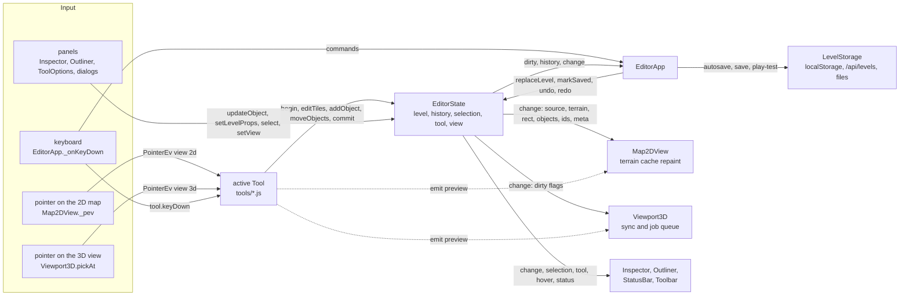
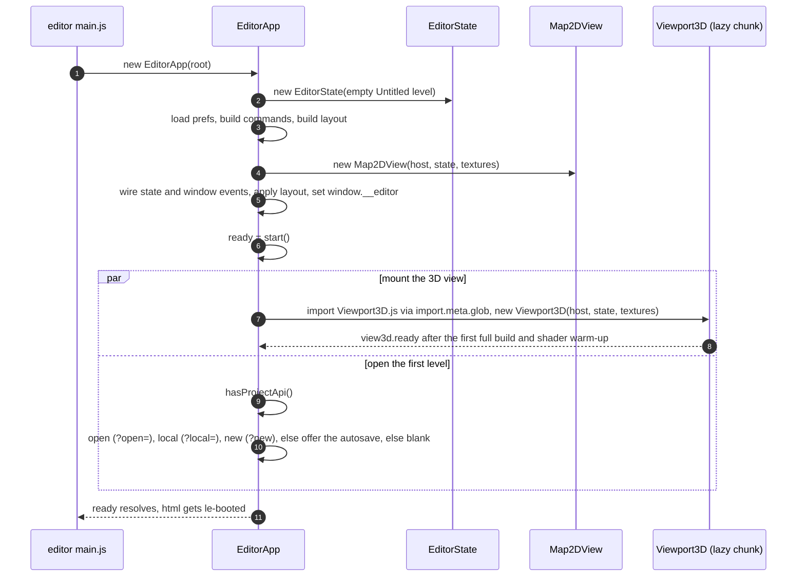
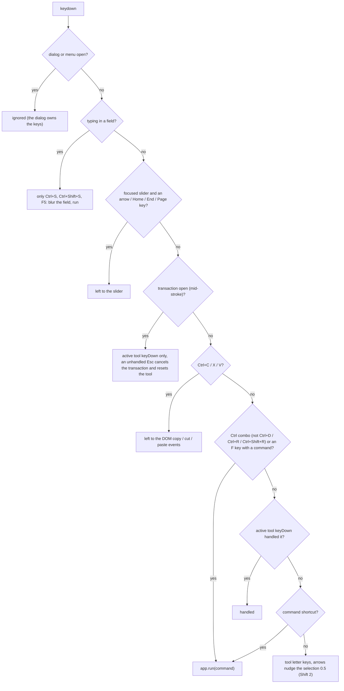
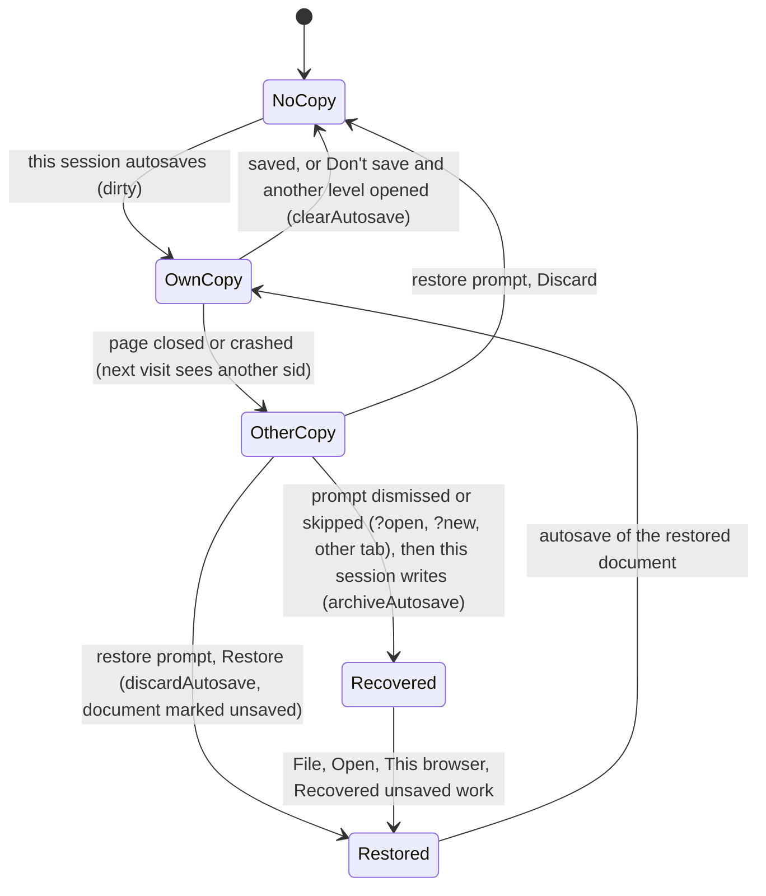
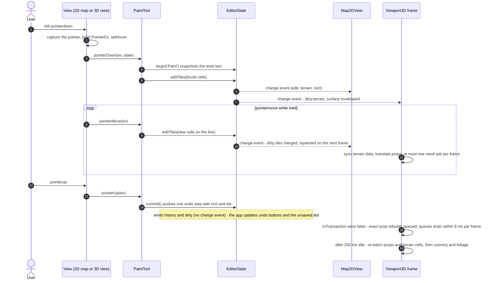

# Level editor architecture — `src/editor/`

> **Purpose.** How the visual level editor is built: the application shell, the single state
> object every edit goes through, the view-agnostic tools, the 2D map, the live HD-2D 3D preview
> and its incremental rebuild machinery, saving / autosave / play-test, the dev-server level API,
> and how the preview stays identical to what the game renders. Read this before changing
> anything in `src/editor/`.
>
> **Audience.** Developers and AI agents working on the editor, its tools or its performance.
> Users who want to *use* the editor: [user/LEVEL_EDITOR_GUIDE.md](../user/LEVEL_EDITOR_GUIDE.md).
>
> **Source of truth.** [`editor.html`](../../editor.html),
> [`src/editor/main.js`](../../src/editor/main.js),
> [`EditorApp.js`](../../src/editor/EditorApp.js), [`EditorState.js`](../../src/editor/EditorState.js),
> [`autosave.js`](../../src/editor/autosave.js), [`tools/`](../../src/editor/tools/),
> [`map2d/Map2DView.js`](../../src/editor/map2d/Map2DView.js),
> [`viewport3d/`](../../src/editor/viewport3d/), [`ui/`](../../src/editor/ui/),
> [`tools/vite-level-api.js`](../../tools/vite-level-api.js). Where this page and the code
> disagree, the code wins.
>
> **Related.** Binding contract: [contracts/LEVEL_EDITOR.md §6–§9](../contracts/LEVEL_EDITOR.md) ·
> [GAME.md](GAME.md) (what the preview must match) · [OVERVIEW.md](OVERVIEW.md) ·
> [PERFORMANCE.md](PERFORMANCE.md) · [specs/LEVEL_FORMAT.md](../specs/LEVEL_FORMAT.md) ·
> [specs/OBJECT_CATALOG.md](../specs/OBJECT_CATALOG.md) ·
> [specs/LEVEL_STORAGE_API.md](../specs/LEVEL_STORAGE_API.md) ·
> [specs/AUTOMATION_API.md](../specs/AUTOMATION_API.md) (`window.__editor`) ·
> [user/shortcuts.html](../user/shortcuts.html) ·
> [development/TESTING_AND_VERIFICATION.md](../development/TESTING_AND_VERIFICATION.md).


---

## 1. Design in one paragraph

`EditorState` is the **single source of truth**: it owns the level document, undo / redo, the
selection, the active tool and its options, and the view options. Every mutation runs inside a
transaction, so one brush stroke or one drag is one undo step, and every mutation emits a
`change` event that says *what* changed (tile rect, object ids, level settings). **Tools** are
view-agnostic singletons that receive `PointerEv`s in map coordinates and call `EditorState`.
The two **views** — `Map2DView` (canvas) and `Viewport3D` (the real engine) — only translate
pointer input into `PointerEv`s, forward left-button strokes to the active tool and render the
level plus the tool's preview. The 3D view does not rebuild the level wholesale on an edit (only a
size, legend, water-level or name change rebuilds the terrain): it updates the terrain *data* at
once and lets the *meshes* follow through a time-sliced job queue,
and it builds everything with **the same builders the game uses**, so what you see is what the
game plays.



---

## 2. File map

| Path | Role |
| --- | --- |
| `editor.html` | Entry page (Vite multi-page input `editor`). Boot splash; a tiny inline script shows "The level editor could not load" if the module fails to import. |
| `src/editor/main.js` | Imports the Cinzel font and `editor.css`, `new EditorApp(#editor)`; `app.ready` adds `le-booted` to `<html>`; a constructor exception renders a fatal error box. |
| `src/editor/EditorApp.js` | The application: layout, menus / commands / shortcuts, clipboard, context menu, dialogs, open / save / export / play-test, autosave, preferences, level checks, `window.__editor`. |
| `src/editor/EditorState.js` | Document, transactions and history, change events, selection, tool, options, view, hover, revisions. Also `shiftLegacyFields()`. |
| `src/editor/autosave.js` | The `__autosave__` working copy and the recovered copies of other sessions. |
| `src/editor/enemyGroups.js` | Enemy-group helpers shared by both views, the tools, the inspector and the checks (three-free): kind / boss tests, the relative `arena` / `gate` in world space (`bossArena` / `bossGate` for the boss kind only), `gateEdgeGap`, the level-data start test `levelStartTest`, the boss *Count* rule (`bossExtraCount`, `clampBossCount`) and `enemyScatterRect` ([§8.6](#86-combat-content-enemy-groups-chests-waystones)). |
| `src/editor/tools/index.js` | Tool registry (`TOOLS`, `getTool`, `TERRAIN_TOOL_IDS`) and the `Tool` / `PointerEv` / `ToolPreview` typedefs. |
| `src/editor/tools/common.js` | Brush / line / rect cells, snapping, flood fill, tile colours and labels, selection operations (delete, duplicate, rotate, nudge, copy, paste, bounds), `shownOnMap` (what the 2D map shows and a box can select). |
| `src/editor/tools/*Tool.js` | The ten tools ([§5](#5-tools)). |
| `src/editor/map2d/Map2DView.js` | The top-down 2D map ([§6](#6-map2dview)). |
| `src/editor/viewport3d/*.js` | The 3D preview and its subsystems ([§7](#7-viewport3d)–[§8](#8-viewport3d-subsystems)); `SpriteBatch.js` draws the enemy previews instanced ([§8.3](#83-actorpreview)). |
| `src/editor/ui/*.js` | Panels and controls: `MenuBar`, `Toolbar`, `ToolOptions`, `Inspector`, `Outliner`, `StatusBar`, `Dialog` (promise-based modals), `dialogs.js` (New, Open, Save as, Level settings, Resize, Shortcuts, Restore, Problems, About), `ContextMenu`, `Tooltip`, `fields.js` (schema-driven form controls), `dom.js` (`h()`, `icon()`, `isTypingTarget()`…). |
| `src/editor/icons.js` | Inline SVG icons (20 × 20, `currentColor`) and the logo. |
| `src/editor/editor.css` | The whole editor look (dark navy, gold accents). |
| `tools/vite-level-api.js` | Dev-server REST API that writes `public/levels/<name>.json` ([§9](#9-the-dev-server-level-api)). |

No framework: panels are plain classes that build DOM with `h()` and subscribe to `EditorState`
events.

---

## 3. `EditorApp` — the application shell

### 3.1 Boot



- The 3D module is loaded through `import.meta.glob('./viewport3d/Viewport3D.js')`, so it is a
  separate chunk and a missing / failing module degrades gracefully: the 3D slot shows a
  placeholder with **Retry** and **2D only** — the 2D map is fully editable on its own.
- `start()` resolves when the first level is loaded **and** the 3D view exists (`view3d` set, or
  `null` if it could not start). `window.__editor.ready3d` additionally waits for
  `view3d.ready`.
- Startup queries (checked in this order): `?open=<name>` (project level), `?local=<slot>`
  (browser slot), `?new` (blank level, no restore prompt). After `?open=` / `?local=` the restore
  prompt is offered only when the autosave is a copy of that same level. Without a query the
  autosave of an earlier session is offered, otherwise a blank "Untitled" level starts. A copy
  written by this session or flagged `exported` (a download) is never offered. A startup error
  falls back to a blank level and shows an alert.
- The "Building the 3D preview…" overlay stays up until the first build has settled
  (`_watch3DBuild` polls every 120 ms for pending terrain chunks / slices, pending exact prop
  builds and scenery work; at most 12 s at startup, 8 s after a big-level load).

### 3.2 Layout

```
.le-app
├─ header.le-menubar   brand · MenuBar (File Edit View Level Help) · level name button + unsaved dot
│                      + "where" (public/levels/x.json | browser · slot | file · name | not saved yet)
│                      · undo / redo · layout segmented (3D+2D / 3D / 2D) · Play ▶
├─ .le-main
│  ├─ .le-left         Toolbar (one button per tool) + ToolOptions (palettes, brush, modes…)
│  ├─ main.le-center   .le-viewports: section.le-vp3d (host, loading overlay, bar: sun slider,
│  │                   link-to-start-time, help) · .le-splitter · section.le-vp2d (host, bar: grid,
│  │                   textured map, zoom −/%/+, frame level)
│  └─ .le-right        Inspector · .le-hsplitter · Outliner
├─ StatusBar           tile / height / world position · tool help or messages · counts · zoom
├─ .le-drop-overlay    "Drop a level .json to open it"
└─ .le-loading-overlay big-level open / replace
```

- `root.dataset.layout` = `split | 3d | 2d`; `--split` (0.2–0.8, double-click resets to 0.6)
  sets the 3D share. While the splitter is dragged the 3D drawing buffer is resized at most every
  100 ms (`view3d.setResizeThrottle(100)`, CSS stretches it in between).
- A hidden view is deactivated (`setActive(false)`): it stops rendering and ends any gesture in
  progress (a hidden canvas never receives `pointerup`).
- Preferences (`localStorage['lumina.editor.prefs']`): the view keys `layout, grid, split,
  textured2d, showObjects, showMarkers, cameraMode, postfx, atmosphere` and the inspector /
  outliner split (`inspector`).
- A mouse click on a button blurs it afterwards, so Enter / Space and the tool keys reach the
  views instead of re-triggering the button.

### 3.3 Commands, menus and shortcuts

Every action is a **command** in `_buildCommands()`: `{ label, shortcut, icon, enabled(),
checked(), run() }`, run through `app.run(id)` (which checks `enabled`, closes the context menu
and reports exceptions in an alert). The menus (`_menus()`, rendered by `MenuBar`) take their
labels, shortcuts and enabled / checked states from this registry; the **Keyboard shortcuts**
dialog (`_shortcutGroups()`) is a hand-written list plus the tool keys from `TOOLS` — update it
when you add a shortcut. `shortcutIndex` maps normalised combos to command ids. Command ids: `file.new, file.open,
file.openFile, file.save, file.saveAs, file.export, file.playtest, edit.undo, edit.redo,
edit.redo2, edit.cut, edit.copy, edit.paste, edit.duplicate, edit.delete, edit.rotateCcw,
edit.rotateCw, edit.selectAll, edit.deselect, view.split, view.3d, view.2d, view.frameSelection,
view.frameLevel, view.grid, view.textured2d, view.objects, view.markers, view.showAll,
view.gameCamera, view.postfx, view.atmosphere, view.brushBigger, view.brushSmaller,
level.settings, level.resize, level.validate, level.playtest, level.openInGame, help.shortcuts,
help.game, help.about`. Extra bindings: `Shift+?`, `Alt+N` (Chrome reserves Ctrl+N),
`Backspace` (delete), `Ctrl+Shift+Z`.

**Keyboard routing** (`_onKeyDown`, window `keydown`):



So the active tool sees Esc, R, Delete, Ctrl+D, Ctrl+R and arrows *before* the app's commands
(the select tool nudges by 0.5 / Shift 2 / Alt 0.1; with another tool active the app's fallback
nudges the selection by 0.5 / Shift 2, without Alt). A key that matches a command always calls
`preventDefault()`, even when the command is disabled and `run()` does nothing.

The views have their own window-level key listeners (capture phase, so they see keys first):
Viewport3D handles Space (arms the pan while the pointer is over it), WASD / QE while the right
button is held (fly), and Q / E in game-camera mode while the pointer is over it. It also has an F
fallback that focuses the selection or the hovered point only if nobody else handled the key.
Inside the app this fallback never fires outside a transaction, because the `view.frameSelection`
command (shortcut F) always claims the key. So F with nothing selected does nothing. Map2DView
handles Space (pan). User-facing list: [user/shortcuts.html](../user/shortcuts.html).

### 3.4 Clipboard, context menu, drag & drop

- **Copy / cut** go through the DOM `copy` / `cut` events: the selection is copied as JSON
  `{ format: 'lumina-objects', objects }` to the system clipboard (and an internal clipboard).
  **Paste** accepts `lumina-objects` (inserted at the pointer when it is over a view, snapped to
  0.5, else offset by one tile) or a whole `lumina-level` (replaces the document after the
  unsaved-changes question; it stays marked unsaved).
- **Context menu**: both views dispatch a bubbling `le-contextmenu` event on a right click
  without a drag (`detail = { ev, clientX, clientY }`). On an object (it gets selected first):
  Focus, Duplicate, Copy, Rotate +90°, Pick this type, Delete; on the player start only Focus. On
  empty ground: Paste here, Place player start here, Place `<current type>` here (point types,
  snapped to 0.5), Frame level.
- **Focus**: `le-focus` (double-click in either view) → `focusIds(ids)` frames both views.
- **Drop** a `.json` anywhere → `openFile(file)`.

### 3.5 Files: open, save, export, play-test

Every open path **reads and validates first** and only then asks about unsaved changes, so a
missing or broken file never costs the current work (`_openParsed(loader, fileRef, label, {
confirm, unsaved })`). Big levels (`width × depth > 72 × 72` or more than 300 objects) are
replaced under a loading overlay painted two frames before the blocking rebuild
(`_withLoading`). Load warnings are listed in an alert; a file written by a newer engine version
sets `_newerFile`, and saving over it later asks "Overwrite a newer level file?".

| Action | Implementation |
| --- | --- |
| New (Ctrl+N / Alt+N) | `confirmDiscard` → `newLevelDialog` (name, size with presets, ground tile, ground level, forest-border width 0–8) → `createEmptyLevel(opts)`, tool = Paint. |
| Open (Ctrl+O) | `openLevelDialog`: project folder (dev server), this browser (incl. **Recovered unsaved work**), or a file from disk. |
| Save (Ctrl+S) | Saves to `state.fileRef`: `project` (needs the dev API, else falls back to Save as), `local`, `file` (downloads again). A `new` document → Save as. |
| Save as (Ctrl+Shift+S) | `saveAsDialog` (asks for the display name while it is still "Untitled" / "New Level"); confirms before replacing an existing project file or browser slot. |
| Download (Ctrl+E) | `exportFile()` downloads `<slug>.level.json` without changing where the level is saved. |
| Play-test (F5, Play ▶) | `validateLevel(snapshot)`; problems → `problemsDialog` (with a "fix the spawn" shortcut when the spawn is the problem); else `saveLocalLevel('__playtest__', level)` and `window.open('index.html?level=local:__playtest__&autostart=1', 'lumina-playtest')` (a named tab, reused). The play-test runs the real game path, so a level with an enemy group plays with combat (`levelHasCombat`, [COMBAT.md §3](../contracts/COMBAT.md)). |
| Check for problems | `validateLevel` errors (worded by `friendlyProblem`) plus soft warnings: bridge ends more than a 0.55 step from the bank (`bridgeStepIssues`), point objects outside the map, no villagers, houses without "Text when knocking", walkable tiles on the map edge (`walkableEdges`), and the combat warnings of `combatIssues` ([§8.6](#86-combat-content-enemy-groups-chests-waystones)). |
| Open saved level in the game | `index.html?level=<name>` in a new tab (project documents only). |

**Revision-based saved state.** `_saveTo(dest, name)` takes `rev = state.revision` *before* the
(async) write and calls `state.markSaved(fileRef, rev)` afterwards, so edits made while a project
save is in flight keep the document dirty ("Saved … — newer edits are not saved yet"). A download
cannot be confirmed: it counts as saved but writes a recovery copy flagged `exported`.

### 3.6 Autosave and recovery

`AUTOSAVE_MS = 20000`: every 20 s `_autosave()` writes the working copy when the document is
dirty, no transaction is open and something changed since the last autosave (`_changeCount`).
`beforeunload` forces an autosave and shows the browser's leave warning while dirty.

| Storage key | Content |
| --- | --- |
| `lumina.level.__autosave__` | the working copy (`serializeLevel`; readable with `loadLocalLevel('__autosave__')`) |
| `lumina.editor.autosave` | its meta: `{ sid, savedAt, name, width, depth, fileRef, exported? }` |
| `lumina.level.__recovered_<id>__` | recovered copies of other sessions (newest `MAX_RECOVERED` = 3, one per session) |
| `lumina.editor.recovered` | their index |



An autosave is **never overwritten unresolved**: `writeAutosave()` first moves another session's
copy to the recovered copies (`archiveAutosave`). `clearAutosave()` only removes this session's
own copy; `discardAutosave()` removes whatever the slot holds. A failed write (storage full) is
reported once and turns the unsaved dot into a warning.

### 3.7 `window.__editor`

`{ app, state, tools, textures, view2d, view3d, ready3d }` (`view2d` / `view3d` are getters,
`ready3d` a promise getter), typed by `EditorHooks` above the `EditorApp` class (the object is
checked against it). Used by the scripted checks in `sandbox/editor_*.json` and
`sandbox/editor3d*.json`. Reference: [specs/AUTOMATION_API.md](../specs/AUTOMATION_API.md).

---

## 4. `EditorState` — document, transactions, events

### 4.1 Data

| Field | Meaning |
| --- | --- |
| `level` | The level being edited (treat as read-only outside the class). |
| `fileRef` | `{ kind: 'new' \| 'local' \| 'project' \| 'file', name }` — where it came from / was saved. |
| `dirty` | `revision !== savedRevision`. |
| `selection` | Object ids; `'spawn'` selects the player start. |
| `toolId`, `prevToolId` | Active tool and the previous one (the eyedropper returns to it). |
| `toolOptions` | `tile 'g', brushSize 1 (1–9), brushShape 'square' \| 'circle', heightMode 'raise', heightValue 2, objectType 'house', snap true, paintHeight false`; the ToolOptions panel adds `fillMatchHeight`, `rectOutline`, `stairsDir`. |
| `view` | `layout 'split', grid, showObjects, showMarkers, cameraMode 'edit' \| 'game', postfx false, timeOfDay 14, timeFollow true, atmosphere false, hiddenTypes [], textured2d true, split 0.6`. |
| `hover` | `{ i, j, x, z, view }` of the pointer over either view, or `null`. |
| `maxHistory` | 200 undo steps. |

### 4.2 Transactions and history

- `begin(label)` snapshots `JSON.stringify(level)` and the selection (nested `begin`s merge);
  `commit()` pushes one undo step if the level text changed. Mutators called outside a
  transaction wrap themselves (`_edit`), so every edit is undoable.
- An undo step is `{ id, label, before, after, selectionBefore, selectionAfter, kinds: { terrain,
  objects, meta }, rect, ids }`. Consecutive steps **share** their snapshot string (one copy per
  step). Past 200 steps the oldest is dropped and its id becomes the base revision.
- `cancel()` restores the begin snapshot and emits a `change` with `source: 'undo'` and `ids:
  null` (Esc mid-stroke).
- `undo()` / `redo()` restore a snapshot, filter the selection to ids that still exist and emit
  `change` with the step's `rect` (null when the step also changed level-wide settings, or its
  rect was unknown) and `ids` (null when the step changed no objects or its ids were unknown).
- **Revisions**: each committed step gets an id; `revision` is the top undo step's id (or the base
  revision). `markSaved(fileRef, revision)`, `markUnsaved()` (a restored / pasted level) and
  `_updateDirty()` make "undo back to the saved state" clean again.
- `canUndo` / `canRedo` are false while a transaction is open.

### 4.3 Mutators

`editTiles(cells, label)` (one `change` per batch, the changed tile rect; a cell's `tile` must be
a one-character key of the level's legend — an own key, so neither a longer key such as
`"constructor"` from a hand-written file nor an inherited name is ever written into a row),
`setTile`, `setHeight`, `addObject(type, x, z, overrides, { select })`, `insertObjects(objs)`
(paste / duplicate; ids regenerated if taken, never `'spawn'`; every object is normalised before
any is added, so an object of an unknown type throws `Unknown object type "…"` with the level
unchanged), `updateObject(id, patch | fn, label)`
(reports old and new id on a rename), `moveObjects(ids, dx, dz)` (lines move both ends, rects
their corners, points their position and legacy absolute fields via `shiftLegacyFields`),
`removeObjects(ids)`, `setSpawn(x, z, facing)`, `setLevelProps(patch)` (shallow merge for
`environment` / `water`; `waterLevel` or `legend` also count as terrain), `setLevel(level)`
(undoable replacement: resize, import), `replaceLevel(level, fileRef)` (new / open: clears history
and selection), `snapshot()` (deep copy for saving).

### 4.4 Events

| Event | Payload | Emitted by |
| --- | --- | --- |
| `change` | `{ source: 'edit' \| 'undo' \| 'redo' \| 'load', terrain, rect: { minI, maxI, minJ, maxJ } \| null, objects, ids: string[] \| null, meta }` | every mutation (inside the transaction, immediately), undo / redo / cancel, loads |
| `selection` | `ids[]` | `select` (only when the list changed), removals, undo / redo / cancel, loads |
| `tool` | `toolId` | `setTool` |
| `toolOptions` | a copy of the options | `setToolOption` |
| `view` | a copy of the view | `setView` |
| `hover` | `{ i, j, x, z, view }` or `null` | `setHover` (deduplicated) |
| `dirty` | `boolean` | revision changes |
| `history` | `{ canUndo, canRedo }` | commit, undo / redo, loads |
| `status` | message | `notify()` — transient status-bar text |
| `preview` | — | tools (`state.emit('preview')`) when their preview changed; the app on tool switches and brush-size keys |

`commit()` emits **no** `change` (the edits already did); views notice the end of a transaction
by polling `state.inTransaction` (Viewport3D's `_wasInTx`). `rect: null` / `ids: null` mean
"unknown — diff everything".

The events are typed by name: `EditorEvents` in [`src/editor/types.d.ts`](../../src/editor/types.d.ts)
(`change`'s payload is `EditorChange`) types `on` / `once` / `off` / `emit` by module augmentation,
so a misspelt event or a wrong payload fails `npm run typecheck` — a new event needs an entry there.

---

## 5. Tools

### 5.1 The interface

Tools live in [`src/editor/tools/`](../../src/editor/tools/); `TOOLS` lists them in toolbar order
and `getTool(id)` falls back to the select tool. The contract is in
[contracts/LEVEL_EDITOR.md §7](../contracts/LEVEL_EDITOR.md); the code adds optional members.

| Member | Notes |
| --- | --- |
| `id, label, shortcut, icon, help, cursor` | `cursor` ∈ `default, crosshair, cell, move, copy, pointer`. |
| `activate(state)`, `deactivate(state)` | Called by the app on tool switches (deactivate commits a stroke in progress) and both on a document load (drops half-finished gestures). |
| `pointerDown / pointerMove / pointerUp(ev, state)` | Left-button strokes; **hover moves are forwarded to `pointerMove` too** — tools track their own pressed state. Both views set `ev.cancelled` on every `pointerUp`: `true` when the gesture was interrupted rather than released — keep and commit what `pointerDown` / `pointerMove` already applied, but make no change on release (see the safety nets in [§5.3](#53-a-strokes-lifecycle)). |
| `keyDown(e, state) → boolean` | `true` = handled (the app then stops). |
| `preview(state) → ToolPreview \| null` | Asked by Map2DView on every repaint and by Viewport3D whenever the tool, hover or selection is dirty. |
| `cursorFor(ev, state)` | Optional contextual cursor (select tool). |

`PointerEv`: `{ i, j, x, z, y, button, shift, ctrl, alt, view: '2d' | '3d', hitObjectId,
hitSpawn, pickRadius }` (+ 3D only: `buttons, onTerrain, face: 'top' | 'side' | 'plane' |
'none', surfaceY, clientX, clientY`). `ctrl` is true for Cmd too. `pickRadius` ≈ 7 screen pixels
in world units (handle hit tests, drag thresholds).

`ToolPreview`: `{ cells, cellColor, ghost (a level object with id ''), line, rect, label,
highlight: { ids, color }, spawn: { x, z, facing } }`.

These are the typedefs `Tool`, `PointerEv` and `ToolPreview` in `tools/index.js` (each tool is
`/** @type {Tool} */`; the Place tool is a `RotatableTool`, a `Tool` with the `getRotation` /
`setRotation` the tool-options panel calls). `button` is −1 on moves (2D: every move, it passes the
DOM value; 3D: hover moves), and `cancelled` exists only on `pointerUp`.

Tools are **module singletons with module-level state** (`let stroke`, `hover`, …): there is one
editor per page. They wrap strokes in `state.begin()` / `state.commit()` themselves.

### 5.2 Implementation notes

| Tool (key) | Stroke behaviour | Details |
| --- | --- | --- |
| Select / Move (V) | modes `move`, `box`, `handle` | Click selects (Shift adds, Ctrl toggles); pressing on a member of a multi-selection keeps the group so it can be dragged, releasing without a drag selects just that object (not when the press was interrupted, `cancelled`). A move starts after 0.6 × `pickRadius`; point objects snap their anchor to the type's `snap` (or 0.5), the spawn to tile centres, lines / rects snap the delta; Alt (or the Snap option off) = free. Handles (only while at most 8 objects are selected): line `p0 / p1`, rect corners, particle-area corners (edit `size`), a boss group's arena corners (`anw` … `ase`, edit the relative `arena`; gate ends that lay on a dragged edge move with it and are clamped to the new edge, `gateWithArena`) and gate ends (`g0 / g1`, edit the relative `gate`) — only for the boss kind (`isBossGroup`), the only one whose arena the game builds. Box select (applied on release; an interrupted box leaves the selection unchanged): areas (regions, particle areas, critter and enemy groups) must lie fully inside, other objects intersect; only what the 2D map shows counts (`common.shownOnMap`, shared with `Map2DView._visible`: hidden types excluded, critter and enemy groups follow *Show markers*). Keys: Esc cancels a move / reshape (`state.cancel()`) or clears the selection, Delete / Backspace, Ctrl+D, R / Shift+R ±15° (Ctrl 90°), arrows 0.5 (Shift 2, Alt 0.1). Box highlight stops outlining past 120 objects. |
| Paint (B) | one transaction per stroke | Stamps `brushCells(size 1–9, square / circle)` along a Bresenham line between samples, each cell once per stroke; Shift+click draws a line from the previous stroke's end; Alt+click picks tile and height; with `paintHeight` on, every painted tile also gets `heightValue` as its level (Fill and Rectangle honour it too). |
| Fill (G) | one `editTiles` call | 4-neighbour flood of the same tile char (and height with `fillMatchHeight`); Shift = replace everywhere; the region is cached per hover cell and invalidated on `change`; the preview shows at most 6000 cells. |
| Rectangle (U) | applied on release | Filled or outline (`rectOutline` XOR Shift); Esc cancels the drag, and an interrupted drag (`cancelled`) is dropped the same way — no tiles, no undo step. |
| Height (H) | one transaction per stroke | `raise`, `lower`, `set`, `flatten` (to the start tile's level), `smooth` (3 × 3 average of the heights at the stroke start); Shift swaps raise / lower; each tile changes once per stroke; clamped to 0–`MAX_LEVEL` (35). Alt+click picks the level. |
| Stairs (T) | whole stroke re-planned on every new cell | `planStairs()` from the heights / tiles at the stroke start: a stroke across a cliff higher than one level builds the whole flight on the low side (top − 1 down to the ground); other cells use `stairsFor()` (keep the own level if it fits between the neighbours, prefer the drag axis). Cells a longer stroke no longer needs revert. `stairsDir` forces a direction. The status bar reports missing tiles / ledges. |
| Place (O) | per placement | Point: click. Line (fence, bridge): click start and end, or drag ≥ 0.5. Rect (region): drag; a click makes a 4 × 4 area. Esc drops a pending line start / rect; an interrupted press (`cancelled`) places nothing on release and drops its region and a line start it set (a point object, or a line the press finished, was placed on the press). Rotation is remembered **per type** for rotatable types (R / Shift+R ±15°, Ctrl ±90°). The next `opts.seed` is rolled in advance (`Math.random`) and shown in the ghost, so the ghost is exactly what a click places; the seed is then stored in the level. |
| Player start (P) | one transaction per drag | Snaps to tile centres (Alt free); R / Shift+R turns the facing; warns when the spot is not walkable (`isWalkablePoint`, bridge decks count). The release selects the marker; an interrupted drag (`cancelled`) keeps and commits the move but leaves the selection alone. |
| Eyedropper (I) | click | An object picks its type and switches to Place; a tile picks tile + level and returns to the previous terrain tool (else Paint). Shift keeps the eyedropper. |
| Erase (X) | one transaction per drag | Removes every object the pointer passes over. |

Selection operations shared by the select tool and the app (`common.js`): `deleteSelection`
(never the spawn), `duplicateSelection` (offset 1, 1), `rotateSelection(delta)` (a single object
turns in place, lines about their midpoint; a group turns about its centre snapped to 0.5;
regions / particle areas stay axis-aligned and swap extents on quarter turns; NPCs, waterfalls and
the spawn turn in 90° steps; an enemy group's relative `arena`, `gate`, `area` and `spotOffsets`
turn about the group point in the same quarter steps — a turn by another angle leaves them and
notifies), `shownOnMap`, `nudgeSelection`, `copySelection`, `pasteObjects` (drops objects whose
`type` is not an own key of `OBJECT_TYPES`, and closes its transaction even when the insert
throws), `groupBounds`, `boundsOfIds`.

### 5.3 A stroke's lifecycle



**Safety nets** — every stroke ends with a `pointerUp` to the tool that started it, so no
transaction is left open (an open transaction blocks undo and the app's commands):

| The stroke ends by | Map2DView | Viewport3D |
| --- | --- | --- |
| its pointerup (released, not interrupted) | `pointerUp` with `cancelled: false` | `pointerUp` with `cancelled: false` |
| `pointercancel`, lost pointer capture | `pointerUp` with `cancelled: true` (`_endInterrupted`: the stroke's last `PointerEv`, `button` 0) | `pointerUp` with `cancelled: true` |
| view hidden (`setActive(false)`) | `pointerUp` with `cancelled: true` | `pointerUp` with `cancelled: true` (also on `dispose()`) |
| window blur | `pointerUp` with `cancelled: true` (the stroke's last `PointerEv`) | stroke continues (only the fly keys / Space are reset); it ends on its release, or as a lost release below |
| same pointer pressed again, or a mouse move with the button no longer held (release lost) | — (a second press is ignored; no lost-release detection, [KNOWN_ISSUES ED-27](../ai/KNOWN_ISSUES.md#editor)) | `pointerUp` with `cancelled: true` |
| tool switched mid-stroke | the app's `deactivate()` commits; the later release still goes to the old tool | the app's `deactivate()` commits; the view also sends the old tool `pointerUp` with `cancelled: true` at once |
| tool exception | caught; any open transaction is committed and the status bar shows "Tool error: …" | caught and logged to the console only |

A tool receiving `cancelled: true` commits what the stroke already applied (one undo step; Paint,
Height, Stairs, Erase, a Select move or reshape, a Player start drag) but makes no change on
release: the Select tool's box selection and click-narrowing leave the selection unchanged,
Rectangle and Place's region / dragged line apply nothing, and Player start does not select the
marker it moved (`PointerEv.cancelled` in `tools/index.js`; checked in both views by
[`editor_shell.cancel.json`](../../sandbox/editor_shell.cancel.json), KNOWN_ISSUES ED-16).

---

## 6. `Map2DView`

[`src/editor/map2d/Map2DView.js`](../../src/editor/map2d/Map2DView.js) — a high-DPI canvas map
(contract: `constructor(container, state, { textures })`, `resize()`, `setActive()`,
`focusOn(x, z, { scale, animate })`, `frameRect()`, `frameLevel()`, `zoomBy()`, `zoomPercent`,
`hitTest(x, z)`, `requestRender()`, `dispose()`).

| Aspect | Implementation |
| --- | --- |
| Camera | `cx, cz` (world point at the centre) and `scale` (CSS px per world unit, 3–128, default 20). `zoomPercent = round(scale / 16 × 100)` (100 % = 16 px per tile; the default is 125 %). Wheel zooms to the cursor (`exp(−dy × 0.0016)`); animated framing is a 260 ms ease-out cubic tween (instant with `prefers-reduced-motion`). |
| Terrain cache | An offscreen canvas at **16 px per tile** (`TP`, the engine's texel density): real tile textures from the shared `TextureLibrary` (or flat tile colours when "Textured map" is off), shaded by height relative to the most common level, with drop shadows, contour / cliff lines and stairs arrows. After an edit **only the changed tile rect (± 1)** is repainted; undo / redo without a rect diff the rows against the last painted snapshot (`_diffRows`). Loads, resizes and legend / water-level changes repaint everything (~50 ms for 128 × 128). |
| Water | One clip path per flow direction, shimmer pattern animated about every 66 ms while water is visible (not with reduced motion or a hidden tab). |
| Objects | Drawn in layers (`LAYER`: regions, then particle areas / critters, lines, buildings, other props, trees, lights, NPCs and enemy groups), culled to the view (an enemy group by its home disc and boss arena), each as a footprint with its catalog glyph / colour; then the spawn marker, gold selection outlines and drag handles, the hover cell (or the 3D view's hover in cyan), the tool preview, labels and a tooltip. |
| Rendering | On demand: `requestRender()` schedules one rAF. While a transaction runs in the **3D** view the map renders at half rate. |
| Hit testing | Topmost visible object in draw order; areas are picked by their edge or centre marker (critter groups by their ring; enemy groups by their ring, a start dot or the boss arena's edge), small point objects by radius, houses / stalls / benches / flower boxes by their rotated footprint, the rest by `hitTestObject`. Enemy-group hits are **graded** (since 2026-09-28, KNOWN_ISSUES ED-25): a click only *near* a group — its home ring, the arena edge, the 6 px around a start dot, or its centre while the ⚔ badge is not drawn (below zoom 7) — yields to a **point** prop right under the click (`_underPoint`: its own footprint, no tolerance; never a tree canopy, an area marker or a bridge / boardwalk / fence the ring crosses) or to another group's *exact* hit (its drawn badge, or a dot's coloured disc); otherwise the group is picked. From zoom 16 up the result is as before. Double-click inside an area selects it. |
| Input | Left button → tool strokes (pointer capture; a `pointercancel`, a lost capture, a window blur or `setActive(false)` ends the stroke with `cancelled: true` through `_endInterrupted`, [§5.3](#53-a-strokes-lifecycle)). Right / middle drag or Space + left drag → pan; a right click without a drag → `le-contextmenu`. Double-click (select tool) → `le-focus`. |
| Events out | `le-zoom` (zoom label), `le-focus`, `le-contextmenu` (bubbling `CustomEvent`s the app listens to). |

---

## 7. `Viewport3D`

[`src/editor/viewport3d/Viewport3D.js`](../../src/editor/viewport3d/Viewport3D.js) renders the
level with the real engine and keeps it in sync incrementally. Contract
([LEVEL_EDITOR.md §6](../contracts/LEVEL_EDITOR.md)): `constructor(container, state, { textures
})`, `ready`, `resize()`, `setResizeThrottle(ms)`, `setActive(active)`, `focusOn(x, z, {
distance })`, `frameLevel()`, `stats`, `busy`, `dispose()`; plus `focusSelection(ids)`,
`pickAt(clientX, clientY, mods)`, `cameraMode`, `tool`, `getTool(id)`.

### 7.1 Composition

- `Engine({ maxPixelRatio: 1.25, inputTarget: new EventTarget(), exposeGlobal: false })` — the
  engine's `Input` listens to a dummy target: **the editor owns the keyboard**.
- `LightingSystem` with the game's `SUN_PATH`, `MOON_PATH` and keyframes
  (`DEFAULT_KEYFRAMES` + `KEYFRAME_OVERRIDES` from `src/demo/config.js`), shadow extent 26, clock
  paused (`timeSpeed 0`); the hour comes from `view.timeOfDay`.
- Two scenes: the lit `scene` and an `overlayScene` for editor feedback (never tone-mapped,
  fogged or blurred).

| Subsystem | Class (file) | Role |
| --- | --- | --- |
| Camera | `EditorCamera` | `'edit'`: free orbit (`EDIT_VIEW`: fov 30, default pitch 50°, pitch 6–88°, distance from 2.5 up to `maxDistance`, which is 320 until `frameLevel()` sets it to `max(160, 2.2 × the framing distance)`). `'game'`: the HD-2D framing (fov 28) with `config.CAMERA`'s zoom range 18–42 and the level's `environment.camera` distance / pitch (default 30 / 32°): yaw only (Q / E, right-drag). Unlike the game, the preview clamps a level distance outside 18–42 into that range. Writes `uCameraYaw` / `uCameraPosition`. |
| Surface & picking | `LevelSurface`, `TerrainPicker` (`Picking.js`) | Heights and water surfaces read **straight from the level data**, so picking and overlays are right even while a mesh rebuild is pending. The picker marches the ray through the tile grid (tops, cliff faces → the higher tile, stairs), falling back to a horizontal plane beyond the map. |
| Terrain | `TerrainPreview` | TileMap + Water, 16-tile chunks, shore worker, big-level cell batching ([§8.1](#81-terrainpreview)). |
| Props | `ObjectPreview` + `PropBatcher` | One `LevelObjectBuilder` build per object, translation during drags, per-chunk static batching, the engine `LightPool` fixed at 12 lights ([§8.2](#82-objectpreview-and-propbatcher)). |
| Actors & markers | `ActorPreview` | NPCs, critters and enemy groups as idle sprites at the game's start points (enemies with their home ring, boss arena and gate), the player start, particle-area boxes (+ particles with the atmosphere on), region rectangles and labels, `light` bulbs. |
| Surroundings | `SceneryPreview` | Forest border + outer forest + outer ground from the game's `Scenery.js`, time-sliced. |
| Foliage | `FoliagePreview` | The game's `GroundDetail` fields (atmosphere preview only). |
| Feedback | `Overlays`, `GhostPreview`, `SelectionOutline`, `LabelLayer`, `GizmoKit`, `Drape.js` | Grid, hover, tool previews, the placement ghost, silhouette outlines, HTML labels, fat lines / fills, terrain-draped geometry. |
| Optional stacks | `PostFX`, `Particles`, `GodRays` | Created on first use (`view.postfx`, `view.atmosphere`). |

### 7.2 Initialisation (`ready`)

`_init()`: wait a tick → load the tool registry (`import.meta.glob('../tools/index.js')`) →
`_syncAll({ force: true })` (full terrain build, every prop built at once, actors) → apply the
view → `frameLevel({ instant: true })` → `lighting.update(0)` → **shader warm-up**:
`outline.prepare()`, `compileAsync(scene)` for the canvas, again into `outline.warmTarget` (the
selection-mask variants), and every overlay material (`_warmOverlays`) → `outline.markWarm` for the
materials that were in the scene when the warm-up started → start the loop. The loop only runs
while the view is active, the tab is visible and the terrain exists (`_updateRunning`).

### 7.3 The frame

**Update** (`engine.addSystem({ name: 'viewport3d' })`):

1. Detect the end of a transaction (`finishDrag`), fly (WASD / QE with the right button held),
   keep the orbit pivot on the ground, `cam.update`.
2. `_syncAll()` — terrain data, objects, meta, then the job queue ([§7.4](#74-the-job-queue)).
3. `_refreshOverlays()` — when the tool, hover or selection is dirty: the tool preview (cells,
   line, rect, label), the ghost, the spawn ghost, highlight / selection outlines (none past
   `MAX_OUTLINED` = 120 objects), background compile of outline masks for "cold" meshes.
4. Weather and lighting: `_syncWeather()` turns `environment.weather` into a settled
   [`WeatherLook`](../../src/demo/WeatherLook.js) state (unknown values = clear; a change re-ranks
   the point lights afresh, see [§10](#10-how-the-editor-stays-in-sync-with-the-game)); the
   weather's sun / ambient / exposure multipliers (`applyWeatherLighting`); edit fog
   `fogMul = clamp((0.2 × (game ? 0.55 : 1) / max(8, distance)) / fogDensity, 0.02, 1.2)`, times the
   weather's `fog` factor while the atmosphere preview is on; shadow extent
   `clamp(0.75 × distance, 18, 70)`; the lamps' and the pool's day intensity and the windows' day
   glow (`applyLampDayGlow`, `applyEmissiveDay`); `lighting.update`; then the overcast colours
   (`applyOvercast`), the lantern-glass level (`glassLevel`), wind (`applyWeatherWind`) and the grade
   (`EDIT_GRADE` temperature 0.04 / saturation 1.26 plus the weather's offsets, `applyWeatherGrade`).
5. Point lights, right after the lighting update (the game's order): `props.refreshLights(level.objects)`
   when `props.lightsDirty` (props changed), then `props.updateLights(dt, { focus: cam.focus, camera })`
   every frame — the engine `LightPool`'s re-ranking (every 0.2 s) and crossfades; `stats.lights` =
   `lightPool.activeCount`. (On a document load `_syncAll` has already called
   `refreshLights(level.objects, { snap: true, reset: true })` after `props.flush`.) Then the
   weather's atmosphere part (`_updateWeatherAtmosphere`, atmosphere preview only): rain / snow
   intensities, god-ray intensity = the weather's `rays` (the shafts are hidden at 0), the dust and
   the particle areas by preset (`areaEmitterIntensity`), and `snowCover` 1 in snow (0 whenever the
   atmosphere preview is off, so tiles stay readable).
6. Subsystem updates (water animation, props, actors, ghost, particles, god rays), grid fade.

**Render** (`engine.setRenderFn`):

1. **Skip policy** during a transaction: every 2nd frame when the stroke is in the 2D map or the
   smoothed frame CPU time is above `OVER_BUDGET_MS` (14.5 ms), every 3rd when both.
2. `lighting.lateUpdate()`; `_planShadows()` — during a transaction the shadow map is re-rendered
   every 3rd frame (every 6th above `HEAVY_FRAME_MS` = 11 ms, at once when the sun moved),
   otherwise every frame.
3. Scene: `postfx.render()` (DOF per camera mode: focus range `game ? 6 : clamp(0.3 × distance,
   6, 40)`, tilt-shift 0.42 / 0.26, max blur 13 / 10) when PostFX is on and compiled, else a
   direct render to the canvas.
4. Overlay pass on top: with PostFX the scene depth is copied back (`DEPTH_COPY` full-screen quad
   writing `gl_FragDepth`) so overlays depth-test against the scene; then the selection outline
   composite, then `overlayScene`.
5. `labels.update`, then `terrain.collect()` / `props.collect()` / `foliage.collect()` free builds
   replaced a frame ago (their programs stay referenced, so nothing recompiles); the CPU time is smoothed into
   `stats.cpuMs`.

### 7.4 The job queue

Edits update the level **data** immediately; the **meshes** follow:

| Constant | Value | Meaning |
| --- | --- | --- |
| `STROKE_CHUNK_MS` | 45 | a terrain chunk is re-baked at most this often during a stroke |
| `STROKE_SLICE_MS` / `…_HEAVY` | 3.5 / 1.5 | per-frame row-slice budget of a chunk re-bake (heavy above 11 ms CPU) |
| `STROKE_WATER_MS` | 90 | water geometry refresh interval during a stroke |
| `STROKE_ACTORS_MS` | 120 | markers / sprites on changed terrain re-drape interval during a stroke |
| `FRAME_BUDGET_MS` | 9 | queue budget per frame outside strokes |
| `IDLE_MS` | 250 | pause after which batching, scenery and foliage run |
| `OFF_MAP_MARGIN` | 24 | pointer points beyond the map are clamped to this margin |

`_syncAll()` per frame (coalescing every `change` since the last frame):

1. **Terrain data** — `TerrainPreview.sync(level)` diffs the rows and updates the `TileMap` tile
   data (`updateTiles`) or rebuilds fully (size, name, water level, legend); the grid is re-draped
   around the change; the scenery is scheduled if the change touches `T` tiles or the map edge.
2. **Objects** — `props.sync(objects, tileMap, { ids, terrainRect, terrainAll, dragging })` with
   only the reported ids (a full diff after loads / unknown changes); `actors.sync(...)`; foliage
   scheduled.
3. **Meta** — the game-camera framing, the atmosphere (dust; the god-ray shafts, rebuilt only
   when their layout — `godRays`, `godRayAreas` or the automatic area — changes, so a weather edit
   leaves them and their program alone), the scenery when the environment changed. (The rain /
   snow emitters are created once, when the atmosphere preview turns on.)
4. **Jobs** (`_runJobs`):
   - *inside a transaction*: at most one job — a slice of the terrain chunk nearest the brush or a
     water refresh (they alternate when both are due; the water at most every 90 ms, and never
     while a chunk is half re-baked), else one queued prop build;
   - *outside*: chunks, water and shore blocks, prop builds within 9 ms (at least one job);
   - *once idle* (no stroke, 250 ms since the last edit): `PropBatcher.step()`, then
     `TerrainBatcher.step()`, then a pending outline / canvas warm-up after loads, then the
     scenery (time-sliced, 9 ms per frame) and finally the foliage (700 ms after the last edit, when no
     exact prop build is pending).

When `busy` is false (no chunks, water, shore blocks, prop builds / merges or scenery pending) the
preview equals a fresh full build — terrain, water mesh, shore texture (byte for byte) and every
prop. `sandbox/editor_perf*.json` verifies this after its stroke series.

### 7.5 Shader warm-up and context loss

- Start-up and after-load warm-ups (above) plus, for the Place tool's ghost, a background compile
  of the placed object's materials, its translucent ghost clones and its **shadow-pass** depth
  programs (`_compileShadowFor`: one proxy `MeshDepthMaterial` per variant three.js'
  `WebGLShadowMap` derives — side, alpha-tested map, custom depth material — compiled with the fog
  lifted into a render target and kept alive). The ghost stays hidden until they are ready, so
  neither the first hover nor the first click compiles synchronously.
- PostFX is created on first use and compiled for its HDR target in the background; the view
  keeps rendering directly until it is ready.
- **WebGL context loss**: `guardContextObjects(gl)` wraps every `create*` / `delete*` call to tag
  GL objects with a context generation and skip deletes of objects from a lost context (no "object
  does not belong to this context" floods). On `contextrestored` the shadow proxies and the outline
  warm set are reset and the warm-ups run again.

### 7.6 Input

- Left button → tool strokes (a press on the sky starts no stroke; a plain click there with the
  select tool clears the selection; dragging onto the sky holds the stroke at its last map
  point). Right drag orbits, middle or Shift+right drag pans (on a horizontal plane through the
  focus), Space + left drag pans, the wheel zooms toward the cursor, double-click focuses (select
  tool only), a right click without a drag opens the context menu.
- `pickAt()` builds the `PointerEv`: terrain ray march (points beyond the map clamped to
  `OFF_MAP_MARGIN`), then region labels, actor sprites (hits up to 0.6 u behind the terrain hit
  still count), props (`ObjectPreview.pick`: bounding boxes, then mesh raycasts for houses,
  windmills, stalls, wells, bridges, fences, waterfalls and trees; a prop must be 0.05 u closer
  than an actor to win), region edges (tolerance from the camera distance). `pickRadius` is
  7 CSS px converted to world units at the distance of the picked point (clamped 0.04–4).

---

## 8. Viewport3D subsystems

### 8.1 `TerrainPreview`

- `sync(level)` diffs tile / height rows against a snapshot (works for strokes, undo / redo and
  loads alike). Full rebuild when size, name (it seeds the tint noise), water level or legend
  changed; a new `Water` when `level.water` options changed; otherwise `TileMap.updateTiles(input,
  rect)` updates heights, water surfaces and every query **at once** and returns the chunk keys to
  re-bake.
- Chunks are 16 × 16 tiles (`EDIT_CHUNK_SIZE`); re-baked a row at a time
  (`TileMap.rebuildChunkSteps`) nearest the brush first; old chunk meshes stay visible until the
  new ones are complete.
- Water: `flushWater` updates the tiles and geometry in place, then re-bakes the shore texture of
  the changed area (± `shoreReach`) in 12 × 12-tile blocks — in a **Web Worker**
  ([`shoreWorker.js`](../../src/editor/viewport3d/shoreWorker.js), running the very
  `WaterShore.bakeShore` the game's `Water` uses), or on the main thread block by block when
  workers are unavailable or fail.
- Big levels (either side > 64): once editing pauses, chunk meshes are merged per material into
  48 × 48-tile cells (`TerrainBatcher`, `BATCH_CELL`); a cell dissolves the moment one of its
  chunks is queued (the chunk meshes wait on `BATCH_LAYER` 27). Merged cells cast shadows through
  position-only proxies (`ShadowCasters`), like the game's big levels.
- Replaced builds go to a graveyard freed after the next frame (`collect()`).

### 8.2 `ObjectPreview` and `PropBatcher`

- **Diff by id + JSON signature.** `sync()` looks only at the reported ids (all objects after
  loads); an unchanged signature is skipped; changed ones are queued for a build. After terrain
  edits the props whose footprint (± 1.5 tiles) touches the changed rect compare their **ground
  key** (`groundKey`: the heights / water surfaces the builder samples) and are rebuilt when it
  changed.
- **During a transaction moves are not rebuilt**: pure translations (`pureTranslation`) and props
  whose ground moved are moved in place (`_translate`, lights and emitters too) and marked
  inexact; their exact rebuilds are queued when the transaction ends. Any other change (e.g. an
  inspector slider) is queued, and the job queue runs at most one queued build per frame during
  the transaction.
- Builds run from a queue (`step(tileMap, { budgetMs, max })`); a builder exception is logged and
  the prop is left out.
- **Placement changes**: a build or removal of a prop with colliders / walk rects bumps `version`
  and records the world bounds; `takePlacementChanges()` hands them to the viewport, which lets
  `ActorPreview.rescatter` re-place the critter / enemy groups there (a translated prop keeps its
  old colliders until its exact rebuild). `Viewport3D._placementGrid()` bins every built
  collider and walk rect in 4-unit cells (rebuilt when `version` changes) for `_isWalkable` and
  `_isStandable`.
- **Static batching**: prop meshes are merged per material per chunk (16 tiles; 32 on levels
  bigger than 64 on either side, `BATCH_CHUNK_BIG`). Wind-swayed tree meshes are baked so the
  merged mesh renders and sways exactly like the separate ones (the same idea as the game's
  `mergeTrees`); flames / glows (shader materials), animated parts (`userData.dynamic`), mirrored
  and multi-material meshes stay unbatched. The original meshes stay in the scene on
  `BATCH_LAYER` (27) for picking and outlines. A chunk whose members change is unbatched at once
  and re-merged when editing pauses. On big levels a chunk's opaque casters draw their shadows
  through position-only `ShadowCasters` proxies, as in the game.
- **Lights**: `this.lightPool` is the **engine** `LightPool`
  ([lighting.md §4](modules/lighting.md#4-lightpool-sharing-12-lights)), created as
  `new LightPool(lighting, [], { size: LIGHT_POOL_SIZE /* 12 */, fixed: true })`: always exactly 12
  THREE lights (spares parked at intensity 0), static with ≤ 12 descriptors and pooled above, with
  the game's ranking, view test and crossfades. `refreshLights(objects, { snap, reset })` collects
  the light descriptors of the built, visible props of non-hidden types in level-object order, runs
  them through `sanitizeLightDescriptors` (the game's sorting and clamping) with a `WeakMap` cache
  — unchanged props keep their descriptor objects, and a rebuilt lamp keeps its light by `tag` — and
  hands them to `lightPool.setDescriptors`; it returns the raw descriptor count and clears
  `lightsDirty`. `reset: true` (a new document) first hands the pool an empty set, so the old
  level's lamps pass neither their lights nor their hysteresis to new lamps that share a tag
  (`lamppost:lamppost_1` and the like are common, since ids are `<type>_<n>`).
  `updateLights(dt, view)` runs `lightPool.update`. `dispose()` disposes the pool. Hidden props
  do not light the scene: hiding a light-bearing type while more than 12 descriptors remain fades
  the hidden lamps' lights out over 0.35 s; hiding everything, or dropping to ≤ 12, parks them at
  once.
- Emissives are registered once per material with reference counting; prop emitters (smoke,
  embers, mist) exist only while the atmosphere preview is on (`setParticles`). Smoke gets the
  game's `SMOKE` look; waterfall mist always uses `count: 16, alpha: 0.07`. That matches the game
  only for a 2-wide waterfall without a `mist` override, because the game uses
  `max(4, round(8 × width))` and honours `mist: { count, alpha }` (see
  [§10](#10-how-the-editor-stays-in-sync-with-the-game)).

### 8.3 `ActorPreview`

NPCs (idle `Sprite3D`, sheets cached per preset + `spec`, the game's sprite options and fill, a
sun-shadow quad drawn only in the shadow pass), critter groups at the positions the game spawns
them (`critterStartPoints` / `critterYard` from `ObjectCatalog.js`, with the game's walkability
test: TileMap + bridge decks + prop colliders from `Viewport3D._isWalkable`, plus the villagers'
colliders — circles of 0.34 at each NPC's spot, as `Npc` adds them before critters and enemies
spawn — `critterTest()`) plus their roam ring, the player start
(a translucent traveler, ring and facing chevron), particle areas as coloured wire boxes (real
particles with the atmosphere on; an area with an unknown preset keeps its box and warns
`[Viewport3D] particle area "…": unknown preset "…"; not previewed.`, as the game skips it),
regions as draped translucent rectangles with a name label,
`light` objects as bulbs. Markers dim to 35 % in game-camera mode.

Enemy groups ([§8.6](#86-combat-content-enemy-groups-chests-waystones)): one `Sprite3D` per
`enemyStartPoints` spot, on the sheet of `createEnemySheet(kind)` (cached as `enemy:<kind>`,
`_enemySheet(kind)`, also handed to the ghost) through the same `_makeSprite` path as NPCs
(shadow-only sun quad, `registerEmissive` fill) with the sheet's `spriteOptions` — the plain lit
program, never the game's `combatFx` variant. Start spots use the combat spawn's test
(`enemyTest(flier)`, = `CombatSystem._spawnGroup`): walkers need standable ground
(`Viewport3D._isStandable` = `CombatSystem.standable`: walkable, and on a water tile only a walk
surface — a bridge deck — above the water surface), fliers anything walkable or water; both avoid
the villagers' colliders. **Re-scatter**: a group whose footprint (spots, scatter `area` / home
square, boss arena; `_footprint`) touches changed terrain, a prop with colliders built or removed
there (`rescatter(rects)`, from `ObjectPreview.takePlacementChanges`) or a villager placed / moved /
removed there (`npcVersion`) re-runs its scatter (`_reseat`) and moves its sprites when a spot
changed — the preview never shows a pack standing in a pond painted under it. Fliers (bats) draw
their quad and shadow quad at the kind's `hover` (`ENEMY_DEFS`, 1.3 u) above the ground (a pond's
bed, as in the game); the blob stays below. Each enemy idles facing a seeded world direction (never away
from the camera; bosses and dummies face +Z) at a seeded animation speed. Markers: a dashed home
ring (red, gold for elite groups) of `radius`; a boss with an `arena` shows the arena as a dashed
draped rectangle instead, and its `gate` as a bright draped line. An `arena` / `gate` left on a
group of another kind is not drawn in either view (the game ignores it; `bossArena` / `bossGate`). Like NPCs / critters, the
sprites follow *Show objects*; their rings and arenas also need *Show markers*.

**Enemy batch** (since 2026-09-28, KNOWN_ISSUES COMBAT-10). A Sprite3D alone costs a colour draw, a
shadow-pass draw and a blob draw (≈ 2.85 calls per enemy sprite on Cinderwatch). The enemy sprites
are adopted by [`SpriteBatch`](../../src/editor/viewport3d/SpriteBatch.js) (`ActorPreview.enemyBatch`):
their quads and shadow proxies leave render layer 0, and per sheet and look one instanced colour draw
and one instanced shadow-pass draw (none for bats) take them, plus one engine `BlobBatch` draw (capacity
512) for every blob. The instance buffers are filled per render pass from each group mesh's
`intersectsFrustum` (three.js calls it just before uploading them) with the quads / proxies whose
bounding sphere meets that pass's frustum — the camera's for colour, the sun's for shadows — so a
kind with nothing in view issues no draw, as unbatched sprites would. The sprites stay Sprite3D
objects: they animate, billboard and turn their proxies (`Sprite3D.update`), are picked by their
owner's boxes, hide with `visible`, and the selection outline renders a sprite's own quad on its mask
layer. The colour material re-creates Sprite3D's lit material (`patchSpriteLighting` with a
per-instance shadow centre, emissive × texel colour; frame per instance in `aUvRect`; keys
`lumina-editor-sprite-batch-v1` / `-depth-v1`) and reads Sprite3D's `_opts` / `_uniforms` — a
change to Sprite3D's lit material must be mirrored there (KNOWN_ISSUES ED-26). A sprite with
`opacity` or `bodyOpacity` < 1, `combatFx` or `lit: false` is not taken (it draws itself).
**Warm-up:** a new group compiles its programs in the background through the view's `compile`
hook (`_compileFor` / `_compileShadowFor`) and its sprites draw themselves until it is ready. The
driver (ANGLE / D3D11) still builds a program's executable at its first draw (40–110 ms once), so
`ActorPreview.primeEnemies()` → `SpriteBatch.prime()` draws a collapsed instance far below the map
when the *Enemy group* tool is picked (`Viewport3D._primeForTool`), and placing the first enemy in
a peaceful session costs no extra frame. Cinderwatch (`editor.html?open=cinderwatch-pass`): 53
enemy sprites cost 15 calls instead of 145 (the level 580 → 455 calls; programs 62 → 66: the batch
colour program for the canvas and for the outline-mask target, the batch depth program, the blob
batch). Peaceful levels create no batch until an enemy is placed or the enemy tool is picked
(Emberfall: 60 → 63 programs then). `editor_shell.combat.json` step 5 guards the look (frozen
frames with the batch on, off and enemies hidden, in three scenes) and the far-view cost.

### 8.4 `SceneryPreview` and `FoliagePreview`

- `SceneryPreview` calls the game's `scatterForest`, `mergeTrees`, `makeOuterHeight` and
  `outerGroundSteps` (a generator) from [`src/demo/Scenery.js`](../../src/demo/Scenery.js) in
  slices of `FRAME_BUDGET_MS` (9 ms), at least 450 ms after it was scheduled and once editing is
  idle; rebuilt when the environment key (`border`, `outerScenery`,
  `scenery`, `forest`, size) changes or terrain near the map edge / on `T` tiles changes. The old
  surroundings stay until the new ones are complete.
- `FoliagePreview` calls the game's `buildGroundDetail` with the built props' colliders and house
  footprints, at least 600 ms after it was scheduled and 700 ms after the last edit (never during
  a camera drag or while exact prop builds are pending). Only with
  the atmosphere preview on — tall grass would hide tile edges while editing. A rebuild keeps the
  replaced field out of the scene and frees it after the next render (`collect()`), so the new
  fields take over its programs (until 2026-09-27 every foliage rebuild with the atmosphere on —
  after an edit or an undo — compiled the foliage and its depth program again).
- Snow cover: the terrain chunks (`TerrainPreview._snowPatch`, after full builds, chunk rebuilds and
  sliced re-bakes), the outer ground, the foliage fields and every prop / ghost roof
  (`addGroundSnowCover(root, { roofsOnly: true })`) get the game's `SnowCover` patch when their
  material is created, so switching the weather never compiles a shader. Turning the atmosphere
  preview on (and switching PostFX while it is on) compiles the rain / snow emitters and the
  god-ray shafts for the current render path (`_warmWeatherFx`, `renderer.compile`), even while
  the weather hides them. Cost: +2 programs in the default view and +4 with PostFX and atmosphere
  (Emberfall / Brightwater 58 → 60 and 83 → 87, Starfall 60 → 62 and 85 → 89); draw calls and
  triangles are unchanged. To prove that an action compiles nothing, compare sets of program ids,
  not `renderer.info.programs.length` — a program released and compiled again leaves the count
  unchanged.

### 8.5 Feedback layer

- `Overlays`: terrain-following tile grid in 16-tile chunks (every 8th line brighter, gold map
  border, fading with distance / the DOF band), hover cell, draped brush / fill cells, line and
  rect previews, a floating label, selection brackets (x-ray through occluders), rings and
  handles. A selected enemy group gets its home ring, the boss arena (dashed) with corner handles,
  the gate with end handles, and a name / kind tag (`Moss Slime` over `slime ×3 · Lv1 · elite`).
- `GhostPreview`: real builds with ghost-tinted translucent material clones; a point prop is built
  once per signature and moved / rotated through a pivot, then rebuilt where it stands once the
  pointer rests (props vary with position and seed); lines rebuild as their ends move; actors /
  markers get light stand-ins (an enemy group: one translucent sprite of its kind — sheet from the
  `enemySheet(kind)` callback — hovering for fliers, with its home ring).
- `SelectionOutline`: selected / highlighted meshes are put on render layers 29 / 30 and redrawn
  with their own materials into a small mask target (exact silhouettes of billboards, alpha-tested
  leaves, flames, sprites), then a full-screen pass draws the edges; the lights join the layers so
  the programs are shared (no recompiles).
- `LabelLayer`: HTML labels pinned to world points (region names, NPC names, tool hints),
  hit-testable for picking.

### 8.6 Combat content: enemy groups, chests, waystones

The combat catalog types (`combat: true`: `enemy`, `chest`, `waystone`,
[COMBAT.md §14 / §17](../contracts/COMBAT.md)) need little editor code: the palette's *Combat*
group, the inspector fields, undo, copy / paste, the outliner, serialisation and the chest /
waystone 3D previews and ghosts come from the catalog and `LevelObjectBuilder`. The rest:

| Where | What |
| --- | --- |
| `ActorPreview`, `GhostPreview`, `Overlays` | Enemy sprites, rings, arenas and gates in 3D ([§8.3](#83-actorpreview), [§8.5](#85-feedback-layer)). `ActorPreview.js` exports `ENEMY_COLORS` and `enemyHover` and re-exports the three-free helpers of [`src/editor/enemyGroups.js`](../../src/editor/enemyGroups.js) (`enemyKind`, `enemyArena`, `enemyGate`, `bossArena`, `bossGate`), which the 2D map, the select tool, the inspector and the app import directly (with `isBossGroup`, `arenaOf`, `gateOf`, `gateEdgeGap`, `strayArena`, `dataColliders`, `levelStartTest`). |
| `Map2DView` | `LAYER.enemy = 7`; `enemy` is an area type shown with the markers (like critters). A group draws its home disc (dashed, red; gold for elites), a dot per `enemyStartPoints` spot (`_enemySpots`, cached per group until the level, the view or the placement test changes: the app's `startTestSource` asks `Viewport3D.enemyStartTest(flier, { lazy: true })` — the app calls `placementChanged()` from the 3D view's `onPlacementChange` —, and falls back to `levelStartTest` when that returns `null` or there is no 3D view: `isWalkablePoint`, fliers also water, minus the villagers', chests' and waystones' colliders), the ⚔ badge and, zoomed in or selected, `slime ×3 · Lv1`; a boss with an arena draws the arena (dashed) and its gate (bright bar) instead of the disc. The hit test grades enemy hits (§6, KNOWN_ISSUES ED-25). Chests are a rotated 0.9 × 0.6 box with a lid band and a lock (front = +Z at rotation 0), waystones a round base with a cyan diamond. |
| `Viewport3D.enemyStartTest(flier, { lazy })` | The enemy start test for the 2D dots and *Check for problems*, in every layout (null only once disposed): while this view is shown and built, the exact built test (`ActorPreview.enemyTest`); while it is hidden — or before a new document's first build — `_dataStartTest`: `levelStartTest` (now also box colliders, strictly inside like `TileMap`) with `dataColliders` plus the real TileMap colliders of every prop whose catalog bounds lie within `PROP_REACH` = 4 u of a group's scatter rect (`enemyScatterRect`), taken from this view's build when its signature matches, else from a colliders-only `LevelObjectBuilder` build (freed at once; cached per object id + signature, cleared by every fresh document build). With `lazy` (the 2D map's source) it returns `null` while a build of the document is due — the view still starting, or shown with a newly loaded document building next frame — unless the data test is already cached, so opening a level builds no props just for their colliders; a fresh build then fires `onPlacementChange`, and the dots are placed again. Colliders-only builds therefore happen only for a document opened or changed while the view is hidden (the **2D only** layout). The dots match the game for all 24 Cinderwatch groups in the split and 2D-only layouts. |
| `SelectTool` | Enemy groups in the box-select area list; arena corner and gate end handles of the boss kind, the gate following a dragged arena edge ([§5.2](#52-implementation-notes)). `common.rotateSelection` turns an enemy group's relative fields in quarter steps. |
| `Inspector` | Level card: a status line `Enemies n (groups g) · Waystones n · Chests n` when any exist or combat is on (`combatStats`; warning colour when combat is forced off with enemies placed, or on without a waystone). A boss group's *Count* stops at 1 (a number field without a slider — `fields.js` honours `field.slider === false` — and the hint "The boss spawns alone: Count is 1."); setting *Kind* to the boss or editing the Count clamps it to 1 in the same undo step (`clampBossCount`); a Count above 1 from a file turns the hint into a warning (the catalog's Count max stays 8 and `normalizeLevel` and the files are unchanged). The Inspector re-renders when a group becomes or stops being the boss. An enemy group of the boss kind (or one with an arena) gets a **Boss arena** section: *Add arena and gate* (18 × 18 around the group, the gate in its south edge), the relative *Min / Max X / Z* and *Gate X0 / Z0 / X1 / Z1*, *Remove arena*. The section's hint turns into a warning when the gate lies off the arena's edge, and for a group of another kind that still has an arena (only *Remove arena* is offered then). |
| `dialogs.js` | *Level settings › Environment › Combat*: *Auto* / *On* / *Off*. `environment.combat` is written only for On (`true`) / Off (`false`); going back to Auto removes the key (the dialog sets it to `undefined`, which `setLevelProps` merges and `serializeLevel` drops), so a level that never had it keeps its bytes. |
| `EditorApp` | `combatIssues` (soft warnings of *Check for problems*): a combat level without a waystone; enemy start spots off walkable ground (`Viewport3D.enemyStartTest` without `lazy`, so exact in every layout; `levelStartTest` only without a 3D view); a boss with Count above 1 ("The boss … has Count N, but the boss spawns alone: the game ignores the other N−1. Set its Count to 1 in the Inspector.", `bossExtraCount`); enemies (not dummies) starting within 12 u of the player start; a boss without arena / gate; a boss gate end more than 0.5 u off the arena's boundary (`gateEdgeGap`); more than one boss; an arena / gate on a group that is not the boss; a non-boss home disc (radius + 2) within 6 u of a boss arena; combat off with enemies placed. `focusIds` frames a boss's arena too. The app wires `view2d.startTestSource` and `view3d.onPlacementChange` when it mounts the 3D view. |

The editor never renders the combat program variant, the FX batches or the combat UI; the
play-test (the real game) shows them. Opening and saving a combat level unchanged is byte-stable
like any other level; `sandbox/editor_shell.combat.json` (run on Cinderwatch Pass) checks the
round trip, places, edits, moves and deletes an enemy group, a chest and a waystone, reshapes a
boss arena (the gate stays on the dragged edge: `gateGap` 0), turns it with Ctrl+R (and undoes
it), switches the *Combat* setting, saves to a temporary browser slot (deleted again) and
play-tests.

---

## 9. The dev-server level API

[`tools/vite-level-api.js`](../../tools/vite-level-api.js) is a Vite plugin (`apply: 'serve'` —
**dev server only**, registered in [`vite.config.js`](../../vite.config.js)) mounted at
`/api/levels`, writing into `public/levels/`:

| Method & path | Result |
| --- | --- |
| `GET /api/levels` | `{ levels: [{ name, file: 'levels/<name>.json', title, size, modified }] }`, newest first (`title` = the file's `name`) |
| `GET /api/levels/:name` | the level JSON, or 404 |
| `PUT /api/levels/:name` | `content-type: application/json` required (else 415); body must parse as JSON with `format: 'lumina-level'`, `tiles` and `heights` arrays, ≤ 4 MB; written to `<name>.json.tmp` then renamed (atomic); → `{ ok: true, file }` |
| `DELETE /api/levels/:name` | removes the file → `{ ok: true }` |
| `POST` or any other method | 405 with `Allow` — writes go only through `PUT` |

**Same origin only:** every request (reads too) from a page of another origin — other localhost
ports included — gets 403 before anything is read or written, and no CORS is granted; command-line
clients (no `Origin` / `Sec-Fetch-Site` / `Referer`) are served. Vite's own CORS is off as well
(`server.cors: false` and `preview.cors: false` in `vite.config.js`), so no other file the dev
server serves is readable from another origin either. Names must match
`^[a-z0-9][a-z0-9-]{0,59}$` and must not be Windows device names (`con`, `nul`,
`com1`…); errors are `{ error }` JSON (400 / 403 / 404 / 405 / 413 / 415 / 500 — a read-only or locked file
gives a readable message) and a failed write never leaves a `.tmp` behind (a build would copy it
into `dist/`). Client side: `hasProjectApi`, `listProjectLevels`, `saveProjectLevel` (sends
`serializeLevel(level)`), `deleteProjectLevel` in `LevelStorage.js`; reading published levels uses
the static file `levels/<name>.json` (works in production builds too). Details:
[specs/LEVEL_STORAGE_API.md](../specs/LEVEL_STORAGE_API.md).

---

## 10. How the editor stays in sync with the game

The preview is trustworthy because it **calls the game's code** wherever it can:

| Concern | Shared code |
| --- | --- |
| Terrain, water, shore | `buildLevelTerrain`, `TileMap`, `Water`, `waterGlint` (`engine/level/ObjectBuilder.js`, `engine/world/*`); `WaterShore.bakeShore` in the worker |
| Every prop | `LevelObjectBuilder` (same seed 42) → `PropFactory` |
| Forest border, outer forest, outer ground | `src/demo/Scenery.js` (`scatterForest`, `forestKindAreas`, `mergeTrees`, `makeOuterHeight`, `outerGroundSteps`) |
| Ground foliage | `src/demo/GroundDetail.js` (`buildGroundDetail`) |
| Lighting palette, sun / moon arcs, camera framing, sprite look | `src/demo/config.js` (`KEYFRAME_OVERRIDES`, `SUN_PATH`, `MOON_PATH`, `CAMERA`, `CHARACTER_SPRITE_OPTS`, `SPRITE_FILL`) |
| Critter start positions | `ObjectCatalog.critterStartPoints` / `critterYard` (mirrors `Critters._spawnGroup`) |
| Enemy start positions, sheets | `ObjectCatalog.enemyStartPoints` (the combat spawn uses it too), `createEnemySheet` (`MonsterSprites.js`), the fliers' `hover` from `src/demo/combat/defs.js` |
| Point lights | the engine `LightPool` (`fixed: true`, 12 lights) fed by `sanitizeLightDescriptors`, as `World._wireLights` |
| Weather look | `src/demo/WeatherLook.js` (`WEATHER_PARAMS`, `precipitationEmitter`, `applyWeatherLighting`, `applyOvercast`, `applyWeatherGrade`, `applyWeatherWind`, `applyLampDayGlow`, `applyEmissiveDay`, `glassLevel`, `areaEmitterIntensity`) — the functions `Weather.update` calls |
| Snow cover | `src/demo/SnowCover.js` (`addSnowCover`, `addGroundSnowCover`, `ROOF_MATERIAL`, the shared `snowCover` uniform) |
| Level data rules | `LevelFormat` / `ObjectCatalog` (normalisation, validation, catalog fields) |

**Deliberate differences** (the preview is an editing view):

- Fixed hour (`view.timeOfDay`, linked to `environment.timeOfDay` until the sun slider is
  dragged), no clock, no audio, no interactions, NPCs / critters / enemies idle at their start
  points (enemies in the plain lit sprite program: no hit flash, elite rim or glowing texels, no
  combat UI).
- Its own fog (scaled with the camera distance) instead of the game's fog start
  (`AtmosphereFog`) and `environment.fogScale`.
- Weather preview = the level's `environment.weather` at its **settled** look (the game blends
  over a few seconds). Always, like the time of day: the sun / ambient / exposure multipliers, the
  overcast tint of fog, sun and sky, the grade offsets, wind, lanterns and windows glowing by day
  under a grey sky, and the lantern-glass level. With the atmosphere preview only: rain / snow (the
  game's emitters), the weather's extra haze, god rays × the weather factor, dust and particle
  areas scaled by the weather, and settled snow cover. What stays the editor's own: its fog (edit
  fog × the weather's fog factor, not the game's density), god-ray base intensity 1 (the game
  follows a golden-hour curve of 0.35–1, so snow shows 0.25 at noon vs the game's ≈ 0.09), no night
  desaturation, no calmer water and no thinner leaves at night. The dust box is a little bigger
  (22 × 4.5 × 18 around the camera focus, vs the game's 20 × 4.5 × 16).
- PostFX and atmosphere are opt-in. The preview's grade is slightly softer than the game's
  (`_setPostFX`: saturation 1.26 vs 1.3, vignette 0.45 vs 0.55, grain 0.02 vs 0.03, bokeh boost
  1.5 vs 1.6, DOF near / far scale 1.4 / 1.1 vs 1.5 / 1.15, tilt width 0.34 vs 0.3); it adds the
  weather's grade offsets every frame (grade temperature / saturation written by hand are
  overwritten) but no night desaturation; the DOF band is set per frame — the
  game's tilt-shift 0.42 and max blur 13 in game-camera mode, a wider band (0.26, 10, focus range
  0.3 × distance) in edit mode.
- Point lights: the same engine `LightPool` and the same sanitised descriptor list as the game,
  so for the same focus, view and history the editor lights the same lamps (also exactly on a
  document load and when an edit crosses the 12-descriptor boundary), with the weather's
  `nightDayIntensity` (`lerp(0.05, 0.45, overcast)`: 0.338 in rain, 0.298 in snow). After a weather
  change (inspector, undo / redo, a loaded document) the pool re-ranks from scratch at the current
  focus, without a crossfade — the lamps a level *starting* in that weather gets in the game. After
  an **R** switch the game keeps its previous lamps until the camera moves (hysteresis), so the two
  can differ for a while; a document opened already in rain and then navigated keeps hysteresis
  from the opening camera, as the game does while walking. In pooled mode the lit set depends on
  hysteresis history (camera path, earlier sets of the same document), as in the game. At night on a level with more than 12 lights the
  preview lights only lamps whose range touches the view and crossfades them as the camera moves.
- Batching granularity differs (16 / 32-tile prop chunks and 48-tile terrain cells vs the game's
  per-material k-d split; the editor merges border trees separately from the level's own trees and
  always splits the outer forest into four quadrants) — same pixels, different draw-call counts.
  Exception: the preview never passes `maxInstances` to `buildGroundDetail`, so on big levels its
  foliage fields are not split and the per-tuft brightness jitter differs slightly from the game's.
- The game-camera zoom range is fixed at 18–42 (a level `environment.camera.distance` outside it
  is clamped); the game widens its range to include the level's distance (8–80).

**Known small mismatches** (found while writing these docs; see
[ai/KNOWN_ISSUES.md](../ai/KNOWN_ISSUES.md)):

- An `npc` object's hand-written `spec` (sprite overrides; not a catalog field) is drawn by the
  preview (`ActorPreview._characterSheet(preset, spec)`) but ignored by the game (`npcDef` in
  `Game.js` never passes it to `Npc`).
- Foliage: the game clamps an NPC's `wander` to 0–8 for its clearing radius and drops malformed
  `flowerAreas` / `shrubAreas` entries; `FoliagePreview.build` passes them unsanitised
  (identical for well-formed levels).
- Waterfall mist: fixed `count: 16` in the preview vs `max(4, round(8 × width))` plus the per-waterfall
  `mist` override in the game ([§8.2](#82-objectpreview-and-propbatcher)).

**Duplicated logic to keep in sync by hand** (drift risks): the `SMOKE` look (`World.js` and
`ObjectPreview.js`), the automatic god-ray area (`World._autoGodRayArea` and
`Viewport3D._autoGodRayArea` / `_godRayLayout`), the foliage call arguments
(`World._buildGroundDetail` and `FoliagePreview.build`), the `SOUTH_GAP` default, the Weather
option lists (`Inspector.js`, `dialogs.js`), and the critter placement (`Critters._spawnGroup` and
`critterStartPoints`), and the enemy start-spot test (the combat spawn's `CombatSystem._spawnGroup`
/ `standable` against `ActorPreview.enemyTest` + `Viewport3D._isStandable`, and the data-only
`levelStartTest` in `enemyGroups.js`; the villager collider radius 0.34 of `Npc` in
`ActorPreview` and `enemyGroups.js`, the chest / waystone radii of `CombatProps` in
`enemyGroups.js`), and Sprite3D's lit material in the enemy batch (`SpriteBatch.js` reads
Sprite3D's `_opts` / `_uniforms`; KNOWN_ISSUES ED-26). The weather look and the precipitation emitter configs are shared since
2026-09-27 (`WeatherLook.js`), and so is the snow patch's roof pattern (`SnowCover.ROOF_MATERIAL`).

---

## 11. Invariants and gotchas

- **All edits go through `EditorState`.** Never mutate `state.level` from a view or panel;
  `change` events drive every repaint and rebuild.
- **One gesture = one transaction.** Open it on pointer-down (or slider drag start), commit on
  release; make sure every exit path (Esc, blur, lost capture, hidden view, tool switch, tool
  exception) commits or cancels. An open transaction blocks undo and the app's commands. A
  `pointerUp` with `ev.cancelled` still commits what was applied, but adds nothing on release (§5.3).
- **Report precise `rect` / `ids`.** Views diff only what a `change` names; `null` forces a full
  diff (slow on big levels).
- **Fixed light count** in the preview too (12, created at construction).
- **Warm new materials** (ghost, outline masks, shadow variants) in the background — never let the
  first use compile synchronously.
- **Free replaced builds one frame later** (graveyards) so shared programs are not dropped and
  recompiled.
- **Round trip.** Opening a level and saving it unchanged must leave `git diff` empty
  (`serializeLevel`); the Level settings dialog must not write defaults into files that never had
  them.
- **Game changes need editor changes.** A new environment option, prop or scenery rule should be
  honoured by the preview (§10) — otherwise the editor lies.
- Untracked levels in `public/levels/` that you did not create belong to the user; never modify them.

---

## 12. Known limits (from the review history)

- Big levels: on a 128 × 128 test level with 630 objects strokes keep p50 ≈ 17 ms but 15–28 % of
  the frames take 33 ms; opening a 96 × 96 level blocks for ≈ 0.6 s and 128 × 128 for ≈ 2 s (under
  the loading overlay); Starfall Vale (128 × 128, 874 objects) draws ≈ 915 calls in the editor's
  split view (flames, glows, sprites and actors cannot be batched).
- Placing a well costs one 66–83 ms frame; a 60-object group selection can stall ≈ 60 ms when a
  flame first enters the selection mask; splitter drags reach p95 ≈ 50 ms (each drawing-buffer
  reallocation waits on the GPU).
- A region's 3D name label floats 1.6 u above the region's centre and is hidden once that centre
  projects outside ±1.2 in normalised device coordinates (`LabelLayer.update`), even when part of
  a big region is still on screen.

Numbers and methodology: [PERFORMANCE.md](PERFORMANCE.md) and the contract's §9; open issues:
[ai/KNOWN_ISSUES.md](../ai/KNOWN_ISSUES.md).
