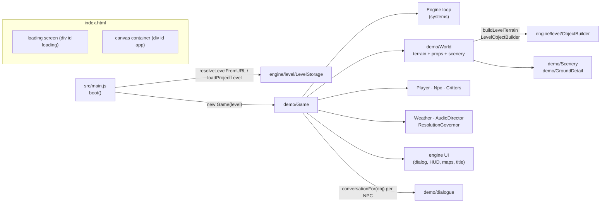
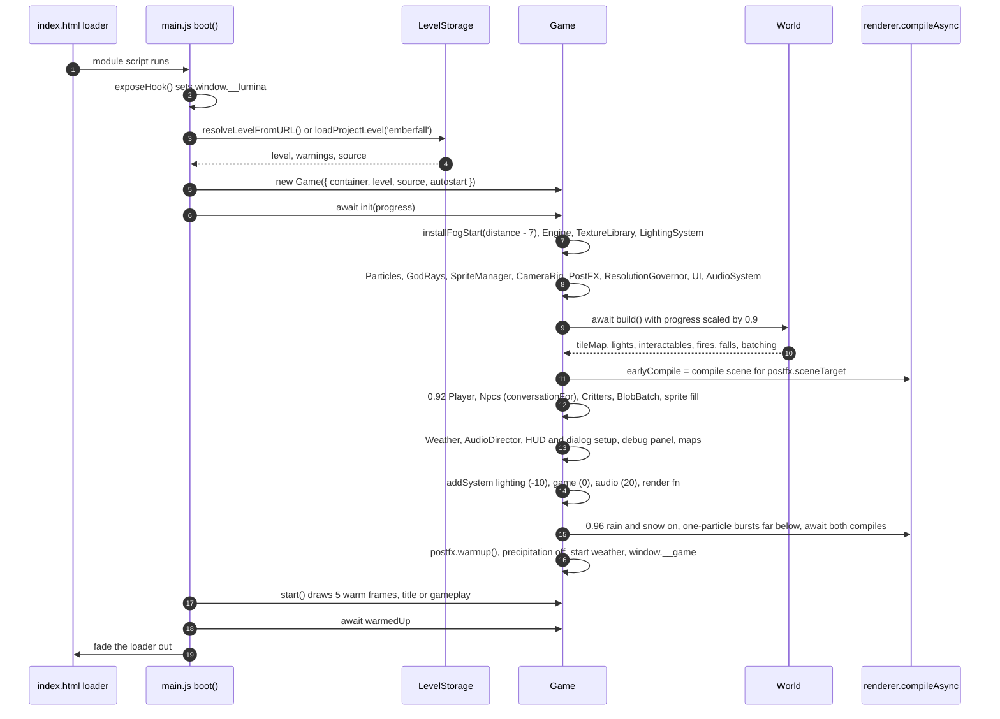
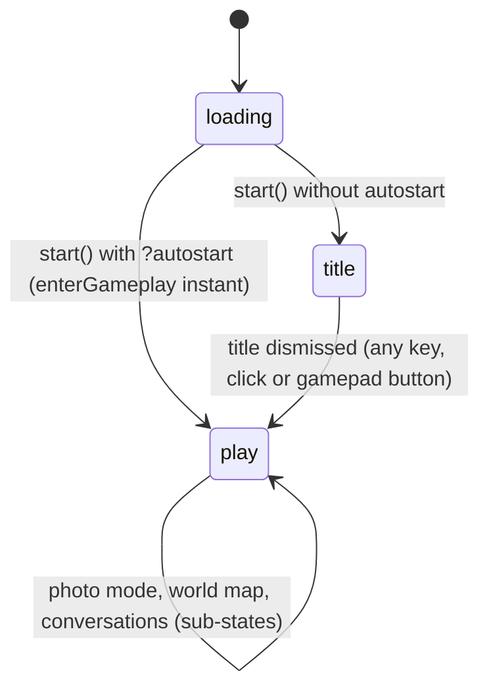
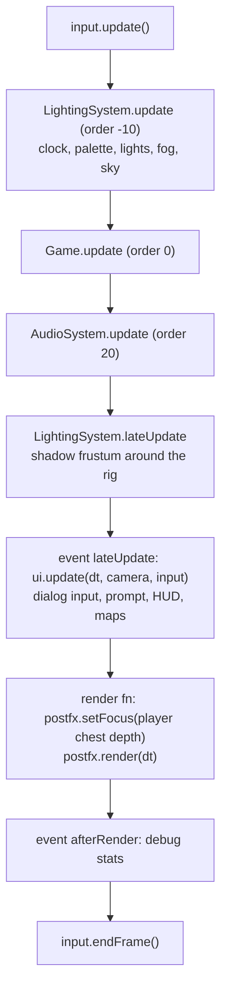
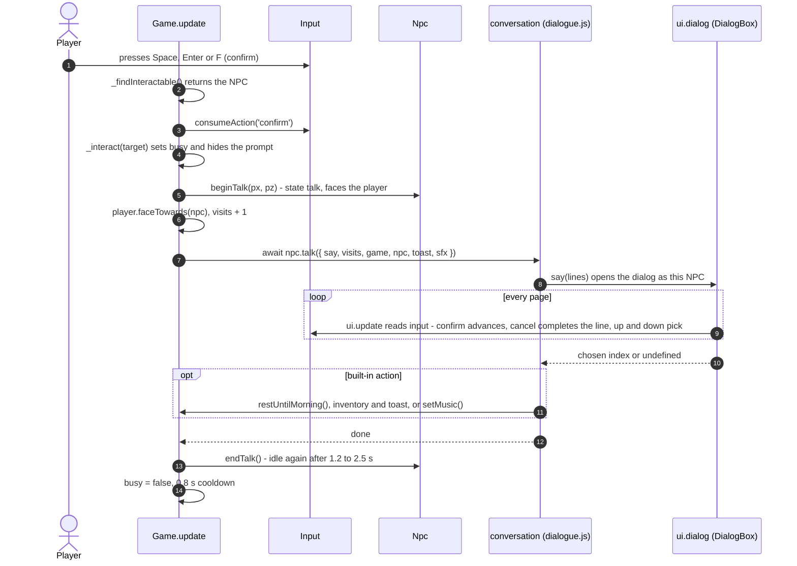

# Game architecture — `src/main.js` + `src/demo/`

> **Purpose.** How the playable game is put together: how a level file becomes a running HD-2D
> diorama, what runs every frame and in which order, how the player, villagers, critters,
> conversations, weather, ambience and the performance governor work, and which tunables live
> where. Read this before changing anything in `src/demo/` or `src/main.js`.
>
> **Audience.** Developers and AI agents working on gameplay, level loading, the demo's look or
> its performance.
>
> **Source of truth.** [`src/main.js`](../../src/main.js),
> [`src/demo/Game.js`](../../src/demo/Game.js), [`src/demo/World.js`](../../src/demo/World.js),
> [`Player.js`](../../src/demo/Player.js), [`Npc.js`](../../src/demo/Npc.js),
> [`Critters.js`](../../src/demo/Critters.js), [`dialogue.js`](../../src/demo/dialogue.js),
> [`Weather.js`](../../src/demo/Weather.js), [`WeatherLook.js`](../../src/demo/WeatherLook.js),
> [`AudioDirector.js`](../../src/demo/AudioDirector.js),
> [`ResolutionGovernor.js`](../../src/demo/ResolutionGovernor.js),
> [`Scenery.js`](../../src/demo/Scenery.js), [`GroundDetail.js`](../../src/demo/GroundDetail.js),
> [`SnowCover.js`](../../src/demo/SnowCover.js), [`AtmosphereFog.js`](../../src/demo/AtmosphereFog.js),
> [`DebugControls.js`](../../src/demo/DebugControls.js), [`config.js`](../../src/demo/config.js),
> [`levels.js`](../../src/demo/levels.js) and the combat modules in
> [`src/demo/combat/`](../../src/demo/combat/) ([§15](#15-combat-combat-levels-only)).
> Where this page and the code disagree, the code wins.
>
> **Related.** [OVERVIEW.md](OVERVIEW.md) (the whole system) ·
> [RENDER_PIPELINE.md](RENDER_PIPELINE.md) · [PERFORMANCE.md](PERFORMANCE.md) ·
> [EDITOR.md](EDITOR.md) · engine modules: [level](modules/level.md), [world](modules/world.md),
> [lighting](modules/lighting.md), [ui](modules/ui.md), [core](modules/core.md) ·
> [specs/LEVEL_FORMAT.md](../specs/LEVEL_FORMAT.md) (every level field) ·
> [specs/AUTOMATION_API.md](../specs/AUTOMATION_API.md) (`window.__game`, `window.__lumina`) ·
> [specs/INPUT_AND_CONTROLS.md](../specs/INPUT_AND_CONTROLS.md) ·
> [user/PLAYING_THE_GAME.md](../user/PLAYING_THE_GAME.md) · binding contract:
> [contracts/LEVEL_EDITOR.md §5](../contracts/LEVEL_EDITOR.md) and [ARCHITECTURE.md](../../ARCHITECTURE.md).

---

## 1. The big picture

The game is a thin layer over the engine (`src/engine/`, public API in
[`src/engine/index.js`](../../src/engine/index.js)). It plays **any** `lumina-level` JSON file.
The only Emberfall-specific pieces are the default level name (`DEFAULT_LEVEL = 'emberfall'` in
`main.js`), the eight hand-written conversations in `dialogue.js`, and a few tunables that were
tuned on Emberfall but apply to every level (`config.js`, `AUTO_BOUNDS_MARGINS` in `Game.js`, the
automatic tree-kind mix in `Scenery.js`).

| Layer | Owns | Does not own |
| --- | --- | --- |
| `src/main.js` | URL → level resolution, the loading screen (progress bar, error screen with links), `window.__lumina` | anything that renders |
| `Game` | wiring of every engine module, modes (loading / title / play), input shortcuts, interaction and dialogue flow, camera framing, maps, `window.__game` | how the world is built |
| `World` | building the level into the scene and wiring every `BuiltObject` (lights, emissives, emitters, colliders, walk surfaces, updaters), scenery, foliage, snow cover, big-level batching | actors, input, UI |
| `Player`, `Npc`, `Critters` | movement, behaviour and animation of sprites | camera, dialogue text |
| `dialogue.js` | conversation scripts and the built-in NPC actions | where NPCs stand (level data) |
| `Weather` | time-of-day glides, weather blending (light, fog, wind, grade, particles, lamps, water, snow) | the 24 h palette itself (`LightingSystem`) |
| `AudioDirector` | the ambience mix (wind, birds, crickets, fire, water) | synthesis (`AudioSystem`) |
| `ResolutionGovernor` | pixel budget and dynamic render scale | post-processing itself |
| `combat/CombatSystem` (combat levels only) | the combat clock, the player kit, enemies, hits, loot, checkpoints, chests, the boss arena, combat feedback, battle music, the combat HUD values, `window.__game.combat` ([§15](#15-combat-combat-levels-only)) | peaceful levels (never created there) |

---

## 2. Entry point: `src/main.js`

`boot()` runs once per page load:

1. `exposeHook()` installs `window.__lumina` = `{ storage: { saveLocalLevel, loadLocalLevel,
   listLocalLevels, loadProjectLevel, PLAYTEST_SLOT }, playLocal(level, slot = 'test', query =
   'autostart=1') }` — a test hook that stores a (possibly partial) level in browser storage and
   reloads the tab on `?level=local:<slot>`.
2. `progress(0.03, 'Reading the map')`, then `loadLevel()`:
   `resolveLevelFromURL(location.search)` (see the table), else `loadProjectLevel('emberfall')`.
3. Load failures become a user-facing error `Could not load <what>: <why>` (`err.levelLoad =
   true`). A missing project level is normally caught by `loadProjectLevel` itself, which treats
   a non-OK response or an HTML answer (the dev server answers unknown paths with `index.html`) as
   `Level "<name>" not found`. A missing browser slot gives `No level "<slot>" in this browser's
   storage`. `main.js` rewrites a `SyntaxError` as follows. If the request was not a `local:` slot
   and the error text looks like HTML, the message becomes "`levels/<slug>.json` does not exist".
   Otherwise it becomes "the file is not valid level JSON (…)". Any failure of `boot()` (a load
   error or an exception while building the game) then switches the loading screen to `.is-error`,
   shows the message and offers links: **Play Emberfall** (only when another level was requested),
   **Play Cinderwatch Pass** (unless that is the level that failed) and **Open the level editor**. Load errors are logged with `console.warn`, other failures with
   `console.error`.
4. A blank level name becomes `Untitled`; normalisation warnings and `validateLevel` problems go
   to the console as `[Lumina] <source>: …` (they never stop the game).
5. `new Game({ container: #app, level, source, autostart })`, `await game.init(progress)`,
   `game.start()`, `await game.warmedUp` (five real frames drawn behind the loader), then
   `window.__lumina.loadMs` (navigation start → first gameplay frame) is set and the loader fades
   out (`is-done`, removed after 900 ms). `window.__lumina` also carries `level`, `source` and
   `warnings` once the level is loaded.

| URL query | Level loaded | `source` string |
| --- | --- | --- |
| *(none)* | `public/levels/emberfall.json` | `levels/emberfall.json` |
| `?level=<name>` | `public/levels/<slugify(name)>.json` (dev and production builds) | `levels/<slug>.json` |
| `?level=local:<slot>` | browser storage slot (`localStorage` key `lumina.level.<slot>`); the editor's play-test uses `local:__playtest__` | `local:<slot>` |
| `?autostart=1` (any value but `0`) | skips the title screen (play-tests, the check harness) | — |
| `?debug` or `?autostart` | the `Engine` also exposes `window.__engine` | — |

The canonical description of storage and slugs is
[specs/LEVEL_STORAGE_API.md](../specs/LEVEL_STORAGE_API.md).

---

## 3. `Game` — lifecycle and modes

`Game` ([`src/demo/Game.js`](../../src/demo/Game.js)) is constructed with a **normalised** level
(`LevelFormat.normalizeLevel` / the `LevelStorage` loaders). The constructor only derives
configuration; `init()` builds everything; `start()` begins the loop.

### 3.1 Construction (no GPU work)

- **Camera framing** `this.camera` = `CAMERA` from `config.js` merged with
  `environment.camera`: `distance` (default 30, clamped 8–80), `pitch` (default 32°, clamped
  10–80), `minDistance = min(18, distance)`, `maxDistance = max(42, distance)`, fov 28.
- **Focus bounds** `_resolveCameraBounds(environment.camera.bounds)`: three rects `near / mid /
  far` (one rect or `{ near, mid, far }` in the file; swapped min/max are accepted). Without
  bounds they are computed from the walkable area (`computeCameraBounds(level, 0)`) shrunk by
  `AUTO_BOUNDS_MARGINS` — Emberfall's hand-tuned margins (near `x 1.8, north 0.5, south 0.8`,
  mid `3.5 / 0.5 / 2`, far `4.5 / 1 / 3`).
- **High ground** `environment.highGround = { minY, pitch }`: above `minY` the gameplay pitch
  becomes `pitch` (Windmill Hill tilts down a little).
- **Title camera** `environment.titleCamera` (`x, z, y, driftX, driftZ, distance`). The fallbacks
  are:
  - position: the middle of the mid bounds, at the most common walkable height (`_typicalGround()`)
    plus 0.5;
  - drift: `min(7, ¼ of the mid-bounds width)` and `min(5, ¼ of its depth)`;
  - distance: `clamp(max(level.width, level.depth) × 0.8, 22, 35)` (the level size in tiles); any
    distance, given or computed, is finally clamped to 8–80.
- `regions` = every `region` object (HUD plate, arrival banners, world-map names).
- State: `mode` (`'loading' | 'title' | 'play'`), `photoMode`, `mapOpen`, `busy` (a conversation
  or fade is running — the player is frozen), `inventory` (`{ apples: 0 }` plus shop items; a
  null-prototype object, since item names are level data), `visits` (per-NPC talk counter),
  `warmedUp` (a promise).
- **Combat** `combatEnabled = levelHasCombat(level)` (`environment.combat === true`, or not
  `false` and the level has an `enemy` object); `combat = null` until `init` creates the
  `CombatSystem` ([§15](#15-combat-combat-levels-only)). Peaceful levels never create it.

### 3.2 `init(onProgress)` — build order

Step by step (progress fractions are those shown on the loading bar):

| Progress | Label | Work |
| --- | --- | --- |
| — | — | `installFogStart(camera.distance − 7)` patches three's `fog_vertex` chunk **before any material compiles** (see [§11.4](#114-atmospherefogjs--fog-that-starts-in-front-of-the-player)). |
| — | — | `Engine({ container, maxPixelRatio: 1.25 })`; `TextureLibrary({ seed: 1337, anisotropy: 4 })`; `LightingSystem(engine, { timeOfDay: environment.timeOfDay ?? 17.2 (wrapped into 0–24), shadowExtent: 26, sunPath: SUN_PATH, moonPath: MOON_PATH, keyframes: DEFAULT_KEYFRAMES + KEYFRAME_OVERRIDES })`, `sky.lowerClouds = 0.25`, `timeSpeed = environment.clock === false ? 0 : TIME_SPEED`, clock **paused** until gameplay. |
| — | — | `Particles(scene)`, `GodRays({ gain: 0.2 })`, `SpriteManager(camera)`, `CameraRig(camera, { ...camera, yaw: 0, lookAhead: 1.3 })` with `bounds = mid`. |
| — | — | `PostFX(renderer, scene, camera, { maxTaps: 64, samples })` — 2× MSAA when the drawing buffer exceeds 1.8 MP, else 4× — then `_tunePost()` (the demo's DOF / bloom / grade values), a resize listener, `ResolutionGovernor`. |
| — | — | `UI(document.body)`, `AudioSystem({ volume: 0.6 })`. |
| ≈ 0.07–0.79 | World labels (World fraction × 0.9) | `World.build()` ([§4](#4-world--building-a-level-into-the-scene)). Big levels then call `lighting.setShadowDepthRange(60, 45)`. |
| — | — | `earlyCompile = _compileScene()` — the world's programs start compiling in parallel (`KHR_parallel_shader_compile`) while actors are created. |
| 0.92 | Waking the villagers | `Player` (combat levels: the sword and the combat sheet, [§5](#5-player)) (added to the scene and the `SpriteManager`, `lighting.followTarget(player.sprite)`), `_ensureStandingSpawn()`, one `Npc` per `npc` object (sheets cached per preset; a failing NPC is skipped with a warning), `Critters`, the chicken "threats" list, the far-actor throttle (big levels). |
| 0.94 | Sharpening blades | Combat levels only: `await import('./combat/CombatSystem.js')` (dynamic: peaceful levels never download or parse the combat code — Vite puts it in its own chunk; only the import-free `combat/bindings.js` is static), `new CombatSystem({ game })`, `await combat.load()` — enemy sheets, the FX atlas, `FxQuads`, `GroundMarkers` (its height texture bakes in ≤ 6 ms slices), every enemy (and the boss's adds, hidden), the enemies' walk grid (`Nav`, ≈ 20 ms on Cinderwatch) and zones, `UI.useCombatUI(…)` + `ui.enableCombat()`, the combat bindings, `rig.stickZoom` ([§15](#15-combat-combat-levels-only)). |
| — | — | `BlobBatch` (big levels and combat levels), `registerEmissive(sprite.material, SPRITE_FILL)` on every character, critter and enemy sprite, `makeShadowOnly(shadowProxy)` on big levels and combat levels, `Weather`, `AudioDirector`. |
| — | — | HUD (`setControls`; combat levels then `combat.setupUI()`: the combat legend, vitals and skill slots), `setLocation(name, subtitle)`, prompt key hint `Space`, dialog speed 55 chars/s with a `blip` on every second non-space character, `buildDebugControls(this)`, `_setupMaps()` (combat levels end it with `combat.attachMaps(map)`: enemy dots, chest markers only once discovered, the boss marker). |
| — | — | Frame wiring ([§3.4](#34-the-frame)). |
| 0.96 | Warming up the lanterns | Rig snapped to the player; rain and snow intensity forced to 1; one `particles.update`; one-particle `splash` / `sparkle` (only when a waterfall splashes) and `footstep` bursts at y = −1000 (their pools are created on first use); combat levels: `combat.warmup(far)` (combat textures, one FX quad and one marker far below, one particle of every combat burst); `await earlyCompile`; `await _compileScene()`; `postfx.warmup()`; precipitation back to 0; the level's starting weather applied instantly; `_exposeGlobal()`. |
| 1 | Ready | `loadStats = { engine, world, characters, compile, map }` (milliseconds). |

> **Why compile against `postfx.sceneTarget`?** three.js keys programs by the render target they
> draw into. The scene renders into PostFX's linear HDR target; compiling for the canvas would
> build unused sRGB variants and leave the real ones to stall the first frame (or the first rain).
> See [RENDER_PIPELINE.md](RENDER_PIPELINE.md) and the invariant in [CLAUDE.md](../../CLAUDE.md).

### 3.3 Modes: title and gameplay

- `start()` sets `_warmFrames = 5` and starts the engine loop. During those frames `update()`
  keeps rain and snow at full intensity, because ANGLE finishes some programs only at their first
  real draw and the shadow-depth variants are built by the shadow pass; the fifth frame calls
  `combat.endWarmup()` (frees the warm instances, records `programsAtLoad`) and resolves
  `warmedUp`.
- **Title** (`showTitle`): `mode = 'title'`, the player's x-ray silhouette off, clock paused, the
  rig follows a drifting cinematic target (`_updateCinematic`: slow sine drift, yaw ±18°,
  distance ±3). `ui.title.show({ title, subtitle, prompt, credit })` uses `environment.title`
  (defaults: the level name in capitals, `level.subtitle` or "A Lumina HD-2D Level", "Press any
  key", "Lumina HD-2D Engine · three.js"). A level loaded from `levels/<slug>.json` whose slug is
  one of `SHIPPED_LEVELS` ([`levels.js`](../../src/demo/levels.js)) also passes
  `destinations: SHIPPED_LEVELS, current: slug` (the ◂ label ▸ row); when the title resolves on
  another destination the page navigates to `?level=<destination>` (other query parameters kept,
  `autostart` dropped). Dismissing it unlocks WebAudio and calls `enterGameplay()`.
- **Gameplay** (`enterGameplay({ instant })`): `mode = 'play'`, silhouette on, clock running, rig
  on the player at yaw 0 and the level pitch / distance. `instant` (autostart) snaps the camera
  and DOF and arms a one-shot audio unlock on the first key / pointer press (which also starts
  the music — unless that key is the music key itself). Otherwise the music starts right away
  (`environment.music !== false`). After 0.2 s (instant) or 0.9 s the level banner shows for
  3.2 s and the controls legend appears.

### 3.4 The frame

The engine's loop order (see [modules/core.md](modules/core.md)) with the game's systems:

`Game.update(dt)` runs these steps, in this order:

1. **Talk cooldown** ticks down (`TALK_COOLDOWN = 0.8` s after a conversation, during which
   confirm cannot start a new one).
2. **Shortcuts** (only in `play`):
   - `debug` toggles the debug panel, even with the map open or during a conversation.
   - `map` opens the world map, except while talking or in photo mode. `map` or `cancel` closes it.
   - With the map closed, `help` toggles the legend.
   - With the map closed and no conversation running: `photo` (or `cancel` in photo mode), `time`
     (`cycleTime`), `weather` (`cycleWeather`) and `music` (toggle + toast). On combat levels the
     pad's photo button is an LS click (`photoPad`), ignored while the move vector is longer than
     0.35 and for 0.3 s after.

   `cancel` is bound to **Escape and Backspace** (`Input.DEFAULT_BINDINGS`), so Backspace also
   closes the map and leaves photo mode. All bindings:
   [specs/INPUT_AND_CONTROLS.md](../specs/INPUT_AND_CONTROLS.md).
3. **Player and combat**: `active = playing && !talking && !mapOpen && !photoMode`;
   `frozen = !playing || talking || mapOpen || (combat && (photoMode || combat.locksPlayer))` (the
   extra term only exists on combat levels); `combat.update(dt, active)` (input → player action,
   enemies, projectiles, hits, in sub-steps); `player.update(dt, input)` (locomotion only while no
   combat action runs); `combat.afterPlayer(dt, active)` (separation, arena clamp, pickups,
   checkpoints, dormancy, lock-on / boss focus, engagement, music, HUD, labels, minimap);
   silhouette brightness `lerp(1, 0.5, nightFactor)`.
4. **Interaction prompt** (play, not talking, not photo, map closed, no combat lock): `_findInteractable()`;
   show the prompt over the NPC (`Talk`, 2.35 u up, 1.9 for the `child` preset) or at the
   object's prompt point with its label; on `confirm` (and no cooldown) the press is consumed
   (`input.consumeAction('confirm')`, so the dialog does not also see it) and `_interact()`
   starts.
5. **Villagers and critters**: every NPC `update(dt, ctx)`; on big levels far actors are
   throttled ([§6.4](#64-far-actor-throttling-big-levels)). `critters.update(dt, { player, threats })`.
6. **Camera**: `rig.inputEnabled = playing && !talking && !mapOpen`; title → `_updateCinematic`,
   play → `_updatePlayCamera` ([§3.6](#36-camera-framing)); `rig.update(dt, input)`;
   `spriteManager.update(dt)`; `blobs.update()`.
7. **World and atmosphere**: the `dust` emitter follows the camera focus
   (`focus + (0, 1.2, −2)`); `weather.zoomFog = clamp(((distance₀ − 7) / (distance − 7))², 0.4, 1)`;
   `weather.update(dt)`; `combat.applyLook(dt)` (the combat grade / DOF offsets on top of what
   Weather wrote); warm-frame bookkeeping; `world.update(dt, { focus, camera })` (animated
   props, water, the light pool, big-level particle culling); `godRays.update`; `_waterfallFx`
   (a `splash` burst ×4 every 0.28 s and a `sparkle` ×2 every 0.9 s at every splashing waterfall
   within 30 u of the focus); `particles.update`; `resolution.update`.
8. **HUD and audio**: clock (`hud.setTime`), region plate and banners (`_updateRegion`, every
   0.3 s), minimap / world map (`_updateMaps`), `audioDirector.update(dt, playerPosition)`.

### 3.5 Interactions and the conversation flow

`_findInteractable()` scores every NPC (at its `interactPoint`: the NPC, or its `talkOffset` /
`talkPoint`) and every world interactable (doors, signs, wells, chests, waystones —
[§4.3](#43-interactables-fires-and-falls)); an interactable with `disabled` set (an opened chest)
is skipped:

- skip when farther than its radius (NPC `talkRadius` ?? `INTERACT_RANGE` 1.6; object `radius`)
  or more than 1.3 u above / below the player;
- beyond 0.55 u it must be roughly in front: `dot(facing, direction) ≥ 0.25`;
- an object with a `lookSpan` (house doors: the door leaf, edge to edge) has a second target
  inside the same reach: the nearest point of that segment counts when the player faces it within
  60° (`SPAN_FACING` = 0.5), scored `distanceToThatPoint − 0.7 × dot`, and the object keeps the
  better of its two scores. A player who walks on into a door stops at the wall with the door-step
  point behind them — the leaf in front still shows *Knock* (straight on and at up to ≈ 60°
  diagonals). NPCs never use a span;
- lowest `distance − 0.7 × dot` wins. The returned object is reused — copy its fields.

`_interact(target)` sets `busy`, hides the prompt, and runs the conversation (the player turns
toward the NPC, the object's position, or — for a door — the nearest point of its leaf); objects
simply show their text (`{ speaker, lines, sfx? }`, "Nothing of note." when empty) — unless the
item has an `onInteract(game, it)` (combat levels: waystones rest, chests open), which is awaited
instead. `finally` always ends the
NPC's talk state, clears `busy` and starts the cooldown, so a throwing script never locks the game.

`say(lines, opts?)` opens `ui.dialog` with `speaker = opts.speaker ?? npc.name` and the NPC's
`portraitColor`; lines are strings or `{ text, choices }`; `{word}` renders in gold. The promise
resolves with the last chosen index (or `undefined`).

`talkTo(id)` (automation) works as follows:

1. It closes the world map.
2. It looks for a clear spot next to the NPC's interact point. The candidate offsets are tried in
   this order: left / right (±1.15, 0), the two front diagonals (±0.85, +0.85), in front
   (0, +1.15), behind (0, −1.15). A spot is clear when the point and four probes 0.32 u around it
   are walkable, and its ground is within 0.3 u of the interact point's ground height.
3. It teleports there (no teleport when no spot is clear), faces the NPC and calls `_interact`.

It returns `false` for an unknown id, or while busy, a dialog is open, the mode is not `play`, or
photo mode is on.

`restUntilMorning()` (the `rest` action and the innkeeper): fade out 1 s → `weather.setTime(8)`
→ chime → 0.7 s → fade in 1.1 s → toast "You feel well rested."

### 3.6 Camera framing

- **Zoom-dependent focus bounds** (`_updateCameraBounds`): the rig's focus rect is interpolated
  near ↔ mid between `minDistance` and the level distance, mid ↔ far between the level distance
  and `maxDistance`. So the player stays in frame (and in the DOF band) right up to the map edges
  whatever the zoom.
- **High ground**: pitch target = `highGround.pitch` while `player.y > highGround.minY`, else the
  level pitch.
- **Edge-aware yaw**: near the west edge, the negative yaw limit shrinks smoothly from −60° to
  −10°; near the east edge, the positive limit shrinks from +60° to +10°. The band starts
  `e0 = min(9, W / 5)` tiles from the edge and is fully applied at `e1 = e0 × 5/9`. This keeps the
  camera from swinging out over the border forest. Away from the edges this code applies no clamp.
  Neither the high-ground pitch nor the edge clamp runs in photo mode (only the focus bounds do).
- **DOF focus** while playing = view depth of the player's chest (`y + 0.9`)
  (`_playerFocusDistance`), not the bounds-clamped rig focus.
- `teleport(x, z)` snaps to the nearest standable point within 3 u (rings every 0.25 u) or
  returns `null`, then updates bounds, snaps the rig, `lightPool.snap()`s the lights and snaps the
  DOF. `_ensureStandingSpawn()` handles a spawn on water / walls / off the map: it first tries the
  same 3 u ring search around the spawn, then the ring search around the nearest walkable tile
  centre that yields a standable spot, and moves the player there with a console warning.

### 3.7 Time, weather, photo mode, music, maps

| Feature | API | Notes |
| --- | --- | --- |
| Time | `cycleTime()` (T), `setTime(h)` | `Weather.cycleTime` glides 2 s forward to the next preset (6.5 Dawn, 12.5 Midday, 17.2 Golden Hour, 18.9 Dusk, 22.5 Night) and toasts its name. `setTime` ignores non-numbers. |
| Weather | `cycleWeather()` (R), `setWeather(name)` | `clear → rain → snow → clear`, blended ([§9](#9-weather--time-glides-and-weather-blending)). |
| Photo mode | `togglePhotoMode({ instant })` (P, leave with P or `cancel`) | Refused while busy, in a dialog, outside play or with the map open — and on combat levels while engaged or dead (toast "Not while foes are near"), where photo mode also freezes the player and pauses combat. From the keyboard a toast shows, the UI hides 1.2 s later; `instant` (automation) hides it at once. |
| Music | `setMusic(on)` (M) | `AudioSystem.startMusic/stopMusic`; `environment.music === false` keeps a level silent at start. On combat levels `setMusic(true)` starts the track combat wants (`combat.musicTrack`: `emberfall`, `battle` or `boss`). |
| Minimap / world map | `toggleMap(open)` (N / Tab, gamepad Back) | `renderLevelMap(level)` is painted once at load (`_setupMaps`); minimap `view: 34`, disabled by `environment.minimap === false`; the world map shows regions and markers (NPCs, interactables, fires; combat levels: enemy dots, waystones, discovered chests, the boss) and only opens in play, not during a conversation or photo mode (combat levels: nor while dead or in the boss intro; it pauses combat and releases the lock-on). While it is open the player stands still, but the clock and villagers carry on. |
| Regions | `_updateRegion` | Every 0.3 s: the first `region` containing the player (and above its `minY`, if set) sets the HUD plate (`name`, `sub` or the level name); a `banner` shows once per play session. Between regions the last plate stays. |

### 3.8 Debug panel and automation hooks

- **Debug panel** (`` ` `` / F1, only in play): `buildDebugControls(game)` fills the engine's
  lil-gui `DebugPanel` with folders **Time & Weather**, **Post FX** (Depth of field, Bloom, Grade,
  Split toning & vignette colour), **Lighting**, **Camera**, **Atmosphere** and **Render**
  (render scale — setting it makes the resolution governor manual —, dynamic resolution, stats
  overlay, photo mode). Lighting / atmosphere sliders edit `weather.tuning`, the base values the
  weather multiplies on top of, so the panel and the weather never fight.
- **`window.__game`** (set at the end of `init`; typed by `GameHooks` / `GameState` above
  `_exposeGlobal`, which the object is type-checked against): `engine, rig, postfx, lighting, ui, audio,
  tileMap, textures, particles, godRays, player, npcs, world, weather, game, level, levelSource`
  plus `setTime, teleport, talkTo, setWeather, cycleTime, cycleWeather, setMusic, photo(on), map(on),
  state()`. `state()` returns mode, level, player (position, tile, facing, animation, speed),
  region, time, phase, night, weather, dialog / busy / photo / map flags, music, audioReady,
  `nearest` interactable id, `drawCalls` / `triangles` (PostFX scene info — the scene incl. the
  shadow pass, not the post passes), fps, `pointLights`, `activeLights`, `renderScale`,
  `pixelRatio`, `gpuMs`, camera and inventory — plus, on combat levels only, `combat` (the combat
  state) and `window.__game.combat` (the combat test hooks). Canonical reference:
  [specs/AUTOMATION_API.md](../specs/AUTOMATION_API.md).
- `dispose()` cancels timers and the audio-unlock listeners, stops the engine and disposes
  everything in reverse order (the combat system first, then the game objects while the renderer
  is alive, then the engine and the UI); each step is isolated in `try/catch`.

---

## 4. `World` — building a level into the scene

[`src/demo/World.js`](../../src/demo/World.js) turns a normalised level into meshes, lights,
particles and gameplay anchors. The per-object geometry comes from the engine's
[`ObjectBuilder.js`](../../src/engine/level/ObjectBuilder.js) — **the same builders the editor's
3D preview uses** ([EDITOR.md §10](EDITOR.md#10-how-the-editor-stays-in-sync-with-the-game)).

### 4.1 Build phases

`build(onProgress)` is `async`: between phases it yields a macrotask (`setTimeout(0)`) so the
loading screen keeps animating; `stats.phases` records the CPU milliseconds of each phase (yields
excluded).

| # | Label (World progress) | Phase key | What happens |
| --- | --- | --- | --- |
| 0 | — | — | `batching = World.isBigLevel(level) ? { ...BIG_LEVEL_BATCHING } : null` (`max(width, depth) > 64`). |
| 1 | Painting textures (0.08) | `textures` | `textures.preload()` — every procedural texture painted up front. |
| 2 | Raising the land (0.18) | `terrain` | `buildLevelTerrain(level, { chunkSize: big ? 32 : 64, deferShore: true })` → `TileMap` + `Water`. Big levels: the opaque casting faces (`isProxyCaster`) get merged shadow-only proxies (`buildShadowCasters`, name `terrain:shadow`) and stop casting themselves; then `tileMap.consolidateChunks({ maxTriangles: 48000, maxExtent: 48, minTriangles: 12000 })`. |
| 3 | Building the village (0.30–0.44) | `props` | `LevelObjectBuilder({ seed: 42 })`; the `*_buildProps()` generator builds every buildable object except trees and waterfalls, yielding about every 12 ms; each result is wired ([§4.2](#42-the-builtobject-wiring)); houses / signposts / wells / campfires register interactables and anchors. |
| 4 | Planting the forest (0.45) | `trees` | Level trees built (colliders kept unless `collider: false`, not added individually), then — on big levels — `water.refreshAsync()` starts the shore bake in a worker; `_buildTrees()` scatters the forest border and outer forest and merges everything ([§4.5](#45-scenery-forest-border-outer-forest-outer-ground)). |
| 5 | Letting the water run (0.58) | `water` | `_buildWaterfalls()`; small levels bake the shore now (`water.refresh()`), after every collider standing in water exists. |
| 6 | Growing the meadow (0.68) | `foliage` | `_buildGroundDetail()` ([§4.6](#46-ground-foliage-grounddetailjs)). |
| 7 | Lighting the lanterns (0.80) | `lights` | `_wireLights()` (the `LightPool`, [§4.4](#44-lights-emissives-and-emitters)) and `_buildAtmosphere()` (dust, particle areas, god rays). |
| 8 | Merging meshes (0.88) | `merge`, `shoreWait` | `_mergeProps()` → `factory.mergeStatic(results, { name: 'village:static', …split, shadowCasters })`; a big level then awaits the shore worker (re-baking once more if a collider changed meanwhile). |
| 9 | — | `snow` | `addSnowCover` on terrain meshes, the outer ground (`'ground'`), foliage fields (`'foliage'`) and merged roof materials (`ROOF_MATERIAL` = `/^lumina:roof/`, exported by `SnowCover.js`). |
| 10 | — | `culling` | Big levels only: `cullByBox` on terrain meshes, merged prop meshes, tree groups and foliage fields (the foliage with `pad: 0.8`). |

Afterwards `stats` holds `buildMs`, `colliders`, `pointLights`, `objects`, `batching`,
`terrainMeshes` (big), `trees { village, border, outer }`, `foliage`, `lightDescriptors`,
`lightsPooled` and `phases`.

### 4.2 The `BuiltObject` wiring

`LevelObjectBuilder.build(obj, tileMap)` returns a `BuiltObject` (or `null` for actors and
markers). `World._build()` wires every field (a builder exception is logged and the object is
skipped — a broken object never stops the level):

| `BuiltObject` field | Consumer |
| --- | --- |
| `object` | added to `World.root` (except level trees, which are only merged) |
| `propResult` | pushed to `results` for `PropFactory.mergeStatic` (not for `light` / `waterfall`, not for trees) |
| `colliders` | `tileMap.addCollider(c)` (circles and boxes; queried through a spatial grid) |
| `walkRects` | `tileMap.addWalkSurface(r)` (bridge decks) |
| `emissives` | `lighting.registerEmissive(material, { day ?? 0, night ?? 1.6 })`, once per material; the entry gets `baseDay` so the weather can light windows on grey days |
| `lights` | collected as descriptors for the light pool (tagged `<type>:<id>`, `priority` from `LIGHT_PRIORITY`, other types 3; a house's door lantern only when `obj.light` is set) |
| `emitters` | `particles.createEmitter(e)` — `smoke` gets the softer, greyer `SMOKE` look; waterfall mist gets `count = max(4, round(8 × width))`, `alpha 0.07` (overridable per waterfall with `mist: { count, alpha }`) |
| `update` | pushed to `updaters`, called every frame (windmill sails, waterfalls) |
| `interact` / `anchor` | door positions (with the door leaf, `interact.lookSpan`), well / sign anchors, campfire and waterfall anchors |

### 4.3 Interactables, fires and falls

| Level object | Registered as | Radius | Label | Text |
| --- | --- | --- | --- | --- |
| `house` with a non-empty `text` | id `door:<id>`, kind `door`, at the builder's door-step point (0.9 in front of the wall collider), `lookSpan` = the door leaf ([§3.5](#35-interactions-and-the-conversation-flow)) | 1.0 (set here; the prop's own `interact.radius` 1.1 is unused) | Knock | `text` lines, no speaker |
| `signpost` with `text` | kind `sign`, at the anchor | 1.35 | Read | speaker `obj.speaker ?? 'Signpost'` |
| `well` with `text` | kind `well`, prompt 4.2 u above and 0.3 u north | 1.75 | Look | sfx `obj.sfx ?? 'splash'` |
| `campfire` | `fires[]` (ambience, minimap), `anchors.campfire` = first | — | — | — |
| `waterfall` | `falls[] = { id, x, z, width, dir, anchor, splash }` (spray, roar) | — | — | — |

A house without text has **no interactive door** (the editor's level check warns about it).

### 4.4 Lights, emissives and emitters

**Point lights** go through the engine's [`LightPool`](../../src/engine/lighting/LightPool.js)
with `MAX_POINT_LIGHTS = 12` (`World.js`):

1. Descriptors are sorted by `priority` (`LIGHT_PRIORITY` in `ObjectBuilder.js`: campfire 0,
   `wallTorch` / `light` 1, lamppost 2, house door lantern 3; any other type 3), ties by level
   order.
2. Hand-edited numbers are sanitised when they are present. `intensity` is clamped to 0–200,
   `distance` to 0.5–100 and `flicker` to 0–1. An invalid value falls back to 8 / 8 / 0.2. An
   absent value keeps the `LightingSystem.addPointLight` default (intensity 8, distance 8,
   flicker 0.3). `nightOnly` defaults to `true`. A `light`
   object gets its own builder defaults: intensity 8, distance 8, flicker 0.2, colour `#ffb46b`,
   1.5 u above the ground (`dy`).
3. `new LightPool(lighting, descs, { size: 12 })` then works in one of two modes:
   - **static mode** (≤ 12 descriptors): one permanent light per descriptor, created in order. A
     small level looks exactly as it did with hand-created lights.
   - **pooled mode** (> 12): every 0.2 s the pool hands its 12 lights to the best-scoring
     descriptors. Only descriptors whose light sphere (range + 4 u margin) touches the camera
     frustum take part. The score is distance to the focus plus `priority × 1.5`
     (`priorityWeight`), with a bonus of 2 for lights already lit (hysteresis) and a penalty of up
     to 10 for lanterns that are dark by day. A light that changes owner fades out and in again
     (0.35 s each way).

   `World.lights` holds the pool's handles. `World.update()` calls
   `lightPool.update(dt, { focus, camera })`.

> **Invariant.** The point-light count is fixed after the first frame: `min(12, light descriptors)`
> in the game (a level with 5 light descriptors has exactly 5 point lights, one with 30 has 12), always 12
> in the editor preview (the same `LightPool`, created with `fixed: true`). Adding or removing a light or toggling `light.visible` recompiles every
> lit shader. Fade intensities instead.

**Atmosphere** (`_buildAtmosphere`):

- `dust` (unless `environment.dust === false`): a 20 × 4.5 × 16 box of 120 motes that the game
  moves with the camera focus every frame;
- every `emitter` object: `createEmitter({ ...params, preset, bounds, count })` with `dy`
  (default 1.2, −5…30) above the ground, `size` default `[8, 2.4, 8]` (clamped), `count` default
  30 (1–1000); failures are logged and skipped; kept in `areaEmitters` (driven by the weather)
  and `emitters[id]`;
- god rays (unless `environment.godRays === false`): `environment.godRayAreas`, else one area
  over the walkable ground (`_autoGodRayArea`: `computeCameraBounds(level, 1)`, the most common
  walkable height, `count = clamp(round(area / 90), 1, 6)`, seed 7); each area `count` 0–12
  (default 3).

### 4.5 Scenery: forest border, outer forest, outer ground

[`Scenery.js`](../../src/demo/Scenery.js) makes the diorama read as part of a continuous world:

- `makeOuterHeight(tileMap)` — a height function that continues the map's edge heights, rolls,
  rises into northern hills and far mountain ridges, and gentle hills east / west / south.
- `scatterForest({ tileMap, heightAt, avoid, southGap, kindAreas, seed = 77 })` — deterministic
  placement: **border** trees on every tile whose legend char is `T` (none in the last 3 rows —
  shrubs only there —, one try per tile in the first 3 rows, two elsewhere; from row 9 on, the
  third column from the east / west edge stays open and the second gets 20 % lower trees, so no
  tall tree stands between the north-looking camera and a player walking along the edge) and
  **outer** trees (5200 random candidates in the band up to 34 u around the map: x from −34 to
  W + 34, z from −44 to D + 20.4, clustered by noise and thinning with distance). There are no
  outer trees in the `southGap` band south of the map, and none within 2.5 u of an *open* map
  edge (a run of 3 or more walkable edge tiles). The scatter also keeps clear of the level's own
  trees: each gets an avoid radius of 1.2 u (1.8 u when it stands outside the map), added to the
  new tree's own 0.85–1.5 u radius. Tree kinds follow `environment.forest.areas`
  (`forestKindAreas`, first matching area wins) or the automatic mix: half pines north of z = 6,
  half autumn trees where x > 0.72 W and z > 8, an oak / pine / birch mix elsewhere. Kinds never
  change positions: the random sequence is the same with or without kind areas.
- `mergeTrees(results, { name, castShadow, maxTriangles, maxExtent, minTriangles })` — merges
  PropFactory trees per material into world space, folding each tree's sway phase into `aPhase`
  and transforming `aCenter`, so merged canopies billboard and sway exactly like separate ones.
- `buildOuterGround()` / `outerGroundSteps()` — a fogged tensor-product heightfield (1 u spacing
  near the map, 2 u then 10 u farther out, extent 170) with a hole where the map is. The generator
  form lets the editor build it in time slices.

`World._buildTrees()` wiring:

| | Small level (≤ 64) | Big level (> 64) |
| --- | --- | --- |
| Level trees + border trees | one `mergeTrees` → `trees:map` | same, split by `treeTriangles 16000` / `treeExtent 96` |
| Outer trees | four quadrant groups `trees:outer:n/s/e/w`, `castShadow: false` (frustum culling skips what is behind) | one `trees:outer` group, k-d split into compact pieces |
| Outer ground | `buildOuterGround()` unless `environment.outerScenery === false` | same |

`environment.border === 'forest'` enables the border trees; `environment.outerScenery !== false`
the outer forest and ground; `environment.scenery.southGap` (default `SOUTH_GAP = 5`) keeps the
meadow south of the map open (the camera looks north).

### 4.6 Ground foliage (`GroundDetail.js`)

`buildGroundDetail()` scatters deterministic `Foliage` fields (one instanced draw call each):
`Foliage:grass` (tuft + tall grass strip), `Foliage:flowers` (red, yellow, white, blue),
`Foliage:reeds`, `Foliage:shrubs` (bush, fern, mushroom, small rock; the only field that casts
shadows). Placement is keyed on the **legend characters** of the built-in tiles:

| Tile char | Foliage |
| --- | --- |
| `g`, `G`, `f` (grassy) | tufts (3, or 5 in dense clumps), tall grass in clumps, flowers (3 per `f` tile, sprinkled elsewhere), shrubs (`shrubAreas` chance, default 0.05), mushrooms / pebbles |
| `T` (forest floor) | 2 tinted tufts per tile, shrubs with chance 0.55 |
| `s` (sand) | reeds next to water, pebbles elsewhere |
| `F` (farmland) | a few weeds |
| `d`, `.` (dirt, path) | sparse tufts |
| `m` (mossy stone) | occasional ferns / pebbles |

Extras: bushes along house walls (not in front of doors), ferns around trees on the map, and
**clearings** around every NPC (radius `min(8, max(0, wander)) + 0.8`) where only short grass
grows. Spots under colliders are rejected by `World._isFreeForFoliage`, a collider-grid query
with 0.1 u around circles and 0.15 u around boxes. It runs before any NPC exists, so villagers'
colliders play no part. The `T`, `F` and `m` scatters skip this test. `environment.foliage`
supplies `seed` (default 2024), `flowerAreas` (tile rects with a palette of frames 0–3) and
`shrubAreas` (tile rects with a `chance`). Big levels cap a field at `foliageInstances` (4000) per
instanced mesh (k-d split; placement unchanged).

> Custom legend characters get **no foliage** and a custom blocked-forest character gets **no
> border trees**, because both are keyed on `g G f T s F d . m`.

### 4.7 Snow cover (`SnowCover.js`)

`addSnowCover(material, 'ground' | 'foliage')` chains an extra `onBeforeCompile` step after the
material's own patch and appends `|lumina-snow-<kind>` to its program cache key. The shared
uniform `snowCover.value` (0–1) whitens up-facing surfaces (`'ground'`) or frosts the upper part
of foliage sprites (`'foliage'`). Programs are built once at load with the uniform always present,
so snowfall never compiles anything. The weather drives the value ([§9](#9-weather--time-glides-and-weather-blending)).
The editor's 3D preview installs the same patches as its materials are created
(`addGroundSnowCover(root, { roofsOnly })` for terrain and prop roofs, `addSnowCover` for the
outer ground and the foliage fields — [EDITOR.md §10](EDITOR.md#10-how-the-editor-stays-in-sync-with-the-game)),
so a weather change there never compiles anything either.

### 4.8 Small and big levels

`World.isBigLevel(level)` (`max(width, depth) > 64`) switches on `BIG_LEVEL_BATCHING`. Levels up
to 64 × 64 must render exactly as they were tuned (Emberfall, Brightwater Crossing, the sample
hamlet).

| Budget (`BIG_LEVEL_BATCHING`) | Value | Used by |
| --- | --- | --- |
| `terrainChunk` | 32 | `buildLevelTerrain` chunk size (small levels: 64) |
| `terrainTriangles` / `terrainExtent` / `terrainMinTriangles` | 48000 / 48 / 12000 | `TileMap.consolidateChunks` |
| `propTriangles` / `propExtent` | 16000 / 64 | `mergeStatic` split |
| `treeTriangles` / `treeExtent` | 16000 / 96 | `mergeTrees` split |
| `minTriangles` | 3000 | batches lighter than this are not extent-split |
| `casterTriangles` / `casterExtent` | 96000 / 64 | shadow-only proxies (`ShadowCasters`) |
| `foliageInstances` | 4000 | `GroundDetail` `maxInstances` |
| `shadowUp` / `shadowDown` | 60 / 45 | `LightingSystem.setShadowDepthRange` (set by `Game`) |
| `particleCull` | 34 | particle areas / smoke / mist farther than this from the focus are disabled |

Game-side big-level extras: far-actor throttling ([§6.4](#64-far-actor-throttling-big-levels)),
`BlobBatch` (every contact shadow in one instanced draw), sprite shadow quads drawn in the shadow
pass only (`makeShadowOnly`). Measured budgets and trade-offs:
[PERFORMANCE.md](PERFORMANCE.md).

---

## 5. `Player`

[`src/demo/Player.js`](../../src/demo/Player.js) is the traveler: `createCharacterSheet({
...CHARACTER_PRESETS.traveler, preset: 'traveler' })`, drawn as a `Sprite3D` with
`CHARACTER_SPRITE_OPTS`, starting at `level.spawn` and facing its `facing`.

| Aspect | Implementation |
| --- | --- |
| Movement | `input.getMoveVector()` (keys + left stick) → world XZ through `rig.getMoveBasis()` (camera-relative). Walk 3.2 u/s, run 5.6 u/s (`run` action), scaled by stick magnitude. |
| Collision | `tileMap.move(position, dx, dz, RADIUS 0.3, maxStep 0.55, out)` — walkability, step height (stairs only enter where heights connect), walk surfaces, colliders (pushed out), map bounds, sliding (full → x-only → z-only). |
| Height | `tileMap.getHeight(x, z)` (stairs ramps, walk surfaces / bridge arches) followed smoothly: `damp(22)` going up, `damp(16)` going down. |
| Facing | 4 directions from the screen-space movement (`sprite.faceVector`); `facing` keeps the world vector for interaction tests and is re-applied while idle so Q / E orbits keep the sprite facing what the prompt refers to. |
| Animation | `walk` / `run` with playback speed from the actual speed (so pushing into a wall walks slowly in place); `idle` at `IDLE_SPEED[0] + 0.04`. |
| Footsteps | `onFrameChange` on frames 0 and 2 of walk / run plays the `step` sfx (volume 0.4 walking, 0.55 running). Its pitch depends on the ground: any walk surface such as a bridge deck 1.25, `cobblestone` / `stone_tiles` / `moss_stone` tops 1.1, `sand` 0.85, anything else 1. Every other step is 6 % lower. Running also bursts 4 `footstep` dust particles. |
| X-ray silhouette | a pale copy of the sprite quad (`MeshBasicMaterial`, `depthFunc: GreaterDepth`, `renderOrder 60`, vertices pulled 1.3 u toward the camera) that draws only where walls, roofs or canopies hide the player. It writes its own depth so the DOF keeps it sharp. `setSilhouetteEnabled(false)` on the title screen changes render states only (no recompile); `setSilhouetteLevel` dims it at night. |
| Combat levels (`combat: true`) | The sheet is `createCharacterSheet({ ...traveler, weapon: 'sword' }, { combat: true })` (18 columns: the 6 locomotion frames plus the combat poses) and the sprite uses the `combatFx` program (hit flash, glow). `action` (a string while the combat core owns the sprite: `update` then only follows the ground and returns before any `play` / face / speed write), `faceOverride` (a unit vector the sprite faces while walking or standing — lock-on strafing, the walk cycle instead of run), `moveOverride` (a world-space move vector replacing the input's — automation), `speedMul` (1), `moveBy(dx, dz)` (`tileMap.move` with radius 0.3, max step 0.55; returns the fraction moved — lunges, rolls, knockback, separation). On peaceful levels all of this stays unused and the player is exactly as above. |

---

## 6. `Npc` — villagers

[`src/demo/Npc.js`](../../src/demo/Npc.js). `npcDef(obj)` (a module function in `Game.js`) turns a level `npc` object into a
definition: `name` (default "Villager"), `preset` (unknown → `villager`), `home`, `wander`
(default 1.2), `speed`, `facing`, `behaviour`, `talkRadius` (≥ 0.5), `talkPoint` (from the
relative `talkOffset`, or the legacy absolute `talkPoint`), `bounds` (from the relative `area`, or
the legacy absolute `bounds`) and `portraitColor` (default `#c9a45c`). Loaded levels are already
normalised, so missing fields carry the **catalog defaults** (`ObjectCatalog` npc defaults: speed
1, wander 1.2, facing down, behaviour wander, action none…) and legacy absolute fields have been
converted to the relative ones; `npcDef`'s own fallbacks (e.g. speed 1.3) only apply to
un-normalised input.

### 6.1 Common mechanics

- Sheets are cached per `{ preset, ...spec }` (`sheetCache` shared by all NPCs). `npcDef` never
  passes a `spec`, so in the game the cache is effectively per preset (the editor preview does
  honour a hand-written `spec` — see [EDITOR.md §10](EDITOR.md#10-how-the-editor-stays-in-sync-with-the-game)).
- Each NPC owns a **dynamic** circle collider (r 0.34) that follows it — the TileMap tests
  dynamic colliders on every query instead of gridding them, and they never carve the water shore.
  Its own collider is parked at `x = Infinity` while it moves (`_withoutSelf`), since the TileMap
  push-out uses `c.r + moverRadius`.
- Movement: `tileMap.move(p, …, RADIUS 0.3, 0.55)`; height follows with `damp(18)`.
- Randomness per NPC: `new RNG(hashString(id))` — deterministic. Idle speed in
  `IDLE_SPEED` (0.5–0.62) so villagers do not breathe in lockstep.
- **Yielding:** a walking NPC stops when the player is within 1 u ahead of it.
- **Stuck detection:** moving less than 25 % of the step for 0.4 s ends the walk.

### 6.2 Behaviours (`behaviour`)

| Behaviour | Loop |
| --- | --- |
| `wander` (default) | Idle 2.5–6.5 s (glancing at the player every 0.4 s within 2.4 u, which also delays leaving), then walk up to 6 s to a random walkable point 0.4…`wander` u from home (6 tries, else home). `wander ≤ 0.2` never walks. |
| `post` | Stand at home (walk back if pushed more than 0.15 u); face the player within 2.2 u; otherwise look around every 2.5–5 s (`down / left / right / home facing` ×2). |
| `perform` | Like `post`, but looks mostly down (`down, down, left, right`) — the bard at the campfire. |
| `chase` | Idle, then pick a random chicken inside its chase bounds ± 2 u. The chase bounds are the relative `area`, or the square of `max(0.5, wander)` around home. When no chicken is near, it retries every 1 s. It runs after the chicken (2.6 u/s, run animation, target clamped to the bounds) for 2.5–4.5 s, or until within 0.55 u or stuck, then idles 0.8–2.2 s. Chasing villagers are also "threats" the chickens flee from. |

### 6.3 Talk state

`beginTalk(px, pz)` sets `talking`, plays idle and faces the player; `endTalk()` resumes after
1.2–2.5 s. While `talking`, behaviours do not run (the height and collider still follow).
`npc.talk` is the conversation function from `conversationFor(obj)` ([§8](#8-dialoguejs--conversations-and-built-in-actions)).

### 6.4 Far-actor throttling (big levels)

Only when `world.batching` is set: NPCs farther than `max(42, 1.15 × rig.distance + 4)` from the
camera focus (`FAR_ACTOR_DISTANCE`) update every 4th frame (`FAR_EVERY`, staggered by index) with
the accumulated time capped at 0.25 s; a talking NPC always updates. Critters use the same rule
(`critters.throttle`). Small levels keep exact per-frame behaviour.

---

## 7. `Critters`

[`src/demo/Critters.js`](../../src/demo/Critters.js) spawns one group per `critters` object
(`kind`, `count` 0–16, `x, z`, `radius` roam radius — catalog defaults chicken / 4 / 2.5 —, optional relative `area` /
`spotOffsets`, legacy absolute `bounds` / `spots`, `seed`, `seedBase`, `speed`). Placement:

- The first animals take the exact spots.
- The rest scatter over the yard with the group's seeded RNG, with up to 6 tries onto walkable
  ground. The yard is `area`, else `bounds`, else the square of `radius`.
- A group of one without spots stands at `(x, z)`.
- `TileMap.isWalkable` already includes the villagers' dynamic colliders at this point, because
  NPCs are created before critters.

A group that throws is skipped with a warning.

| Kind | Class | Speed / radius | Behaviour |
| --- | --- | --- | --- |
| `chicken` | `Chicken` | 0.8 / 0.15 | Peck (idle), short walks inside the yard; flee (3.4 u/s for 0.5–0.8 s) from any threat within 1.7 u — the player and `chase` villagers. |
| `cat` | `Cat` | 1.1 / 0.18 | Idle 3–8 s looking at the player within 2 u, then walk to a walkable point within `radius` of home. Ginger coat. |
| `dog` | `Cat` | 1.3 / 0.22 | Same as the cat, default creature colours. |
| `bird` | `Bird` | 0.9 / 0.1 | Hops 0.5 u at a time, pulled back when a hop would leave the group's `radius` around home. It takes flight when the player is within 2.3 u and fades out while rising. It stays away 9–15 s, then lands again once the player is more than 5 u from home. No sun shadow. |

Critter placement is duplicated in the engine as `ObjectCatalog.critterStartPoints()` /
`critterYard()`, which the editor uses to show the animals where the game spawns them — keep both
in sync when changing the placement rules.

---

## 8. `dialogue.js` — conversations and built-in actions

A conversation is `async (ctx, obj) => void` with
`ctx = { say(lines, opts?), toast(text), sfx(name), visits, game, npc }` and `obj` the level NPC
object.

- **`CONVERSATIONS`** — Emberfall's hand-written scripts, keyed by the npc `script` id:
  `elder`, `innkeeper` (rest), `merchant` (apples), `guard`, `farmer`, `child`, `bard` (music),
  `scholar` (explains the controls), plus the combat **`drillmaster`** (Cinderwatch's Captain
  Maren): on a combat level it explains the combat keys (keyboard or pad keys by
  `input.lastDevice`), asks for a full 3-hit combo on a dummy and one dodge
  (`combat.tutorial`), rewards 2 Healing Draughts once both are done (`combat.rewardTutorial()`),
  and speaks two post-victory pages once the boss has fallen; on a peaceful level it plays the
  NPC's own `dialogue` pages. And the combat **`shopkeeper`** (Bram, Odo): on a combat level its
  `dialogue` pages (all on the first visit, then the last page only, with *Tell me again* last in
  the menu to replay the others), then a menu as a dialogue choice — *Nothing more* first (mashing
  confirm never buys), then every ware not sold out with its gain and price, marked
  *(not enough)* when the gold does not reach (`combat.shopOffers()`) — repeated after each
  purchase until *Nothing more*. The menu line shows the gold, ATK and DEF; a bought upgrade's
  toast shows the change (`Obtained: Whetstone — ATK 20 → 22`); while enemies are engaged it
  refuses ("Not with foes at your heels!…"). On a peaceful level it plays the NPC's own dialogue
  and action. The ids must match `ObjectCatalog.NPC_SCRIPTS`.
- **`levelConversation(obj)`** — every other NPC: its `dialogue` pages (strings or `{ text,
  choices }`) followed by its built-in `action`:

| `action` | Behaviour |
| --- | --- |
| `none` (default) | Just the pages. `…` shows only when the list is empty or blank. A normalised NPC without a `dialogue` key gets the catalog default `Hello, traveler!`. |
| `rest` | Appends "Will you rest until morning? [Not yet / Rest until morning]" unless the pages already end with a choice; any answer but the first runs `game.restUntilMorning()` — with a one-choice closing page of the designer's own, its only answer runs it. |
| `shop` | Appends "Would you like the `<item>`? [Just looking / Yes, please]" unless the pages already end with a choice; any answer but the first adds `inventory[item.toLowerCase()]`, plays `chime` and toasts "Obtained: `<item>`" (default item "Crisp Apple"); with a one-choice closing page of the designer's own, its only answer runs it. On a combat level an item the combat system sells (`combat.priceOf(item)`: the Healing Draught, 25 gold, or a ware of `SHOP_WARES` by name) is bought instead: the question reads "Would you like the Healing Draught? (25 gold)" and "Yes" calls `combat.buy(item)` (toast "Obtained: Healing Draught", "Not enough gold", "You cannot carry more" or "Not for sale" for a one-time ware already bought). |
| `music` | Silent → the music starts (toast "♪ Music"). Already playing → "Another song, or a little quiet? [Keep playing / Some quiet]", the second answer stops it. With the designer's own closing question, any answer but the first — or the only answer of a one-choice page — plays the music and never stops it. |

- A `{ text, choices }` page with **at least one** non-blank choice is a choice page; blank or
  whitespace-only choices are dropped, and a page left without choices shows as plain text. A
  single choice (the editor's `Ready? [Okay |]`) shows as a one-item choice list. A one-choice
  closing page counts as "ends with a choice", so no built-in question is appended, and its only
  answer (index 0) runs the action (`firstYes` = 0 instead of 1).
- **`conversationFor(obj)`** — the script when `script` names one (called as `script(ctx, obj)`;
  an unknown script logs a warning and falls back to the dialogue), else `levelConversation(obj)`.
- Convention: the non-committal answer comes **first**, so mashing confirm through the text never
  triggers an action. A one-choice closing page has no such answer: mashing confirm through it
  runs its action by design (use two choices, non-committal first, when the player should be able
  to decline).

---

## 9. `Weather` — time glides and weather blending

[`src/demo/Weather.js`](../../src/demo/Weather.js) is updated from `Game.update` after the lighting
system (which recomputes its palette every frame), so everything it multiplies never accumulates.
The weather *look* — the table below, the precipitation emitter configs and the functions that
apply a weather state (lighting multipliers, overcast colours, grade offsets, wind, lamp and window
day glow, lantern-glass level, particle-area intensities) — lives in
[`src/demo/WeatherLook.js`](../../src/demo/WeatherLook.js), shared with the editor's 3D preview,
which shows a level's `environment.weather` at its settled values
([EDITOR.md §10](EDITOR.md#10-how-the-editor-stays-in-sync-with-the-game)). `Weather.js` keeps the
time glides, the blending, the debug `tuning` and the time-of-day parts (golden-hour god rays,
night desaturation, calmer water and fewer leaves at night, snow settling / melting).

- **Time.** `setTime(h, { duration })` jumps, or glides forward (never backward) with a
  smoothstep over `duration` seconds; `cycleTime()` uses `TIME_PRESETS` with a 2 s glide.
- **Weather.** `setWeather('clear' | 'rain' | 'snow', { instant })` (other names are ignored — an
  own-property test, so e.g. `'toString'` is too); `update()` blends `WEATHER_PARAMS`
  (`WeatherLook.js`, frozen) with `damp(1.1)`. `instant` jumps (used for a level's starting weather).

| Parameter | clear | rain | snow | Drives |
| --- | --- | --- | --- | --- |
| `sun` / `ambient` / `exposure` | 1 / 1 / 1 | 0.26 / 0.9 / 0.92 | 0.45 / 1.15 / 1.04 | `lighting.settings.*Mul` × `tuning` |
| `fog` | 1 | 2.1 | 1.9 | `fogMul = tuning.fogMul (2.0) × fog × zoomFog × environment.fogScale` |
| `wind`, `windX`, `windZ` | 1, 1.0, 0.35 | 2.3, 2.2, 0.9 | 1.3, 1.2, 0.5 | `globalUniforms.uWindStrength`, `uWind` |
| `temp`, `sat` | 0, 0 | −0.12, −0.24 | −0.3, −0.42 | grade temperature / saturation (night also removes 0.22 saturation) |
| `rays` | 1 | 0 | 0.25 | god-ray intensity × a golden-hour / dawn curve |
| `dust`, `bugs`, `leaves` | 1, 1, 1 | 0.15, 0, 1.6 | 0, 0, 0.3 | particle-area intensities by preset (`fireflies`, `leaves` thinning at night, `petals` off in rain / snow, `dust`, `smoke`, `mist`) |
| `rain`, `snow` | 0, 0 | 1, 0 | 0, 1 | the camera-following `rain` (2600 drops, 44 × 16 × 44 box) and `snow` (2400 flakes, 44 × 15 × 44) emitters (`precipitationEmitter`), created at load with intensity 0; below 0.02 they draw nothing |
| `overcast` | 0 | 0.72 | 0.62 | greys fog, sun, hemisphere colours toward a cool grey of the same luminance |

Also per frame: lanterns (`nightOnly` lights and the pool's `nightDayIntensity`) glow
`lerp(0.05, 0.45, overcast)` by day; window emissives rise toward `night × 0.4` under an overcast
sky; the lantern glass albedo dims while the lamps are unlit; water brightness and glints calm
down at night; **snow cover** settles at 1/15 per second while it snows and melts at 1/8 per
second otherwise. `tuning` holds the debug panel's base values; `factor(key)` exposes the blended
values (used by the audio director).

---

## 10. `AudioDirector` — the ambience mix

[`src/demo/AudioDirector.js`](../../src/demo/AudioDirector.js) recomputes the mix every 0.25 s
(when `enabled`, i.e. in gameplay) and hands it to `audio.setAmbience(levels, { fade: 0.6 })`:

| Channel | Formula (clamped 0–1) |
| --- | --- |
| `wind` | 0.28 (+0.12 above y 3) + 0.55 × storm |
| `birds` | (1 − night) × (1 − 0.85 storm) × 0.75 |
| `crickets` | smoothstep(0.35, 0.9, night) × (1 − storm) × 0.8 |
| `fire` | (1 − smoothstep(2, 15, distance to the nearest campfire))^1.5 × 0.9 |
| `water` | max((1 − smoothstep(1, 11, d_water)) × 0.55, (1 − smoothstep(3, 20, d_fall)) × 0.95) |

`storm = rain + snow` (weather factors). Water distances use the centre of every water tile
(packed in a `Float32Array`, no garbage) and the foot of every splashing waterfall.

---

## 11. Tunables and helpers

### 11.1 `config.js`

| Export | Value | Meaning |
| --- | --- | --- |
| `CAMERA` | `{ distance: 30, pitch: 32, fov: 28, minDistance: 18, maxDistance: 42 }` | Gameplay framing defaults (per-level override: `environment.camera`). Also the editor's "game camera". |
| `TIME_SPEED` | `1 / 90` | Game hours per real second (one hour ≈ 90 s). |
| `SUN_PATH` | `{ noon: 12.6, lat: 32, dec: 14, refTime: 17.2, refAzimuth: −112 }` | Golden hour puts the sun ~25° up, behind-left of the default view. |
| `MOON_PATH` | `{ refAzimuth: 40 }` | The moon keys the night from the front-right. |
| `KEYFRAME_OVERRIDES` | night / late night / blue hour / sunset / purple dusk / golden hour | Bluer, brighter nights; lifted dusk; teal golden-hour shadows. Merged over `DEFAULT_KEYFRAMES` by name. |
| `CHARACTER_SPRITE_OPTS` | `normalUp 0.6, wrap 0.6, roundness 0.55, emissive #ffe9d2, emissiveIntensity 0.06` | Shared look of every character / critter sprite (readable when backlit). |
| `SPRITE_FILL` | `{ day: 0.05, night: 0.03 }` | `registerEmissive` levels of that fill. |
| `IDLE_SPEED` | `[0.5, 0.62]` | Idle "breathing" playback speed range. |

`Game.js` constants: `INTERACT_RANGE 1.6`, `FAR_ACTOR_DISTANCE 42`, `FAR_EVERY 4`,
`TALK_COOLDOWN 0.8`, `WARM_FRAMES 5`, `AUTO_BOUNDS_MARGINS`. `World.js`: `MAX_POINT_LIGHTS 12`,
`SMOKE`, `MIST`, `SOUTH_GAP 5`, `SMALL_LEVEL 64`, `BIG_LEVEL_BATCHING`. The HD-2D post look is set
in `Game._tunePost()` (DOF focus range 6, max blur 13, tilt-shift 0.42; bloom 0.5 / threshold 1.05;
grade saturation 1.3, vignette 0.55, teal shadows `[−0.04, 0.05, 0.15]`).

### 11.2 `ResolutionGovernor`

1. **Pixel budget**: whenever the canvas size changes, `engine.maxPixelRatio =
   min(1.25, √(2.1 MP / (width × height)))` — a 2560 × 1440 window renders at ≈ 1930 × 1086.
2. **Dynamic resolution** (needs `EXT_disjoint_timer_query`; `postfx.enableTimings(true)`): every
   0.5 s the summed PostFX GPU timings are sampled; decisions use the median of the last 5
   samples. Median above 13.5 ms for 4 samples (2 s) → `renderScale − 0.1` (not below 0.7); below
   8.5 ms for 20 samples (10 s) → `+ 0.1`; 3 s cooldown after a step (2 s at start). Each step
   reallocates the render targets (a one-off hitch). `manual = true` (the debug panel's render
   scale) disables it; the pixel budget still applies.

### 11.3 `DebugControls.js`

See [§3.8](#38-debug-panel-and-automation-hooks). Controllers that also change from gameplay use
`.listen()`; the panel calls `syncListening()` so hidden panels cost nothing.

### 11.4 `AtmosphereFog.js` — fog that starts in front of the player

`installFogStart(start)` replaces three's global `fog_vertex` chunk with
`vFogDepth = max(0, -mvPosition.z - start)`, so FogExp2 starts `start` units from the camera
(`camera.distance − 7` = 23 for the default framing). The band around the player stays crisp and
saturated; everything beyond melts into the horizon colour. It affects every material that uses
the standard chunks (including particles). The patch is global and first-call-wins (tagged), and
must run before the first material compiles. The editor does not install it.

---

## 12. Invariants and gotchas

- **At most 12 point lights, all created before the first frame** (`min(12, descriptors)`).
  Never add / remove lights or toggle `visible` at runtime; use intensities or the `LightPool`.
- **New materials must be warmed at load.** Anything that first appears mid-game (a new particle
  preset, a burst, a weather effect) must be compiled during `init` against
  `postfx.sceneTarget`, or it hitches. Follow the pattern of the far-below bursts.
- **Small levels must not change.** Code paths for big levels are gated on `world.batching`;
  Emberfall, Brightwater Crossing and the sample hamlet must keep identical draw calls, triangles
  and light lists. Fingerprint them before and after
  ([TASK_PLAYBOOKS.md §16](../ai/TASK_PLAYBOOKS.md#16-regression-check-before-you-finish)).
- **Determinism.** Placement and looks use seeded `RNG` / `hashString` / `fbm2`. Only transient
  effects use `Math.random()` (dialog blip pitch, waterfall spray jitter).
- **Hand-edited levels are sanitised, never trusted.** Numbers are clamped (lights, particle
  areas, critter counts), bad objects are skipped with a console warning, an unstandable spawn is
  moved. Keep that robustness when adding fields.
- **Conversation scripts are code.** A new `script` id needs an entry in `CONVERSATIONS` *and* in
  `ObjectCatalog.NPC_SCRIPTS` (the editor's dropdown).
- **`Weather` owns the multipliers.** Do not write `lighting.settings.*Mul`, grade temperature /
  saturation or particle-area intensities elsewhere — edit `weather.tuning` instead. A change to
  the weather look itself belongs in `WeatherLook.js`, so the editor preview follows.

---

## 13. Extension points

| Task | Where | Notes |
| --- | --- | --- |
| A new hand-written conversation | `CONVERSATIONS` in `dialogue.js` + `NPC_SCRIPTS` in `ObjectCatalog.js` | Put the non-committal answer first. |
| A new built-in NPC action | `levelConversation` + `NPC_ACTIONS` (catalog) | Document it in [LEVEL_FORMAT.md](../specs/LEVEL_FORMAT.md) and the contract (additively). |
| A new NPC behaviour | `Npc.update` switch + `NPC_BEHAVIOURS` | The editor preview shows NPCs idle only. |
| A new critter kind | `KINDS` in `Critters.js`, `CRITTER_KINDS`, a creature sheet | Keep `critterStartPoints` in sync. |
| A new weather | `WEATHER_PARAMS` + `WEATHERS` in `WeatherLook.js` (a precipitation config in `precipitationEmitter`), the toast label in `Game.cycleWeather`, the hand-written Weather lists of the editor's inspector (`ui/Inspector.js`) and Level settings (`ui/dialogs.js`) | Create its emitters in the `Weather` constructor and warm them in `Game.init`. The editor preview applies the look through `WeatherLook.js` by itself, but a new precipitation emitter must also be created and warmed in `Viewport3D._setAtmosphere` / `_warmWeatherFx`. |
| A new `environment` option | read it in `Game` / `World`, normalise it in `LevelFormat` | Make the editor preview honour it too ([EDITOR.md §10](EDITOR.md#10-how-the-editor-stays-in-sync-with-the-game)). |

Step-by-step recipes: [ai/TASK_PLAYBOOKS.md](../ai/TASK_PLAYBOOKS.md).

---

## 14. Known limits (from the review history)

- The first user gesture creates the `AudioContext`: one 90–126 ms frame when the title is
  dismissed (or on the first key with `?autostart=1`).
- The first time the debug panel opens costs one ~108 ms frame (lil-gui first layout).
- A teleport to a far, never-seen area of Starfall Vale can cost one ~53 ms frame (geometry and
  texture first use; no shader compiles).
- Each dynamic-resolution step reallocates the post targets.
- In lantern-lit places the night can read brighter than dusk.
- Houses can hide stretches of road from the north-looking camera; the x-ray silhouette keeps the
  player readable there.

More in [ai/KNOWN_ISSUES.md](../ai/KNOWN_ISSUES.md); measurements in [PERFORMANCE.md](PERFORMANCE.md).

---

## 15. Combat (combat levels only)

Binding contract: [contracts/COMBAT.md](../contracts/COMBAT.md) (rules, timings, interfaces,
automation). A level is a combat level when `levelHasCombat(level)`: `environment.combat === true`,
or the key is not `false` and the level has an `enemy` object (Cinderwatch Pass, the combat
fixture, editor play-tests with enemies). Every other level creates **nothing** combat-related:
`game.combat === null`, no combat sheet, program, binding, DOM or legend row — and the combat
modules are not even loaded (`Game.init` imports `CombatSystem.js` dynamically).

| File ([`src/demo/combat/`](../../src/demo/combat/)) | Role |
| --- | --- |
| `CombatSystem.js` | orchestration: `load()` (sheets, FX atlas, `FxQuads`, `GroundMarkers`, every enemy and the boss adds, the walk grid and the zones, `UI.useCombatUI` + `ui.enableCombat()`, the combat bindings — the engine's combat modules are imported from their own files, never through the barrel), the combat clock and sub-steps, the `CombatContext` of the enemies, hit resolution and damage, kills / XP / loot, boss signals and victory, separation, dormancy, engagement, the look, HUD values, labels, minimap dots, death and respawn, the shop (`buy`, `priceOf`, `shopOffers`), `state()`, `stats()` |
| `Nav.js` | the enemies' walk grid (0.5 u cells with their ground height; open = walkable, not open water, clear of static colliders and the map edge, outside the boss arenas) and a bounded, allocation-free A* string-pulled into waypoints; ≤ 2 searches per combat sub-step (`beginStep` / `spend`); `warm()` at load |
| `PlayerCombat.js` | the player kit: stats and levels, HP / MP / SP, the 3-hit combo (magnet, lunges, cancel windows), roll / backstep with i-frames and the perfect dodge, Whirl Slash / Ember Bolt / Radiant Nova, the Healing Draught, hitstun / knockdown, death |
| `CombatInput.js`, `bindings.js` | the 10 f input buffer (keyboard, mouse buttons, pad with LT skills, virtual presses), resume / respawn guards, lock tap / hold; the combat bindings, legends and the pad hint |
| `Targeting.js` | aim direction, soft target (auto-aim, melee magnet), lock-on inside the frustum, the lock and boss-framing camera focus |
| `Hitboxes.js`, `Projectiles.js` | hit shapes and the "one hit per tag" registry; the projectile pool (the height model: vy aiming, terrain and collider blocking, body bands, arcs) |
| `Pickups.js`, `Loot.js` | seeded loot rolls, coins / hearts / mana / draughts / upgrades with arcs, magnet and landing on standable ground |
| `Waystones.js`, `BossArena.js` | checkpoints (attune, rest), chests (discovery, open); the boss arena (ember wall, barrier, player clamp) |
| `CombatFx.js`, `Feel.js`, `CombatMusic.js` | named effects on `FxQuads`; hit-stop / shake / flash tables and the combat look; battle / boss music |
| `rules.js`, `hooks.js` | every player number and the shop's wares (`SHOP_WARES`); `window.__game.combat` ([specs/AUTOMATION_API.md §3.4](../specs/AUTOMATION_API.md#34-window__gamecombat-combat-levels-only)) |
| `Enemy.js`, `defs.js`, `ai/*` | the enemy actor (the shared state machine of COMBAT.md §7.4, telegraph / hazard helpers), its stats and the eight brains; the brain interface (`init`, `idle`, `engage`, `attack`, `stun`, `cancel`, `onHit`, `die`, `glow`, `update` for the boss) is the table at the top of [`ai/index.js`](../../src/demo/combat/ai/index.js). Brains see only the `CombatContext` (plus pure helpers such as `aimVy`) and never import `Enemy.js`. Chasing and returning use the walk grid (`ctx.nav`, below); the old fade-and-snap home stays only as a last resort. |

**The combat clock.** `update(dt, active)` runs `n = ceil(dt·60 − ε)` sub-steps of `dt / n`; in each:
the input buffer, `PlayerCombat.step`, every non-dormant enemy's `update(h · enemyScale, ctx)`,
projectiles, then hits in a fixed order (player hitboxes vs enemies, player projectiles, enemy
hitboxes vs the player, enemy projectiles). A **hit-stop** freezes whole sub-steps (the victim's quad
jitters ±1/16 u); slow motion scales the player's / the enemies' time (perfect dodge, death, the
boss's death). `engine.time.timeScale` is never touched, so camera shake, particles, water, the
clock and the UI keep running. `active` is false on the title, in dialogs, with the map open and in
photo mode: nothing advances. The first active frame drops that frame's action edges and ignores
still-held keys until released (the resume guard); a respawn ignores edges for 0.25 s.

**Feel.** Hits land with hit-stop (4 f, A3 7 f, skills 3 f, +2 crit, +4 kill, ≤ 10 f), camera shake,
the enemy's white flash, knockback (by mass), a hit star or crit star, streak sparks, a damage
number and a panned hit / crit sound; the player's hurt adds a red flash, a vignette pulse and
knockback / knockdown. Grade and DOF offsets (`applyLook`, after `weather.update`) tighten the
DOF while engaged, redden the vignette on hurts and desaturate at low HP, on a perfect dodge and on
death. A perfect dodge also keeps the player invulnerable while the enemy slow motion lasts.

**Death and respawn** (the `restUntilMorning` pattern): HP 0 → the `down` pose, slow motion, the
music fades, enemies go home; 1.2 s later `busy`, the death screen ("Press any key to rise at …"),
fade out, `resetEncounter()` (living enemies home, the boss reset, pickups cleared, gold −10 %,
HP / MP / SP full, draughts ≥ 2), a teleport to the checkpoint's stand point, 2 s i-frames, fade in.

**Paths and zones** (since 2026-09-28, KNOWN_ISSUES COMBAT-06 / -18 / -19). A chaser walks straight
at the player while the way is clear on the same level (as before) and otherwise follows a path on
the walk grid — up stairs, onto ledges, around rocks — renewed when the player moves on or the walk
sticks; melee kinds wind up only with the player within melee height and a clear straight way
(`Enemy.canMelee`), so none swings at a ledge edge from below. A player with no path within reach
(`Enemy.unreachable`) makes the enemy give up at once (home, calm 6 s). The walk home follows a path
too; the 18 f fade-and-snap stays only when there is no path home or the walk is blocked for good.
Each group's **zone** is the first `region` containing its centre (the location plate's rule),
grown to hold its home disc: a noticing enemy wakes others only in its zone, a player outside the
zone + 3 u is not seen, and the leash breaks when the enemy leaves that margin or 1 s after the
player did — a fight in one zone no longer pulls in the next zone's pack. Levels without regions
have no zone rules.

**Shop** (the gold sink). An NPC with the `shopkeeper` script (Bram at the camp, Odo at the Quarry
Waystone) sells the Healing Draught (25 gold, up to the carry cap) and three one-time wares
(`SHOP_WARES` in `rules.js`: Whetstone ATK +2 for 120, Ironbark Tonic max HP +15 for 90, Warding
Charm DEF +3 for 150) through a dialogue menu (§8); `combat.buy(item)` applies an upgrade at once
(`PlayerCombat.upgrade(kind, amount)`), bought wares stay bought through death and rest, and the
shop is shut while enemies are engaged. `state().combat.shop.purchased` lists them; the event is
`purchase`.

**Boss arena.** While a boss arena is closed the player is *sealed* in with its boss
(`PlayerView.sealed`): enemies outside it neither aggro (sight, a neighbour's wake-up) nor get an
attack token, and one that is engaged anyway walks home and stays calm for 6 s — the fight stays a
1-on-1 with the boss and its adds (quarry archers used to shoot into the arena). The boss keeps
the player at its hurt radius (1.2 u, not its 0.6 u move radius), and its sprite dithers to 45 %
opacity while the player stands behind it on screen (`Sprite3D.bodyOpacity`: the quad only — its
shadow and blob stay solid), so the player is never hidden inside it. Its death plays small,
dim bursts beyond it (`BossArena.deathBursts`), a warm death flash, and drops its coins and core
beyond it, so the player stays readable in the kill frames.

**Readability.** Damage numbers of enemies spawn above their HP bars and stack upward when several
land at once; a hit star on a target standing behind the player on screen moves to the target's
head top and aside; wind-ups, the elite shimmer and the boss's hit flash tint the sprite's own
shading through the Sprite3D **highlight** (`setHighlight`), so the wind-up pose stays readable on
every sheet (the golem's cracks also flare); a level-up while engaged shows a smaller card
higher up, and one granted by the boss's kill waits for the results card; skill slots cast on
click (a click never reaches the canvas as an attack). Pickups that would give nothing (a heart at
full HP, a mana mote at full MP, a draught at the carry cap) stay on the ground, even after the
magnet caught them.

**Integration points in `Game`**: the constructor (`combatEnabled`), `init` (§3.2 rows 0.94 and
0.96), the frame (§3.4 steps 3 and 7), `_setupMaps` (`attachMaps`), `toggleMap` (`onMapOpen`),
`teleport` (`onTeleport`: the lock releases, the focus vectors jump), `togglePhotoMode`
(refused while engaged), `setMusic` (`musicTrack`), `_findInteractable` (`disabled`),
`_interact` (`onInteract`), `state()` (`combat`), `_exposeGlobal` (`combat` hooks), `dispose`
(first). The test fixture is [`sandbox/combat_fixture.js`](../../sandbox/combat_fixture.js)
(`sandbox/combat.*.json`); [`sandbox/combat_play.js`](../../sandbox/combat_play.js) (`combat.play.json`)
plays all of Cinderwatch Pass with real key events — in fixed step (`&fixedstep=1`: the engine's
`manualStep`, a virtual page clock), so a run is deterministic and comparable by its `digest`
([TESTING_AND_VERIFICATION §8.2](../development/TESTING_AND_VERIFICATION.md#82-scripted-suites)).
