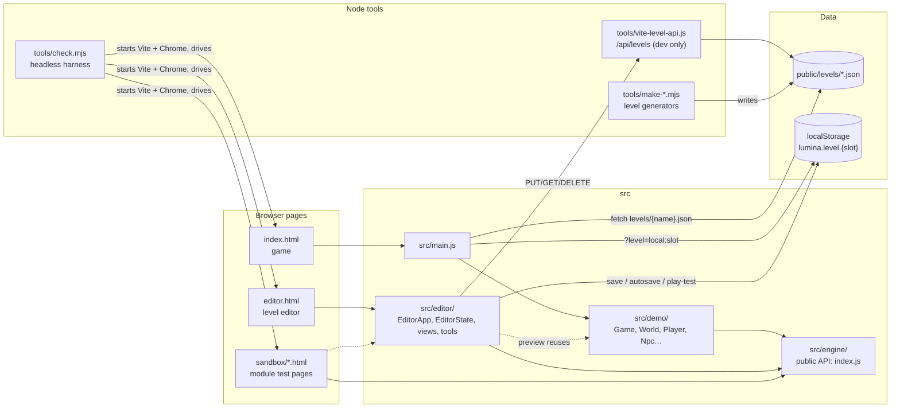
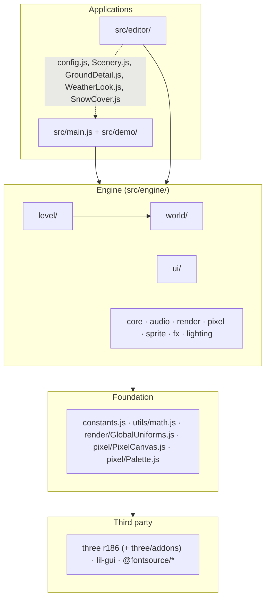
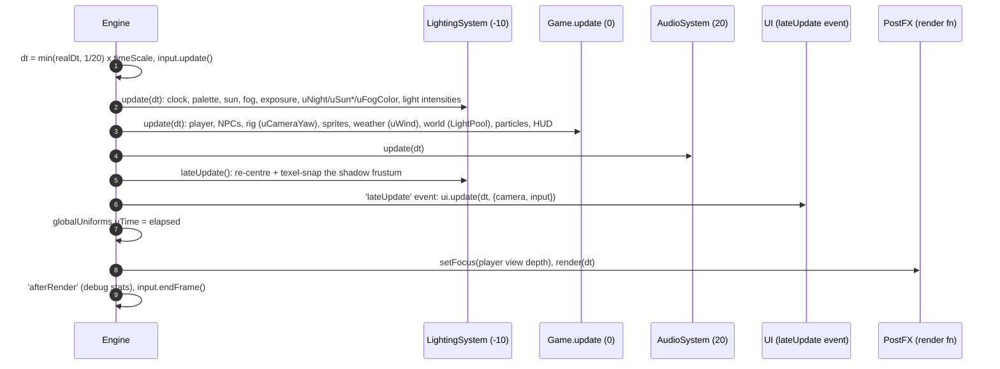
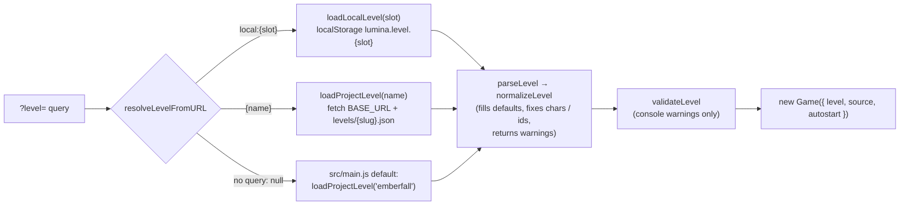
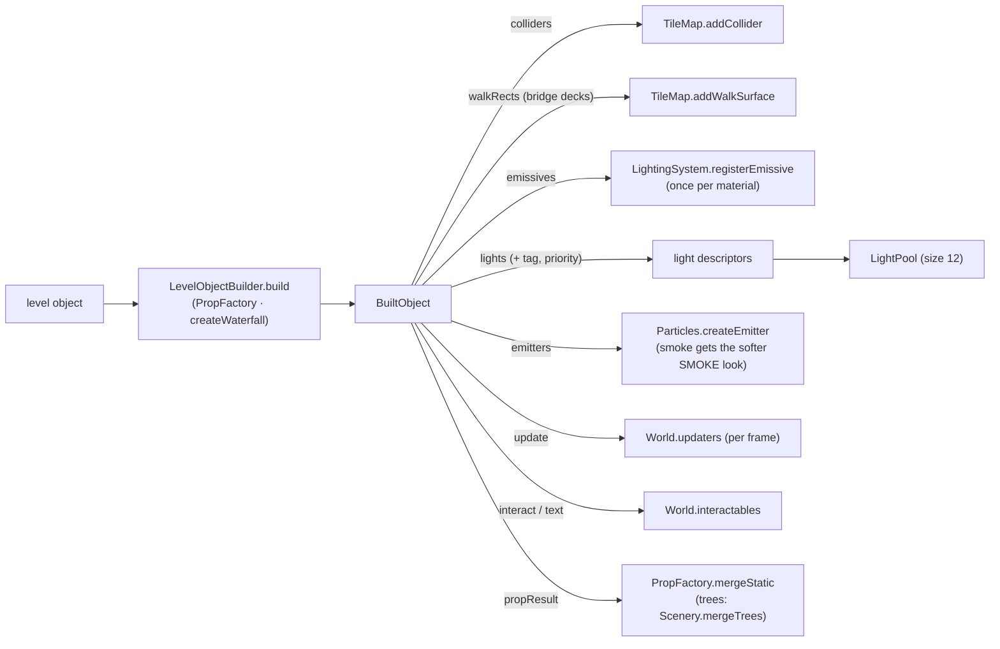
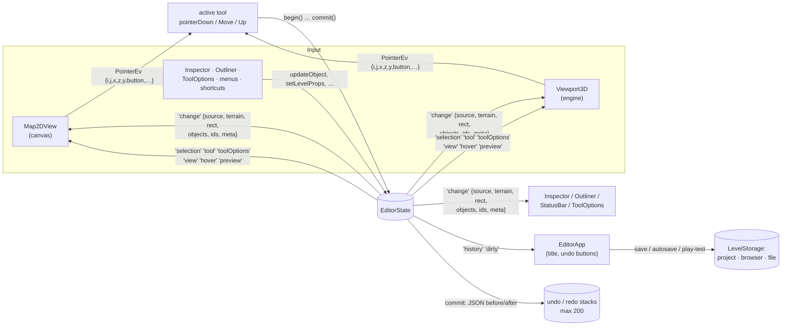
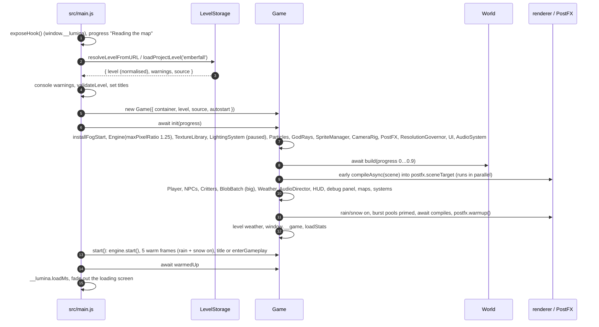

# Architecture overview

> **Purpose.** The big picture of Lumina: which programs exist (engine, game, editor, tools,
> levels, sandboxes), how they depend on each other, what runs every frame and in which order,
> how a level file becomes a lit 3D diorama, how the editor keeps its views in sync, and where
> each piece of state lives. Read this before you change code that crosses a module boundary.
>
> **Audience.** Developers and AI agents starting on the project. It assumes three.js basics.
>
> **Source of truth.** The code: [`src/main.js`](../../src/main.js),
> [`src/engine/core/Engine.js`](../../src/engine/core/Engine.js),
> [`src/engine/render/GlobalUniforms.js`](../../src/engine/render/GlobalUniforms.js),
> [`src/demo/Game.js`](../../src/demo/Game.js), [`src/demo/World.js`](../../src/demo/World.js),
> [`src/engine/level/`](../../src/engine/level/), [`src/editor/EditorState.js`](../../src/editor/EditorState.js),
> [`src/editor/viewport3d/Viewport3D.js`](../../src/editor/viewport3d/Viewport3D.js). The binding
> contracts are [`ARCHITECTURE.md`](../../ARCHITECTURE.md) (engine) and
> [`contracts/LEVEL_EDITOR.md`](../contracts/LEVEL_EDITOR.md) (level format, editor). Where
> this page and the code disagree, the code wins.
>
> **Related.** [RENDER_PIPELINE.md](RENDER_PIPELINE.md) (what a frame draws) ·
> [PERFORMANCE.md](PERFORMANCE.md) (budgets and measurements) · [GAME.md](GAME.md) ·
> [EDITOR.md](EDITOR.md) · [modules/README.md](modules/README.md) (per-module references) ·
> [diagrams.html](diagrams.html) (the same flows as drawn figures) ·
> [../specs/LEVEL_FORMAT.md](../specs/LEVEL_FORMAT.md) · [../ai/AGENT_ONBOARDING.md](../ai/AGENT_ONBOARDING.md)

---

## Contents

1. [System context](#1-system-context)
2. [Layering and dependency rules](#2-layering-and-dependency-rules)
3. [Engine module map](#3-engine-module-map)
4. [The frame loop](#4-the-frame-loop)
5. [Shared global uniforms](#5-shared-global-uniforms)
6. [The level pipeline](#6-the-level-pipeline)
7. [Editor data flow](#7-editor-data-flow)
8. [Coordinate systems and units](#8-coordinate-systems-and-units)
9. [Colour management](#9-colour-management)
10. [Startup and loading sequence](#10-startup-and-loading-sequence)
11. [Where state lives](#11-where-state-lives)
12. [Architectural invariants](#12-architectural-invariants)

---

## 1. System context

Lumina is a browser project with no server logic beyond the Vite dev server. Everything the
player sees — textures, sprite sheets, meshes, particles, sounds, music — is generated at run
time by the engine. Three front ends share the engine, and they are fed by one kind of data file:
the `lumina-level` JSON.

| Part | Entry | What it is |
| --- | --- | --- |
| Engine | [`src/engine/index.js`](../../src/engine/index.js) | The reusable HD-2D engine (≈ 60 % of the code). Public API re-exported by the barrel; see [§3](#3-engine-module-map). |
| Game ("demo") | [`index.html`](../../index.html) → [`src/main.js`](../../src/main.js) → [`src/demo/Game.js`](../../src/demo/Game.js) | Plays any level file: `?level=<name>` (`public/levels/<name>.json`), `?level=local:<slot>` (browser storage), default `emberfall`. `?autostart=1` skips the title. See [GAME.md](GAME.md). |
| Level editor | [`editor.html`](../../editor.html) → [`src/editor/main.js`](../../src/editor/main.js) → [`EditorApp`](../../src/editor/EditorApp.js) | 2D map + live 3D preview (the real engine), tools, inspector, save / play-test. See [EDITOR.md](EDITOR.md). |
| Sandboxes | [`sandbox/*.html`](../../sandbox/) | One page per module against raw three.js, plus scripted checks (`*.actions.json`, `editor_*.json`). |
| Levels | [`public/levels/`](../../public/levels/) | `emberfall.json` (48 × 40, 136 objects), `starfall-vale.json` (128 × 128, 874 objects, generated), `brightwater-crossing.json` (36 × 28, 68 objects, built in the editor), `sample-hamlet.json` (28 × 22, 38 objects, generated). An `untitled.json` there (when present) is the user's own file — never touch it. |
| Dev-server level API | [`tools/vite-level-api.js`](../../tools/vite-level-api.js) (plugin in [`vite.config.js`](../../vite.config.js)) | `GET/PUT/DELETE /api/levels[/:name]` writes `public/levels/<name>.json`. `apply: 'serve'` — it does not exist in `npm run build` output. See [../specs/LEVEL_STORAGE_API.md](../specs/LEVEL_STORAGE_API.md). |
| Generators | [`tools/make-starfall-vale.mjs`](../../tools/make-starfall-vale.mjs), [`tools/make-sample-hamlet.mjs`](../../tools/make-sample-hamlet.mjs), [`tools/convert-emberfall.mjs`](../../tools/convert-emberfall.mjs) | Node scripts that write level JSON with the engine's DOM-free level modules. The two `make-*` generators are deterministic: re-run them instead of hand-editing `starfall-vale.json` / `sample-hamlet.json`. `convert-emberfall.mjs` was a one-off conversion of the old hand-coded demo (it reads the pre-conversion sources from git); `emberfall.json` itself is now the source of truth. |
| Check harness | [`tools/check.mjs`](../../tools/check.mjs) (`npm run check`) | Starts its own Vite server, drives headless Chrome on the real GPU, writes screenshots + `report.json` to `.check/<out>/`. The project's "test runner". See [../development/TESTING_AND_VERIFICATION.md](../development/TESTING_AND_VERIFICATION.md). |

The production build (`npm run build`, [`vite.config.js`](../../vite.config.js)) is a multi-page
build of `index.html` and `editor.html` into `dist/`; `public/levels/` is copied as-is, so every
project level stays playable with `?level=<name>`. Saving to the project folder needs the dev
server.

---

## 2. Layering and dependency rules

The rules, all verified against the current imports:

| Rule | Detail |
| --- | --- |
| **The engine never imports the game or the editor.** | No file under `src/engine/` imports from `src/demo/` or `src/editor/`. New engine features must not depend on demo tunables — pass them in as options (the way `LightingSystem` takes `sunPath`, `keyframes`). |
| The game imports the engine. | Mostly through the barrel (`../engine/index.js`), plus deep imports: `level/ObjectBuilder.js`, `level/ObjectCatalog.js`, `level/LevelMap.js`, `world/ShadowCasters.js` and `world/SpatialSplit.js` are not in the barrel; `lighting/LightPool.js` and `sprite/BlobBatch.js` are, but `World.js` / `Game.js` import them by path. [`src/main.js`](../../src/main.js) imports `level/LevelStorage.js` and `level/LevelFormat.js`. |
| The editor imports the engine by deep paths … | e.g. `engine/core/Engine.js`, `engine/level/LevelFormat.js`, `engine/world/ShadowCasters.js`. |
| … and five demo modules on purpose. | [`viewport3d/Viewport3D.js`](../../src/editor/viewport3d/Viewport3D.js) and [`ActorPreview.js`](../../src/editor/viewport3d/ActorPreview.js) import [`src/demo/config.js`](../../src/demo/config.js) (camera framing, sun / moon paths, keyframe overrides, sprite look) so the preview matches the game; [`SceneryPreview.js`](../../src/editor/viewport3d/SceneryPreview.js) and [`FoliagePreview.js`](../../src/editor/viewport3d/FoliagePreview.js) reuse [`src/demo/Scenery.js`](../../src/demo/Scenery.js) and [`src/demo/GroundDetail.js`](../../src/demo/GroundDetail.js); `Viewport3D` applies the level's weather with [`src/demo/WeatherLook.js`](../../src/demo/WeatherLook.js), and the terrain, scenery, foliage, prop and ghost previews install the snow patch of [`src/demo/SnowCover.js`](../../src/demo/SnowCover.js). The game never imports the editor. |
| Node tools import only DOM-free engine modules. | `tools/*.mjs` import [`level/LevelFormat.js`](../../src/engine/level/LevelFormat.js), [`level/ObjectCatalog.js`](../../src/engine/level/ObjectCatalog.js) and [`utils/math.js`](../../src/engine/utils/math.js) (`convert-emberfall.mjs` also `world/props/SmallProps.js`). Keep these modules free of `document` / WebGL use. [`ObjectBuilder.js`](../../src/engine/level/ObjectBuilder.js) is not DOM-free (it builds meshes). |
| Sandboxes may import anything. | They are test pages; nothing imports them. |
| No side effects on import … | … except the UI stylesheet and web-font imports under `src/engine/ui/` (`UI.js` imports the `@fontsource` CSS, every UI file imports `ui.css`; `DebugPanel.js` imports `lil-gui`). Importing the barrel therefore pulls in the UI CSS. |

Inside the engine the directory-level imports are (imports within the same directory and of
`three` omitted; `utils` = `utils/math.js`):

| Directory | Imports from |
| --- | --- |
| `core/` | `render/GlobalUniforms`, `utils` |
| `audio/` | `utils` |
| `render/` | `utils` (+ `three/addons/postprocessing/*`) |
| `pixel/` | `utils`, `constants` |
| `sprite/` | `render/GlobalUniforms`, `utils`, `constants` |
| `fx/` | `pixel`, `render/GlobalUniforms`, `utils`, `constants` |
| `lighting/` | `render/GlobalUniforms`, `utils` |
| `world/` (+ `world/props/`) | `pixel`, `render/GlobalUniforms`, `utils`, `constants` (+ `three/addons/utils/BufferGeometryUtils.js`) |
| `level/` | `world` (only `ObjectBuilder.js`), `utils`, `constants` |
| `ui/` | `utils`, `lil-gui`, `@fontsource/*` |

`fx/` and `world/` only reach into `pixel/` for its foundation files (`PixelCanvas.js`,
`Palette.js`); a `TextureLibrary` is passed in as an instance, never imported. So the one import
between engine modules that bypasses the foundation is `level/ObjectBuilder.js → world/`
(`Props.js`, `TileMap.js`, `Water.js`).

---

## 3. Engine module map

The public API is whatever [`src/engine/index.js`](../../src/engine/index.js) exports. The
canonical per-module references are in [modules/](modules/README.md); this is the one-screen
map.

| Module | Main files | Role |
| --- | --- | --- |
| **Foundation** | [`constants.js`](../../src/engine/constants.js), [`utils/math.js`](../../src/engine/utils/math.js), [`render/GlobalUniforms.js`](../../src/engine/render/GlobalUniforms.js) | `PPU`, `TILE_SIZE`, `LEVEL_HEIGHT`, `DIRECTIONS`, `RENDER_ORDER`; seeded `RNG` / `hash2` / `fbm2` and maths helpers; the shared uniform objects ([§5](#5-shared-global-uniforms)). |
| **core** → [modules/core.md](modules/core.md) | `Engine`, `Input`, `CameraRig`, `EventEmitter` | Renderer, scene, camera, the ordered-systems frame loop, resize; keyboard / pointer / gamepad actions; the diorama follow camera. |
| **audio** → [modules/audio.md](modules/audio.md) | `AudioSystem` | Procedural WebAudio: sound effects, ambience layers, the music loop. |
| **render** → [modules/render.md](modules/render.md) | `PostFX`, `shaders/*` | MSAA HDR scene target → DOF → bloom → OutputPass → grade. |
| **pixel** → [modules/pixel.md](modules/pixel.md) | `PixelCanvas`, `Palette`, `TextureLibrary` (in `Textures.js`), `CharacterSprites`, `PropSprites` | Procedural pixel art: 46 world textures (with normal / emissive maps), character and creature sheets, prop and particle sprites. |
| **sprite** → [modules/sprite.md](modules/sprite.md) | `Sprite3D`, `SpriteManager`, `Foliage`, `BlobBatch` | Lit, shadow-casting billboards; instanced ground foliage; instanced contact shadows. |
| **fx** → [modules/fx.md](modules/fx.md) | `Particles`, `GodRays` | Stateless GPU particle emitters and bursts; additive light shafts. |
| **lighting** → [modules/lighting.md](modules/lighting.md) | `LightingSystem`, `LightPool`, `Sky` | 24 h keyframed palette, sun / moon, fog, exposure, point lights and emissives; `LightPool` shares a fixed set of at most 12 point lights among any number of light sources; the sky dome. |
| **world** → [modules/world.md](modules/world.md) | `TileMap`, `Water`, `WaterShore`, `Props` (`PropFactory`) + `props/*`, `SpatialSplit`, `ShadowCasters` | Terrain from the legend / tiles / heights format, collision and walk queries; water and waterfalls; every procedural prop; big-level batching helpers. |
| **level** → [modules/level.md](modules/level.md) | `LevelFormat`, `ObjectCatalog`, `ObjectBuilder`, `LevelStorage`, `LevelMap` | The `lumina-level` format, the object catalog, building level objects into props, storage (project / browser / file), the painted minimap image. |
| **ui** → [modules/ui.md](modules/ui.md) | `UI`, `DialogBox`, `Banner`, `TitleScreen`, `HUD`, `Minimap` / `WorldMap`, `InteractPrompt`, `Fader`, `DebugPanel`; combat levels: `CombatHUD`, `BossBar`, `WorldLabels`, `Announcer`, `DeathScreen` | DOM overlay with the Octopath-style look. |

The game layer (`src/demo/`) adds what is not engine-generic: `Game` (wiring and flow), `World`
(level → scene), `Player`, `Npc`, `Critters`, `Weather` (with `WeatherLook`, the weather look it
shares with the editor preview), `AudioDirector`, `Scenery` (outer
world, tree merging), `GroundDetail` (foliage fields), `SnowCover`, `AtmosphereFog`,
`ResolutionGovernor`, `DebugControls`, `dialogue.js`, `config.js`, `levels.js`, and — on levels
with enemies only — the ARPG combat in `src/demo/combat/` (`CombatSystem` and the player kit,
`Enemy` and its `ai/*` brains; contract [COMBAT.md](../contracts/COMBAT.md)). See [GAME.md](GAME.md).

---

## 4. The frame loop

### 4.1 Engine frame order

[`Engine`](../../src/engine/core/Engine.js) drives everything from
`renderer.setAnimationLoop`. One tick (`Engine._frame`) runs, in this order:

1. **Time.** `realDt` from the rAF timestamp; `dt = min(realDt, 1/20) × time.timeScale`
   (`MAX_DELTA = 1/20` prevents huge steps after a tab switch). `time.elapsed`, `time.frame`
   and a smoothed `time.fps` are updated.
2. `input.update()` — poll the gamepad. (Keyboard and pointer edges are recorded by DOM
   listeners between frames, so a key tapped between two frames still reports `wasPressed`.)
3. **`update` pass** — every system's `update(dt, t, engine)`, ascending `order` (ties keep
   insertion order), then the `'update'` event.
4. **`lateUpdate` pass** — every system's `lateUpdate(dt, t, engine)`, then the `'lateUpdate'`
   event.
5. `globalUniforms.uTime.value = time.elapsed`.
6. `'beforeRender'` event → the **render function** (`setRenderFn(fn)`, default
   `renderer.render(scene, camera)`) → `'afterRender'` event.
7. `input.endFrame()` — clear per-frame edges and the wheel delta.

A system or listener that throws is logged once per phase (`[Engine] … threw in …`) and the loop
keeps running. `Engine.step(realDt)` advances one frame by hand (tests).

### 4.2 What the game registers

[`Game.init`](../../src/demo/Game.js) wires the frame like this:

| Hook | Order | What runs |
| --- | --- | --- |
| system `lighting` ([`LightingSystem`](../../src/engine/lighting/LightingSystem.js)) | −10 | `update`: advance the clock (unless `paused`; `timeSpeed = 1/90` h per second while playing, 0 when the level sets `environment.clock: false`), evaluate the palette, set sun / moon / hemisphere / fog / exposure / sky, write `uNight`, `uSunDirection`, `uSunColor`, `uFogColor`, update point-light and emissive intensities. `lateUpdate`: re-centre the texel-snapped shadow frustum after the camera moved. |
| system `game` (`Game.update`) | 0 | Gameplay, the camera rig, sprites, weather, world, particles, HUD — the list below. |
| system `AudioSystem` | 20 | `update(dt)`: schedules the next music notes and ambience layers on the WebAudio clock. |
| event `'lateUpdate'` | — | `ui.update(dt, { camera, input })`: dialog typewriter and input, interaction-prompt projection, HUD (banners and fades run on their own timers / CSS). |
| render function | — | `postfx.setFocus(…)` (the player's chest view depth while playing, else `rig.focusDistance`), then `postfx.render(dt)`. |
| event `'afterRender'` | — | `ui.debug.stats.update(renderer, dt)` (the debug overlay). |
| event `'resize'` | — | `postfx.setSize(width, height, pixelRatio)`. |

`Game.update(dt)` itself runs, in order:

1. Shortcuts owned by the game (debug panel, world map, help, photo mode, time, weather, music).
2. `player.update(dt, input)` (frozen while not playing, talking or with the map open) and the
   x-ray silhouette level.
3. The interaction prompt and the confirm action (`_findInteractable`, `_interact`).
4. Villagers (`Npc.update`) — on big levels actors far from the camera focus update every 4th
   frame with the accumulated time — and `critters.update`.
5. The camera: title-screen drift or gameplay tuning (high-ground pitch, edge-aware yaw clamp,
   zoom-dependent focus bounds), then `rig.update(dt, input)` — this writes `uCameraYaw` and
   `uCameraPosition`.
6. `spriteManager.update(dt)` (animation, billboard yaw, sun-facing shadow proxies) and
   `blobs.update()` (big levels: instanced contact shadows).
7. Dust follows the camera focus; zoom-dependent fog; `weather.update(dt)` (time glides, weather
   blend; writes `uWind`, `uWindStrength`, the grade temperature / saturation, and greys the fog /
   sun / hemisphere colours under an overcast sky — safe because `LightingSystem` recomputes them
   every frame before the game runs).
8. `world.update(dt, { focus, camera })`: animated props (windmill sails, waterfalls), water,
   the `LightPool` re-ranking, big-level particle culling.
9. `godRays.update`, waterfall spray bursts, `particles.update(dt, camera)`,
   `resolution.update(dt)` (the [`ResolutionGovernor`](../../src/demo/ResolutionGovernor.js)).
10. HUD clock, region plate and arrival banners, minimap / world map, `audioDirector.update`.

Two ordering consequences matter when you add code:

- **Anything that modifies what `LightingSystem` computed must run after it** — `Weather` greys
  colours in `Game.update`; the `LightPool` fades / retargets lights in `world.update`, which is
  why a light it moves is explicitly re-lit in the same frame (`LightPool.update` →
  `retargetPointLight(handle, {})` after a snap).
- **The shadow frustum follows the camera in `lateUpdate`** (after the rig moved in
  `Game.update`), so shadows never lag a frame behind the view.

The editor runs the same `Engine` with one system (`viewport3d`, order 0 → `Viewport3D._update`)
and its own render function (`Viewport3D._render`: shadow-pass planning, optional PostFX, then an
overlay pass). The 2D map is a plain canvas that redraws on demand with `requestAnimationFrame`.
See [EDITOR.md](EDITOR.md).

---

## 5. Shared global uniforms

Modules never call each other for per-frame sync. They share the uniform **objects** in
[`render/GlobalUniforms.js`](../../src/engine/render/GlobalUniforms.js); a custom shader puts the
same object into its `uniforms` (`shader.uniforms.uTime = globalUniforms.uTime`), so one write per
frame updates every material. Never copy `.value` into a material.

| Uniform | Default | Written by (per frame) | Read by |
| --- | --- | --- | --- |
| `uTime` | 0 | `Engine._frame` (after `lateUpdate`, before render; scaled game time) | Particles, Foliage, Water and waterfalls, flame / glow cards, wind sway (`world/props/Wind.js`) |
| `uNight` | 0 | `LightingSystem._apply` (palette `night`, 0 day … 1 night) | GodRays, Particles (`nightVisibility`), Water, flame glow |
| `uWind` | (1.0, 0.35) | `Weather.update` (game; `windX`, `windZ` of the blended weather); the editor preview (`windX`, `windZ` of the level's settled weather) — both through `WeatherLook.applyWeatherWind` | Particles, Foliage, wind sway |
| `uWindStrength` | 1 | `Weather.update` (`tuning.windStrength × weather wind`); the editor preview (`1 × weather wind`) | Particles, Foliage, wind sway, windmill sail speed (CPU, `props/Structures.js`) |
| `uCameraYaw` | 0 | `CameraRig.update` (game) / `EditorCamera.update` (editor) | Sprite3D (CPU billboard and blob yaw), Foliage, flames, billboard leaf cards |
| `uCameraPosition` | (0,0,0) | `CameraRig.update` / `EditorCamera.update` | No shader in `src/` reads it today (reserved for custom shaders). |
| `uSunDirection` | normalised (0.4, 0.8, 0.45) | `LightingSystem._apply` — the **directional light's** direction (the sun by day, the moon at night, elevation softly clamped to 10–68°), pointing from the scene toward the light | Sprite3D (shadow-lookup offset, sun-facing proxy), Foliage and tree cards (face the sun in the shadow pass), TileMap wall bounce, Water glints, GodRays |
| `uSunColor` | (1, 0.9, 0.75) | `LightingSystem._apply` (linear sun colour × intensity / 3.5; ≈ 1 at noon); `Weather.update` and the editor preview grey it under an overcast sky (`WeatherLook.applyOvercast`) | TileMap wall bounce, Water, GodRays, Particles (`lit`) |
| `uFogColor` | (0.6, 0.65, 0.75) | `LightingSystem._apply` (= sky horizon colour); `Weather.update` and the editor preview override it under an overcast sky | Water (sky reflection) |

Other shared uniform objects follow the same pattern: `snowCover` in
[`src/demo/SnowCover.js`](../../src/demo/SnowCover.js) (0 … 1 settled snow, chained into ground,
foliage and roof materials), `TileMap._bounceUniform` (`tileMap.wallBounce`), and the CoC uniform
set PostFX shares across its DOF materials (`createCocUniforms`).

`globalUniforms` is a module singleton: two engines in one page (which no front end does) would
share and overwrite it.

---

## 6. The level pipeline

A level is plain data. The canonical field reference is [../specs/LEVEL_FORMAT.md](../specs/LEVEL_FORMAT.md)
(binding contract: [../contracts/LEVEL_EDITOR.md](../contracts/LEVEL_EDITOR.md) §1–§5). This
section is about how that data becomes a scene.

### 6.1 From URL to normalised level

- [`LevelStorage.loadProjectLevel`](../../src/engine/level/LevelStorage.js) rejects an HTML
  answer (the dev server serves `index.html` for unknown paths); [`src/main.js`](../../src/main.js)
  turns load failures into a message on the loading screen with links to the editor and (unless
  Emberfall itself failed) to Emberfall — never a blank page.
- [`normalizeLevel`](../../src/engine/level/LevelFormat.js) never throws for recoverable
  problems: sizes are clamped to 8…128, rows padded / truncated, unknown tile chars become grass,
  unknown object types are dropped, duplicate or reserved (`spawn`) ids are renamed, unknown
  top-level keys are kept for round-tripping. Names from the file are matched as own keys
  (`isOwnKey` / `ownValue`, [`utils/own.js`](../../src/engine/utils/own.js)), so
  `"constructor"` or `"__proto__"` is unknown like any misspelt name, and a value `String()`
  cannot convert (`{"toString": 1}`) gets its default instead of aborting the load.

### 6.2 `World.build` steps

[`World.build`](../../src/demo/World.js) is async so the loading screen keeps animating; each
step awaits a `setTimeout(0)` tick. Per-step CPU milliseconds land in `world.stats.phases`. The
fraction is what `World.build` reports; `Game.init` scales it by 0.9 for the loading bar (the
last 10 % are the villagers, `'Waking the villagers'` at 0.92, and the warm-up, `'Warming up the
lanterns'` at 0.96).

| # | Progress label · fraction | Phase key | Work |
| --- | --- | --- | --- |
| 1 | Painting textures · 0.08 | `textures` | `TextureLibrary.preload()` — every procedural texture. |
| 2 | Raising the land · 0.18 | `terrain` | `buildLevelTerrain(level, { textures, chunkSize, deferShore: true })` → `TileMap` (+ `Water` when there are water tiles). Chunk size 64 (one chunk on a small level) or 32 on big levels, where the cliff faces also get shadow-only proxies and the chunks are re-merged (`consolidateChunks`). |
| 3 | Building the village · 0.30 → 0.44 | `props` | Every prop-kind object except trees and waterfalls through `LevelObjectBuilder.build` → wired immediately (below). A generator yields about every 12 ms. Houses (door), signposts and wells that have `text` become interactables; campfires are recorded as fire anchors. |
| 4 | Planting the forest · 0.45 | `trees` | Level trees (with trunk colliders) → on big levels the shore texture starts baking in a worker (`Water.refreshAsync`) → the forest border / outer scenery scatter (`Scenery.scatterForest`), `mergeTrees` batches, the fogged outer heightfield (`buildOuterGround`). |
| 5 | Letting the water run · 0.58 | `water` | Waterfalls (mist emitter, splash anchors); small levels bake the shore texture now (`Water.refresh`), after every collider standing in water exists. |
| 6 | Growing the meadow · 0.68 | `foliage` | `buildGroundDetail` — instanced grass, flowers, reeds, shrubs; uses the collider grid to keep tufts out of props. |
| 7 | Lighting the lanterns · 0.80 | `lights` | `_wireLights` (descriptors sorted by priority → one `LightPool` with `size: 12`) and `_buildAtmosphere` (camera-following dust, particle areas from `emitter` objects, god-ray shafts). |
| 8 | Merging meshes · 0.88 | `merge`, `shoreWait` | `PropFactory.mergeStatic` (one batch per material; spatially split + shadow proxies on big levels); then wait for the worker's shore bake. |
| 9 | — (no progress call) | `snow`, `culling` | Chain the snow-cover patch into terrain, outer ground, foliage and roof materials; on big levels switch every static batch to bounding-box culling (`cullByBox`). |

"Big level" means `max(width, depth) > 64` (`World.isBigLevel`); those levels use
`BIG_LEVEL_BATCHING`. Small levels keep the original single-merge path and must render
identically — see [PERFORMANCE.md](PERFORMANCE.md#3-performance-architecture).

### 6.3 Wiring a built object

[`LevelObjectBuilder.build(obj, tileMap)`](../../src/engine/level/ObjectBuilder.js) returns a
`BuiltObject` for the 20 prop-kind types (house, windmill, well, marketStall, tree, rock,
haystack, lamppost, wallTorch, campfire, light, bench, barrel, crate, crateStack, flowerbox,
signpost, fence, bridge, waterfall) and `null` for actors (`npc`, `critters`) and markers
(`emitter`, `region`). Most types are one `PropFactory` call; `waterfall` goes through
`createWaterfall` (`world/Water.js`) and `light` only produces a light descriptor on an empty
group. `World._build` wires each descriptor list (emitters are wired by the callers,
`_buildProps` and `_buildWaterfalls`):

- Light descriptors carry `priority` from `LIGHT_PRIORITY` (`campfire` 0, `wallTorch` 1,
  `light` 1, `lamppost` 2, `house` 3; houses only emit their door lantern when `obj.light` is
  set). `_wireLights` sorts by priority, then level order, and sanitises hand-edited numbers
  (`sanitizeLightDescriptors` in [`LightPool.js`](../../src/engine/lighting/LightPool.js), which the
  editor preview uses too).
  The pool then creates the level's point lights once, before the first frame: **one per
  descriptor when there are ≤ 12** (sample-hamlet 6, Brightwater Crossing 10, Emberfall 12 —
  measured), **exactly 12 shared ones when there are more** (Starfall Vale: 95 descriptors).
- `light` and `waterfall` objects have no `propResult` (nothing to merge); trees are merged
  separately with the border / outer forest.
- The game (not `World`) turns the remaining object kinds into behaviour: `npc` → `Npc`
  (`script` → a conversation in [`dialogue.js`](../../src/demo/dialogue.js), else the object's
  `dialogue` + built-in `action`), `critters` → `Critters`, `region` → HUD location plate, arrival
  banners and world-map names.

---

## 7. Editor data flow

[`EditorState`](../../src/editor/EditorState.js) is the single source of truth: the level being
edited, the selection, the active tool and its options, view options, the hover position and
undo / redo. Views never mutate `state.level`; tools and UI call `EditorState` methods.

- **Transactions.** `begin(label)` snapshots the level as JSON; `commit()` pushes one undo step
  (before / after snapshots, changed tile rect, changed object ids) if anything changed; a
  mutation outside a transaction is wrapped in its own. One stroke or drag = one undo step.
  `cancel()` restores the snapshot.
- **Change events** are emitted for every edit (also mid-stroke), for undo / redo (with the
  step's rect / ids) and for loads (`source: 'load'`, everything dirty). Views coalesce them:
  `Viewport3D` sets dirty flags and syncs once per frame; `Map2DView` repaints the changed tiles.
- **Tools** ([`src/editor/tools/`](../../src/editor/tools/)) are view-agnostic singletons; the
  views only translate pointer input into a `PointerEv` and draw the tool's `preview(state)`.
- **3D preview** keeps the level **data** current at once (`TileMap.updateTiles`, prop sync by
  id) and lets the **meshes** follow through a time-sliced job queue (one rebuild per frame during
  a stroke). The end result equals a fresh build. See [PERFORMANCE.md](PERFORMANCE.md#310-editor-job-queue-and-chunk-batching)
  and [EDITOR.md](EDITOR.md).
- **Saving.** `LevelStorage` writes `serializeLevel` output (byte-stable: open + save unchanged
  leaves `git diff` empty) to the project (`/api/levels`, dev server only), browser storage or a
  download. Autosave every 20 s to the `__autosave__` slot; play-test stores the level in
  `__playtest__` and opens `index.html?level=local:__playtest__&autostart=1`.

---

## 8. Coordinate systems and units

| Quantity | Convention | Source |
| --- | --- | --- |
| Axes | Right-handed, **Y up**. | [`constants.js`](../../src/engine/constants.js) |
| Tiles | Tile `(i, j)` covers `x ∈ [i, i+1]`, `z ∈ [j, j+1]`; centre `(i + 0.5, h, j + 0.5)`. `i` = column (+X), `j` = row (+Z). `TILE_SIZE = 1`. | `TileMap.worldToTile`, `tileCenter` |
| Rows | `tiles[j]` / `heights[j]` are strings; row 0 is the north edge (−Z), rows run toward +Z. The 2D map, the minimap and the world map draw north (−Z) up. | [`LevelFormat.js`](../../src/engine/level/LevelFormat.js) |
| Heights | One char per tile: `'0'–'9'` → 0–9, `'a'–'z'` → 10–35 (`A–Z` are read as 10–35 too); `MAX_LEVEL = 35`. World height = level × `LEVEL_HEIGHT` (0.5), so a one-level step is 0.5 units and `TileMap.move`'s default `maxStep` is 0.55. | `charToLevel`, `levelToChar`, `LEVEL_HEIGHT` |
| Stairs | Legend `stairs: 'N'\|'S'\|'E'\|'W'` rises one level toward −Z / +Z / +X / −X, built as 4 steps. | `TileMap._emitStairs` |
| Map size | 8 … 128 tiles per side (`MIN_SIZE`, `MAX_SIZE`). | `LevelFormat.js` |
| Texel density | `PPU = 16` texels per world unit for world textures **and** sprites; NEAREST magnification. Characters are 32 × 32 px frames ≈ 2 units tall. | `PPU`, `PixelCanvas#toTexture` |
| Camera | Position = `focusPoint + (sin yaw · cos pitch, sin pitch, cos yaw · cos pitch) · distance`. Yaw 0 = camera on the +Z side looking toward −Z, so screen-down = +Z and a sprite facing `down` faces the camera. `CameraRig` options take degrees; runtime `yaw` / `pitch` are radians. | [`CameraRig.js`](../../src/engine/core/CameraRig.js) |
| Sprite directions | `DIRECTIONS = ['down', 'left', 'right', 'up']` = +Z, −X, +X, −Z; sheet rows in that order. | `constants.js` |
| Sun / moon azimuth | Azimuth φ ↦ direction `(sin φ, cos φ)` on XZ; φ = 0 is +Z (the camera side). Demo golden hour (17.2 h): sun at φ = −112°, ≈ 25° up (behind-left of the default view), so shadows fall toward the lower right. | `LightingSystem` `sunPath`, [`src/demo/config.js`](../../src/demo/config.js) `SUN_PATH` |
| Time of day | Hours in `[0, 24)`; `LightingSystem.timeOfDay`. The game clock runs at `TIME_SPEED = 1/90` h per real second (one game hour ≈ 90 s). | `config.js` |
| Light intensity | Physically based (three r155+): point lights in candela with `decay = 2`. `addPointLight` and `light` objects default to intensity 8, `distance` 8; the props' own lights: lamppost 12 / 9, wall torch 7 / 7, campfire 14 / 10, house door lantern 6 / 7. | `LightingSystem.addPointLight`, [`props/LightProps.js`](../../src/engine/world/props/LightProps.js), [`props/House.js`](../../src/engine/world/props/House.js) |
| Screen | Harness coordinates and `pointer` are CSS px; the drawing buffer is CSS px × `engine.pixelRatio` (`min(devicePixelRatio, maxPixelRatio) × renderScale`). | `Engine._resize` |

---

## 9. Colour management

| Stage | Space | Where |
| --- | --- | --- |
| Colour textures (albedo, emissive masks) | sRGB (`SRGBColorSpace`), decoded to linear on sampling | `makePixelTexture`, `TextureLibrary` |
| Data textures (normal maps, masks, the water shore texture) | `NoColorSpace` | `normalMapFromHeight`, `TileMap` decal mask, `Water` |
| Palette keyframes | Authored as sRGB hex, converted once to linear (`Color.setStyle(hex, SRGBColorSpace)`), interpolated in linear | `LightingSystem.setKeyframes` |
| Scene render | Linear HDR into PostFX's `HalfFloatType` MSAA target; no tone mapping (three only tone-maps when drawing to the canvas) | `PostFX.render` |
| Tone mapping + sRGB encode | **Once**, in `OutputPass` (`ACESFilmicToneMapping`, `renderer.toneMappingExposure`, `outputColorSpace = SRGBColorSpace`) | `Engine` renderer setup, `PostFX` |
| Exposure | Owned by `LightingSystem` (palette `exp` × `settings.exposureMul`; the weather multiplies it) | `LightingSystem._apply` |
| Grade | Display space, after `OutputPass` (exposure multiply, white balance, contrast, saturation, split toning, vignette, grain, dither) | [`GradeShader.js`](../../src/engine/render/shaders/GradeShader.js) |

With `postfx.settings.enabled = false` the renderer draws straight to the canvas and applies
ACES + sRGB itself. Full detail: [RENDER_PIPELINE.md §8](RENDER_PIPELINE.md#8-the-postfx-chain).

---

## 10. Startup and loading sequence

`Game.init` records wall-clock milliseconds per phase in `game.loadStats` (`engine`, `world`,
`characters`, `map`, `compile`); `World.build` records CPU milliseconds per step in
`world.stats.phases`; `window.__lumina.loadMs` is navigation start → first gameplay frame. The
warm-up exists so no shader compiles during play — why and how is in
[RENDER_PIPELINE.md §9](RENDER_PIPELINE.md#9-warm-up-no-shader-compiles-during-play).

`game.start()` already calls `showTitle()` (the title is drawn behind the loader during the warm
frames). Once the loader has faded, the title camera drifts over the level
(`environment.titleCamera` or automatic) with the clock paused until a key or click (which also
unlocks WebAudio); `enterGameplay()` unpauses the clock, targets the player, shows the area
banner and starts the music (unless `environment.music` is false). With `?autostart` (any value
but `0`) gameplay starts at once; audio unlocks — and the music starts — on the first key or
click.

The editor boots differently: `EditorApp` builds the layout, restores prefs, mounts the 3D
viewport (dynamic import) and opens the first document: `?open=<name>` (project level),
`?local=<slot>` (browser slot), `?new` (blank), or — with no query — an offer to restore an
earlier session's autosave, else a blank level. `Viewport3D.ready` resolves after its first full
build and background shader warm-up. See [EDITOR.md](EDITOR.md).

---

## 11. Where state lives

| State | Owner | Notes |
| --- | --- | --- |
| The level being played | `game.level` (normalised object, read-only after load) | Built into the scene once; the game never writes it back. |
| The level being edited | `EditorState.level` | Mutated only through `EditorState` methods; history as JSON snapshots. |
| Terrain data (heights, walkability, colliders, walk surfaces) | `TileMap` (`game.tileMap`, `view3d.terrain.tileMap`) | Colliders indexed in a lazily rebuilt spatial grid; moving colliders carry `dynamic: true`. |
| Time of day, palette, light / emissive registry | `LightingSystem` (`timeOfDay`, `state`, `settings`) | `Weather` drives the multipliers in `settings`; the debug panel edits `weather.tuning`. |
| Weather, settled snow | `Weather` (`weather`, blended params), `snowCover.value` | |
| Point-light assignment | `world.lightPool` (game), `view3d.props.lightPool` (editor: the same engine `LightPool`, created with `fixed: true` in [`ObjectPreview.js`](../../src/editor/viewport3d/ObjectPreview.js)) | Game: one THREE light per descriptor when a level has ≤ 12, else exactly 12 pooled (`lightPool.pooled`); editor: always 12 THREE lights, static or pooled by descriptor count as in the game. The count never changes after load. |
| Camera | `CameraRig` (game) / `EditorCamera` (editor) | Game framing from `CAMERA` + `environment.camera`. |
| Post-processing settings | `postfx.settings` (live, read every frame) | Game tuning in `Game._tunePost`; `Weather` adjusts grade temperature / saturation. |
| Render resolution | `engine.renderScale`, `engine.maxPixelRatio` | Driven by `ResolutionGovernor` unless `manual`. |
| Per-frame shared values | `globalUniforms` | [§5](#5-shared-global-uniforms). |
| Game flow | `game.mode` (`'loading'` / `'title'` / `'play'`), `busy`, `photoMode`, `mapOpen`, `inventory`, `visits` | Not persisted. |
| Browser storage | `lumina.level.<slot>` (levels, incl. `__playtest__`, `__autosave__`, `__recovered_<id>__`), `lumina.levels` (slot index), `lumina.editor.prefs`, `lumina.editor.autosave`, `lumina.editor.recovered` | [`LevelStorage.js`](../../src/engine/level/LevelStorage.js), [`autosave.js`](../../src/editor/autosave.js). |
| Project files | `public/levels/*.json` | Written by the editor through `/api/levels` or by the generators. |
| Automation handles | `window.__game`, `window.__lumina`, `window.__engine` (with `?debug` or `?autostart`), `window.__editor` | [../specs/AUTOMATION_API.md](../specs/AUTOMATION_API.md). |

---

## 12. Architectural invariants

These break easily and silently; each has a reason recorded in [../history/DECISIONS.md](../history/DECISIONS.md).

- **The point-light count is fixed before the first frame and never changes** — at most 12 (the
  game: one per light descriptor up to 12, else 12 pooled; the editor: always 12, the engine
  `LightPool` with `fixed: true`). Never add,
  remove or hide a point light afterwards: changing the count recompiles every lit program. Fade
  intensities; share lights with `LightPool`.
- **Compile against `postfx.sceneTarget`.** Programs are keyed by the bound render target;
  anything that first appears mid-game must be warmed at load.
- **Determinism.** Procedural content uses the seeded `RNG` / `hash2` / `fbm2`, never
  `Math.random()`. The few `Math.random()` calls in `src/` are either transient (dialog blip
  pitch and waterfall spray jitter in `Game.js`, UI ids, autosave session ids) or pick a value
  that is then **stored in the level** (the Place tool rolls the `opts.seed` of the next
  object), so a saved level always rebuilds identically.
- **Tone mapping happens once** (OutputPass); `LightingSystem` owns `toneMappingExposure`,
  `scene.fog` and the shadow-map switch.
- **Byte-stable level files.** `serializeLevel` output must round-trip unchanged.
- **Small levels render identically** whenever big-level code changes (compare draw calls,
  triangles and screenshots of Emberfall, sample-hamlet and Brightwater Crossing).
- **Contracts are additive.** Never rename or change the meaning of a member listed in
  [`ARCHITECTURE.md`](../../ARCHITECTURE.md) or [`contracts/LEVEL_EDITOR.md`](../contracts/LEVEL_EDITOR.md).
