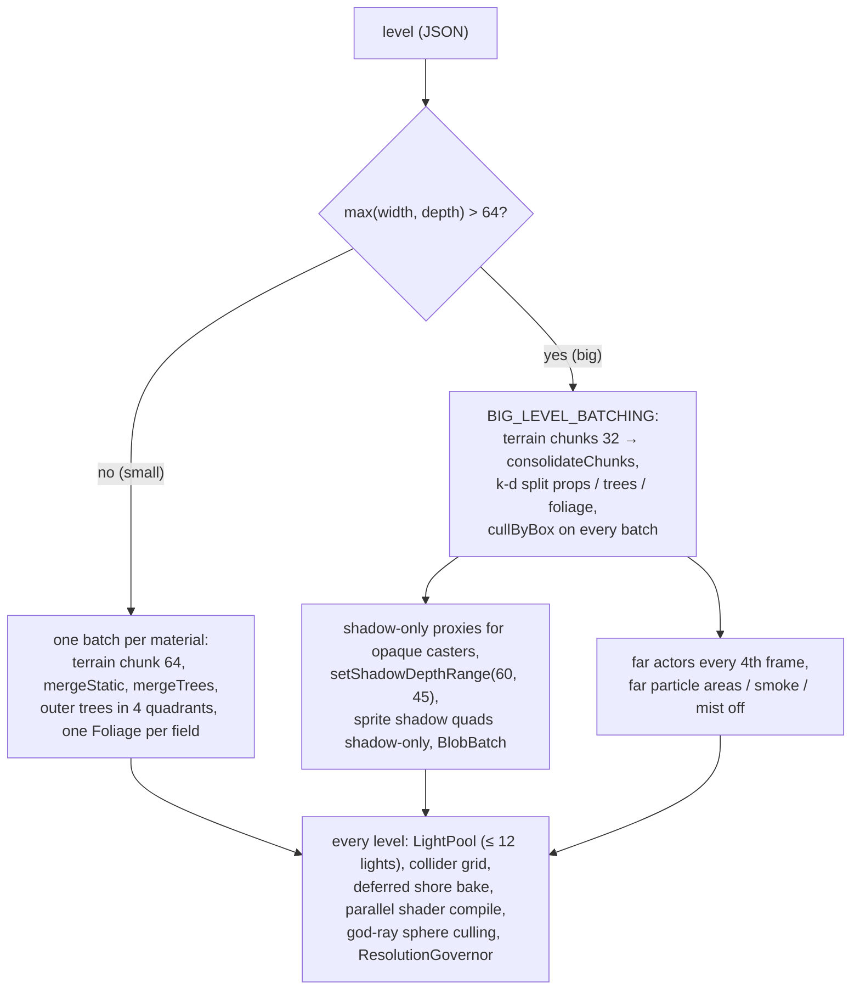

# Performance

> **Purpose.** The performance budget Lumina is built to, what was measured (Emberfall, Starfall
> Vale, the level editor), the mechanisms that keep a 128 × 128 level inside the budget, how to
> measure a change yourself, and the known limits. The numbers come from the project's multi-agent
> build and review passes (September 2026) — they are recorded here because the reports themselves
> are not in git.
>
> **Audience.** Anyone adding content or effects, touching batching / lights / loading, or asked
> "is it still fast?"; AI agents who need a reproducible measurement recipe.
>
> **Source of truth.** [`src/demo/World.js`](../../src/demo/World.js) (`BIG_LEVEL_BATCHING`),
> [`src/demo/Game.js`](../../src/demo/Game.js), [`src/demo/ResolutionGovernor.js`](../../src/demo/ResolutionGovernor.js),
> [`src/engine/world/SpatialSplit.js`](../../src/engine/world/SpatialSplit.js),
> [`ShadowCasters.js`](../../src/engine/world/ShadowCasters.js),
> [`TileMap.js`](../../src/engine/world/TileMap.js), [`Water.js`](../../src/engine/world/Water.js) /
> [`WaterShore.js`](../../src/engine/world/WaterShore.js),
> [`src/engine/lighting/LightPool.js`](../../src/engine/lighting/LightPool.js),
> [`src/engine/sprite/BlobBatch.js`](../../src/engine/sprite/BlobBatch.js),
> [`src/engine/render/PostFX.js`](../../src/engine/render/PostFX.js),
> [`src/editor/viewport3d/`](../../src/editor/viewport3d/) and [`tools/check.mjs`](../../tools/check.mjs).
> The editor's performance design is also specified in [../contracts/LEVEL_EDITOR.md §9](../contracts/LEVEL_EDITOR.md).
>
> **Related.** [RENDER_PIPELINE.md](RENDER_PIPELINE.md) · [OVERVIEW.md](OVERVIEW.md) ·
> [EDITOR.md](EDITOR.md) · [../development/TESTING_AND_VERIFICATION.md](../development/TESTING_AND_VERIFICATION.md) ·
> [../specs/AUTOMATION_API.md](../specs/AUTOMATION_API.md) · [../history/DECISIONS.md](../history/DECISIONS.md) ·
> [../ai/KNOWN_ISSUES.md](../ai/KNOWN_ISSUES.md)

---

## Contents

1. [Budgets](#1-budgets)
2. [Measurements](#2-measurements)
3. [Performance architecture](#3-performance-architecture)
4. [How to measure](#4-how-to-measure)
5. [Known limits](#5-known-limits)

---

## 1. Budgets

The reference machine is the development PC: **GTX 1060 3 GB, 1600 × 900, pixel ratio 1**,
Windows 10, Chrome through ANGLE / D3D11.

| Budget | Value | How it is enforced / checked |
| --- | --- | --- |
| Frame rate | 60 fps (vsync) in the game at every location, time and weather | Harness fps (capped by the headless compositor, see [§2](#2-measurements)); GPU timings. |
| Scene draw calls | **≤ ~300 per frame, shadow pass included** (post passes not counted) | `__game.state().drawCalls` (= `postfx.sceneInfo.calls`). |
| Point lights | **≤ 12**, all created before the first frame; the count never changes during play | `MAX_POINT_LIGHTS` (exported by `World.js`), `LightPool` (one light per descriptor up to 12, else 12 shared). |
| Shadow maps | One 2048² directional (sun / moon) map | `LightingSystem.shadowMapSize`. |
| DOF | Half resolution (`dofScale 0.5`), ≤ 64 gather taps in the game | `PostFX` options in `Game.init`. |
| Drawing buffer | ≤ 2.1 MP (≈ 1920 × 1080); render scale 0.7 … 1 | `ResolutionGovernor`. |
| Shader programs | Constant after load: nothing compiles during play | Program count in `renderer.info.programs` before / after a tour. |
| Level editor | 60 fps while editing a 64 × 64 level with ~200 objects; brush feedback in the 3D view within ~100 ms | `sandbox/editor_perf*.json`. |

The budgets come from [`ARCHITECTURE.md`](../../ARCHITECTURE.md) §1 and
[`CLAUDE.md`](../../CLAUDE.md); the draw-call budget counts the scene render (colour + shadow),
which is what `PostFX.sceneInfo` records.

---

## 2. Measurements

> **Read these with their conditions.** The headless harness runs at the host compositor's cadence
> — about 56–60 Hz, the same for a blank page — so "57 fps" means "at the cap". Other apps and
> parallel agents often shared the GPU, so averaged GPU times were noisy; the reviews therefore
> quote **best-case (minimum) GPU timings** per stage. Draw calls and triangles are deterministic
> and the most reliable comparison. All at 1600 × 900 on the GTX 1060 unless noted; "CPU update"
> and "render submission" were measured with the reviewers' in-page recorders (not part of the
> repository).

### 2.1 Emberfall (48 × 40, 136 objects)

Final verification of the demo (phase 2), six locations:

| Spot | fps (harness) | Draw calls | GPU avg |
| --- | --- | --- | --- |
| Plaza, golden hour | 57.4 | 230 | 8.1 ms (scene 4.9, DOF 2.5, bloom 0.5, output 0.24) |
| Windmill Hill, night | 57.7 | 165 | 7.4 ms |
| Grove, rain | 57.6 | 171 | 8.5 ms |
| Behind the inn (silhouette on) | 57.7 | 202 | 7.3 ms |
| Zoom 42, snow | 57.6 | 245 | 8.75 ms |
| Meadow, night | 57.8 | 237 | 8.5 ms |

- Frame p95 18.1 ms everywhere (one compositor interval); ≈ 0.34 M triangles; 57 shader programs,
  stable after rain and snow; 139–145 geometries, 151–152 textures; no frame over 45 ms on the
  first rain, snow, dialog or toast.
- Best-case GPU (quieter runs): scene 3.6–4.6 ms (shadow pass included), DOF 1.3–1.5, bloom 0.3,
  output + grade 0.25 ms.
- Other sizes: 1280 × 720 GPU 7.3–8.2 ms; 1920 × 1080 9.3–10.3 ms; 2560 × 1440 renders at
  1932 × 1086 (pixel budget), GPU 9.9 ms — all at the harness cap.
- Scene contents at the time: 38 village trees, 72 border trees and 441 outer trees merged into
  ~25 meshes; 3,621 grass tufts, 653 flowers, 105 reeds and 461 shrubs in 4 instanced draws;
  build ≈ 0.9 s.

What each feature costs (phase-2 performance review, on the code before its fixes; scene-pass
GPU minimum saved by switching it off):

| Feature | Cost |
| --- | --- |
| The 12 point lights | 1.25 ms (the largest single item, even by day) |
| Terrain | 1.1 ms |
| DOF (whole chain) | 1.25 ms; the bokeh sprites alone 0.2 ms |
| MSAA 4× (at 1080p) | 0.9 ms — why the game drops to 2× above 1.8 MP |
| Sun shadows (pass + sampling, at 1080p) | 0.7 ms |
| Ground foliage | 0.5 ms |
| Trees | 0.25 ms |
| Grade | 0.15 ms |
| Particles, god rays, water, sky | ≤ 0.1 ms each |
| `renderScale` 0.75 | −30 % total GPU |

CPU (same review): ≈ 3.7 ms main thread per frame, of which render submission 2.9 ms (shadow pass
0.65) and the game update 0.34 ms; no GC pauses; heap flat at ≈ 65 MB across weather / time /
dialog cycles.

### 2.2 Starfall Vale (128 × 128)

**The scalability work** ([§3.2](#32-big-levels-k-d-batching-and-box-culling) ff.), measured on the
892-object version, before → after, golden hour / night, scene pass incl. shadows:

| Spot | Draw calls | Triangles |
| --- | --- | --- |
| Spawn | 287 → 208 | 1.53 → 0.90 M |
| Hearthwick Square | 353 → 283 | 1.53 → 1.17 M |
| Mirrormere Landing | 323 → 260 | 1.37 → 1.01 M |
| High Terrace | 217 → 185 | 1.15 → 0.95 M |
| Farms | 273 → 204 | 1.31 → 0.88 M |
| Emberwood | 248 → 183 | 1.34 → 0.81 M |
| Observatory | 182 → 159 | 1.08 → 0.85 M |

Shadow-pass calls dropped from 53–112 to 33–68. Lights at night: before, the 12 lights sat on the
first 12 campfires / torches in the file and 72 of 84 descriptors were dropped; after, 11–12 of 12
lit around the player. A first attempt with naive 32-tile chunks gave 459–818 draw calls — the
budgets in `BIG_LEVEL_BATCHING` are the result of A/B runs. Stress levels: a clustered 128 × 128
(737 objects) went from 138–292 to 118–223 calls and 0.88–1.35 → 0.59–0.89 M triangles.

**The shipped level** (874 objects, 95 light descriptors), final verification, golden hour,
render scale 1, governor off:

| Spot | Draw calls | Triangles | GPU min total (scene) | CPU update + submission |
| --- | --- | --- | --- | --- |
| Hearthwick Square | 261 | 1.13 M | 5.32 ms (3.46; DOF 1.32, bloom 0.29, output 0.24) | 0.46 + 2.51 ms |
| Lake hamlet | 226 | 1.00 M | 5.49 ms (3.65) | 0.37 + 2.26 ms |
| Three Sisters | 219 | 1.07 M | 5.44 ms (3.59) | 0.40 + 2.23 ms |
| Observatory | 153 | 0.87 M | 5.30 ms (3.43) | 0.34 + 1.92 ms |
| Hidden Glade | 151 | 0.73 M | 6.87 ms (5.00) | 0.33 + 1.86 ms |

- Other views: night square 251, troupe camp at night 182, hamlet at night 215; rain / snow in the
  square 265 / 263; zoomed out to 42: 281; turned 45°: 300; default zoom turned −60°: 269.
- Over 26 spots (golden hour, night, rain, snow, zoomed out, the hamlet, the falls, the
  Emberwood): 135–283 draw calls, the busiest being the square fully zoomed out; 0.73–1.21 M
  triangles, best-case GPU 5.0–7.2 ms, CPU update 0.3–0.4 ms, submission 1.9–2.7 ms (the
  [README](../../README.md#performance) summary of the final pass).
- 1920 × 1080 (performance review): 139–297 calls, best-case GPU 5.98–8.43 ms.
- **Loading** (navigation start → first gameplay frame): 4.03–4.40 s cold shader cache
  (`World.build` 1.7–2.1 s, compile ≈ 0.9 s); 2.40–2.46 s warm with `autostart`, 2.60 s to the
  title (`World.build` 1.5–1.6 s, compile 0.29 s); production build 3.65–3.81 s cold; 59 programs,
  no long tasks after load. (The fixer's runs just before, quoted in the README: 2.7–2.8 s warm,
  4.0 s cold.) (The Starfall performance review, before the final fixes, measured
  4.5–4.8 s warm for Starfall Vale and 3.7–4.3 s for Emberfall on a shared machine.)
- **Light pool at night**: walking Lantern Lane (42.6 units) 20 hand-overs, 0 lights moved while
  lit, 10–12 lit (average 11.94); camera orbit in the square 0 hand-overs, 12 lit; lamps within
  9 units of the player: 61 of 61 lit.
- **Soak** (performance review, before the final fixes; 4 min × 2, night town loop): CPU 5.1 ms /
  frame average, 231–277 calls, light pool 0.01 ms / frame, minimap 0.12–0.13 ms (0.09–0.14 ms
  over the review's spot runs); heap cycling 50–76 MB with no upward trend; ≈ 161 KB of garbage
  per frame (45 % from three.js uniform uploads).

### 2.3 Level editor

| Scenario | Before | After |
| --- | --- | --- |
| 64 × 64 test valley, ~200 objects, strokes (paint / height / move in 2D and 3D, real drags) | paint max 200 ms, height max 167 ms, move max 300 ms | **p95 18.1 ms, max 18.4 ms**, 0 frames over 25 ms |
| Stress strokes (water paint brush 5, 9-wide set height, 60-object drag, 6 × undo / redo) | — | p95 18.1 ms, max ≤ 36 ms (1–2 frames per stroke) |
| Builders' synthetic test (`editor_shell.perf2`) | paint p95 68 / max 230 ms, height p95 168 ms, move max 380 ms | paint 22.6 / 33.9 ms, height 21.0 / 21.7 ms, move 19.9 / 33.5 ms |
| Draw calls idle, test valley (shadow pass incl.) | 1372 | ~720 (16-tile chunk batching) |
| Draw calls, Emberfall in the editor | 976 | ~591 |
| Starfall Vale in the editor (split layout) | ~2870 calls, ~31 fps idle, strokes p95 33–50 / max 50–117 ms | **~915 calls** (shadow pass ~190 instead of ~1000), idle at the display rate (render ≈ 13 ms CPU instead of 24), strokes p50 18 ms, p95 18–36 ms, worst 36–54 ms |

Per-job costs behind those numbers: a 16 × 16 terrain chunk re-bake is 6–15 ms (run in ≈ 3.5 ms
row slices), water geometry 1–2 ms on the main thread, the shore bake (75–110 ms synchronous
before) in a worker, scenery ≈ 150 ms total in ≤ 20 ms slices when idle. Batched vs unbatched
pixel difference: mean 0.006. After every stroke series the 3D view equals a fresh build (the
exactness check).

### 2.4 Small-level regression baselines

Every big-level change is checked against the small levels, which must render identically:

| Level | Draw calls | Triangles |
| --- | --- | --- |
| Emberfall (compared view) | 202 | 335,238 |
| sample-hamlet | 138 | 160,850 |
| brightwater-crossing | 192 | 222,638 |

(Emberfall's figure was 203 / 335,250 before god-ray shafts were culled by a sphere — one shaft
out of view at that spot.) Point-light lists (tags, seeds, intensity, distance, nightOnly,
dayIntensity, positions) and frozen-time screenshots must match too.

### 2.5 Cinderwatch Pass (96 × 120, combat)

Measured at the combat integration (2026-09-28, GTX 1060 3 GB, 1600 × 900, render scale 1; the
budgets are in [COMBAT.md §18](../contracts/COMBAT.md#18-performance-budgets)):

| What | Value |
| --- | --- |
| Shader programs | 63 at load and 63 after `showcase()` + a tour of every zone with woken enemies, every skill, both boss phases, the kill, a level-up, death and respawn (`combat.programs.json`) |
| Frame gaps after warm-up | max 17.2–18.5 ms, none over 45 ms, run alone (the death-screen / fade transition is not timed). The death screen is pre-rendered at load since 2026-09-28: its first show stays at 16–18.7 ms per frame (unprimed it cost two 45–73 ms frames, KNOWN_ISSUES COMBAT-02); the respawn frame (teleport and reset, ≈ 117–167 ms) stays behind the fade |
| Draw calls, enemies hidden (tour, zoom 42, yaw 0 / ±60) | 106–187 at integration; ≤ 188 after the known-issues pass of 2026-09-28 (budget 200 per the level's rule; the `crag` ridge material and the marsh wisps' particle pool added a few, three fewer scattered trees and the lodge's lost chimney took some away) |
| Draw calls, enemies shown | 114–237 (tour); busiest zones with every enemy woken, zoom 30 / 42, yaw −60 / 0 / +60: glade 182–228, Ruins 187–231, Mire 191–224, quarry 173–198, caldera 121–154 — worst 231 of 300 at integration, 229–231 after the known-issues pass (`combat.perf.json`, alone) |
| Spawn fingerprint (TASK_PLAYBOOKS §16) | ≈ 163–166 calls, ≈ 611 900 triangles, 12 lights, 63 programs, 277 objects (after the known-issues pass; 165–166 / ≈ 617 600 / 278 objects at integration) |
| Combat CPU (`update` + `afterPlayer`) | p50 0.2–0.3 ms, p95 0.3–0.5 ms (budget 1.0 ms) with up to 30 aggroed enemies (spread over the integration runs); p50 / p95 0.2 / 0.3 ms after the known-issues pass (the path searches included) |
| Enemy paths (`Nav`, since 2026-09-28) | walk grid built once at load: 192 × 240 = 46 080 cells, ≈ 24 250 open, ≈ 20 ms (16–48 ms on the shared machine); ≤ 2 searches per combat sub-step, each ≤ 6000 cells expanded (≈ 1.5 ms warm for the longest; measured 0.01–0.4 ms, ≤ 868 cells), so the worst case after a 3-sub-step hitch is ≈ 9 ms; one throw-away search at load keeps the first real one JIT-warm. The mock-context sandbox: 0.054–0.059 ms per sub-step for its whole enemy set |
| GPU time per zone (`postfx` timings reset per zone; 6 views each; alone on the GPU, 2026-09-28 fix pass) | scene: best view 2.9 (caldera) – 5.4 ms (glade), smoothed worst view 4.5 (caldera) – 8.2 ms (quarry); DOF 1.5–2.1 ms best / 1.6–3.4 ms worst; bloom 0.3 / ≤ 1.6 ms; output 0.3 / ≤ 1.0 ms. (The first published row, "scene 3.2–6.0 ms", was a running minimum since the first zone, not per-zone figures.) |
| Load | 4.2–5 s to the first gameplay frame on a quiet machine (10–11 s with three harness runs sharing the GPU); final verification (alone): 4.5 s cold on the harness dev server and 1.8–2.3 s on a warm reload, 3.6–3.7 s from the production build (`vite preview`, a fresh browser each; Emberfall 2.7–2.8 s there, unchanged from before combat). Cold figures from before the `.check/` watcher fix (KNOWN_ISSUES TOOL-16) were ≈ 3.5 s too high; enemy sheets + player combat sheet 50–90 ms, FX atlas ≈ 9 ms, marker height texture ≈ 18 ms of CPU in ≤ 6 ms slices (4 slices, the longest ≈ 6 ms; it was one 10–23 ms piece with a half-resolution fallback above 40 ms before 2026-09-28, KNOWN_ISSUES COMBAT-09), the `crag` texture ≈ 9 ms |
| Batches | `FxQuads` and `GroundMarkers` one draw call each (hidden at zero instances); the nine combat bursts add exactly one particle pool (the marsh light's two wisp emitters one more, as level emitters) |
| Download (production build, 2026-09-28) | a peaceful level fetches `main` 225.4 kB (72.6 kB gzip), `LevelStorage` 330.9 kB (99.0) and the shared `WeatherLook` chunk 777.0 kB (225.8) plus `main.css` 52.5 kB (13.9) — Starfall also `shoreWorker`; Cinderwatch also `CombatSystem` 231.5 kB (77.9 gzip, the combat rules, FX batches and combat UI), `defs` 31.2 kB (11.5, with the enemy sheet painter) and `CombatSystem.css` 26.5 kB (5.8). Peaceful JS gzip: 372.9 kB before combat, 422.5 kB on the combat commit, ≈ 397 kB now — the remaining ≈ 24 kB is combat code inside shared modules (KNOWN_ISSUES COMBAT-23). The editor loads `editor` 233.1 kB (76.2), `LevelStorage`, `WeatherLook`, `Viewport3D` 162.3 kB (52.6) and `defs`, and its own `editor.css` only (no longer the game's stylesheet) |

The fixture level of `sandbox/combat_fixture.js` (48 × 40): 54 programs at load and after the boss
fight, 90–122 draw calls.

### 2.6 Gildhaven (128 × 128, a town)

Measured 2026-10-02 with `sandbox/gildhaven.tour.json` (GTX 1060 3 GB, 1600 × 900, render scale 1,
the default camera distance 30): 518 objects, 68 villagers, 53 houses, 86 light descriptors.

| What | Value |
| --- | --- |
| Draw calls | 124–274 at 26 views (the busiest: the Market Square at yaw +60, 274; Market Street 262; the square 250); 280 zoomed out (42) over the square; 167 at the spawn |
| Triangles | ≈ 0.67 M at the spawn |
| Shader programs | 59 at load and 59 after the tour — once two pines stood by the spawn; before, the pine's shadow program compiled on the first walk into High Town (KNOWN_ISSUES REN-13) |
| Lights | 12 pooled for 86 descriptors |
| Load | 4.0–4.5 s to the first gameplay frame on the harness dev server |
| Editor | ≈ 944 draw calls in the split layout (Starfall ≈ 915), idle at the display rate |

---

## 3. Performance architecture



### 3.1 Static merging (every level)

- **Props**: `PropFactory.mergeStatic(results)` bakes every static prop mesh into world space and
  merges them **per material** (bucket key: material uuid + cast / receive flags). Wind materials,
  shader materials and mirrored instances stay separate. A whole village becomes a few dozen
  draw calls.
- **Trees**: [`Scenery.mergeTrees`](../../src/demo/Scenery.js) merges the level's trees and the
  forest border per material while keeping them swaying: `aCenter` is baked to world space and a
  per-tree phase is folded into `aPhase`. On small levels the outer forest is merged per quadrant
  (N / S / E / W) so frustum culling can skip what is behind the camera; outer trees cast no
  shadows.
- **Terrain**: `TileMap` merges its faces per material and chunk (`chunkSize`; the game uses 64 on
  small levels = one chunk).
- **Ground foliage**: one `Foliage` InstancedMesh per field (grass, tall grass, flowers, reeds,
  shrubs …) — thousands of tufts in one draw call each; several sprite kinds share one strip
  texture with per-instance frames.

### 3.2 Big levels: k-d batching and box culling

Levels with `max(width, depth) > 64` (`World.isBigLevel`) use `BIG_LEVEL_BATCHING`
([`World.js`](../../src/demo/World.js)). One batch per material over a 128-tile map is never
culled, so batches are cut into **spatially compact pieces** by
[`SpatialSplit.kdSplit`](../../src/engine/world/SpatialSplit.js): split the heavier-than-budget
(or wider-than-extent) group at the weighted median of its longer axis, recursively. Deterministic.

| Key | Value | Used for |
| --- | --- | --- |
| `terrainChunk` | 32 | `TileMap` chunk size (tiles) |
| `terrainTriangles` / `terrainExtent` / `terrainMinTriangles` | 48000 / 48 / 12000 | `TileMap.consolidateChunks`: per material, re-merge chunks into batches of ≤ 48 k triangles spanning ≤ 48 units; a material lighter than 12 k triangles in total stays one batch |
| `propTriangles` / `propExtent` | 16000 / 64 | `mergeStatic` split |
| `treeTriangles` / `treeExtent` | 16000 / 96 | `mergeTrees` split (map, border and outer trees) |
| `minTriangles` | 3000 | Batches lighter than this are never split for their extent |
| `casterTriangles` / `casterExtent` | 96000 / 64 | Shadow-only proxy pieces ([§3.3](#33-shadow-casters-and-the-shadow-frustum)) |
| `foliageInstances` | 4000 | Max tufts per `Foliage` InstancedMesh (`buildGroundDetail({ maxInstances })`) |
| `shadowUp` / `shadowDown` | 60 / 45 | `LightingSystem.setShadowDepthRange` |
| `particleCull` | 34 | Particle areas, waterfall mist and chimney smoke whose box is farther from the camera focus are disabled |

**Box culling.** `cullByBox(mesh, { pad, only })` replaces three.js' bounding-sphere test with the
mesh's world-space bounding box (computed once — static meshes only) by overriding
`Object3D.intersectsFrustum`. A sphere around a flat, wide batch stays "visible" long after it
left the tilted camera's view and the long shadow frustum; the box does not. This mattered more
than any other single change. World applies it to every terrain batch, merged prop batch, tree
batch and (with `pad: 0.8` for sway) foliage field.

### 3.3 Shadow casters and the shadow frustum

- **Merged shadow-only proxies** ([`ShadowCasters.js`](../../src/engine/world/ShadowCasters.js)).
  three.js renders every opaque, non-alpha-tested material with the same depth material (per face
  side), so the casting geometry of many materials can share one draw in the shadow pass.
  `buildShadowCasters` copies positions (and index) of the casters, groups them by side, k-d
  splits them (≤ 96 k triangles, ≤ 64 units) and merges each piece into a mesh with
  `colorWrite: false, depthWrite: false` whose `intersectsFrustum` only passes for the sun's
  shadow frustum. The original meshes stop casting. Used for the terrain's casting faces (cliff
  sides and stair risers, every mesh `isProxyCaster` accepts) and for `mergeStatic({ shadowCasters })`;
  alpha-tested and custom-depth materials (grass brims and skirts, leaves, sprites) keep their
  own casters.
- **Shadow frustum depth** — at a low sun the default box reaches ~150 units up-sun, i.e. most of a
  big map. `setShadowDepthRange(60, 45)` limits it to 60 units toward the light and 45 away from
  the centre (bias rescaled to stay the same in world units), so casters far up-sun are culled.
- **Terrain tops never cast** (every level): they face the sun, their back faces are culled in the
  shadow pass, so they only cost draws.
- **Sprite shadow quads** are shadow-pass-only on big levels (`makeShadowOnly`), and the blob
  contact shadows of all villagers and critters draw in one instanced call (`BlobBatch`).
- Result on Starfall Vale: shadow-pass calls 53–112 → 33–68 while the finer culling costs no calls.

### 3.4 Instanced foliage, particles and blob shadows

- `Foliage`: one InstancedMesh per field, billboarding and sway in the vertex shader, no per-frame
  CPU work (`update()` is a no-op).
- `Particles`: every continuous emitter is **one instanced draw call** computed statelessly on the
  GPU (instance id + seed + `uTime`); bursts write into a small ring buffer per material variant.
  Area / point emitters are frustum-culled by a bounding sphere whose radius is recomputed when
  the wind changes (rain and snow blow 2–5 × harder); camera-following rain / snow are never
  culled. The budget cost is one call per visible emitter.
- `GodRays`: one quad per shaft; since the quad is placed in the vertex shader, each shaft is
  culled by a sphere round its base (radius length + half width + 0.1). Starfall Vale's 22 shafts
  used to draw everywhere (−10 to −15 calls per view after the fix).
- `BlobBatch`: all adopted blob decals in one `InstancedMesh` (capacity 256) with a per-instance
  opacity; the busiest zoomed-out Starfall view went from 344 to ~300 calls with it and the
  particle cull.

### 3.5 LightPool

Point lights are the most expensive per-pixel feature (1.25 ms for Emberfall's 12 in its scene
pass), their count must not change after load (a different count recompiles every lit program),
and a big level has far more light sources (Starfall Vale: 95 descriptors).
[`LightPool`](../../src/engine/lighting/LightPool.js) (`size: 12`, from `World._wireLights`):

- **Static mode** (≤ 12 descriptors): one permanent light per descriptor, created with exactly the
  parameters a hand-wired light would get — small levels are unchanged. Such a level has fewer
  than 12 point lights when it has fewer descriptors (sample-hamlet 6, Brightwater Crossing 10,
  Emberfall 12).
- **Pooled mode** (> 12): every `interval` (0.2 s) the descriptors whose sphere (`distance +
  margin` 4) intersects the camera frustum are scored

  `score = |p − focus| (y × 0.5) + priority × 1.5 + (1 − brightness) × 10 − (already lit ? 2 : 0)`

  (`priorityWeight` 1.5, `dayPenalty` 10 — a lantern that is dark by day yields to torches and
  campfires that burn, `hysteresis` 2) and the 12 best get the lights. A light that changes owner
  fades out (0.35 s), moves while dark, fades in (smoothstep); a light that stays assigned is
  untouched. `snap()` (teleports, `talkTo`) re-ranks and jumps without fades, re-lighting moved
  lights in the same frame. Each descriptor keeps its own flicker seed (from its position), so a
  lantern flickers the same whichever light draws it.
- `priorityWeight` was 4 at first: a door lantern (priority 3) then counted as 8 units farther than
  a torch, so lamps 5–7 units from the player stayed dark while torches 9–10 units away were lit
  (114 unlit lamps within 9 units over a 272-spot Hearthwick sweep; 5 after the change to 1.5).
- Cost: ≈ 0.01 ms per frame. The editor's 3D preview uses the same class with `fixed: true`
  (always 12 lights) and hands it each edited descriptor set through `setDescriptors` — about
  0.1 ms per prop change (`refreshLights`) and 0.01 ms per frame (`updateLights`), measured with
  `sandbox/editor_perf.json` (see [RENDER_PIPELINE.md §10](RENDER_PIPELINE.md#10-how-the-editor-renders)).

### 3.6 Collider spatial grid

`TileMap` keeps a lazily rebuilt spatial hash of its colliders (2-unit cells over the map plus a
16-unit margin; used from 16 colliders on). `move()` / `_pushOut` visit exactly the colliders, in
the same order, that the old linear scan did (0 differences on 30,000 random moves), and
`queryColliders(minX, minZ, maxX, maxZ)` serves other callers (foliage scatter, `World._isFreeForFoliage`).
Colliders that move in place (walking villagers) carry `dynamic: true` and are tested on every
query instead; after moving any other collider call `collidersChanged()`. 30,000 moves: 66 ms with
the grid vs 1555 ms linear on a stress level (Emberfall 72 vs 296 ms).

### 3.7 Loading: sliced build, shore worker, parallel compile

- **Sliced build.** `World.build` awaits a `setTimeout(0)` between steps and `_buildProps` is a
  generator that yields every ~12 ms, so the loading bar keeps moving on big levels.
- **One shore bake, in a worker.** The water's shore / depth / flow texture (8 texels per tile) is
  a pure function in [`WaterShore.bakeShore`](../../src/engine/world/WaterShore.js). Terrain is
  built with `deferShore: true`; small levels bake once after the waterfalls (`water.refresh()`),
  big levels start `water.refreshAsync()` in [`shoreWorker.js`](../../src/engine/world/shoreWorker.js)
  as soon as every static collider exists and await it after the merge. The bake tests only the
  colliders touching each wet tile (byte-identical output). `dynamic` colliders (villagers) are
  excluded from the bake and its signature — before that, the first frame re-baked the whole
  texture on the main thread (421–450 ms) and drew villagers into the water as posts.
- **Parallel compile.** The world's programs start compiling (`compileAsync`,
  `KHR_parallel_shader_compile`) while villagers, weather and UI are created; see
  [RENDER_PIPELINE.md §9](RENDER_PIPELINE.md#9-warm-up-no-shader-compiles-during-play).
- Load phases are recorded in `world.stats.phases` and `game.loadStats`. Starfall Vale's
  `World.build` went from 4.4–5.2 s to 3.1–3.6 s with this work (interleaved runs on a heavily
  loaded machine; total load 9.6–10.3 s → 7.1–8.5 s) and measured 1.5–2.1 s in the final
  verification on a quieter machine.

### 3.8 Far actors and far particles

- **Actor throttle** (big levels only): villagers and critters farther from the camera focus than
  `max(42, 1.15 × camera distance + 4)` update every 4th frame (`FAR_EVERY`), with the accumulated
  time (clamped to 0.25 s per update); a villager in a conversation always updates. Small levels
  keep exact per-frame behaviour.
- **Particle cull** (big levels): particle areas, waterfall mist and chimney smoke whose box is
  more than 34 units (`particleCull`) from the camera focus get `enabled = false` — only a
  zoomed-out view reaches them, where they are specks in the tilt-shift blur. The camera-following
  dust and rain / snow are exempt.
- Waterfall spray bursts only fire for falls within 30 units of the camera focus.

### 3.9 ResolutionGovernor

[`ResolutionGovernor`](../../src/demo/ResolutionGovernor.js) (game only):

1. **Pixel budget.** When the window changes, `engine.maxPixelRatio` becomes
   `min(1.25, √(2.1 MP / (width × height)))`: a 2560 × 1440 window renders at ≈ 1930 × 1086 and
   is scaled up by the browser; ≤ 1080p is untouched.
2. **Dynamic resolution** (needs `EXT_disjoint_timer_query_webgl2`): twice a second it sums the
   PostFX stage timings; decisions use the **median of the last 5 samples**. After 4 slow medians
   (> 13.5 ms, ≈ 2 s) `renderScale` drops by 0.1 (not below 0.7); after 20 fast ones (< 8.5 ms,
   ≈ 10 s) it rises by 0.1; never two steps within 3 s (initial cooldown 2 s).

Each step reallocates the drawing buffer and all post targets — a hitch of a few ms, up to
~0.2 s on a busy GPU — hence the conservative rules. `manual = true` (the debug panel's render-scale
slider, *Render › dynamic resolution*) hands `renderScale` back to the user; `enabled = false`
stops it (the pixel budget still applies). The PostFX MSAA sample count is chosen once at start
(4, or 2 above 1.8 MP).

### 3.10 Editor job queue and chunk batching

The editor's 3D preview must stay at the display rate while a brush changes terrain under
hundreds of props ([`Viewport3D._syncAll` / `_runJobs`](../../src/editor/viewport3d/Viewport3D.js)):

- **Data first, meshes later.** Edits update the level data and the `TileMap` tile records at once
  (`TileMap.updateTiles`): picking, tools and overlays are always current. Change events are
  coalesced to one sync per frame and only the reported object ids are diffed.
- **During a transaction** (stroke, drag, slider) at most **one** rebuild runs per frame: a
  ≈ 3.5 ms row slice of the dirty 16 × 16 terrain chunk nearest the brush (a chunk re-baked at
  most every 45 ms; 1.5 ms slices when the smoothed CPU frame time exceeds 11 ms), or the water
  (geometry in place every ≥ 90 ms, the shore texture re-baked in 12 × 12-tile blocks in a worker),
  or one queued prop build. Moved props and props on moved ground are only **translated**; their
  exact rebuild waits for the commit.
- **Outside transactions** the queues drain within ~9 ms per frame (at least one job).
- **When editing pauses** (250 ms): props are re-batched, big-level terrain cells re-merged, then
  scenery (forest border, outer ground) in time slices and — with the atmosphere preview — the
  ground foliage.
- **Static batching** (`ObjectPreview` / `PropBatcher`): props are merged per material per
  16 × 16-tile chunk (32 × 32 on levels > 64 tiles); a chunk whose props change is dissolved at
  once and re-merged later; the original meshes stay in the scene on layer 27 (`BATCH_LAYER`) for
  picking and outlines.
- **Big levels** (either side > 64 tiles): terrain chunk meshes merge per material into 48-tile
  cells (`TerrainBatcher`, `BATCH_CELL`) once editing pauses, and merged chunks / cells cast
  through shadow-only proxies. (Sprite shadow quads are shadow-pass-only in the editor on every
  level — `ActorPreview`.)
- **Render throttles**: the shadow map re-renders every 3rd frame during a transaction (every 6th
  on heavy frames) or when the sun moved; the view that is *not* being drawn in renders at half
  rate; above 14.5 ms CPU the 3D preview renders at a steady half (or third) rate during strokes;
  a splitter drag resizes the drawing buffer at most every 100 ms.
- **Late frees**: replaced builds are freed one frame after their replacement rendered, so
  shared programs are never released and recompiled; programs for new materials, the outline masks
  and the Place-tool ghost compile in the background.
- **Exactness**: once `view3d.busy` is false, terrain, water, shore bytes and props equal a fresh
  full build — `sandbox/editor_perf*.json` checks it after every stroke series.

| Constant | Value | File |
| --- | --- | --- |
| `FRAME_BUDGET_MS` | 9 | `Viewport3D.js` |
| `IDLE_MS` | 250 | `Viewport3D.js` |
| `STROKE_SLICE_MS` / `STROKE_SLICE_MS_HEAVY` | 3.5 / 1.5 | `Viewport3D.js` |
| `HEAVY_FRAME_MS` / `OVER_BUDGET_MS` | 11 / 14.5 | `Viewport3D.js` |
| `STROKE_CHUNK_MS` / `STROKE_WATER_MS` / `STROKE_ACTORS_MS` | 45 / 90 / 120 | `Viewport3D.js` |
| `MAX_OUTLINED` | 120 | `Viewport3D.js` |
| `EDIT_CHUNK_SIZE` / `BATCH_CELL` / `SHORE_BLOCK` | 16 / 48 / 12 | `TerrainPreview.js` |
| `BATCH_CHUNK` / `BATCH_CHUNK_BIG` / `BATCH_LAYER` / `LIGHT_POOL_SIZE` | 16 / 32 / 27 / 12 | `ObjectPreview.js` |

### 3.11 Combat (combat levels only)

How Cinderwatch Pass stays inside the budgets of [COMBAT.md §18](../contracts/COMBAT.md#18-performance-budgets)
with 53 enemies ([ADR-033](../history/DECISIONS.md#adr-033--two-instanced-batches-for-vfx-and-telegraphs-no-runtime-lights-d8)):

- **Nothing on peaceful levels.** `Game` imports `CombatSystem` dynamically and only when
  `levelHasCombat(level)`: peaceful levels fetch no combat rules, compile no combat program and
  build no pool. Since 2026-09-28 (KNOWN_ISSUES COMBAT-17, [ADR-042](../history/DECISIONS.md#adr-042--combat-only-engine-modules-stay-out-of-peaceful-chunks))
  they also fetch none of the combat engine modules: `CombatSystem` imports `FxQuads`,
  `GroundMarkers`, `FxSprites`, `MonsterSprites` and the combat UI from their own files,
  `vite.config.js` marks those 9 modules side-effect free (so the engine barrel's re-exports put
  nothing into chunks that do not use them), `UI.js` gets the combat UI classes from
  `UI.useCombatUI()` instead of importing them, the combat CSS is its own `combat.css`, and the
  demo modules the editor shares import engine modules directly, not the barrel. What remains in
  shared modules is COMBAT-23 (≈ 24 kB gzip).
- **Two batches for all combat visuals.** Every slash, star, pickup, projectile and ember-wall
  flame is an instance of one `FxQuads` batch; every telegraph an instance of one `GroundMarkers`
  batch (draped in the vertex shader over a height texture baked at load in ≤ 6 ms slices). Both
  are hidden at zero instances. The nine burst presets share one new particle pool. No runtime
  point lights.
- **One sprite program.** All combat sprites use `lumina-sprite3d-lit-fx-v1`; flash, glow and
  highlight are per-sprite uniforms, not materials. Enemy shadows use the existing shadow-only
  proxies and the instanced `BlobBatch`.
- **Dormancy.** Enemies more than 32 u from the player that are not aggroed are not updated at
  all (checked every 0.25 s); aggroed enemies are never throttled.
- **Rationed path searches.** Chasers walk straight while the way is clear (a grid line test every
  6 f) and search the walk grid only otherwise; `CombatSystem` allows 2 searches per combat
  sub-step (`NAV_SEARCHES`; a refused enemy keeps its old path and asks again), each bounded to
  6000 expanded cells and allocation-free (typed arrays built once, a binary heap), so a crowd that
  loses sight of the player cannot spike a frame.
- **Pools, no allocation per frame.** Fixed pools for projectiles (64), pickups (64), markers (48),
  FX quads (256), DOM numbers (40), bars (32) and edge arrows (8); reused vectors and hit queues.
  DOM labels write `translate3d` only when the rounded pixel changes (0 draw calls).
- **Warm-up.** `combat.warmup(far)` renders one instance of every batch, uploads every sheet and
  primes every burst before `_compileScene()`, so the program count after a full fight equals the
  count at load (63; `combat.programs.json`).

---

## 4. How to measure

### 4.1 The harness

```bash
# frame rate at the start position (fps window 3 s by default; --fps=0 disables it)
npm run check -- --page=index.html --query=autostart=1 --out=perf_ember --wait=6000
npm run check -- --page=index.html --query="level=starfall-vale&autostart=1" --out=perf_sv --wait=8000
```

`.check/<out>/report.json` holds `fps: [{ label, fps, p50ms, p95ms }]`, the `evals` results of
the script, console errors / warnings and the GPU string. Remember the ~56–60 Hz compositor cap:
use it to catch hitches (p95, max) and regressions, not to measure headroom.

A reusable measurement script (save it under `.check/`, which is gitignored, and pass
`--script=.check/perf.json`):

```json
[
  { "eval": "__game.game.resolution.enabled = false; __game.engine.renderScale = 1; 'governor off'" },
  { "eval": "__game.teleport(70, 57.5); __game.setTime(17.2); 'at the square'" },
  { "wait": 2000 },
  { "eval": "__game.postfx.enableTimings(true)" },
  { "fps": 3000, "label": "square" },
  { "eval": "JSON.stringify({ state: __game.state(), gpuMin: __game.postfx.timingsMin, gpu: __game.postfx.timings })" },
  { "eval": "JSON.stringify({ load: __game.game.loadStats, phases: __game.world.stats.phases, loadMs: __lumina.loadMs, programs: __game.engine.renderer.info.programs.length })" },
  { "shot": "square" }
]
```

(`(70, 57.5)` is Hearthwick Square on Starfall Vale; on another level use a spot from
[../design/levels/](../design/levels/).)

### 4.2 In-page numbers

| What | Where | Notes |
| --- | --- | --- |
| Scene draw calls / triangles | `__game.state().drawCalls`, `.triangles` (= `postfx.sceneInfo`) | Scene render including the shadow pass, excluding post passes — the number the budget refers to. |
| Frame rate | `__game.state().fps` (`engine.time.fps`, smoothed), harness `fps` | |
| GPU per stage | `__game.postfx.timings` (smoothed ms: `scene`, `dof`, `bloom`, `output`), `timingsMin` (minimum since enabled) | Needs `EXT_disjoint_timer_query_webgl2`; `enableTimings(true)` returns false without it. The game's governor already enables timings; calling `enableTimings(true)` again **resets** the minimums (do it after moving to a spot). `state().gpuMs` = the governor's last summed sample. |
| Point lights | `state().pointLights` (THREE lights: descriptors up to 12, else 12), `state().activeLights` (descriptors drawn right now); `__game.world.lightPool.pooled`, `.activeCount`, `.active`; `__game.world.stats.lightDescriptors` | |
| Resolution | `state().renderScale`, `state().pixelRatio`; `__game.game.resolution` (`enabled`, `manual`, `medianMs`) | Turn the governor off for comparable numbers. |
| Loading | `__game.game.loadStats` (`engine`, `world`, `characters`, `map`, `compile` — wall ms), `__game.world.stats.phases` (CPU ms per build step), `__game.world.stats.buildMs`, `window.__lumina.loadMs` (navigation → first gameplay frame) | |
| World contents | `__game.world.stats` (`objects`, `colliders`, `pointLights`, `lightDescriptors`, `lightsPooled`, `batching`, `terrainMeshes`, `trees`, `foliage`) | |
| Shader programs | `__game.engine.renderer.info.programs.length` | Must not grow after load (tour times, weather, map, dialog). |
| Editor | `__editor.view3d.stats` (`drawCalls`, `triangles`, `cpuMs`, `fps`, `lights`, `lightDescriptors`, `pendingChunks`, `batches`, `batchMeshes`, `terrainBatches`, `terrainBatchMeshes`, `terrainMs`, `waterMs`, `objectMs`, `sceneryMs`, `foliageMs`), `__editor.view3d.busy`, `__editor.ready3d` | |
| Editor strokes | `sandbox/editor_perf.json`, `editor_perf.stress.json` with `sandbox/editor_perf.helpers.js` (`P.setup`, `P.start` / `P.stop` rAF recorder, `P.exactCheck()`) | `npm run check -- --page=editor.html --query=new --out=perf --fps=0 --script=sandbox/editor_perf.json`. Drag coordinates assume the default 1600 × 900 split layout. |

**`renderer.info` caveat.** With `autoReset` on, three resets the counters on every `render()`
call, and PostFX calls it ~20 times per frame — so `renderer.info.render.calls` shows only the last
post pass (1 call). The debug overlay (`DebugStats.update`) turns `autoReset` off on its first
update and resets the counters itself once per frame, so the overlay shows the **whole** frame
(scene + post passes), more than the budget counts. The game runs that update after every frame
even while the panel is hidden, so a script that reads `renderer.info.render.calls` between frames
gets **0** ([TESTING_AND_VERIFICATION.md §9.4](../development/TESTING_AND_VERIFICATION.md#94-draw-calls-triangles-and-shader-programs)).
`PostFX._renderScene` handles both modes and records the scene alone in `sceneInfo` — use that
(`__game.state().drawCalls` reports it).

### 4.3 Comparing before / after

1. Freeze what moves: `__game.setTime(h)` and `__game.lighting.paused = true`,
   `__game.postfx.settings.grade.grain = 0`, teleport to fixed spots; villagers still wander.
2. Governor off, `renderScale = 1`.
3. Compare draw calls, triangles and the light list first (deterministic), then minimum GPU
   timings over several runs, then screenshots.
4. For big-level work, re-check the small-level baselines in [§2.4](#24-small-level-regression-baselines).

---

## 5. Known limits

| Limit | Detail |
| --- | --- |
| Draw calls when zoomed out in town | At the default distance every Starfall town view stays ≤ 283; fully zoomed out (42) the busiest views reach ~300–302 (the budget is stated for the default distance). |
| 12 lights for 20+ lamps | In Hearthwick Square about 3.4 lamps within 12 units on screen are unlit on average at night — by design; every lamp within 9 units of the player is lit. |
| Point-light cost | The 12 lights cost ≈ 1.25 ms of the scene pass even by day (nightOnly lights at low intensity still run the lighting loop). |
| Resolution steps | Each governor step reallocates the buffers (few ms to ~0.2 s hitch). A no-reallocation design in PostFX was not done. |
| Garbage | ≈ 105–161 KB of JS garbage per frame, ~45 % from three.js uniform uploads; no GC pauses observed. |
| Title dismiss | One ~107 ms frame at the first key on the title screen (AudioContext creation), noted in the phase-2 verification. |
| Editor on 128 × 128 | ~915 draw calls idle (flames, glow cards, sprites and actors cannot be batched); strokes p95 18–36 ms, worst 36–54 ms. |
| Editor full rebuilds | A full terrain rebuild takes 250–400 ms (load, level rename — the name seeds the tint noise —, legend or water-level change). With the atmosphere preview on, ground foliage rebuilds in one 40–290 ms step after 0.7 s of idle. A chunk re-bake is 6–15 ms of work (sliced). |
| Editor outlines | The first silhouette mask of a very large selection costs ~25 ms once; above 120 selected objects no outline is drawn. |
| Measurement environment | Headless fps is capped at ~56–60 Hz; a frame that misses one interval shows as ~33–36 ms. GPU timers are noisy on a shared GPU — quote minimums. |
| Timer-less GPUs | Without `EXT_disjoint_timer_query_webgl2` the governor only applies the pixel budget (no dynamic resolution) and `postfx.timings` stays empty. |
| `cullByBox` | Caches the world box: only for meshes that never move. |
| Combat | Peaceful levels still carry ≈ 24 kB gzip of combat code in shared modules (COMBAT-23; they fetch no combat chunk since 2026-09-28). The respawn frame after a death (≈ 117–167 ms: teleport and reset) is hidden behind the fade. The frame-gap assertion of `combat.programs.json` needs an idle GPU (TOOL-18). Fixed on 2026-09-28: the death screen's first-show frame (COMBAT-02), the marker height bake's half-resolution fallback (COMBAT-09), the barrel's ≈ 44 kB gzip on peaceful levels (COMBAT-17), editor enemy previews at ≈ 2.85 draw calls each — now ≈ 0.3 through an instanced batch (COMBAT-10). |
