# Render pipeline

> **Purpose.** Everything that happens between "the frame's state is updated" and "pixels are on
> the canvas": the renderer setup, what the scene contains and how each part is shaded, the shader
> patches Lumina injects into three.js materials, shadows, the 24-hour lighting model, the
> post-processing chain with its real defaults and the values the game tunes, and the warm-up that
> keeps shader compiles out of gameplay.
>
> **Audience.** Anyone touching materials, lights, shadows, PostFX, or adding a visual effect;
> AI agents who must not break the program cache.
>
> **Source of truth.** [`src/engine/core/Engine.js`](../../src/engine/core/Engine.js),
> [`src/engine/render/PostFX.js`](../../src/engine/render/PostFX.js) and
> [`shaders/`](../../src/engine/render/shaders/),
> [`src/engine/lighting/LightingSystem.js`](../../src/engine/lighting/LightingSystem.js),
> [`LightPool.js`](../../src/engine/lighting/LightPool.js), [`Sky.js`](../../src/engine/lighting/Sky.js),
> [`src/engine/sprite/`](../../src/engine/sprite/), [`src/engine/world/`](../../src/engine/world/),
> [`src/engine/fx/`](../../src/engine/fx/), and the game's wiring in
> [`src/demo/Game.js`](../../src/demo/Game.js), [`config.js`](../../src/demo/config.js),
> [`Weather.js`](../../src/demo/Weather.js), [`WeatherLook.js`](../../src/demo/WeatherLook.js), [`SnowCover.js`](../../src/demo/SnowCover.js),
> [`AtmosphereFog.js`](../../src/demo/AtmosphereFog.js).
>
> **Related.** [OVERVIEW.md](OVERVIEW.md) (frame order, uniforms, colour management) ·
> [PERFORMANCE.md](PERFORMANCE.md) (costs, batching, culling) ·
> [modules/render.md](modules/render.md) · [modules/lighting.md](modules/lighting.md) ·
> [modules/sprite.md](modules/sprite.md) · [../design/VISUAL_DESIGN.md](../design/VISUAL_DESIGN.md)
> (the look these settings serve) · [diagrams.html](diagrams.html#render-pipeline)

---

## Contents

1. [The frame at a glance](#1-the-frame-at-a-glance)
2. [Renderer setup](#2-renderer-setup)
3. [Scene composition](#3-scene-composition)
4. [Materials and shader patches](#4-materials-and-shader-patches)
5. [Shadows](#5-shadows)
6. [Lighting: the 24-hour model](#6-lighting-the-24-hour-model)
7. [Fog and atmosphere](#7-fog-and-atmosphere)
8. [The PostFX chain](#8-the-postfx-chain)
9. [Warm-up: no shader compiles during play](#9-warm-up-no-shader-compiles-during-play)
10. [How the editor renders](#10-how-the-editor-renders)
11. [Debugging the image](#11-debugging-the-image)
12. [Rules for new visual code](#12-rules-for-new-visual-code)

---

## 1. The frame at a glance


*Every stage below is visible here: point-light pools and emissive windows (lighting), the blurred
foreground roofs and background (DOF with a tilt-shift band), glowing lantern glass (bloom), the
warm-dark corners (vignette) and the ornate DOM UI on top.*

```mermaid
flowchart LR
  subgraph R["renderer.render(scene, camera) — PostFX._renderScene"]
    SH["shadow pass<br/>sun, 2048², PCF"] --> SC["colour pass<br/>opaque → sky → transparent"]
  end
  SC --> MS[("sceneRT<br/>HalfFloat, MSAA 4× / 2×<br/>+ DepthTexture")]
  MS --> PRE["DOF prefilter ½<br/>(MRT: colour+CoC, highlights)"]
  PRE --> GA["gather ½<br/>48 / 64 / 96 taps"] --> TE["tent ½"] --> SP["bokeh sprites ½<br/>(far → blur, near → own layer)"]
  SP --> CO["composite (full)<br/>→ hdrRT"]
  MS --> CO
  CO --> BL["UnrealBloomPass<br/>(soft-knee bright pass ½, 5 mips)"]
  BL --> OUT["OutputPass<br/>ACES × exposure, sRGB → ldrRT"]
  OUT --> GR["grade<br/>→ canvas"]
  GR --> UI["DOM UI overlay<br/>(div lumina-ui)"]
```



The DOM UI (dialogs, HUD, minimap, banners) is HTML over the canvas; it is not part of the WebGL
frame.

---

## 2. Renderer setup

[`Engine`](../../src/engine/core/Engine.js) owns the one `WebGLRenderer`:

| Setting | Value | Notes |
| --- | --- | --- |
| Context | `antialias: false`, `powerPreference: 'high-performance'`, `stencil: false`, `preserveDrawingBuffer` only if requested | MSAA happens in PostFX's scene target, not on the canvas. |
| Shadows | `shadowMap.enabled = true`, `shadowMap.type = PCFShadowMap` | three r186's `WebGLShadowMap` no longer supports `PCFSoftShadowMap` (it warns "has been removed" and falls back); `Engine` and `LightingSystem` map it to `PCFShadowMap` up front, so no warning. Softness comes from `shadow.radius`. (`ARCHITECTURE.md` §4.1 still says `PCFSoftShadowMap`.) |
| Tone mapping | `ACESFilmicToneMapping`, `toneMappingExposure = 1` at start | Applied **once** by PostFX's `OutputPass`; `LightingSystem` owns the exposure from then on. |
| Output | `outputColorSpace = SRGBColorSpace` | |
| Clear colour | `0x0b0e1a` (engine default; the editor uses `0x0d1018`) | Rarely visible: the sky dome covers the background. |
| Camera | `PerspectiveCamera(28, aspect, 0.5, 400)` | The rig sets fov 28°, pitch 32°, distance 30 in the game ([`config.js`](../../src/demo/config.js) `CAMERA`, overridable by `environment.camera`). |
| Pixel ratio | `min(devicePixelRatio, maxPixelRatio) × renderScale` | `maxPixelRatio` defaults to 1.5; the game and the editor pass 1.25. `renderScale` is 0.25 … 1. |
| Resize | `ResizeObserver` on a container (or window resize for a full-window canvas); `resizeThrottleMs` for splitter drags | Emits `'resize'` `{ width, height, pixelRatio }`. |

The game adds a [`ResolutionGovernor`](../../src/demo/ResolutionGovernor.js): it caps the drawing
buffer at 2.1 MP by lowering `engine.maxPixelRatio` on big windows and steps `renderScale`
between 0.7 and 1 on the median GPU time (details in [PERFORMANCE.md](PERFORMANCE.md#39-resolutiongovernor)).

---

## 3. Scene composition

What a gameplay frame contains, how each part is drawn and which pass it is in. "Queue" is
three.js' list: opaque objects draw first (sorted by `renderOrder`, then material, then front to
back), then transparent ones (by `renderOrder`, then back to front). `RENDER_ORDER` constants live
in [`constants.js`](../../src/engine/constants.js): `WATER 10`, `DECALS 20`, `GODRAYS 40`,
`PARTICLES 50`, `UI_WORLD 90`.

| Element | Built by | Material | Queue · renderOrder | Casts / receives |
| --- | --- | --- | --- | --- |
| Terrain tops, stairs, cliff sides | [`TileMap`](../../src/engine/world/TileMap.js), merged per material (and chunk) | `MeshLambertMaterial` (`map`, `normalMap`, `vertexColors` for baked AO / tint) + TileMap patch | opaque · 0 | Cliff sides and stair risers cast; **tops and stair treads do not** (their back faces are culled in the shadow pass anyway); all receive |
| Grass fringes, cliff brims and skirts | `TileMap` decals | Lambert with the decal `alphaMap`, `alphaTest 0.5`, double-sided, polygon offset | opaque · 1 | Brims / skirts cast, fringes do not |
| Water surface | [`Water`](../../src/engine/world/Water.js) (one mesh for all water tiles) | custom `ShaderMaterial` (`lights: true`, `fog: true`) | transparent · 10, **depthWrite on** (so DOF sees the surface) | Receives (samples the shadow map itself) |
| Waterfall sheet / plunge pool | `createWaterfall` | `ShaderMaterial` | transparent · 11 / opaque · 12 | Receive |
| Houses, walls, bridges, fences, small props | [`PropFactory`](../../src/engine/world/Props.js) + `props/*`, batched by `mergeStatic` | Lambert with pixel textures (+ normal maps); windows / lantern glass with `emissiveMap` | opaque · 0 | Cast + receive |
| Trees (trunks + canopy cards) | `props/Trees.js`, batched by `Scenery.mergeTrees` | Lambert + wind patch (trunks: "solid"; canopy: alpha-tested billboard cards with foliage lighting) + wind depth material | opaque · 0 | Cast (cards face the sun in the shadow pass) + receive; the far outer forest does not cast |
| Flames | `props/Flame.js` | `ShaderMaterial` body (HDR colours, `discard` cut-out, writes depth); additive glow card | opaque · 0 (body) · transparent · 55 (glow) | No |
| Characters, critters | [`Sprite3D`](../../src/engine/sprite/Sprite3D.js) | Lambert + sprite-lighting patch, `alphaTest 0.5`, double-sided | opaque · 0 | Receive; cast through a sun-facing proxy quad |
| Sprite shadow proxy | `Sprite3D.shadowProxy` | `MeshBasicMaterial { colorWrite: false, depthWrite: false }` + sprite depth material | draws nothing in colour (on small game levels it still costs an empty colour-pass draw call) | Casts (shadow-pass only via `makeShadowOnly` on big game levels and on every editor level) |
| Contact shadows ("blobs") | `Sprite3D.blob`, or one [`BlobBatch`](../../src/engine/sprite/BlobBatch.js) on big levels | `MeshBasicMaterial`, transparent, polygon offset | transparent · 20 | No |
| Player x-ray silhouette | [`Player`](../../src/demo/Player.js) | `MeshBasicMaterial`, transparent, `depthFunc: GreaterDepth`, **depthWrite on** | transparent · 60 | No |
| Ground foliage (grass, flowers, reeds, shrubs …) | [`Foliage`](../../src/engine/sprite/Foliage.js) via `GroundDetail` | Instanced Lambert + foliage patch | opaque · 0, one draw per field | Shrubs cast; all receive |
| Outer ground, border forest | [`Scenery`](../../src/demo/Scenery.js) | Lambert heightfield / merged trees | opaque · 0 | Ground receives only; border trees are merged with the map's trees and cast |
| Particles | [`Particles`](../../src/engine/fx/Particles.js) | `ShaderMaterial` per emitter / burst pool; additive (no depth write), normal (alpha blend) or cut-out (alpha test, writes depth) | transparent · 50–53 (cut-out: opaque) | No |
| God rays | [`GodRays`](../../src/engine/fx/GodRays.js) | `ShaderMaterial`, additive, no depth write | transparent · 40 | No |
| Sky dome | [`Sky`](../../src/engine/lighting/Sky.js) | `ShaderMaterial`, `BackSide`, no depth write, depth test on (`earlyZ`), `fog: false` | opaque · 1e6 (after every opaque object) | No |
| Shadow-caster proxies (big levels) | [`ShadowCasters`](../../src/engine/world/ShadowCasters.js) | position-only merged geometry, `MeshBasicMaterial { colorWrite: false, depthWrite: false }` | never drawn in colour | Cast only |
| Lights | `LightingSystem` | 1 `DirectionalLight` (sun / moon), 1 `HemisphereLight`, ≤ 12 `PointLight`s (count fixed at load, [§6.3](#63-point-lights-the-pool-and-emissives)) | — | Only the sun casts |
| *Combat levels only:* enemies, boss, the player | `Sprite3D` with `combatFx` ([COMBAT.md §10.1](../contracts/COMBAT.md#101-sprite3d-option-combatfx-sprites)) | the sprite patch plus per-sprite `uFlash` / `uGlow` / `uHighlight`, key `lumina-sprite3d-lit-fx-v1` | opaque · 0 | as other sprites (bats cast no shadow) |
| *Combat levels only:* telegraph markers | [`GroundMarkers`](../../src/engine/fx/GroundMarkers.js), one instanced mesh draped over a height texture | `ShaderMaterial`, transparent, no depth write, polygon offset (−2, −4), fog | transparent · 21 (`DECALS + 1`) | No |
| *Combat levels only:* slashes, stars, pickups, projectiles, the ember wall | [`FxQuads`](../../src/engine/fx/FxQuads.js), one instanced mesh of atlas quads | `ShaderMaterial`, unlit, alpha-tested with a Bayer dither for fades, depth-writing (sharp in the DOF), HDR colours (bloom), fog | opaque · 0, one draw call | No |

The sky is drawn **after** the opaque geometry with its fragments pinned to the far plane
(`gl_Position.z = w × 0.99999`), so only uncovered pixels run its shader (≈ 0.01 ms instead of
≈ 0.6 ms at 1600 × 900). The catch: an opaque material that neither writes depth nor is
transparent would be painted over by the sky — give such effects `transparent: true`.

---

## 4. Materials and shader patches

World geometry uses `MeshLambertMaterial` (per-fragment in r186, supports `map`, `normalMap`,
`emissiveMap`). Instead of custom shaders, Lumina patches the built-in shaders in
`onBeforeCompile` and gives every patched material a **constant `customProgramCacheKey`**, so all
instances of a kind share one program. Patches replace `#include <chunk>` lines; if you upgrade
three.js, these chunk names are the first thing to check.

| Patch | Where | Applied to | Program key | What it does |
| --- | --- | --- | --- | --- |
| Sprite lighting (`patchSpriteLighting`) | [`Sprite3D.js`](../../src/engine/sprite/Sprite3D.js) | Sprite3D lit material, Foliage | `lumina-sprite3d-lit-v1`, `lumina-foliage-lit-v1` | **Bent normal** (after `normal_fragment_maps`): `normalize(mix(toCamera, worldUp, uNormalUp))` plus a horizontal `uRoundness` bend across the quad, so side lights rim one edge. **Wrap diffuse** (replaces `lights_lambert_pars_fragment`): `saturate((N·L + uWrap) / (1 + uWrap))` — backlit sprites never go black. **Self-shadow-free lookup** (wraps `shadowmap_vertex`): the receiver position is pushed toward the sun just past the sprite's own sun-facing proxy plane. |
| Dithered opacity | `Sprite3D` | lit, unlit and depth materials | `…-lit-v1`, `lumina-sprite3d-unlit-v1`, `lumina-sprite3d-depth-v1` | 4 × 4 Bayer discard after `alphatest_fragment` (`uDitherOpacity`; screen or texel space) — fades that stay compatible with alpha test and shadows. |
| Emissive × albedo | `Sprite3D` lit | characters | (same) | `totalEmissiveRadiance *= diffuseColor.rgb` after `emissivemap_fragment`: the warm fill (`SPRITE_FILL`) glows in the sprite's own colours. |
| Foliage billboard + sway | [`Foliage.js`](../../src/engine/sprite/Foliage.js) | ground-foliage InstancedMesh | `lumina-foliage-lit-v1`, depth `lumina-foliage-depth-v1` | Per instance: rotate the quad to `uCameraYaw` (the depth material to the sun azimuth, `LUMINA_FACE_SUN`, so shadows are full silhouettes); sway top vertices with `uTime` / `uWind` / `uWindStrength`; per-instance frame of a sprite strip (`aFrame × uFrameU`); root darkening. |
| Wind (`applyWind`) | [`props/Wind.js`](../../src/engine/world/props/Wind.js) | tree bark (`windMaterial`), broadleaf canopy cards (`foliageMaterial(…, { billboard: true })`), pine needle tiers (`foliageMaterial('pine')`, not billboarded) | `lumina-wind-solid`, `lumina-wind-foliage-<wrap>`, suffix `-bb` for billboard cards; depth `lumina-wind-depth[-bb]` | World-space sway from `aSway` (0 rooted … 1 tip) and `aPhase`, gusts travelling across the map, converted back to object space. `FOLIAGE_BILLBOARD` turns 2 × 2 leaf cards toward `uCameraYaw` (tilt 0.42) in colour and toward the sun (tilt 0.15) in the shadow pass. Foliage lighting: no back-face normal flip, wrap diffuse (`FOLIAGE_WRAP`). |
| TileMap (`_patchMaterial`) | [`TileMap.js`](../../src/engine/world/TileMap.js) | every terrain material | `lumina-tilemap`, `-var`, `-decal` | **Wall bounce** (at `lights_fragment_maps`): a sun-coloured ground-bounce fill on vertical faces (`uLmBounce` = `tileMap.wallBounce`, `uSunColor`, `uSunDirection`). **Organic variation** on grass / dirt / sand / riverbed / moss: random quarter turns and mirrors per ~1-unit cell with pixel-jittered borders (map and normal map, `textureGrad`). **Decal** mask shading for fringes and brims. |
| Snow cover | [`src/demo/SnowCover.js`](../../src/demo/SnowCover.js) (game and editor preview) | terrain, outer ground, foliage fields, roofs | `<previous key>\|lumina-snow-ground` or `…-foliage` | Chained after the material's own patch, before `emissivemap_fragment`: whitens up-facing surfaces (world normal) or sprite tops by the shared `snowCover` uniform. The uniform is always there (0 = no snow), so snowfall never compiles anything. |
| Fog start | [`src/demo/AtmosphereFog.js`](../../src/demo/AtmosphereFog.js) (game only) | **every** material using the standard fog chunks | global — replaces `THREE.ShaderChunk.fog_vertex` | `vFogDepth = max(0, −mvPosition.z − start)` with `start = camera distance − 7` (23 at the default 30): the diorama around the player stays crisp and saturated, the distance melts into the horizon colour. Must be installed before the first material compiles (`Game.init` does it first). |
| Player x-ray | [`src/demo/Player.js`](../../src/demo/Player.js) | the player's silhouette mesh | `emberfall-player-silhouette-v2` | Pulls each vertex 1.3 units toward the camera (only real occluders reveal it), pale tint from the texel luminance. It writes its own depth so the DOF keeps the hidden player sharp. `setSilhouetteEnabled` only toggles `colorWrite` / `depthWrite` — no recompile. |
| Instanced blobs | [`BlobBatch.js`](../../src/engine/sprite/BlobBatch.js) | the big-level contact-shadow InstancedMesh | `lumina-blob-batch` | Per-instance opacity attribute (`aBlobAlpha`). |

Custom `ShaderMaterial`s (no patching): `Water` surface, waterfall sheet and pool, flame body and
glow (`props/Flame.js`, billboarded to `uCameraYaw`), `Particles`, `GodRays`, `Sky`, and every
PostFX pass. Fogged custom shaders set `fog: true` and include three's fog chunks — which is why
the fog-start patch reaches them too.

---

## 5. Shadows

One directional light (`LightingSystem.sun`) casts; point lights never do.

| Parameter | Value | Where |
| --- | --- | --- |
| Map | 2048 × 2048 (`shadowMapSize`) | `LightingSystem` |
| Frustum | Orthographic, half-size `shadowExtent` (engine default 22; **game 26**; editor `clamp(camera distance × 0.75, 18, 70)`); near 1, far `lightDistance × 2.4` = 168 (`lightDistance` 70) | `LightingSystem`, `Game.init`, `Viewport3D._update` |
| Filter | PCF, `shadow.radius` lerped from 2.5 (day) to 3.2 (night) | `shadowRadius` |
| Bias | `bias −0.0002`, `normalBias 0.055` (acne-free on pixel textures) | |
| Intensity | Palette `shadow` (1 by day, 0.85–0.95 at sunrise / sunset, 0.35–0.6 through dusk, night and pre-dawn) | `sh.intensity` |
| Centre | The follow target (the player; editor: the camera focus), pushed forward by `min(distance × shadowForward, extent / 2)` along the camera's horizontal view direction (`shadowForward 0.22`: a tilted camera sees more ground beyond its focus than before it) | `_placeSun` |
| Texel snapping | The centre is snapped to whole shadow texels in light space (texel = 2 × extent / 2048 ≈ 0.025 units in the game), so moving the camera never makes shadows shimmer | `_placeSun` |
| Direction | The sun by day, the moon at night, blended in azimuth / elevation during twilight; elevation softly clamped to 10°–68° so shadows never become infinitely long | `_computeDirections` |
| Toggle | `settings.shadows = false` sets `shadow.intensity = 0` and `autoUpdate = false` (no `castShadow` change → no recompile) | `_apply` |
| Big levels | `setShadowDepthRange(60, 45)` limits the frustum depth around its centre (near 10, far 115; the depth bias is rescaled so it stays the same in world units); opaque props and cliffs cast through merged shadow-only proxies; sprite proxies draw in the shadow pass only | `Game.init`, `World.build` |

Sprites cast full silhouettes regardless of the camera: `Sprite3D.update` turns the shadow proxy
about Y to face `uSunDirection`, and its depth material uses the sprite's current frame with
alpha test. Leaf cards and foliage do the same in their depth materials. Receivers skip their own
proxy through the shadow-lookup offset, so a billboard never shadows itself. A soft blob decal
(`blobShadow`) adds contact darkening under the feet.

While the clock runs, the light direction rotates, so a slight shadow crawl is unavoidable;
with the clock stopped (`environment.clock: false`, or the editor) shadows are fully stable.

---

## 6. Lighting: the 24-hour model

### 6.1 The palette

[`LightingSystem`](../../src/engine/lighting/LightingSystem.js) interpolates
`DEFAULT_KEYFRAMES` with a **cyclic monotone cubic (PCHIP)** spline in linear colour space — smooth,
never overshooting, wrapping at midnight. Each keyframe drives the sky gradient (`top`, `horizon`,
`bottom`), the directional light (`sun`, `sunI`), the hemisphere light (`hemiSky`, `hemiGround`,
`hemiI`), fog density (`fog`), tone-mapping exposure (`exp`), `night` (→ `uNight`), `moon`
(0 = light follows the sun, 1 = the moon), shadow intensity (`shadow`), the sky's sun glow
(`glow`) and cloud cover (`clouds`).

| t (h) | Name | sun · sunI | hemiI | fog | exp | night | moon |
| --- | --- | --- | --- | --- | --- | --- | --- |
| 0.0 | night | `#7294ff` · 0.85 | 1.12 | 0.011 | 1.30 | 1 | 1 |
| 4.3 | late night | `#7a98ff` · 0.72 | 1.10 | 0.0115 | 1.30 | 1 | 1 |
| 5.25 | pre-dawn | `#a0a6ea` · 0.16 | 1.05 | 0.014 | 1.26 | 0.86 | 1 |
| 6.1 | pink dawn | `#ff7c6a` · 2.3 | 0.98 | 0.012 | 1.08 | 0.3 | 0 |
| 6.9 | sunrise | `#ffb88a` · 2.8 | 1.05 | 0.013 | 1.06 | 0.06 | 0 |
| 8.0 | morning | `#ffe6c0` · 3.2 | 1.05 | 0.011 | 1.02 | 0 | 0 |
| 12.2 | noon | `#fff4e2` · 3.5 | 1.10 | 0.009 | 1.00 | 0 | 0 |
| 15.3 | afternoon | `#ffe0b0` · 3.6 | 1.10 | 0.0095 | 1.00 | 0 | 0 |
| 17.2 | golden hour | `#ffb466` · 6.0 | 1.45 | 0.0098 | 1.12 | 0 | 0 |
| 18.45 | sunset | `#ff8050` · 3.1 | 1.20 | 0.0112 | 1.12 | 0.22 | 0 |
| 19.25 | purple dusk | `#c07aaa` · 0.3 | 1.15 | 0.013 | 1.28 | 0.62 | 0 |
| 20.05 | blue hour | `#7090f4` · 0.38 | 1.08 | 0.0125 | 1.28 | 0.92 | 1 |
| 21.4 | night | `#7294ff` · 0.82 | 1.12 | 0.011 | 1.30 | 1 | 1 |

The game (and the editor preview) merge [`KEYFRAME_OVERRIDES`](../../src/demo/config.js) by
keyframe name: brighter, bluer nights (`night` / `late night`: `hemiI` 1.6 / 1.55, `sunI` 1.0 /
0.9, `exp` 1.36; `blue hour` `hemiI` 1.5, `exp` 1.36), more light in the dusk trough (`sunset`
`hemiI` 1.45, `exp` 1.2; `purple dusk` `sunI` 0.85, `hemiI` 1.62, `exp` 1.46), and a cooler golden
hour fill (`hemiGround #7a6058`, `hemiSky #6a80d4`) so long shadows lift toward teal instead of
muddy brown.

The derived per-frame outputs: `sun.color / intensity` (× `settings.sunMul`), `hemi` colours /
intensity (× `ambientMul`), `fog.color` = horizon, `fog.density` (× `fogMul`),
`renderer.toneMappingExposure` (× `exposureMul`), `sky.setState(...)`, and the global uniforms
`uNight`, `uSunDirection`, `uSunColor` (= sun colour × intensity / 3.5), `uFogColor`.

### 6.2 Sun and moon paths

Each body moves on a tilted circle (`celestialDirection(hours, { noon, lat, dec })`), rotated about
Y so that at `refTime` it sits at `refAzimuth` (azimuth φ ↦ `(sin φ, cos φ)`, 0 = +Z = camera
side). Engine defaults: sun `{ noon 12.4, lat 45, dec 5, refTime 17.2, refAzimuth −125 }`, moon
`{ noon 23.6, lat 45, dec 2, refTime 0, refAzimuth 140 }`. The game passes
`SUN_PATH = { noon 12.6, lat 32, dec 14, refTime 17.2, refAzimuth −112 }` — at golden hour the sun
is ≈ 25° up behind-left of the default view, shadows rake toward the lower right without
swallowing the plaza — and `MOON_PATH = { refAzimuth: 40 }`, so the moon keys the night from the
front-right (camera side) and faces the camera sees are moonlit.

### 6.3 Point lights, the pool and emissives

- `addPointLight({ position, color 0xffb46b, intensity 8, distance 8, decay 2, flicker 0.3,
  nightOnly true, dayIntensity 0.15, seed, flickerSpeed 2.6 })` returns a handle. Per frame:
  `intensity × (nightOnly ? lerp(dayIntensity, 1, night) : 1) × flicker × pointLightMul × fade`,
  where flicker = `max(0, 1 + flicker × (fbm − 0.5) × 1.7)` — smooth noise, not random jitter.
- **The point-light count is fixed at load and never changes** (it is part of every lit program).
  `LightPool` (`size: 12`) creates the game's lights: with ≤ 12 descriptors one permanent light
  each (exactly the parameters a hand-wired light would get — so sample-hamlet has 6 point
  lights, Brightwater Crossing 10, Emberfall 12), with more exactly 12 shared ones: re-ranked
  every 0.2 s among descriptors whose sphere touches the view, handed over with 0.35 s fade-out /
  fade-in. For nightOnly descriptors without their own `dayIntensity` the pool uses 0.05; the
  demo's `Weather` sets every nightOnly light's day level to `lerp(0.05, 0.45, overcast)`
  (≈ 0.34 in rain, ≈ 0.30 in snow: lamps glow on grey days). The editor uses the same pool with
  `fixed: true`, so it always creates 12 ([§10](#10-how-the-editor-renders)). Scoring details:
  [PERFORMANCE.md §3.5](PERFORMANCE.md#35-lightpool).
- **Emissives** — `registerEmissive(material, { day 0, night 1.6, flicker })` sets
  `emissiveIntensity = lerp(day, night, nightFactor)`, optionally × `lerp(1, flickerFactor, 0.6)`
  so lantern glass flickers with its light. Windows and lantern glass are registered by `World`;
  every character / critter sprite gets a small warm fill (`SPRITE_FILL` day 0.05 → night 0.03,
  emissive `#ffe9d2`, [`config.js`](../../src/demo/config.js)).
- The lantern-glass material's albedo is dimmed to 0.5 while lamps are unlit (`Weather.update`).

### 6.4 Weather on top of the palette

[`Weather.update`](../../src/demo/Weather.js) runs after `LightingSystem.update`, so it can
modify what the palette produced without accumulating (the per-weather values and the functions
that apply them live in [`WeatherLook.js`](../../src/demo/WeatherLook.js), which the editor preview
uses too — [§10](#10-how-the-editor-renders)): it blends per-weather multipliers
(`clear`, `rain`, `snow`) into `lighting.settings` (`sunMul`, `ambientMul`, `fogMul`,
`exposureMul`), writes `uWind` / `uWindStrength`, shifts the grade temperature and saturation,
greys the fog, sun and hemisphere colours (and `uFogColor`, `uSunColor`) toward an overcast tint,
fades god rays and particle areas, raises lamp and window day glow, calms the water at night and
drives `snowCover` (builds over ~15 s of snowfall, melts in ~8 s). `T` glides time over 2 s
between presets (dawn 6.5, midday 12.5, golden hour 17.2, dusk 18.9, night 22.5).

---

## 7. Fog and atmosphere

- **Fog**: `FogExp2`, colour = the palette's horizon colour (the sky dome's horizon too, so
  geometry melts into the sky). Density = palette `fog` × `settings.fogMul`. In the game
  `fogMul = weather.tuning.fogMul (2.0) × weather fog (rain 2.1, snow 1.9) × zoomFog × levelFog`,
  where `zoomFog = clamp(((30 − 7) / (rigDistance − 7))², 0.4, 1)` thins the fog when zoomed out
  (with the level's camera distance in place of 30) and `levelFog = environment.fogScale` (default
  1). The fog-start patch ([§4](#4-materials-and-shader-patches)) keeps the first `distance − 7`
  units fog-free. The editor has no fog-start patch; it sets density ≈ `0.2 / camera distance`
  (× 0.55 in game-camera mode).
- **Sky** (`Sky`, radius 180, follows the camera): gradient, HDR sun halo and pixel sun disc
  (`sunIntensity 9` so it blooms), pixel moon, twinkling stars at night, sun-tinted pixel clouds
  and a "sea of clouds" haze below the horizon (`lowerClouds`, 0.25 in the game). At the default
  camera mostly the horizon band is visible.
- **God rays**: each shaft is one additive quad billboarded around its own axis, following the
  live sun azimuth with a steepened elevation (`steepness 0.45`), coloured by `uSunColor`, fading
  with `uNight`, fog, a high sun and camera proximity. The game uses `gain 0.2`; `Weather` scales
  `godRays.intensity` so shafts peak around golden hour (≈ 17.3 h) and a little at dawn. On the
  canvas (no PostFX) the blending switches to a screen blend at draw time — blending is not part
  of the program key, so this never recompiles.
- **Particles**: stateless GPU emitters (position from instance id + seed + `uTime`), one draw
  call each; `rain` / `snow` follow the camera. Additive glows use HDR colours > 1 so they bloom.

---

## 8. The PostFX chain

[`PostFX`](../../src/engine/render/PostFX.js) drives its passes by hand (no `EffectComposer`) so
each stage can be skipped cheaply and every setting in `postfx.settings` is read live each frame.
`render()` also re-syncs its targets to `renderer.getDrawingBufferSize()` every frame, so resize,
pixel-ratio and `renderScale` changes need no call.

### 8.1 Render targets

All are `HalfFloatType` RGBA with linear filtering (`makeTarget`).

| Target | Size | Contents |
| --- | --- | --- |
| `sceneTarget` (`_sceneRT`) | full | The scene, `samples` × MSAA (constructor default 4; the game uses 4, or 2 when the drawing buffer exceeds 1.8 MP) with a `DepthTexture` (`UnsignedIntType`) resolved by blit. `postfx.depthTexture` exposes it. |
| `_prefilterRT` (MRT, 2 attachments) | ½ (`dofScale` 0.5) | [0] colour + signed CoC, [1] highlight energy + isolation |
| `_gatherRT`, `_tentRT`, `_nearBokehRT` | ½ | Gathered blur, tent-filtered blur (+ far bokeh discs), near bokeh layer |
| `_hdrRT` | full | DOF composite; bloom blends into it |
| `_ldrRT` | full | `OutputPass` result (tone-mapped sRGB), input of the grade |
| UnrealBloomPass internals | bright pass ½; 5 blur mips ½ … 1/32 | Bright pass and separable blurs (three's `nMips = 5`) |

### 8.2 Passes

| # | Pass | Timer label | What happens |
| --- | --- | --- | --- |
| 1 | Scene | `scene` | `renderer.render(scene, camera)` into `sceneTarget` (the shadow pass runs inside it). Draw statistics of just this render are kept in `postfx.sceneInfo`. |
| 2 | DOF prefilter (½, MRT) | `dof` | 2 × 2 layer-aware downsample; CoC from linear depth; highlight energy above `bokehThreshold / toneMappingExposure`, scaled by isolation (lone specks become bokeh balls, broad bright areas stay in the gather). |
| 3 | Gather (½) | `dof` | Golden-angle spiral "scatter-as-gather" with 48, 64 or 96 taps — the smallest bucket ≥ 0.3 taps / px² of the blur disc, capped by `maxTaps`. Background layer limited by min(centre CoC, tap CoC) (sharp content never bleeds backwards); near layer with an opacity estimate so the foreground spills softly over focused content. |
| 4 | Tent (½) | `dof` | 3 × 3 CoC-aware tent hides the sparse sampling pattern. |
| 5 | Bokeh sprites (½) | `dof` | One point sprite per 2 × 2 reduced-res block; each highlight texel is scattered as an anti-aliased disc of its own CoC (`bokehBoost` gain): far discs into the blurred layer, near discs into their own layer. `dof.bokehSprites = false` → pure gather. |
| 6 | Composite (full) | `dof` | Full-res CoC; bilateral upsample of the blurred layer mixed over the untouched scene by a smooth function of the CoC — **in-focus pixels stay pixel-exact**; a 12-tap full-res disc blur for small CoCs (≈ 0.3–4 px) keeps the focus falloff gradual; near bokeh on top. |
| 7 | Bloom | `bloom` | `UnrealBloomPass` with Lumina's bright pass swapped in (`BloomBrightPassShader`): subtractive quadratic soft knee (`knee`), NaN-scrubbed, clamped at `maxBrightness 24` so single hot pixels cannot flicker. Only energy above `threshold` blooms. `warmth` tints the wider mips warm. The result is blended additively back into the HDR buffer. If DOF is off, the resolved scene is first copied to `_hdrRT` (an MSAA buffer cannot be blended into after its resolve). |
| 8 | Output | `output` | three's `OutputPass`: ACES tone mapping with `toneMappingExposure`, sRGB encode → `_ldrRT` (or straight to the canvas when the grade is off). |
| 9 | Grade (display space) | `output` | Radial chromatic aberration + unsharp-mask sharpen → exposure multiply → white balance (temperature / tint, luma-preserving) → contrast around 0.5 → saturation → split toning (shadows / highlights tints by luminance) → aspect-aware elliptical vignette toward a warm brown → luminance-weighted film grain (pattern changes at 24 fps) → 8 × 8 ordered dither against banding → canvas. |

`settings.enabled = false` renders the scene straight to the canvas (the renderer then tone-maps).
`dof.debug = true` draws the CoC view straight to the screen (near amber, far blue, in focus
green, near spill magenta) and skips bloom and grade.

### 8.3 The circle of confusion

```
z   = linear view depth,  dz = z − focusDistance
t   = smoothstep( (|dz| − focusRange/2) / (1.5 · focusRange) )      // 0 inside the focus band
coc = (dz < 0 ? −nearScale : farScale) · t
tilt-shift: outside the screen band tiltCenter ± tiltWidth/2 (uv.y), |coc| ≥ tiltShift,
            ramped in over tiltFeather (uv); sign = depth side (or screen side inside the band)
maxBlurPx = maxBlur · renderHeight / 1080        // renderHeight = drawing-buffer height
CoC_px = coc · maxBlurPx
gather radius (½-res px) = max(1, maxBlurPx · max(nearScale, farScale, tiltShift) · dofScale)
taps = smallest of 48 / 64 / 96 with taps ≥ 0.3 · π · radius², capped by maxTaps
```

Worked example (the game at 1600 × 900, pixel ratio 1): `maxBlurPx = 13 · 900 / 1080 ≈ 10.8`,
radius `≈ 10.8 · 1.5 · 0.5 ≈ 8.1`, wanted taps `≈ 62` → 64. At 1080 px the wish is ≈ 90 taps, so
the `maxTaps: 64` cap applies.

The focus follows `setFocus(distance)` at `focusSpeed` (1/s) while `autoFocus` is on. The game
focuses on the **player's chest** (`_playerFocusDistance`: view depth of player + 0.9 units)
while playing — the rig's focus point is clamped by the camera bounds and would drift off the
player near map edges — and on `rig.focusDistance` on the title screen.

### 8.4 Settings: defaults and the tuned values

| Setting | PostFX default | Game (`Game._tunePost`) | Editor preview (`Viewport3D._setPostFX` / `_render`) |
| --- | --- | --- | --- |
| constructor | `samples 4, dofScale 0.5, maxTaps 96` | `samples 4` (2 above 1.8 MP), `maxTaps 64` | same as the game |
| `dof.focusRange` | 5 | 6 | game camera 6, else `clamp(distance × 0.3, 6, 40)` |
| `dof.maxBlur` (px @ 1080p) | 12 | 13 | game camera 13, else 10 |
| `dof.nearScale` / `farScale` | 1.4 / 1.0 | 1.5 / 1.15 | 1.4 / 1.1 |
| `dof.tiltShift` | 0.35 | 0.42 | game camera 0.42, else 0.26 |
| `dof.tiltCenter` / `tiltWidth` | 0.52 / 0.28 | 0.5 / 0.3 | 0.5 / 0.34 |
| `dof.bokehBoost` | 1.5 | 1.6 | 1.5 |
| `dof.bokehThreshold` / `tiltFeather` / `focusSpeed` | 1.5 / 0.3 / 4 | defaults | defaults |
| `bloom.strength` / `radius` / `threshold` | 0.55 / 0.55 / 0.82 | 0.5 / 0.58 / **1.05** | 0.5 / 0.58 / 1.05 |
| `bloom.knee` / `warmth` | 0.35 / 0.25 | defaults | defaults |
| `grade.exposure` | 1.0 | 1.03 | 1.03 |
| `grade.contrast` | 1.08 | 1.04 | 1.04 |
| `grade.saturation` | 1.12 | 1.3 (then `Weather`: + weather offset − 0.22 × night) | 1.26 |
| `grade.temperature` | 0.08 | 0.04 (then `Weather`: + weather offset) | 0.04 |
| `grade.tint` | 0 | 0 | 0 |
| `grade.shadowsTint` | [0.02, 0.04, 0.08] | [−0.04, 0.05, 0.15] (teal-lifted shadows) | [−0.04, 0.05, 0.15] |
| `grade.highlightsTint` | [0.06, 0.03, −0.02] | default | default |
| `grade.vignette` / `vignetteSoftness` / `vignetteRoundness` | 0.5 / 0.55 / 0.65 | 0.55 / default / default | 0.45 |
| `grade.grain` / `grainSize` | 0.035 / 1 | 0.03 | 0.02 |
| `grade.chromaticAberration` / `sharpen` / `dither` | 0.0015 / 0.15 / 1 | defaults | defaults |

Why the game's bloom threshold is above 1: at 0.82 sunlit sprites, white hair and waterfall spray
bloomed like lamps; at 1.05 only lantern glass, flames, glints and bokeh balls do. With the game's
DOF values the gather uses 64 taps at 900–1080 px height (the budget cap).

Everything above is live-tunable in the debug panel (`` ` `` / F1 → *Post FX*), and in the PostFX
sandbox ([`sandbox/postfx.html?gui`](../../sandbox/postfx.html)):


---

## 9. Warm-up: no shader compiles during play

three.js compiles a program the first time a material is drawn with a given set of **program
parameters** — including the render target it draws into (canvas = sRGB output variant, render
target = linear variant), the number of lights, fog, and `customProgramCacheKey`. A synchronous
compile is a 50–300 ms hitch. Lumina's rules and the load sequence that follows them:

1. **Stable parameters.** The point-light count is fixed before the first frame (≤ 12, see
   [§6.3](#63-point-lights-the-pool-and-emissives)); shadow toggles, silhouettes and weather
   effects change uniforms or render states, never defines; the snow patch is always compiled in;
   constant cache keys for patched materials.
2. **Fog start first.** `installFogStart` rewrites `ShaderChunk.fog_vertex` before any compile.
3. **Compile against the real target.** `Game._compileScene()` calls
   `renderer.compileAsync(scene, camera)` with `postfx.sceneTarget` bound. Compiling with no
   target bound (the canvas) builds the sRGB screen variants, which the HDR pipeline never uses,
   and leaves the real ones to compile synchronously in the first frame. The phase-2 review found
   exactly that in Emberfall: only 47 of 84 programs existed after the old warm-up, the other 37
   compiled inside the first frame (3.1–3.3 s) and two more at the first rain / snow (54 ms
   frames). With this rule plus rules 6 and 7 the count dropped to 57 (the unused screen variants
   are gone), stays at 57, and play starts with no frame over 60 ms.
4. **Start early, in parallel.** The first `compileAsync` starts right after `World.build`
   (`KHR_parallel_shader_compile`) while villagers, weather and UI are created; a second one
   covers what those added.
5. **Everything that appears later exists at load.** Rain and snow emitters are created at load
   (intensity 0) and forced to intensity 1 during the warm-up; the burst pools that are created on
   first use — running `footstep` dust always, waterfall `splash` and `sparkle` when the level has
   a splashing waterfall — are primed with one particle at y = −1000 before the compile.
6. **PostFX variants.** `postfx.warmup()` draws every pass once into the kind of target it uses at
   runtime: all gather tap buckets up to `maxTaps`, prefilter, tent, composite, the CoC debug
   view and the grade (to the canvas), the copy pass, the bokeh sprites, bloom and output.
7. **Real frames behind the loader.** `Game.start()` draws 5 frames (`WARM_FRAMES`) with rain
   and snow forced on while the loading screen is still up — ANGLE finishes some programs only at
   their first real draw, and the shadow-depth variants are only built by the shadow pass.
   `src/main.js` awaits `game.warmedUp` before fading the loader.

Result (review measurements): 57 programs for Emberfall (54 for sample-hamlet, 57 for Brightwater
Crossing in a re-check for this page) and 59 for Starfall Vale (56 before its waterfall-spray
burst pools were primed at load — the Starfall review found a 100–300 ms spray compile on the
first approach to a waterfall), stable through time presets, weather, the world map, photo mode
and dialogs; no frame over 45 ms on Emberfall's first rain, snow or dialog. Combat levels add
`combat.warmup(far)` before the compile: every enemy, boss and add sprite is already in the scene
(adds hidden), one `FxQuads` and one `GroundMarkers` instance are drawn at y = −1000 through the
warm frames, every sheet and the marker height texture are uploaded and every combat burst is
primed — Cinderwatch Pass has 63 programs at load and exactly 63 after a full fight
(`sandbox/combat.programs.json`). When you add a material that first appears mid-game, create it (or a
twin with the same parameters) during `init`, or prime it the way the burst pools are primed.

---

## 10. How the editor renders

The editor's [`Viewport3D`](../../src/editor/viewport3d/Viewport3D.js) uses the same `Engine`,
`LightingSystem` (with the game's `SUN_PATH`, `MOON_PATH` and keyframe overrides, clock paused,
time from the level or the sun slider) and, optionally, the same `PostFX`. Differences:

- **Render function** (`_render`): `lighting.lateUpdate()`, shadow planning, then either
  `postfx.render(dt)` (menu *View › 3D: HD-2D post effects*, `state.view.postfx`; created on first
  use and compiled in the background — the view renders directly until it is ready) or `renderer.render(scene, camera)`
  to the canvas. Then an **overlay pass**: when PostFX ran, the scene depth is copied into the
  canvas depth buffer with a full-screen quad (`DEPTH_COPY`), the selection outlines render,
  then `overlayScene` (grid, gizmos, tool previews) depth-tested against the scene.
- **Shadow throttling** (`_planShadows`): while a transaction is open the shadow map is
  re-rendered every 3rd frame (every 6th when the smoothed CPU frame time is above 11 ms) or at
  once when the sun / shadow camera moved; every frame otherwise.
- **Frame skipping**: during a stroke in the 2D map, or when frames are heavy (> 14.5 ms CPU),
  the 3D preview renders at half (or a third) rate.
- **Lights**: the engine `LightPool`, created in [`ObjectPreview.js`](../../src/editor/viewport3d/ObjectPreview.js)
  with `fixed: true` — always 12 THREE lights (spares parked at intensity 0), so an edit never
  changes the light count — fed with the game's descriptor list (`sanitizeLightDescriptors`) and
  run after the lighting update with the game's ranking, view test, 0.2 s re-rank and 0.35 s
  crossfades. For the same focus and view the preview lights the same lamps as the game, with
  the weather's overcast `nightDayIntensity` too.
- **Weather**: the level's `environment.weather` at its settled look, through the game's
  [`WeatherLook.js`](../../src/demo/WeatherLook.js) — lighting multipliers, overcast colours, grade
  offsets (on the preview's own grade base), wind, lamp and window day glow and the lantern-glass
  level always; rain / snow, the extra haze, god rays × the weather factor and settled snow cover
  with the atmosphere preview. The terrain, outer ground, foliage and roofs carry the game's
  `SnowCover` patch from creation, so a weather switch compiles nothing.
- **No fog-start patch**; the fog density follows the view
  (`fogMul` so that density ≈ `0.2 / camera distance`, × 0.55 in game-camera mode, × the weather's
  fog factor with the atmosphere on); the
  atmosphere preview (*View › 3D: particles & god rays*: dust, particle areas, god rays, ground
  foliage, the level's rain / snow and snow cover) is opt-in. Sprite shadow quads are shadow-pass-only on every
  level (`ActorPreview`), not only on big ones.
- **Warm-ups**: after the first build and after every load it compiles the scene for the canvas
  and for the outline-mask target in the background, plus every overlay material; a Place-tool
  ghost stays hidden until its programs (colour and shadow depth) are compiled.

---

## 11. Debugging the image

| Tool | How |
| --- | --- |
| Debug panel | `` ` `` or F1 in the game: *Time & Weather*, *Post FX* (every DOF / bloom / grade setting, CoC debug view), *Lighting* (sun, ambient, fog, exposure, point-light multipliers, shadows, flicker, shadow extent, cliff bounce), *Camera*, *Atmosphere*, *Render* (render scale, dynamic resolution). The stats overlay counts **every** pass of the frame (scene + ~20 post passes); use `postfx.sceneInfo` for the scene alone. |
| CoC view | `__game.postfx.settings.dof.debug = true` |
| Toggle stages | `__game.postfx.settings.enabled / .dof.enabled / .bloom.enabled / .grade.enabled` |
| GPU stage times | `__game.postfx.timings` (smoothed ms per `scene`, `dof`, `bloom`, `output`) and `timingsMin`; the game's `ResolutionGovernor` already enables them. See [PERFORMANCE.md §4](PERFORMANCE.md#4-how-to-measure). |
| Time / weather | `__game.setTime(h)`, `__game.setWeather('rain')`, `__game.weather.snowCover = 1` |
| Module sandboxes | `sandbox/postfx.html` (`?gui`, `?label`, `?freeze`), `sandbox/lighting.html` (`?t=`, `?speed=`), `sandbox/lighting_engine.html` (the real Engine + PostFX), `sandbox/sprite_runtime.html`, `sandbox/terrain.html` |

---

## 12. Rules for new visual code

- Use `MeshLambertMaterial` + pixel textures from `TextureLibrary` / `makePixelTexture` (NEAREST
  magnification, sRGB colour, `NoColorSpace` data) unless you have a reason for a custom shader.
- Reference shared uniforms by object (`shader.uniforms.uTime = globalUniforms.uTime`).
- Patch in `onBeforeCompile` and set a constant `customProgramCacheKey`; chain onto an existing
  patch the way `addSnowCover` does (call the previous `onBeforeCompile`, extend its key).
- Opaque or alpha-tested geometry must write depth (DOF reads the depth buffer); additive glows
  must not. An opaque effect that writes no depth needs `transparent: true` (or the sky covers it).
- Fogged custom shaders: `fog: true` + three's fog chunks (then the fog-start patch applies).
- Make it cast shadows only if it changes a shadow; alpha-tested casters need a depth material with
  the same map / alpha test.
- Never add, remove or hide point lights after the first frame; add light descriptors to a level
  or `LightPool` instead.
- Anything that can first appear mid-game must exist (or be primed) before the load-time compile.
- On big levels, give static batches `cullByBox` and consider shadow-only proxies; check the
  draw-call budget ([PERFORMANCE.md](PERFORMANCE.md)).
