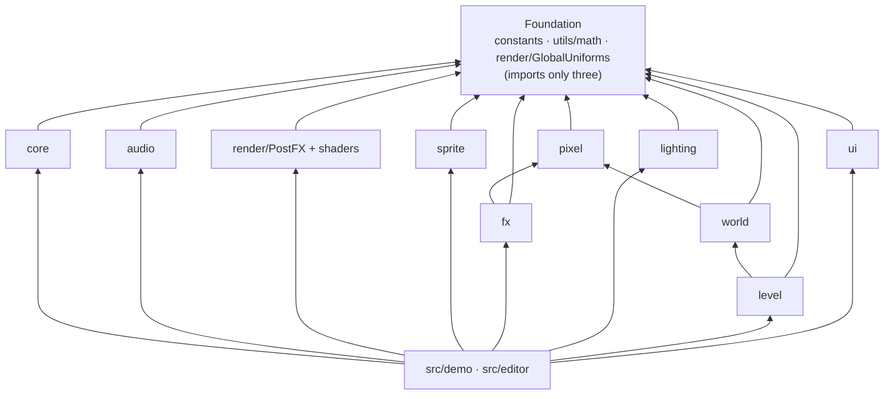

# Engine module reference: index

> **Purpose.** This is the entry point to the per-module reference of the Lumina engine
> (`src/engine/`). It lists every module area with a one-line responsibility and a link to its
> reference page, shows how the areas depend on each other, reproduces the complete public API
> exported by [`src/engine/index.js`](../../../src/engine/index.js), and lists the modules that
> are imported directly rather than through the barrel. Start here when you need to find where
> something lives, or what a module exposes, before opening its source.
>
> **Audience:** programmers and AI agents new to the codebase, and anyone adding or wiring an
> engine module.
>
> **Source of truth:** [`src/engine/`](../../../src/engine/) and the barrel
> [`src/engine/index.js`](../../../src/engine/index.js). The binding module contracts are in
> [ARCHITECTURE.md §4](../../../ARCHITECTURE.md). The builders' and auditors' notes are in
> [MODULE_NOTES.md](../../contracts/MODULE_NOTES.md). When they disagree, the code wins.
>
> **Related:** [OVERVIEW.md](../OVERVIEW.md) (system architecture) ·
> [RENDER_PIPELINE.md](../RENDER_PIPELINE.md) · [PERFORMANCE.md](../PERFORMANCE.md) ·
> [GAME.md](../GAME.md) · [EDITOR.md](../EDITOR.md) · [diagrams.html](../diagrams.html) ·
> [AGENT_ONBOARDING.md](../../ai/AGENT_ONBOARDING.md)

---

## 1. Module map

| Area | Files (`src/engine/…`) | Responsibility | Reference |
| --- | --- | --- | --- |
| **Foundation** | `constants.js`, `utils/math.js`, `utils/own.js` | World units (`PPU` 16, `LEVEL_HEIGHT` 0.5), `DIRECTIONS`, `RENDER_ORDER`; seeded RNG, hash, noise, fBm, damping, Bayer dither; own-key lookups and safe conversions for level data (`own.js`, not in the barrel). | [core.md §6–7](core.md#6-constants-srcengineconstantsjs) |
| **Core** | `core/Engine.js`, `core/Input.js`, `core/CameraRig.js`, `core/EventEmitter.js` | Renderer, scene, camera and the ordered-systems loop; keyboard, wheel, pointer and gamepad actions; the diorama follow camera; the event bus. | [core.md](core.md) |
| **Audio** | `audio/AudioSystem.js` | Procedural WebAudio: 8 sfx, 5 ambience layers, the "Emberfall Evening" folk loop. | [audio.md](audio.md) |
| **Render** | `render/PostFX.js`, `render/GlobalUniforms.js`, `render/shaders/*` | MSAA HDR scene → tilt-shift DOF with bokeh → soft-knee bloom → ACES → colour grade. Shared per-frame uniforms (time, night, wind, camera yaw, sun, fog). | [render.md](render.md) |
| **Pixel art** | `pixel/PixelCanvas.js`, `pixel/Palette.js`, `pixel/Textures.js`, `pixel/CharacterSprites.js`, `pixel/PropSprites.js` | Pixel drawing primitives and textures; the shared palette; 46 world textures with normal and emissive maps; 14 character presets, 4 creatures and 23 prop sprites, all procedural. | [pixel.md](pixel.md) |
| **Sprites** | `sprite/Sprite3D.js`, `sprite/SpriteManager.js`, `sprite/Foliage.js`, `sprite/BlobBatch.js` | Lit, shadow-casting animated billboards; the per-frame sprite registry; instanced wind-swayed foliage; instanced contact shadows. | [sprite.md](sprite.md) |
| **FX** | `fx/Particles.js`, `fx/GodRays.js` | Stateless GPU particle emitters and bursts (12 presets); sun-following light shafts. | [fx.md](fx.md) |
| **Lighting** | `lighting/LightingSystem.js`, `lighting/Sky.js`, `lighting/LightPool.js` | 24 h keyframed palette (sun and moon, texel-snapped shadows, hemisphere, fog, exposure, flickering point lights, emissives); sky dome; a fixed pool of 12 point lights shared across big levels. | [lighting.md](lighting.md) |
| **World** | `world/TileMap.js`, `world/Water.js`, `world/WaterShore.js`, `world/shoreWorker.js`, `world/Props.js` + `world/props/*`, `world/SpatialSplit.js`, `world/ShadowCasters.js` | Terrain meshes, heights, walkability and collision; animated pixel water and waterfalls with a shore bake (in a worker); the procedural prop factory (houses, trees, lights, fences, bridges, windmill …); big-level batching, culling and shadow-only casters. | [world.md](world.md) |
| **Level** | `level/LevelFormat.js`, `level/ObjectCatalog.js`, `level/ObjectBuilder.js`, `level/LevelStorage.js`, `level/LevelMap.js` | The `lumina-level` JSON format (normalise, validate, byte-stable serialise); the object catalog; building terrain and objects from a level; saving and loading (browser, dev-server API, files); the painted top-down map. | [level.md](level.md) |
| **UI** | `ui/UI.js`, `ui/DialogBox.js`, `ui/Banner.js`, `ui/TitleScreen.js`, `ui/HUD.js`, `ui/InteractPrompt.js`, `ui/Fader.js`, `ui/DebugPanel.js`, `ui/Minimap.js`, `ui/ui.css` | The DOM overlay: gold-bordered dialog with a typewriter and choices, area banner, title screen, clock/location/help HUD, interaction prompt, fades, lil-gui debug panel with stats, minimap and world map. | [ui.md](ui.md) |

### 1.1 Dependencies between areas

Imports only point "down" this graph (an arrow means "imports"). The game (`src/demo/`) and the
editor (`src/editor/`) sit on top and wire the areas together.



Every area imports `utils/math`. `render/GlobalUniforms` is imported by core (`Engine`,
`CameraRig`), sprite, fx, lighting and world; `PostFX` itself does not use it. The only
cross-area imports besides the foundation are fx → pixel, world → pixel and level → world: core,
audio, render, sprite, fx, lighting, level and ui are imported by no other engine area (only by
the barrel), and nothing in `src/engine/` imports `src/demo/` or `src/editor/`.

Modules never call each other for per-frame sync. They share the uniform objects in
`globalUniforms` ([render.md §2](render.md#2-globaluniforms)):

- `Engine` writes `uTime`.
- `CameraRig` writes `uCameraYaw` and `uCameraPosition` (in the editor, `EditorCamera` does).
- `LightingSystem` writes `uNight`, `uSunDirection`, `uSunColor` and `uFogColor`.
- The game writes `uWind` and `uWindStrength`. While it is overcast (rain, snow), the demo's
  `Weather` also greys `uSunColor` and `uFogColor` each frame, after `LightingSystem.update` has
  recomputed them.

### 1.2 Per-frame order in the demo

```text
Engine tick: input.update
  → LightingSystem.update (order −10: clock, palette, sun/moon, uniforms)
  → game system (order 0): player → NPCs/critters → CameraRig.update → SpriteManager.update
      → BlobBatch.update → Weather → World.update → GodRays.update → Particles.update → HUD …
  → AudioSystem.update (order 20)
  → LightingSystem.lateUpdate (shadow frustum re-centred on this frame's camera)
  → 'lateUpdate' event: UI.update
  → uTime written → render fn: PostFX.setFocus + PostFX.render
  → 'afterRender': DebugStats.update → input.endFrame
```

Details: [core.md §2.3](core.md#23-frame-order), [GAME.md](../GAME.md),
[RENDER_PIPELINE.md](../RENDER_PIPELINE.md).

---

## 2. Public API (`src/engine/index.js`)

```js
import { Engine, CameraRig, PostFX, LightingSystem, TileMap /* … */ } from './engine/index.js';
```

Importing the barrel has no side effects except the UI stylesheet and `@fontsource` font
imports pulled in by `ui/UI.js`. Everything below is exported **exactly** under these names.

| Section | Exports | From | Reference |
| --- | --- | --- | --- |
| Foundation | `PPU, TILE_SIZE, LEVEL_HEIGHT, DIRECTIONS, RENDER_ORDER` | `constants.js` | [core.md](core.md#6-constants-srcengineconstantsjs) |
| | `clamp, lerp, invLerp, remap, smoothstep, fract, damp, angleDelta, DEG2RAD, RAD2DEG, mulberry32, hashString, RNG, hash2, valueNoise2, fbm2, bayer4` | `utils/math.js` | [core.md](core.md#7-math-noise-and-randomness-srcengineutilsmathjs) |
| | `globalUniforms` | `render/GlobalUniforms.js` | [render.md](render.md#2-globaluniforms) |
| Core | `EventEmitter` | `core/EventEmitter.js` | [core.md](core.md#5-eventemitter) |
| | `Input, DEFAULT_BINDINGS, DEFAULT_PAD_BINDINGS, GAMEPAD_BUTTON_CODES` | `core/Input.js` | [core.md](core.md#3-input) |
| | `Engine, disposeObjectTree` | `core/Engine.js` | [core.md](core.md#2-engine) |
| | `CameraRig` | `core/CameraRig.js` | [core.md](core.md#4-camerarig) |
| Audio | `AudioSystem, SFX_NAMES, AMBIENCE_LAYERS, COMBAT_SFX_NAMES, MUSIC_TRACKS, MUSIC_STINGERS` | `audio/AudioSystem.js` | [audio.md](audio.md) |
| Rendering | `PostFX` | `render/PostFX.js` | [render.md](render.md#3-postfx-api) |
| Pixel art | `PixelCanvas, parseColor, toHex, toCss, toThreeColor, mixColor, rgbToHsl, hslToRgb, shadeColor, rampFrom, makePixelTexture, normalMapFromHeight` | `pixel/PixelCanvas.js` | [pixel.md](pixel.md#2-pixelcanvas) |
| | `PALETTE, rampAt` | `pixel/Palette.js` | [pixel.md](pixel.md#3-palette) |
| | `TextureLibrary, TEXTURE_NAMES` | `pixel/Textures.js` | [pixel.md](pixel.md#4-texturelibrary-world-textures) |
| | `createCharacterSheet, createCreatureSheet, CHARACTER_PRESETS, materialRamp, COMBAT_POSE_NAMES` | `pixel/CharacterSprites.js` | [pixel.md](pixel.md#5-charactersprites) |
| | `createEnemySheet, ENEMY_SHEET_KINDS` (combat) | `pixel/MonsterSprites.js` | [pixel.md](pixel.md) |
| | `createFxAtlas, FX_FRAMES` (combat) | `pixel/FxSprites.js` | [pixel.md](pixel.md) |
| | `createPropSprite, PROP_SPRITE_KINDS` | `pixel/PropSprites.js` | [pixel.md](pixel.md#6-propsprites) |
| Sprites | `Sprite3D, spriteSheetFromProp, patchSpriteLighting, cloneSharedTexture, GLSL_BAYER4` | `sprite/Sprite3D.js` | [sprite.md](sprite.md#2-sprite3d) |
| | `SpriteManager` | `sprite/SpriteManager.js` | [sprite.md](sprite.md#3-spritemanager) |
| | `BlobBatch` | `sprite/BlobBatch.js` | [sprite.md](sprite.md#5-blobbatch) |
| | `Foliage` | `sprite/Foliage.js` | [sprite.md](sprite.md#4-foliage) |
| Effects | `Particles, PARTICLE_PRESETS, Emitter` | `fx/Particles.js` | [fx.md](fx.md) |
| | `GodRays` | `fx/GodRays.js` | [fx.md](fx.md#5-godrays) |
| | `FxQuads` (combat) | `fx/FxQuads.js` | [fx.md](fx.md) |
| | `GroundMarkers, MARKER_GRID` (combat) | `fx/GroundMarkers.js` | [fx.md](fx.md) |
| Lighting | `LightingSystem, DEFAULT_KEYFRAMES` | `lighting/LightingSystem.js` | [lighting.md](lighting.md) |
| | `Sky` | `lighting/Sky.js` | [lighting.md](lighting.md) |
| | `LightPool` | `lighting/LightPool.js` | [lighting.md](lighting.md) |
| World | `TileMap, ORGANIC_TOPS, GRASS_TOPS, FRINGE_RECEIVERS, FRINGE_PRIORITY, paintDecalMask` | `world/TileMap.js` | [world.md](world.md) |
| | `Water, createWaterfall` | `world/Water.js` | [world.md](world.md) |
| | `PropFactory` | `world/Props.js` | [world.md](world.md) |
| UI | `UI, DialogBox, Banner, TitleScreen, HUD, InteractPrompt, Fader, DebugPanel, Minimap, WorldMap` | `ui/UI.js` (re-exports) | [ui.md](ui.md) |
| | `CombatHUD, BossBar, WorldLabels, Announcer, DeathScreen` (combat; registered with `UI.useCombatUI()`, created by `UI.enableCombat()`) | `ui/CombatHUD.js`, `ui/BossBar.js`, `ui/WorldLabels.js`, `ui/Announcer.js`, `ui/DeathScreen.js` (side-effect free in the build: a chunk that does not use them does not hold them) | [ui.md](ui.md) |
| | `DebugStats` | `ui/DebugPanel.js` | [ui.md](ui.md) |
| | `DEFAULT_CONTROLS, TIME_PHASES, timePhase, createKeycaps` | `ui/HUD.js` | [ui.md](ui.md) |
| Advanced: custom props | `MeshBuilder, trs` | `world/props/MeshBuilder.js` | [world.md](world.md) |
| | `applyWind, createWindDepthMaterial` | `world/props/Wind.js` | [world.md](world.md) |
| | `createFlame, createFlameMaterial, createGlowMaterial` | `world/props/Flame.js` | [world.md](world.md) |
| | `PropTextureSet` | `world/props/PropTextures.js` | [world.md](world.md) |
| Advanced: custom post passes | `FULLSCREEN_VERTEX, POST_COMMON_GLSL, CopyShader` | `render/shaders/PostCommon.js` | [render.md §7](render.md#7-shader-modules-exported-for-custom-passes) |
| | `GradeShader` | `render/shaders/GradeShader.js` | [render.md §7](render.md#7-shader-modules-exported-for-custom-passes) |
| | `BloomBrightPassShader` | `render/shaders/BloomShaders.js` | [render.md §7](render.md#7-shader-modules-exported-for-custom-passes) |
| | `createCocUniforms, DOF_COC_GLSL, DofPrefilterShader, goldenAngleKernel, createDofGatherShader, DofTentShader, DofBokehSpriteShader, DofCompositeShader` | `render/shaders/DofShaders.js` | [render.md §7](render.md#7-shader-modules-exported-for-custom-passes) |

### 2.1 Not in the barrel: import these directly

| Module | Notable exports | Used by |
| --- | --- | --- |
| `level/LevelFormat.js` | `LEVEL_FORMAT`, `LEVEL_VERSION`, `createEmptyLevel`, `normalizeLevel`, `validateLevel`, `serializeLevel`, `parseLevel`, `getTile`/`setTile`, `getHeightLevel`/`setHeightLevel`, `toTileMapInput`, `resizeLevel`, `shiftLevelContent`, `levelStats` … | game, editor, generators in `tools/` |
| `level/ObjectCatalog.js` | `OBJECT_TYPES`, `OBJECT_CATEGORIES`, `CHARACTER_PRESET_NAMES`, `CRITTER_KINDS`, `EMITTER_PRESETS`, `NPC_ACTIONS`, `NPC_BEHAVIOURS`, `createObject`, `normalizeObject`, `objectBounds`, `hitTestObject` … | editor inspector, game, builder |
| `level/ObjectBuilder.js` | `LevelObjectBuilder`, `buildLevelTerrain`, `buildWaterfall`, `computeCameraBounds`, `waterGlint`, `LIGHT_PRIORITY`, `bridgeDeckHeight` | game `World`, editor 3D preview |
| `level/LevelStorage.js` | `resolveLevelFromURL`, `listProjectLevels`, `saveProjectLevel`, `loadProjectLevel`, `saveLocalLevel`, `loadLocalLevel`, `PLAYTEST_SLOT` … | `src/main.js`, `src/demo/Game.js`, editor |
| `level/LevelMap.js` | `renderLevelMap(level, { pixelsPerTile })` → `{ canvas, pixelsPerTile, width, depth }` | the game (`Game._setupMaps`), which hands the canvas to the UI `Minimap` and `WorldMap` |
| `world/SpatialSplit.js` | `kdSplit`, `triangleCount`, `cullByBox` | big-level batching |
| `world/ShadowCasters.js` | `buildShadowCasters`, `makeShadowOnly`, `isProxyCaster`, `isShadowFrustum` | big-level shadows, sprite proxies |
| `world/WaterShore.js`, `world/shoreWorker.js` | `bakeShore` (pure function), the worker for `Water.refreshAsync()` | `Water`, editor |
| `world/props/*.js` | `buildHouse`, `buildTree`, `buildLamppost`, `buildWallTorch`, `buildCampfire`, `buildFence`, `buildWell`, `buildMarketStall`, `buildBridge`, `buildWindmill` … | `PropFactory` internals |

The level format and its API are specified in [LEVEL_FORMAT.md](../../specs/LEVEL_FORMAT.md),
[OBJECT_CATALOG.md](../../specs/OBJECT_CATALOG.md) and
[LEVEL_STORAGE_API.md](../../specs/LEVEL_STORAGE_API.md). The binding contract is
[contracts/LEVEL_EDITOR.md](../../contracts/LEVEL_EDITOR.md).

---

## 3. Sandboxes (one module in isolation)

Every module has a standalone test page under [`sandbox/`](../../../sandbox/). With
`npm run dev` running, open `http://127.0.0.1:5173/sandbox/` for an index with links and URL
variants. Headless verification (see
[TESTING_AND_VERIFICATION.md](../../development/TESTING_AND_VERIFICATION.md)):

```bash
npm run check -- --page=sandbox/<page>.html --query= --out=<name> [--script=sandbox/<script>.json]
```

`--query` defaults to `autostart=1` (meant for the game page). Pass `--query=` for none, or the
page's own parameters (for example `--query=view=atlas`). All scripts live in `sandbox/`.

| Page | Modules | `window` handle | Action scripts |
| --- | --- | --- | --- |
| `core.html` | Engine, Input, CameraRig, AudioSystem | `__core` (and `__engine`) | `core.actions.json`, `core.audio.actions.json`, `core.audio2.actions.json` |
| `postfx.html` | PostFX, DOF, bloom, grade | `__postfx` | `postfx.actions.json`, `postfx.robust.json`, `postfx.flicker.json`, `postfx.nan.json`, `postfx.perf.json` |
| `textures.html` | TextureLibrary, PixelCanvas, Palette | `__tex` | `textures.actions.json` |
| `sprite_art.html` | CharacterSprites, PropSprites; MonsterSprites, FxSprites, Sprite3D `combatFx` (`?mode=combat`, `?mode=hashes`) | `__sprites`, `__spriteCombat` | `sprite_art.actions.json`, `sprite_art.combat.json` |
| `sprite_runtime.html` | Sprite3D, SpriteManager, Foliage, Particles | `__sb` | `sprite_runtime.actions.json` |
| `lighting.html` | LightingSystem, Sky, GodRays | `__lighting` | `lighting.actions.json`, `lighting.quick.json`, `lighting.shadow.json` |
| `lighting_engine.html` | LightingSystem + Engine + CameraRig + PostFX + GodRays | `__lightEngine` | `lighting_engine.actions.json` |
| `terrain.html` | TileMap, Water, createWaterfall | `__terrain` | `terrain.actions.json`, `terrain.detail.json`, `terrain.perf.json`, `terrain.quick.json` |
| `props.html` | PropFactory, mergeStatic | `__props` | `props.actions.json`, `props.flame.json`, `props.gallery.json`, `props.merge.json`, `props.wind.json` |
| `ui.html` | UI components (`?combat=1`: the combat UI) | `__ui`, `__sandbox` | `ui.actions.json`, `ui.combat.actions.json` |
| `combat_fx.html` | FxQuads, GroundMarkers, combat bursts, combat audio, mouse input, stick zoom | `__cfx` | `combat_fx.actions.json` |
| `combat_audio.html` | Combat audio QA and listening page: every combat SFX, stinger, music section and dense mix rendered offline and measured (loudness, true peak, truncation, steps, leaks, spectrum), with waveform, spectrogram and live playback | `__caudio` | `combat_audio.actions.json` |
| `enemy_ai.html` | Enemy and the eight brains (game-layer code, tested in isolation; the walk grid `Nav` on the mock ledge) | `__sb` | `enemy_ai.actions.json` |
| `game_levels.html` | Game level-loading edge cases (`?case=hostile`: `Object.prototype` names and unconvertible values in the level data, in the game and the editor) | `__levelCases` | `game_levels.hostile.json` |
| `level_builder.html` | LevelFormat + LevelObjectBuilder smoke test | `__smoke` | none |
| `editor3d.html` | The editor's 3D viewport in isolation | `__vp` | `editor3d.actions.json`, `editor3d.audit.actions.json`, `editor3d.real.actions.json`, `editor3d.tilemap.actions.json` (`editor3d.app.actions.json` drives `editor.html` through `window.__editor`) |
| `smoke.html` | three.js smoke test | none | none |

The `sandbox/editor_shell.*.json` and `sandbox/editor_perf*.json` scripts drive the real
`editor.html` (see [EDITOR.md](../EDITOR.md) and
[TESTING_AND_VERIFICATION.md](../../development/TESTING_AND_VERIFICATION.md)).

---

## 4. Conventions every module follows

Short list; the full rules are in [ARCHITECTURE.md §2](../../../ARCHITECTURE.md) and
[CONVENTIONS.md](../../development/CONVENTIONS.md).

- three.js **r186**, plain-JS ES modules, JSDoc on public APIs, `import * as THREE from 'three'`.
  The JSDoc is type-checked (`npm run typecheck`); folders with lazily created fields or shared
  contract types have a type-only `types.d.ts` (`core`, `audio`, `render`, `lighting`, `world`,
  `level`, `ui`) — [CONVENTIONS.md §3.1](../../development/CONVENTIONS.md#31-the-type-check).
- **Y up.** Tile `(i, j)` covers `x∈[i,i+1], z∈[j,j+1]`. World height = level × 0.5. 16 texels
  per unit. Camera yaw 0 looks toward −Z, so screen-down is +Z.
- **Colour management:** SRGB output. Colour textures are SRGB and data textures `NoColorSpace`.
  ACES tone mapping happens once, in PostFX's `OutputPass`. `LightingSystem` owns
  `toneMappingExposure`.
- **Determinism:** seeded `RNG` / `hash2` / `fbm2`, never `Math.random()`, for procedural content.
- **Disposal:** every class that allocates GPU resources has `dispose()`.
- **Fixed light count:** at most 12 point lights (`min(12, light descriptors)` in the game), all
  created before the first frame. Changing the count (or toggling
  `light.visible`) recompiles every lit shader. Fade intensities instead ([lighting.md](lighting.md)).
- **Warm shaders against `postfx.sceneTarget`** ([render.md §6](render.md#6-wiring-rules-read-before-touching-the-pipeline)).
- **Contract changes are additive.** Never rename a contract member or change its meaning.
  Document what you add.

Known limitations and open issues across modules are collected in
[KNOWN_ISSUES.md](../../ai/KNOWN_ISSUES.md). Recipes for common changes are in
[TASK_PLAYBOOKS.md](../../ai/TASK_PLAYBOOKS.md).

Every module page ends with a **History and decisions** section. These summarise the builder,
auditor and reviewer reports of the multi-agent workflows that built the module (the raw reports
are gitignored). Project-wide history is in
[PROJECT_HISTORY.md](../../history/PROJECT_HISTORY.md) and
[DECISIONS.md](../../history/DECISIONS.md).
