# Core module: Engine, Input, CameraRig, EventEmitter, constants, math

> **Purpose.** This is the reference for the foundation of every Lumina front end: the render
> loop with its ordered systems (`Engine`), keyboard, mouse and gamepad input with named actions
> (`Input`), the HD-2D diorama follow camera (`CameraRig`), the tiny event bus (`EventEmitter`),
> the engine-wide constants and the seeded math, noise and randomness helpers. It covers every
> public member, its defaults and its behaviour at the edges, and the order things run in each
> frame.
>
> **Audience:** engine and game programmers, and AI agents changing or wiring these classes.
>
> **Source of truth:** [`src/engine/core/Engine.js`](../../../src/engine/core/Engine.js),
> [`src/engine/core/Input.js`](../../../src/engine/core/Input.js),
> [`src/engine/core/CameraRig.js`](../../../src/engine/core/CameraRig.js),
> [`src/engine/core/EventEmitter.js`](../../../src/engine/core/EventEmitter.js),
> [`src/engine/constants.js`](../../../src/engine/constants.js),
> [`src/engine/utils/math.js`](../../../src/engine/utils/math.js),
> [`src/engine/utils/own.js`](../../../src/engine/utils/own.js).
> The binding contract is [ARCHITECTURE.md §4.1](../../../ARCHITECTURE.md). Where this page and
> the contract differ, the code (and this page) wins.
>
> **Related:** [modules index](README.md) · [render.md](render.md) (`globalUniforms`, PostFX) ·
> [audio.md](audio.md) · [OVERVIEW.md](../OVERVIEW.md) · [GAME.md](../GAME.md) (how the demo wires the loop) ·
> [INPUT_AND_CONTROLS.md](../../specs/INPUT_AND_CONTROLS.md) (what each action does in game and editor) ·
> [MODULE_NOTES.md](../../contracts/MODULE_NOTES.md) (builder/auditor notes)

---

## 1. At a glance

| Export | File | What it is |
| --- | --- | --- |
| `Engine`, `disposeObjectTree` | `core/Engine.js` | Owns `WebGLRenderer`, `Scene`, `PerspectiveCamera`, `Input` and the `setAnimationLoop` loop. Runs registered *systems* in a fixed order, resizes to its container and reports errors without stopping the loop. |
| `Input`, `DEFAULT_BINDINGS`, `DEFAULT_PAD_BINDINGS`, `GAMEPAD_BUTTON_CODES` | `core/Input.js` | Keyboard (by `KeyboardEvent.code`), wheel, pointer and standard-mapping gamepad state, with named actions and per-frame press/release edges. |
| `CameraRig` | `core/CameraRig.js` | The diorama camera: narrow FOV, high pitch, far away, smoothed follow with look-ahead, a limited Q/E orbit arc, zoom, shake and bounds. It writes `globalUniforms.uCameraYaw` / `uCameraPosition`. |
| `EventEmitter` | `core/EventEmitter.js` | `on / off / once / emit` with copy-on-write listener lists. `emit` allocates nothing for up to 4 arguments. |
| `PPU, TILE_SIZE, LEVEL_HEIGHT, DIRECTIONS, RENDER_ORDER` | `constants.js` | World units and conventions. |
| `clamp … bayer4` (17 helpers) | `utils/math.js` | Scalar helpers, frame-rate independent damping, the seeded PRNG (`mulberry32`, `RNG`), a lattice hash, value noise, fBm and 4×4 Bayer dithering. |
| `isOwnKey`, `ownValue`, `showValue`, `toText`, `toNumber` | `utils/own.js` | Own-key lookups for names from level data, and conversions that never throw ([§7.1](#71-names-and-values-from-level-data-srcengineutilsownjs)). |

All of them except `utils/own.js` are re-exported by [`src/engine/index.js`](../../../src/engine/index.js); import `own.js` by path.

**Sandbox:** [`sandbox/core.html`](../../../sandbox/core.html) (+ `core.js`). It is a golden-hour
flagstone diorama with a crystal marker you steer with WASD. It shows a live readout of keys,
edges, actions, move vector, pointer, gamepad and camera, plus sfx, ambience and music controls
with an oscilloscope. `window.__core` exposes `engine, rig, audio, input, marker, THREE, tests,
runAllTests(), analyzeAudio(), exerciseAudio(), teardown(), state, resizeLog, dispatchKey()`; the
page also sets `window.__engine`.

```bash
npm run check -- --page=sandbox/core.html --query= --out=core --wait=3000 --script=sandbox/core.actions.json
# audio-focused scripts: sandbox/core.audio.actions.json, sandbox/core.audio2.actions.json
```

---

## 2. Engine

### 2.1 Constructor

```js
new Engine(opts?)
```

| Option | Type | Default | Notes |
| --- | --- | --- | --- |
| `container` | `HTMLElement` | `document.body` | The canvas fills it (`width/height: 100%`). With `document.body` or `document.documentElement` the engine runs **full-window**: the canvas is `position: fixed` and is sized from `window.innerWidth/innerHeight`. Otherwise a `ResizeObserver` watches the container. |
| `maxPixelRatio` | number | `1.5` | Cap on `devicePixelRatio`. The demo passes `1.25`. Mutable later (`engine.maxPixelRatio = …; engine.resize()`). |
| `renderScale` | number | `1` | Multiplier on the capped pixel ratio, clamped to `0.25..1`. |
| `shadowMapType` | `THREE.ShadowMapType` | `THREE.PCFShadowMap` | `THREE.PCFSoftShadowMap` is silently mapped to `PCFShadowMap`: three r186 removed it and would warn on every page. `PCFShadowMap` is soft and honours `light.shadow.radius`. |
| `clearColor` | `ColorRepresentation` | `0x0b0e1a` | Opaque clear colour (deep night blue). |
| `preserveDrawingBuffer` | boolean | `false` | Needed only for `canvas.toDataURL()` captures. |
| `inputTarget` | `EventTarget` | `window` | Where `Input` listens. The level editor passes `new EventTarget()` so the engine's `Input` never sees the page's keys. |
| `exposeGlobal` | boolean | URL has `?debug` or `?autostart` | Sets `window.__engine = engine`. The editor passes `false`. |
| `manualStep` | boolean | URL has `?fixedstep` (any value but `0`) **together with** `?autostart` or `?debug` | Start in manual-step mode (see `manualStep` in §2.2): no animation loop; frames advance only through `step()`. For tests and bots; a stray `?fixedstep` on a normal page is ignored, because it would freeze it. |

What the constructor sets up:

- **Renderer:** `new THREE.WebGLRenderer({ antialias: false, powerPreference: 'high-performance', stencil: false, preserveDrawingBuffer })`.
  It also sets `shadowMap.enabled = true`, `toneMapping = ACESFilmicToneMapping`,
  `toneMappingExposure = 1` and `outputColorSpace = SRGBColorSpace`. Anti-aliasing comes from
  PostFX's MSAA scene target, and tone mapping is applied once by PostFX's `OutputPass`. See
  [render.md](render.md).
- **Canvas:** the class is `lumina-canvas`, with `display: block`, `touch-action: none`,
  `outline: none` and `tabIndex = -1`. It is appended to the container.
- **Camera:** `PerspectiveCamera(28, 1, 0.5, 400)` placed at `(0, 12.7, 20.4)` looking at the
  origin. Its aspect is set by the first (forced) resize at the end of the constructor. A
  `CameraRig` normally takes it over.
- **Listeners:** `webglcontextlost`, handled with `preventDefault` so the context can be restored,
  and `webglcontextrestored`, window `resize` (which also catches browser zoom and DPR changes)
  and the container `ResizeObserver`. The constructor then does an immediate forced resize.

### 2.2 Members

| Member | Kind | Description |
| --- | --- | --- |
| `renderer` | `THREE.WebGLRenderer` | See above. |
| `scene` | `THREE.Scene` | The single scene. |
| `camera` | `THREE.PerspectiveCamera` | fov 28, near 0.5, far 400. |
| `input` | `Input` | Created with `opts.inputTarget ?? window`. |
| `events` | `EventEmitter` | Engine events (see §2.4). |
| `time` | object | `{ elapsed, delta, frame, timeScale, realDelta, realElapsed, fps }`. `delta` = min(real Δ, **1/20 s**) × `timeScale`. `elapsed` sums `delta`, so it is scaled time. `realDelta` / `realElapsed` are unclamped wall-clock values. `fps` is an exponential moving average (factor 0.05) of 1/realΔ. Set `time.timeScale` to slow or pause simulation (0 pauses systems' dt, not rendering). |
| `opts`, `container`, `maxPixelRatio` | | Constructor inputs. |
| `resizeThrottleMs` | number, `0` | When > 0, automatic resizes run at most this often and once at the end. The canvas is CSS-stretched in between. The editor raises it while a splitter is dragged. |
| `width`, `height` | getter | Canvas size in **CSS px** (floored, ≥ 1). |
| `pixelRatio` | getter | `min(devicePixelRatio, maxPixelRatio) × renderScale`. |
| `aspect` | getter | `width / height`. |
| `drawingBufferSize` | getter | `renderer.getDrawingBufferSize()` in device px. The `Vector2` is reused, so copy it to keep it. |
| `canvas` | getter | `renderer.domElement`. |
| `renderScale` | get/set | `0.25..1`. Setting it forces a resize. The demo's `ResolutionGovernor` lowers it in 0.1 steps when the GPU is slow; see [PERFORMANCE.md](../PERFORMANCE.md). |
| `running` | getter | Whether the loop is running (in manual-step mode: whether the engine was started). |
| `manualStep` | get/set | Manual stepping (opt-in; added 2026-09-28 for the deterministic play-through bot, KNOWN_ISSUES COMBAT-14). While on, the engine installs **no** animation loop — `start()` / `stop()` only mark it started / stopped — and frames advance only through `step()`, e.g. a fixed 1/60 s as fast as the page allows, so a scripted run repeats frame for frame on any GPU load (`sandbox/combat_play.js`). Turning it off reinstalls the loop if the engine is started. Starts from `opts.manualStep` or the URL flag. Normal play never turns it on. |
| `systems` | getter | Registered systems in execution order (a new array). |

| Method | Returns | Description |
| --- | --- | --- |
| `addSystem(system, order = 0)` | `system` | Registers `{ name?, update?(dt, t, engine), lateUpdate?(dt, t, engine), dispose?() }`. Systems run in ascending `order`, and equal orders keep insertion order. Re-adding a registered system only changes its order. A class instance works directly (`engine.addSystem(lighting, -10)`). The name used in error logs is `system.name \|\| system.constructor.name`. |
| `removeSystem(system)` | boolean | Unregisters the system without disposing it. |
| `setRenderFn(fn \| null)` | | Replaces `renderer.render(scene, camera)` with `fn(dt, t)`, for example `(dt) => postfx.render(dt)`. `null` restores the default. |
| `start()` | `this` | Idempotent. The **first** `start()` forces one `'resize'` emit, so listeners added after construction (PostFX, UI) get the initial size. Emits `'start'`. |
| `stop()` | `this` | Idempotent. Emits `'stop'`. |
| `step(realDt = 1/60, { render = true } = {})` | | Advances exactly one frame, with the same clamping and time scale as the loop. Useful for tests or rendering while stopped. `render: false` runs the frame without drawing it (no `'beforeRender'`, render function or `'afterRender'`; `input.endFrame()` still runs) — a manual-step bot that draws every n-th frame. |
| `redraw()` | | Draws the current frame again without advancing it: the render step alone (`'beforeRender'`, the render function, `'afterRender'`) with dt 0 — e.g. before a screenshot after `step(dt, { render: false })`. |
| `resize()` | | Forces a resize pass (emits `'resize'` even if nothing changed). |
| `dispose({ disposeScene = true } = {})` | | Stops the loop and emits `'dispose'`. It then calls `dispose()` on every system in **reverse** order and disposes `input`, observers and the window listener. With `disposeScene` it walks the scene through `disposeObjectTree`, which frees **shared** geometries, materials and textures too. Finally it runs `renderer.dispose()` and `forceContextLoss()`, removes the canvas, clears `events` and deletes `window.__engine`. A second call is a no-op. |

`disposeObjectTree(root)` disposes each geometry, material, material texture (including textures
in `ShaderMaterial.uniforms`), `customDepthMaterial`, `customDistanceMaterial`, light shadow map,
`InstancedMesh`, `scene.background` and `scene.environment` **once**.

### 2.3 Frame order

Every `setAnimationLoop` tick, or every `step()`, runs `_frame(realDt)` (with
`step(dt, { render: false })` the three render steps G–I are skipped; `redraw()` runs only them):

```mermaid
flowchart LR
  A["input.update()<br/>(poll gamepad)"] --> B["systems.update(dt, t, engine)<br/>ascending order"]
  B --> C["events 'update'(dt, t)"]
  C --> D["systems.lateUpdate(dt, t, engine)"]
  D --> E["events 'lateUpdate'(dt, t)"]
  E --> F["globalUniforms.uTime = t"]
  F --> G["events 'beforeRender'"]
  G --> H["render fn(dt, t)<br/>or renderer.render"]
  H --> I["events 'afterRender'"]
  I --> J["input.endFrame()<br/>(clear edges, wheel)"]
```



- If a system or listener disposes the engine mid-frame, the frame stops after `'lateUpdate'`
  and does not render with a disposed renderer.
- **Error isolation:** a throwing system phase, event listener or render function is logged
  **once per (owner, phase)** with `console.error('[Engine] … threw in … (further errors from it
  are suppressed)')`. It also emits `'error'` `{ label, phase, error }`. The loop keeps running,
  and later systems still run. A system that throws every frame therefore shows only one error,
  so check `'error'` events when something silently stops updating.
- Frame-event listeners are called as `fn.call(engine.events, dt, t)`.

How the demo game uses the order for every level (`Game.init` in
[`src/demo/Game.js`](../../../src/demo/Game.js); see [GAME.md](../GAME.md)):
`LightingSystem` at order −10 (clock and palette in `update`, shadow frustum in `lateUpdate`),
then a `game` system at 0 (player, NPCs, `CameraRig.update`, `SpriteManager.update`, particles …),
then `AudioSystem` at 20. The `'lateUpdate'` event drives `ui.update`, the render fn does
`postfx.setFocus(); postfx.render(dt)`, and `'afterRender'` drives the debug stats.

### 2.4 Events (`engine.events`)

| Event | Arguments | When |
| --- | --- | --- |
| `resize` | `{ width, height, pixelRatio }` (CSS px) | On construction (forced), on the first `start()` (forced), on `resize()` and on a `renderScale` change (both forced), and on every real change of size or pixel ratio. |
| `update`, `lateUpdate`, `beforeRender`, `afterRender` | `(dt, t)` | Each frame, see §2.3. |
| `start`, `stop`, `dispose` | none | Loop state changes. |
| `error` | `{ label, phase, error }` | The first failure of a system phase, listener or render fn. |
| `contextlost`, `contextrestored` | none | WebGL context events. A `console.warn` is also logged. |

### 2.5 Resizing

`_resize(force)` measures the container: `window.innerWidth/innerHeight` in full-window mode,
otherwise `clientWidth/clientHeight` falling back to `getBoundingClientRect()`. It floors to
integers ≥ 1 and computes the pixel ratio. When something changed (or `force`), it calls
`setPixelRatio` (only if the ratio changed, so the buffer is reallocated once), then
`renderer.setSize(w, h, false)`, updates `camera.aspect` and emits `'resize'`.

> **Gotcha:** in full-window mode a visible page scrollbar stretches the canvas by the scrollbar
> width. Keep `overflow: hidden` on full-window pages, as `index.html` does.

---

## 3. Input

### 3.1 Constructor and properties

```js
new Input(target = window, { deadzone = 0.2, wheelIgnoreSelector } = {})
```

| Member | Default | Description |
| --- | --- | --- |
| `target` | `window` | Receives `keydown`, `keyup`, `wheel` (passive), `pointermove/down/up/cancel`. `blur`, `gamepadconnected/disconnected` go on `window`, `visibilitychange` on `document`, and `pointerleave` on `document.documentElement`. |
| `enabled` | `true` | When `false` **every** query returns `false` or zero, including `wheelDelta` (wheel events are dropped while disabled). |
| `bindings` | copy of `DEFAULT_BINDINGS` | `{ [action]: KeyboardEvent.code[] }`, editable at runtime. The set of bound codes is re-derived when it changes. |
| `padBindings` | copy of `DEFAULT_PAD_BINDINGS` | `{ [action]: virtualGamepadCode[] }`, editable. |
| `deadzone` | `0.2` | Radial stick deadzone. The magnitude is rescaled so it starts at 0 at the deadzone edge. |
| `triggerThreshold` | `0.35` | Analog LT/RT value above which `GamepadLT` / `GamepadRT` count as held. |
| `wheelIgnoreSelector` | `'.lil-gui, input, textarea, select, [contenteditable], [data-input-ignore]'` | Wheel events whose target is inside a match are ignored, so scrolling a GUI panel doesn't zoom the camera. |
| `wheelDelta` | `0` | Accumulated wheel `deltaY` since the last `endFrame()`, normalised for `deltaMode` (lines ×16, pages ×400). |
| `pointer` | `{ x, y, down, buttons, inside }` | Client CSS px. `inside` turns false when the pointer leaves the document. |
| `gamepad` | `{ connected, index, id, leftStick:{x,y}, rightStick:{x,y}, leftTrigger, rightTrigger }` | The first connected pad. Sticks are deadzoned with **+y = up**. |
| `lastDevice` | `'keyboard'` | The device of the latest **pressed edge**: `'keyboard'`, `'mouse'` (only after `enableMouseButtons`) or `'gamepad'`. Sticks and the wheel don't change it. Combat levels switch the HUD legend with it (§3.6). |

### 3.2 Queries

| Method | Description |
| --- | --- |
| `isDown(code)` | Key (`'KeyW'`) or virtual pad code (`'GamepadA'`) currently held. |
| `wasPressed(code)` / `wasReleased(code)` | Edge since the previous frame. **Edges accumulate between frames** and are cleared in `endFrame()`, so a tap that starts and ends between two frames still reports `wasPressed` on the next frame. Auto-repeat keydowns don't create new press edges. |
| `anyPressed()` | Any key or pad button pressed this frame. |
| `action(name)` | Any bound key or pad button held. A virtual pad code placed in `bindings` works too. |
| `actionPressed(name)` / `actionReleased(name)` | Edge versions. |
| `consumeAction(name)` | Returns whether the action was pressed, and removes its press edges so later readers in the same frame don't see it. For example, a dialog swallowing `confirm` so the same press doesn't also start a new conversation. |
| `getMoveVector(out?)` | `{x, y}`, with x>0 = right and **y>0 = up/forward (screen up)**. It combines WASD, arrows and the d-pad (through the `up/down/left/right` actions; diagonals are normalised) with the left stick, clamped to length ≤ 1. It returns a **reused** object. |
| `getLookVector(out?)` | Right stick `{x, y}` (y>0 = up), reused object. `CameraRig` uses `.x` to orbit. |

Frame protocol (the Engine does this for you): `update()` polls gamepads at the start of a
frame, and `endFrame()` clears edges and `wheelDelta` after rendering. `reset()` releases every
held key and button (firing release edges); it runs on window `blur` and when the tab becomes
hidden. `dispose()` removes every listener.

### 3.3 Default bindings

`DEFAULT_BINDINGS` is frozen and matches ARCHITECTURE §4.1. `DEFAULT_PAD_BINDINGS` is the
standard-mapping gamepad table.

| Action | Keyboard (`KeyboardEvent.code`) | Gamepad |
| --- | --- | --- |
| `up` / `down` / `left` / `right` | `KeyW`,`ArrowUp` / `KeyS`,`ArrowDown` / `KeyA`,`ArrowLeft` / `KeyD`,`ArrowRight` | d-pad (`GamepadDpadUp/Down/Left/Right`) + left stick via `getMoveVector` |
| `run` | `ShiftLeft`, `ShiftRight` | `GamepadRT` (analog > 0.35) |
| `confirm` | `Space`, `Enter`, `KeyF` | `GamepadA` |
| `cancel` | `Escape`, `Backspace` | `GamepadB` |
| `camLeft` / `camRight` | `KeyQ` / `KeyE` | `GamepadLB` / `GamepadRB` (+ right stick x) |
| `zoomIn` / `zoomOut` | `KeyZ`,`Equal` / `KeyX`,`Minus` | `GamepadY` / `GamepadX` |
| `debug` | `Backquote`, `F1` | none |
| `time` | `KeyT` | none |
| `photo` | `KeyP` | `GamepadRS` (right stick click) |
| `help` | `KeyH` | `GamepadStart` |
| `weather` | `KeyR` | none |
| `music` | `KeyM` | none |
| `map` | `KeyN`, `Tab` | `GamepadBack` (View) |

`GAMEPAD_BUTTON_CODES` maps standard button indices 0–16 to
`GamepadA, B, X, Y, LB, RB, LT, RT, Back, Start, LS, RS, DpadUp, DpadDown, DpadLeft, DpadRight, Home`.
With a non-standard mapping, indices above 11 (the d-pad and Home) are ignored.

What each action does in the game and in the editor is specified in
[INPUT_AND_CONTROLS.md](../../specs/INPUT_AND_CONTROLS.md). The engine only defines the names.

### 3.4 Browser-default handling and focus rules

- `preventDefault()` is called only for **bound** keys, and never while Ctrl, Meta or Alt is
  held, so browser shortcuts keep working. This blocks arrow and Space scrolling, F1 help and Tab
  focus moves.
- Keys typed while the event target or `document.activeElement` is editable (text-like
  `<input>`, `<textarea>`, `<select>`, `contenteditable`) are **neither registered nor
  prevented**. Buttons, checkboxes, radios, ranges and colour inputs don't count as editable.
- Because Space and Enter are prevented, a **focused `<button>` will not activate** from Space
  or Enter (intended: `confirm` must not also click UI). The core sandbox blurs its buttons after
  a click; do the same for any HTML button on a page whose `Input` listens on `window`.

### 3.5 Gamepad polling

Polling in `update()` starts only after a `gamepadconnected` event, which the browser fires on
the first button press on the page, or while a pad is known to be connected. It uses the first
connected pad in `navigator.getGamepads()`. Axes 0/1 are the left stick and 2/3 the right stick.
Buttons 6/7 (LT/RT) are analog and compared with `triggerThreshold`. Pad presses and releases
feed the same edge sets as keys.

### 3.6 Runtime bindings and mouse buttons (combat levels, opt-in)

Added for the ARPG combat ([COMBAT.md §5.3](../../contracts/COMBAT.md#53-engine-input--camera-additions-fx-audio-input-package)).
Nothing here runs unless a game calls it, so peaceful levels keep today's bindings, and J, K, L,
digits and mouse clicks stay unbound and not `preventDefault`ed.

| Member | Description |
| --- | --- |
| `addBindings(keyboard = {}, pad = {})` | For every action key, replaces that action's code list with a copy of the given one (an empty list unbinds it, e.g. `zoomIn: []` for the pad). Other actions are untouched, and new action names such as `skillMod` or `photoPad` are allowed. The bound-code cache is invalidated, so newly bound keys are `preventDefault`ed from the next key event on (never with Ctrl, Alt or Meta). |
| `enableMouseButtons(target)` | Reports mouse buttons as the codes `'Mouse0'` (left), `'Mouse1'` (middle) and `'Mouse2'` (right) in the key sets, so they work with `isDown`, `wasPressed`, `wasReleased` and actions (`attack: ['KeyJ', 'Mouse0']`). **A press counts only when the pointer event's target is `target`** (the renderer canvas), so clicks on the dialog, choices, title screen, lil-gui or death screen never produce the codes. **A release counts anywhere** (window listeners, capture phase), and `reset()` on blur or a hidden tab releases every held button, so a button can't stick. A second button pressed while one is held (reported as `pointermove` with `button ≥ 0`) is handled the same way. The context menu and the middle-button autoscroll are suppressed on `target` only. Each press sets `lastDevice = 'mouse'`. Calling it again moves the listeners; `dispose()` removes them. |

Mouse aim is not part of `Input`: combat intersects the camera ray through `input.pointer` with
the plane `y = player.y + 0.8` itself.

**Test page:** [`sandbox/combat_fx.html`](../../../sandbox/combat_fx.html) checks `addBindings`
(a separate "peaceful" `Input` stays unbound and unprevented), mouse edges on and off the canvas,
chords, blur, the context menu and `lastDevice` with synthetic and real clicks.

---

## 4. CameraRig

```js
new CameraRig(camera, opts?)
```

Camera position = `focusPoint + (sin(yaw)·cos(pitch), sin(pitch), cos(yaw)·cos(pitch)) · distance`.
Yaw 0 puts the camera on the **+Z** side looking toward −Z, so screen-down is +Z. The rig calls
`camera.lookAt(focusPoint)` (plus shake) and `camera.updateMatrixWorld()`, then writes
`globalUniforms.uCameraYaw = yaw` and `uCameraPosition = camera.position`. The constructor
already applies the initial pose.

### 4.1 Options (angles in degrees)

| Option | Default | Meaning |
| --- | --- | --- |
| `pitch` | `32` | Initial pitch, clamped to `[minPitch, maxPitch]`. |
| `yaw` | `0` | Initial yaw. It also becomes `yawCenter`, the centre of the allowed orbit arc. |
| `distance` | `24` | Initial distance, clamped to `[minDistance, maxDistance]`. |
| `minDistance` / `maxDistance` | `14` / `36` | Zoom range. The demo uses 18 / 42 with distance 30 ([`src/demo/config.js`](../../../src/demo/config.js) `CAMERA`). |
| `fov` | `28` | Always applied: without the option, a camera whose fov isn't 28 is reset to 28. |
| `followLambda` | `5` (1/s) | XZ follow smoothing. |
| `followLambdaY` | `followLambda × 0.7` | Vertical follow smoothing, softer so stairs don't bounce the view. |
| `lookAhead` | `1.0` (world units) | Maximum focus offset in the direction of motion. The demo uses 1.3. |
| `lookAheadSpeed` | `4` (u/s) | Target speed at which the full look-ahead is reached. |
| `lookAheadLambda` | `2.2` | Look-ahead offset smoothing. |
| `targetOffsetY` | `1.0` | The focus point sits this far above the target's feet. |
| `freeYaw` | `false` | `true` removes the ±`yawLimit` clamp. |
| `yawLimit` | `60` | Orbit half-arc around `yawCenter`. |
| `rotateSpeed` | `70` (°/s) | Hold-to-orbit speed for Q/E, LB/RB and the right stick. |
| `rotateLambda` / `pitchLambda` / `zoomLambda` | `7` / `6` / `6` | Smoothing of yaw, pitch and distance toward their targets. |
| `zoomKeySpeed` | `14` (u/s) | Hold `zoomIn`/`zoomOut`. |
| `wheelZoomScale` | `0.012` (u per wheel px) | Wheel down (positive `deltaY`) zooms **out**. |
| `minPitch` / `maxPitch` | `8` / `80` | Pitch clamp. |
| `autoSnapDistance` | `8` | A target jump larger than this on XZ within one frame (a teleport) snaps the camera instead of smearing it across the map. |

Fixed internals: `velocityLambda = 8`, `shakeFrequency = 14`, `name = 'CameraRig'` (for engine
error logs).

### 4.2 Members

| Member | Description |
| --- | --- |
| `focusPoint` | `Vector3`, the smoothed look-at point. |
| `yaw`, `pitch`, `distance` | Current smoothed values (radians, units). |
| `yawTarget`, `pitchTarget`, `distanceTarget` | What they approach. You may write them; they are clamped in `update()`. |
| `yawCenter` | Centre of the yaw arc (the initial yaw). The ±60° limit is **not** around world yaw 0. |
| `bounds` | `null` or `{ minX, maxX, minZ, maxZ }`, clamping the focus point (and the look-ahead target). |
| `target` | The followed `Object3D` (its world position is used), `Vector3` (read live) or `{x, y?, z?}`. |
| `velocity`, `lookOffset` | Smoothed target XZ velocity and current look-ahead offset. |
| `inputEnabled` | `true`. Set `false` to freeze orbit and zoom input during dialogs and cutscenes. The demo does this while talking or while the map is open. |
| `stickZoom` | `0` (off). Zoom speed in u/s at full right-stick **Y** deflection; stick up zooms in. It reads `input.getLookVector().y`, deadzoned exactly like the X axis that orbits. Combat levels set 14, because they move the pad's zoom off X / Y (COMBAT.md §5.2). |

| Method | Description |
| --- | --- |
| `setTarget(obj \| null)` | Start following, or stop with `null`, in which case the focus stays where it is. It resets the velocity history. |
| `snap()` | Jumps yaw, pitch, distance and focus to their targets. Call it after `setTarget` at scene start, otherwise the camera pans over from the origin. |
| `rotate(deltaRadians)` | Adds to `yawTarget`, then clamps. `camLeft` (Q) **decreases** yaw. |
| `zoom(delta)`, `zoomIn(amount = 2)`, `zoomOut(amount = 2)` | Change `distanceTarget`, clamped. |
| `setAngles(yawDeg, pitchDeg?)` | Set angle targets in degrees (smoothly approached). |
| `shake(intensity, duration = 0.4)` | World-unit amplitude (0.1 subtle … 0.6 strong). A stronger shake overrides the remaining amplitude of a weaker one. It decays quadratically. |
| `update(dt, input?)` | Reads input (if `inputEnabled` and `input.enabled`: `camLeft` / `camRight`, `zoomIn` / `zoomOut`, the wheel, right-stick X, and right-stick Y when `stickZoom` ≠ 0), follows the target with look-ahead, smooths the orbit and applies the pose. Also callable as an engine system: `update(dt, t, engine)` takes `engine.input`. Returns `this`. |
| `focusDistance` | Getter: camera → `focusPoint` distance. |
| `getMoveBasis(out?)` | `{ forward, right }` on XZ from the **smoothed** yaw. `forward = (−sin yaw, 0, −cos yaw)` (screen up), `right = (cos yaw, 0, −sin yaw)`. Reused object. |
| `toWorldDirection(x, y, out = new Vector3())` | Converts a screen-space move vector (for example `input.getMoveVector()`) to world XZ: `(c·x − s·y, 0, −s·x − c·y)`. |
| `fov` | get/set, updates the projection. |
| `shakeAmount` | Getter: current shake amplitude. |
| `dispose()` | Clears the target. Nothing GPU-side is held. |

### 4.3 Algorithms

- **Follow:** the target's XZ velocity is measured each frame and smoothed with
  `velocityLambda 8`. Look-ahead is `lookAhead × min(1, speed / lookAheadSpeed)` along the
  velocity, smoothed with `lookAheadLambda`. The desired focus is
  `target + lookOffset + (0, targetOffsetY, 0)`, clamped to `bounds`. The focus moves toward it
  with `damp(followLambda, dt)` on XZ and `damp(followLambdaY, dt)` on Y. All smoothing uses
  `damp(λ, dt) = 1 − e^(−λ·dt)`, so it is frame-rate independent.
- **Shake:** smooth `valueNoise2` offsets along the camera's right and up axes, with amplitude
  `intensity·(1 − t/duration)²`, a look-target offset of 35 % and a roll of `noise × amp × 0.02` rad.
- **Order:** update the rig **after** gameplay moves the player and **before** `SpriteManager`
  and `Foliage` are drawn, because billboards read `globalUniforms.uCameraYaw`. Updating the rig
  late makes sprites lag the camera by one frame while it rotates.

### 4.4 Usage

```js
import * as THREE from 'three';
import { Engine, CameraRig } from './engine/index.js';

const WALK_SPEED = 3.2, RUN_SPEED = 5.6;              // the demo player's speeds (src/demo/Player.js)
const engine = new Engine({ container: document.getElementById('app') });
const rig = new CameraRig(engine.camera, { distance: 30, minDistance: 18, maxDistance: 42 });
rig.bounds = { minX: 0, maxX: 64, minZ: 0, maxZ: 64 };
rig.setTarget(player);          // player: an Object3D, e.g. a Sprite3D
rig.snap();

const dir = new THREE.Vector3();
engine.addSystem({
  name: 'game',
  update: (dt) => {
    const mv = engine.input.getMoveVector();          // screen space, reused object
    rig.toWorldDirection(mv.x, mv.y, dir);            // world XZ, camera-relative
    player.position.addScaledVector(dir, (engine.input.action('run') ? RUN_SPEED : WALK_SPEED) * dt);
    rig.update(dt, engine.input);                     // after the player moved
  },
});
engine.start();
```

---

## 5. EventEmitter

| Method | Returns | Notes |
| --- | --- | --- |
| `on(event, fn)` | unsubscribe function | Throws `TypeError` if `fn` isn't a function. |
| `off(event, fn?)` | | Also removes a `once` wrapper registered for `fn`. Without `fn`, removes every listener of the event. |
| `once(event, fn)` | unsubscribe function | |
| `emit(event, ...args)` | `true` if there was at least one listener | Listeners are called with `this` = the emitter. No allocation for ≤ 4 arguments. |
| `listeners(event)` | read-only array | The current array. It is replaced (not mutated) on change. |
| `listenerCount(event)`, `clear()` | | |

Listener lists are **copy-on-write**, so a listener may unsubscribe itself or others during `emit`.
For the type check, `emit` is declared `(event, ...args)` (an `@overload`; the body reads up to
four arguments and forwards more through `arguments`); event names and payloads are untyped here —
a subclass can type them by name, as `EditorState` does with `EditorEvents`
([`src/editor/types.d.ts`](../../../src/editor/types.d.ts)).

---

## 6. Constants (`src/engine/constants.js`)

| Name | Value | Meaning |
| --- | --- | --- |
| `PPU` | `16` | Texels per world unit for textures **and** sprites. A 32 px sprite frame is 2 units tall. |
| `TILE_SIZE` | `1` | One map tile = 1 world unit. Tile `(i, j)` covers `x∈[i,i+1], z∈[j,j+1]`. |
| `LEVEL_HEIGHT` | `0.5` | World height of one terrain level (a height digit). |
| `DIRECTIONS` | `['down', 'left', 'right', 'up']` | Sprite-sheet row order. `down` faces the camera (+Z). Typed `Direction[]` (`Direction` = the four names, a typedef in the same file). |
| `RENDER_ORDER` | `{ WATER: 10, DECALS: 20, GODRAYS: 40, PARTICLES: 50, UI_WORLD: 90 }` | Render-order buckets for transparent effects. Users: Water (`WATER`; waterfall sheets `+1`, plunge pools `+2`), Sprite3D blob shadows and `BlobBatch` (`DECALS`), GodRays (`GODRAYS`), Particles (`PARTICLES` + 0 / 2 for normal / additive emitters, + 1 / 3 for burst pools) and the flame glow in `world/props/Flame.js` (`PARTICLES + 5`). `UI_WORLD` is currently unused. |

Axes: Y up. Rows of a map run toward +Z. See [OVERVIEW.md](../OVERVIEW.md) and
[CONVENTIONS.md](../../development/CONVENTIONS.md).

---

## 7. Math, noise and randomness (`src/engine/utils/math.js`)

Procedural content **must** use these seeded helpers, never `Math.random()`, so the world looks
identical on every load.

| Export | Signature | Notes |
| --- | --- | --- |
| `clamp` | `(v, lo = 0, hi = 1)` | |
| `lerp`, `invLerp`, `remap` | `(a, b, t)`, `(a, b, v)`, `(v, a0, a1, b0, b1)` | `invLerp` returns 0 when `a === b`. |
| `smoothstep` | `(e0, e1, x)` | Hermite, clamped. |
| `fract` | `(x)` | `x − floor(x)`. |
| `damp` | `(lambda, dt)` | `1 − exp(−λ·dt)`. Use as `x = lerp(x, target, damp(λ, dt))`. |
| `angleDelta` | `(from, to)` | Shortest signed angle difference in (−π, π]. |
| `DEG2RAD`, `RAD2DEG` | | |
| `mulberry32` | `(seed) → () => [0,1)` | Fast 32-bit PRNG. |
| `hashString` | `(str) → uint32` | FNV-1a. |
| `RNG` | `new RNG(seed = 1)` | `seed` may be a string (hashed). Methods: `next()`, `range(a, b)`, `int(a, b)` (inclusive), `chance(p)`, `pick(arr)`, `gaussian()`, `shuffle(arr)` (in place, returns it). |
| `hash2` | `(x, y, seed = 0) → [0,1)` | Integer lattice hash. |
| `valueNoise2` | `(x, y, seed = 0, period = 0) → [0,1)` | Smooth value noise. `period > 0` tiles with that integer period. |
| `fbm2` | `(x, y, { octaves = 4, lacunarity = 2, gain = 0.5, seed = 0, period = 0 })` | Normalised fBm. `period` in base-frequency cells makes seamless textures. |
| `bayer4` | `(x, y) → (0,1)` | 4×4 ordered-dither threshold. GLSL twins: `GLSL_BAYER4` ([sprite.md](sprite.md)) and `pfxBayer*` ([render.md](render.md)). |

### 7.1 Names and values from level data (`src/engine/utils/own.js`)

A level file is untrusted data (a project file, a browser slot, a file picked on disk, the dev
level API), and `TABLE[name]` also finds the `Object.prototype` members: `OBJECT_TYPES['constructor']`
is truthy. Every lookup of a name that comes from level data — object types, legend `stairs` and
texture names, facings, kinds, presets, scripts, colour names … — uses these helpers instead, or
another own-key test (`Object.hasOwn` in `Weather`, `Array#includes` for the NPC fields and the
combat kinds, a `Map`) (KNOWN_ISSUES LVL-17, fixed on 2026-10-01). The module has no imports, so the engine, the game,
the editor and Node code (the generators, through `LevelFormat.js`) all use it; it is not in the
barrel.

| Export | Signature | Notes |
| --- | --- | --- |
| `isOwnKey` | `(table, key) → boolean` | True only when `key` is a string and one of `table`'s own keys (`Object.hasOwn`). A type guard (`key is Extract<keyof T, string>`), so `isOwnKey(OBJECT_TYPES, o.type) ? OBJECT_TYPES[o.type] : …` is typed. Allocation-free. |
| `ownValue` | `(table, key) → T[keyof T] \| undefined` | `table[key]` for an own key, otherwise `undefined`, so `ownValue(TABLE, name) ?? fallback` takes the fallback for every unknown name. Allocation-free (safe per frame). |
| `showValue` | `(v) → string` | Text of any value for a message: a string as it is, anything else as JSON (`5`, `null`, `["house"]`, `{"toString":1}`). Never throws; strings, numbers, booleans, `null` and `undefined` read as `${v}` would. |
| `toText` | `(v, fallback) → string` | `String(v)`, or `fallback` when `String()` throws. |
| `toNumber` | `(v) → number` | `Number(v)`, or `NaN` when `Number()` throws. |

`String()`, `Number()`, template literals and comparisons throw `Cannot convert object to
primitive value` on a JSON object with its own `toString` key (`{"toString": 1}`): `toText` /
`toNumber` give the old result for every value that converted before, so load-time code can use
them without changing any valid file. Mutable dictionaries keyed by level strings are
null-prototype objects (`Object.create(null)`: `Game.inventory`, `AudioSystem._lastSfx`) or `Map`s.

---

## 8. Extension points

- **Systems:** any object with `update` / `lateUpdate` / `dispose` can join the loop, and the
  `order` value decides where it runs. Put camera-dependent work after the rig.
- **Render step:** `setRenderFn` is how PostFX (or any custom pipeline) takes over rendering.
- **Actions:** add new actions by adding entries to `input.bindings` / `input.padBindings`, and
  query them with `action*()`. New defaults must be *additive* (contract rule). The query methods
  take an `ActionName` (the keys of `DEFAULT_BINDINGS` / `DEFAULT_PAD_BINDINGS`, plus
  `ExtraActions`): a module that adds actions at runtime declares them by augmenting `ExtraActions`
  of [`core/types.d.ts`](../../../src/engine/core/types.d.ts), as the combat code does.
- **Types:** the members `Engine` and `Input` create lazily (`_dbs`, the mouse-button handlers)
  are declared by module augmentation in [`core/types.d.ts`](../../../src/engine/core/types.d.ts);
  `EngineSystem` (in `Engine.js`) types what `addSystem` accepts
  ([CONVENTIONS.md §3.1](../../development/CONVENTIONS.md#31-the-type-check)).
- **Camera:** `CameraRig` options cover framing. The level editor ships its own
  `EditorCamera` ([`src/editor/viewport3d/EditorCamera.js`](../../../src/editor/viewport3d/EditorCamera.js)),
  which writes the same global uniforms.

## 9. Gotchas

- **Rig first, sprites second.** `CameraRig.update` must run before `SpriteManager.update` in
  the same frame, otherwise billboards lag the rotating camera by a frame.
- **`engine.dispose()` frees shared GPU resources** (textures and materials used elsewhere).
  Pass `{ disposeScene: false }` if resources outlive the engine. Systems must tolerate a second
  `dispose()`.
- **Errors are reported once.** A system that throws every frame produces one `console.error`,
  then silence. Subscribe to `'error'` in tests.
- **`delta` is clamped to 50 ms and scaled.** Use `time.realDelta` for wall-clock measurements.
  `DebugStats` uses `performance.now()` for this reason.
- **Input edges live until `endFrame()`.** Readers later in the same frame still see a press
  unless someone calls `consumeAction`.
- **Gamepad needs a first press** on the page before polling starts (browser rule).
- **The yaw limit is relative to the initial yaw** (`yawCenter`), not world 0.
- `getMoveVector`, `getLookVector`, `getMoveBasis` and `drawingBufferSize` return **reused**
  objects. Copy them before storing.
- **Tab is a bound key** (`map`), so on the game page its focus-navigation default is prevented.
  The editor's engine `Input` listens to a dummy `EventTarget` and never sees page keys.
- **WebGL context loss:** the Engine only logs and emits `contextlost` / `contextrestored`.
  Rebuilding GPU state is up to the front end; the editor's `Viewport3D` does it.

## 10. History and decisions

- **Phase 1 build** (workflow "lumina-build-modules": a core + audio builder, then an
  independent auditor). Every ARCHITECTURE §4.1 member exists with the specified names and
  defaults. The rest are additive extras. Deliberate deviations and interpretations:
  - `PCFShadowMap` instead of the contract's `PCFSoftShadowMap`. r186 removed PCFSoft and warns
    on every page. `LightingSystem` makes the same switch.
  - `CameraRig.name = 'CameraRig'` for readable error logs.
  - The ±60° yaw limit is measured around the *initial* yaw. Wheel down zooms out. `camLeft`
    decreases yaw. `lookAhead` is in world units, reached at 4 u/s.
- **Audit fixes** (Phase 1):
  - The first `start()` forces a `'resize'` emit. Before, PostFX and UI registered after
    construction never received the initial size.
  - A throwing `'dispose'` listener no longer aborts `dispose()`.
  - A mid-frame dispose returns before rendering.
  - The wheel no longer accumulates while `Input.enabled` is false.
- **Phase 2 (Emberfall review):** removing `CameraRig`'s remaining small allocations was judged
  low priority and not done (the heap is stable and GC doesn't show in profiles).
- **Phase 3 (level editor fix-and-verify workflow):** `Engine._resize` calls `setPixelRatio` only
  when the ratio changes (one buffer reallocation per resize instead of two), and
  `resizeThrottleMs` was added. The editor sets it to 100 ms while a splitter is dragged, with a
  final resize on release: 17 `setSize` calls per drag instead of 132, and no hitch over 51 ms
  (before: up to 296 ms).
- **Phase 4 (Starfall Vale):** the `map` action was added (KeyN, Tab, GamepadBack), and gamepad
  photo mode moved from Back to the right-stick click. This intentionally changed an existing
  pad binding; revert it in `DEFAULT_PAD_BINDINGS` if needed. (The core section of
  [MODULE_NOTES.md](../../contracts/MODULE_NOTES.md) still lists the old "Back = photo".)
- **Combat (fx-audio-input package, [COMBAT.md §5.3](../../contracts/COMBAT.md)):** all additive
  and opt-in — `Input.addBindings`, `Input.enableMouseButtons` (the `Mouse0`–`Mouse2` codes),
  `Input.lastDevice` and `CameraRig.stickZoom`. With their defaults nothing changes on peaceful
  levels (no listeners, no bound codes, `stickZoom = 0`).
- **Manual stepping (2026-09-28, KNOWN_ISSUES COMBAT-14):** `manualStep` (option, getter / setter,
  URL `?fixedstep`), `step(dt, { render })` and `redraw()`, all additive. The real-time play-through
  bot changed its path with frame pacing; stepping the engine at a fixed 1/60 s from the level's
  first frame (plus a virtual page clock in the bot) makes the run deterministic. Without the flag
  the engine behaves exactly as before (an Emberfall fingerprint with the new `Engine.js` equals
  one with the old). The URL flag counts only with `?autostart` or `?debug` (a review finding: a
  stray `?fixedstep` froze any page). See [COMBAT.md §27.18](../../contracts/COMBAT.md#2718-fixed-step-bot-revision-5)
  and [ADR-043](../../history/DECISIONS.md#adr-043--a-fixed-step-mode-for-the-play-through-bot).

Project-wide history: [PROJECT_HISTORY.md](../../history/PROJECT_HISTORY.md) ·
[DECISIONS.md](../../history/DECISIONS.md).
