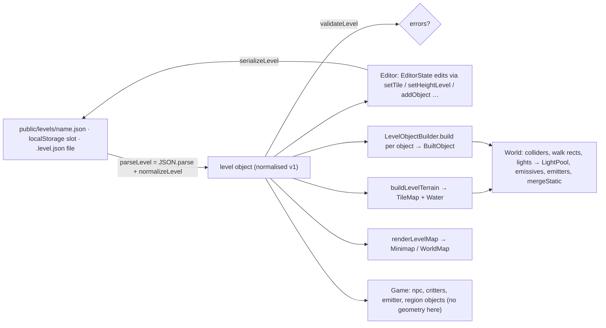

# Level module: format, object catalog, builder, storage, level map

> **Purpose.** This is the reference for the code that turns a `lumina-level` JSON file into a playable diorama and back. It covers the format helpers (parse, normalise, validate, serialise byte-stably, resize), the object catalog that drives the editor's palette and inspector, the builder that turns level objects into props, storage (browser slots, the dev-server project folder, files, URL resolution) and the painted top-down map used by the minimap and world map.
>
> **Audience:** AI agents and developers who add object types or level fields, or who load, save or generate levels from code (tools, tests, the editor, the game).
>
> **Source of truth:** [`LevelFormat.js`](../../../src/engine/level/LevelFormat.js), [`ObjectCatalog.js`](../../../src/engine/level/ObjectCatalog.js), [`ObjectBuilder.js`](../../../src/engine/level/ObjectBuilder.js), [`LevelStorage.js`](../../../src/engine/level/LevelStorage.js), [`LevelMap.js`](../../../src/engine/level/LevelMap.js). Consumers: [`src/main.js`](../../../src/main.js), [`src/demo/World.js`](../../../src/demo/World.js), [`src/demo/Game.js`](../../../src/demo/Game.js), [`src/editor/`](../../../src/editor/) and the generators in [`tools/`](../../../tools/). If this page and the code disagree, the code is right.
>
> **Related:** [Module index](README.md) · **canonical format spec: [LEVEL_FORMAT.md](../../specs/LEVEL_FORMAT.md)** · **every object type and field: [OBJECT_CATALOG.md](../../specs/OBJECT_CATALOG.md)** · [LEVEL_STORAGE_API.md](../../specs/LEVEL_STORAGE_API.md) (dev-server REST API) · [world (TileMap, Water, PropFactory)](world.md) · [lighting (LightPool)](lighting.md) · [ui (Minimap / WorldMap)](ui.md) · [Game architecture](../GAME.md) · [Editor architecture](../EDITOR.md) · [Level editor guide](../../user/LEVEL_EDITOR_GUIDE.md) · binding contract: [contracts/LEVEL_EDITOR.md](../../contracts/LEVEL_EDITOR.md) §1–§5

---

## 1. Responsibilities

| File | Owns |
| --- | --- |
| `LevelFormat.js` | The level document: the built-in tile palette (`TILE_TYPES`), height characters, defaults, `createEmptyLevel`, `normalizeLevel` (repairs with warnings), `validateLevel` (hard errors), `serializeLevel` (byte-stable pretty JSON), tile accessors, resize and shift, and stats. |
| `ObjectCatalog.js` | `OBJECT_TYPES`, the schema of every placeable object (defaults, placement style, editor glyph and colour, inspector fields), plus object helpers (create, normalise, bounds, picking), dialogue text ↔ data, critter and enemy start positions, and the combat-level test (`levelHasCombat`). |
| `ObjectBuilder.js` | `buildLevelTerrain` (TileMap + Water), `LevelObjectBuilder` (one `PropFactory` call per prop object), light priorities, bridge deck heights, waterfalls and camera bounds. |
| `LevelStorage.js` | Browser slots (`localStorage`), the project folder through the dev-server API, file download/open, and `resolveLevelFromURL` for the game. |
| `LevelMap.js` | `renderLevelMap(level)`: a painted canvas of the level for the HUD minimap and the world map. |

These modules are **not** re-exported from the engine barrel [`src/engine/index.js`](../../../src/engine/index.js); import them by path. `LevelFormat`, `ObjectCatalog` and `LevelStorage.slugify` are plain JavaScript with no three.js or DOM at import time, so Node scripts (`tools/make-*.mjs`, `tools/convert-emberfall.mjs`) use them directly. `ObjectBuilder` needs three.js and a `TextureLibrary`, which paints through a DOM canvas, so building needs a browser. `LevelMap`, and the storage, file and project functions of `LevelStorage`, need a browser too.

### Where a level goes



---

## 2. The level object in one screen

The canonical, field-by-field description is [LEVEL_FORMAT.md](../../specs/LEVEL_FORMAT.md). The binding contract is [contracts/LEVEL_EDITOR.md §1](../../contracts/LEVEL_EDITOR.md). In short:

```jsonc
{
  "format": "lumina-level", "version": 1,
  "name": "…", "subtitle": "…", "author": "…", "description": "…",
  "width": 48, "depth": 40,                     // 8 … 128 (MIN_SIZE / MAX_SIZE)
  "waterLevel": 0.4,                            // global water surface (world Y)
  "water": { "flow": [0, 0.45], "reflect": 0.2, "neutral": 0.2 },   // + optional "glint"
  "environment": { "timeOfDay": 17.2, "clock": true, "weather": "clear", "border": "forest", … },
  "spawn": { "x": 19.5, "z": 24.2, "facing": "down" },
  "legend": { "g": { "top": "grass", "side": "cliff", "lip": "grass_side", "walkable": true }, … },
  "tiles":   ["TTTTgg..", …],                   // one string per row (z), one char per tile (x)
  "heights": ["22223333", …],                   // '0'-'9','a'-'z' → level 0-35; world y = level × 0.5
  "objects": [ { "id": "house_1", "type": "house", "x": 20, "z": 14, "rotation": 0, "opts": { … } }, … ]
}
```

**Types.** [`types.d.ts`](../../../src/engine/level/types.d.ts) in this folder declares the same
document for the type check: `Level`, `LevelEnvironment` (and `LevelCamera`, `HighGround`,
`ForestSettings` …), `LevelWater`, `LevelSpawn`, `TileDef`, `Rect` / `TileRect`, and the objects —
`ObjectType` (a key of `OBJECT_TYPES`), `LevelObjectOf<T>` and `LevelObject`, a union discriminated
on `type`. The object types are **derived from the catalog**: `OBJECT_TYPES` is checked against
`ObjectTypeDef` with `@satisfies`, and each type's position fields and defaults come from its
entry, so a new type or default is typed with no other edit. `ObjectExtras` lists what the catalog
cannot say: optional fields without a default, builder options without an inspector field (the
house's `gable`, `jetty` …), legacy forms `normalizeObject` converts. Without narrowing, a field
of any type reads with its own type (generic code that dispatches on `placement` type-checks);
narrow on `type` for a type's exact shape. The functions here are typed with them (`normalizeLevel`
returns `{ level: Level, warnings }`, `createObject` / `addObject` are generic over `ObjectType`).

---

## 3. `LevelFormat.js`

### 3.1 Constants

| Export | Value |
| --- | --- |
| `LEVEL_FORMAT` / `LEVEL_VERSION` | `'lumina-level'` / `1` |
| `MAX_LEVEL` | `35` (the highest height character, `'z'`) |
| `MIN_SIZE` / `MAX_SIZE` | `8` / `128` tiles per side (`createEmptyLevel`, `normalizeLevel` and `resizeLevel` clamp to this) |
| `TILE_TYPES` | 22 built-in tiles `{ char, name, category: 'ground'\|'path'\|'water'\|'stairs'\|'special', color, def }`: `g G f F s m` (ground), `. d c k b` (path), `~ p w o` (water: river, plunge pool `flow 0.45`, fast stream `flow 2.2`, still pond `flow 0`; a numeric `flow` multiplies the level's `water.flow`), `^ v > <` (stairs N/S/E/W), `T` (forest floor, blocked), `x` (rock, blocked), `' '` (void). The full table is in [LEVEL_FORMAT.md](../../specs/LEVEL_FORMAT.md). |
| `TILE_BY_CHAR` | Frozen `char → TILE_TYPES entry`. |
| `DEFAULT_ENVIRONMENT` | Frozen `{ timeOfDay: 17.2, clock: true, weather: 'clear', border: 'forest', outerScenery: true, godRays: true, dust: true, music: true, camera: null, highGround: null }`. |
| `DEFAULT_WATER` | Frozen `{ flow: [0, 0.45], reflect: 0.2, neutral: 0.2 }`. |
| `SPAWN_ID` | `'spawn'`: the editor's selection token for the player start, reserved and never an object id. |

### 3.2 Functions

| Function | Description |
| --- | --- |
| `defaultLegend()` | A fresh `char → def` copy of every `TILE_TYPES` legend entry. |
| `charToLevel(ch)` / `levelToChar(level)` / `levelToWorld(level)` | `'0'-'9'` → 0–9 and `'a'-'z'` → 10–35 (`'A'-'Z'` is read too, anything else → 0). `levelToChar` rounds and clamps to 0–35. `levelToWorld = level × LEVEL_HEIGHT` (0.5). |
| `createEmptyLevel({ name = 'Untitled', width = 32, depth = 24, fill = 'g', level = 2, border = 2 })` | A flat level with the full default legend, a `border`-tile-wide blocked forest ring (`'T'`), `waterLevel 0.4`, default water and environment, and the spawn at the centre tile. |
| `normalizeLevel(raw)` → `{ level, warnings }` | Repairs any partial, older or hand-edited level (§3.3). It throws only for data that is not a level. |
| `parseLevel(textOrObject)` → `{ level, warnings }` | `JSON.parse` (for strings) plus `normalizeLevel`. Every storage load goes through it. |
| `validateLevel(level)` → `string[]` | Hard errors that make a level unplayable: `tiles` / `heights` row count ≠ `depth`, a row length ≠ `width`, spawn outside the map, or spawn not on walkable ground (a bridge deck counts). An empty array means playable. Use it after `normalizeLevel`. |
| `serializeLevel(level)` → string | Pretty JSON (§3.4). |
| `cloneLevel(level)` | Deep copy through JSON. |
| `inBounds(level, i, j)`, `getTile(level, i, j)`, `getHeightLevel(level, i, j)`, `tileDef(level, i, j)` | Accessors. `inBounds` returns a boolean; the others return `null` outside the map (`tileDef` also for a character missing from the legend). |
| `setTile(level, i, j, ch)` / `setHeightLevel(level, i, j, lvl)` → changed? | Replace one row string. The height is clamped to 0–35. |
| `toTileMapInput(level)` | `{ name, legend, tiles, heights, waterLevel }`, the [TileMap](world.md#21-input-the-map-object) input. |
| `onBridgeDeck(level, x, z)` | True when (x, z) lies within half a bridge's `opts.width` (default 2) of a bridge object's segment. Geometry only: it ignores the deck height. |
| `isWalkablePoint(level, x, z)` | A bridge deck, or a legend tile that is not void, not water and not `walkable: false`. It approximates the game's rule from the level data alone: it ignores colliders, and `TileMap` treats a custom legend entry with `water: true, walkable: true` as walkable (`walkable ?? !water`), which this function does not. `validateLevel` uses it for the spawn check. |
| `generateObjectId(level, type)` | A fresh `${type}_${n}`. |
| `addObject(level, type, x, z, overrides)` → obj | `createObject` + a fresh id + push. |
| `resizeLevel(level, width, depth, { anchor = 'c', fill = 'g', fillLevel = null })` → new level | Anchors are `nw n ne w c e sw s se`. New tiles take `fill` at `fillLevel` (default: the level of tile (0, 0)). Content and every absolute position move with the anchor offset. Objects outside the new map are kept. |
| `shiftLevelContent(level, dx, dz)` | In place: moves the spawn, every object (points, line ends, rect corners, and the legacy absolute `bounds` / `spots` / `talkPoint`), `environment.camera.bounds` (one rect or `{ near, mid, far }`), `godRayAreas`, `foliage.flowerAreas` / `shrubAreas`, `forest.areas` and `titleCamera` x/z. Values are rounded to 1e-6, so growing and shrinking back is an exact identity. |
| `levelStats(level)` | `{ width, depth, objects, counts: { [type]: n }, water, walkable }` (tile counts). |

### 3.3 What `normalizeLevel` repairs

- **Throws** for a non-object or an array (`'Level data is not an object'`), an unknown `format` (`'Unknown level format "…"'`), or JSON with neither `format` nor a `tiles` / `heights` array (`'Not a Lumina level (no "format": "lumina-level" and no tiles)'`), so a `package.json` never opens as a blank map.
- A `version` newer than 1 gives a warning and loads anyway.
- The size is `raw.width` / `raw.depth`, or the data's size, clamped to 8–128. Short rows are padded with their last character (or `'g'` / `'0'` for missing or empty rows), long rows are cut, and a row-count mismatch gives a warning. **Unknown tile characters become `'g'`**, with a warning for each occurrence (padding included). Height characters are re-encoded, so `'A'` becomes `'a'` and invalid characters become `'0'`. A level without tiles is filled with grass, with a warning.
- `legend` = the default legend overlaid with the file's entries, so custom characters are kept (and a file's own definition of a built-in character wins). A key that is not exactly one character is kept but warns (`Legend key "k" is not a single character; no tile can use it.`): a tile is one character of its row, so no tile can use it, and the editor's palette and `editTiles` leave it out. `environment` and `water` are filled from the defaults (shallow merge). A `water.flow` that is not a 2-array is reset. `waterLevel` defaults to 0.35 (note: `createEmptyLevel` writes 0.4).
- `spawn` keeps extra keys. `x` / `z` default to the map centre (`width / 2`, `depth / 2`) and `facing` must be `down`, `up`, `left` or `right` (else `'down'`).
- **Objects:** unknown types are skipped with a warning (`isOwnKey(OBJECT_TYPES, o.type)`: a misspelt name, an `Object.prototype` name such as `"constructor"` or `"__proto__"`, and any non-string `type` alike; the warning shows a non-string as JSON, via `showValue`). Each object goes through `normalizeObject` (§4.2). Missing, duplicate or reserved (`'spawn'`) ids are renamed `${type}_${n}`, with a warning for duplicates and the reserved id. Renames never take an id that appears further down the file.
- **Unknown top-level fields are kept** and written back after `objects`.
- **Values `String()` / `Number()` cannot convert** (a JSON object with its own `toString` key, `{"toString": 1}`) never abort the load: text fields, rows, ids and numbers go through `toText` / `toNumber` ([`utils/own.js`](../../../src/engine/utils/own.js)) and take their defaults (an id becomes empty and is renamed). Every value that converted before converts the same, so the shipped levels load byte-identically. Fields the load keeps as they are can still throw later (KNOWN_ISSUES LVL-18).

### 3.4 Byte-stable serialisation

`serializeLevel` writes one line per legend character, per tile row, per height row and per object, so files diff well. It writes keys in a fixed order (`format, version, name, subtitle, author, description, width, depth, waterLevel, water, environment, spawn`, then `legend`, `tiles`, `heights`, `objects`, then unknown fields) and ends with a newline. Together with `normalizeObject` keeping each object's key order, and `createObject` writing `id, type, position, defaults`, **`parseLevel` → `serializeLevel` reproduces a file written by `serializeLevel` exactly** (a hand-edited or older file is normalised on the first save, then stays stable). Opening a level in the editor and saving it unchanged leaves `git diff` empty. Breaking this invariant is a bug.

---

## 4. `ObjectCatalog.js`

### 4.1 `OBJECT_TYPES`

`OBJECT_TYPES[type]` is `{ label, category, placement: 'point'|'line'|'rect', kind: 'prop'|'actor'|'marker', glyph, color, radius, rotatable?, snap?, help?, defaults, fields, combat? }` (`ObjectTypeDef`; the table is `@satisfies {Record<string, ObjectTypeDef>}`, so `OBJECT_TYPES[o.type]` with a typed key is the union of the entries — declare `/** @type {ObjectTypeDef} */` when reading an optional member such as `rotatable`). `combat: true` marks the combat-only types: Cinderwatch Pass's generator covers them and Starfall Vale's `coverage()` skips them.

| Category (`OBJECT_CATEGORIES` order) | Types | Kind |
| --- | --- | --- |
| Buildings | `house`, `windmill`, `well`, `marketStall` | prop |
| Nature | `tree`, `rock`, `haystack` | prop |
| Lights | `lamppost`, `wallTorch`, `campfire`, `light` | prop |
| Props | `bench`, `barrel`, `crate`, `crateStack`, `flowerbox`, `signpost` | prop |
| Structures | `fence`, `bridge` (placement `line`) | prop |
| Water | `waterfall` | prop |
| Characters | `npc`, `critters` | actor |
| Markers | `emitter` (particle area), `region` (placement `rect`) | marker |
| Combat | `enemy` (a group of hostile creatures), `chest`, `waystone` — all three flagged `combat: true` ([COMBAT.md §14](../../contracts/COMBAT.md#14-level-data)) | actor / prop / prop |

Object shapes: a point object is `{ id, type, x, z, rotation?, opts?, …fields }`, a line object `{ id, type, x0, z0, x1, z1, opts?, … }` and a rect object `{ id, type, minX, maxX, minZ, maxZ, … }`. **`opts` is passed straight to the matching `PropFactory` method** ([world.md §4.2](world.md#42-factory-methods)). Other keys are read by the builder or the game. Every default, field, optional field and game behaviour is listed in [OBJECT_CATALOG.md](../../specs/OBJECT_CATALOG.md).

`fields` is the inspector schema: `{ key (dotted path such as 'opts.width' or 'size.0'), label, type, min?, max?, step?, options?, help?, nullable? }`, where `type` is one of `number | int | angle` (radians stored, degrees shown) `| bool | select | text | textarea | lines | dialogue | color`.

Other exported constants: `WALL_TEXTURES`, `ROOF_TEXTURES`, `TREE_KINDS`, `CLOTH_TEXTURES`, `FACINGS`, `CARDINALS`, `CHARACTER_PRESET_NAMES`, `CRITTER_KINDS` (`chicken, cat, bird, dog`), `EMITTER_PRESETS` (`fireflies, leaves, petals, dust, embers, smoke, mist, sparkle, snow, rain`), `NPC_ACTIONS` (`none, rest, shop, music`), `NPC_BEHAVIOURS` (`wander, post, perform, chase`), `NPC_SCRIPTS` (`'', elder, innkeeper, merchant, guard, farmer, child, bard, scholar, drillmaster, shopkeeper`, the hand-written conversations in [`src/demo/dialogue.js`](../../../src/demo/dialogue.js); `drillmaster` is the combat tutor, `shopkeeper` the combat shop's menu), `ENEMY_KINDS` (`slime, goblin, archer, shaman, bat, boar, dummy, golem`), `ENEMY_INFO` (frozen `{ label, flier, boss, passive, humanoid }` per kind, node-safe), `CHEST_UPGRADES` (`none, maxHp, maxMp, attack`), `OBJECT_CATEGORIES` (… `Markers`, `Combat`) and `SPAWN_MARKER` (`{ label: 'Player start', glyph: '★', color: '#7fe3ff', radius: 0.35 }`; the spawn lives in `level.spawn`, not in `objects`).

### 4.2 Helpers

| Function | Description |
| --- | --- |
| `createObject(type, x, z, overrides = {})` | A new object with `id: ''` and keys in canonical order: `id, type`, the position, then the defaults, deep-merged with `overrides`. A line defaults to 2 units east; a rect is 4×4 around (x, z). It throws `Unknown object type "t"` for any type that is not one of `OBJECT_TYPES`' own keys (`Object.prototype` names included). |
| `normalizeObject(o)` | Throws `Unknown object type "t"` like `createObject` (a guard: `normalizeLevel` and the editor's paste drop such objects first). Fills missing defaults (the object's own keys keep their order and missing ones are appended; nested plain objects such as `opts` are filled the same way), coerces position numbers (a line's missing end defaults to 2 units east, a rect's to 4 × 4), swaps inverted rect bounds, makes `rotation` numeric (when the type has a `rotation` default or the object has one) and `id` a string. For `npc` and `critters` it converts the legacy **absolute** `talkPoint` / `bounds` / `spots` to the **relative** `talkOffset` / `area` / `spotOffsets`, so they move with the object. |
| `getField(obj, key)` / `setField(obj, key, value)` | Dotted-path read and write (`setField` creates objects, or arrays for numeric parts). |
| `objectCenter(obj)` | Point, line midpoint or rect centre. |
| `objectBounds(obj)` | Approximate rotated XZ bounds for picking, selection and 2D drawing. Houses and stalls use width × depth; bridges are padded by half their width. |
| `hitTestObject(obj, x, z, tolerance = 0.25)` | Picking: segment distance for lines, bounds otherwise. |
| `parseDialogueText(text)` / `dialogueToText(dialogue)` | Editor text ↔ the `dialogue` array (syntax below the table). |
| `mergeDialogueText(dialogue, text)`, `mergeLinesText(lines, text)`, `mergePagesText(pages, text, pageText, parse)` | Apply a text edit so pages the edit did not touch are kept exactly (extra keys, padding), which keeps saves byte-stable. |
| `linesToText(arr)` / `textToLines(text)` | `lines` / `text` fields (one paragraph per page) ↔ text. |
| `critterYard(g)` | A critter group's explicit yard in world coordinates (relative `area`, or legacy `bounds`), or `null`. |
| `critterStartPoints(g, isWalkable = null)` | The start position of each animal, **exactly as the game picks them** ([`src/demo/Critters.js`](../../../src/demo/Critters.js)): `count` (0–16; the number of spots when `count` is blank) animals, the first ones on the exact spots (`spotOffsets`, or legacy `spots`), the rest scattered over the yard (or the `radius` square) with a seeded `RNG` (`seed`, default a hash of the id), with up to 6 tries onto ground `isWalkable` accepts. A group of one without spots starts at the object's point. The editor draws them. |
| `enemyStartPoints(g, isWalkable = null)` | The same algorithm for an `enemy` group (copied, not shared): `count` 0–8 (a `golem` group 0–1), the relative `spotOffsets` first, then a seeded scatter over the relative `area` (else the `radius` square) with `RNG(seed ?? hashString('enemy:' + id))`. Used by the game, the editor's previews and the generators (fliers: the caller's test also accepts water). |
| `isCombatType(type)` / `levelHasCombat(level)` | `OBJECT_TYPES[type]?.combat`; combat is on when `environment.combat === true`, or the key is not `false` and the level has an `enemy` object ([COMBAT.md §3](../../contracts/COMBAT.md#3-enabling-combat-per-level)). |

**Dialogue text syntax** (the inspector's text form of `dialogue`):

- Pages are separated by blank lines.
- A page that ends in a bracket group containing a vertical bar is a choice page. For example `Tea? [Yes | No]`, or `Okay? [Okay |]` for a single choice (the game shows it as a one-item choice list). `dialogueToText` leaves blank choices out.
- `\[`, `\]`, `\|` and `\\` are literal characters, so any page survives text → parse → text unchanged.
- `{word}` renders the word in gold in the game's dialog box.

```js
parseDialogueText('Hello!\n\nTea? [Yes | No]\n\nOk? [Okay |]');
// → ['Hello!', { text: 'Tea?', choices: ['Yes', 'No'] }, { text: 'Ok?', choices: ['Okay'] }]
```

---

## 5. `ObjectBuilder.js`

### 5.1 `buildLevelTerrain`

```js
buildLevelTerrain(level, { textures, chunkSize = 32, tileMapOptions = {}, deferShore = false })
  // → { tileMap, water /* Water | null */, object /* Group 'terrain:<name>' */, dispose() }
```

This builds a `TileMap` from `toTileMapInput(level)` (with `chunkSize` and any `tileMapOptions`). When any tile's legend entry has `water`, it also builds a `Water` with `flow` from `level.water.flow ?? [0, 0.45]`, `reflect ?? 0.2`, `neutral ?? 0.2`, `glint: waterGlint(level)` and `deferShore`. With `deferShore` the caller adds the colliders that stand in water, then calls `water.refresh()` or `refreshAsync()` before the first render. The game does this; see [world.md §6](world.md#6-how-the-game-wires-a-levels-world).

`waterGlint(level)` returns `level.water.glint` as a non-negative number, or 1 when it is missing or invalid.

### 5.2 `LevelObjectBuilder`

```js
const builder = new LevelObjectBuilder({ textures, seed = 42, factory = null });
const built = builder.build(obj, tileMap);   // BuiltObject | null
LevelObjectBuilder.isBuildable(type);        // OBJECT_TYPES[type]?.kind === 'prop'
builder.factory;                             // the PropFactory (own one unless passed in)
builder.dispose();                           // disposes the factory only if it created it
```

`build()` returns `null` for actors and markers (`npc`, `critters`, `enemy`, `emitter`, `region`): the game and the editor handle those. The `default` branch returns that `null` through a cast to `NullForNonProp<typeof obj.type>` ([`types.d.ts`](../../../src/engine/level/types.d.ts)), which only non-prop types satisfy: a catalog prop type without a `case` fails `npm run typecheck` (it would build nothing at run time — KNOWN_ISSUES PROP-10). `enemy` has an explicit `case` that builds nothing: its creatures are spawned by the combat system (and previewed by the editor's `ActorPreview`). For props it samples ground heights from `tileMap.getHeight` and calls the factory with `opts = { ...obj.opts, id: obj.id }`, adding `rotation: obj.rotation` for rotatable types.

| Type | Special handling |
| --- | --- |
| `house`, `windmill`, `well`, `marketStall`, `lamppost`, `campfire`, `bench`, `barrel`, `crate`, `crateStack`, `flowerbox`, `signpost`, `rock`, `haystack`, `chest`, `waystone` | `factory[type](x, groundY, z, opts)`. A chest's / waystone's `propResult.controls` are the prop's handles (`open()` / `setAttuned(on)`), which `World` hands to the game with the interactable. For a house an empty `upperWall` is dropped (so the upper walls take `wall`), and all its light descriptors are removed **unless `obj.light` is true** (the catalog default is `false`). `rock` and `haystack` are not rotatable: their yaw comes from the seeded RNG. |
| `tree` | Not rotatable (its yaw comes from the seeded RNG). `collider: false` removes the trunk collider. |
| `wallTorch` | Ground is sampled 0.6 units in front of the wall (local +Z); `y = ground + (obj.dy ?? 2.1)`. |
| `light` | No geometry: an empty `Group` at `ground + (dy ?? 1.5)` with one descriptor from the object's `color ('#ffb46b')`, `intensity (8)`, `distance (8)`, `flicker (0.2)` and `nightOnly (true)`. |
| `fence` | Ground height at the midpoint. The anchor is the midpoint. |
| `bridge` | `deckY = obj.deckY ?? bridgeDeckHeight(tileMap, obj)`. |
| `waterfall` | `buildWaterfall(tileMap, obj)`: `top` and `bottom` are sampled half a tile upstream and downstream (water surface, else ground), `bottom` is capped at `top − 0.05`, and `mist` emitters are returned. |

**`BuiltObject`**: `{ object, colliders, walkRects, lights, emissives, emitters, update, interact, anchor, source, propResult, dispose }`
(`interact` is the prop's `{ position, radius, id, lookSpan? }`, passed through — `lookSpan` only for houses).

- Every light descriptor gets `tag: '<type>:<id>'` and `priority: LIGHT_PRIORITY[type] ?? 3`.
- `object.userData.levelObjectId` is the object id (the editor picks by it).
- `propResult` is the raw `PropResult` for `PropFactory.mergeStatic`. It is `null` for `light` and `waterfall`.
- `anchor` is a representative world point at ground level (the waterfall's anchor is its foot).

**`LIGHT_PRIORITY`** = `{ campfire: 0, wallTorch: 1, light: 1, lamppost: 2, house: 3 }` (lower is kept first). The game sorts descriptors by priority, then by level order, and hands them to [`LightPool`](lighting.md#4-lightpool-sharing-12-lights): with 12 or fewer each gets a permanent light, and with more the 12 lights are shared around the camera.

### 5.3 Other helpers

| Function | Description |
| --- | --- |
| `bridgeDeckHeight(tileMap, obj)` | The ground height half a unit outside the **start** point (x0, z0), on the side away from the span. When that spot is not dry ground (water, void or off the map), the same test half a unit outside the end point is used instead; the JSDoc's "the higher of both banks" is not what the code does. The result is raised to at least the highest water surface under the span (ends, quarter points, middle) + 0.1. With no bank at either end it is that water surface + 0.3, or the ground at the start. |
| `buildWaterfall(tileMap, obj)` | See the table above. It returns the `createWaterfall` result with `top` and `bottom` added. |
| `computeCameraBounds(level, margin = 3)` | The bounding rect of the walkable tiles (legend entry not void, not water, not `walkable: false`) shrunk by `margin` on each side (never inverted: it collapses to the centre), for `CameraRig.bounds`. Without walkable tiles it returns the whole map. |
| `waterGlint(level)` | See §5.1. |

**The bridge step rule.** The first walk rect of an arched deck sits `arch · sin(π / 2n)` above the deck height (n = `max(2, round(L / 0.5))` segments; see [world.md › bridge](world.md#42-factory-methods)). From a bank one level (0.5) below the deck the step is `0.5 + arch · sin(π / 2n)`, which is more than `maxStep` 0.55 on short or strongly arched bridges, so the player cannot get on or off there. The editor's Level › Check for problems lists every bridge end whose first plank is more than 0.55 above or below the bank beyond it (`bridgeStepIssues` in [`EditorApp.js`](../../../src/editor/EditorApp.js)).

---

## 6. `LevelStorage.js`

Every load goes through `parseLevel`, so all sources are normalised and repaired the same way.

| Function | Description |
| --- | --- |
| `slugify(name)` | Display name → safe slot/file name: `'My Village!'` → `'my-village'`, at most 60 characters. A name with no Latin letters or digits gets a stable `level-<hash6>` (for example `'村の広場'` → `'level-fue3hd'`). A blank name is `'untitled'`. Windows device names get a suffix (`'con'` → `'con-level'`). |
| `RESERVED_FILE_NAMES` | `/^(con\|prn\|aux\|nul\|com[0-9]\|lpt[0-9])$/` |
| `PLAYTEST_SLOT` | `'__playtest__'`: the editor's play-test slot (never slugified, hidden from `listLocalLevels`). |
| `listLocalLevels()` | `[{ slot, name, savedAt, width, depth }]`, newest first, from the index key `lumina.levels`. |
| `saveLocalLevel(slot, level)` → slot | Slugifies the slot (except `PLAYTEST_SLOT`), writes `serializeLevel(level)` to `lumina.level.<slot>` and updates the index. It **throws** when storage is full or unavailable. |
| `loadLocalLevel(slot)` → `{ level, warnings }` or `null` | Reads the slot as given (no slugify), so `__autosave__` and `__recovered_*__` editor slots load too. |
| `deleteLocalLevel(slot)` | Removes the slot and its index entry. |
| `hasProjectApi()` → Promise&lt;boolean&gt; | True when `GET /api/levels` answers JSON, which only happens under `npm run dev`. |
| `listProjectLevels()` | `[{ name, file, title, size, modified }]` from `public/levels/` (dev server). |
| `saveProjectLevel(name, level)` → file | `PUT /api/levels/<slug>` with the serialised JSON. It throws with the server's `{ error }` message. |
| `deleteProjectLevel(name)` | `DELETE /api/levels/<slug>`. |
| `loadProjectLevel(name)` → `{ level, warnings }` | Fetches `${BASE_URL}levels/<slug>.json` (works in dev **and** production builds, because `public/` is copied to `dist/`). It rejects HTML answers, since dev servers answer unknown paths with `index.html`. |
| `downloadLevel(level, filename = '<slug>.level.json')` | Browser download. |
| `readLevelFile(file)` / `openLevelFileDialog()` | From a `File`, or through a file picker (`accept=".json,application/json"`; the result gets `fileName`). The picker promise resolves `null` only when a `change` event arrives without a file; there is no `cancel` listener, so dismissing the picker can leave the promise pending. |
| `resolveLevelFromURL(search = location.search)` → `{ level, warnings, source }` or `null` | `?level=local:<slot>` loads browser storage (it throws if the slot is empty). `?level=<name>` loads `public/levels/<name>.json`. With no `level` parameter it returns `null`, and [`src/main.js`](../../../src/main.js) then loads `emberfall`. |

The server side (`GET/PUT/DELETE /api/levels[/name]`, name rule `^[a-z0-9][a-z0-9-]{0,59}$`, 4 MB limit, atomic write through `<name>.json.tmp`) is [`tools/vite-level-api.js`](../../../tools/vite-level-api.js), registered in [`vite.config.js`](../../../vite.config.js). It is documented in [LEVEL_STORAGE_API.md](../../specs/LEVEL_STORAGE_API.md).

`src/main.js` also exposes `window.__lumina.playLocal(level, slot = 'test', query = 'autostart=1')` for tests. It normalises any partial level, saves it to a browser slot and reloads the page onto it. See [AUTOMATION_API.md](../../specs/AUTOMATION_API.md).

---

## 7. `LevelMap.js`

```js
const map = renderLevelMap(level, { pixelsPerTile });   // → { canvas, pixelsPerTile, width, depth }
// world (x, z) ↦ canvas (x · pixelsPerTile, z · pixelsPerTile)
```

It paints the level once into a `<canvas>` from level data only (no WebGL). The default `pixelsPerTile` is `round(min(12, max(4, 768 / max(width, depth))))`, and an explicit value is rounded and kept at 2 or more: 12 for Emberfall (48 × 40) and 6 for Starfall Vale (128 × 128).

- **Tiles:** `TILE_TYPES` colours. A custom character, or a built-in one whose legend entry differs from the default, takes the colour of the built-in tile with the same `top` texture (water is `#3b7fa6`, anything else `#6f8a55`). Void tiles are transparent.
- **Relief:** brighter with height and lit from the north-west, with dark cliff bands on south drops and shaded east/west drops.
- **Water:** ripple dither and light shore pixels.
- **Forest:** `T` tiles as tree crowns.
- **Wash:** a warm parchment wash with grain.
- **Objects:** fences and bridges first, then trees, rocks and haystacks, then houses and windmills in their roof colours, market stalls, wells, campfires, treasure chests (gold squares, turned with the chest, at least 3 px) and waystones (cyan diamonds with a pale core).

The game passes the result to `ui.minimap.setMap(map, { view: 34 })` and `ui.worldMap.setMap(map, { title, subtitle, regions })` ([ui.md §7](ui.md#7-minimap-and-worldmap)).

---

## 8. Extension points

| You want to… | Touch |
| --- | --- |
| **A new object type** | 1. `OBJECT_TYPES` entry (category, placement, kind, defaults, inspector `fields`); optional fields without a default go into `ObjectExtras` in `types.d.ts`. 2. For a prop: a `PropFactory` method ([world.md §7](world.md#7-extension-points)) and a `case` in `LevelObjectBuilder.build` (`npm run typecheck` fails without either). For an actor or marker: the game (`src/demo/Game.js` / `World.js`) and the editor previews. 3. If it has absolute positions, teach `shiftLevelContent` to move them. 4. Optionally draw it in `LevelMap`. 5. Document it in [OBJECT_CATALOG.md](../../specs/OBJECT_CATALOG.md). |
| **A new optional field** | Declare it optional in `types.d.ts` (`LevelEnvironment`, `LevelWater` or `ObjectExtras`). Read it with a default where it is consumed. `normalizeLevel` / `normalizeObject` keep unknown keys, so older files stay valid and saves stay byte-stable. **Never write a default into a file that did not have it** (the editor's Level settings follows this rule). Changes must be additive (contract rule). |
| **A new top-level field** | It survives as an "unknown" key (written after `objects`). Add it to the module-private `KNOWN_KEYS` set and to the `serializeLevel` key list only if it must sit in the header, and remember that changes the byte layout of existing files. |
| **A new built-in tile** | Append to `TILE_TYPES` (a new character, a legend def using existing textures). New levels get it through `defaultLegend()`, and existing levels gain it at load through the legend merge. Because the merged legend is written back, the next save of every existing level gains one legend line: regenerate or re-save the shipped levels in the same change. |
| **A new storage backend** | Build it on `serializeLevel` / `parseLevel` so the normalisation and the byte layout are shared. |

---

## 9. Examples

Build and round-trip a level in Node (this sequence was run against the current code; the round trip prints `true`):

```js
import { createEmptyLevel, addObject, serializeLevel, parseLevel, validateLevel, setTile, setHeightLevel }
  from '../src/engine/level/LevelFormat.js';

const level = createEmptyLevel({ name: 'Test', width: 16, depth: 12 });   // 2-tile forest border
setTile(level, 8, 8, '~'); setHeightLevel(level, 8, 8, 1);                 // a one-tile pond
const house = addObject(level, 'house', 8, 5, { opts: { roof: 'roof_blue' } });   // id 'house_1'
addObject(level, 'npc', 5.5, 7.5, { name: 'Mira', dialogue: ['Hi!', { text: 'Tea?', choices: ['Yes', 'No'] }] });

const text = serializeLevel(level);
const { level: again, warnings } = parseLevel(text);
console.log(serializeLevel(again) === text, warnings, validateLevel(again));   // true [] []
```

Build a level's 3D content without the game (the pattern of [`sandbox/level_builder.html`](../../../sandbox/level_builder.html); this needs a browser, and was run there against the current code with a house and a lamppost: the house returned no light descriptor because `light` is `false`, the lamppost one with `priority` 2 and `tag` `'lamppost:lamppost_1'`):

```js
import { TextureLibrary } from '../src/engine/pixel/Textures.js';
import { buildLevelTerrain, LevelObjectBuilder } from '../src/engine/level/ObjectBuilder.js';

const textures = new TextureLibrary({ seed: 1337 });
const terrain = buildLevelTerrain(level, { textures });
scene.add(terrain.object);
const builder = new LevelObjectBuilder({ textures });
for (const obj of level.objects) {
  const b = builder.build(obj, terrain.tileMap);
  if (!b) continue;                                    // npc / critters / emitter / region
  scene.add(b.object);
  b.colliders.forEach((c) => terrain.tileMap.addCollider(c));
  b.walkRects.forEach((r) => terrain.tileMap.addWalkSurface(r));
}
terrain.water?.refresh();                              // colliders in the water shape the shore
```

Open a generated level in the real game from a test page:

```js
import { saveLocalLevel } from '../src/engine/level/LevelStorage.js';
const slot = saveLocalLevel('my-test', level);          // → 'my-test'
location.href = `/index.html?level=local:${slot}&autostart=1`;
```

---

## 10. Gotchas

1. **Don't hand-edit generated levels.** `starfall-vale.json` comes from [`tools/make-starfall-vale.mjs`](../../../tools/make-starfall-vale.mjs) and `sample-hamlet.json` from [`tools/make-sample-hamlet.mjs`](../../../tools/make-sample-hamlet.mjs). Edit the generator and re-run it. **Never touch `public/levels/untitled.json`** (the user's own file).
2. **Byte stability is a feature.** Don't reorder keys, pretty-print differently or add defaults on save. A no-op load and save must leave `git diff` empty.
3. **`normalizeLevel` repairs silently apart from warnings.** Unknown tile characters become grass and unknown object types are dropped. "Unknown" means not an **own** key of the table: look names from level data up with `isOwnKey` / `ownValue` ([`src/engine/utils/own.js`](../../../src/engine/utils/own.js)), never `TABLE[name]`, which finds `Object.prototype` members such as `"constructor"` (KNOWN_ISSUES LVL-17). Show `warnings` to users (the editor does) and treat them as failures in generators (the Starfall generator requires zero warnings).
4. **`validateLevel` is minimal.** It checks shape and spawn only. Reachability, bridge steps and the like are checked by the editor's Level › Check for problems and by the generators' own validation.
5. **Heights are levels, not world units.** World y = level × 0.5. A stairs tile joins L to L + 1. A one-level ledge is walkable, and blocking cliffs need two or more levels ([world.md §2.4](world.md#24-movement-and-colliders)).
6. **`saveLocalLevel` slugifies the slot** (except `__playtest__`). Use the returned slot.
7. **`loadProjectLevel` slugifies the name too.** `?level=My Village` loads `my-village.json`.
8. **House lanterns are opt-in per object** (`obj.light`): without it the builder drops the house's light descriptor. The window glow (emissive) is always there.
9. **`LevelObjectBuilder.dispose()` keeps a shared factory.** It only disposes the factory it created.
10. **The editor preview uses the game's point-light pool** — the engine [`LightPool`](lighting.md#4-lightpool-sharing-12-lights) with `fixed: true` (always 12 lights) and the same `sanitizeLightDescriptors` list — so it lights the same lamps as the game for the same view — including the weather's overcast `nightDayIntensity`, which the preview applies through the game's `WeatherLook.js` since 2026-09-27.

---

## 11. Sandbox pages and checks

| Page / tool | Use |
| --- | --- |
| [`sandbox/level_builder.html`](../../../sandbox/level_builder.html) | Places every catalog type except `waterfall` and `region` on a 24×18 test level (with a river and a raised block) and builds it. `window.__smoke = { built, objects, tTerrain, tAll, lights, rebuildMs }`. |
| [`sandbox/game_levels.html`](../../../sandbox/game_levels.html) | Level cases saved to browser storage and opened in the real game, like the play-test. `?case=tiny\|bare\|wetspawn\|stormnight\|everything\|hamlet\|moved\|hostile`. `window.__levelCases`. `hostile` puts `Object.prototype` names and `{"toString": 1}` values into every field that is looked up or converted; [`game_levels.hostile.json`](../../../sandbox/game_levels.hostile.json) checks it in the game and the editor (exact warning lists). |
| `node tools/make-starfall-vale.mjs [--out=…] [--ascii] [--quiet] [--force]` | Regenerates the 128×128 showcase deterministically. It refuses to write when any warning, validation error or check fails; `--force` writes anyway for inspection but still exits with code 1 (see [LEVEL_DESIGN_GUIDE.md](../../design/LEVEL_DESIGN_GUIDE.md), [starfall-vale.md](../../design/levels/starfall-vale.md)). |
| `node tools/make-sample-hamlet.mjs [--out=…] [--check]` | Regenerates the small sample hamlet (deterministic, byte for byte). `--out` writes elsewhere; `--check` writes nothing and exits 1 unless `public/levels/sample-hamlet.json` (or the `--out` file) matches. |
| `node tools/make-cinderwatch-pass.mjs [--out=…] [--check] [--ascii] [--quiet] [--force]` | Regenerates the 96 × 120 combat demo level ([cinderwatch-pass.md](../../design/levels/cinderwatch-pass.md)) with the 18 validation rules of COMBAT.md §15.5, rule 19 (zone separation) and its combat `coverage()`. Built on the shared generator helpers of [`tools/lib/levelgen.mjs`](../../../tools/lib/levelgen.mjs) (grid stamps, placer with approximate colliders, walk BFS and route Dijkstra, the crown / roof / terrain view-ray model at any yaw and pitch, scatter, `canonicalObject`). |

```bash
npm run check -- --page=sandbox/level_builder.html --out=level_builder --wait=3000 --fps=0
npm run check -- --page=sandbox/game_levels.html --query=case=everything --out=case_everything
npm run check -- --page=sandbox/game_levels.html --query=case=hostile --out=case_hostile --fps=0 --script=sandbox/game_levels.hostile.json
npm run check -- --page=index.html --query="level=brightwater-crossing&autostart=1" --out=bw
```

---

## 12. History and decisions

- **Phase 3 (level editor).** The orchestrator wrote `LevelFormat`, `ObjectCatalog`, `ObjectBuilder`, `LevelStorage`, the dev-server API and the contract ([contracts/LEVEL_EDITOR.md](../../contracts/LEVEL_EDITOR.md)). The former hand-written Emberfall map was converted once to `public/levels/emberfall.json` by `tools/convert-emberfall.mjs`, and the game now builds **only** from level data. The later review and fix rounds (editor reviewers drove the UI with real mouse input) added the byte-stability guarantees (object key order, merge-preserving dialogue edits, unknown fields kept), the `'spawn'` id reservation, `level-<hash>` slugs for non-Latin names and the Windows device-name protection.
- **Relative offsets.** NPC talk points, chase areas and critter yards/spots became relative to their object (`talkOffset`, `area`, `spotOffsets`), so they move with it in the editor. The legacy absolute forms are still read and are converted at load.
- **Phase 4 (Starfall Vale).** Added `LevelMap`, `waterGlint`, sharing of the `LIGHT_PRIORITY`-ranked light descriptors through `LightPool`, the bridge step check and the environment fields `forest`, `fogScale` and `minimap` (read by the game; see [LEVEL_FORMAT.md](../../specs/LEVEL_FORMAT.md)).
- **Combat (2026-09-28).** The catalog gained the `Combat` category with `enemy`, `chest` and `waystone` (`combat: true`), `ENEMY_KINDS`, `ENEMY_INFO`, `CHEST_UPGRADES`, the `drillmaster` script, `enemyStartPoints`, `isCombatType`, `levelHasCombat` and the optional `environment.combat`; `LevelObjectBuilder` builds chests and waystones (and documents `enemy` as geometry-free); `LevelMap` marks chests and waystones; the combat demo level Cinderwatch Pass is generated by `tools/make-cinderwatch-pass.mjs` ([COMBAT.md](../../contracts/COMBAT.md) §14–§15).

See [PROJECT_HISTORY.md](../../history/PROJECT_HISTORY.md) and [DECISIONS.md](../../history/DECISIONS.md).
