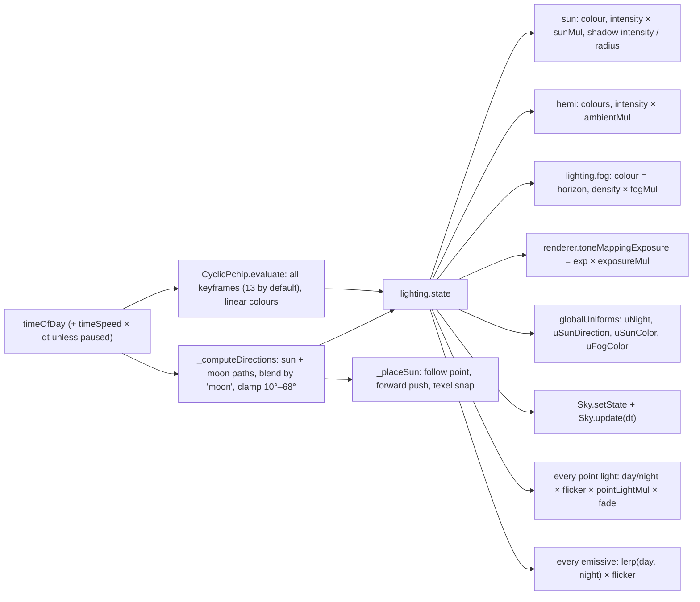
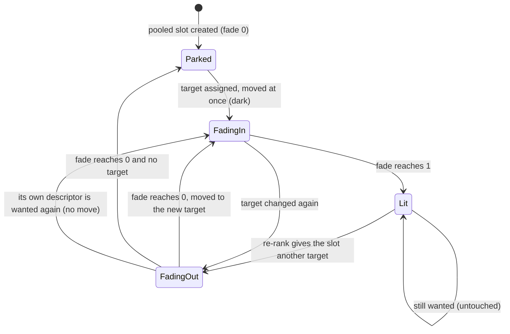
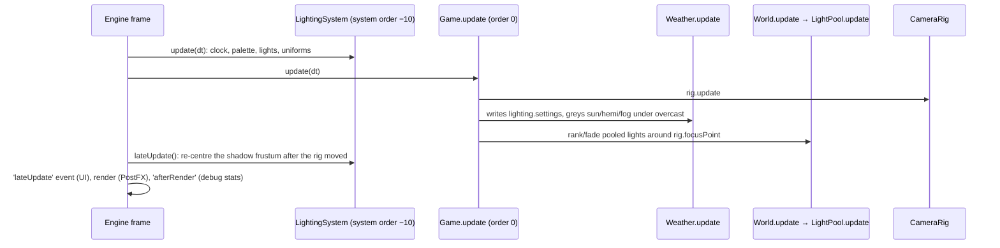

# Lighting module: LightingSystem, LightPool, Sky

> **Purpose.** This is the reference for Lumina's day/night lighting. It covers the keyframed 24-hour palette, the sun and moon paths, the directional shadow, fog and exposure, flickering point lights, night-glowing emissive materials, the fixed-size point-light pool used by big levels, and the sky dome. It explains what each class does, how it does it, and the rules you must follow when you change or use it.
>
> **Audience:** Engine developers and AI agents who work on lighting, shadows or the sky. Also game and editor integrators who wire level lights into a scene.
>
> **Source of truth:** [`LightingSystem.js`](../../../src/engine/lighting/LightingSystem.js) (`LightingSystem`, `DEFAULT_KEYFRAMES`), [`LightPool.js`](../../../src/engine/lighting/LightPool.js) (`LightPool`), [`Sky.js`](../../../src/engine/lighting/Sky.js) (`Sky`). Game wiring: [`src/demo/Game.js`](../../../src/demo/Game.js), [`src/demo/World.js`](../../../src/demo/World.js) and [`src/demo/config.js`](../../../src/demo/config.js). If this page and the code disagree, the code is right.
>
> **Related:** [Module index](README.md) · [render (PostFX, tone mapping)](render.md) · [fx (GodRays, Particles)](fx.md) · [sprite (Sprite3D lighting)](sprite.md) · [world (props that emit lights)](world.md) · [level (`LIGHT_PRIORITY`, `ObjectBuilder`)](level.md) · [Render pipeline](../RENDER_PIPELINE.md) · [Performance](../PERFORMANCE.md) · [Visual design](../../design/VISUAL_DESIGN.md) · binding contract: [ARCHITECTURE.md §4.6](../../../ARCHITECTURE.md) · builder notes: [MODULE_NOTES › lighting / scalability](../../contracts/MODULE_NOTES.md)

---

## 1. Responsibilities

| Class | File | Owns |
| --- | --- | --- |
| `LightingSystem` | `LightingSystem.js` | The game clock (`timeOfDay`, `timeSpeed`, `paused`). It interpolates the 24 h palette and drives one `DirectionalLight` (sun by day, moon by night) with its 2048² shadow map, one `HemisphereLight`, `scene.fog` (`FogExp2`), `renderer.toneMappingExposure`, the `Sky` dome and the global uniforms `uNight`, `uSunDirection`, `uSunColor` and `uFogColor`. It also drives every point light's day/night fade and flicker and every registered emissive material. |
| `LightPool` | `LightPool.js` | A fixed set of point lights (12 by default) shared by any number of light *descriptors*. With 12 or fewer descriptors each one gets a permanent light. With more, the lights go to the descriptors nearest the camera focus and crossfade when they move. |
| `Sky` | `Sky.js` | A back-side sphere shader. It draws the sky gradient, the HDR sun glow and a pixel sun disc, a pixel gibbous moon, twinkling pixel stars, pixel clouds and a "sea of clouds" haze below the horizon. |

God rays live in [`fx/GodRays.js`](../../../src/engine/fx/GodRays.js) (see [fx.md](fx.md)). They read the uniforms this module writes.

**Invariants this module enforces or depends on** (also in [CLAUDE.md](../../../CLAUDE.md)):

- **Point-light count is fixed after the first frame.** Adding or removing a light, or toggling `light.visible`, changes three.js' `NUM_POINT_LIGHTS` and recompiles every lit shader. Fade intensities instead, or share lights through `LightPool`.
- **`LightingSystem` owns `renderer.toneMappingExposure`, `scene.fog` and `renderer.shadowMap.enabled`.** It writes `toneMappingExposure` and the colour and density of its own `FogExp2` (`lighting.fog`) on every `update`, so values set elsewhere before it runs are overwritten. `scene.fog` is set once in the constructor and put back only if something sets it to `null`. `shadowMap.enabled = true` is set once, in the constructor.
- **Tone mapping happens once, in PostFX's OutputPass.** `renderer.toneMappingExposure` comes only from the palette's `exp` channel × `settings.exposureMul`. PostFX's grade has its own post-tone-map `exposure` multiplier (see [render.md](render.md)).

---

## 2. Files and exports

| Export | From | Also in the barrel [`src/engine/index.js`](../../../src/engine/index.js) |
| --- | --- | --- |
| `LightingSystem`, `DEFAULT_KEYFRAMES` | `lighting/LightingSystem.js` | yes |
| `LightPool` | `lighting/LightPool.js` | yes |
| `Sky` | `lighting/Sky.js` | yes |

Nothing in this module has import-time side effects. The barrel itself does: through `ui/UI.js` it imports the UI stylesheet and web fonts, so code that imports the barrel needs Vite (or another bundler). Node scripts and plain test pages can import `lighting/*.js` by path.

---

## 3. `LightingSystem`

### 3.1 Constructor

```js
new LightingSystem(engine, opts)
```

`engine` needs only `{ renderer, scene, camera }`, so a plain object works in sandboxes. The constructor adds `lighting.group` (sun, sun target, hemisphere light, the `PointLights` group) and `lighting.sky.object` to the scene. It sets `scene.fog` and keeps the previous fog so `dispose()` can restore it. It sets `renderer.shadowMap.enabled = true`, and if the shadow type is `PCFSoftShadowMap` it switches it to `PCFShadowMap`, because three r186 no longer supports PCFSoft for WebGL. The soft look comes from `shadow.radius` instead.

| Option | Default | Meaning |
| --- | --- | --- |
| `timeOfDay` | `17.2` | Start hour, wrapped to [0, 24). |
| `timeSpeed` | `0` | Game hours advanced per real second (the game uses `1 / 90`, so one game hour lasts about 90 s). |
| `shadowMapSize` | `2048` | Sun shadow map resolution. |
| `shadowExtent` | `22` | Half-size of the orthographic shadow frustum, in world units. The game uses `26`. |
| `keyframes` | `DEFAULT_KEYFRAMES` | The 24 h palette (§3.4). |
| `sky` | `undefined` | Options passed to `new Sky(opts.sky)` (§5). |
| `lightDistance` | `70` | Distance from the frustum centre to the directional light. The shadow camera's `near` is 1 and `far` is `lightDistance × 2.4`. |
| `sunPath` | `{ noon: 12.4, lat: 45, dec: 5, refTime: 17.2, refAzimuth: -125 }` | Sun arc (§3.5). Any subset overrides the defaults. |
| `moonPath` | `{ noon: 23.6, lat: 45, dec: 2, refTime: 0, refAzimuth: 140 }` | Moon arc. |
| `minElevation` / `maxElevation` | `10` / `68` (degrees) | Soft clamp of the *light* elevation, for shadow quality. **Stored in radians** on the instance. |
| `followPlaneY` | `0` | Ground height used to find the camera's look-at point when nothing is followed. |
| `shadowForward` | `0.22` | The shadow frustum centre is pushed this fraction of the camera→centre distance further away from the camera, horizontally (at most `shadowExtent × 0.5`; §3.6). A tilted camera sees more ground beyond its focus than in front of it. |

### 3.2 Members

| Member | Kind | Description |
| --- | --- | --- |
| `name` | `'lighting'` | Engine system name. |
| `timeOfDay` | number (h) | Current hour. Writing it takes effect at the next `update`; use `setTime(h)` to apply it immediately. |
| `timeSpeed` | number | Hours per real second. `0` means a frozen clock. |
| `paused` | boolean | Stops the clock while the palette keeps being applied. The game pauses during loading and the title screen. |
| `settings` | `{ sunMul: 1, ambientMul: 1, fogMul: 1, shadows: true, exposureMul: 1, pointLightMul: 1, flicker: true }` | Live multipliers (§3.6). |
| `sun` | `THREE.DirectionalLight` | `castShadow: true`, bias `-0.0002`, normalBias `0.055`, radius `shadowRadius.day…night`. |
| `hemi` | `THREE.HemisphereLight` | Sky and ground fill. |
| `sky` | `Sky` | The dome (already added to the scene). |
| `fog` | `THREE.FogExp2` | The fog it owns (`scene.fog`). |
| `group` | `THREE.Group` | Holds the sun, the target, the hemi light and `pointLightGroup`. **Keep it untransformed:** positions are written in world space. |
| `pointLightGroup` | `THREE.Group` | Parent of every point light. |
| `keyframes` | object[] | The sorted keyframes currently in use. |
| `state` | object | A read-only snapshot updated every frame: `skyTop`, `skyHorizon`, `skyBottom`, `sunColor`, `hemiSky`, `hemiGround` (linear `THREE.Color`s), `sunIntensity`, `hemiIntensity`, `fogDensity`, `exposure`, `night`, `moonBlend`, `shadowIntensity`, `glow`, `clouds`, `sunElevation`, `lightElevation` (radians). |
| `nightFactor` | getter, 0…1 | 0 is full day and 1 is full night (the palette's `night` channel). |
| `phaseName` | getter | Name of the keyframe nearest in time, for example `'golden hour'`. |
| `sunDirection` | getter, `Vector3` | Direction **toward the current directional light**: the sun by day and the moon by night, elevation soft-clamped to 10–68°. This is what shadows, sprite shadow proxies and water glints use. |
| `trueSunDirection` / `moonDirection` | getters | Astronomical directions. The sun may be below the horizon. |
| `shadowExtent` | get/set | Setting it updates the frustum immediately. |
| `shadowRadius` | `{ day: 2.5, night: 3.2 }` | PCF filter radius in texels, interpolated by `night`. |
| `shadowForward`, `followPlaneY`, `lightDistance`, `shadowMapSize`, `sunPath`, `moonPath` | | As in the options. |

### 3.3 Methods

| Method | Description |
| --- | --- |
| `setTime(hours)` | Wraps the hour to [0, 24) and applies the palette **now**. |
| `update(dt)` | Advances the clock (unless `paused` or `timeSpeed === 0`) and then applies everything (§3.6), including the shadow-frustum placement. Engine-system compatible. |
| `lateUpdate()` | Re-centres the texel-snapped shadow frustum after the camera rig and follow target have moved. Engine-system compatible and cheap. |
| `followTarget(target)` | Centres the shadow box on an `Object3D` (its world position), a `Vector3` (tracked by reference) or `null` (the point the camera looks at, found by intersecting the view ray with `y = followPlaneY`). |
| `setKeyframes(list)` | Replaces the palette (the list is sorted by `t`). Missing fields fall back to the `DEFAULT_KEYFRAMES` entry **nearest in time**. Colours may be sRGB CSS/hex strings or numbers and are converted to linear. The new palette is applied at once. |
| `addPointLight(opts)` → handle | Creates a `THREE.PointLight` (never casts shadows) under `pointLightGroup` (§3.7). |
| `retargetPointLight(handle, opts)` → handle | Changes the position, colour, `distance`, `decay`, `intensity`, `flicker`, `nightOnly`, `dayIntensity`, `seed` or `flickerSpeed` of an existing light. Only the fields you give change. Nothing is created or removed, so no shader recompiles. `handle.fade` is left alone. |
| `flickerAt(seed, amount, speed = 2.6)` | The flicker multiplier a light with these parameters has right now. Returns 1 when `settings.flicker` is off or `amount ≤ 0`. |
| `registerEmissive(material, { day = 0, night = 1.6, flicker = null })` → entry | Drives `material.emissiveIntensity` by `nightFactor`. `flicker` takes a point-light handle (or any object with `flickerFactor`) so lantern glass flickers with its light. The entry is `{ material, day, night, flicker, dispose() }`, and `day`/`night` may be edited later (the demo's weather does). |
| `setShadowDepthRange(up, down)` | Limits the shadow frustum to `up` units toward the light and `down` units away from it, measured from the frustum centre, and rescales the depth bias so it stays the same in world units. Call it with no arguments to restore the default. The game uses `(60, 45)` on big levels (`BIG_LEVEL_BATCHING.shadowUp/shadowDown`). |
| `dispose()` | Disposes the point lights, the sun, the hemi light and the sky, removes the group and the dome, and restores the previous `scene.fog`. |

### 3.4 The 24 h palette (`DEFAULT_KEYFRAMES`)

Each keyframe has sRGB hex colours (`top`, `horizon`, `bottom` for the sky, `sun`, `hemiSky`, `hemiGround`) and scalars. The palette is evaluated with a **cyclic monotone cubic (PCHIP, Fritsch–Butland) spline** over all channels, colours in linear space. It wraps at midnight and never overshoots between keys.

| t (h) | name | sun colour | horizon | `sunI` | `hemiI` | `fog` | `exp` | `night` | `moon` | `shadow` | `glow` | `clouds` |
| ---: | --- | --- | --- | ---: | ---: | ---: | ---: | ---: | ---: | ---: | ---: | ---: |
| 0.0 | night | `#7294ff` | `#1b2a5c` | 0.85 | 1.12 | 0.011 | 1.30 | 1 | 1 | 0.60 | 0.4 | 0.30 |
| 4.3 | late night | `#7a98ff` | `#213062` | 0.72 | 1.10 | 0.0115 | 1.30 | 1 | 1 | 0.58 | 0.5 | 0.34 |
| 5.25 | pre-dawn | `#a0a6ea` | `#5c5a92` | 0.16 | 1.05 | 0.014 | 1.26 | 0.86 | 1 | 0.35 | 0.8 | 0.45 |
| 6.1 | pink dawn | `#ff7c6a` | `#f59aa0` | 2.3 | 0.98 | 0.012 | 1.08 | 0.3 | 0 | 0.85 | 1.0 | 0.45 |
| 6.9 | sunrise | `#ffb88a` | `#f8c0a0` | 2.8 | 1.05 | 0.013 | 1.06 | 0.06 | 0 | 0.95 | 1.0 | 0.44 |
| 8.0 | morning | `#ffe6c0` | `#d6e6f0` | 3.2 | 1.05 | 0.011 | 1.02 | 0 | 0 | 1 | 0.8 | 0.42 |
| 12.2 | noon | `#fff4e2` | `#c4e0f2` | 3.5 | 1.10 | 0.009 | 1.00 | 0 | 0 | 1 | 0.7 | 0.38 |
| 15.3 | afternoon | `#ffe0b0` | `#dde2da` | 3.6 | 1.10 | 0.0095 | 1.00 | 0 | 0 | 1 | 0.8 | 0.42 |
| 17.2 | golden hour | `#ffb466` | `#f7a068` | 6.0 | 1.45 | 0.0098 | 1.12 | 0 | 0 | 1 | 1.0 | 0.48 |
| 18.45 | sunset | `#ff8050` | `#ec7e6c` | 3.1 | 1.20 | 0.0112 | 1.12 | 0.22 | 0 | 0.85 | 1.3 | 0.50 |
| 19.25 | purple dusk | `#c07aaa` | `#8a5a9e` | 0.3 | 1.15 | 0.013 | 1.28 | 0.62 | 0 | 0.5 | 0.9 | 0.46 |
| 20.05 | blue hour | `#7090f4` | `#2c3e82` | 0.38 | 1.08 | 0.0125 | 1.28 | 0.92 | 1 | 0.5 | 0.5 | 0.42 |
| 21.4 | night | `#7294ff` | `#1c2b5c` | 0.82 | 1.12 | 0.011 | 1.30 | 1 | 1 | 0.6 | 0.4 | 0.30 |

Channel meanings: `sunI` is the directional light intensity (sun or moon) and `hemiI` the hemisphere intensity. `fog` is the `FogExp2` density and `exp` the tone-mapping exposure. `night` is the night factor 0–1. `moon` selects whose direction the light follows (0 = sun, 1 = moon). `shadow` is the shadow intensity, `glow` the sky sun-glow strength and `clouds` the cloud coverage.

**The game changes this palette.** [`src/demo/config.js`](../../../src/demo/config.js) `KEYFRAME_OVERRIDES` is merged by keyframe name in `Game.init`: `DEFAULT_KEYFRAMES.map((k) => ({ ...k, ...(KEYFRAME_OVERRIDES[k.name] ?? {}) }))`. Because two keyframes are called `night` (0.0 h and 21.4 h), the `night` override applies to both.

| Keyframe | Game override |
| --- | --- |
| `night` (both) | `hemiI` 1.6, `hemiSky` `#3656c0`, `hemiGround` `#1a2042`, `sunI` 1.0, `exp` 1.36 |
| `late night` | `hemiI` 1.55, `hemiSky` `#3656c0`, `hemiGround` `#1a2042`, `sunI` 0.9, `exp` 1.36 |
| `blue hour` | `hemiI` 1.5, `exp` 1.36 |
| `sunset` | `hemiI` 1.45, `exp` 1.2 |
| `purple dusk` | `sunI` 0.85, `hemiI` 1.62, `exp` 1.46 |
| `golden hour` | `hemiGround` `#7a6058`, `hemiSky` `#6a80d4` (a cooler fill) |

So the game has brighter, bluer nights, a lifted dusk and a cooler golden-hour fill. The editor's 3D preview ([`Viewport3D.js`](../../../src/editor/viewport3d/Viewport3D.js) `KEYFRAMES`) applies the same overrides, so it matches the game.

### 3.5 Sun and moon paths

`celestialDirection(hours, path, yaw)` is a simple sun-path model. The body moves on a circle tilted by latitude `lat` and declination `dec` (degrees). It culminates at `noon` hours, rises toward +X and sets toward −X before the path is rotated. The whole arc is then turned about Y by a yaw solved so that at `refTime` the body sits at azimuth `refAzimuth`. Azimuth φ means the direction `(sin φ, cos φ)` on XZ, so φ = 0 is +Z, the camera side at yaw 0.

The **light direction** blends the sun and moon in azimuth/elevation space along the shortest arc, weighted by the palette's `moon` channel. Its elevation is soft-clamped (a C¹ smooth min/max, width 0.12 rad) to [`minElevation`, `maxElevation`]. The result is continuous over 24 h. With the engine's default paths the largest change is 0.31° per 0.01 h (the builder's measurement, reproduced for this page). With the game's `SUN_PATH` / `MOON_PATH` the fastest swing is about 2.2° per 0.01 h, around 5.7 h, when the dawn light crosses from the moon to the sun.

- **Engine default:** at 17.2 h the sun is at −125° (behind-left, about 16° up), so golden-hour shadows run long and diagonally toward the lower right of the screen.
- **Game:** `SUN_PATH = { noon: 12.6, lat: 32, dec: 14, refTime: 17.2, refAzimuth: -112 }` puts the golden-hour sun about 25° up. `MOON_PATH = { refAzimuth: 40 }` lights the camera-facing sides by moonlight, keyed from the front right.

### 3.6 What `update(dt)` does each frame



The exact formulas (from `_apply`, `_updatePointLight` and `_updateEmissive`):

| Output | Value |
| --- | --- |
| `sun.intensity` | `sunI × settings.sunMul` |
| `sun.shadow.intensity` | `shadow` keyframe, or `0` when `settings.shadows` is false. `shadow.autoUpdate` is set to `settings.shadows`, so toggling never recompiles. |
| `sun.shadow.radius` | `lerp(shadowRadius.day, shadowRadius.night, night)` |
| `hemi.intensity` | `hemiI × settings.ambientMul` |
| `fog.color` / `fog.density` | horizon colour / `fog × settings.fogMul` |
| `renderer.toneMappingExposure` | `exp × settings.exposureMul` |
| `uNight` | `night` |
| `uSunDirection` | light direction (sun by day, moon by night) |
| `uSunColor` | `sunColor × (sunI × sunMul) / 3.5`. That is about 1.0 at noon and about 1.7 at the default golden hour (`sunI` 6.0), so it **can exceed 1**. |
| `uFogColor` | horizon colour |
| point light | `intensity × (nightOnly ? lerp(dayIntensity, 1, night) : 1) × flickerFactor × settings.pointLightMul × fade` |
| `flickerFactor` | `max(0, 1 + flicker × (n − 0.5) × 1.7)`, where `n` is a smooth 3-octave value noise of `(clock × flickerSpeed, seed)` in [0, 1] and `clock` is the sum of all `dt` passed to `update`. It is 1 when `settings.flicker` is off or the light's `flicker` is 0. |
| emissive | `lerp(day, night, nightFactor) × (flicker ? lerp(1, flicker.flickerFactor, 0.6) : 1)` |

**Shadow frustum placement** (`_placeSun`, called from both `update` and `lateUpdate`):

1. The follow point is the target's world position, a `Vector3`, or the camera ray's hit with `y = followPlaneY`. That hit distance is clamped to 60, and it is 24 when the camera looks level or up (view direction `y ≥ −0.05`).
2. When there is a camera and `shadowForward ≠ 0`, the point is pushed away from the camera, along the horizontal camera→point direction, by `min(dist × shadowForward, shadowExtent / 2)`, where `dist` is the 3D camera→point distance.
3. The point is snapped to the shadow-map texel grid (`texel = 2 × shadowExtent / shadowMapSize`) in light space, so shadows do not shimmer when the camera moves.
4. `sun.target` goes to the snapped point and `sun.position = point + lightDirection × lightDistance`.

### 3.7 Point lights

```js
const handle = lighting.addPointLight({
  position,              // Vector3 or {x, y, z}
  color = 0xffb46b,
  intensity = 8,         // candela (physically based, decay 2): warm lanterns ~4–20
  distance = 8,
  decay = 2,
  flicker = 0.3,         // 0 = steady; the multiplier swings about ±(0.85 × flicker)
  nightOnly = true,      // fades from dayIntensity (day) to 1 (night)
  dayIntensity = 0.15,   // fraction of intensity at full day
  seed,                  // flicker seed (default derived from creation order)
  flickerSpeed = 2.6,
});
```

The handle is `{ light, intensity, flicker, nightOnly, dayIntensity, flickerSpeed, seed, flickerFactor, fade, dispose() }`. `intensity`, `flicker`, `nightOnly`, `dayIntensity`, `flickerSpeed`, `seed` and `fade` are live inputs: change them and the next `update` uses them. `flickerFactor` is an output, rewritten on every update. Position, colour, `distance` and `decay` live on `handle.light` (or change them with `retargetPointLight`). `fade` (0–1, default 1) is an extra multiplier used by `LightPool` crossfades. With `fade === 1` the maths is bit-identical to a light without fading. `dispose()` removes the light, which **changes the light count**: use it only on teardown.

The ≤ 12 light budget is **not enforced** here. `LightPool` is the enforcement point.

---

## 4. `LightPool`: sharing 12 lights

```js
new LightPool(lighting, descriptors, opts)
```

A **descriptor** is `{ position: Vector3, color?, intensity?, distance?, flicker?, nightOnly? (true), dayIntensity?, priority? (3, lower = more important), tag?, seed?, flickerSpeed? }`. `LevelObjectBuilder` produces these from level objects (see [level.md](level.md) § LIGHT_PRIORITY).

| Option | Default | Meaning |
| --- | --- | --- |
| `size` | `12` | Number of THREE point lights created, **once**. |
| `interval` | `0.2` s | Re-ranking period (pooled mode). |
| `fadeTime` | `0.35` s | Fade-out and fade-in time of a light that changes owner. |
| `margin` | `4` | World units added to a light's range for the view test, so lights just outside the view are lit before they come in. |
| `priorityWeight` | `1.5` | Score units (about world units of distance) per priority step. The review pass lowered it from 4: at 4, lamps 5–7 units from the player stayed dark while torches 9–10 units away were lit. |
| `hysteresis` | `2` | Score bonus for a descriptor that is already lit. |
| `nightDayIntensity` | `0.05` | `dayIntensity` for `nightOnly` descriptors that don't set one. It is live in pooled mode, and the demo's weather raises it under an overcast sky. |
| `dayPenalty` | `10` | Score penalty × (1 − current brightness), so a lantern that is dark by day yields its light to torches and campfires. |
| `fixed` | `false` | Create exactly `size` lights whatever the descriptor count; the spare ones are parked at `(0, −500, 0)` with intensity 0 and fade 0. Needed for `setDescriptors` to switch between static and pooled mode without changing the light count (the level editor's preview). Without it a static pool has one light per descriptor (a small game level gets fewer than 12). |

**Two modes, chosen in the constructor** (`pool.pooled`) — and again by every `setDescriptors` call:

- **Static** (`descriptors.length ≤ size`): one light per descriptor, created in the given order with exactly the parameters `addPointLight` would get. `dayIntensity` defaults to `nightDayIntensity` for `nightOnly` lights and to `1` otherwise. `update()` only keeps linked emissives in sync. Small levels render exactly as with hand-created lights.
- **Pooled** (`descriptors.length > size`): `size` lights start parked at `(0, −500, 0)` with intensity 0. The first `update` is a snap (see `snap()` below). After that, every `interval`, descriptors whose light sphere (`distance + margin`) misses the camera frustum are dropped. The rest are scored:

  `score = hypot(dx, dy × 0.5, dz) to focus + priority × priorityWeight + (1 − min(1, brightness)) × dayPenalty − (lit ? hysteresis : 0)`

  where `brightness = nightOnly ? lerp(dayIntensity ?? nightDayIntensity, 1, nightFactor) : 1` and `nightOnly` defaults to true. Without a `focus` the distance term is 0. The best `size` descriptors are wanted. Slots keep a wanted descriptor they already have (or get their own descriptor back while it is still fading out), and the other wanted ones go to free slots, those with the lowest fade first. A slot whose target changed fades out, moves (`retargetPointLight`, with the descriptor's own flicker seed: `desc.seed`, else a hash of its position) and fades back in. The fade is smoothstepped.



| Member | Description |
| --- | --- |
| `update(dt, { focus, camera })` | Call once per frame **after** `LightingSystem.update` and after the camera moved. `focus` is the point lights are ranked around (the game passes `rig.focusPoint`). `camera` is the view the lights must touch; without one every light is a candidate. |
| `snap()` | Re-ranks at the next `update` and jumps there without fades. A new pool starts with a pending snap. The game calls it in `Game.teleport` (so also from `talkTo` when it moves the player next to the NPC). A light it moves is re-lit in that same frame (`retargetPointLight(handle, {})`). |
| `flickerSource(desc)` → `{ flickerFactor }` | Follows the descriptor's flicker whether or not it owns a light right now. Pass it as `flicker` to `lighting.registerEmissive`. |
| `registerEmissive(material, { day = 0, night = 1.6, light = null })` | `lighting.registerEmissive` with `flicker: flickerSource(light)`. Disposed with the pool. |
| `setDescriptors(descriptors, { snap })` | Replaces the descriptor set **without creating or removing a light** (see below). `snap: true` requests a snap. |
| `handles` | The point-light handles: `size` of them when pooled or `fixed`, else one per descriptor. Each carries `tag` and `desc`. |
| `pooled`, `activeCount` (alias `used`), `active` | Mode, the number of descriptors drawn now (fading ones included; static mode: `min(handles, descriptors)`), and those descriptors (static mode: `descriptors.slice(0, handles.length)`). |
| `dispose()` | Disposes the linked emissive entries and the lights. |

A static-mode `update()` clears a pending snap (there is nothing to snap there).

**Changing descriptor sets — `setDescriptors`** (the level editor rebuilds its set on every edit;
construct with `fixed: true`):

- It never creates or removes a THREE light; the mode follows the new set as a new pool of that set
  would choose it.
- **Static** while the set fits the lights: light *k* draws descriptor *k* with exactly the
  parameters a new static pool would give it, including the creation-order flicker seed
  (`d.seed ?? index × 7919 + 13`); spare lights are parked.
- **Pooled** above that: the next `update` re-ranks and owner changes crossfade as usual. Coming
  from static mode, the formerly static lights keep drawing their descriptors (no pop) but none is a
  ranking target yet, so they get no hysteresis bonus: that first ranking is exactly the one a new
  pool of the set makes, and a still-wanted lamp keeps its light without a fade. Pooled → pooled
  edits keep the targets, so hysteresis history carries over (as in the game).
- **Identity:** a descriptor passed again keeps its light; a new descriptor with the same `tag` and
  the same index among that tag's descriptors takes over its predecessor's light (a lamp the editor
  rebuilt); a descriptor removed without a successor fades out. Every drawn light re-reads its
  descriptor, so a moved or recoloured lamp follows at once.
- The successor rule is meant for edits within one document. To start afresh (a new level), call
  `setDescriptors([])` first: it parks every light and drops the pooled state without changing the
  light count.

**Descriptor sanitising** — module functions of `LightPool.js` (not re-exported by
`src/engine/index.js`; import them from `lighting/LightPool.js`):

| Function | Returns |
| --- | --- |
| `sanitizeLightDescriptor(d)` | A copy `{ position (shared, not copied), color, intensity, distance, flicker, nightOnly, priority, tag }`: present-but-invalid numbers are clamped — `intensity` 0–200 (not a number → 8), `distance` 0.5–100 (→ 8), `flicker` 0–1 (→ 0.2); absent numbers stay undefined (the lighting defaults apply); `nightOnly ?? true`, `priority ?? 3`. |
| `sanitizeLightDescriptors(descs, { cache })` | A new array: stable sort by `priority` (lower first, default 3; ties keep the input order — the level's object order), then `sanitizeLightDescriptor`. The optional `WeakMap` `cache` maps each raw descriptor to the same sanitised object on every call, so `setDescriptors` keeps its light by identity. |

The game (`World._wireLights`) and the editor preview (`ObjectPreview.refreshLights`) build their
lists with `sanitizeLightDescriptors`, so both rank exactly the same descriptors.

---

## 5. `Sky`

```js
new Sky({ radius = 180, cloudCover = 0.45, lowerClouds = 0.5, starDensity = 1100, sunSize = 0.032,
          moonSize = 0.026, sunIntensity = 9, cloudPixel = 380, wind = [0.012, 0.004], earlyZ = true })
```

| Option | Meaning |
| --- | --- |
| `radius` | Dome radius. The dome re-centres on whichever camera renders it (`onBeforeRender`) and is pinned to the far plane in the vertex shader, so it never clips. |
| `cloudCover` | Initial coverage. `LightingSystem` drives it from the `clouds` channel. |
| `lowerClouds` | Strength of the "sea of clouds" haze below the horizon. The game sets `0.25`. |
| `starDensity` | Star grid cells per radian (about one star pixel at the default camera). |
| `sunSize` / `moonSize` | Disc radii in radians. |
| `sunIntensity` | HDR multiplier of the sun disc, so it blooms. |
| `cloudPixel` | Cloud pixels per radian (about 5 screen px at the default camera). Clouds are quantised in direction space, so their pixels have a constant on-screen size. |
| `wind` | Cloud drift per second. |
| `earlyZ` | `true` draws the dome **after** all opaque objects (`renderOrder = Sky.EARLY_Z_RENDER_ORDER = 1e6`) with a depth test at the far plane, so hidden sky pixels cost nothing (about 0.01 ms instead of 0.6 ms at 1600×900 on a GTX 1060, as measured by the builder). Transparent objects still draw after it. `false` is the legacy mode: `renderOrder −1000`, drawn first, no depth test. |

Members: `object` (the `Mesh`, named `'Sky'`: `frustumCulled: false`, no shadows, `matrixAutoUpdate: false`), `material` (a `ShaderMaterial` named `'SkyMaterial'`: `BackSide`, `depthWrite: false`, `depthTest: earlyZ`, `fog: false`, `toneMapped: true`), `geometry` (`SphereGeometry(radius, 48, 24)`), `radius`, `uniforms`, `setState({ top, horizon, bottom, sunDirection, sunColor, night, moonDirection, glow, clouds })` (every field optional; colours are linear `THREE.Color`s and directions point toward the body), `cloudCover` and `lowerClouds` (get/set), `update(dt)` (advances the shader clock for cloud drift and star twinkle), and `dispose()`.

The shader draws a top/horizon/bottom gradient (below the horizon a thick horizon-coloured haze sinks into `bottom`), an HDR sun halo plus a low-sun horizon band, a pixel sun disc, a pixel gibbous moon with craters and a halo, 1-px twinkling stars with rarer plus-shaped bright ones, sun-tinted clouds above the horizon (coverage and lighting quantised in thirds, so they read as flat pixel shades), and the drifting cloud sea below. `LightingSystem` passes the **true** sun direction to the sky (not the clamped light direction) and the un-dimmed keyframe sun colour, so the sky keeps glowing while the direct light fades at dusk.

---

## 6. How the game and the editor wire it



(The engine runs `systems.update` in ascending order, then the `'update'` event, then `systems.lateUpdate`, then the `'lateUpdate'` event, then the render step; see [core.md](core.md).)

- **Game** ([`Game.init`](../../../src/demo/Game.js)): `new LightingSystem(engine, { timeOfDay, shadowExtent: 26, sunPath: SUN_PATH, moonPath: MOON_PATH, keyframes })` with `timeOfDay = environment.timeOfDay ?? 17.2`, `sky.lowerClouds = 0.25`, `timeSpeed = environment.clock === false ? 0 : TIME_SPEED`, `paused = true` until gameplay starts, `engine.addSystem(lighting, -10)`, `lighting.followTarget(player.sprite)`. Big levels also call `setShadowDepthRange(60, 45)` (`BIG_LEVEL_BATCHING.shadowUp / shadowDown` in [`src/demo/World.js`](../../../src/demo/World.js)). Every character and critter sprite material is registered with `registerEmissive(material, SPRITE_FILL)` (`{ day: 0.05, night: 0.03 }`), a warm fill that fades at night.
- **World** ([`World._wireLights`](../../../src/demo/World.js)): `new LightPool(lighting, sanitizeLightDescriptors(this._lightDescs), { size: MAX_POINT_LIGHTS /* 12 */ })` — the light descriptors of every built object sorted by `priority` (ties by level object order), present-but-invalid numbers sanitised (`intensity` 0–200, `distance` 0.5–100, `flicker` 0–1) — and `world.lights` is the pool's `handles`. Emissives are deduplicated by material and registered with `lighting.registerEmissive` (not linked to pool flicker).
- **Weather** ([`Weather.update`](../../../src/demo/Weather.js), applying the functions of [`WeatherLook.js`](../../../src/demo/WeatherLook.js)) **writes `lighting.settings.sunMul / ambientMul / fogMul / exposureMul / pointLightMul` every frame** from `weather.tuning` × the weather state. Under rain or snow it greys `lighting.fog.color`, `sun.color` and `hemi` colours, plus `uFogColor` and `uSunColor`, after the lighting update. It sets `dayIntensity` on every `nightOnly` handle in `world.lights` and `lightPool.nightDayIntensity` (0.05 in clear weather, up to 0.45 under a full overcast), and raises the `day` value of the registered window/glass emissive entries.
- **Editor** ([`Viewport3D`](../../../src/editor/viewport3d/Viewport3D.js)): its own `LightingSystem` with the game's paths and keyframes, `shadowExtent` 26 at first, `sky.lowerClouds = 0.25`, `timeSpeed 0` and `paused`, following the editor camera focus (`followTarget(cam.focus)`). Every frame it resizes `shadowExtent` to the view (`clamp(distance × 0.75, 18, 70)`) and scales `settings.fogMul` with the camera distance. The hour comes from the view bar's sun slider (`state.view.timeOfDay`, default 14, or the level's `environment.timeOfDay` while the slider follows the level). Its point lights are the **same engine `LightPool`**, created as `new LightPool(lighting, [], { size: LIGHT_POOL_SIZE /* 12 */, fixed: true })` in [`ObjectPreview`](../../../src/editor/viewport3d/ObjectPreview.js): always exactly 12 THREE lights, static or pooled by descriptor count as in the game. Every frame, after `lighting.update(dt)`, `Viewport3D` calls `props.refreshLights(level.objects)` when `props.lightsDirty` (the descriptors of the built, visible, non-hidden props in level-object order, through `sanitizeLightDescriptors` with a `WeakMap` cache, handed over with `setDescriptors`), then `props.updateLights(dt, { focus: cam.focus, camera })`. On a document load it calls `refreshLights(level.objects, { snap: true, reset: true })` (a fresh start, as the game's pool on a level load); `frameLevel({ instant: true })` snaps. For the same focus and view the editor therefore lights the same lamps as the game. It also applies the level's `environment.weather` at its settled values through the same [`WeatherLook.js`](../../../src/demo/WeatherLook.js) functions: the sun / ambient / exposure multipliers before `lighting.update`, `dayIntensity` on every `nightOnly` pool handle and the pool's `nightDayIntensity` (`lerp(0.05, 0.45, overcast)`), the windows' day glow, and the overcast colours after it (its `fogMul` stays its own distance-scaled edit fog, × the weather's fog factor with the atmosphere preview on). A weather change re-ranks the pool from scratch (`refreshLights(…, { snap: true, reset: true })`).

---

## 7. Extension points

| You want to… | Do this |
| --- | --- |
| Change the look of an hour | Add or override keyframes. In the game, edit `KEYFRAME_OVERRIDES` in [`src/demo/config.js`](../../../src/demo/config.js) (merged by name). Engine-wide, change `DEFAULT_KEYFRAMES` or pass `keyframes`. Call `setKeyframes()` at runtime. Missing fields fall back to the nearest default keyframe. |
| Move the sun | Pass `sunPath` / `moonPath` (`refTime` + `refAzimuth` anchor the arc; `lat`/`dec` shape it). |
| Add a lantern that flickers with its glass | `const h = lighting.addPointLight({...})` at load time, then `lighting.registerEmissive(glassMat, { night: 2.4, flicker: h })`. For pooled lights use `pool.registerEmissive(glassMat, { night: 2.4, light: desc })`. |
| Dim or brighten globally | `settings.*Mul`. **In the game** change `game.weather.tuning.*` instead: Weather rewrites `settings` every frame. The debug panel's Lighting folder does this. |
| Tune the sky | `new LightingSystem(engine, { sky: { starDensity, cloudPixel, lowerClouds, earlyZ, … } })`, or live `lighting.sky.lowerClouds` / `cloudCover` (the latter is overwritten from keyframes each frame). |
| Cut shadow-pass work on big maps | `setShadowDepthRange(up, down)`. Shadow casters themselves are batched in [world.md § ShadowCasters](world.md#5-spatialsplit-and-shadowcasters-big-level-batching). |
| Type a caller | The shapes are JSDoc typedefs: `LightKeyframe` (a palette keyframe; colours as string or number, only `t` required), `CelestialPath` (`sunPath` / `moonPath`, every field optional — they are merged over the defaults), `PointLightHandle` (what `addPointLight` returns, including the `seed`, `fade`, `flickerSpeed` and the `tag` / `desc` a `LightPool` writes) in `LightingSystem.js`; `LightDescriptor` and `PoolSlot` in `LightPool.js`. `_shadowBase`, created on first use, is declared in [`lighting/types.d.ts`](../../../src/engine/lighting/types.d.ts) ([CONVENTIONS.md §3.1](../../development/CONVENTIONS.md#31-the-type-check)). |

---

## 8. Examples

Minimal day/night scene with the engine loop:

```js
import * as THREE from 'three';
import { Engine, LightingSystem } from '../src/engine/index.js';

const engine = new Engine({ container: document.getElementById('app') });
const lighting = new LightingSystem(engine, { timeOfDay: 17.2, timeSpeed: 1 / 90 });
engine.addSystem(lighting, -10);           // update = clock/palette, lateUpdate = shadow frustum

const ground = new THREE.Mesh(new THREE.PlaneGeometry(40, 40).rotateX(-Math.PI / 2),
  new THREE.MeshLambertMaterial({ color: 0x6a9a4a }));
ground.receiveShadow = true;
engine.scene.add(ground);

// all point lights before the first frame; fade them, never add/remove later
const lamp = lighting.addPointLight({ position: new THREE.Vector3(2, 2.6, 0), intensity: 12, distance: 9, flicker: 0.2 });
engine.camera.position.set(0, 14, 22);
engine.camera.lookAt(0, 0, 0);
engine.start();

lighting.setTime(22.5);   // jump to night now
lamp.fade = 0.5;          // half brightness, no recompile
```

Sharing lights on a big map:

```js
import { LightPool } from '../src/engine/index.js';

const pool = new LightPool(lighting, descriptors /* any number, most important first */);
engine.events.on('lateUpdate', (dt) => pool.update(dt, { focus: rig.focusPoint, camera: engine.camera }));
// after a teleport:
pool.snap();
```

---

## 9. Gotchas

1. **Never change the point-light count mid-game.** That includes `handle.dispose()`, `light.visible = false` and `addPointLight` after the first frame. Each recompiles every lit material, which shows as a visible hitch. Create everything at load and fade.
2. **Anything this system writes is rewritten every frame.** Fog, exposure, sun and hemi colours, `sky.cloudCover` and the global uniforms all follow the palette. To modify them, do it *after* `lighting.update` in the same frame (the game registers lighting at order −10, before the game system), or change the palette.
3. **`sunDirection` is not the astronomical sun.** At night it points at the moon, and it is clamped to 10–68° elevation. Use `trueSunDirection` for astronomy (the sky does).
4. **`uSunColor` exceeds 1 at golden hour** (about 1.7). Shaders using it must tolerate HDR. [`GlobalUniforms.js`](../../../src/engine/render/GlobalUniforms.js) says "0..~1.5"; the value is higher.
5. **Emissive materials from `PropFactory` start at `emissiveIntensity: 0`.** Windows stay dark until they are registered with `registerEmissive`. Library materials are shared by every prop, so register each material once (the game dedupes by material).
6. **`LightPool` static mode ignores later `nightDayIntensity` changes.** Set `handle.dayIntensity` on `pool.handles` directly (the demo's weather and the editor preview do both, through `WeatherLook.applyLampDayGlow`).
7. **Order matters for `LightPool.update`** (the game and the editor both follow it): call it after `LightingSystem.update` and after the camera moved (a light the pool moves is set dark in the same frame, because `LightingSystem` has already computed that frame's intensities). Call `snap()` after teleports: otherwise the lights first fade out at the old spot and fade in at the new one (`fadeTime` each way, after the next re-rank), so the new surroundings stay dark for most of a second.
8. **Sky `earlyZ` needs a depth buffer, and opaque effects that don't write depth get painted over.** Give such materials `transparent: true`, or build the sky with `{ earlyZ: false }`.
9. **Keep `lighting.group` at the origin, untransformed**, and don't reparent the sun.
10. **Shadow crawl while time runs.** Texel snapping removes shimmer when the camera moves. While the clock advances, the light direction rotates, so some crawl is unavoidable. With `timeSpeed 0` shadows are fully stable.
11. **The sky is mostly out of view** at the gameplay camera (pitch 32°, fov 28). Only the lower haze and cloud sea show behind the diorama. The sun disc, moon and stars appear in low or photo-mode angles.
12. **Sunset (about 18.0–18.6 h) is moody and fairly dark.** The Phase 1 audit accepted this (the game's `KEYFRAME_OVERRIDES` lift `sunset` a little). `nightFactor` is only 0.22 at 18.45, so `nightOnly` lanterns sit at about 34% of full intensity with the engine's `dayIntensity` 0.15, and about 26% with the pool's 0.05. Raise `dayIntensity` per light if a level needs earlier lamps.

---

## 10. Sandbox pages and checks

| Page | What it shows | Hooks / scripts |
| --- | --- | --- |
| [`sandbox/lighting.html`](../../../sandbox/lighting.html) | Stand-in diorama (plain planes as sprites, a stand-in bloom chain) with LightingSystem, Sky and GodRays. URL: `?t=17.2`, `?speed=0` (hours per second), `?post=0` (no bloom composer), `?view=default\|far\|wide\|low\|close\|sky`. | `window.__lighting`: `setTime`, `setSpeed`, `setView(name, arg)`, `moveFocus`, `sweep()` (24 h continuity), `snapCheck()`, `programs()`, `info()`. Scripts: `lighting.actions.json`, `lighting.quick.json`, `lighting.shadow.json`. |
| [`sandbox/lighting_engine.html`](../../../sandbox/lighting_engine.html) | The real pipeline: Engine + CameraRig + PostFX + LightingSystem as a system + GodRays. | `window.__lightEngine`. Script: `lighting_engine.actions.json`. |

```bash
npm run check -- --page=sandbox/lighting.html --out=lighting --wait=3000
npm run check -- --page=sandbox/lighting_engine.html --out=lighting_engine --script=sandbox/lighting_engine.actions.json
```

To check the real game at night, save a small action script (for example in your scratchpad) and run it with `npm run check -- --page=index.html --query=autostart=1 --out=night --script=<path>`:

```json
[
  { "eval": "window.__game.setTime(22.5)" },
  { "wait": 1500 },
  { "eval": "JSON.stringify(window.__game.state())" },
  { "shot": "night" }
]
```

In the real game, `window.__game.state()` reports `time`, `phase`, `night`, `pointLights` (THREE lights) and `activeLights` (descriptors currently drawn by a light, fading ones included), and `__game.setTime(h)` jumps the clock. See [AUTOMATION_API.md](../../specs/AUTOMATION_API.md).

---

## 11. History and decisions

- **Phase 1 (engine build).** A builder and an auditor produced LightingSystem, Sky and GodRays against [ARCHITECTURE §4.6](../../../ARCHITECTURE.md). That phase introduced the PCHIP palette, the sun/moon paths with a clamped light direction, texel snapping, the `PCFSoft→PCF` switch, the shadows toggle via intensity and the `earlyZ` sky, plus the extras listed in §3.
- **Phase 4 (Starfall Vale, 128×128).** A synthetic big level lit only the first 12 of about 150 lights. The scalability pass added `LightPool` and the additive `retargetPointLight`, `flickerAt`, handle `fade` and `setShadowDepthRange`. A snap no longer leaves moved lights dark for a frame (before, all 12 were at 0 on the frame after a teleport; after, at least 10 were lit on every traced frame). The review pass cut `priorityWeight` from 4 to 1.5: sampled Hearthwick night spots where a near lamp stayed dark dropped from 114 of 272 to 3.
- Small levels (Emberfall, sample hamlet, Brightwater Crossing) keep identical point-light parameters (tags, seeds, intensities, `dayIntensity`) through the pool's static mode.

See [PROJECT_HISTORY.md](../../history/PROJECT_HISTORY.md) and [DECISIONS.md](../../history/DECISIONS.md).
