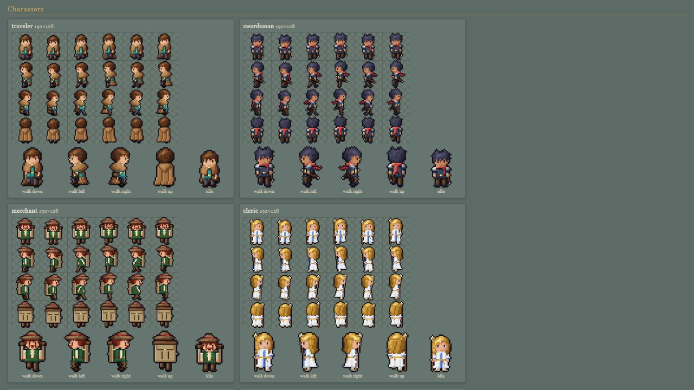

# Pixel module: PixelCanvas, Palette, TextureLibrary, CharacterSprites, PropSprites, MonsterSprites, FxSprites

> **Purpose.** This is the reference for the procedural pixel-art generators. Lumina ships no
> image files: every world texture, character and creature sprite sheet, and prop, flame and
> particle sprite is painted at runtime, texel by texel, from one shared hue-shifted palette,
> then uploaded as a NEAREST-magnified three.js texture. The page documents the drawing API, the
> palette, the 46 world textures (sizes, UV conventions, normal and emissive maps), the character
> spec system with its 14 presets, the 4 creatures and the 23 prop sprites, plus the combat art:
> the character combat poses, the 8 enemy sheets and the FX atlas.
>
> **Audience:** programmers adding content, artists tweaking generators, and AI agents.
>
> **Source of truth:** [`src/engine/pixel/PixelCanvas.js`](../../../src/engine/pixel/PixelCanvas.js),
> [`src/engine/pixel/Palette.js`](../../../src/engine/pixel/Palette.js),
> [`src/engine/pixel/Textures.js`](../../../src/engine/pixel/Textures.js),
> [`src/engine/pixel/CharacterSprites.js`](../../../src/engine/pixel/CharacterSprites.js),
> [`src/engine/pixel/PropSprites.js`](../../../src/engine/pixel/PropSprites.js),
> [`src/engine/pixel/MonsterSprites.js`](../../../src/engine/pixel/MonsterSprites.js),
> [`src/engine/pixel/FxSprites.js`](../../../src/engine/pixel/FxSprites.js).
> Contract: [ARCHITECTURE.md §2 and §4.3](../../../ARCHITECTURE.md); combat art:
> [COMBAT.md §10](../../contracts/COMBAT.md#10-sprites).
>
> **Related:** [modules index](README.md) · [sprite.md](sprite.md) (how sheets become lit billboards) ·
> [world.md](world.md) (TileMap / Props consume the textures; `PropTextureSet` adds a few) ·
> [VISUAL_DESIGN.md](../../design/VISUAL_DESIGN.md) (the art direction) ·
> [OBJECT_CATALOG.md](../../specs/OBJECT_CATALOG.md) (which presets and kinds levels can use) ·
> [MODULE_NOTES.md](../../contracts/MODULE_NOTES.md#textures)



---

## 1. At a glance

| Export | File | What it gives you |
| --- | --- | --- |
| `PixelCanvas` | `PixelCanvas.js` | RGBA pixel buffer with pixel-art primitives → canvas → texture. |
| `parseColor, toHex, toCss, toThreeColor, mixColor, rgbToHsl, hslToRgb, shadeColor, rampFrom` | `PixelCanvas.js` | Colour helpers (sRGB byte space). |
| `makePixelTexture, normalMapFromHeight` | `PixelCanvas.js` | Canvas → NEAREST texture. Height function → tangent-space normal map. |
| `PALETTE, rampAt` | `Palette.js` | The shared dark→light, hue-shifted ramps. |
| `TextureLibrary, TEXTURE_NAMES` | `Textures.js` | 46 cached, lazily painted world textures + normal / emissive maps + materials. |
| `createCharacterSheet, createCreatureSheet, CHARACTER_PRESETS, materialRamp` | `CharacterSprites.js` | 32×32, 4-direction, 6-column character sheets from a spec. Creature sheets. |
| `createPropSprite, PROP_SPRITE_KINDS` | `PropSprites.js` | 23 billboard, flame and particle sprites. |
| `COMBAT_POSE_NAMES`, `createCharacterSheet(spec, { combat: true })`, `_painterKit` | `CharacterSprites.js` | 18-column combat character sheets (§5.4); the painter building blocks for other sheet painters. |
| `createEnemySheet, ENEMY_SHEET_KINDS` | `MonsterSprites.js` | The 8 enemy sheets with pose maps and sprite options (§5.5). |
| `createFxAtlas, FX_FRAMES` | `FxSprites.js` | The 512² combat FX atlas for `FxQuads` (§5.6). |

**Rule:** every pixel texture goes through `PixelCanvas#toTexture()` / `makePixelTexture()`.
Magnification is always `NearestFilter` (deliberate exceptions: the `smoke_puff` / `bokeh_soft`
prop sprites, the particle `glow` texture and the Sprite3D contact-shadow blob, which are meant to
look soft). Colour maps use `SRGBColorSpace`, and data maps (normal, height,
masks) use `NoColorSpace`. Painting into a `PixelCanvas` is plain JS (it also runs in Node), but
`toCanvas()` / `toTexture()` and the sheet builders need a DOM (`document.createElement('canvas')`),
so texture creation does not run in a Worker as written.

**Sandboxes:**

- [`sandbox/textures.html`](../../../sandbox/textures.html)
  - `?view=` `gallery0` (default; terrain slabs), `gallery1` (walls and sides), `gallery2`
    (roofs, door, window, cloth, hay, metal, rope, sign), `gallery3` (trees and props),
    `atlas` (DOM grid of every texture with normal and emissive thumbnails; `&group=`,
    `&only=`, `&scale=`, `&tiles=`, `&aux=0`) and `diorama`. Add `&night=1` for night.
  - `window.__tex`: `lib`, `setView`, `setNight`, `setLightAngle`, `frame`, and `check()`
    (validates names, sizes, colour spaces, alpha setup and material caching).
- [`sandbox/sprite_art.html`](../../../sandbox/sprite_art.html)
  - `?mode=` `gallery` (default), `focus`, `frames`, `walk`, `creatures`, `props`, with
    `&names=traveler,bard`, `&z=6` (zoom), `&dir=`.
  - `?mode=hashes`: an FNV-1a hash of every existing sheet (all presets, random villagers 1–8,
    the gallery's spec overrides, the creatures, every prop sprite at the default seed and seed 7)
    in `window.__spriteHashes`. The committed baseline is `sandbox/sprite_art.hashes.json`, taken
    before the combat art was added.
  - `?mode=combat`: the checks (hash baseline, value contrast, paint time, glow texels), a small
    diorama with the real `Sprite3D` (`combatFx`) and PostFX bloom (hit flash, wind-up highlight,
    elite shimmer, golem / bat / shaman glow), the player combat sheet, every enemy sheet × pose ×
    direction with pose labels and live walk previews, and the FX atlas with animated frames.
    `&focus=<player|slime|…|golem|atlas>&z=N` shows one sheet zoomed, `&cols=6,7,8` only
    those columns. `window.__spriteCombat`: `verify()` (every assertion; failures throw
    asynchronously), `probeGlow()`, `programs()`, `hashDiffs`, `contrast`, `paintMs`, `glow`.
  - `window.__sprites`: `sheets`, `creatures`, `props`, `buildMs`, `presets`, `pause()`.

```bash
npm run check -- --page=sandbox/textures.html --query=view=atlas --out=tex_atlas --fps=0
npm run check -- --page=sandbox/sprite_art.html --query= --out=sprite_art --script=sandbox/sprite_art.actions.json
npm run check -- --page=sandbox/sprite_art.html --query=mode=combat --out=spr_combat --fps=0 --script=sandbox/sprite_art.combat.json
```

---

## 2. PixelCanvas

```js
import { PixelCanvas, PALETTE, RNG } from './engine/index.js';

const pc = new PixelCanvas(16, 16, '#4a7d3a');   // width, height, optional fill
pc.wrap = true;                                   // out-of-range coords wrap (seamless tiles)
pc.fillNoise(PALETTE.grass, { scale: 4, seed: 7, period: 4, dither: 0.5 });
pc.speckle('#d6e58a', 0.04, new RNG(3));
const tex = pc.toTexture({ wrap: 'repeat', mipmaps: true });   // SRGB, NEAREST mag
```

**Fields:** `width`, `height`, `data` (`Uint8ClampedArray`, RGBA, row-major, y down), and
`wrap` (default `false`, which makes out-of-range writes no-ops and reads `[0,0,0,0]`).

| Method | Notes |
| --- | --- |
| `static fromCanvas(canvas)` | Copies an existing 2D canvas. |
| `clone()`, `crop(x, y, w, h)`, `flippedX()` | New canvases. |
| `inBounds(x, y)`, `get(x, y)` → fresh `[r,g,b,a]`, `getAlpha(x, y)` | Reads. |
| `set(x, y, color)`, `blend(x, y, color, alpha = 1)`, `scale(x, y, f)` | `blend` alpha-composites. `scale` multiplies RGB. |
| `fill(color)`, `clear()`, `rect(x, y, w, h, color)`, `strokeRect(...)`, `hline(x0, x1, y, c)`, `vline(x, y0, y1, c)` | |
| `line(x0, y0, x1, y1, c)` | Bresenham, inclusive endpoints. |
| `circle(cx, cy, r, c)`, `ring(cx, cy, r, c)`, `ellipse(cx, cy, rx, ry, c)` | Pixel-art friendly (`r + 0.5` test). |
| `polygon([[x, y], …], c)` | Even-odd scanline fill at pixel centres. |
| `map(fn(x, y, [r,g,b,a]) → color \| undefined)` | Per-pixel transform. |
| `fillNoise(ramp, { scale = 4, seed = 0, octaves = 3, period = 0, dither = 0.5, bias = 0, mask = null })` | fBm quantised onto a ramp with Bayer dithering between steps. The canvas spans `scale` noise cells. For a seamless tile, set **`period` equal to `scale`**, as every caller does. (The JSDoc's "scale = width / period" is misleading.) |
| `speckle(color, p, rng, mask = null)` | Seeded single-pixel scatter (`rng` is an `RNG`). |
| `outline(color, { diagonals = false, threshold = 128 })` | 1 px outline around opaque pixels. |
| `blit(src, dx, dy, { flipX = false, flipY = false, alpha = 1 })` | Alpha-composited copy of another `PixelCanvas`. |
| `replaceColor(from, to)`, `luminance(x, y)` | |
| `toCanvas()` | Writes into one cached `<canvas>` per PixelCanvas (re-written on each call). |
| `toDataURL()`, `toTexture(opts)` | `toTexture` = `makePixelTexture(this.toCanvas(), opts)`. |

**Colours** accepted by `PixelCanvas` / `parseColor`: `'#rgb'`, `'#rgba'`, `'#rrggbb'`,
`'#rrggbbaa'`, `[r,g,b]` / `[r,g,b,a]` (0–255), `{r,g,b,a?}`, and `null` / `'transparent'`.
**Not** numbers, CSS names or palette names (CharacterSprites normalises those itself): a
number throws a `TypeError` (`c.trim` is not a function), and a name is not rejected but parsed
as broken hex, giving a wrong colour (`'red'` becomes opaque black).
`parseColor` returns frozen, cached arrays for strings. Never mutate them.

| Helper | Signature → result |
| --- | --- |
| `toHex(c)` / `toCss(c)` | `'#rrggbb'` (or `#rrggbbaa`) / `'rgba(…)'` |
| `toThreeColor(c)` | `THREE.Color` (input treated as sRGB, stored linear) |
| `mixColor(a, b, t)` | `[r,g,b,a]` lerp in sRGB byte space |
| `rgbToHsl([r,g,b])` / `hslToRgb([h,s,l])` | h in degrees, s and l 0..1 |
| `shadeColor(c, amount)` | Pixel-artist shading, `amount` −1..1. Negative darkens and shifts the hue toward blue (245°), positive lightens toward yellow (55°). Lightness ±0.42·amount, saturation nudged. |
| `rampFrom(base, n = 5, spread = 0.5)` | n-step dark→light ramp around a base colour. |
| `makePixelTexture(canvas, { wrap = 'repeat', mipmaps = false, srgb = true, anisotropy = 1, name = '' })` | `CanvasTexture`. `wrap` is `'repeat' \| 'clamp' \| 'mirror'`. Mag is always NEAREST. Min is NEAREST, or `LinearMipmapLinear` with `mipmaps`. Use `mipmaps: true` for tiling world textures and `false` for sprites and UI. |
| `normalMapFromHeight(w, h, heightAt(x, y) → 0..1, { strength = 2, wrap = true })` | PixelCanvas of tangent-space normals (+Y up after three's flipY). |

---

## 3. Palette

`PALETTE` holds named ramps (arrays of hex, dark → light, hue-shifted: cool saturated shadows,
warm soft highlights) plus three single colours. Using the same ramps for textures and sprites
keeps the scene cohesive. `rampAt(ramp, i)` picks a colour with the index clamped.

| Group | Ramps (length) |
| --- | --- |
| Nature | `grass`(6), `grassDry`(5), `leaves`(6), `leavesAutumn`(6), `pine`(5), `dirt`(6), `sand`(5), `stone`(6), `stoneWarm`(6), `moss`(4), `water`(7), `bark`(5) |
| Building | `wood`(6), `woodGray`(5), `plaster`(6), `brick`(5), `roofRed`(6), `roofBlue`(5), `thatch`(6), `slate`(5), `metal`(6), `gold`(6) |
| Cloth / accents | `red`(6), `blue`(6), `green`(5), `purple`(5), `yellow`(6), `cream`(5), `brown`(5), `black`(4), `white`(5) |
| Characters | `skinLight`, `skinTan`, `skinDark`, `hairBrown`, `hairBlonde`, `hairRed`, `hairWhite` (5 each), `hairBlack`(4) |
| Light | `fire`(6), plus the single colours `glowWarm` `#ffc27a`, `glowCool` `#9fd8ff`, `outline` `#140f17` (the plum-black sprite outline, never pure black) |

---

## 4. TextureLibrary (world textures)

```js
const tex = new TextureLibrary({ seed: 1337, anisotropy: 4 });   // the game and editor use these values
const mat = tex.material('cobblestone');                         // cached MeshLambertMaterial
const [uw, uh] = tex.meta('cobblestone').units;                  // [4, 4] → uv = worldPos / units
```

### 4.1 API

| Member | Description |
| --- | --- |
| `constructor({ seed = 1337, anisotropy = 4 } = {})` | Nothing is painted until first use. |
| `get(name)` | Colour `CanvasTexture`: SRGB, `RepeatWrapping`, mipmaps (`LinearMipmapLinear` min, NEAREST mag), anisotropy. Named `lumina:<name>`. Cached and **shared**. |
| `normal(name)` | Tangent-space normal map (`NoColorSpace`, mipmapped). **Every** known texture has one. `null` for unknown names. |
| `emissive(name)` | SRGB mask (white = glows) for `window` and `lantern_glass`. `null` otherwise. |
| `meta(name)` | `{ px: [w, h], units: [w/16, h/16], alpha, emissive, normal }`. |
| `material(name, extra = {})` | Cached `MeshLambertMaterial` with `map`, `normalMap` and a per-texture `normalScale`. Emissive textures also get `emissiveMap`, `emissive #ffb870` and `emissiveIntensity = extra.emissiveIntensity ?? 1`. Alpha textures get `alphaTest 0.5`, `DoubleSide` and `userData.alpha = true`. `userData.texture = name`. `extra` is spread last (so it can override anything), and a numeric `normalScale` is shorthand. The cache key is `name + '\|' + key(extra)`, where functions such as `onBeforeCompile` are keyed by their source and objects with a `uuid` (textures) by uuid. |
| `has(name)`, `list()` | `list()` returns a copy of `TEXTURE_NAMES`. |
| `pixels(name)` | `{ color, normal, emissive, height, normalScale }`: the painted `PixelCanvas`es and the `Float32Array` height field. |
| `canvas(name)` | Colour `<canvas>` for DOM previews. |
| `preload(names = TEXTURE_NAMES)` | Paint everything up front (≈150–190 ms for all 46). |
| `seedOf(name)` | Deterministic per-texture seed from `seed` and the name. |
| `dispose()` | Disposes every texture, material and the fallback, and clears the caches. |

**Unknown names:** a name is known only when it is one of the texture table's own keys
(`has(name)`, which `meta()` and `pixels()` also check since 2026-10-01), so an `Object.prototype`
name such as `'constructor'` from a level file is unknown like a misspelt one (KNOWN_ISSUES
LVL-17). One `console.warn` per name. `get()` returns a magenta/dark 16×16 checker, `meta()` a
default `{ px: [16, 16], units: [1, 1], alpha: false, emissive: false, normal: false }`,
`normal()` / `emissive()` / `canvas()` return `null`, and `pixels()` returns `null`.

### 4.2 The 46 textures (`TEXTURE_NAMES`, contract order)

Units = world size of one repeat (px / 16). **Always scale UVs as `uv = worldPos / meta(name).units`.**
Hard-coding 1 unit per repeat squeezes the larger textures.

Contract groups (the order of `TEXTURE_NAMES`):

- **Terrain tops:** `grass, grass_dark, grass_flowers, dirt, dirt_path, cobblestone, stone_tiles, sand, farmland, moss_stone, riverbed, wood_deck`
- **Terrain sides:** `cliff, grass_side, dirt_side, stone_wall`
- **Buildings:** `plaster, timber_frame, wood_planks, wood_planks_dark, log_wall, brick, stone_brick, roof_red, roof_blue, roof_thatch, roof_slate, door, window, chimney_stone`
- **Nature and props:** `bark, leaves, leaves_autumn, pine, hay, cloth_red, cloth_stripe, metal, barrel, crate, fence_wood, rope, well_stone, lantern_glass, sign_board, flowerbox`

Sizes (\* = alpha cut-out, † = emissive mask):

| Canvas px → units | Textures |
| --- | --- |
| 64×64 → 4×4 (13) | all 12 terrain tops, `plaster` |
| 32×32 → 2×2 (19) | `stone_wall`, `timber_frame`, `wood_planks`, `wood_planks_dark`, `log_wall`, `brick`, `stone_brick`, `roof_red`, `roof_blue`, `roof_thatch`, `roof_slate`, `chimney_stone`, `leaves`\*, `leaves_autumn`\*, `pine`\*, `hay`, `cloth_red`, `cloth_stripe`, `well_stone` |
| 16×32 → 1×2 (2) | `door`, `bark` |
| 32×16 → 2×1 (1) | `sign_board` |
| 16×16 → 1×1 (11) | `cliff`, `grass_side`, `dirt_side`, `window`†, `metal`, `barrel`, `crate`, `fence_wood`\*, `rope`, `lantern_glass`†, `flowerbox`\* |

**On demand, outside the list.** `crag` (32 × 32 px → 2 × 2 u, `normalScale` 0.7; added
2026-09-28, KNOWN_ISSUES COMBAT-20) is a fractured rock face for cliff sides: upright Voronoi rock
pieces, half of the near-vertical borders opened into dark fissures, the horizontal ones soft
ledges, facets split by near-vertical ridges, blue-grey stone — no strata, so stacked shelves read
as one broken crag. It is **not** in `TEXTURE_NAMES` and `preload()` does not paint it: it is
painted (≈ 9 ms) only when something asks for it by name — Cinderwatch Pass's legend char `r`
(`{ top: moss_stone, side: crag, walkable: false }`, the ridge's rock tiles). `list()` does not
include it, and a level that does not use it paints nothing new (all 46 listed textures stayed
byte-identical).

Default `normalScale` in `material()`:

| normalScale | Textures |
| --- | --- |
| 0.45 | `grass`, `grass_dark`, `grass_flowers` |
| 0.5 | `sand`, `plaster`, `wood_planks`, `wood_planks_dark`, `cloth_red`, `cloth_stripe`, `lantern_glass` |
| 0.55 | `wood_deck` |
| 0.6 | `dirt`, `dirt_path`, `stone_tiles`, `farmland`, `timber_frame`, `log_wall`, `brick`, `stone_brick`, `roof_thatch`, `door`, `leaves`, `leaves_autumn`, `pine`, `metal`, `barrel`, `crate` |
| 0.65 | `stone_wall`, `roof_slate`, `chimney_stone`, `well_stone` |
| 0.7 | `cobblestone`, `moss_stone`, `riverbed`, `cliff`, `grass_side`, `dirt_side`, `roof_red`, `roof_blue`, `window`, `bark`, `hay`, `fence_wood`, `flowerbox` |
| 0.8 | `rope`, `sign_board` |

### 4.3 Painting and layout conventions (for geometry authors)

- Every texture is painted at 16 px/unit from `PALETTE` ramps, with a subtle top-left key light
  baked into the forms. A height field is painted alongside the colour and becomes the normal map.
- **Orientation.** Canvas row 0 is texture `v = 1`.
  - Terrain tops use `u = x / uw`, `v = −z / uh`, so canvas-up points toward −Z (away from the
    default camera) and grass blades stand "up" on screen.
  - Walls and sides: canvas up = world up. Roofs: canvas up = toward the ridge, two tile rows per
    unit.
- **Cliff faces.** `cliff` / `grass_side` have two rock strata per unit, so a half-unit
  (`LEVEL_HEIGHT`) phase shift shows no seam. Anchor `grass_side` per column so its `v = 1` is
  the face's top edge (it carries a 3–6 px grass lip plus hanging blades). Texture the rest of
  the face with `cliff` using world-space `v = y`.
- `stone_wall`, `stone_brick` and `well_stone` use 8 px block rows, aligned with `LEVEL_HEIGHT`.
- `timber_frame`: posts and sill/plate straddle the seams (4 px beams when tiled). Mid rail at
  1 unit.
- **Decals** (`door`, `window`, `lantern_glass`, `crate`, `barrel`, `metal`, `sign_board`) map
  0..1 across one face. Barrel hoops sit near v ≈ 0.15 and 0.85.
- **Tiling alpha textures.**
  - `leaves` / `leaves_autumn`: 5 clumps kept inside the canvas, fine on single cards.
  - `pine`: 4 drooping 8 px tiers, tiles along u, so wrap it around cones.
  - `fence_wood` and `flowerbox` tile along u.
- **Seeds.** 44 textures vary with the library seed. Only `window` and `lantern_glass` are
  seed-independent (checked by painting every texture with two seeds). `door` is hand-laid out
  but its wood grain uses the seed; the builder's report (and MODULE_NOTES) still list it as
  seed-independent.
- **Shared objects.** Everything returned is shared. Never set `.repeat`, `.offset` or
  `onBeforeCompile` on a returned texture or material. Pass params through
  `material(name, { … })`, or clone.
- **Emissive textures glow by default** (`emissiveIntensity` 1, day and night). Register their
  materials with `LightingSystem.registerEmissive(mat, { day: 0, night: 1.6 })` so the glow
  follows the night factor. Props return them in `emissives` for this ([world.md](world.md)).

---

## 5. CharacterSprites

### 5.1 `createCharacterSheet(spec = {}, opts = {})` → SpriteSheet

```js
const sheet = createCharacterSheet({ preset: 'guard', seed: 12 });   // subtle crowd variation
const hero  = createCharacterSheet('traveler');                      // preset shorthand
const npc   = createCharacterSheet({ randomize: true, seed: 'baker' }); // seeded random villager
```

Result: `{ texture, canvas, frameWidth: 32, frameHeight: 32, columns: 6, rows: 4, pixelsPerUnit: 16,
anchor: [0.5, 0], animations, name, spec, dispose() }`.
`opts.combat: true` returns the 18-column combat sheet instead (§5.4).

- **Layout.** Rows follow `DIRECTIONS` (`down`, `left`, `right`, `up`). Columns are
  `[idle0, idle1, walk0 (contact), walk1 (passing), walk2 (contact), walk3 (passing)]`.
  There are no talk or wave columns.
- **Animations** for each direction `d`: `idle_d` (cols 0–1, 2.5 fps), `walk_d` (cols 2–5,
  8 fps), `run_d` (the same 4 frames at 13 fps). All loop.
- **Body.** Adults are ~27 px tall plus the outline, with feet on row 30 and the outline on
  row 31. The head is 12 px wide, about a third of the height (chibi). The child build is ~20 px.
- **Texture** (`character:<preset>`): NEAREST min and mag, no mipmaps, SRGB, ClampToEdge. It
  shares nothing, and `dispose()` frees only this texture.
- **Look.** Layered pixel parts (body, legs, clothing, arms, head and face, hair, hat, cape, gear)
  are painted into a material + shade label buffer. They resolve to per-character 5-tone ramps
  lit from the upper left, with selective inner lines and a plum `PALETTE.outline` silhouette.
  Walk frames have a 1 px body bob, opposite arm swing and lagging hair, cape and scarf.
  **`right` is `left` mirrored** (so its light comes from the upper right), but asymmetric gear
  such as the sheathed sword, satchel and pole hand is redrawn on the correct side.

**Spec fields** (all optional; missing fields come from the preset, default `villager`;
`undefined` values keep the preset's value):

| Field | Values |
| --- | --- |
| `preset` | A `CHARACTER_PRESETS` key, or `'random'` (= `randomize`). |
| `seed` | Number or string (hashed). On a preset it adds a **subtle deterministic colour variation** (top, bottom, hair hue and lightness, and eye colour, only where not overridden). Without a seed, presets render exactly as designed. |
| `randomize` | `true`: a seeded random villager that fills every field you did not set. |
| `skin`, `hair` | Colour (see below). |
| `hairStyle` | `'short' \| 'long' \| 'ponytail' \| 'bald' \| 'spiky' \| 'bun'` (unknown → `short`). |
| `outfit` | `{ top, bottom, accent, style?: 'tunic'\|'vest'\|'robe'\|'dress'\|'dancer'\|'overalls'\|'tabard', shirt? }` |
| `cape` | `false`, a colour, `true`, or `{ color, style?: 'cloak'\|'cape'\|'short', lining? }` |
| `hat` | `'none' \| 'hood' \| 'wide' \| 'cap' \| 'helmet' \| 'circlet'`, plus `hatColor`, `hatBand`, `feather` (the cap feather appears only when set). |
| `weapon` | `'none' \| 'sword' \| 'staff' \| 'bow' \| 'lute' \| 'spear' \| 'cane'` |
| `beard` | `false`, `true` (= `'full'`), `'full' \| 'mustache' \| 'goatee'`, or a colour (a full beard in that colour). |
| `eyes` | A colour, or `'brown' \| 'blue' \| 'green' \| 'grey' \| 'violet' \| 'gold'`. |
| `blush`, `female` | Booleans. |
| `build` | `'normal' \| 'stout' \| 'elder' \| 'child'` |
| `gear` | `{ satchel, pack, quiver, scarf, pauldrons, bracers, gloves, glasses, book, apron, sash, sashes, boots, leather, belt, staffGem }`. Values are booleans or colours; `true` means the default colour. |

Colours may be `PALETTE` ramp names (`'red'`, `'hairBlonde'`, `'skinTan'`), single-colour palette
entries, hex strings, `0xRRGGBB` numbers, `THREE.Color`, CSS colour names or `[r,g,b]` arrays.
Unknown values fall back to a neutral brown-grey `#8a7a6a`; palette, eye-colour and CSS names are
matched as own keys (`ownValue`), so `'constructor'` or `'__proto__'` is unknown too.

`materialRamp(spec, { base })` → five RGBA arrays `[deep, shadow, base, light, shine]` from a
ramp name, colour or explicit ramp. It is the building block of the character colours.

### 5.2 `CHARACTER_PRESETS` (14)

| Preset | Look |
| --- | --- |
| `traveler` | Brown short hair, teal tunic, brown cloak with a lining, satchel, green eyes (the player). |
| `swordsman` | Tan skin, black spiky hair, navy tunic, sword, red scarf, pauldrons, bracers. |
| `merchant` | Red hair, green vest, wide brown hat with a red band, mustache, pack, stout build. |
| `cleric` | Blonde long hair, white robe, circlet, staff with a blue gem, gold sash, blush. |
| `scholar` | White short hair, purple robe, goatee, glasses, book. |
| `dancer` | Tan skin, black ponytail, red dancer outfit, circlet, sashes, gold boots. |
| `hunter` | Blonde, brown tunic, green hood and short cape, bow, quiver, gloves. |
| `villager` | Brown short hair, cream tunic, blue-grey trousers (the default). |
| `farmer` | Tan skin, overalls, wide thatch hat with a red band. |
| `elder` | Bald, white full beard, robe, cane, red sash, elder build. |
| `child` | Blonde ponytail, coral tunic, child build, blush. |
| `guard` | Blue tabard, helmet, spear, pauldrons, gloves. |
| `innkeeper` | Brown bun, rust dress, cream apron. |
| `bard` | Blonde, blue tunic, red short cape, red cap with a gold band and white feather, lute. |

The level format lists the same 14 names as `CHARACTER_PRESET_NAMES`
([OBJECT_CATALOG.md](../../specs/OBJECT_CATALOG.md)).

### 5.3 `createCreatureSheet(kind, spec = {})`

Same row order and animation names as characters (`idle_*`, `walk_*`, `run_*`), anchor
`[0.5, 0]` with the feet 1 px above the frame bottom. Unknown kinds (an `Object.prototype` name
included) fall back to `cat`. The result has no `spec` field.

| Kind | Frame | idle / walk / run fps | Default colours (override keys) | Motion |
| --- | --- | --- | --- | --- |
| `cat` | 24×16 | 2 / 9 / 14 | `fur #d9822b`, `fur2`, `fur3`, `eyes`, `nose` | Tabby, tail sway, blink idle |
| `dog` | 28×20 | 3 / 9 / 14 | `fur #a8703e`, `fur2`, `fur3`, `eyes`, `nose` | Tail wag |
| `chicken` | 18×16 | 3 / 8 / 12 | `fur #f4efe6`, `fur2`, `fur3`, `eyes`, `beak`, `comb` | Pecking idle |
| `bird` | 16×16 | 2.5 / 8 / 12 | `fur #8a6040`, `fur2`, `fur3`, `eyes`, `beak` | Hop cycle |

**Cost:** about 3–5 ms of CPU per character sheet, once. Cache and share sheets for identical
specs. The demo keeps a `sheetCache` per level and shares one sheet per critter kind.

### 5.4 Combat sheets

`createCharacterSheet(spec, { combat: true })` (combat levels only, [COMBAT.md §10.2](../../contracts/COMBAT.md#102-character-combat-sheet-characterspritesjs-sprites))
returns a separate 18-column sheet, 576 × 128, texture `character:<preset>:combat`:

- Columns 0–5 are the plain sheet's pixels, copied byte for byte (the combat sandbox compares
  them). Columns 6–17 are `COMBAT_POSE_NAMES`: `wind, slash, follow, backhand, thrust, spin,
  cast, aim, hurt, tuck, roll, down`.
- The result also has `poses` (pose name → column: `idle0 … walk3` = 0–5, the combat poses
  6–17) and, per direction, the one-shot animations `attack1 [wind, slash, follow]`,
  `attack2 [backhand, follow]`, `attack3 [wind, thrust]`, `spin`, `cast`, `aim`, `hurt`,
  `dodge [tuck, roll, tuck]`, `down` (12 fps, `loop: false`; for sandboxes — the game shows the
  poses with `setFrame`). Without the option nothing changes (6 columns, same name, no `poses`).
- **How they are drawn.** The combat poses are ordinary `POSES`-style entries with an `act`
  (plus `phase` and their own `lag` secondary motion); every drawing branch that differs from the
  plain poses keys on `pose.act`, so the plain sheets stay unchanged (86 canvas hashes in
  `sandbox/sprite_art.hashes.json`). A table (`ACTS`, with `BOW_ACTS` / `STAFF_ACTS` overrides)
  gives, per act and view, the hand positions of the weapon (right) and off (left) arm relative
  to their shoulders, the weapon direction, the layer each arm is drawn in (`behind` the body,
  `under` the head, `over` everything), an upper-body lean (`p.ox` / `p.oy`, reset after the
  frame; the legs stay planted) and the stance. The child build scales the offsets (0.75 × /
  0.6 ×) or uses explicit `hc` child offsets: the archer draws at chest height (`BOW_ACTS.aim` —
  off to the screen right in the front view, tipped a little down from the side), so the string
  no longer crosses its face (it aimed at eye level before 2026-09-28, KNOWN_ISSUES COMBAT-08).
- **Weapons in hand.** The sheathed sword leaves its scabbard empty; the slung bow moves into the
  hand. The drawn sword (5 px blade, 4 on the child build; ≤ 8 px pommel to tip) has a pommel, a cross-guard and a
  bright blade; the staff (8 px, 6 ahead of the grip) carries its gem at the pointing end; the bow is drawn with a nocked
  arrow and the string pulled to the right hand (`aim`), relaxed after the shot (`follow`). The
  right hand holds the weapon — the far hand facing left, the near hand in the mirrored `right`
  row (the pole's far / near swap), so the mirror never moves the weapon to the wrong hand. The
  player's `aim` raises a green healing draught to the mouth.
- **Special poses.** `hurt` and `down` use shut eyes and an open mouth; `tuck` is a crouch
  (`bob` 4); `roll` (`drawRoll`, redrawn 2026-09-28, KNOWN_ISSUES COMBAT-08) is a curled
  traveller — side view: the big head leading with the face turned down, the cloaked back arched
  behind it, shins and boots underneath with the hands on the shins, the hem flaring with its
  lining, the weapon along the back; front view: the ducked crown with the boots over the top and
  the arms at the sides; back view: the hair cap drawn after the cloaked back, outlined and one
  shade darker than the cloak's lit tan, with ears when bare-headed, over the seat and the boot
  soles (it used to be a plain ball that the brown cloak and hair blended into); `down` is the
  standing layout rotated 90° clockwise onto the ground (the head points backward; light from the
  left becomes light from above).
- **Margins.** Every combat column keeps a 1 px transparent border (weapons stop 2 px from the
  frame edge, lean included).

New optional spec fields (absent on every existing spec, so existing sheets are unchanged):

| Field | Effect |
| --- | --- |
| `ears: 'pointed'` | Long goblin ears on both sides of the head (down / up views), swept back in profile. Hidden under hoods and helmets. |
| `face: 'fierce'` | Slanted brows over bright eyes, a nose shadow, a wide grin with one fang. |
| `gear.beads` | Bead necklace with a tooth pendant (`true` = bone colour, or a colour). |
| `gear.gemGlow` | The staff gem is painted as glow texels (alpha 204). |
| `feather` with `hat: 'hood'` | A tuft of three feathers tucked into the hood (the feather was ignored on hoods before). |

`_painterKit` exports the internal building blocks for `MonsterSprites.js`: `Painter`,
`resolvePainter`, `T`, `M` (material ids, now with `GEL 35, BONE 36, GLOW 37, STONE 38,
WING 39`), `CRE_L`, `blob`, `quadGait`, `quadLeg`, `tailChain`, `rampForKind`, `finishTexture`,
`buildAnimations`, `POSES`, `lagOf`, plus `glowTexel`, `GLOW_ALPHA` (204), `OUTLINE`, `ERASE`.
Not a stable public API.

### 5.5 Enemy sheets (`createEnemySheet`)

`createEnemySheet(kind)` in [`MonsterSprites.js`](../../../src/engine/pixel/MonsterSprites.js)
([COMBAT.md §10.3](../../contracts/COMBAT.md#103-enemy-sheets-monsterspritesjs-sprites)) returns the
SpriteSheet shape plus `{ kind, poses, spriteOptions }` for the 8 `ENEMY_SHEET_KINDS`; an unknown
kind throws (for the type check `kind` and `ENEMY_SHEET_KINDS` are the union of the eight names,
written out by hand — a new enemy kind is added to both and to `EnemyKind` in `combat/defs.js`).
Callers cache one sheet per kind. Rows are `DIRECTIONS` with a real (mirror-painted) `right` row, so
`setFrame(col, row)` never flips; every sheet has `idle_<d>` (2.5 fps; the bat: move0–3 at 10 fps),
`walk_<d>` (8 fps) and `run_<d>` (13 fps). `spriteOptions` holds only Sprite3D option keys and is
spread into the sprite options by the game. Texture names are `enemy:<kind>`.

| Kind | Sheet | Columns | Look |
| --- | --- | --- | --- |
| `slime` | 20×16 × 11 | idle0/1, move0–3 (crouch, launch, airborne, fall), windup (squash), attack (stretched leap), hurt, dead (splat), land | Translucent teal gel (`GEL` mid-tone `#3fb6a8`): denser core, light through the gel above the contact row, bright upper-left rim and specular, a moss tuft and a leaf sprout. `blobSize [0.9, 0.45]`. |
| `goblin` | 32×32 × 18 | the combat character sheet; `move0–3 = walk0–3`, `windup = wind`, `attack = slash`, `attack2 = backhand`, `dead = down` | Child build, skin `#7aa84a`, pointed ears, fierce face, bald, open dark-leather vest over the bare chest and arms, tan loincloth, bare feet, sword. |
| `archer` | 32×32 × 18 | `windup = aim`, `attack = follow`, `shove = thrust`, `dead = down` | Green skin, leather hood, tunic, quiver, bow. |
| `shaman` | 32×32 × 18 | `windup = cast`, `attack = aim`, `blink = tuck`, `dead = down` | Green skin, plum hood with a feather tuft, robe, bone beads, staff with a green gem painted as glow texels. |
| `bat` | 20×20 × 10 | idle0/1, move0–3 (wings up, mid, down, mid), windup (wings high, eyes wide), attack (swept back), hurt, dead | Charcoal body and bones, ember-orange membranes lit along the bones, glow-texel eyes, fangs. The side view (redrawn 2026-09-28) has both wings behind a bigger, whole body — the far wing darker — a tall ear, an outlined head and a 2-px glowing eye. `castShadow: false`, `blobSize [0.7, 0.35]`. |
| `boar` | 32×24 × 13 | common, charge0 / charge1 (gallop extended / gathered), stun | Shoulder hump, bristle ridge and strokes, bone tusks, iron-plated forehead, red eyes, curly tail; `quadGait` legs. `blobSize [1.6, 0.7]`. |
| `dummy` | 16×24 × 11 | common (move = idle), hurt (tilt left), hurt2 (tilt right), dead (= hurt) | Straw body bound with rope on a post, a red / white target, a burlap head with stitched eyes, crossbar arms. `blobSize [0.7, 0.35]`. |
| `golem` | 64×64 × 17 (1088 × 256) | idle0/1, move0–3, windup (= slamWind), attack (= slam), hurt, dead, slamWind, slam, sweepWind, sweep, throw, roar, kneel | Basalt built from chiselled rock chunks (`rock()`: jagged star polygons with a flat face and light-facing bevels), magma cracks, core, eyes and cinder crown as glow texels, a rubble pile when dead. `blobSize [2.6, 1.2]`. |

- **Glow texels** use alpha exactly 204 (`GLOW` material in the monster ramps, `gear.gemGlow` on
  characters); every other texel is 0 or 255 (checked). With a `combatFx` sprite, `setGlow`
  lights exactly them ([sprite.md §2.7](sprite.md#27-combat-flash-glow-and-highlight-combatfx)); a plain
  sprite shows them as ordinary opaque texels.
- **Value contrast.** For slime, goblin and bat the combat sandbox reports the contrast ratio
  `(L1 + 0.05) / (L2 + 0.05)` (sRGB relative luminance) between the sheet's **mid-tone average**
  and the average of the `g` / `G` grass top textures (`grass`, `grass_dark`: L 0.142). The
  mid-tone average is the mean colour of the 40th–60th luminance percentile of the sheet's opaque,
  non-outline texels (a robust median that ignores rims, eye whites and deep shadows). Current:
  slime 2.11, goblin 1.72, bat 2.69 (each must be ≥ 1.6).
- **Cost.** All 8 sheets plus the player combat sheet paint in ≈ 50–90 ms (budget 120 ms; the
  golem is ≈ 25 ms of it), once at load. Painting is RNG-free.

### 5.6 FX atlas (`createFxAtlas`)

`createFxAtlas()` in [`FxSprites.js`](../../../src/engine/pixel/FxSprites.js)
([COMBAT.md §10.4](../../contracts/COMBAT.md#104-fx-atlas-fxspritesjs-sprites)) → `{ texture, canvas,
frames }`, one 512 × 512 NEAREST / sRGB / clamp-to-edge texture for `FxQuads`. `FX_FRAMES` lists
the 19 frames (`slash, slashBig, spin, thrust, impact, crit, dust, arrow, emberBolt, boulder,
coin, heart, mana, draught, upgrade, core, stun, pillar, wallFlame`) with `{ w, h, n, fps }`;
`frames[name].rects` holds one `[u0, v0, u1, v1]` per animation frame (three's default flipY:
`v0` = the frame's bottom edge, `v1` its top edge). Frames are shelf-packed (tallest first) with a
1 px transparent gutter. It paints in ≈ 8 ms.

- Painted in **grey levels** with binary alpha, white-hot cores and mid / dark greys for form, so
  the instance colour tints them. Pickups and the boulder carry a dark rim to read over any
  ground.
- **Orientation:** `arrow` and `thrust` point along **+U** (texture right); `slash` / `slashBig`
  bulge toward **+V** (texture top, the flat quad's forward axis) and sweep from the right to the
  left over their four frames (a reversed playback sweeps back); the `spin` ring's bright head
  circles once over its frames; `stun` stars orbit on an ellipse; `pillar` sparkles rise.

---

## 6. PropSprites

```js
const flame = createPropSprite('torch_flame');               // animated strip
const tuft  = createPropSprite('grass_tuft', { seed: 42 });  // seed varies the layout
```

Result: `{ texture, canvas, width, height, pixelsPerUnit: 16, anchor: [0.5, 0], frames?, fps?,
frameWidth, frameHeight, sheetWidth, columns, rows: 1, animations, kind, dispose() }`.

- **`width` / `height` are ONE frame in pixels** (world size = px / 16). Animated kinds are a
  horizontal strip `width × frames` wide (`sheetWidth`). Never use `width` as the strip width.
- The result **is also a valid one-row SpriteSheet**. Animated kinds have a looping `idle` over
  all frames at the kind's fps, so `new Sprite3D(createPropSprite('campfire'))` animates by
  itself ([sprite.md](sprite.md)). Static kinds have `animations: {}`.
- **Textures** (`prop:<kind>`): NEAREST, no mipmaps, SRGB, ClampToEdge. `smoke_puff` and
  `bokeh_soft` use `LinearFilter` so they stay soft.
- **Alpha:** plants have binary alpha, which suits `alphaTest` 0.5 and `Foliage`. The particle
  kinds (`sparkle`, `ember`, `dust`, `smoke_puff`, `bokeh_soft`) have soft alpha, so draw them
  with additive or alpha blending, not alpha test.
- **Seeds:** `opts.seed` is a number or string; the default is a hash of the kind. It varies
  `grass_tuft`, `grass_tall`, the four flowers, `bush`, `fern`, `reeds`, `campfire`,
  `torch_flame` and `smoke_puff`. `mushroom`, `rock_small`, `candle_flame`, `speech_bubble`,
  `exclamation`, `sparkle`, `leaf`, `petal`, `ember`, `dust` and `bokeh_soft` are fixed pixel art
  and ignore the seed (the JSDoc's "seed varies the procedural layout" applies only to the first
  group). An unknown kind **throws**.

| Kind | Frame px | Frames @ fps | Use |
| --- | --- | --- | --- |
| `grass_tuft` / `grass_tall` | 16×12 / 16×24 | | Foliage fields |
| `flower_red` / `flower_yellow` / `flower_white` / `flower_blue` | 13×15 / 12×12 / 14×14 / 12×14 | | Foliage fields |
| `bush` / `fern` / `reeds` | 24×18 / 20×16 / 14×26 | | Foliage fields |
| `mushroom` / `rock_small` | 13×11 / 14×9 | | Ground detail |
| `campfire` | 24×26 | 8 @ 10 | Animated fire |
| `torch_flame` | 10×16 | 6 @ 12 | Animated flame |
| `candle_flame` | 5×8 | 4 @ 9 | Animated flame |
| `speech_bubble` / `exclamation` | 17×15 / 6×15 | | Interaction icons |
| `sparkle` | 11×11 | | 4-point star glint |
| `leaf` / `petal` / `ember` / `dust` | 7×6 / 5×4 / 5×5 / 4×4 | | Particle sprites |
| `smoke_puff` | 24×24 (linear filter) | | Soft particle |
| `bokeh_soft` | 32×32 (linear filter) | | Soft round glow (fireflies, halos) |

Where they are used:

- The demo's ground detail ([`src/demo/GroundDetail.js`](../../../src/demo/GroundDetail.js))
  packs plant sprites into strips for `Foliage`.
- World flames (lamps, torches, campfire) are shader-based (`world/props/Flame.js`), not these
  strips. `Sprite3D` accepts animated prop sprites directly if you want a sprite flame.
- `Particles` builds its own internal textures ([fx.md](fx.md)).

---

## 7. Extension points

- **New world texture:** write a `genX(surf, ctx)` in `Textures.js` that paints colour + height
  (+ emissive), add a `DEFS` entry `{ px, gen, normalScale, alpha?, emissive?, wrap? }` and
  append the name to `TEXTURE_NAMES` (additive only). Check it in the atlas view and run
  `window.__tex.check()`. Prop-specific textures that don't belong in the shared library go in
  `PropTextureSet` ([world.md](world.md)).
- **New preset:** add an entry to `CHARACTER_PRESETS`. For it to be placeable in levels, also add
  it to `CHARACTER_PRESET_NAMES` in `src/engine/level/ObjectCatalog.js`.
- **New prop sprite:** write a builder, register it in `BUILDERS` and `PROP_SPRITE_KINDS`, and
  return through `finish(pc, kind, { frames, fps, smooth })`.
- **New hair, hat or beard:** templates live in the `HAIR`, `HATS` and `BEARDS` tables (per
  direction, as row strings with a legend).
- **New combat pose or weapon grip:** add an entry to `ACTS` (or `BOW_ACTS` / `STAFF_ACTS`) and
  key any new drawing branch on `pose.act` only; then run `sprite_art.combat.json`, which fails
  if any existing sheet's hash changes. After an *intended* change to the plain sheets, re-take
  the baseline with `?mode=hashes` and commit it with the change.
- **New enemy kind:** add a `KINDS` entry (frame size, columns, aliases, `spriteOptions`, ramps,
  painter) in `MonsterSprites.js` and to `ENEMY_SHEET_KINDS`; extend the combat sandbox's
  `verify()` expectations.
- **New FX frame:** add it to `FX_FRAMES` and a painter to `PAINT` in `FxSprites.js` (the
  shelf packer places it; the atlas must still fit 512²).

## 8. Gotchas

- **Determinism:** generators use `RNG` / `hash2` / `fbm2` only. Keep it that way.
- **Alpha foliage at distance:** canvas upload drops the colour under fully transparent texels,
  so mip levels ≥ 1 darken leaf edges slightly. Invisible at the HD-2D zoom, where mip 0 is used.
- **1×1 side textures repeat every unit** (`cliff`, `grass_side`, `dirt_side`). The strata are
  continuous, but some regularity shows on long faces.
- **`grass_side` uses the `grass` ramp**, so it looks brighter than `grass_dark` tops above it.
- **normalScale was tuned under sandbox lighting.** Override per material if needed:
  `tex.material('brick', { normalScale: 0.4 })`.
- **Sheet frames use the full 32 px.** Tall hats and spiky hair touch row 0 in bob frames, and
  there is no transparent gutter between rows. No bleed is visible at gameplay magnification.
- **CPU and DOM work:** about 100 ms for the full 55-asset sprite gallery, and 150–190 ms for all
  textures. Paint behind a loading screen (`preload()`) and cache sheets.
- **Glow texels are alpha 204.** Don't composite combat sheets with `PixelCanvas#blit` (it blends
  partial alpha); copy rows of `data` as `createCharacterSheet` does.
- **The value-contrast check is on the whole sheet.** Darkening a goblin's skin share (dark hair,
  boots, trousers) drops its ratio toward the grass value (1.71 now, limit 1.6).

## 9. History and decisions

- **Textures (Phase 1).**
  - The builder kept every size the contract states, and made unspecified large surfaces bigger
    (4×4-unit tops and plaster, 2×2 walls and roofs) so 20×20-tile fields don't visibly repeat.
    As a result, TileMap and Props **must** scale UVs by `meta(name).units`.
  - Every texture got a normal map, not only the relief ones the contract required.
  - The auditor redesigned `cliff` (layered sedimentary strata from a flattened periodic
    Voronoi, instead of "stacked planks"), `dirt_side` and `hay`, and lifted `roof_slate` one
    ramp step.
  - The auditor made the `material()` cache key robust (functions keyed by source, textures by
    uuid) and made `fence_wood` seed-dependent.
- **Sprite art (Phase 1 audit).**
  - Prop results gained `rows: 1` + `animations`, so animated flames play in `Sprite3D`.
  - The tear in long hair on walk frames was fixed, the cleric's staff gem made visible, and the
    side-view bun redrawn.
  - Colour specs became robust: numbers, `THREE.Color`, CSS names, `true` for gear flags, and
    `undefined` fields keep preset values. String seeds are hashed.
- **Combat (COMBAT.md §10).**
  - The plain character drawing gained branches keyed only on `pose.act` (arms, legs, sheathed
    weapons, faces, lean) and a few optional spec fields; a canvas-hash baseline of 86 existing
    sheets guards them.
  - The goblin's bare arms, chest, scalp and feet are skin-coloured so its mid-tone stays lighter
    than the grass (a dark goblin failed the ≥ 1.6 contrast check at 1.24).
  - The golem's rock painter uses an allocation-free star-polygon test (the first version, with
    generic point-in-polygon tests, took 157 ms for the golem alone; now ≈ 25 ms).
  - Art pass of 2026-09-28 (KNOWN_ISSUES COMBAT-08, COMBAT-20): the roll pose, the child build's
    bow draw and the bat's side view were redrawn (the 86 plain-sheet hashes unchanged), and the
    on-demand `crag` texture was added for Cinderwatch Pass's ridge instead of a new contract
    texture — outside `TEXTURE_NAMES`, so `preload()`, the texture sandbox and every other level
    paint exactly what they did.
- **Phase 2:** a review asked for a slower idle cycle. It was done on the demo side (idle
  playback speed, `IDLE_SPEED` in `src/demo/config.js`), so the engine's sheet defaults (idle
  2.5 fps) are unchanged.
