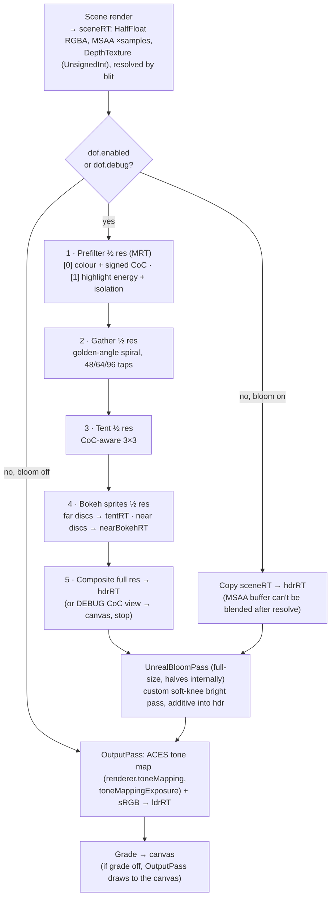

# Render module: PostFX, post shaders, GlobalUniforms

> **Purpose.** This is the reference for Lumina's post-processing stack and its shared shader
> state. `PostFX` gives the HD-2D look its signature: an MSAA HDR scene target, tilt-shift depth
> of field with bokeh highlight scatter, soft-knee bloom, ACES tone mapping and a display-space
> colour grade (vignette, grain, chromatic aberration, sharpen, dither). `globalUniforms` is the
> one set of uniform objects every custom shader reads for time, night, wind, camera yaw and sun.
> The page lists every setting with its default, the pass chain, the algorithms and the wiring
> rules that avoid shader-compile hitches.
>
> **Audience:** rendering and game programmers, artists tuning the look, and AI agents.
>
> **Source of truth:** [`src/engine/render/PostFX.js`](../../../src/engine/render/PostFX.js),
> [`src/engine/render/GlobalUniforms.js`](../../../src/engine/render/GlobalUniforms.js),
> [`src/engine/render/shaders/`](../../../src/engine/render/shaders/)
> (`PostCommon.js`, `DofShaders.js`, `BloomShaders.js`, `GradeShader.js`). Contract:
> [ARCHITECTURE.md §4.2](../../../ARCHITECTURE.md).
>
> **Related:** [RENDER_PIPELINE.md](../RENDER_PIPELINE.md) (the whole frame, scene to screen) ·
> [PERFORMANCE.md](../PERFORMANCE.md) (budgets, ResolutionGovernor) ·
> [VISUAL_DESIGN.md](../../design/VISUAL_DESIGN.md) (the look being targeted) · [core.md](core.md) ·
> [lighting.md](lighting.md) (who writes the sun and night uniforms and the exposure) ·
> [MODULE_NOTES.md](../../contracts/MODULE_NOTES.md#postfx)


*`sandbox/postfx.html`: the in-focus band around the hero is pixel-exact, and the foreground and
background fall into bokeh.*

---

## 1. At a glance

```js
import { PostFX } from './engine/index.js';

const postfx = new PostFX(engine.renderer, engine.scene, engine.camera, { maxTaps: 64 });
engine.setRenderFn((dt) => {
  postfx.setFocus(distanceToPlayer);   // linear view depth of the subject
  postfx.render(dt);
});
// once at load, behind the loading screen, after the scene is built (see §6):
const { renderer, scene, camera } = engine;
renderer.setRenderTarget(postfx.sceneTarget);
await renderer.compileAsync(scene, camera);
renderer.setRenderTarget(null);
postfx.warmup();
```

**Sandbox:** [`sandbox/postfx.html`](../../../sandbox/postfx.html), an HD-2D test diorama with
lanterns, fireflies and two sprites.

- URL flags: `?gui` (lil-gui controls), `?label` (timings label), `?freeze` (stop animation),
  `?samples=N`, `?scale=S` (dofScale).
- `window.__postfx`: `postfx`, `renderer`, `scene`, `camera`, `set(path, value)`, `reset()`,
  `probeDepth()` (proves the MSAA depth resolve), `freeze()`, `setPixelRatio()`,
  `rebuild(opts)` (a new PostFX with other `samples` / `dofScale` / `maxTaps`),
  `zoom(cx, cy, scale)`, `flickerTest()` (temporal-stability metric), `nanTest()`,
  `focusOn()`, `memory()`, `info()`.
- Scripts: `postfx.actions.json`, `postfx.robust.json` (autofocus, pixel ratio, MSAA off,
  dofScale variants, leak check), `postfx.flicker.json` (temporal stability), `postfx.nan.json`
  (NaN scrubbing), `postfx.perf.json` (minimum GPU ms per stage).

```bash
npm run check -- --page=sandbox/postfx.html --query= --out=postfx --script=sandbox/postfx.actions.json
```

Also: [`sandbox/lighting_engine.html`](../../../sandbox/lighting_engine.html) runs the real
Engine + LightingSystem + PostFX + GodRays together.

---

## 2. GlobalUniforms

`globalUniforms` ([`GlobalUniforms.js`](../../../src/engine/render/GlobalUniforms.js)) is a plain
object of three.js uniform objects `{ value }`. Custom shaders put **the same objects** into
their `uniforms` (`uniforms.uTime = globalUniforms.uTime`), so one write per frame updates every
material. **Never copy the value.** Modules don't talk to each other for per-frame sync; they
share these.

| Uniform | Type, default | Written by | Read by (engine) |
| --- | --- | --- | --- |
| `uTime` | float, `0` | `Engine` each frame (scaled seconds, before `'beforeRender'`) | Particles, Foliage, Water, Flame, Wind |
| `uNight` | float 0 = day … 1 = night, `0` | `LightingSystem` | Particles (fireflies, dust), GodRays, Water, Flame |
| `uWind` | `Vector2` (xz direction × speed), `(1.0, 0.35)` | the game (demo `Weather`) and the editor preview, both through `WeatherLook.applyWeatherWind` | Particles, Foliage, Wind (trees, props) |
| `uWindStrength` | float, `1.0` | the game (demo `Weather`) and the editor preview | Particles, Foliage, Wind, windmill sails |
| `uCameraYaw` | float radians, `0` | `CameraRig.update` (editor: `EditorCamera`) | Sprite3D (cylindrical billboards), Foliage, Flame, Wind |
| `uCameraPosition` | `Vector3`, `(0,0,0)` | `CameraRig` / `EditorCamera` | no engine shader reads it at present |
| `uSunDirection` | `Vector3` normalised, **points from the scene toward the light**, `(0.4, 0.8, 0.45)` normalised | `LightingSystem` (the *current directional light*: sun by day, moon at night) | Sprite3D (shadow proxy, self-shadow skip), Foliage, GodRays, Water glints, TileMap, Wind |
| `uSunColor` | `Color`, linear, `sunColor × intensity / 3.5`: about 1.0 at noon and up to about 1.7 at golden hour (sun intensity 6.0). Default `(1, 0.9, 0.75)` | `LightingSystem`; demo `Weather` and the editor preview grey it when overcast (`WeatherLook.applyOvercast`) | Particles (`lit` presets), GodRays, Water, TileMap |
| `uFogColor` | `Color`, `(0.6, 0.65, 0.75)` | `LightingSystem` (the horizon colour); demo `Weather` and the editor preview when overcast | Water |

Particles and GodRays take the fog colour and density from three's standard fog uniforms
(`scene.fog`), not from `uFogColor`.

The object is typed by the `GlobalUniforms` interface in
[`render/types.d.ts`](../../../src/engine/render/types.d.ts) (the value type of each uniform), so
reading a uniform that does not exist (`globalUniforms.time`) fails the type check. The same file
declares `SceneNode` / `SceneMaterial` (an `Object3D` / `Material` with the `isMesh` … flags and the
geometry and material a `traverse()` callback reads — `root.traverse((/** @type {SceneNode} */ o) =>
…)`) and `SolidMesh` (a one-material mesh), shared by the engine, the editor views and the
sandboxes.

---

## 3. PostFX API

### 3.1 Constructor

```js
new PostFX(renderer, scene, camera, { samples = 4, dofScale = 0.5, maxTaps = 96 } = {})
```

| Option | Default | Meaning |
| --- | --- | --- |
| `samples` | `4` | MSAA samples of the HDR scene target (`0` disables MSAA). The demo and editor use **2** when the drawing buffer exceeds 1.8 M pixels (4× costs ~0.9 ms at 1080p), otherwise 4. |
| `dofScale` | `0.5` (clamped 0.25..1) | Resolution scale of the bokeh passes. **Keep 0.5.** At 0.25 the prefilter reads only a 2×2 footprint of each 4×4 block and aliases. |
| `maxTaps` | `96` (min 48) | Upper bound for the gather tap count (buckets 48, 64, 96; see §5.1). The demo and editor pass **64**: 96 costs ~0.35 ms more at 1080p for no visible gain at their blur size. |

PostFX **does not set** `renderer.toneMapping` / `toneMappingExposure` / `outputColorSpace`.
`OutputPass` reads them, so the renderer must stay on `ACESFilmicToneMapping` with SRGB output
(the `Engine` sets this). `LightingSystem` owns `toneMappingExposure`.

### 3.2 `settings` (read live every frame)

Every toggle and slider takes effect on the next `render()`. Items marked *extra* go beyond
the ARCHITECTURE contract.

**`settings.enabled`** (`true`): `false` renders the scene straight to the canvas with the
renderer's own tone mapping. No DOF, bloom or grade.

**`settings.dof`**

| Key | Default | Meaning |
| --- | --- | --- |
| `enabled` | `true` | Depth-of-field on or off. |
| `focusDistance` | `24` | Linear view depth in focus (world units). Driven by `setFocus` when `autoFocus`. |
| `focusRange` | `5` | Width of the fully sharp band (±range/2 around the focus). |
| `maxBlur` | `12` | Maximum CoC radius **in px at 1080p** (scaled by render height / 1080). |
| `nearScale` / `farScale` | `1.4` / `1.0` | Blur multipliers in front of and behind focus. |
| `tiltShift` | `0.35` | Minimum CoC (fraction of `maxBlur`) outside the screen band: the tilt-shift miniature look. |
| `tiltCenter` / `tiltWidth` | `0.52` / `0.28` | Screen band (uv.y) that the tilt term leaves alone. |
| `bokehBoost` | `1.5` | Energy gain for isolated highlight specks drawn as bokeh discs. |
| `autoFocus` | `true` | `focusDistance` damps toward the `setFocus` target. |
| `debug` *(extra)* | `false` | CoC view straight to the screen: near = amber, far = blue, focus = green, near-field spill = magenta. It skips bloom and grade, and works even with `dof.enabled = false`. |
| `bokehThreshold` *(extra)* | `1.5` | HDR luminance (pre-exposure; divided by `toneMappingExposure`) above which highlight energy is scattered as sprites. |
| `bokehSprites` *(extra)* | `true` | `false` gives a pure-gather fallback. |
| `tiltFeather` *(extra)* | `0.3` | uv distance over which the tilt term ramps in. |
| `focusSpeed` *(extra)* | `4` (1/s) | Autofocus rate. |

**`settings.bloom`**

| Key | Default | Meaning |
| --- | --- | --- |
| `enabled` | `true` | Also skipped when `strength` is 0. |
| `strength` / `radius` | `0.55` / `0.55` | `UnrealBloomPass` strength and radius. |
| `threshold` | `0.82` | HDR energy **above** this blooms (the subtractive soft knee, §5.3). |
| `warmth` *(extra)* | `0.25` | Warm tint of the wider bloom mips. |
| `knee` *(extra)* | `0.35` | Soft-threshold width. |

**`settings.grade`** (display-space, after tone mapping)

| Key | Default | Meaning |
| --- | --- | --- |
| `enabled` | `true` | Off: OutputPass renders straight to the canvas. |
| `exposure` | `1.0` | Post-tone-map multiply. |
| `contrast` / `saturation` | `1.08` / `1.12` | Contrast around mid-grey 0.5. Saturation around luma. |
| `temperature` / `tint` | `0.08` / `0.0` | White balance (blue↔amber, green↔magenta), luma-preserving. |
| `shadowsTint` / `highlightsTint` | `[0.02, 0.04, 0.08]` / `[0.06, 0.03, -0.02]` | Split toning, **plain `[r,g,b]` arrays**. Weighted `(1−l)²` and `l²`. |
| `vignette` / `vignetteSoftness` | `0.5` / `0.55` | Elliptical vignette strength and softness. |
| `grain` | `0.035` | Luminance-weighted animated film grain (changes at 24 fps). |
| `chromaticAberration` | `0.0015` | Radial R/B offset growing with r². |
| `sharpen` | `0.15` | Unsharp mask (detail clamped ±0.08). |
| `vignetteRoundness` *(extra)* | `0.65` | 0 = follows the screen rectangle, 1 = circular. |
| `vignetteColor` *(extra)* | `[0.05, 0.025, 0.04]` | The vignette darkens *toward* this colour × the pixel (a warm brown), not grey. |
| `grainSize` *(extra)* | `1` | Grain cell size in px. |
| `dither` *(extra)* | `1` | 8×8 Bayer dither amplitude in 8-bit LSBs (against banding in the vignette). |

The demo game retunes these at load for every level (`Game._tunePost` in
[`src/demo/Game.js`](../../../src/demo/Game.js)):

- `dof`: `focusRange 6, maxBlur 13, nearScale 1.5, farScale 1.15, tiltShift 0.42, tiltCenter 0.5, tiltWidth 0.3, bokehBoost 1.6`
- `bloom`: `strength 0.5, radius 0.58, threshold 1.05`
- `grade`: `exposure 1.03, contrast 1.04, saturation 1.3, temperature 0.04, vignette 0.55, grain 0.03, shadowsTint [-0.04, 0.05, 0.15]`

The editor's 3D preview has its own, slightly softer tuning (`Viewport3D._setPostFX` in
[`src/editor/viewport3d/Viewport3D.js`](../../../src/editor/viewport3d/Viewport3D.js)): `dof`
`maxBlur 12, nearScale 1.4, farScale 1.1, tiltShift 0.3, tiltWidth 0.34, bokehBoost 1.5`
(otherwise as the game), the same `bloom`, and `grade` `saturation 1.26, vignette 0.45,
grain 0.02`.

### 3.3 Methods and getters

| Member | Description |
| --- | --- |
| `render(dt = 1/60)` | One frame: scene → DOF → bloom → OutputPass → grade → canvas. `dt` (clamped 0..0.25) drives autofocus and grain. It re-syncs to `renderer.getDrawingBufferSize()` every frame, so resize, pixel-ratio and `renderScale` changes need no call. |
| `setSize(width, height, pixelRatio = renderer.getPixelRatio())` | CSS px × ratio (floored). Optional; it matches the Engine `'resize'` payload. |
| `setFocus(distance, immediate = false)` | Autofocus target (non-finite values are ignored). `immediate` jumps (use it after teleports). With `autoFocus` off, the value is stored and `focusDistance` stays manual. |
| `warmup()` | Compiles every PostFX program up front by drawing each pass once into the **kind of target it uses at runtime**. That covers all gather variants ≤ `maxTaps`, prefilter, tent, composite, the debug view and grade to the screen, the copy, bokeh sprites, and the bloom and OutputPass programs. |
| `depthTexture` | Resolved scene `DepthTexture` (valid after `render`). |
| `sceneTarget` | The HDR scene `WebGLRenderTarget` (colour + depth). **Compile scene materials against it** (§6). |
| `size` | `{ width, height, dofWidth, dofHeight }` in device px. |
| `taps` | Current gather tap count. |
| `sceneInfo` | `{ calls, triangles, points, lines }` of the last **scene pass (including the shadow pass)**. Use this, not `renderer.info`, which auto-resets on every post pass and would show ~1 call. |
| `enableTimings(on = true)` | GPU stage timings via `EXT_disjoint_timer_query_webgl2`. Returns `false` if unsupported. |
| `timings` / `timingsMin` | EMA ms and minimum ms per stage: `scene`, `dof`, `bloom`, `output`. |
| `samples`, `dofScale`, `maxTaps`, `renderer`, `scene`, `camera` | Public fields. Treat `samples` and `dofScale` as read-only: the scene target's MSAA is fixed at construction and `dofScale` is only re-read when the targets are reallocated. Build a new PostFX to change them (the sandbox's `rebuild`). |
| `dispose()` | Frees every target, material, geometry, pass and timer query. Five rebuild cycles leave texture, geometry and program counts unchanged. |

---

## 4. The pass chain



Passes are driven manually with a `FullScreenQuad` (no `EffectComposer`), so a disabled stage
costs nothing.

| Target | Size | Contents |
| --- | --- | --- |
| `sceneRT` | full | HDR scene colour (MSAA) + `DepthTexture`. |
| `prefilterRT` (MRT ×2) | ½ | `[0]` layer-aware 2×2 downsample minus scattered highlight energy, a = signed CoC in ½-res px. `[1]` highlight energy, a = isolation. |
| `gatherRT` | ½ | Gather result, rgb = mix(background, near, nearAlpha), a = nearAlpha. |
| `tentRT` | ½ | Tent-filtered blur plus far bokeh discs. |
| `nearBokehRT` | ½ | Near-field bokeh discs, composited on top. |
| `hdrRT` | full | DOF composite, bloom input and output. |
| `ldrRT` | full | OutputPass result, grade input. |

All post targets are HalfFloat RGBA, linear filtering, no mipmaps and no depth.

---

## 5. Algorithms

### 5.1 Circle of confusion (`DOF_COC_GLSL`)

```text
z   = linear view depth (perspective or orthographic),  dz = z − focusDistance
t   = smoothstep( (|dz| − focusRange/2) / (1.5 · focusRange) )      // 0 inside the sharp band
coc = (dz < 0 ? −nearScale : farScale) · t
tilt = tiltShift · smoothstep(0, tiltFeather, |uv.y − tiltCenter| − tiltWidth/2)
if tilt > |coc|: coc = sign · tilt      // sign: depth side, or screen side inside the band
CoC_px = coc · maxBlur · renderHeight / 1080
```

Gather kernel radius (½-res px) = `max(1, maxBlurPx × max(nearScale, farScale, tiltShift) × dofScale)`.
The tap count is the smallest bucket (48 → 64 → 96, capped by `maxTaps`) that reaches
`0.3 × π × radius²` taps. It therefore depends on the drawing-buffer height. With the default
settings (radius `8.4 × H / 1080`) it is 48 up to about 917 px, 64 up to about 1059 px and 96
above, so a 1080p buffer uses 96 unless `maxTaps` caps it. The builder's "48 at the defaults" was
measured at 1600×900. The demo's tuning wants 96 at 1080p and is capped at 64 by `maxTaps: 64`.

### 5.2 Depth of field (`DofShaders.js`)

1. **Prefilter (MRT).**
   - The CoC of each 2×2 footprint prefers the near field (so the foreground dilates) and
     otherwise takes the largest blur.
   - Colours are weighted toward samples whose CoC matches, so a texel straddling a sharp
     silhouette carries only the background colour and doesn't create halos.
   - Highlight energy is decided **per full-res pixel**: a smooth ramp from `bokehThreshold` to
     2× it, times *isolation* (own luminance vs a tent-weighted ~14×14 px neighbourhood mean).
   - Energy is only extracted where |CoC| ≥ 2–4 px. Nearly focused specks stay in the sharp image.
2. **Gather** (`createDofGatherShader(taps)`, a compile-time golden-angle kernel from
   `goldenAngleKernel(n)`).
   - *Background layer:* a tap counts when min(centre CoC, tap CoC) covers its distance, so
     sharp content never bleeds backwards. Taps are weighted 1/max(CoC, 2)², so mid-ground
     objects spread over a blurrier background instead of keeping a cut-out silhouette.
   - *Near layer:* a tap counts when its own CoC covers the distance, weighted 1/CoC², which
     gives an opacity estimate so the foreground softly spills over focused content.
3. **Tent:** a CoC-aware 3×3 filter hides the sparse-sampling pattern.
4. **Bokeh sprites** (`DofBokehSpriteShader`, `THREE.Points`).
   - One point per 2×2 block of ½-res texels. Positions come from `gl_VertexID`, and a block
     without highlight energy is culled.
   - Each is drawn as an anti-aliased disc of its own CoC. Total energy = highlight × gain, where
     the gain is > 1 (`bokehBoost`) only for isolated specks.
   - Far discs are added into the blurred layer, following the gather's visibility rule and
     attenuated by near coverage. Near discs go to their own layer on top.
   - This replaces the classic stippled disc of pure gathers, and doesn't pulse while panning.
5. **Composite** (full res).
   - CoC from full-res depth. A CoC-aware bilinear upsample of the blurred layer.
   - For 0.3 < |CoC| < 4 px, a 12-tap full-res depth-aware disc blur makes the focus falloff
     gradual. The half-res layer takes over at 2–4 px.
   - In-focus pixels are **pixel-exact**. Then the near bokeh is added.

### 5.3 Bloom

`UnrealBloomPass` is used with its stock high-pass replaced by `BloomBrightPassShader`. That is a
**subtractive quadratic soft knee** on the brightest channel `max(r, g, b)` (knee width =
`bloom.knee`): only the energy above `threshold` passes, not whole pixels, which is what washed
the frame out. It keeps the uniform names `tDiffuse` and
`luminosityThreshold`, scrubs NaNs, and clamps hot pixels to `maxBrightness` 24 so fireflies
can't flicker the bloom. The pass is sized to the full buffer (it halves internally), so small
highlights aren't undersampled. `warmth` tints the wider mips: tint k grows with the mip index,
colour `(1 + 0.08k, 1 − 0.1k, 1 − 0.32k)`.

### 5.4 Grade (`GradeShader`, display space)

The order is:

1. Sharpen and chromatic aberration (sampling).
2. Exposure.
3. White balance (temperature, tint).
4. Contrast.
5. Saturation.
6. Split toning.
7. Vignette (aspect-aware, towards `vignetteColor`).
8. Film grain (hash noise, weighted to the mid-tones, re-seeded 24×/s).
9. 8×8 Bayer dither.

### 5.5 Robustness

- `POST_COMMON_GLSL.pfxSafe` turns NaN, Inf and negative values into black and clamps to 6·10⁴
  before any blur or bloom. One bad scene pixel can't smear through the kernels. It tests the
  exponent bits because D3D fast-math may drop `isnan()`.
- With DOF off and bloom on, the resolved MSAA scene is copied first, because three invalidates
  the MSAA colour buffer after the resolve.

---

## 6. Wiring rules (read before touching the pipeline)

1. **Render fn:** `engine.setRenderFn((dt) => postfx.render(dt))`. Call `setFocus` right before.
   The demo focuses on the player's linear view depth (`Game._playerFocusDistance`:
   `max(1, -(camera.matrixWorldInverse × (feet + 0.9 up)).z)`) while playing, because
   `CameraRig.focusDistance` drifts off the player wherever the rig's bounds clamp the focus.
2. **Compile against the scene target.** three keys programs by the bound render target (colour
   space and tone mapping). Compiling with no target builds the sRGB *canvas* variants, which the
   HDR pipeline never uses, and leaves the real ones to hitch on first draw:

   ```js
   renderer.setRenderTarget(postfx.sceneTarget);
   await renderer.compileAsync(scene, camera);
   renderer.setRenderTarget(null);
   postfx.warmup();
   ```

   Emberfall went from 84 to 57 programs, and the first frame from 3.2 s to ~0.4 s. New materials
   or effects that appear mid-game (rain, bursts) must also be warmed at load. The demo primes
   the burst pools with one particle far below the world.
3. **Depth matters.** DOF is depth-based. Opaque and alpha-tested geometry (water included) must
   write depth. Additive glows and particles that don't write depth take the CoC of whatever is
   behind them. The sky dome leaves depth at 1 and is maximally blurred, which is correct.
4. **Debug stats:** read `postfx.sceneInfo` for draw calls and triangles.
5. **Budgets** (GTX 1060, 1600×900 sandbox, per-stage minimum GPU ms): scene ≈ 1.1, DOF chain
   0.75–1.05 (bokeh sprites ≈ 0.25 of that), bloom 0.30, output + grade 0.25. In Emberfall, DOF
   off saves ≈ 1.25 ms, MSAA costs ≈ 0.9 ms at 1080p, and grade ≈ 0.15 ms. See
   [PERFORMANCE.md](../PERFORMANCE.md).

---

## 7. Shader modules (exported for custom passes)

| Export | File | Contents |
| --- | --- | --- |
| `FULLSCREEN_VERTEX` | `PostCommon.js` | Pass-through vertex shader for `FullScreenQuad` (clip-space triangle). |
| `POST_COMMON_GLSL` | `PostCommon.js` | `pfxLuma`, `pfxNonFinite`, `pfxSafe`, `pfxBayer2/4/8`, `pfxIGN` (interleaved gradient noise), `pfxHash12`. |
| `CopyShader` | `PostCommon.js` | `texelFetch` copy with `pfxSafe`. Uniform `tDiffuse`. |
| `BloomBrightPassShader` | `BloomShaders.js` | Uniforms `tDiffuse`, `luminosityThreshold` (0.82), `smoothWidth` (0.35), `maxBrightness` (24). |
| `GradeShader` | `GradeShader.js` | Uniforms `tDiffuse, uTexel, uAspect, uExposure, uContrast, uSaturation, uTemperature, uTint, uShadowsTint, uHighlightsTint, uVignette, uVignetteSoftness, uVignetteRoundness, uVignetteColor, uGrain, uGrainSize, uGrainSeed, uCA, uSharpen, uDither`. |
| `createCocUniforms()` | `DofShaders.js` | Shared CoC uniforms `{ tDepth, uCamNear, uCamFar, uFocusDistance, uFocusRange, uNearScale, uFarScale, uMaxBlurPx, uTilt (vec3 strength, centre, width), uTiltFeather, uOrtho }`. |
| `DOF_COC_GLSL` | `DofShaders.js` | `dofViewDepth(raw)`, `dofCoC(raw, uvY)` → signed full-res px. |
| `DofPrefilterShader` | `DofShaders.js` | GLSL3 MRT prefilter. |
| `goldenAngleKernel(n)` | `DofShaders.js` | `Float32Array` of `(x, y, r)` triplets with uniform area density. |
| `createDofGatherShader(taps = 48)` | `DofShaders.js` | Gather shader with a baked kernel (`defines.TAPS`). |
| `DofTentShader` | `DofShaders.js` | Uniforms `tBlur, tColorCoc, uSize`. |
| `DofBokehSpriteShader` | `DofShaders.js` | Uniforms `tColorCoc, tHighlight, tGather, uSize, uMode (0 far / 1 near), uBoost, uMaxRadius, uMaxPointSize`. |
| `DofCompositeShader` | `DofShaders.js` | Full-res composite. `defines: { DEBUG: 1 }` gives the CoC view. |

---

## 8. Extension points

- **Tuning the look:** everything in `settings` is live. The demo's debug panel (backquote or F1,
  "Post FX" folder) edits it at runtime.
- **A custom pass:** build it from `FULLSCREEN_VERTEX` + `POST_COMMON_GLSL`, then either render
  it in your own render fn around `postfx.render`, or read `postfx.depthTexture` /
  `postfx.sceneTarget`.
- **Orthographic cameras:** the CoC supports them (`uOrtho`). Tested in code only.
- **Types:** two `@types/three` gaps are bridged by local casts in `PostFX.js` — `OutputPass.render`
  is called with the 3 arguments three.js reads (the types declare 5, `OutputPass3`), and
  `UnrealBloomPass.highPassUniforms` is a uniform record — re-check them when upgrading three
  (KNOWN_ISSUES TC-05).

## 9. Gotchas

- `renderer.toneMapping` must stay ACES with SRGB output, and exposure belongs to LightingSystem.
- `dofScale` 0.25 aliases. Keep 0.5.
- Each size change **reallocates** every target. The demo's `ResolutionGovernor` changes
  `renderScale` at most once per 3 s, and each step can hitch a few ms up to ~0.2 s.
- Near bokeh discs are drawn on top without occlusion by other near geometry (not visible in
  practice).
- Upright sprites a few units behind focus keep sharp tops at 32° pitch. That is physically
  correct; the top-of-frame softness comes from tilt-shift.
- The MSAA depth resolve picks one sample, so the CoC at anti-aliased silhouettes comes from that
  sample.
- `renderer.info` is useless for scene stats while PostFX drives the frame. Use `sceneInfo`.

## 10. History and decisions

- **Phase 1 build** (postfx builder + auditor). No contract names or signatures changed. Design
  choices recorded by the builder:
  - `bokehBoost` is the gain of a highlight **scatter** pass (point sprites), not a weight
    inside the gather average. Weight-boosting gave stippled, over-exposed discs and flickered
    (a tile luminance second-difference of 5.9 vs a 0.8 baseline).
  - UnrealBloomPass's stock bright pass is replaced by the subtractive soft knee, because the
    stock pass forwards whole pixels and washed the frame out.
  - The bloom pass is sized to the full buffer. The gather tap count steps 48 → 64 → 96.
  - The composite adds a 12-tap full-res blur for small CoCs.
  - With DOF off and bloom on, the scene is copied out of the MSAA target first.
- **Audit fixes** (Phase 1):
  - *Temporal bokeh flicker while panning.* Highlights are gated by `smoothstep(2, 4, |CoC|)`,
    the sprite energy is box-filtered (energy-conserving) and isolation is measured per pixel.
    The worst second-difference dropped from 5.9–7.2 to 2.29, matching the no-sprite baseline.
  - *"Cut-out" silhouettes* of blurred mid-ground trees. Gather taps are weighted
    1/max(CoC, 2)², and CoC rejection relaxes where both sides are already blurred.
  - `warmup()` also compiles the bloom and OutputPass programs.
  - `sceneInfo` was added, because `renderer.info` showed ~1 call under PostFX.
- **Phase 2 (Emberfall review, major finding):** the load-time warm-up compiled the wrong program
  variants. The game now compiles with `postfx.sceneTarget` bound, and `warmup()` draws grade and
  the debug view to the screen. Programs dropped from 84 to 57 and the first frame from 3.2 s to
  ~0.4 s. Measured per-feature costs at 1080p: DOF ≈ 1.25 ms, bokeh sprites 0.2 ms, grade
  0.15 ms, MSAA ≈ 0.9 ms. `renderScale` 0.75 cuts total GPU time by about 30 %. Hence the demo's
  `maxTaps: 64` and `samples: 2` above 1.8 MP.
- **Phase 4:** the demo's `ResolutionGovernor` drives `engine.renderScale`. A no-reallocation
  (viewport/scissor) PostFX redesign was considered and **not done**, so each scale step still
  reallocates the targets.
