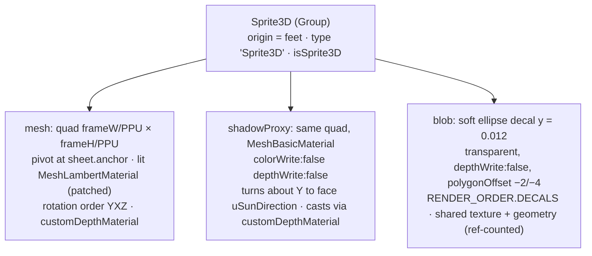

# Sprite module: Sprite3D, SpriteManager, Foliage, BlobBatch

> **Purpose.** This is the reference for how pixel-art sheets become HD-2D actors. `Sprite3D` is
> an animated billboard that is lit by the sun, the hemisphere and point lights without going
> black when backlit, casts a full-silhouette shadow toward the sun and has a soft contact-shadow
> blob. `SpriteManager` updates them all each frame. `Foliage` draws thousands of wind-swaying
> grass and flower billboards in one instanced draw call. `BlobBatch` draws many contact shadows
> in one call on big levels. The page covers options, animation rules, the lighting and shadow
> tricks, costs and pitfalls.
>
> **Audience:** gameplay and rendering programmers and AI agents working on characters, critters
> or ground detail.
>
> **Source of truth:** [`src/engine/sprite/Sprite3D.js`](../../../src/engine/sprite/Sprite3D.js),
> [`src/engine/sprite/SpriteManager.js`](../../../src/engine/sprite/SpriteManager.js),
> [`src/engine/sprite/Foliage.js`](../../../src/engine/sprite/Foliage.js),
> [`src/engine/sprite/BlobBatch.js`](../../../src/engine/sprite/BlobBatch.js).
> Contract: [ARCHITECTURE.md §4.4](../../../ARCHITECTURE.md).
>
> **Related:** [pixel.md](pixel.md) (the sheets) · [core.md](core.md) (CameraRig writes the yaw) ·
> [render.md](render.md) (`globalUniforms`) · [lighting.md](lighting.md) (`registerEmissive`, sun direction) ·
> [world.md](world.md) (`makeShadowOnly`) · [PERFORMANCE.md](../PERFORMANCE.md) ·
> [MODULE_NOTES.md](../../contracts/MODULE_NOTES.md#sprite_runtime)

---

## 1. At a glance

```js
import { Sprite3D, SpriteManager, createCharacterSheet } from './engine/index.js';

const sprites = new SpriteManager(engine.camera);
const hero = new Sprite3D(createCharacterSheet('traveler'), { normalUp: 0.6, roundness: 0.55 });
hero.position.set(12.5, tileMap.getHeight(12.5, 20.5), 20.5);   // origin = feet
engine.scene.add(hero);
sprites.add(hero);

// per frame, AFTER CameraRig.update (dx, dz = this frame's world-space movement):
const moving = dx * dx + dz * dz > 1e-8;
if (moving) hero.faceVector(dx, dz);  // camera-relative facing with hysteresis
hero.play(moving ? 'walk' : 'idle');  // base names resolve to walk_<direction>
sprites.update(dt);
```

**Sandbox:** [`sandbox/sprite_runtime.html`](../../../sandbox/sprite_runtime.html). Lit,
shadow-casting walkers in a meadow of 3,000 instanced grass tufts, plus every particle preset.

- `window.__sb`: `sheet`, `spriteManager`, `walkers`, `foliage`, `particles`, `emitters`,
  `setNight(n)`, `setYaw(deg)`, `setView`, `weather`, `freeze()`, `stats()`, `textureStats()`
  (proves that spawning sprites uploads no textures), and `testEmitterToggles()`,
  `testDirectionPhase()`, `testPlaySemantics()`.

```bash
npm run check -- --page=sandbox/sprite_runtime.html --query= --out=sprite_runtime --script=sandbox/sprite_runtime.actions.json
```

The `combatFx` variant (flash, glow, program keys, the glow render probe) is exercised by
[`sandbox/sprite_art.html?mode=combat`](../../../sandbox/sprite_art.html) with
`sandbox/sprite_art.combat.json` ([pixel.md §5.4](pixel.md#54-combat-sheets)).

---

## 2. Sprite3D

`class Sprite3D extends THREE.Group`, constructed as `new Sprite3D(sheet, opts?)`.

`sheet` is a SpriteSheet `{ texture, frameWidth, frameHeight, columns, rows, pixelsPerUnit?,
anchor?, animations }` (from `createCharacterSheet` / `createCreatureSheet`) **or** a
`createPropSprite` result. Prop results already carry `frameWidth`, `rows: 1` and `animations`,
so they are valid sheets as they are; the constructor still passes every sheet through
`spriteSheetFromProp`, which adapts older `{ texture, width, height, frames?, fps? }` objects and
returns real sheets unchanged.

### 2.1 Structure



Each sprite has a **per-instance texture clone** (`cloneSharedTexture`) animated through
`offset`/`repeat`. The clone shares the GPU upload of the sheet texture; spawning 10 sprites
adds 0 texture uploads.

### 2.2 Options

| Option | Default | Meaning |
| --- | --- | --- |
| `billboard` | `'cylindrical'` | `'cylindrical'` turns about Y to `globalUniforms.uCameraYaw` (all sprites share one orientation, no camera needed). `'spherical'` copies the camera rotation. `'none'` leaves the quad alone. |
| `tilt` | `0` | 0..1 fraction of the camera pitch the quad leans back (cylindrical; needs `camera` in `update`). |
| `castShadow` | `true` | Silhouette shadow (see `shadowMode`). |
| `shadowMode` | `'sunFacing'` | `'sunFacing'`: the proxy quad faces the sun, so the shadow is always a full silhouette. `'billboard'`: the visible quad itself casts. |
| `blobShadow` | `true` | Contact-shadow ellipse under the feet. |
| `lit` | `true` | `false` uses an unlit `MeshBasicMaterial`, where `emissive` becomes its colour. |
| `alphaTest` | `0.5` | |
| `emissive` / `emissiveIntensity` | `null` / `1` | Lit mode: emissive × the sprite's **own diffuse colours** (it glows with its texture, not as a flat silhouette). The demo uses `'#ffe9d2'` at 0.06 as a warm fill and drives it with `LightingSystem.registerEmissive(sprite.material, { day: 0.05, night: 0.03 })`. |
| `scale` | `1` | Group scale. |
| `renderOrder` | `0` | Of the visible quad. |
| `receiveShadow` *(extra)* | `true` | With a self-shadow-free lookup (§2.5). |
| `normalUp` *(extra)* | `0.55` | How far the shading normal leans from "toward camera" to world-up. The demo uses 0.6. |
| `wrap` *(extra)* | `0.6` | Wrap-diffuse amount: `(N·L + w)/(1 + w)`. |
| `roundness` *(extra)* | `0.8` | Horizontal normal bend across the frame, so a side lantern lights one side. The demo uses 0.55. |
| `ditherMode` *(extra)* | `'screen'` | Opacity dither in screen pixels, or `'texel'` for chunky pixel-art fades. |
| `blobSize` *(extra)* | `[max(0.7, w·0.52), max(0.36, w·0.26)]` | `[width, depth]` in world units (w = quad width). The demo's critters use per-kind sizes from `[0.35, 0.18]` (bird) to `[0.8, 0.34]` (dog) (`KINDS` in [`src/demo/Critters.js`](../../../src/demo/Critters.js)). |
| `blobOpacity` *(extra)* | `0.5` | |
| `tint` *(extra)* | `null` | Initial multiply colour. |
| `animation` / `direction` *(extra)* | `null` / `'down'` | Initial state. Without `animation`, an `idle` (or `idle_<dir>`) animation auto-plays if the sheet has one. |
| `combatFx` | `false` | Combat levels only ([COMBAT.md §10.1](../../contracts/COMBAT.md#101-sprite3d-option-combatfx-sprites)): the lit material becomes the `lumina-sprite3d-lit-fx-v1` variant with a per-sprite hit flash, selective glow and highlight (`setFlash` / `setGlow` / `setHighlight`, §2.7). Ignored with `lit: false`. |

The shared look for the demo's characters is `CHARACTER_SPRITE_OPTS` in
[`src/demo/config.js`](../../../src/demo/config.js).

### 2.3 Members

| Member | Description |
| --- | --- |
| `mesh`, `shadowProxy`, `blob` | Children (`blob` is `null` without `blobShadow`). |
| `material` | The visible material (lit Lambert or unlit Basic). Pass it to `registerEmissive`. |
| `texture` | The per-instance texture clone. |
| `sheet` | The (adapted) sheet. |
| `animation` | Current resolved name (`'walk_left'`), or `null` in manual-frame mode. |
| `direction` | `'down' \| 'left' \| 'right' \| 'up'`. |
| `playing`, `speed`, `finished` | Playback state. `finished` is set when a non-looping animation ends. |
| `billboard`, `tilt` | Live-editable. |
| `tint` | get/set: `material.color` (any `ColorRepresentation`). |
| `opacity` | 0..1 **ordered-dither fade** (works with alphaTest). Blob and shadow fade too. At 0 the mesh, blob and proxy are hidden. |
| `bodyOpacity` | 0..1 (default 1) — an extra dither fade of the **visible quad only**: the shadow (the sun-facing proxy, or the billboard caster) and the contact blob keep following `opacity`. The quad draws at `opacity × bodyOpacity`; the depth material reads its own uniform `uShadowDither` (= `opacity`, same GLSL and program key), so it is a uniform write — no recompile. A see-through without losing the ground contact: the combat boss dithers to 0.45 while the player stands behind it (`CombatSystem._seeThrough`, KNOWN_ISSUES COMBAT-16). With `shadowMode: 'billboard'` the quad stays in the scene (it casts the shadow). `clone()` copies it. |
| `flipX` | Mirror horizontally (negative repeat). |
| `castShadow`, `receiveShadow`, `shadowMode` | Live setters that keep the proxy and uniforms in sync. **Use these**, not the children's flags. |
| `frame` | Index within the current animation. |
| `flash`, `glow`, `highlight` | Read-only `[r, g, b, a]` copies of the combat flash / glow / highlight (zeros without `combatFx`). |
| `size` | `Vector2` world size of the quad (before group scale). |
| `onFrameChange(frameIndex, animationName)` | Optional callback. The demo uses it for footstep dust and sfx. |
| `onAnimationEnd(animationName)` | Optional callback for non-looping animations. |

| Method | Description |
| --- | --- |
| `play(name, { restart = false, speed, keepPhase = false } = {})` | See §2.4. Returns `this`. An unknown name is ignored with a `console.warn`, logged only for the **first** unknown name per sprite. |
| `setDirection(dir)` | Switches `walk_down` → `walk_left` **keeping the frame phase**. |
| `faceVector(dx, dz, yaw = globalUniforms.uCameraYaw.value)` | Picks the camera-relative direction for a world XZ movement, with 1.15× hysteresis so diagonals don't flicker. |
| `static directionFromVector(dx, dz, yaw = 0, current = 'down')` | The same, as a pure function. Screen-right = `dx·cos − dz·sin`, screen-down = `dx·sin + dz·cos`. |
| `setFrame(col, row)` | **Manual mode:** shows one cell, `animation = null`, `playing = false`. A later `play()` starts cleanly. |
| `update(dt, camera?)` | Advances the animation, orients the billboard (compensating the group's own Y rotation), turns the proxy toward the sun and turns the blob with the camera yaw. |
| `setFlash(r, g, b, a)` / `setGlow(r, g, b, a)` / `setHighlight(r, g, b, a)` | Combat hit flash, selective glow and highlight (§2.7). Uniform writes (safe every frame, never recompile); no-ops without `combatFx`. Return `this`. |
| `clone()` | A new Sprite3D from the same sheet and options, copying transform, tint, emissive, opacity, `bodyOpacity`, flip, shadow flags, animation and the combat flash / glow / highlight. Extra user children are not cloned. |
| `dispose()` | Removes itself from its parent and frees its geometry, materials and texture clone. Releases the shared blob resources. The sheet's image is **not** disposed. It does **not** unregister from `SpriteManager`, so call `manager.remove(sprite)` first. |

### 2.4 Animation rules

- **Name resolution** (cached per name and direction, so calling `play()` every frame is free):
  1. An exact key without a direction suffix (`'idle'` on a prop strip).
  2. `base_<direction>` (`'walk'` → `'walk_left'`).
  3. The **mirrored** opposite side if `left` or `right` is missing (`walk_left` drawn from
     `walk_right` with a flip).
  4. An exact suffixed key.
- Resolving a directional name also sets `direction`.
- `play(name)` with the name that is already playing (and not finished) is a **no-op**. It
  resumes if paused, and changes `speed` only when passed.
- Starting a *different* animation sets `speed = opts.speed ?? 1` (contract default) and resets
  the frame, unless `keepPhase` is set (for example walk → run on the same frames).
- A finished non-looping animation restarts on `play()`.
- Frame advance: `time += dt × speed`. Steps are `1/fps` (fps ≤ 0 means 8). Several steps can
  happen in one update. `onFrameChange` fires when the shown frame changes.

### 2.5 Lighting and shadows (`patchSpriteLighting`)

The lit material is a `MeshLambertMaterial` patched in `onBeforeCompile`. `Foliage` uses the
same patch.

- **Bent normal:** `normalize(mix(towardCamera, worldUp, normalUp))`, plus
  `(uv.x·2 − 1)·roundness` across the quad, replacing the normal after `normal_fragment_maps`.
- **Wrap diffuse:** `lights_lambert_pars_fragment` is replaced by `saturate((N·L + wrap)/(1 + wrap))`,
  so sprites never go black with the sun behind them and still pool warm lantern light.
- **Self-shadow-free receiving:** in `shadowmap_vertex`, the receiver position is pushed toward
  the sun just past the vertical plane through the sprite's origin that faces the sun (where its
  own proxy lives), so the proxy never shadows its own sprite. The skip along `uSunDirection` is
  `max(0, −d)/max(|sunXZ|, 0.25) × uShadowSkip + uShadowSkipBias`, where `d` is the vertex's
  signed distance from that plane, `uShadowSkip` is 1 only while the sprite casts in `sunFacing`
  mode (else 0) and the bias is 0.04.
- **Casting:** in `sunFacing` mode the proxy's `customDepthMaterial` (`MeshDepthMaterial`,
  RGBA packing, the same texture, alphaTest and dither) casts a full silhouette. The proxy draws
  nothing in the colour pass (`colorWrite: false`), but three still issues a draw call for it
  there (see §6).
- Program cache keys are `lumina-sprite3d-lit-v1`, `-unlit-v1` and `-depth-v1`, so all sprites
  share programs. `combatFx` sprites use `lumina-sprite3d-lit-fx-v1` for the visible material
  (§2.7); their depth material stays `-depth-v1`.

### 2.7 Combat flash, glow and highlight (`combatFx`)

`new Sprite3D(sheet, { ..., combatFx: true })` adds three `THREE.Vector4` uniforms, `uFlash`,
`uGlow` and `uHighlight` (default 0), to the sprite's uniforms before the lit material is created,
and patches the fragment shader on top of the regular lit patch:

- **Glow** — after the emissive patch: `if (diffuseColor.a < 0.98) totalEmissiveRadiance +=
  uGlow.rgb * uGlow.a * diffuseColor.rgb;`. Only **glow texels** — texels painted with alpha
  exactly 204 (0.8: they pass the 0.5 alpha test) — light up, in their own colour: the golem's
  magma cracks, core and crown embers, the bat's eyes and the shaman's staff gem
  ([pixel.md §5.5](pixel.md#55-enemy-sheets-createenemysheet)). HDR values above ~1.4 bloom.
- **Highlight** — after `opaque_fragment`, when `uHighlight.a > 0`: the lit colour `c` becomes
  `c + (c · uHighlight.rgb · k + uHighlight.rgb · 0.035) · uHighlight.a`, with
  `k = 1 − smoothstep(0.45, 1.2, luminance(c))`. It brightens and colours the texel's **own**
  shading, so the pose keeps its detail; bright texels (glow cracks, eyes, sunlit highlights) are
  spared so they do not bloom into a glare. The enemies' wind-up pulse (orange, 0.45 ↔ 0.9), the
  elite shimmer (gold, 0.12 ↔ 0.24) and the boss's hit flash (white, 0.6 / 0.3) use it
  (`Enemy._writeFlash`).
- **Flash** — then: `gl_FragColor.rgb = mix(gl_FragColor.rgb, uFlash.rgb, uFlash.a);` (linear HDR,
  before fog; tone mapping happens later in PostFX): a short silhouette flash — the hit flash of
  every enemy but the boss (white 0.85 / 0.4 for 2 + 2 frames), the player's hurt flash, the boss's
  death flash. A mix toward an HDR colour flattens a sprite whose linear colours are 0.05–0.3 into a
  pale silhouette, which is why the long wind-up pulse moved to the highlight (KNOWN_ISSUES
  COMBAT-03).

Without the option the shader source, the program key and the uniform set are exactly the plain
sprite's (checked by `sandbox/sprite_art.combat.json`), so peaceful levels compile the same
programs as before (Emberfall 57). The glow texels survive the canvas upload: the combat sandbox
renders the golem into a float target with its glow off and on and counts the texels that
brighten (255 for the golem, 0 for the slime, which has no glow texels).

### 2.6 Helpers exported with Sprite3D

| Export | Description |
| --- | --- |
| `spriteSheetFromProp(prop)` | Adapts a `{ texture, width, height, frames?, fps? }` prop result to a one-row SpriteSheet with a looping `idle`. It detects whether `width` is the frame or the whole strip. Objects that already have `frameWidth` are returned unchanged. |
| `patchSpriteLighting(shader, uniforms, { shadowCenter = 'modelMatrix[ 3 ].xyz' } = {})` | Applies the lighting patch to any Lambert shader inside `onBeforeCompile`. `uniforms` must contain `uNormalUp, uWrap, uRoundness, uShadowSkip, uShadowSkipBias`. `uSunDirection` is taken from `globalUniforms`. |
| `cloneSharedTexture(src)` | `texture.clone()` that restores `source.version`, so the clone does not re-upload the shared image. |
| `GLSL_BAYER4` | GLSL `float luminaBayer4(vec2 p)`, the 4×4 ordered-dither threshold. |

---

## 3. SpriteManager

```js
const manager = new SpriteManager(camera);   // camera handed to every sprite.update(dt, camera)
```

| Member | Description |
| --- | --- |
| `camera` | May be swapped at runtime. |
| `add(sprite)` → sprite | Anything with `update(dt, camera)`. Duplicates are ignored. |
| `remove(sprite)` → boolean | Does not dispose. |
| `sprites` | The **live** array. Do not mutate it. |
| `update(dt)` | Calls `sprite.update(dt, camera)` for all. Engine-system compatible (`name = 'SpriteManager'`). |
| `dispose({ disposeSprites = false } = {})` | Clears the registry, and optionally disposes the sprites. |

Register or update it **after** `CameraRig.update` in the frame. The demo calls
`rig.update → spriteManager.update → blobs.update` inside its game system.

---

## 4. Foliage

```js
import { Foliage, createPropSprite, RNG } from './engine/index.js';

const rng = new RNG(7);
const instances = [];
for (let i = 0; i < 500; i++) {
  const x = rng.range(0, 20), z = rng.range(0, 20);
  instances.push({ x, y: tileMap.getHeight(x, z), z, scale: rng.range(0.9, 1.1) });
}
const field = new Foliage({ sprite: createPropSprite('grass_tuft', { seed: 3 }), instances });
scene.add(field.object);     // one InstancedMesh = one draw call
```

| Option | Default | Meaning |
| --- | --- | --- |
| `sprite` | required | `{ texture, width, height, pixelsPerUnit?, anchor?, frames? }`, for example a `createPropSprite` result. With `frames > 1` each instance shows one frame of a horizontal strip. |
| `instances` | required | `{ x, y, z, scale?, tint?, frame? }[]` |
| `wind` | `1` | Per-field sway multiplier (live setter `wind`). |
| `castShadow` | `false` | Keep it off for grass. The depth pass billboards each tuft toward the **sun**, so when on, shadows are full silhouettes. |
| `receiveShadow` | `true` | |
| `alphaTest` | `0.5` | |
| `normalUp` / `wrap` / `roundness` | `0.8` / `0.5` / `0.25` | Lighting like Sprite3D; foliage shades almost like the ground under it. |
| `rootDarken` | `0.35` | Darkens the base of each tuft. |
| `randomFrames` | `false` | Pick a seeded random frame per instance when `frame` isn't given. |
| `variance` | `0.08` | Seeded per-instance brightness jitter. |
| `seed`, `name` | `1`, `'Foliage'` | |

- **Vertex shader:** each instance is rotated about Y by `uCameraYaw` around its root. Only the
  vertices above the anchor sway. The sway combines `uWind` direction × `uWindStrength` × `wind`,
  a travelling gust wave along the wind, and a per-instance flutter phase from a position hash.
  The top also dips slightly to preserve length. It is stateless, uniform-driven and costs no CPU
  per frame (`update()` is a no-op).
- **Members:** `object` (the `InstancedMesh`), `material`, `depthMaterial`, `texture`, `count`,
  and the live setters `castShadow` (**use this**, it syncs the self-shadow skip uniforms),
  `receiveShadow` and `wind`. `dispose()` frees everything, including the texture clone for
  multi-frame sprites.
- **Bounds** are computed from the instance centres plus the quad and sway margin, so frustum
  culling works per field.
- **Performance:** tested with 3,000 tufts in one draw call.

---

## 5. BlobBatch

On big levels a busy view held dozens of villagers and critters, each with its own blob draw
call. `BlobBatch` draws all adopted blobs with **one** instanced call.

```js
const blobs = new BlobBatch();                 // { capacity = 256 }
for (const s of actorSprites) blobs.adopt(s);  // the blob mesh stays in the sprite but leaves layer 0
if (blobs.mesh) scene.add(blobs.mesh);
// per frame, after the sprites updated:
blobs.update();
```

| Member | Description |
| --- | --- |
| `adopt(sprite)` → boolean | Takes over `sprite.blob`: `blob.layers.disable(0)`, so the camera no longer draws it. The first adopt creates `mesh`. Returns `false` if the sprite has no blob or is already adopted. |
| `release(sprite)` → boolean | Re-enables layer 0 on the sprite's blob. |
| `update()` | Copies each visible adopted blob's world matrix and opacity into the instance buffers. Hidden or faded-out blobs are skipped, and at most `capacity` are drawn. |
| `mesh` | The `InstancedMesh` (`frustumCulled = false`), using the blob's own colour, map, polygon offset, render order and fog, plus a per-instance alpha attribute. |
| `sprites`, `capacity`, `dispose()` | `dispose()` releases every sprite and frees the mesh. |

The demo uses it only when `world.batching` is on (levels larger than 64 tiles). The A/B pixel
difference is 0, and the worst Starfall Vale view dropped from 344 to about 300 draw calls
together with the particle cull.

---

## 6. Costs and budgets

- A `sunFacing` Sprite3D costs **3 colour-pass draws** (quad, proxy with colour writes off,
  blob) plus **1 shadow-pass draw**. three culls shadow casters with the main camera's layers,
  so the proxy can't simply be hidden from the colour pass. About 20 NPCs is roughly 80 draws.
- On big levels the demo calls `makeShadowOnly(sprite.shadowProxy, [lighting.sun])`
  (from `src/engine/world/ShadowCasters.js`), so the proxy is drawn only in the sun's shadow
  pass, and adopts every blob into a `BlobBatch`. The editor's 3D preview
  ([`ActorPreview.js`](../../../src/editor/viewport3d/ActorPreview.js)) makes the proxies
  shadow-only on **every** level, but doesn't use `BlobBatch`.
- Foliage: one draw per field (plus one shadow draw if `castShadow`).

## 7. Extension points

- **Custom billboards** can reuse `patchSpriteLighting` in their own `onBeforeCompile` to match
  the sprite look.
- **New animations** are just keys in `sheet.animations` (`{ frames: [{col,row}], fps, loop }`).
  Use `name_<direction>` for directional ones.
- **Prop strips as sprites:** `new Sprite3D(createPropSprite('campfire'), { emissive: '#ffb46b', castShadow: false })`.
- **Types:** the constructor takes a `SpriteSheet` or a `PropSheet` (a `createPropSprite` result,
  adapted by `spriteSheetFromProp`), both typedefs in `Sprite3D.js`; `direction` and
  `setDirection` use the four-name `Direction` union of `constants.js` — a hand-built sheet's
  `anchor` must be typed `[number, number]` (an untyped array literal widens to `number[]`). The
  `castShadow` / `receiveShadow` accessors override `Object3D` fields, which TypeScript cannot
  express: they carry the two `@ts-expect-error` lines of `Sprite3D.js`
  ([CONVENTIONS.md §3.1](../../development/CONVENTIONS.md#31-the-type-check)).

## 8. Gotchas

- **Update order:** `CameraRig.update` → `SpriteManager.update`. Otherwise billboards lag a frame
  while the camera rotates.
- **Keep sprite parents unrotated.** Only the sprite group's own rotation is compensated in
  cylindrical and spherical modes.
- **`dispose()` does not unregister** from `SpriteManager`. Remove first.
- **Removing a sprite inside its own callback** during `SpriteManager.update` can skip one other
  sprite that frame (the list is iterated live).
- **Self-shadow skip trade-off:** the receive lookup is pushed up to about half the frame width
  divided by the horizontal sun component toward the sun (≈1.1 units for 32 px frames at golden
  hour). A wall right next to a sprite on its sun side may fail to shadow part of it.
- **`opacity` is dithered, not blended.** It stays depth-correct and DOF-friendly, but it shows
  a 4×4 pattern.
- **Frames have no gutter** (see [pixel.md](pixel.md)). Sprite3D does no half-texel UV inset.
  No bleed is visible at gameplay zoom. The combat sheets keep a 1 px transparent margin in
  every combat column and monster frame.
- **`combatFx` is a separate program.** Mixing fx and plain sprites on one level compiles both
  lit variants; combat warms the fx variant at load (COMBAT.md §19).

## 9. History and decisions

- **Phase 1 audit fixes** (sprite runtime):
  - `play()` speed semantics now match the contract: a new animation resets `speed` to
    `opts.speed ?? 1`, and a finished one-shot restarts.
  - `setFrame()` is a clean manual mode. Before, a later `play()` lost the mirrored-fallback
    flip.
  - Spherical billboards compensate the group rotation.
  - `clone()` works; `Object3D#clone` used to throw without a sheet.
  - `spriteSheetFromProp` was added, so prop flame strips are accepted directly.
- **Phase 2 (Emberfall):**
  - Backlit characters at golden hour were fixed **from the demo side** with the existing
    options (`normalUp`, `wrap`, `roundness`, a small `emissive` fill driven by
    `registerEmissive`). This is now `CHARACTER_SPRITE_OPTS`.
  - `_resolve()` results are cached per name and direction, so calling `play()` every frame
    allocates nothing.
- **Combat (COMBAT.md §10.1):** the opt-in `combatFx` variant (`lumina-sprite3d-lit-fx-v1`) with
  per-sprite `uFlash` / `uGlow` replaced per-enemy materials or emissive writes (which
  `LightingSystem` rewrites every frame). Glow is keyed on texel alpha 204 instead of a second
  mask texture; the fallback (a glow-mask texture under `-fx-v2`) was not needed.
- **`bodyOpacity` (2026-09-28, KNOWN_ISSUES COMBAT-16):** the boss's see-through used `opacity`,
  which fades the shadow and the blob too, so the 4 u golem's shadow dithered away while the player
  stood behind it. The depth material now reads a second uniform (`uShadowDither`) that follows
  `opacity` alone; peaceful sprites keep both at the same value, so their look and programs are
  unchanged. The editor's enemy batch (`src/editor/viewport3d/SpriteBatch.js`) does not batch a
  sprite whose `opacity` or `bodyOpacity` is below 1 (KNOWN_ISSUES ED-26).
- **Phase 4 (Starfall Vale):**
  - `BlobBatch` was added. It gives a pixel-identical A/B result, and the worst zoomed-out town
    view went from 344 to ~300 draw calls (with the particle cull).
  - Sprite shadow proxies were made shadow-only through `makeShadowOnly`: in the game on big
    levels, in the editor on every level.
