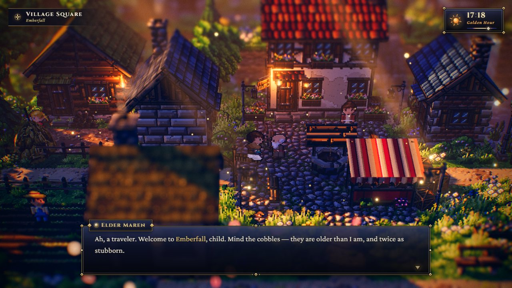
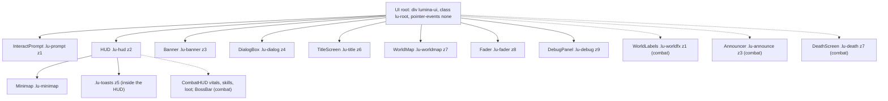
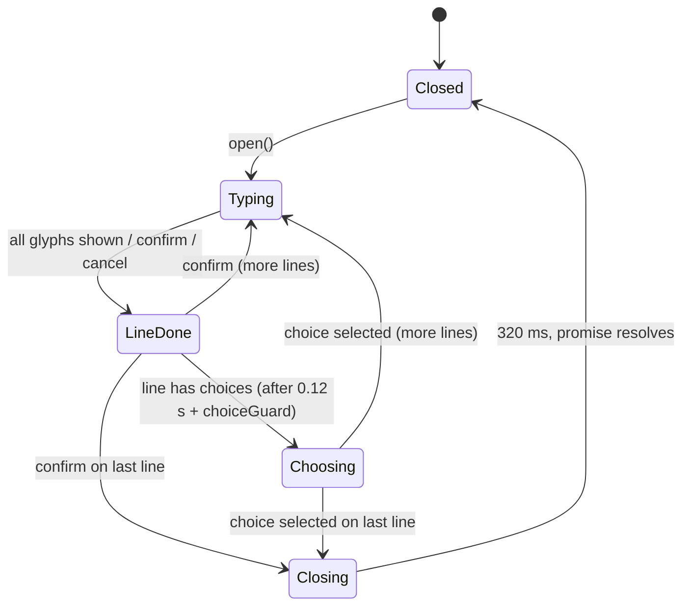
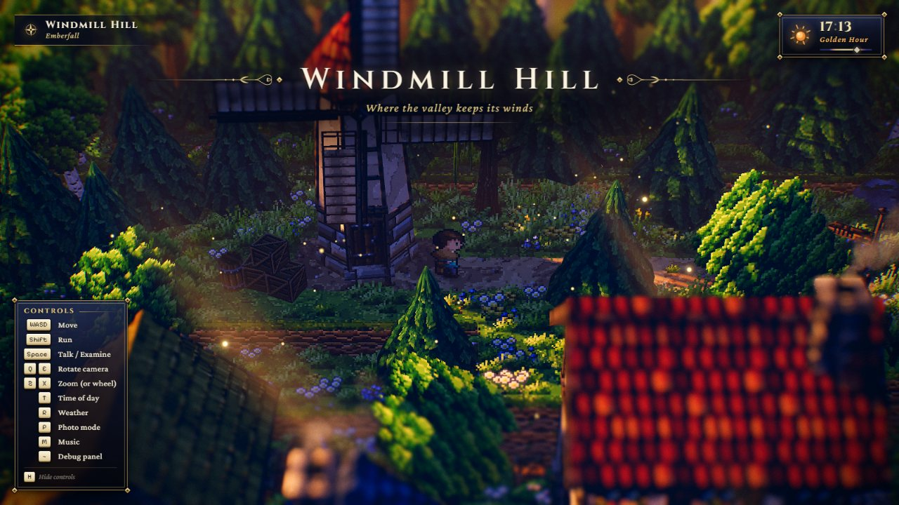
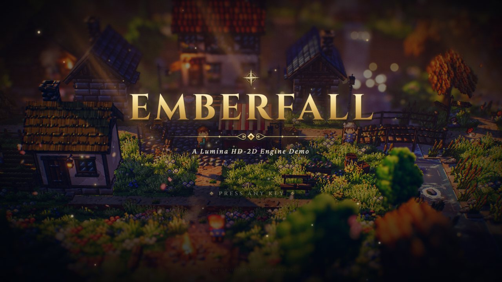
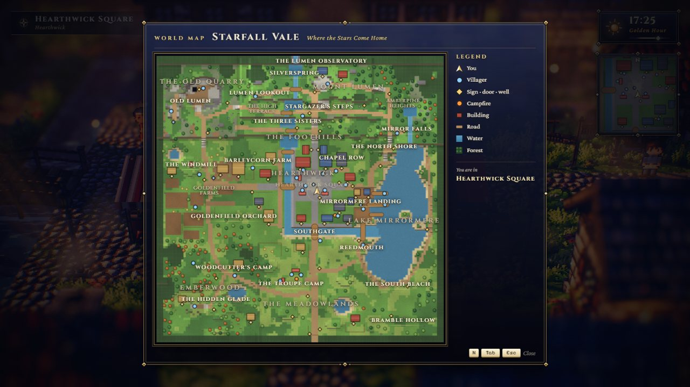

# UI module: overlay, dialog, HUD, maps, debug panel

> **Purpose.** This is the reference for Lumina's DOM overlay, the Octopath-style interface drawn over the 3D canvas. It covers the `UI` root and its components (dialog box, area banner, title screen, HUD clock/location/controls/toasts, interaction prompt, fader, minimap and world map, and the lil-gui debug panel with its stats overlay), the combat UI that combat levels add (vitals, skill bar, loot feed, boss bar, world labels, announcer, death screen), plus the `ui.css` design tokens and layering.
>
> **Audience:** Developers and AI agents who change the in-game interface, add HUD elements, or wire UI into a game loop or test page.
>
> **Source of truth:** [`UI.js`](../../../src/engine/ui/UI.js), [`DialogBox.js`](../../../src/engine/ui/DialogBox.js), [`Banner.js`](../../../src/engine/ui/Banner.js), [`TitleScreen.js`](../../../src/engine/ui/TitleScreen.js), [`HUD.js`](../../../src/engine/ui/HUD.js), [`Minimap.js`](../../../src/engine/ui/Minimap.js) (`Minimap`, `WorldMap`), [`InteractPrompt.js`](../../../src/engine/ui/InteractPrompt.js), [`Fader.js`](../../../src/engine/ui/Fader.js), [`DebugPanel.js`](../../../src/engine/ui/DebugPanel.js) (`DebugPanel`, `DebugStats`), the combat components [`CombatHUD.js`](../../../src/engine/ui/CombatHUD.js), [`BossBar.js`](../../../src/engine/ui/BossBar.js), [`WorldLabels.js`](../../../src/engine/ui/WorldLabels.js), [`Announcer.js`](../../../src/engine/ui/Announcer.js), [`DeathScreen.js`](../../../src/engine/ui/DeathScreen.js) and [`ui.css`](../../../src/engine/ui/ui.css). Game wiring: [`src/demo/Game.js`](../../../src/demo/Game.js) and [`src/demo/DebugControls.js`](../../../src/demo/DebugControls.js). If this page and the code disagree, the code is right.
>
> **Related:** [Module index](README.md) · [core (Input actions)](core.md) · [audio (sfx hooks)](audio.md) · [level (`LevelMap` for the maps)](level.md) · [Input and controls spec](../../specs/INPUT_AND_CONTROLS.md) · [Playing the game](../../user/PLAYING_THE_GAME.md) · [Visual design](../../design/VISUAL_DESIGN.md) · [Game architecture](../GAME.md) · binding contracts: [ARCHITECTURE.md §4.8](../../../ARCHITECTURE.md), [COMBAT.md §13](../../contracts/COMBAT.md) (combat UI) · builder notes: [MODULE_NOTES › ui / scalability](../../contracts/MODULE_NOTES.md)



*Captured before Phase 4: the current HUD also shows the minimap under the clock.*

---

## 1. Responsibilities

| Component | Member of `UI` | What it is |
| --- | --- | --- |
| `UI` | (root) | Builds `#lumina-ui.lu-root` over a container, creates every component, forwards per-frame updates and sets state classes (dialog open, title up, photo mode). |
| `DialogBox` | `ui.dialog` | Bottom-centre ornate panel with a speaker name plate, a typewriter with punctuation pauses, `{gold}` markup, a ▼ next indicator and an optional choice list. |
| `Banner` | `ui.banner` | Top-centre area title card with gold rules, scroll flourishes, a Cinzel title and an italic subtitle. |
| `TitleScreen` | `ui.title` | Full-screen title over the live scene: gold title with glow and sweep, drifting motes, divider, subtitle, blinking prompt and credit. Dismissed by any key, click/tap or gamepad button. |
| `HUD` | `ui.hud` | Location plate (top-left), clock with sun/moon icon and phase name (top-right), controls legend with keycaps (bottom-left), toasts (top-centre). |
| `Minimap` | `ui.minimap` | A gold-framed, north-up window onto a painted level map, under the clock (inside the HUD). |
| `WorldMap` | `ui.worldMap` | Full-screen map overlay with region names, markers, a legend and "You are in". |
| `InteractPrompt` | `ui.prompt` | A pixel-art speech bubble with a label and optional keycap, projected above a world point every frame. |
| `Fader` | `ui.fader` | Full-screen colour fades with timer-settled promises. |
| `DebugPanel` (+ `DebugStats`) | `ui.debug` (`ui.debug.stats`) | Themed lil-gui panel (hidden by default) and a stats overlay: fps, frame ms, draw calls, triangles, geometries, textures, programs, worst frame and an fps graph. |
| `CombatHUD`, `BossBar`, `WorldLabels`, `Announcer`, `DeathScreen` | `ui.combat.hud`, `.boss`, `.labels`, `.announcer`, `.death` | Combat levels only, created by `ui.enableCombat()` from the classes registered with `UI.useCombatUI()` (§10): vitals, skill bar, gold and loot feed; the boss bar; damage numbers, enemy bars and aggro pips, off-screen edge arrows, alerts and the lock-on reticle; level-up and results cards; the death screen. |



Dotted: created by `ui.enableCombat()` on combat levels only.

**Import side effects.** `UI.js` imports the `@fontsource` faces (Cinzel 400/600/700; Crimson Pro 400/500/600 and 400/600 italic; Pixelify Sans 400) and `ui.css`. Each component file also imports `ui.css`; the five combat components also import [`combat.css`](../../../src/engine/ui/combat.css) (the combat UI's rules, split out of `ui.css` on 2026-09-28). These are the only import-time side effects the engine allows ([ARCHITECTURE §2](../../../ARCHITECTURE.md)).

**Exports.** Everything is in the barrel [`src/engine/index.js`](../../../src/engine/index.js): `UI, DialogBox, Banner, TitleScreen, HUD, InteractPrompt, Fader, DebugPanel, Minimap, WorldMap` and `CombatHUD, BossBar, WorldLabels, Announcer, DeathScreen` (re-exported from their own files, by the barrel and by `UI.js`), `DebugStats`, and `DEFAULT_CONTROLS, TIME_PHASES, timePhase, createKeycaps` from `HUD.js`.

**Combat UI out of peaceful bundles** (KNOWN_ISSUES COMBAT-17). `UI.js` does **not** import the five combat components: `enableCombat()` gets the classes from its caller — registered once with `UI.useCombatUI({ CombatHUD, BossBar, WorldLabels, Announcer, DeathScreen })` (what `CombatSystem.load()` does; it imports them from their own files) or passed as `enableCombat(classes)` — and throws when neither holds them. `vite.config.js` marks the five modules (and the combat FX / sheet modules) side-effect free, so the re-exports put nothing into a chunk that does not use them: in the production build the combat UI and `combat.css` load only with the `CombatSystem` chunk.

**What `UI` deliberately does not do:** it binds **no keys** (the game maps actions to `ui.debug.toggle()`, `ui.hud.toggleHelp()`, photo mode and the map, so there are no double toggles); it does not update the minimap, the world map or the debug stats (the game calls them); and it does not pause gameplay. The game gates input itself: on `ui.dialog.isOpen`, its own `mode` (`'title'` until the title promise resolves, then `'play'`) and its own `mapOpen` flag. A page without such a mode can use `ui.title.visible` and `ui.worldMap.isOpen`.

---

## 2. `UI` (root)

```js
const ui = new UI(container = document.body);
```

| Member | Description |
| --- | --- |
| `root` | `div#lumina-ui.lu-root`: `position: fixed; inset: 0; z-index: 50; pointer-events: none`. Only the dialog window, the choice list, the title screen and the debug panel take the pointer (the world map and HUD are not clickable). With a container other than `body` it gets `.lu-root--contained` (absolute), and a `static` container is made `position: relative`. |
| `dialog`, `banner`, `title`, `hud`, `prompt`, `fader`, `debug`, `minimap`, `worldMap` | The components (§3–§9). |
| `static useCombatUI({ CombatHUD, BossBar, WorldLabels, Announcer, DeathScreen })` | Registers the combat UI classes once for `enableCombat()` (additive, 2026-09-28). `UI.js` does not import them itself, so a peaceful level's bundle does not hold them; `CombatSystem.load()` registers them. |
| `enableCombat(classes = registered)` → `ui.combat` | Creates the combat components (§10) from the registered classes (or `classes`, when given; throws when neither holds them), adds `.lu-root--combat` to the root, registers the HUD panels the world labels keep out of (`labels.setPanels`) and pre-renders the death screen (`death.prime`). Idempotent; peaceful levels never call it. |
| `combat` | `{ hud, boss, labels, announcer, death }` after `enableCombat()`, else `null`. |
| `container` | The element passed in. |
| `fontsReady` | A promise that resolves (and never rejects) once every UI font face has loaded or failed to load (`document.fonts.load` per face). Await it before the first title or dialog to avoid a fallback-font flash. |
| `visible` / `setVisible(bool)` | Photo mode: `.lu-root--hidden` fades out **everything except the fader**, including the debug panel. |
| `update(dt, { camera, input })` | See below. Call once per frame **after** the camera rig moved (the game uses the engine's `'lateUpdate'` event). |
| `dispose()` | Disposes every component and removes the root. |

`update` does this, in order:

1. `dialog.update(dt, input)`. The input is passed only while the overlay is visible and no title is showing.
2. It toggles `.lu-root--dialog` (while `dialog.isOpen`: the controls legend slides away, the prompt hides and the minimap dims to 0.55) and `.lu-root--title` (while `title.visible`: the HUD and prompt are hidden and the clock animations paused).
3. `prompt.update(camera)` when a camera is given, then `combat.labels.update(dt, camera)` on combat levels.
4. `hud.update(dt)` (a no-op hook; the HUD is event driven).

---

## 3. `DialogBox`

```js
const choice = await ui.dialog.open({ speaker, lines, portraitColor });
```

| Member | Description |
| --- | --- |
| `open({ speaker = '', lines = [], portraitColor })` → `Promise<number \| undefined>` | `lines` is a string or an array of strings and `{ speaker?, text, choices? }` objects (a choice list may have a single item; confirm then picks index 0). `speaker` is the default name plate for lines that don't set their own; `speaker: null` hides the plate for that line. `portraitColor` (any CSS colour) tints the gem on the name plate through `--lu-portrait`. The promise resolves **after the close animation** with the index of the last choice made, or `undefined`. A new `open()` interrupts the current dialog, whose promise resolves at once with its choice so far. An empty `lines` resolves `undefined` immediately. |
| `update(dt, input)` | Handles input first, so a press acts on what the player sees, then advances the typewriter and activates pending choices. Call it every frame (`UI.update` does). |
| `close()` | Starts the animated close (320 ms). |
| `skip()` | Reveals the current line at once. |
| `isOpen` | True from `open()` until the close animation **ends**. Gate talking and movement on it. |
| `isTyping`, `isChoosing` | The typewriter is running / the choice list is active. |
| `speed` | Characters per second. The default is `45`, the game sets `55`, and `≤ 0` means instant. |
| `inputGuard` | `0.15` s after `open()` during which confirm is ignored, so the Talk press doesn't skip text. |
| `choiceGuard` | `0.25` s after the choices appear during which input is ignored, so mashing confirm doesn't pick the pre-selected first choice. |
| `onChar(char)` | Called for every visible (non-space) character the typewriter reveals. Characters revealed at once by confirm, cancel, `skip()` or `speed ≤ 0` do not trigger it. The game plays a `blip` on every second call. |
| `onSound(name)` | `'open' \| 'close' \| 'confirm' \| 'blip'`, matching `AudioSystem.playSfx` names (`blip` is played only when the choice cursor actually moves). |
| `element`, `dispose()` | |

**Input.** It uses `input.consumeAction(name)` when the Input has it (the engine's does), so the press is swallowed for the rest of the frame, and falls back to `actionPressed` otherwise.

| Action | While typing | Line complete | Choices active |
| --- | --- | --- | --- |
| `confirm` (Space / Enter / F / gamepad A) or a click on the window | Completes the line | Next line, or close after the last | Selects the highlighted choice |
| `cancel` (Escape / Backspace / gamepad B) | Completes the line | — | — |
| `up` / `down` (W/S, arrows, D-pad) | — | — | Moves the cursor (wraps); on a one-item list nothing moves and no blip plays (the press is still consumed) |
| Mouse over / click a choice | — | — | Highlights / selects |

**Typewriter and markup.** `{word}` renders the word in gold (`.lu-hl`) and `\n` forces a line break. Each glyph is a `<span>` inside a per-word span, built once per line. Punctuation followed by a space, a line end or a closing quote/bracket adds a pause: `,` 0.12 s, `;` `:` 0.16 s, `—` 0.14 s, `.` `!` `?` 0.22 s, and `…` or `...` 0.42 s. A 0.06 s breath comes before the first character. After the text finishes, choices appear 0.12 s later.



---

## 4. `Banner`

```js
await ui.banner.show(title, subtitle = '', { duration = 3.5 });
```

- `duration` is the time from `show` until the fade-out **starts** (at least 1.2 s). The fade-out adds about 1.1 s (`FADE_OUT`).
- The promise resolves when the fade has finished, or when a new `show()` replaces the banner.
- `hide()` starts the fade now. `visible` is true while the banner is on screen, fade included.
- The flourish drop shadow is baked into the SVG and the fade-out drift is a transform. A CSS `filter` and a letter-spacing animation once caused a one-time stall of 215–264 ms on the first fade-out.

The game shows the level name when play starts (`duration 3.2`), and a region's banner the first time the player enters a `region` object whose `banner` subtitle is set (`duration 2.6`).



*Captured before Phase 4: the current game's legend also lists `N/Tab` World map, and the minimap sits under the clock.*

---

## 5. `TitleScreen`

```js
ui.title.onDismiss = (source) => audio.unlock();   // runs synchronously inside the user gesture
const how = await ui.title.show({ title = 'Lumina', subtitle = '', prompt = 'Press any key',
                                  credit = 'Lumina HD-2D Engine — three.js' });   // 'key' | 'pointer' | 'gamepad'
```

- The promise resolves **as soon as the player presses**. The screen then fades out over about 1.15 s, and `visible` stays true until the fade ends. `hide()` fades out and resolves a pending `show()` with `undefined`.
- Input is accepted after `armDelay` (0.45 s).
- The key listener runs in the capture phase with `stopPropagation`, so the dismissing key doesn't reach gameplay input. Modifier keys, `Tab`, `CapsLock`, `F5`, `F11` and `F12` are ignored, as are key repeats.
- A click or tap (`pointerdown`) also dismisses.
- Gamepads are polled with `requestAnimationFrame` only while the title is visible. Only a button newly pressed after the first poll counts.
- While hidden the element is `display: none` (`.is-gone`), so its motes and shimmer animations stop.

**Destinations** (optional, COMBAT.md §13.3): `show({ …, destinations: [{ value, label }], current })` adds a `◂ label ▸` row under the prompt with a small "← → Choose a level" hint.

- Only ArrowLeft / ArrowRight, d-pad left / right (standard-mapping buttons 14 / 15) and clicks on the ◂ / ▸ glyphs cycle the selection; the glyph clicks stop propagation, so they never dismiss. A / D and the sticks never cycle.
- While the selection differs from `current`, the label brightens and the prompt reads "Enter / A — Travel to <label>". Only a confirm (Enter, Space, pad A, or a click on the label) resolves with that selection.
- Any other key, button or click first resets the selection to `current`, then dismisses as usual.
- The getter `title.destination` returns the selected `value` (read it once the promise has resolved): `current` unless a changed selection was confirmed, `null` without `destinations`. A `current` missing from the list stays the result unless the player picks an entry.
- Without `destinations` the title is unchanged: no row is created (a row from an earlier call is removed) and there is no new key handling.

`TitleScreen.js` also exports `SVG_DIVIDER` (the ornamental divider, reused by the death screen).

The game shows it unless the URL has `?autostart=1`, with texts from the level's `environment.title` or defaults (see [LEVEL_FORMAT.md](../../specs/LEVEL_FORMAT.md)).



---

## 6. `HUD`

| Member | Description |
| --- | --- |
| `setTime(hours)` | Cheap every frame: the DOM changes only when the minute changes, with no string allocation for digits. It also sets the clock's `data-phase`, phase name, icon and track mark. |
| `setLocation(name, subtitle = '')` | The location plate. It is hidden when `name` is empty and replays a swap animation when the name changes. |
| `setControls([{ keys, label }])` | Replaces the legend. `keys` is a string (`'WASD'` → one cap, `'Q/E'` → two caps, `'Shift+Space'` → caps joined by `+`) or an array. A footer "`helpKey` Hide controls" is added when `helpKey` is set (default `'H'`; `''` hides the footer). The footer is built here, so set `helpKey` before calling `setControls`. |
| `showHelp(bool)`, `toggleHelp()` → new state, `helpVisible` | Legend visibility. The legend is also hidden by CSS on windows shorter than 540 px. |
| `toast(text, seconds = 2.5)` → element | A message at the top centre, shown for at least 0.5 s. At most `maxToasts` (3) are stacked; the oldest goes first. Toasts live inside the HUD, so they hide with it (and while the title is up). |
| `visible` (get/set) | Whole-HUD visibility (fades). |
| `clockElement`, `hours`, `phase`, `element` | The clock panel (the minimap and debug panel anchor below it), the last hour, and the phase id. |
| `locationElement`, `helpElement` | The location plate (`.lu-loc`) and the controls legend (`.lu-help`) — additive getters, used as the world labels' keep-out panels (§10). |
| `update()`, `dispose()` | |

**Clock phases** (`timePhase(h)`, `TIME_PHASES`): `night` (h < 4.75 or h ≥ 20.5), `dawn` (< 7), `morning` (< 11), `midday` (< 14), `afternoon` (< 16.5), `golden` "Golden Hour" (< 18.75), `dusk`. These are independent of `LightingSystem.phaseName`, which names the nearest palette keyframe.

**Helpers.** `DEFAULT_CONTROLS` is the legend used until `setControls` is called. It follows the engine's default bindings but is incomplete: it has no world-map (`N/Tab`) line and shows zoom as `Wheel` only. The game ([`Game.js`](../../../src/demo/Game.js) `CONTROLS`) replaces it with its own list, which includes `N/Tab` (World map) and `Z/X` (Zoom (or wheel)). `createKeycaps(keys)` returns a `span.lu-keys` of `kbd.lu-key` elements with labels such as `Backquote` → `~`, arrows → `↑↓←→`, `Escape` → `Esc` and the mouse buttons `Mouse0` / `Mouse1` / `Mouse2` → `LMB` / `MMB` / `RMB` (combat bindings).

---

## 7. `Minimap` and `WorldMap`

Both draw a map image made once per level by [`renderLevelMap(level)`](level.md#7-levelmapjs) (`{ canvas, pixelsPerTile, width, depth }`) plus live markers. The marker state object passed to `update` is shared by both:

```js
const markers = {
  player: { x, z },            // required
  facing: { x, z },            // arrow direction (default +Z)
  view: { x, z },              // camera look direction on the ground (minimap view wedge)
  npcs: [{ x, z }, …],         // villager dots
  markers: [{ x, z, kind: 'sign' | 'door' | 'well' | 'fire' | 'object'
                       | 'waystone' | 'chest' | 'boss' }, …],   // the last three: combat levels
  enemies: [{ x, z }, …],      // optional (combat levels): red #e0674f dots
};
```

`markers` and `enemies` are read on every draw, so a game may push into or splice those arrays at runtime (combat adds a chest's marker once it is discovered and removes the boss marker on defeat). Marker colours (`MARKER_COLORS`): fire `#ff9a3c` (a dot), door `#e9d49a`, sign / object `#f2d27a`, well `#9cc8f0`, waystone `#7fe3ff`, chest `#e8cf8a`, boss `#e0674f` (a larger diamond); the others are diamonds. Enemy dots are drawn after the villagers with an indexed loop (no per-frame allocation).

**`Minimap`**, created by `UI` inside the HUD and anchored below the clock:

| Member | Description |
| --- | --- |
| `setMap(map, { view })` | Sets or clears the map. `view` is the world units across the window (default `34`; the game passes 34). |
| `enabled` (get/set) | Whether the level allows the minimap. The game sets it to `environment.minimap !== false`. |
| `visible` | `!!map && enabled`. Hidden otherwise (`.is-empty`), and hidden by CSS on windows shorter than 560 px. |
| `update(markers)` | Redraws around the player: one `drawImage` of the cached map plus markers, the view wedge, the player arrow and a vignette. The window is clamped to the map, so near an edge the arrow moves off-centre instead of showing empty space. A map smaller than the window is centred on its edge colour. |

**`WorldMap`**, a full-screen overlay (z 7):

| Member | Description |
| --- | --- |
| `setMap(map, { title = '', subtitle = '', regions = [], combat = false })` | `regions` are `{ name, minX, maxX, minZ, maxZ }` (the game passes the level's `region` objects). Only the first region of each name gets a label. The frame takes the level's aspect ratio. `combat: true` adds the legend rows Enemy, Waystone and Chest after Campfire; without it the legend is exactly today's (the rows are created only with the flag and removed again without it). |
| `open()` / `close()` / `toggle()` → isOpen, `isOpen` | Fades in or out (0.35 s). `open()` does nothing without a map. The game (`Game.toggleMap`) opens it only while playing, outside a conversation and photo mode, freezes the player and camera input while it is open, toggles it with the `map` action (N, Tab, gamepad Back/View) and also closes it with `cancel` (Esc, Backspace, gamepad B). |
| `setRegion(name)` | The "You are in" line under the legend (hidden when empty). |
| `update(dt, markers)` | Redraws while open: the whole map, markers, villagers and a pulsing player ring and arrow. It re-lays the labels when the size changed. |

**Region label layout** (`_layoutLabels`, run on `open()` and when the frame size changed). A region that contains the centre of a smaller region is an **area** (lighter, airier type). Places are placed smallest first, then areas largest first. Each label tries its centre, then spots just above and below, two diagonal offsets, two spots further above and below, and then a 5 × 5 grid of spots inside its own region rect (centre excluded, nearest the centre first). A spot must stay inside the map frame and not overlap an already placed label. An area that still finds no spot is retried with `.lu-worldmap__label--compact` (smaller, two lines). A label with no free spot is hidden. A label over the player arrow fades to 0.3. The integration pass measured 3 of 30 names hidden on Starfall Vale; the review pass then added the compact retry.



---

## 8. `InteractPrompt`

| Member | Description |
| --- | --- |
| `show(target, label = 'Talk', { offsetY = 0, key })` | Safe to call every frame (the DOM changes only when the label changes). A `Vector3` is **copied**; an `Object3D` is **followed** through its world position. `offsetY` is in world units (a sprite's origin is its feet, so the game uses about 2.35, or 1.9 for children). `key` overrides `keyHint` for this prompt. Switching to another `Object3D` replays the pop-in. |
| `hide()` | Hides it and drops the in-view state, so a later `show()` never flashes at the old position. |
| `update(camera)` | Projects the anchor (it calls `camera.updateMatrixWorld()` itself) and hides the prompt behind the camera or off-screen. It writes the transform only when the rounded pixel position changes. |
| `keyHint` | A keycap before the label (the game sets `'Space'`). `null` for none. |
| `visible`, `element`, `dispose()` | |

The bubble is a 16×12 pixel-art SVG scaled by a whole number (`--lu-px = max(2, round(width / 430))`), so its pixels stay even.

---

## 9. `Fader`, `DebugPanel`, `DebugStats`

**`Fader`.** `fadeOut(seconds = 0.6, color = '#000')` and `fadeIn(seconds = 0.6)` return promises settled by a **timer** (duration + 20 ms), so they resolve even when `transitionend` never fires (a hidden tab or `display: none`). A new fade resolves the previous promise and continues from the current computed opacity. `set(opacity, color?)` jumps instantly. `opacity` is the target opacity and `busy` is true while fading. The fader stays visible in photo mode. The game fades to black around the innkeeper's rest (`fadeOut(1.0)` … `fadeIn(1.1)`).

**`DebugPanel`** (`new DebugPanel(parent, { anchor = null, title = 'Lumina · Debug' })`; `UI` anchors it to the clock):

| Member | Description |
| --- | --- |
| `gui` | A lil-gui `GUI` (width 292) themed by `ui.css`. |
| `addFolder(name)` | Returns a lil-gui folder. The game's folders are in [`src/demo/DebugControls.js`](../../../src/demo/DebugControls.js): Time & Weather, Post FX, Lighting, Camera, Atmosphere, Render. |
| `toggle()` → new state, `visible` (get/set) | Hidden by default. When shown it is placed 16 px below the anchor. The game toggles it on the `debug` action (`` ` `` or F1). |
| `syncListening()` | Pauses `listen()`ing controllers while hidden (they otherwise refresh every animation frame). Call it after adding listening controllers to a hidden panel. |
| `stats` | The `DebugStats` overlay. |

**`DebugStats.update(renderer, dt)`.** Call it once per frame **after all rendering** (the game uses `'afterRender'`). On the first call it sets `renderer.info.autoReset = false`, and after that it reads `render.calls`, `render.triangles`, `memory.geometries`, `memory.textures` and `programs.length` and calls `info.reset()` every frame, so multi-pass PostFX and shadow frames are counted in full. fps and frame ms are measured with `performance.now()` (not the engine's clamped, time-scaled dt; `dt` is only used where `performance` is missing) and refreshed every `interval` (0.25 s). "Worst" is the longest frame of the last interval. The fps graph is colour-coded (≥ 50, ≥ 30, lower). The DOM only updates while the panel is visible, but the counter reset happens every frame. Readable fields: `fps`, `frameMs`, `calls`, `triangles`.

---

## 10. Combat UI (combat levels only)

`ui.enableCombat()` ([COMBAT.md §13](../../contracts/COMBAT.md)) creates five components — from the classes registered with `UI.useCombatUI()` or passed to it (§2) — and returns them as `ui.combat = { hud, boss, labels, announcer, death }`; it also adds `.lu-root--combat` to the root, hands the world labels the HUD panels to keep out of (`labels.setPanels([location plate, clock, minimap, controls legend, vitals, skill bar, boss bar])`, a panel counting only while shown) and pre-renders the death screen (`death.prime(…)`). It is idempotent. Peaceful levels never call it, so none of these DOM nodes exist there (`ui.combat` stays `null`). `UI.update` calls `combat.labels.update(dt, camera)` right after `prompt.update(camera)`, and `UI.dispose` disposes the five components before the rest. Combat code writes the DOM only through these APIs.

| Component | Element (parent, z) | Placement at 1600 × 900 | Hidden by |
| --- | --- | --- | --- |
| `CombatHUD` vitals | `.lu-vitals` (in `.lu-hud`) | Top-left, under the location plate at a **fixed** offset (below) | Title, photo (with the HUD). Dimmed to 0.55 while a dialog is open and to 0.35 by `setCalm(true)` |
| `CombatHUD` skill bar | `.lu-skills` (in `.lu-hud`) | Bottom-right: 3 skill slots, the draught slot, the gold counter above | Title, photo, dialog |
| `CombatHUD` loot feed | `.lu-loot` (in `.lu-hud`) | Right edge above the skill bar, 8 pooled rows | Title, photo |
| `BossBar` | `.lu-bossbar` (in `.lu-hud`) | Bottom centre, `min(52vw, 60em)` wide | Title, photo, dialog |
| `WorldLabels` | `.lu-worldfx` (root child, z 1, inserted **before** the prompt) | World-anchored | Title, photo, dialog, death screen |
| `Announcer` | `.lu-announce` (root child, z 3) | Centred at 34vh (its own element, never the Banner) | Photo, death screen |
| `DeathScreen` | `.lu-death` (root child, z 7) | Full screen | — (not even photo mode) |

### `CombatHUD` (`ui.combat.hud`)

`new CombatHUD(hudElement, { anchor })`: `anchor` is the location plate (`.lu-loc`). Every setter can be called every frame; it writes the DOM only when a value changes (bar fills compare the fraction rounded to 1/1000, numbers compare integers, text goes through `nodeValue`).

| Member | Description |
| --- | --- |
| `setVitals({ hp, hpMax, mp, mpMax, sp, spMax, level, xp, xpNext, winded })` | `Lv N` in Cinzel; HP (`#f08a6a` → crimson) and MP (`#8fd0ff` → `#4f7fd8`) bars with a cream lag fill that drains 0.35 s after a loss, `hp/hpMax` and `mp/mpMax` in Pixelify (HP rounds up, so a sliver never shows 0); a thin gold SP bar that flashes over a red track while `winded`; a thin gold XP track along the bottom. HP at or below 25 % pulses its number (`.is-low`). |
| `configureSkills([{ id, label, keys, padKeys, icon }])` | Builds one slot per entry, in order: a `.lu-panel--simple` box with a vector icon (`'whirl'`, `'bolt'`, `'nova'`, `'draught'`), keycaps from `createKeycaps(keys)` and `createKeycaps(padKeys)` (both built once; `padKeys` defaults to `keys`) on its bottom edge (letter keycaps in the serif face: Pixelify's C read as O at this size), and the label under it (wrapping to two lines at most one slot pitch wide). The `'draught'` slot also shows the carried count (`×3`). |
| `onSlotPress` | `(index) => void` or null (additive). The slot boxes catch the pointer (`pointer-events: auto`, one delegated `pointerdown` listener; the context menu is suppressed on them), so a click on a slot never reaches the canvas as an attack; combat sets it to press the slot's skill / draught through the combat input (buffer, guards and refusals as for a key). |
| `setDevice('keyboard' \| 'gamepad')` | Shows every slot's `keys` or `padKeys` (one class on `.lu-skills`; `'mouse'` counts as keyboard). `device` reads it back. |
| `setSkill(i, { cooldown, seconds, locked, affordable })` | `cooldown` (remaining fraction) scales a dark veil with `scaleY`; `seconds` shows as a whole number while cooling down; the slot flashes gold once when it is ready again; `locked` greys the icon (grayscale, 20 %), `affordable: false` dims it. |
| `setPotions(n, max)`, `setGold(n)` | Draught count (green at the cap, the slot dims at 0); the gold counter (its coin pops when the value rises). |
| `setCalm(on)` | Dims the vitals to 35 % (combat calls it after 5 s calm at full HP / MP). |
| `refuse(i)` | A refused press on slot `i` (locked, cooling down, not enough MP, no draught): the slot shakes once with a red rim (two identical keyframes toggled, like the ready flash). Added at integration (COMBAT.md §27.1 I8). |
| `loot(text, kind)` | One feed row (`'gold'`, `'heart'`, `'mana'`, `'draught'`, `'upgrade'`, `'core'`: an icon and a tinted text). The newest row sits at the bottom; older rows slide up one row (`translate3d` through the `--i` custom property, transition 0.3 s); each row slides in and fades out over 3.4 s. The 9th row reuses the oldest. |
| `vitalsElement`, `skillsElement`, `dispose()` | (`skillsElement`: the `.lu-skills` bar, one of the world labels' keep-out panels.) |

**Fixed vitals offset.** The vitals sit at `plate top + the plate's two-line height`. `CombatHUD` measures it once in the constructor (called by `enableCombat()`) with an invisible copy of the plate holding two lines of text, and again only on a window `resize`. The value lands in `--lu-vitals-top`; the CSS fallback is `var(--lu-gap) + 3.1 × --lu-fs-md`. Region names, a missing subtitle, the plate's `is-empty` state and its swap animation therefore never move the vitals (the sandbox check measures the same top for all of them).

### `BossBar` (`ui.combat.boss`)

| Member | Description |
| --- | --- |
| `show({ name, epithet = '', phases = 1 })` | Slides the bar in at full HP and phase 1 (the lag fill snaps, so it never drains from the previous fight). The name sits on a Cinzel plate like the dialog's speaker plate, the epithet in italics, and `phases > 1` draws that many `.lu-gem` phase gems at the right. |
| `set(hpFrac, phase)` | Every frame; writes on change. The fill scales with `scaleX` over a cream lag fill (0.45 s delay, 0.7 s drain) and the track flashes briefly on each loss. Gems up to `phase` are lit; the current one breathes. |
| `hide()`, `visible`, `dispose()` | |

The bar has a double gold frame with diamond end caps and a soft dark band behind it, so it stays legible over lava, snow or grass.

### `WorldLabels` (`ui.combat.labels`)

World-anchored labels in one layer. They are DOM elements: 0 draw calls, crisp and not blurred by the DOF, but not depth-occluded (by design). Anchors are read **live**: `anchor(vec3, offsetY)`, `alert(vec3, offsetY)` and `reticle(vec3, offsetY)` keep the vector (not a copy) and add `offsetY` **world units** to its y every frame, like `InteractPrompt` and the enemy defs' `labelY`. The pixel art (bars, pips, alert, reticle, edge arrows) scales by the whole number `--lu-px = max(1, round(viewport height / 450))` (2 at 900 px, 3 at 1440 px), so it stays crisp.

| Member | Description |
| --- | --- |
| `number(x, y, z, text, kind = 'dmg')` | A floating number at a world point: Pixelify Sans 400 with a 2 px 8-way dark outline and a drop shadow (`--lu-num-outline`; legible on the bright caldera and over white hit flashes), rising about 24 px and fading over 0.8 s (CSS, wall clock), with a seeded ±12 px scatter (its own `RNG(0x6d6e)`, never the combat RNG). **Stacking:** a number spawned within 0.52 s of live numbers at the same anchor (±0.8 u) starts one line higher per earlier one (a crit's line is 1.5×) and alternates 18 px left / right, so a combo's hits and a hit's `Guard` no longer fuse ("2319"). Colours: `dmg` cream `#fff4dc`, `crit` gold `#ffd98a` at 1.5× with a pop, `hurt` `#f08a6a`, `heal` `#bfe58f`, `mp` `#8fd0ff`, `guard` `#d4cec2` (always the text `Guard`), `perfect` gold (always `Perfect!`, with the crit pop). Pool 40: the 41st reuses the oldest. Combat spawns enemy numbers above the HP bar (`labelY` + 0.4 u, elites + 0.3 more for the name plate). |
| `bar(slot)` → handle | Slots 0..31; the handle is persistent (the same object each call; an out-of-range slot gets a no-op handle). `anchor(vec3, offsetY)`, `set(frac, { elite, level, name, pip })`, `show()`, `hide()`; each returns the handle. The bar is pixel art 34 × 4 (a 1 px dark frame, a two-tone red fill, a cream lag fill that drains 0.3 s after a loss) anchored at its bottom centre. `elite: true` adds a gold frame and a `Lv N name` line above it (Pixelify at `--lu-fs-sm`, bright gold with a drop shadow). `pip: true` draws only a 4 × 4 px red diamond (inside a 1 px dark outline), the aggro pip for enemies hidden behind roofs or crowns. A slot that changes its anchor or is shown again snaps its lag fill instead of draining it. |
| `edge(slot)` → handle | Slots 0..7: `anchor(vec3, offsetY)`, `set({ windup })`, `show()`, `hide()`. A telegraph red-orange arrow on the viewport border, 24 px inside it, where the line from the screen centre to the anchor crosses that inset rectangle, rotated to point at the anchor. Anchors behind the camera use the lateral direction of their clip coordinates. While `windup` is true it pulses (scale and glow, 4 Hz). It hides itself while the anchor is inside the inset rectangle (combat assigns slots only to off-screen enemies). |
| `alert(vec3, offsetY)` | A pixel-art `!` that pops above the anchor and follows it for 0.8 s (pool 8; the oldest is reused). |
| `reticle(vec3 \| null, offsetY)` | The lock-on reticle: four mirrored pixel-art gold corners with diamonds that step in and out by one art pixel (0.9 s cycle), centred on the anchor. `null` hides it. |
| `update(dt, camera)` | Called by `UI.update`. One `camera.updateMatrixWorld()` and one view-projection multiply per frame, then each live label is projected with that matrix. |
| `setPanels(list)` | The HUD panels the labels keep out of (additive, 2026-09-28, KNOWN_ISSUES COMBAT-07): each an `HTMLElement` or `{ el, shown() }` (a panel counts only while `shown()` is true). `UI.enableCombat()` calls it. See **Keep-out** below. |
| `clear()` | Hides every number, bar, pip, edge arrow, alert and the reticle. |
| `liveNumbers`, `element`, `dispose()` | |

**Keep-out.** The label layer sits under the HUD, so a number, bar, pip, alert or the reticle that
would land under a shown panel moves to the nearest spot on screen clear of it (6 px gap), and an
edge arrow slides inward along its ray and keeps pointing at its enemy. Panels less than 48 px apart
count as one zone when their union box is at most 1.5 × their summed areas (plate + vitals ≈ 1.2 and
clock + minimap ≈ 1.1 merge; the legend and the boss bar, ≈ 3.1, do not — a merged box would push
labels in the open lower middle aside). Panel rects are measured only in a `ResizeObserver`
callback, re-armed by panel class / style changes, `transitionend` / `animationend` and viewport
resizes — never in the frame loop. The sandbox (`ui.html?combat=1`, `panelProbe()` /
`panelOverlaps()`) checks 0 overlaps with every panel shown and with the legend hidden, and ≤ 0.5 px
drift for labels in the open; in the game's boss fight numbers stay within 0.6 px of their anchors.

**Performance rules** (COMBAT.md §13.2), as implemented:

- Every element is created in the constructors: numbers 40, bars 32, edge arrows 8, alerts 8, loot rows 8. Nothing is created or removed while playing; the sandbox counts the same 381 / 32 / 95 nodes (world labels / loot / skills) before and after a full exercise.
- `translate3d` is written only when the rounded pixel (and, for edge arrows, the rounded angle) changes. Bars fill with `transform: scaleX()` over a lagging second fill.
- No layout reads in the frame loop: the viewport size comes from a `ResizeObserver` (`WorldLabels`) or a `resize` listener (the vitals offset). The sandbox counts 0 calls to `offset*` / `client*` / `getBoundingClientRect` / `getComputedStyle` during 1 s of combat UI frames.
- CSS animations restart by toggling between two identical keyframe names (`is-a` / `is-b`): no `void offsetWidth` per hit. `will-change` is set up front; no `filter` or `backdrop-filter` on moving layers. Icons are data-URI SVGs in custom properties (`--lu-ico-*`), not DOM.
- Measured in the sandbox (30 bars, 8 edge arrows, the reticle and 40 numbers live): `WorldLabels.update` 0.14 ms mean per frame with the panel keep-out (0.04 ms mean and 0.2 ms max before it) on the reference machine.

### `Announcer` (`ui.combat.announcer`)

`announce(title, sub = '', { duration = 2.4, kind = 'level', compact = false })` → `Promise`. `compact` (additive): a smaller card at 21vh instead of 34vh — combat passes it for a level-up while engaged, so the card does not cover the enemies ahead of the player. Announcements are **queued**: each starts when the previous one has ended, and its promise resolves when it has finished. `duration` is the whole time on screen including the fades (in 0.45 s, out 0.55 s; at least 1.2 s), on the wall clock. `kind: 'level'` is the level-up card (a Cinzel title with a soft dark band behind it and an italic gains line between two gold rules). `kind: 'results'` is the wider boss results card: a panel with the sub line in Pixelify. `visible` is true while one is on screen. `clear()` drops every queued announcement and hides the current one (their promises resolve at once); the combat `reset()` test hook calls it.

### `DeathScreen` (`ui.combat.death`)

`show({ title, subtitle = '', prompt = '', armDelay = 1.0 })` → `Promise<'key' | 'pointer' | 'gamepad' | undefined>`. The overlay uses the title screen's language (a Cinzel gold title with an ember glow, the ornamental divider, a subtitle and a blinking prompt) over a dark ember vignette, fading in with a CSS animation. Input is accepted after `armDelay`, when the prompt appears: a key (window capture-phase listener; modifier keys, `Tab`, `CapsLock`, `F5`, `F11`, `F12` and key repeats are ignored, and the dismissing key is `stopPropagation`ed so it does not also act in the game), a pointer press on the overlay, or a gamepad button (polled with `requestAnimationFrame`; only a button newly pressed after the first poll counts). Keys before `armDelay` are not captured. The screen stays up until `hide()` (the game fades to black first). A new `show()` or `hide()` resolves a pending promise with `undefined`. While it is shown, the root has `.lu-root--death`, which hides the world labels, the prompt, the announcer and the banner. `visible` is true from `show()` until `hide()`.

`prime({ title, subtitle, prompt })` (additive, 2026-09-28, KNOWN_ISSUES COMBAT-02) pre-renders the hidden screen: it shows it for 3 frames at opacity 0.004 (`.lu-death.is-prime`) with those texts — so the browser builds its styles, gradients and masks — then returns it to `display: none`; a `show()` during priming takes over. `primed` is true afterwards. `UI.enableCombat()` calls it with `'You Have Fallen'` / `'Press any key to rise at the camp'`. Unprimed, the first show cost two long frames (45–73 ms) and 4–6 ms of style / layout; primed, every frame of it stays at 16–18.7 ms.

---

## 11. `ui.css`: theming and layering

**Design tokens** on `.lu-root`:

| Token | Value / role |
| --- | --- |
| `--lu-gold`, `--lu-gold-hi`, `--lu-gold-pale`, `--lu-gold-lo` | `#c9a45c`, `#e8cf8a`, `#f4e3b3`, `#8c6a32` |
| `--lu-gold-line`, `--lu-gold-faint` | Border lines (outer and inner line of the double border). |
| `--lu-cream`, `--lu-cream-dim`, `--lu-cream-faint`, `--lu-ink` | Text colours (`#f3ead7`) and ink `#07080f`. |
| `--lu-panel-top/mid/bot` | Navy → black translucent panel gradient (`rgba(26, 34, 66, 0.86)` → `rgba(4, 5, 12, 0.93)`). |
| `--lu-serif`, `--lu-display`, `--lu-pixel` | Crimson Pro (body), Cinzel (titles), Pixelify Sans (small numerics). |
| `--lu-fs`, `--lu-fs-md`, `--lu-fs-sm`, `--lu-fs-xs` | `clamp(min, vw, max)` sizes: 17–36 px (1.45vw), 14–28 px (1.12vw), 12–23 px (0.92vw), 10–19 px (0.76vw), about 23 / 18 / 15 / 12 px at 1600 px wide. They scale with the width between roughly 1200 and 2500 px. |
| `--lu-gap`, `--lu-orn` | Distance to the screen edge and ornament diamond size. |
| `--lu-ease`, `--lu-ease-out`, `--lu-ease-in`, `--lu-text-shadow` | Motion and legibility. |
| `--lu-outline` | The 1 px 4-way dark text outline of the Pixelify numerals (combat numbers, vitals, counters). |
| `--lu-orn-corner`, `--lu-orn-mid`, `--lu-orn-side` | Data-URI SVG ornaments. |

**Shared classes:** `.lu-panel` is the ornate panel: gradient, a 1 px gold border, an inner second line (`::before`) and eight diamond ornaments (`::after`). `.lu-panel--simple` is the lighter variant. Other shared classes are `.lu-gem`, `.lu-keys`, `.lu-key`, `.lu-key--wide` and `.lu-key--sym`.

**Layering** inside `#lumina-ui` (the z-index values in the CSS are authoritative): prompt 1 · HUD 2 (minimap inside) · banner 3 · dialog 4 · toasts 5 · title 6 · world map 7 · fader 8 · debug 9. Combat levels add the world labels at 1 (before the prompt in the DOM, so the prompt paints over them), the vitals / skills / loot / boss bar inside the HUD, the announcer at 3 and the death screen at 7. The root itself is `z-index: 50` over the canvas. Note that `.lu-toasts` sits **inside** `.lu-hud`, which is positioned with `z-index: 2` and so forms its own stacking context: the toasts' `z-index: 5` only orders them within the HUD, and at root level they paint under the banner (3) and the dialog (4), despite the order listed in the `ui.css` header comment.

**State classes:** `.lu-root--hidden` (photo mode; the death screen is exempt), `.lu-root--dialog`, `.lu-root--title`, `.lu-root--contained`, `.lu-root--combat` (after `enableCombat()`), `.lu-death.is-prime` (the death screen while `prime()` renders it), `.lu-root--death` (while the death screen is up), and on components `is-open`, `is-closing`, `is-on`, `is-hidden`, `is-empty`, `is-gone` and `is-leaving`.

**Responsive and accessibility:**

- `.lu-help` is hidden below 540 px of height and `.lu-minimap` below 560 px.
- The world map drops its legend below 900 px of width.
- The debug panel is scaled with `--lu-k` 1.18 at widths of 1880 px and more, and 1.4 at 2300 px and more.
- `prefers-reduced-motion: reduce` shortens every UI CSS animation to 0.01 ms and a single iteration (transitions are unchanged).
- The dialog has `role="dialog"`, and the text and banner are `aria-live="polite"`.

---

## 12. How the game wires it

```js
// src/demo/Game.js (condensed)
const ui = new UI(document.body);
ui.hud.setControls(CONTROLS);  ui.hud.setLocation(level.name, level.subtitle);  ui.hud.showHelp(false);
ui.prompt.keyHint = 'Space';
ui.dialog.speed = 55;
ui.dialog.onSound = (name) => audio.playSfx(name, { volume: 0.7 });
engine.events.on('lateUpdate', (dt) => ui.update(dt, { camera, input: engine.input }));   // after the rig
engine.events.on('afterRender', (dt) => ui.debug.stats.update(renderer, dt));
// maps (renderLevelMap), then per frame in play: ui.minimap.update(m); if (mapOpen) ui.worldMap.update(dt, m)
// keys: debug → ui.debug.toggle(), help → ui.hud.toggleHelp(), map → toggleMap() (worldMap.open/close),
// photo → a toast, then ui.setVisible(false) 1.2 s later (ui.setVisible(true) on return)
// every frame: ui.hud.setTime(lighting.timeOfDay)
```

Title flow: `ui.title.onDismiss = () => audio.unlock()`, then `await ui.title.show({...})`, then `ui.banner.show(level.name, level.subtitle, { duration: 3.2 })` and `ui.hud.showHelp(true)`.

---

## 13. Extension points

| You want to… | Do this |
| --- | --- |
| A new HUD element | Add a component class taking `(parent)`, build its DOM in the constructor, use `.lu-panel` and the tokens, give it a `z-index` in the documented layer order, create it in `UI`'s constructor and add it to `dispose()`. If it needs per-frame work, either forward it from `UI.update` or let the game call it (the maps do the latter). |
| Restyle | Change tokens on `.lu-root` first. Component rules are namespaced `lu-<component>__<part>`. |
| Another dialog sound or effect | Use the `onSound` / `onChar` hooks rather than editing `DialogBox`. |
| Rebind keys | Change the game's action checks and the Input bindings ([INPUT_AND_CONTROLS.md](../../specs/INPUT_AND_CONTROLS.md)); UI has no key handling except the title's "any key". Update the controls legend (`setControls`). |
| Debug controls | `ui.debug.addFolder('My system')` → lil-gui controllers. Call `syncListening()` after adding `.listen()` controllers while hidden. |

---

## 14. Example: the UI in a sandbox page

```js
import { UI } from '../src/engine/ui/UI.js';   // imports CSS and fonts: run it through Vite
// assumes a three.js renderer, scene, camera and an NPC sprite (Object3D, origin at the feet) already exist

const ui = new UI(document.body);
await ui.fontsReady;
ui.title.onDismiss = () => { /* unlock audio here */ };
await ui.title.show({ title: 'My Village', subtitle: 'A Lumina demo' });
ui.banner.show('Village Square', 'Where the roads meet');
ui.hud.setLocation('Village Square', 'My Village');
ui.prompt.show(npcSprite, 'Talk', { offsetY: 2.35 });

// a minimal input object: anything with actionPressed(name) (consumeAction optional)
const pressed = new Set();
const KEYS = { Space: 'confirm', ArrowUp: 'up', ArrowDown: 'down' };
addEventListener('keydown', (e) => { if (KEYS[e.code]) pressed.add(KEYS[e.code]); });
const input = { actionPressed: (n) => pressed.has(n) };

const answer = ui.dialog.open({ speaker: 'Mira', lines: ['Welcome to {My Village}!', { text: 'Tea?', choices: ['Yes', 'No'] }] });
renderer.setAnimationLoop(() => {
  renderer.render(scene, camera);
  ui.update(1 / 60, { camera, input });   // dialog input, prompt projection
  pressed.clear();                        // one press = one frame
  ui.debug.stats.update(renderer);        // after all rendering
});
console.log(await answer);   // 0 or 1: the index of the last choice made (resolves after the close animation)
```

`sandbox/ui.js` does the same with a local stub input (`StubInput`) and keyboard shortcuts.

---

## 15. Gotchas

1. **Gate gameplay on UI state.** `dialog.isOpen` stays true through the 320 ms close animation, `title.visible` stays true through the 1.15 s fade, and while a dialog is open the dialog consumes W/S/arrows only when a choice list is active. The game must freeze movement and talk checks itself.
2. **Input can leak around the title.** A key pressed during the 0.45 s arm delay reaches Input, and a gamepad button that dismisses the title is also seen by Input's own polling. Ignore gameplay input while the title is up (the game does it through its `mode`, which stays `'title'` until the title promise resolves; elsewhere use `ui.title.visible`).
3. **Call `ui.update` after the camera moved**, or the prompt lags a frame.
4. **Call `debug.stats.update` every frame.** It turns off `renderer.info.autoReset` on the first call. Calling it only sometimes makes the counters accumulate between calls, and every other `renderer.info` reader sees the manual reset.
5. **Only the game toggles.** UI binds no keys; binding debug/help/photo in two places cancels out.
6. **`WorldMap.open()` needs a map** (`setMap` first). The minimap needs `enabled` and a map.
7. **Debug panel overlap.** It has a fixed pixel width (scaled only at 1880 and 2300 px), so at 1280×720 it overlaps the right part of an open dialog. This is accepted for a dev tool.
8. **Arrow keycap glyphs.** Crimson Pro's latin subset lacks U+2190 and U+2192, so the ← and → keycaps fall back to Georgia (cosmetic).
9. **No backdrop blur on the dialog.** `backdrop-filter` inside an element whose opacity animates switches on abruptly when the fade ends, so the panel is more opaque instead.
10. **Continuous CSS animations** (▼ bob, choice cursor, prompt dots, clock rays, title motes and shimmer) cost a little every frame. The title's are stopped by `display: none` when hidden.

---

## 16. Sandbox pages and checks

| Page | What it shows | Hooks / scripts |
| --- | --- | --- |
| [`sandbox/ui.html`](../../../sandbox/ui.html) | A small golden-hour diorama in raw three.js with every UI component. Keys (bound in the page's own `StubInput`): any key dismisses the title · Space / Enter / F talk/advance · ↑/↓ or W/S choices · `` ` `` or F1 debug · H help · P photo mode · T advance time · B banner · G toast · V fade (the file's header comment says F, but F is a confirm key; the binding is `KeyV`). | `window.__ui` (the `UI`), `window.__sandbox` (`startDialog`, `setTime(h)`, `showDebug(v)`, `skipIntro()`, `results`, `dispose()`). Script: `ui.actions.json` (choice index, onChar, fader promises, click-to-advance, title pointer dismissal). |
| [`sandbox/ui.html?combat=1`](../../../sandbox/ui.html) | The same diorama plus the combat UI: 30 enemy cubes (bars, pips, elites), a painted fake minimap with enemies, waystone, chest and boss markers, the world map's combat legend, and the title with the destination row. Keys: J numbers, K damage, U casts Whirl Slash. | `window.__sandbox.combat` (`setup`, `numbers(n)`, `bars(n, pips)`, `hitBar`, `edges(n)`, `edgeBoxes`, `reticle(i)`, `alerts`, `damage`, `heal`, `cast`, `unlock`, `drink`, `addGold`, `loot`, `device`, `boss`, `bossHit`, `announce`, `death`, `vitalsTop`, `titleCase`, `installFakePad`, `padPress`, `nodes`, `perf(frames)`, `layoutReads(ms)`). Script: `ui.combat.actions.json`: every title case (D then W keeps `current`; ArrowRight + Enter travels; ArrowRight + W resets and dismisses; wrap-around; glyph and label clicks; a click elsewhere resets; pad d-pad + A travels, d-pad + B resets; no row without destinations), vitals fixed while the plate changes, 40 numbers, 30 bars with 10 pips, lag fills, 8 edge arrows on the inset border, loot, skills and `setDevice`, boss bar, the announcer queue with a results card, dialog / photo hiding, the death screen by key, pointer and pad, update cost, 0 layout reads, pools that do not grow. |

```bash
npm run check -- --page=sandbox/ui.html --out=ui --script=sandbox/ui.actions.json
npm run check -- --page=sandbox/ui.html --out=ui_1280 --width=1280 --height=720
npm run check -- --page=sandbox/ui.html --query=combat=1 --out=ui_combat --script=sandbox/ui.combat.actions.json
```

To capture the world map in the real game, save this action script and run `npm run check -- --page=index.html --query="level=starfall-vale&autostart=1" --out=sv_map --script=<path>`:

```json
[
  { "eval": "window.__game.map(true)" },
  { "wait": 800 },
  { "shot": "map" }
]
```

The builder verified the sandbox with 0 page errors, console errors, warnings and failed requests at 1280×720, 1600×900 and 2560×1440.

---

## 17. History and decisions

- **Phase 1.** Built against [ARCHITECTURE §4.8](../../../ARCHITECTURE.md). Additions beyond the contract: component constructors take `(parent)`, `fontsReady`, the `onSound` hook, `TitleScreen.onDismiss` and `credit`, `HUD` helpers and `DebugStats`. The title promise resolves on the press (not after the fade), and `Banner` `duration` counts to the start of the fade.
- **Phase 2 (Emberfall review).** The first banner fade-out stalled for 215–264 ms. It was fixed by baking the flourish shadow into the SVG, adding `will-change`, and animating a transform instead of letter-spacing.
- **Combat (Cinderwatch Pass).** `ui.enableCombat()` and the five combat components (§10) per [COMBAT.md §13](../../contracts/COMBAT.md); `Mouse0/1/2` keycaps; enemy dots, waystone / chest / boss markers and the combat legend on the maps; the title's destination row. Callers that do not pass the new options see no change (the Emberfall HUD, the world-map legend and the plain UI sandbox were compared before and after). Interpretations of the contract: `offsetY` is in world units; the world-art scale `--lu-px` follows the viewport height; an `announce` duration includes its fades; `show()` / `hide()` resolve a pending death-screen promise with `undefined`; `.lu-root--death` hides the labels, prompt, announcer and banner under the death screen.
- **Combat known-issues pass (2026-09-28).** `DeathScreen.prime()` pre-renders the death screen at load (COMBAT-02); `WorldLabels.setPanels()` keeps numbers, bars, pips, alerts, the reticle and edge arrows out of the HUD panels (COMBAT-07; a first version merged every panel pair under 48 px apart, so the legend + boss-bar box pushed labels in the open lower middle aside in the boss fight — merges now need a compact union); `UI.useCombatUI()` and the split into `combat.css` keep the combat UI out of peaceful bundles (COMBAT-17). A first version made `enableCombat(classes)` require the classes (a contract change); the review restored the no-argument call through the registry and the `UI.js` re-exports, so the change is additive. New getters `HUD.locationElement` / `helpElement`, `CombatHUD.skillsElement`, `DeathScreen.primed`.
- **Phase 4 (Starfall Vale).** `Minimap` and `WorldMap` were added, with the `map` input action (N, Tab, gamepad Back; photo mode moved to the right-stick click). Review passes added the edge clamp of the minimap window, label fallback spots inside region rects, compact area labels, fading labels over the player arrow, a fixed-width legend column and `DebugPanel.syncListening()`.

See [PROJECT_HISTORY.md](../../history/PROJECT_HISTORY.md) and [DECISIONS.md](../../history/DECISIONS.md).
