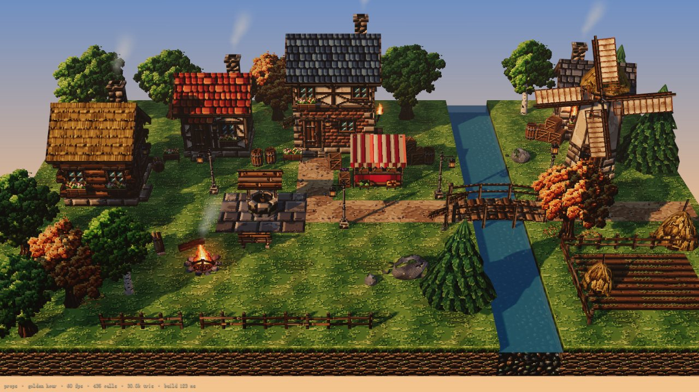
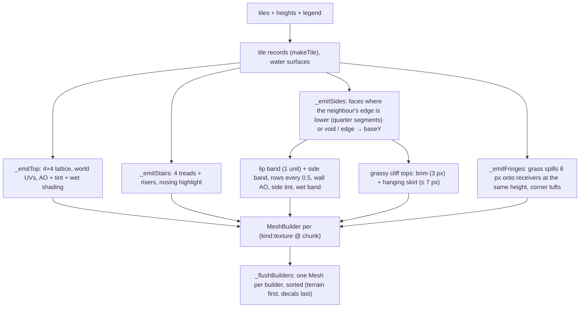
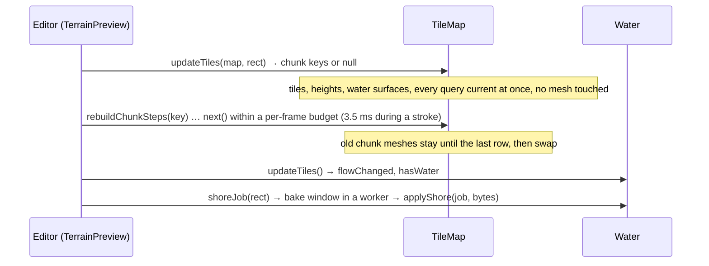
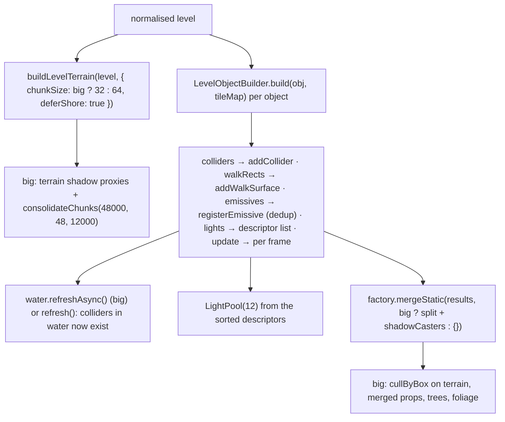
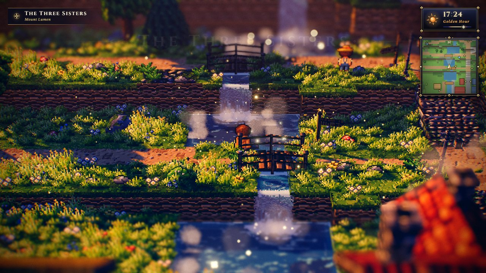

# World module: TileMap, Water, PropFactory, batching helpers

> **Purpose.** This is the reference for everything that makes up the diorama's ground and furniture. It covers the blocky multi-level terrain (`TileMap`) with its gameplay queries and incremental rebuilds, the pixel-art water and waterfalls (`Water`, `WaterShore`, `shoreWorker`, `createWaterfall`), the procedural props (`PropFactory` and the `props/*` builders, including `MeshBuilder` and `mergeStatic`), and the big-level batching helpers (`SpatialSplit`, `ShadowCasters`).
>
> **Audience:** Engine developers and AI agents who add tile features, props or water behaviour, or who tune draw calls. Also integrators who wire prop results into a scene.
>
> **Source of truth:** [`TileMap.js`](../../../src/engine/world/TileMap.js), [`Water.js`](../../../src/engine/world/Water.js), [`WaterShore.js`](../../../src/engine/world/WaterShore.js), [`shoreWorker.js`](../../../src/engine/world/shoreWorker.js), [`Props.js`](../../../src/engine/world/Props.js), [`props/*.js`](../../../src/engine/world/props/), [`SpatialSplit.js`](../../../src/engine/world/SpatialSplit.js) and [`ShadowCasters.js`](../../../src/engine/world/ShadowCasters.js). Game wiring: [`src/demo/World.js`](../../../src/demo/World.js). If this page and the code disagree, the code is right.
>
> **Related:** [Module index](README.md) · [pixel (TextureLibrary)](pixel.md) · [lighting](lighting.md) · [level (format → TileMap input, `ObjectBuilder`)](level.md) · [fx (Particles for emitter descriptors)](fx.md) · [Level format spec](../../specs/LEVEL_FORMAT.md) · [Object catalog](../../specs/OBJECT_CATALOG.md) · [Performance](../PERFORMANCE.md) · [Game architecture](../GAME.md) · [Editor architecture](../EDITOR.md) · binding contracts: [ARCHITECTURE.md §4.7](../../../ARCHITECTURE.md), [LEVEL_EDITOR.md §3, §5, §9](../../contracts/LEVEL_EDITOR.md) · builder notes: [MODULE_NOTES › terrain / props / scalability](../../contracts/MODULE_NOTES.md)



---

## 1. Responsibilities

| File | Main exports | Owns |
| --- | --- | --- |
| `TileMap.js` | `TileMap`, `ORGANIC_TOPS`, `GRASS_TOPS`, `FRINGE_RECEIVERS`, `FRINGE_PRIORITY`, `paintDecalMask` | Terrain geometry (tops, 4-step stairs, cliff faces, baked AO and tint, grass fringes, brims and skirts, merged per material and chunk). Also height, walkability and water queries, circle movement with sliding, colliders with a spatial grid, walk surfaces (bridge decks) and incremental rebuilds for the editor. |
| `Water.js` | `Water`, `createWaterfall`, `waterfallDir` | One lit, fogged water mesh over every water tile, with a baked shore/depth/flow texture. Waterfalls with a foam pool and a mist emitter spec; the one facing → direction table every waterfall reader shares. |
| `WaterShore.js` | `bakeShore` | The shore bake as a pure function of typed arrays (no three.js), so it runs on the main thread or in a worker. |
| `shoreWorker.js` | (worker) | Runs `bakeShore` off the main thread for `Water.refreshAsync()`. (The editor has its own copy, [`src/editor/viewport3d/shoreWorker.js`](../../../src/editor/viewport3d/shoreWorker.js), for windowed re-bakes.) |
| `Props.js` | `PropFactory` | Procedural diorama props, each returning a `PropResult`. `mergeStatic` batches static meshes. |
| `props/MeshBuilder.js` | `MeshBuilder`, `trs` | Low-poly geometry builder with world-space UVs at 16 px/unit, merged per material. |
| `props/Wind.js` | `applyWind`, `createWindDepthMaterial` | Wind sway and camera/sun-facing foliage cards (shader patches). |
| `props/Flame.js` | `createFlame`, `createFlameMaterial`, `createGlowMaterial` | Pixel flame billboards and additive glow cards. |
| `props/PropTextures.js` | `PropTextureSet` | Prop textures not in the library: `birch`, `produce`, `sail`, `leaf_litter`, `ash`, `boulder`, `boulder_moss`. |
| `props/House.js`, `Trees.js`, `LightProps.js`, `Structures.js`, `SmallProps.js`, `Details.js` | `build*` functions | One builder per prop family (called by `PropFactory`). |
| `SpatialSplit.js` | `kdSplit`, `triangleCount`, `cullByBox` | Spatially compact batching and box culling for big levels. |
| `ShadowCasters.js` | `buildShadowCasters`, `isProxyCaster`, `makeShadowOnly`, `isShadowFrustum` | Shadow-only proxy meshes for big levels. |

Only `TileMap` (and its constants and `paintDecalMask`), `Water`, `createWaterfall`, `PropFactory`, `MeshBuilder`, `trs`, `applyWind`, `createWindDepthMaterial`, the flame functions and `PropTextureSet` are re-exported from the barrel [`src/engine/index.js`](../../../src/engine/index.js). Import `SpatialSplit`, `ShadowCasters`, `WaterShore`, `waterfallDir` and the `props/*` builders by path. Everything here needs a browser in practice: `TextureLibrary` paints through a DOM canvas.

**Conventions** (from [ARCHITECTURE §2](../../../ARCHITECTURE.md)): Y is up. Tile `(i, j)` covers `x ∈ [i, i+1]`, `z ∈ [j, j+1]`. Rows run toward +Z. World height = level × `LEVEL_HEIGHT` (0.5). Textures are 16 texels per world unit (`PPU`). All randomness is seeded (`hash2`, `fbm2`, `RNG`), so a map rebuilds identically.

---

## 2. `TileMap`

### 2.1 Input: the map object

`TileMap` takes the "contract map" (ARCHITECTURE §4.7). A level produces it with [`toTileMapInput(level)`](level.md#3-levelformatjs).

```js
{
  name: 'Emberfall',                 // also seeds the terrain variation (hashString(name))
  legend: { g: { top: 'grass', side: 'cliff', lip: 'grass_side', walkable: true }, … },
  tiles:   ['gggg..cc', …],          // one string per row (z), one char per tile (x)
  heights: ['11112222', …],          // '0'-'9' → 0-9, 'a'-'z' → 10-35 ('A'-'Z' also accepted)
  waterLevel: 0.35,                  // global water surface (world Y); default 0.35
}
```

A legend character missing from the legend is treated as void, with one console warning per character. A space `' '` is void silently. Width is the longest row.

**Legend entry fields** (the full tile palette is in [LEVEL_FORMAT.md](../../specs/LEVEL_FORMAT.md)):

| Field | Meaning |
| --- | --- |
| `top` | Texture of the top surface (a [TextureLibrary](pixel.md) name). |
| `side` | Texture of vertical faces below the lip band. Defaults to `lip`, then `top`. |
| `lip` | Texture of the top 1-unit band of vertical faces (for example `grass_side`, with a grass lip at v = 1). |
| `walkable` | Default `!water`. |
| `water` | Water tile: the bed is at the tile height and the surface is computed (below). |
| `stairs` | `'N' \| 'S' \| 'E' \| 'W'`: the tile rises **one level** toward that side (N = −Z, S = +Z, E = +X, W = −X); any other value (an `Object.prototype` name such as `'constructor'` too: `isOwnKey(FACES, …)`) leaves the tile flat. It has 4 real steps (0.125 each) and the walk height is a smooth ramp, `h + 0.0625 + 0.5·t` clamped to [h, h + 0.5], where t runs 0 → 1 toward the high side. |
| `void` | No geometry and no tile record. |
| `riser` | Texture of the stair risers (default `top`). |
| `uvVariation: false` | Turns off the organic rotation/mirror variation for this type. |
| `fringe: false` | Tiles of this type neither spill grass fringes (when their top is a grass) nor receive them. |
| `overhang: false` | No grass brim or skirt on this type's cliff tops. |
| `waterLevel` | Water tiles: an absolute surface Y. |
| `waterDepth` | Water tiles: surface = bed + depth. |
| `flow` | Water tiles: `[x, z]` units/s, or a number multiplying the Water's default flow (`0` = still). |

**Water surface of a water tile** (`_computeWaterSurface`): the legend `waterLevel` wins, then the legend `waterDepth`, then the global `waterLevel` if it is more than 0.02 above the bed, and otherwise an automatic `bed + 0.35`. The last case lets an upper river on a plateau just work. `tile.waterSource` records which rule applied (`'legend' | 'global' | 'auto'`).

### 2.2 Constructor options

```js
new TileMap(map, { textures, seed, baseDepth, chunkSize, uvVariation, fringes, overhangs,
                   aoStrength, tintStrength, sideVariation, wallBounce })
```

| Option | Default | Meaning |
| --- | --- | --- |
| `textures` | **required** | `TextureLibrary`. It throws without one. |
| `seed` | `hashString(map.name ?? 'lumina-map')` | Seeds the tint noise, the organic variation and the decal mask. |
| `baseDepth` | `2` | How far below the lowest tile the diorama edge faces extend (`baseY = minHeight − baseDepth`). |
| `chunkSize` | `32` | Tiles per merged-mesh chunk, per material. The game uses **64** on levels ≤ 64 tiles (one chunk) and 32 on big levels. The editor uses **16** (`EDIT_CHUNK_SIZE`). |
| `uvVariation` | `true` | Random quarter-turns and mirrors of organic tops, done in the shader per about 1-unit cell. |
| `fringes` / `overhangs` | `true` | Grass decals (fringes and corner tufts; brims and skirts). |
| `aoStrength` / `tintStrength` | `1.1` / `1` | Strength of the vertex-colour AO and tint. |
| `sideVariation` | `false` | Random pixel offset of side textures per face. It breaks joint continuity, which is why it is off. |
| `wallBounce` | `1` | Sun-driven ground-bounce fill on vertical faces. Live: `tileMap.wallBounce` (the debug panel's "cliff bounce"). |

### 2.3 Queries and members

| Member | Description |
| --- | --- |
| `object` | `THREE.Group` holding the merged meshes. |
| `width`, `depth` | Size in tiles. |
| `bounds` | `{ minX: 0, maxX: width, minZ: 0, maxZ: depth }`. |
| `baseY`, `minHeight`, `maxHeight` | Bottom of the edge faces, and the lowest and highest surface (stairs count +0.5). |
| `waterLevel` | Global water level (`map.waterLevel ?? 0.35`). |
| `colliders`, `walkSurfaces` | Live arrays, tested in order. |
| `tileAt(i, j)` | Tile record `{ char, type, level, h, walkable, i, j, water, stairs, blocked, waterSurface, waterSource }`, or `null` for void or out of bounds. **Shared, do not mutate.** |
| `worldToTile(x, z, out?)` | `{ i: floor(x), j: floor(z) }`. |
| `tileCenter(i, j, out?)` | `Vector3(i + 0.5, getHeight(...), j + 0.5)`. |
| `forEachTile(fn)` | `fn(i, j, tile)` for every non-void tile, row by row. |
| `getHeight(x, z)` | Ground height. The highest walk surface covering the point wins. Stairs give a smooth ramp clamped to [h, h + 0.5]. Water tiles give the **bed** height. Void or outside gives `baseY`. |
| `getWaterSurface(x, z)` | Surface Y of a water tile, or `null`. |
| `waterSurfaceOf(tile, globalLevel)` | The surface rule applied with another global level. |
| `isWalkable(x, z)` | A walk surface, or a walkable and unblocked tile, **and** outside every collider and inside the map. |
| `addCollider(c)` → c | `{ type: 'circle', x, z, r }` or `{ type: 'box', minX, maxX, minZ, maxZ }`, optionally `dynamic: true` (§2.4). Duplicates are ignored. |
| `removeCollider(c)`, `collidersChanged()` | Remove one; re-index after moving a **non-dynamic** collider in place. |
| `queryColliders(minX, minZ, maxX, maxZ, out?)` | Colliders whose bounds may touch the rect: a superset in collider order, so test them exactly. It uses the grid. |
| `blockTile(i, j)` / `unblockTile(i, j)` | Mark a tile not walkable, or restore the legend walkability. |
| `addWalkSurface(rect)` → rect / `removeWalkSurface(rect)` | `{ minX, maxX, minZ, maxZ, y }`: extra walkable ground at height `y`. It overrides water and non-walkable tiles inside the rect (bridge decks). |
| `move(from, dx, dz, radius = 0.3, maxStep = 0.55, out?)` → `{x, z}` | Circle movement with sliding (§2.4). |
| `wallBounce` | Get/set, see the options. |
| `stats` | `{ meshes, triangles, vertices, materials }`. |
| `rebuildRect`, `updateTiles`, `rebuildChunks`, `rebuildChunkSteps`, `consolidateChunks` | Incremental rebuilds and batching (§2.6). |
| `dispose()` | Frees geometries, TileMap-owned materials and the decal mask. It **never** touches `TextureLibrary` textures. |

### 2.4 Movement and colliders

`move()` splits the displacement into sub-steps of at most `max(0.04, radius × 0.5)`. Each sub-step tries the full step, then x only, then z only (sliding). A position is accepted when the circle's centre stands on ground within `maxStep` of the current height, and each of 8 perimeter samples stands on ground within `maxStep` of the centre's height. Standing ground is a walk surface, or a walkable tile (stairs use the ramp height). The whole circle must also stay inside the map. After a successful sub-step, overlapping colliders push the circle out (up to 3 relaxation passes, colliders in array order). A pushed position is kept only if it is still valid; otherwise the circle stays where it was and the rest of the move is dropped.

- **One-level ledges are walkable** with the default `maxStep` 0.55, because a level is 0.5. Blocking cliffs need **at least 2 levels**. You can also step onto a stair tile from its side where the heights meet.
- **Escape mode.** If the circle starts somewhere invalid (spawned overlapping a wall, or in water), the test is relaxed until it is valid again. With the centre valid, only the centre is tested. With the centre invalid, any spot that does not climb more than `maxStep` is accepted. The character can therefore walk out and never soft-locks. A sprite that starts overlapping a cliff may half-clip it until its centre reaches the edge.
- **Precision.** Nine sample points rather than an exact circle-vs-tile test, so a tile corner can intrude slightly into the circle (the builder's estimate: about 2% of the radius).

**Collider grid** (added for 128×128 levels). With 16 or more colliders, colliders are binned by their AABB into 2-unit cells covering the map plus a 16-unit margin; below 16 every query is a linear scan. The grid is rebuilt lazily after `addCollider` / `removeCollider`, a change of the array's length, or `collidersChanged()`. Colliders marked `dynamic: true`, non-finite ones, those reaching outside the grid, and those covering more than 256 cells go to an always-tested list. The grid visits exactly the colliders, in the same order, that the linear scan pushes against: 0 differences on 30,000 random moves. Those moves took 66 ms with the grid versus 1555 ms linear on the uniform stress level (Emberfall: 72 versus 296 ms).

> Walking villagers (`src/demo/Npc.js`) add `{ type: 'circle', r: 0.34, dynamic: true }` and move it in place. Any collider you move in place must be `dynamic`, or you must call `collidersChanged()` afterwards.

### 2.5 How the geometry is built



- **Tops.** Each tile is a 4×4 lattice (`SUB = 4`), so there are no T-junctions and the baked AO is soft. UVs are world-space, `u = x / units[0]` and `v = −z / units[1]`, using `textures.meta(name).units`.
- **AO and tint** are baked into vertex colours. Top AO is horizon-based: 8 directions × 4 distances (0.22, 0.45, 0.8, 1.25), range 1.75, clamped to [0.28, 1]. Walls get contact AO fading up the wall, concave-corner AO, shade under grass overhangs and a dark fade toward the diorama base. A low-frequency warm/cool fbm tint breaks up large fields, and mossy or rock-patch tints go on faces. Banks within 0.35 of water are darkened as wet.
- **Stairs.** 4 steps of `STEP_H = 0.125`. Treads are `top:` meshes; risers are `side:` meshes with the `riser` texture. Each tread's front edge gets a ×1.22 nosing highlight and its back ×0.68 AO.
- **Faces.** A face is emitted wherever a neighbour's edge profile is lower. Profiles are sampled in quarter segments, so stair sides are stepped. Faces at void tiles or the map edge go down to `baseY`, so the map reads as a floating chunk. The top `LIP_HEIGHT = 1` band uses `lip`; below it `side` uses world `v = y / units`, so strata line up across tiles.
- **Grass decals** are alpha-tested quads that sample a 64×48 `PixelCanvas` mask (`paintDecalMask(seed)`) on `uv1`, with R = shade and G = coverage. They continue the grass's own world UVs. Fringes spill `6/16` unit from `GRASS_TOPS` onto `FRINGE_RECEIVERS` (dirt, paths, cobbles, stone tiles, sand, farmland, mossy stone) or onto lower-`FRINGE_PRIORITY` grass (`grass_dark 3 > grass 2 > grass_flowers 1`). A grassy cliff top with a `lip`, at least 0.24 high, gets a jagged 3 px **brim** and a hanging **skirt** of up to 7 px, which casts a shadow onto the face.
- **Materials.** One `MeshLambertMaterial` per texture (plus a `:var` variant and a `decal:` variant). `onBeforeCompile` patches in:
  - wall ground bounce: `irradiance += uSunColor × max(uSunDirection.y, 0) × 0.44 × uLmBounce × (1 − |normal.y|)`, with the shared uniform `uLmBounce` (= `wallBounce`) and `globalUniforms.uSunColor` / `uSunDirection`, so tops get none and vertical faces get the most;
  - organic variation (`ORGANIC_TOPS` with square repeats): a jittered, pixel-quantised cell field choosing a quarter-turn or mirror, sampled with `textureGrad`, with the normal-map sample rotated back;
  - decal shading from the mask.

  The program cache keys are `lumina-tilemap[-var][-decal]`. Decals use `alphaTest 0.5`, `DoubleSide`, polygon offset −1/−2 and `renderOrder 1`.
- **Meshes and chunks.** One mesh per (builder key, chunk). The key is `kind:texture`, where kind is `top | topX | side | brim | brimX | skirt | fringe | fringeX` (`X` = the legend has `uvVariation: false`; stair treads always use `top`). `mesh.name` is the key, `userData.kind` the kind **without** the `X` (`top`, `side`, `brim`, `skirt`, `fringe`) and `userData.chunk` the `"ci,cj"` chunk. A batch made by `consolidateChunks` has `userData.chunks` (the list) instead of `userData.chunk`.
- **Shadows.** Every mesh receives shadows. **Tops and fringes do not cast** (they face the always-above-horizon sun, so the shadow pass would only draw culled back faces). Sides, brims and skirts cast. This saved about 10 shadow draw calls and 60k shadow triangles on Emberfall with identical shadows.

### 2.6 Incremental updates and batching

The game builds once. The editor edits terrain live through a data/mesh split:



| Method | Returns | Description |
| --- | --- | --- |
| `updateTiles(map, rect, { rebase = true })` | chunk keys or `null` | Re-reads the tiles in `rect` (`{ minI, maxI, minJ, maxJ }`, inclusive) from an edited map **of the same size**. It returns every chunk holding a tile within 2 of the change (AO, faces and fringes reach 2 tiles), or `[]` when the rect lies outside the map. It returns `null` and changes nothing when the size or the global `waterLevel` changed (or the edited map is all void). With `rebase`, `baseY` follows a new lowest tile exactly like a fresh build, and every chunk is returned. |
| `rebuildChunks(keys)` | new meshes | Re-bakes those chunks from the current data. A batch made by `consolidateChunks` that touches a dirty chunk is dissolved with all its chunks. |
| `* rebuildChunkSteps(key)` | generator → meshes | The same for one chunk, yielding after every tile row. The old meshes stay until the last step. Do not rebuild the same chunk by other means while it runs. It only replaces meshes tagged with that one `userData.chunk`, so do not use it on a TileMap after `consolidateChunks` (use `rebuildChunks`). |
| `rebuildRect(map, rect)` | chunk keys or `null` | `updateTiles(..., { rebase: false })` plus `rebuildChunks`. It returns `null` (and changes nothing) when `updateTiles` does, or when the terrain now dips below the built `baseY`. |
| `consolidateChunks({ maxTriangles = 48000, maxExtent = Infinity, minTriangles = 0 })` | meshes removed | Big levels, after the build: the per-chunk meshes of each (name, material, castShadow, renderOrder) are merged into spatially compact batches (`kdSplit` over chunk centres). The game passes `48000 / 48 / 12000`. |

Once every returned chunk is rebuilt, the meshes equal a fresh `TileMap`. The editor's performance scripts (`sandbox/editor_perf.json`, `editor_perf.stress.json`) check this with `exactCheck()` from [`sandbox/editor_perf.helpers.js`](../../../sandbox/editor_perf.helpers.js), which compares a fingerprint of the 3D view (terrain meshes and the water shore bytes included) with a forced full rebuild.

---

## 3. `Water`

```js
const water = new Water(tileMap, opts);   // one Mesh over every water tile
scene.add(water.object);
```

| Option | Default | Meaning |
| --- | --- | --- |
| `level` | `tileMap.waterLevel` | Overrides the global level for tiles whose surface came from it (`waterSource === 'global'`). `tileMap.getWaterSurface()` does **not** see this override. |
| `flow` | `[0, 0.3]` | Default flow in units/s `[x, z]`. The legend `flow` overrides it per tile. `buildLevelTerrain` passes the level's `water.flow`, whose format default is `[0, 0.45]`. |
| `resolution` | `8` | Shore-texture texels per tile. |
| `opacity` / `shallowOpacity` | `0.9` / `0.58` | Alpha in deep and shallow water. |
| `glint` / `foam` | `1` / `1` | Sparkle density and foam width multipliers. Levels set `water.glint` (Starfall Vale uses 0.45). |
| `brightness` | `1.15` | Albedo multiplier. |
| `deepAt` | `0.34` | Depth (units) of the deep tone. |
| `reflect` | `0.1` | Strength of the sky/fog colour reflection (level default 0.2). |
| `saturation` | `1.12` | Mild daytime saturation boost. |
| `neutral` | `0.35` | How much of the light's hue is neutralised on the water, so it keeps its own teal/blue under golden or purple light (level default 0.2). |
| `maxDistance` / `maxDepth` | `2` / `1.5` | Normalisation of the shore-distance and depth channels. |
| `deferShore` | `false` | Skip the initial shore bake. The owner adds the colliders standing in water, then calls `refresh()` or `refreshAsync()` **before the first render**. |

**Mesh and material.** Each water tile has a surface quad at its surface Y. Vertical "cross-section" faces are added where the water ends above lower ground, void, or lower water. The `ShaderMaterial` (`'Lumina:Water'`) has `fog: true`, `lights: true`, `transparent: true`, `depthWrite: true` (so DOF sees the surface), `renderOrder RENDER_ORDER.WATER` (10), `receiveShadow` and no cast. It references `uTime`, `uNight`, `uSunDirection`, `uSunColor` and `uFogColor` from `globalUniforms` directly. The shading has:

- depth bands from `PALETTE.water` with dithered edges and drifting deep patches;
- flow-map-advected pixel ripple dashes (16 px/unit);
- contact foam and rolling foam lines along shores and colliders;
- a fresnel mix toward the fog colour;
- HDR 4-point sun glints masked by shadow, and cool moon glints at night;
- Lambert-normalised lighting from the real scene lights (ambient, hemisphere, sun with shadow, point lights), so water matches the terrain at every hour.

Live tweaks go through `water.uniforms`, for example `uGlint`, `uBrightness`, `uReflect`, `uNeutral`, `uOpacity`.

**Shore texture.** An RGBA8 `DataTexture` of (width × R) by (depth × R) texels. R is the distance to the shore or to obstacles (static colliders standing in water), G is the water depth and BA is the flow, normalised by the map's largest flow. The bake is `WaterShore.bakeShore(input, a0, b0, W, H)`, a chamfer distance plus blurs. It is a pure function over `ShoreInput` `{ width, depth, R, surf, flow, bed, colliders, maxDistance, maxDepth, maxFlow }`. Only **static** colliders shape the shore: `dynamic` ones (walking villagers) are left out, so they neither carve posts into a pier nor trigger re-bakes.

| Method | Description |
| --- | --- |
| `update(dt)` | Cheap. It re-bakes the shore only when the collider count changed **and** the signature of static colliders over water changed. Colliders added on dry land never trigger it. A collider moved in place is not detected: call `refresh()`. |
| `refresh()` | Synchronous full bake. |
| `refreshAsync()` → Promise | The same bake in `shoreWorker.js`, byte-identical. It falls back to the main thread without workers or on error. The game uses it on big levels while trees and foliage build. |
| `updateTiles()` → `{ flowChanged, hasWater }` | Re-reads the water tiles after `TileMap.updateTiles` and rebuilds the geometry in place, keeping the material (no recompile). The shore texture is left as it was (re-bake with `rebakeShore`, or `refresh()` when `flowChanged`). It throws if the TileMap size changed. |
| `rebakeShore(rect, { expand = true })` | Re-bakes the texels of the tile rect, ± `shoreReach` tiles with `expand`. Byte-identical to a full bake there. |
| `rebuild(rect = null)` → hasWater | `updateTiles()` plus a re-bake: of `rect` (± `shoreReach`), or of the whole texture when `rect` is null or the flow scale changed. The result equals a new `Water` on the edited TileMap. |
| `shoreInput(copy)`, `shoreJob(rect, { expand })`, `applyShore(job, bytes)` | The bake split into pieces so an editor can run it in a worker. `shoreReach = ceil(maxDistance) + 1` tiles. |
| `dispose()` | Frees the geometry, material and texture and removes the mesh from its parent. |

### 3.1 `createWaterfall`

```js
const fall = createWaterfall({ x, z, width = 2, top, bottom, facing = 'S', seed, pool = true, lip = 0.3 });
scene.add(fall.object);
for (const e of fall.emitters) particles.createEmitter(e);   // { preset: 'mist', position, spawnSize, velocity, velocityVariance, width }
```

`(x, z)` is the centre of the fall on the cliff edge line, and `facing` is the direction the water falls toward: `waterfallDir(facing)` gives `N` [0, −1], `S` [0, 1], `E` [1, 0], `W` [−1, 0], and for any other value (missing, misspelt, an `Object.prototype` name such as `'constructor'`) `S`. It returns one of four frozen, shared arrays (read them, never modify them); `buildWaterfall`, the game's spray anchors (`World._buildWaterfalls`) and the editor preview use it too, so they always agree. `top` and `bottom` are **water-surface** Y values, usually from `tileMap.getWaterSurface()`. The result is `{ object, sheet, pool, emitters, update, dispose }`.

- The sheet is a curved profile (x ∝ √drop): 3 points reaching back `lip` units over the upper water, then 14 rows down the drop, across `max(2, ceil(width × 4))` columns. Without `seed`, one is derived from the position. Its material `'Lumina:Waterfall'` is lit, fogged, transparent and depth-writing, with `renderOrder WATER + 1`, and draws accelerating pixel streaks, lip and foot foam and HDR droplets.
- The pool (optional) is a `(width + 1.1) × 1.25` churning foam decal, `renderOrder WATER + 2`.
- `update` is a no-op kept for API symmetry: the animation runs on `uTime`.
- The fall is axis-aligned only and makes no particles itself.
- In levels, [`ObjectBuilder.buildWaterfall`](level.md#5-objectbuilderjs) samples `top` and `bottom` half a tile upstream and downstream of the object.

---

## 4. `PropFactory`

```js
const factory = new PropFactory({ textures, seed = 42 });
```

### 4.1 `PropResult`

Every factory method returns:

| Field | Description |
| --- | --- |
| `object` | `THREE.Object3D` placed at `(x, y, z)` and rotated by `opts.rotation` about Y. Add it at the scene root (or under an untransformed parent): colliders, lights and interact points are computed in **world space** at build time. |
| `colliders` | World-space circles and AABBs for `TileMap.addCollider`. |
| `lights` | `{ position, color, intensity, distance, flicker, nightOnly }` descriptors for `LightingSystem.addPointLight` or a `LightPool`. |
| `emissives` | `{ material, day, night }` for `registerEmissive`, deduplicated per result. The materials are **shared** by every prop using the same library. |
| `emitters` | `{ preset, position, rate, … }` for `Particles.createEmitter`. |
| `update?` | Per-frame animation: the windmill's sails, the chest's lid, the waystone's crystal. |
| `interact?` | `{ position, radius, id, lookSpan? }`. The default ids repeat (`'house'`, `'well'` and so on); pass `opts.id`. `lookSpan` `{ a, b }` (world space) is set by `house` only: the door leaf's edges at mid-height, which the game also accepts as the target the player faces ([GAME.md §3.5](../GAME.md#35-interactions-and-the-conversation-flow)). |
| `walkRects?` | Bridge only: `{ minX, maxX, minZ, maxZ, y }` deck rects for `addWalkSurface`. |
| `sails?` | Windmill only: the rotating `THREE.Group`. |
| `lid?`, `crystal?` | Chest only: the lid group `update` swings open. Waystone only: the floating crystal `update` bobs and spins. |
| `controls?` | Handles a game drives: the chest's `{ open(instant = false), opened }`, the waystone's `{ setAttuned(on), attuned }` ([COMBAT.md §14.3](../../contracts/COMBAT.md#143-props-combatpropsjs-propsjs-objectbuilderjs-levelmapjs--level)). |
| `dispose()` | Frees the prop's own geometries, flame materials and per-instance materials (`result(group, { materials })`) and removes the object. **After `mergeStatic` it no longer frees merged parts.** |

The type-checked copy is the `PropResult` typedef in [`Props.js`](../../../src/engine/world/Props.js)
(`PropParts` is what a builder hands `f.result()`); `TileMap.js` exports `TileMapInput` (the map
object, which a `Level` fits), `Tile` (what `tileAt` returns) and `Collider`.

Flames, glows and foliage animate on the GPU from `globalUniforms` (`uTime`, `uCameraYaw`, `uWind`, `uWindStrength`, `uNight`, `uSunDirection`) and need no update call. Emissive materials (`windowMaterial()`, `glassMaterial()`) start at `emissiveIntensity: 0`, so windows are dark until [`registerEmissive`](lighting.md#33-methods) drives them.

### 4.2 Factory methods

| Method | Key options (defaults) | Colliders · lights · emitters · interact |
| --- | --- | --- |
| `house(x, y, z, opts)` | `width 4, depth 3, stories 1` (clamped 1–2), `roof 'roof_red', wall 'timber_frame', rotation 0, chimney true, door 'front'` (`'back' \| 'left' \| 'right' \| 'none'`). Extras: `seed, gableFront, upperWall, gable, pitch` (deg, random 38–45), `overhang 0.35, roofThickness 0.22, plinth 'stone_brick', plinthHeight 0.5, storyHeight 3.0, upperHeight 2.0, jetty 0.25, shutters, flowerboxes true, lantern true, sign, woodpile, doorHood, doorOffset, windowLights, chimneySide, ridge, id` | Footprint box (+0.1). Door lantern light `0xffb46b`, intensity 6, distance 7, flicker 0.25, `nightOnly` (when `lantern` fits); `windowLights` adds `0xffa65a` 3/6/0.1. Emissives: window 1.6, lantern glass 2.4. Chimney smoke emitter (`rate 3`). Interact at the door step (0.9 in front of the footprint box, ≈ 1 in front of the door), radius 1.1, id `opts.id ?? 'house'`, `lookSpan` = the door leaf's edges `(doorX ± 0.5, plinth + 1, 0.02)` face-local (1.0 wide, 0.98 behind the door step). 10–13 draw calls unmerged. |
| `tree(x, y, z, opts)` | `kind 'oak' \| 'autumn' \| 'pine' \| 'birch'`, `height 4.5` (×0.94–1.06), `seed`, `rotation` (random), `fallenLeaves` (autumn, on unless `false`) | Trunk circle (r + 0.12). 2–3 draw calls. The canopy is made of clusters of 2×2-unit billboard leaf cards that sway with the wind: 9–12 outer clusters for oak (9–11 autumn, 6–8 birch) plus a top cluster and 4 inner ones (2 for birch). In the shadow pass the cards face the sun (dappled, full silhouette). Pines are 4–7 drooping cone tiers. |
| `lamppost(x, y, z, opts)` | `rotation 0, style 'arm' \| 'top', height 2.9, intensity 12, distance 9` | Circle r 0.26. Light `0xffb46b`, flicker 0.2, `nightOnly`. Glass emissive 2.4. |
| `wallTorch(x, y, z, opts)` | `(x, y, z)` = wall mount point; `rotation` (local +Z points away from the wall), `intensity 7, distance 7, embers` | No collider. Light `0xff9a45`, flicker 0.45, **burns by day** (`nightOnly: false`). Optional embers (`rate 2`). |
| `campfire(x, y, z, opts)` | `rotation` (random), `stones 10, logs 4, seat` (on unless `false`), `intensity 14, distance 10` | Circle r 0.95. Light `0xff8c3a`, flicker 0.5, day and night. Embers (`rate 6`) and smoke (`rate 2.5`). Interact r 1.6, id `'campfire'`. |
| `fence(x0, z0, x1, z1, y, opts)` | `spacing 1.0, height 0.95, rails 2, endPosts true` | Box colliders along the run, split into short pieces on diagonal runs. |
| `well(x, y, z, opts)` | `rotation 0, roof 'wood_planks'` (or any roof texture) | Circle r 0.94. Interact r 1.72, id `'well'`. |
| `marketStall(x, y, z, opts)` | `cloth 'cloth_stripe', rotation 0, width 3, depth 1.6, display` (on unless `false`) | Box (+0.5 in front with the display). Interact 1.2 in front, r 1.3, id `'stall'`. |
| `barrel(x, y, z, opts)` | `height 1.0, radius 0.4, lying, rotation` | Circle. |
| `crate(x, y, z, opts)` | `size 0.9, rotation` | Box. |
| `crateStack(x, y, z, opts)` | `count` crates on the ground (random 2–3) plus 1 on top (1–2 when `count ≥ 3`), `size 0.85, barrel` (60% chance), `rotation` | Box. |
| `bridge(x0, z0, x1, z1, y, opts)` | `width 2, arch min(0.4, L × 0.05), postDepth 1.4, rails` (on unless `false`) | Rail box colliders along both sides, one per unit of length (added even with `rails: false`), and **`walkRects`**: one per half unit (`max(2, round(L / 0.5))`, or a single rect when `arch ≤ 0.02`), 0.1 narrower than the deck on each side, at deck height `y + arch·sin(πt)` taken at each rect's middle, and reaching 0.25 past each end. |
| `signpost(x, y, z, opts)` | `rotation, boards 2` | Circle r 0.22. Interact r 1.2, id `'signpost'`. |
| `rock(x, y, z, opts)` | `size 1, flat` | Circle(s). A faceted granite boulder with moss on upward facets. |
| `bench(x, y, z, opts)` | `rotation, length 1.8, back` | Box. Interact r 0.9, id `'bench'`. |
| `windmill(x, y, z, opts)` | `rotation 0, height 6, roof 'roof_thatch', wall 'plaster', speed 0.55, sailLength 3.7` | Circle. Window emissive 1.6. **`update(dt)`** turns the `sails` (speed × (0.6 + 0.4 × `uWindStrength`)). |
| `haystack(x, y, z, opts)` | `size` | Circle. |
| `flowerbox(x, y, z, opts)` | `rotation, length 1.2, wall` | Box, or none with `wall: true`. |
| `chest(x, y, z, opts)` | `rotation 0` (front = local +Z), `id, seed` | ~0.88 × 0.6 × 0.6 iron-banded plank chest with brass fittings and coins inside ([`props/CombatProps.js`](../../../src/engine/world/props/CombatProps.js)). Circle r 0.45. Interact 0.8 in front, r 1.2, id `opts.id ?? 'chest'`. The barrel-vault lid is a separate one-material group (`userData.dynamic`, `res.lid`) hinged at the back: **`controls.open(instant)`** swings it open over 0.4 s in `update(dt)` (eased, a little overshoot; `instant` skips the swing); `controls.opened`. No lights, no emissives. |
| `waystone(x, y, z, opts)` | `id, seed` (not rotatable) | ~2.1 u tapered stone pillar on two octagonal steps with iron claws and a floating octahedral crystal (≈ 3 u to its tip), glowing runes on the four faces and an additive glow card (the flame glow shader, `createGlowMaterial`, `day 0.8`: it reads by day). Circle r 0.5. Interact at the stone, r 1.5, id `opts.id ?? 'waystone'`. The crystal and runes share a **per-instance** material (a clone of the library `plaster` material — same program — with its own colour and emissive), registered through `emissives` as `{ day: 0.9, night: 1.6 }`; **`controls.setAttuned(on)`** changes that material's `emissive` colour (`#3a8fb0` → `#7fe3ff`, `WAYSTONE_COLORS`) and the glow card's colour / intensity, never `emissiveIntensity` (the LightingSystem writes it every frame). `update(dt)` bobs and turns the crystal (`res.crystal`). The crystal and runes cast no shadow (`userData.castShadow = false`: they are unmerged). No light descriptors. |
| `dispose()` | | Frees factory-owned geometries, materials, depth materials, flame materials, per-instance materials still alive and `extra` textures. It never touches `TextureLibrary` textures. |

Seeding: `factory.rng(kind, x, z, seed)` combines the factory seed, the prop kind, the position and `opts.seed`. The same level therefore produces the same props, and a new `opts.seed` gives a variation. The editor's Place tool rolls a new seed after each placement.

### 4.3 `mergeStatic`: batching props

```js
const merged = factory.mergeStatic(results, { name, maxTriangles, maxExtent, minTriangles, shadowCasters });
scene.add(merged.object);          // and keep every result.object in the scene too
```

This merges the static meshes of many props into one mesh per (material, castShadow, receiveShadow). Library materials are shared, so all walls of one texture become one draw call. The props sandbox lot went from 436 to 212 draw calls with identical visuals (the count includes the shadow pass).

- **Left alone:** meshes with a `ShaderMaterial` (flames, glows), wind materials (`userData.wind`, meaning trunks and foliage), anything under an object flagged `userData.dynamic` (windmill sails, a chest's lid, a waystone's crystal and runes), multi-material meshes, mirrored transforms and meshes not created by this factory.
- `maxTriangles` / `maxExtent` / `minTriangles` cut each material batch into compact pieces with `kdSplit` (big levels: 16 000 triangles / 64 units / 3 000).
- `shadowCasters: { lights, maxTriangles?, maxExtent? }` draws the shadows of opaque, non-alpha-tested batches through `buildShadowCasters` proxies, and those batches stop casting.
- It returns `{ object, meshes, dispose() }`. Call it once, after the props are placed at the root or under a common identity parent.

### 4.4 Helpers for custom props

`PropFactory` exposes the helpers its builders use:

| Helper | Description |
| --- | --- |
| `rng(kind, x, z, seed?)` | Deterministic `RNG` (`range`, `int`, `chance`, `pick`, `gaussian`, `shuffle`). |
| `builder(ao?)` | A new `MeshBuilder` bound to the textures, with an optional `ao(x, y, z)` vertex-shade callback. |
| `finish(b, name, x, y, z, rotation)` | Builds the merged meshes into a placed `Group` and tracks the geometries for disposal. |
| `world(group, p)` | A local point as a world `Vector3` (the prop at the root). |
| `boxCollider(group, minX, maxX, minZ, maxZ)`, `localRect(...)` | The world AABB of a local rectangle. |
| `result(group, parts)` | Assembles a `PropResult` with defaults and `dispose()`. Pass `flames: [fl]` to have their materials freed, and `materials: [m]` for materials the prop owns alone (a per-instance clone, a glow card's `ShaderMaterial`): they are tracked by the factory and freed by the prop's `dispose()` or `factory.dispose()`. Neither key stays on the result. |
| `flame(opts)` | `createFlame` with tracking. |
| `windowMaterial()`, `glassMaterial()` | Library `window` and `lantern_glass` variants with `emissiveIntensity: 0`. |
| `windMaterial(name)`, `foliageMaterial(name, { billboard })`, `decalMaterial(name)` | Cached materials with wind sway, alpha foliage and ground decals. For the first two `name` is a library texture or an `extra` texture; `decalMaterial` only takes an `extra` texture (for example `leaf_litter`, `ash`) and never casts shadows. |
| `rockGeom(b, cx, cy, cz, size, rng, opts)` | Emits an irregular rock into a builder. |
| `track(geometries)`, `extra` | Disposal tracking, and the `PropTextureSet` (`textures(name)`, `material(name, extra)`). |

**`MeshBuilder`** ([`props/MeshBuilder.js`](../../../src/engine/world/props/MeshBuilder.js)) accumulates geometry per material and `build(name, { castShadow = true, receiveShadow = true })` returns `{ group, meshes, geometries }`, one mesh per material.

- **UVs.** In the default `'world'` UV mode a face's UVs are its world size divided by the texture's repeat size, so density stays 16 px/unit on every surface. `'fit'` maps the whole texture across a face (doors, windows, crates).
- **Primitives:** `box(mat, [sx, sy, sz], { at, rot, faces, uv, off, rep, rotUV, color, cutsS, cutsT })`, where `faces` maps `pz / nz / px / nx / py / ny` to `false`, a material or a spec. Also `poly(mat, pts, { uAxis, vAxis, … })`, `quad(mat, pts, uvs, opts)`, `tri(…)`, `lathe(mat, rings, opts)` and `tube(mat, a, b, r0, r1, opts)`.
- **Transform stack:** `push(pos, rot, scale)`, `pushMatrix(m)`, `pop()`, `point(x, y, z)` and `trs(pos, rot, scale)`.
- **State:** `color` (tint), `sway` (number or function; wind weight), `phase`, `center` (billboard pivot) and `tinted(color, fn)`.
- **Wind attributes.** Wind materials get the `aSway` and `aPhase` attributes, and billboard materials also get `aCenter`. The culling bounds are padded (+1.5 for billboards, +0.3 for wind).

**`applyWind(material, { foliage = false, wrap = 0.45, billboard = false })`** patches a Lambert material with world-space sway driven by `uTime`, `uWind` and `uWindStrength`, optional foliage wrap lighting, and camera-facing cards (sun-facing in the shadow pass). It attaches `userData.depthMaterial` (`createWindDepthMaterial`), which is used as `customDepthMaterial` so shadows sway too.

**Flames.** `createFlame({ width = 0.5, height = 0.75, seed, intensity = 1, speed = 1, glow = true, glowSize = 2.6, glowIntensity = 0.55, glowColor = 0xff8a3a })` returns `{ object, flame, glow, materials, geometries }`. The flame is a Y-billboard driven by `uCameraYaw`, quantised to 16 px/unit and stepped at 12 fps. It is alpha-tested (writes depth) and fogged, and only its white core is HDR, so it blooms. The glow card is additive and brightens with `uNight`.

---

## 5. `SpatialSplit` and `ShadowCasters` (big-level batching)

The game uses these helpers when either side of a level exceeds 64 tiles (the static `World.isBigLevel(level)`). The budgets are the exported constant `BIG_LEVEL_BATCHING` in [`src/demo/World.js`](../../../src/demo/World.js), documented in [PERFORMANCE.md](../PERFORMANCE.md). The editor's 3D preview uses `buildShadowCasters` and `isProxyCaster` for its own big-level batching (`TerrainPreview`, `ObjectPreview`) and `makeShadowOnly` for sprite shadow quads on every level (`ActorPreview`).

| Function | Description |
| --- | --- |
| `kdSplit(items, { x, z, weight = () => 1, maxWeight = Infinity, maxExtent = Infinity, minWeight = 0 })` → `T[][]` | Deterministic k-d partition. A group heavier than `maxWeight`, or spanning more than `maxExtent` world units while heavier than `minWeight`, is halved at the weighted median along its longer axis, recursively. A single item heavier than `maxWeight` forms its own group. With no limits the result is one group with every item, in input order. |
| `triangleCount(geometry)` | Triangles of an indexed or non-indexed geometry. |
| `cullByBox(mesh, { pad = 0, only = null })` | Frustum-culls a **static** mesh by its world bounding box instead of the bounding sphere, which stays "visible" far outside the tilted camera's view for flat, wide batches. `only(frustum)` restricts which frustums may draw it. The box is cached: the mesh must not move. |
| `buildShadowCasters(pieces, { lights, maxTriangles = 64000, maxExtent = 48, name = 'shadowCasters' })` → `{ object, meshes, dispose }` | `pieces` are `{ geometry, side? }` in world space. It merges their positions and index only into shadow-only proxies, grouped by face side (and indexed or not) and split with `kdSplit`. Their material is a `MeshBasicMaterial` with `colorWrite: false, depthWrite: false`, and `cullByBox` with `only: isShadowFrustum` keeps them out of the colour pass. The input geometries are neither modified nor kept. |
| `isProxyCaster(mesh)` | True for a casting, non-instanced, single-material mesh (not a `ShaderMaterial`) without a custom depth material, alpha-tested map, displacement, alpha-to-coverage or shadow clipping. |
| `makeShadowOnly(mesh, lights)` | Lets any mesh render only in the shadow passes of `lights`. The game uses it for sprite shadow quads on big levels. |
| `isShadowFrustum(lights, frustum)` | True when `frustum` is one of the lights' shadow frustums. |

Shadow-only meshes rely on three.js r16x+ routing frustum culling through `Object3D.intersectsFrustum(frustum)`.

---

## 6. How the game wires a level's world

[`World.build`](../../../src/demo/World.js) (see [GAME.md](../GAME.md)) runs these steps:



The game's `World._buildProps` also turns every `chest` and `waystone` into an interactable (label
*Examine*, kind `chest` / `waystone`, radius 1.2 / 1.5, the prompt 1.2 / 2.4 above the ground, the
examine text "The chest is locked tight." / "An old waystone hums quietly.") that carries the level
`object` and the prop's `controls` as `prop`; on a combat level the combat system rewrites the label
and sets `onInteract` ([COMBAT.md §9.8](../../contracts/COMBAT.md#98-world-interactables-level-package-and-game_interact-combat-core)).

Per frame, `World.update(dt, view)` runs the prop updaters (windmill, waterfalls, chest lids, waystone crystals), `water.update(dt)` and `lightPool.update(dt, view)` (`view` = `{ focus: rig.focusPoint, camera }` from the game). On big levels it also switches off (`Emitter.enabled`) the particle areas, waterfall mist and chimney smoke whose box is more than `BIG_LEVEL_BATCHING.particleCull` (34) units from the focus; the camera-following dust is never culled.

---

## 7. Extension points

| You want to… | Do this |
| --- | --- |
| A new tile type | Add a legend entry, either per level or in `TILE_TYPES` ([level.md](level.md#3-levelformatjs)). The textures must exist in the [TextureLibrary](pixel.md). Use `GRASS_TOPS`, `FRINGE_RECEIVERS` or `ORGANIC_TOPS` membership to opt into fringes and variation. |
| A new prop kind | Write a `buildX(f, x, y, z, opts)` in `props/`, add a `PropFactory` method (with an `opts` JSDoc that names every key the builder reads), then make it placeable: an `OBJECT_TYPES` entry in [ObjectCatalog](level.md#4-objectcatalogjs) plus a `case` in [`LevelObjectBuilder.build`](level.md#5-objectbuilderjs). The assertions at the end of [`world/types.d.ts`](../../../src/engine/world/types.d.ts) make `npm run typecheck` fail for a catalog prop type without a `PropFactory` method of its name, and for a catalog default `opts` key that a method with typed options does not declare (KNOWN_ISSUES PROP-10). |
| Animated parts in a prop | Put them in a child group with `userData.dynamic = true` (so `mergeStatic` skips them) and return an `update(dt)`. |
| Water look per level | Use the level's `water` object (`flow`, `reflect`, `neutral`, `glint`) or legend `flow`, `waterLevel` and `waterDepth`. |
| Fewer draw calls | Tune `BIG_LEVEL_BATCHING` in `src/demo/World.js`. Keep small levels on the single-merge path (they must render identically). |

---

## 8. Examples

Terrain, water and movement standalone. Both examples were run in the browser against the current engine (`getHeight(1.5, 2.5)` returned 0.8125, the water surface 0.35 and the move `{ x: 2.7, z: 3.5 }`). Importing the barrel needs Vite (it pulls in the UI stylesheet); `scene` is any `THREE.Scene`.

```js
import { TextureLibrary, TileMap, Water } from '../src/engine/index.js';

const textures = new TextureLibrary({ seed: 1337 });
const map = {
  name: 'Tiny',
  legend: {
    g: { top: 'grass', side: 'cliff', lip: 'grass_side', walkable: true },
    '.': { top: 'dirt_path', side: 'dirt_side', walkable: true },
    '~': { top: 'riverbed', side: 'cliff', water: true, walkable: false },
    '^': { top: 'cobblestone', side: 'stone_wall', riser: 'stone_wall', stairs: 'N', walkable: true },
  },
  tiles:   ['gggggg', 'gg..gg', 'g^..~~', 'gg..~~'],
  heights: ['222222', '222222', '211100', '111100'],   // '^' at level 1 rises to level 2 at its north
  waterLevel: 0.35,
};
const tileMap = new TileMap(map, { textures });
scene.add(tileMap.object);
const water = new Water(tileMap);                 // surface 0.35 over the level-0 bed
scene.add(water.object);

tileMap.getHeight(1.5, 2.5);                      // on the stairs ramp, between 0.5 and 1.0
const out = { x: 0, z: 0 };
tileMap.move({ x: 2.5, z: 3.5 }, 0.2, 0, 0.3, 0.55, out);   // slides, respects cliffs and water
// per frame: water.update(dt)
```

A custom prop built with the factory helpers:

```js
import * as THREE from 'three';
import { PropFactory } from '../src/engine/index.js';

const factory = new PropFactory({ textures });   // the TextureLibrary from above

function buildBeacon(f, x, y, z, { rotation = 0, seed } = {}) {
  const rng = f.rng('beacon', x, z, seed);
  const b = f.builder();
  b.box('stone_brick', [0.8, 1.2, 0.8], { at: [0, 0.6, 0], faces: { ny: false } });
  b.box('metal', [0.9, 0.1, 0.9], { at: [0, 1.25, 0] });
  const group = f.finish(b, 'beacon', x, y, z, rotation);
  const fl = f.flame({ width: 0.4, height: 0.6, seed: rng.int(0, 999) });
  fl.object.position.set(0, 1.3, 0);
  group.add(fl.object);
  return f.result(group, {
    colliders: [f.boxCollider(group, -0.4, 0.4, -0.4, 0.4)],
    lights: [{ position: f.world(group, new THREE.Vector3(0, 1.7, 0)), color: 0xff9a45, intensity: 8, distance: 8, flicker: 0.4, nightOnly: false }],
    flames: [fl],
  });
}
const beacon = buildBeacon(factory, 4.5, tileMap.getHeight(4.5, 1.5), 1.5);
scene.add(beacon.object);                          // at the scene root: colliders and lights are world space
beacon.colliders.forEach((c) => tileMap.addCollider(c));
```

---

## 9. Gotchas

1. **The terrain is baked.** Geometry, AO and tint are fixed at build time. Edits need `updateTiles` plus chunk rebuilds, or a new `TileMap`. Colliders and walk surfaces are dynamic.
2. **Height queries return the bed for water tiles.** Use `getWaterSurface` for the surface. `Water({ level })` overrides are invisible to `TileMap` queries.
3. **Don't mutate tile records** returned by `tileAt`: they are shared.
4. **Colliders moved in place** must be `dynamic: true`, or be followed by `collidersChanged()` (for the grid) and `water.refresh()` (for the shore, when they stand in water).
5. **`deferShore: true` means nothing may render the water** before `refresh()` or `refreshAsync()` resolves.
6. **Don't reparent or move props after building.** World-space colliders, lights and walk rects would be wrong, and `cullByBox` boxes are cached.
7. **`mergeStatic` changes disposal.** A merged prop's own `dispose()` no longer frees merged parts: dispose the merge handle or the factory.
8. **Prop light budget.** Each house with a door lantern (two with `windowLights`), each lamppost, each torch and each campfire returns a light descriptor. (In levels, `LevelObjectBuilder` keeps a house's lights only when the object has `light: true`; see [level.md](level.md#52-levelobjectbuilder).) Route them through `LightPool` ([lighting.md](lighting.md#4-lightpool-sharing-12-lights)); never hand every descriptor to `addPointLight` on a big level.
9. **Diagonal bridges and fences.** Walk rects and rail colliders are AABBs of rotated pieces, so on a diagonal bridge they slightly over-cover the water beside the deck (diagonal fences are split into 0.3-unit boxes). Axis-aligned runs are exact.
10. **Stair entry.** A stairs tile joins level L to L + 1 only. The default `maxStep` lets players step onto it from the side where the heights meet.
11. **Cliff textures look regular** (1×1-unit strata). `sideVariation` hides this but breaks joints, so it is off.
12. **Canopy cards assume the default ~32° camera pitch** (fixed card tilt of about 23°) and read `uSunDirection` in the shadow pass. LightingSystem must be updating it (the props sandbox writes it by hand).
13. **Torch glow meets the wall.** Viewed more than about 30° off the wall normal, a wall torch's glow card can show a faint vertical line where it meets the wall (about 5% intensity). A proper fix would need scene depth.

---

## 10. Sandbox pages and checks

| Page | What it shows | Hooks / scripts |
| --- | --- | --- |
| [`sandbox/terrain.html`](../../../sandbox/terrain.html) | Hand-made map with a plateau, cliffs, a river, a waterfall, two staircases, a pond and void corners, in raw three.js. `?view=overview\|hd2d\|cliffs\|waterfall\|edge\|pond\|terrace` (also `fringe`, `lip`), `&time=day\|golden\|night`. | `window.__terrain`: `setView`, `setTime`, `setCamera`, `runTests()`, `stats()`, `setClock(t)`. Scripts: `terrain.actions.json` (asserts + shots), `terrain.quick.json`, `terrain.detail.json`, `terrain.perf.json`. |
| [`sandbox/props.html`](../../../sandbox/props.html) | A 52-prop showcase lot. `?mode=gallery` (option coverage; its back row holds the combat props — a closed and an opened chest, an idle and an attuned waystone: `frame('gCombat')`, `frame('gChests')`), `?night=1`, `?merge=1` (mergeStatic), `?view=house\|trees\|market\|bridge\|windmill\|campfire\|well\|flames\|overview…`. | `window.__props`: `setNight`, `frame(view)`, `info()`, `check()`, `disposeTest()`. Scripts: `props.actions.json`, `props.gallery.json`, `props.flame.json`, `props.wind.json`, `props.merge.json`. |
| [`sandbox/level_builder.html`](../../../sandbox/level_builder.html) | Every catalog type except `waterfall` and `region` placed on a 24×18 test level and built through `buildLevelTerrain` + `LevelObjectBuilder`, with one raw `THREE.PointLight` per light descriptor. | `window.__smoke` (build counts and times). |

```bash
npm run check -- --page=sandbox/terrain.html --out=terrain --script=sandbox/terrain.actions.json
npm run check -- --page=sandbox/props.html --query=mode=gallery --out=props_gallery
npm run check -- --page=sandbox/props.html --query=merge=1 --out=props_merge --script=sandbox/props.merge.json
```



---

## 11. History and decisions

- **Organic UV variation moved to the shader.** Per-tile 90° geometry rotation of the 4×4-unit organic textures gave an obvious patchwork grid in screenshots. The shader version is a pure function of world position, so fringes and brims match exactly.
- **Tops stopped casting shadows** (the shadow pass only drew their back faces): about 10 shadow draw calls fewer on Emberfall, with the same shadows.
- **Per-tile water surfaces** (auto `bed + 0.35`, legend `waterLevel`, `waterDepth` and `flow`) made an upper river on a plateau plus a waterfall possible.
- **Canopies are billboard clumps.** Intersecting 3-quad cards looked sparse from the diorama camera.
- **Big levels (Starfall Vale).** A naive 32-tile chunking gave 459–818 draw calls. k-d batching, box culling and shadow proxies brought every measured spot to 300 or fewer, and the triangles drawn per view from 1.08–1.53 M to 0.81–1.17 M. The collider grid, a single shore bake in a worker and time-sliced prop building cut `World.build` on Starfall Vale from about 4.4–5.2 s to 3.1–3.6 s on a loaded machine. Small levels render identically: same draw calls, triangles and light parameters.
- **Editor exactness.** The incremental API (`updateTiles`, `rebuildChunkSteps`, `Water.updateTiles`, windowed shore bakes) was built so that the editor preview equals a fresh build once it is idle.

See [PROJECT_HISTORY.md](../../history/PROJECT_HISTORY.md) and [DECISIONS.md](../../history/DECISIONS.md).
