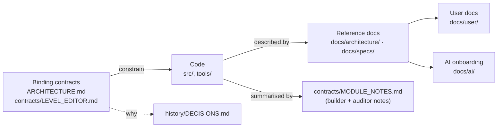

# Contracts — what is binding, what is descriptive, and how to change it

> **Purpose.** Lumina was built contract-first: before any agent wrote a module, a written
> contract fixed the exported names, signatures, units and conventions. This page explains which
> documents are *binding* contracts, which are *descriptive* notes, how they relate to the code
> and to the rest of `docs/`, and the rules for changing a contract without breaking the modules
> and level files that depend on it.
>
> **Audience:** anyone (human or AI agent) about to change a public engine API, the level format,
> the editor's internal interfaces, or one of the contract documents themselves.
>
> **Source of truth:** [`ARCHITECTURE.md`](../../ARCHITECTURE.md),
> [`LEVEL_EDITOR.md`](LEVEL_EDITOR.md), [`COMBAT.md`](COMBAT.md), [`MODULE_NOTES.md`](MODULE_NOTES.md), and the code they
> describe: [`src/engine/`](../../src/engine/), [`src/engine/level/`](../../src/engine/level/),
> [`src/editor/`](../../src/editor/), [`tools/vite-level-api.js`](../../tools/vite-level-api.js).
>
> **Related:** [DECISIONS.md](../history/DECISIONS.md) (why the contracts look the way they do) ·
> [CONVENTIONS.md](../development/CONVENTIONS.md) (the code rules the contracts imply) ·
> [DEVELOPMENT_WORKFLOW.md](../development/DEVELOPMENT_WORKFLOW.md) (the contract → builders →
> auditors process) · [architecture/modules/](../architecture/modules/README.md) (current module
> reference) · [specs/LEVEL_FORMAT.md](../specs/LEVEL_FORMAT.md) (readable level-format spec)

---

## 1. The four documents

| Document | Status | Scope | Written by | Read it when… |
| --- | --- | --- | --- | --- |
| [`ARCHITECTURE.md`](../../ARCHITECTURE.md) (repository root) | **Binding** | The visual target (§1), engine conventions (§2: units, axes, colour management, materials, pixel textures, shared uniforms, seeded randomness, disposal, no side effects on import), the shared foundation files, directory ownership (§3), the public contract of every engine module (§4.1 core … §4.8 UI), the demo integration brief (§5) and the sandbox rule (§6). | The orchestrating session, before the engine build (commit `f778242`); one additive edit since (`ef71917`, the `map` action and gamepad bindings) until the type-check pass added, on 2026-09-30, the note that the JSDoc is type-checked (§2) and the missing `PropResult` members (§4 Props.js). | You change anything under `src/engine/` that another module, the demo or the editor calls. |
| [`docs/contracts/LEVEL_EDITOR.md`](LEVEL_EDITOR.md) | **Binding** | The `lumina-level` v1 JSON format (§1), the object catalog (§2), the level builder (§3), saving and loading incl. the dev-server API (§4), how the game loads levels and every optional field (§5), the editor architecture incl. the `Viewport3D` and `Map2DView` contracts (§6), the tool interface (§7), UX and visual spec (§8) and the performance design with measurements (§9). | The orchestrating session before the editor build (`8ec4849`); extended additively by workflows 04–07 (`30290d0`, `1643b2c`, `ef71917`, `db41c62`; workflow 03's `dadfcd6` left it unchanged), and on 2026-09-30 with what its typed copies showed (`combat?` in §2; `PointerEv`, `ToolPreview`, `cursorFor`, `RotatableTool` in §7). | You touch `src/engine/level/`, `src/editor/`, the game's level loading (`src/main.js`, `src/demo/World.js`, `src/demo/Game.js`), a level generator, or a level file's schema. |
| [`docs/contracts/COMBAT.md`](COMBAT.md) | **Binding** | The ARPG combat (2026-09-28): per-level enabling (§3), architecture and frame order (§4), controls and combat-only rebinding (§5), player rules (§6), enemies (§7), the Cinderheart boss (§8), the runtime interfaces between the combat core and the enemies (§9), sprites (§10), VFX (§11), audio (§12), UI (§13), the three combat catalog types (§14), the demo level Cinderwatch Pass (§15), budgets, warm-up, automation and tests (§18–§21), and the **deviations recorded at integration and after the review** (§27; revisions 4 and 5 amend the changed values in place). | The lead of the combat workflow before its seven builder packages started; amended additively by the integrator with every deviation that was kept, by the documentation pass with the three review fix passes and the final verification (§27.9–§27.12), and with the known-issues pass (revision 5, §27.13–§27.20: paths and zones, the chunk split, the fixed-step bot, the shop, the audio QA …) and the type-check pass (revision 6, §27.21: where the §9 interfaces differ from the code). | You touch `src/demo/combat/`, a combat engine piece (`FxQuads`, `GroundMarkers`, the combat UI components, `MonsterSprites`, `FxSprites`, the `Sprite3D` `combatFx` variant), `tools/make-cinderwatch-pass.mjs`, or anything a peaceful level must not notice (§2). |
| [`docs/contracts/MODULE_NOTES.md`](MODULE_NOTES.md) | **Descriptive** | What each engine module *actually* implements, condensed from the builder and auditor reports: files, API summary, deviations and additions, integrator notes, known limitations, remaining audit issues; plus the big-level scalability section and the Starfall Vale integration and review passes. | Condensed from the engine-build reports (workflow 01) and first committed with the Emberfall integration (`9dadcf8`); sections appended by the Emberfall fixer (`8e36884`) and the Starfall workflows (`ef71917`, `db41c62`). | You need to know how a module behaves beyond its contract (extras, interpretations, caveats) before wiring or changing it. |

The first three are *binding*: their names, signatures and meanings must keep working. The fourth
is a *record*: it is never a reason to keep behaviour, and it may lag the code. Both contract files
now open with a short reading-aid box (status, audience, links to the readable references), added
by the documentation pass; it is not part of the contract text.

> **Note on paths.** Until the documentation pass, `LEVEL_EDITOR.md` and `MODULE_NOTES.md` lived
> directly in `docs/`. Commit `8ae4ad8` moved them to `docs/contracts/` (content unchanged) and
> updated every code comment that cites them to `docs/contracts/LEVEL_EDITOR.md`. Older commit
> messages (for example `8ec4849`) and the workflow reports in
> [`docs/history/reports/`](../history/reports/README.md) still use the old paths.

---

## 2. Precedence: which document wins?

There are two different questions, and they have different answers.

**"What does the code do today?"** — the **code** wins, then the reference docs in
[`docs/architecture/`](../architecture/OVERVIEW.md) and [`docs/specs/`](../specs/LEVEL_FORMAT.md)
(written against the code), then `MODULE_NOTES.md`, then the contracts. `CLAUDE.md` states the
same rule for the engine: `MODULE_NOTES.md` is "what each engine module *actually* implements
(deviations, extras); the code is the truth where it differs from ARCHITECTURE.md."

**"What am I allowed to change?"** — the **contracts** win. A member, field or behaviour named in
`ARCHITECTURE.md` or `LEVEL_EDITOR.md` must not be renamed or given a different meaning, even if
nothing in the repository calls it today: level files written by users, the editor, generators
and test scripts depend on it.

When you find a disagreement:

1. The code differs from a **binding contract** in a way that renames or changes the meaning of a
   member → treat it as a bug unless `MODULE_NOTES.md` or [§4](#4-known-differences-between-the-contracts-and-the-code)
   below lists it as a deliberate deviation.
2. The code has **more** than the contract (extra options, extra members) → normal; additions are
   allowed and are documented in the reference docs.
3. A **reference doc** differs from the code → fix the doc.

**Typed copies.** Since 2026-09-30 the contracts' interfaces are also declared as types the code is
checked against (`npm run typecheck`): the level document in
[`src/engine/level/types.d.ts`](../../src/engine/level/types.d.ts) (LEVEL_EDITOR.md §1–§2), the
`PropResult` typedef in [`Props.js`](../../src/engine/world/Props.js) (ARCHITECTURE.md §4), the
combat interfaces in [`src/demo/combat/types.d.ts`](../../src/demo/combat/types.d.ts) (COMBAT.md §9,
§20), the tool interface in [`src/editor/tools/index.js`](../../src/editor/tools/index.js)
(LEVEL_EDITOR.md §7) and the automation hooks (`GameHooks`, `EditorHooks`, `LuminaHooks`,
[`src/globals.d.ts`](../../src/globals.d.ts)) — the full list is in
[CONVENTIONS.md §3.1](../development/CONVENTIONS.md#31-the-type-check). They were written from the
code and say where the contract text differs, so for "what does the code do" they rank with the
code. The additive rule applies to them as well: a member renamed in a type fails the check
everywhere it is used, which is how the check guards the contracts.

---

## 3. How to change a contract (the additive rule)

Every workflow in this project followed one rule, repeated in `ARCHITECTURE.md`, `CLAUDE.md` and
every agent prompt: **changes to contracts must be additive — never rename or change the meaning
of a contract member; update the docs when adding behaviour.**

### 3.1 Allowed without discussion

| Kind of change | Rule | Examples from the history |
| --- | --- | --- |
| New optional option, member, method or export | Give it a default that reproduces the old behaviour exactly. | `TileMap.rebuildRect` (`dadfcd6`), `Engine.resizeThrottleMs` (`1643b2c`), `LightingSystem.retargetPointLight` / `setShadowDepthRange` (`ef71917`), `BlobBatch` export (`db41c62`). |
| New input action or binding | Add it; keep existing bindings unless the change is documented. | `map` action on `KeyN` / `Tab` / gamepad Back (`ef71917`). This one *moved* photo mode from gamepad Back to the right-stick click — the only binding change so far, recorded in `ARCHITECTURE.md` §4.1 and `MODULE_NOTES.md`. |
| New optional level field | `normalizeLevel` / `normalizeObject` must give it a default that means "as before"; the editor must not write the default into files that lacked the field; unknown fields are preserved on save. | `environment.minimap`, `environment.forest.areas`, `environment.fogScale`, `water.glint`, npc `talkOffset` / `area` / `behaviour`, critters `spotOffsets`. |
| New event payload field | Add fields; never remove or retype existing ones. | `EditorState` `'change'` events gained `ids` (`30290d0`); `null` still means "unknown, diff everything". |
| A behaviour that only applies past a threshold | Gate it so existing content is bit-identical. | Big-level batching only for levels wider or deeper than 64 tiles (`World.isBigLevel`, budgets in the exported `BIG_LEVEL_BATCHING` of `src/demo/World.js`); Emberfall, Willowmere and Brightwater Crossing were verified to build identical meshes, lights, draw calls and triangles. (The same workflow's god-ray culling was *not* gated and took one shaft off Emberfall, 203 → 202 draw calls — an accepted, documented change.) |

### 3.2 Needs a documented decision

- **Changing a default value** that affects existing content (for example `LightPool`
  `priorityWeight` 4 → 1.5 in `db41c62`, which only affects pooled levels) — record the reason and
  the measurement in `MODULE_NOTES.md` and the module reference.
- **Removing** anything, or changing a unit, axis or colour space — do not do this inside a
  feature change. There is no precedent in this project. If it is ever unavoidable for the level
  format, bump `LEVEL_VERSION` in [`LevelFormat.js`](../../src/engine/level/LevelFormat.js), migrate old
  files inside `normalizeLevel`, and regenerate / re-save the shipped levels (see
  [DEVELOPMENT_WORKFLOW.md](../development/DEVELOPMENT_WORKFLOW.md) for the byte-stability checks).
  This procedure is a recommendation, not something the project has done.

### 3.3 Checklist for a contract change

1. Make the change additive (defaults reproduce the old behaviour).
2. Update the binding document in the same change (`ARCHITECTURE.md` §4.x or `LEVEL_EDITOR.md` §n)
   and its typed copy (§2), and run `npm run typecheck`.
3. Update the reference doc under [`docs/architecture/modules/`](../architecture/modules/README.md) or
   [`docs/specs/`](../specs/LEVEL_FORMAT.md), and `MODULE_NOTES.md` if it records a deviation or caveat.
4. If players or level authors can see it, update [`docs/user/`](../user/GETTING_STARTED.md) and
   `README.md`.
5. Run the regression checks for the area you touched
   ([TESTING_AND_VERIFICATION.md §12](../development/TESTING_AND_VERIFICATION.md#12-pre-commit-verification-checklist)):
   Emberfall fingerprint, level round-trip byte-stability, generator determinism, shader-program
   count.

---

## 4. Known differences between the contracts and the code

Verified against the code on 2026-09-27 at commit `8ae4ad8`. None of these is a bug; they are
documented deviations or stale contract text. The differences the type-check pass found on
2026-09-30 were written into the contracts additively (KNOWN_ISSUES DOC-15, COMBAT.md §27.21).

| Contract text | Code | Where it is recorded |
| --- | --- | --- |
| `ARCHITECTURE.md` §4.1: the renderer uses `PCFSoftShadowMap`. | three r186 removed `PCFSoftShadowMap` for WebGL (it logs a warning and falls back). `Engine` defaults to `THREE.PCFShadowMap` (which is soft and radius-aware in r186) and maps an explicit `PCFSoftShadowMap` to it; `LightingSystem` does the same. | `MODULE_NOTES.md` (core, postfx, sprite_runtime, lighting and props sections); `Engine.js` constructor comment. |
| `ARCHITECTURE.md` §3 directory layout. | Incomplete: it predates `src/engine/level/`, `LightPool.js`, `SpatialSplit.js`, `ShadowCasters.js`, `WaterShore.js`, `shoreWorker.js`, `BlobBatch.js`, `Minimap.js` and `src/editor/` (it does allow the optional `world/props/*.js` split that exists). | [architecture/OVERVIEW.md](../architecture/OVERVIEW.md) has the current layout. |
| `ARCHITECTURE.md` §2: addons such as `three/addons/postprocessing/EffectComposer.js`. | Only an example: `PostFX` drives its passes by hand (`UnrealBloomPass`, `OutputPass`, `FullScreenQuad`) and uses no `EffectComposer`; only the lighting sandbox (`sandbox/lighting.js`) builds a stand-in bloom chain with one. | [architecture/RENDER_PIPELINE.md](../architecture/RENDER_PIPELINE.md). |
| `ARCHITECTURE.md` §5: `window.__game` exposes `{ engine, setTime(h), teleport(x, z), player, postfx, lighting, ui }`. | A superset: also `rig, audio, tileMap, textures, particles, godRays, npcs, world, weather, game, level, levelSource, talkTo, setWeather, cycleTime, cycleWeather, setMusic, photo, map, state`. | [specs/AUTOMATION_API.md](../specs/AUTOMATION_API.md). |
| `ARCHITECTURE.md` §4.2: `PostFX` options `{ samples, dofScale }`. | Adds the option `maxTaps` (48 / 64 / 96, default 96; the game passes 64) and the members `enableTimings()`, `timings`, `timingsMin`, `sceneInfo`, `sceneTarget`, `warmup()`. | `MODULE_NOTES.md` (postfx); [architecture/modules/render.md](../architecture/modules/render.md). |
| `ARCHITECTURE.md` §1 budget "≤ 12 active point lights". | Still true for the GPU, but a level may have any number of light *descriptors*; `LightPool` shares the 12 lights. | `MODULE_NOTES.md` (scalability); [DECISIONS.md ADR-007](../history/DECISIONS.md#adr-007--a-fixed-set-of-12-point-lights-then-a-lightpool). |
| `MODULE_NOTES.md` "Files" lists. | They were absolute Windows paths (`E:\workspace\3d_pixel\…`) copied from the agent reports; the documentation pass made them repository-relative and added a header with an errata table of the stale statements (`12 keyframes`, the `Sky` render order, `uSunColor` 1.43, the dialog pauses, the harp size…). | [ai/KNOWN_ISSUES.md](../ai/KNOWN_ISSUES.md#documentation-discrepancies) DOC-04, DOC-11. |
| `MODULE_NOTES.md` core section: gamepad "Start = help, Back = photo". | Stale: since `ef71917` gamepad Back opens the world map (`map`) and photo mode is on the right-stick click (`GamepadRS`, `DEFAULT_PAD_BINDINGS` in `Input.js`). The scalability section of the same file records the move. | `ARCHITECTURE.md` §4.1; [specs/INPUT_AND_CONTROLS.md](../specs/INPUT_AND_CONTROLS.md). |

---

## 5. Map of the contract sections to the current reference

| Contract section | What it fixes | Current reference |
| --- | --- | --- |
| `ARCHITECTURE.md` §1 | The HD-2D look and the performance target (60 fps at 1600×900 on a GTX 1060; ≤ 300 draw calls, ≤ 12 point lights, one 2048² shadow map, DOF at half resolution). | [design/VISUAL_DESIGN.md](../design/VISUAL_DESIGN.md), [architecture/PERFORMANCE.md](../architecture/PERFORMANCE.md) |
| `ARCHITECTURE.md` §2 | Conventions. | [CONVENTIONS.md](../development/CONVENTIONS.md) |
| `ARCHITECTURE.md` §4.1–§4.8 | Module APIs. | [architecture/modules/](../architecture/modules/README.md) (`core`, `audio`, `render`, `pixel`, `sprite`, `fx`, `lighting`, `world`, `ui`) |
| `ARCHITECTURE.md` §5 | Demo integration. | [architecture/GAME.md](../architecture/GAME.md) |
| `ARCHITECTURE.md` §6 | Sandbox-first module testing. | [TESTING_AND_VERIFICATION.md](../development/TESTING_AND_VERIFICATION.md) |
| `LEVEL_EDITOR.md` §1–§2 | Level format and object catalog. | [specs/LEVEL_FORMAT.md](../specs/LEVEL_FORMAT.md), [specs/OBJECT_CATALOG.md](../specs/OBJECT_CATALOG.md) |
| `LEVEL_EDITOR.md` §3, §5 | Building levels; game integration. | [architecture/modules/level.md](../architecture/modules/level.md), [architecture/GAME.md](../architecture/GAME.md) |
| `LEVEL_EDITOR.md` §4 | Storage and the dev-server API. | [specs/LEVEL_STORAGE_API.md](../specs/LEVEL_STORAGE_API.md) |
| `LEVEL_EDITOR.md` §6–§9 | Editor architecture, tools, UX, performance design. | [architecture/EDITOR.md](../architecture/EDITOR.md), [user/LEVEL_EDITOR_GUIDE.md](../user/LEVEL_EDITOR_GUIDE.md) |
| `COMBAT.md` §4–§9, §20 | Combat wiring, rules and interfaces, the automation hooks. | [architecture/GAME.md §15](../architecture/GAME.md#15-combat-combat-levels-only), [specs/AUTOMATION_API.md](../specs/AUTOMATION_API.md) |
| `COMBAT.md` §10–§13 | Combat sprites, VFX, audio, UI. | [pixel.md](../architecture/modules/pixel.md), [sprite.md](../architecture/modules/sprite.md), [fx.md](../architecture/modules/fx.md), [audio.md](../architecture/modules/audio.md), [ui.md](../architecture/modules/ui.md) |
| `COMBAT.md` §14–§17 | Combat catalog types, Cinderwatch Pass, the editor. | [specs/OBJECT_CATALOG.md](../specs/OBJECT_CATALOG.md), [design/levels/cinderwatch-pass.md](../design/levels/cinderwatch-pass.md), [architecture/EDITOR.md](../architecture/EDITOR.md) |
