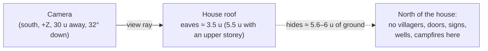

# Level design guide — rules learned the hard way

Practical rules for building Lumina levels that look right from the diorama camera and play without
dead ends. Most of them were not obvious up front: they come from the reviews of Emberfall, the level
editor and Starfall Vale (four independent reviewers per phase, ~160 findings in total) and from the
checks `tools/make-starfall-vale.mjs` now enforces. Each rule says **why** and, where one exists, which
check catches it.

| | |
| --- | --- |
| **Audience** | Level designers (editor or generator), and AI agents asked to build, extend or review a level. |
| **Source of truth** | [`src/engine/world/TileMap.js`](../../src/engine/world/TileMap.js) (`move`, water surfaces, stairs), [`src/engine/level/ObjectBuilder.js`](../../src/engine/level/ObjectBuilder.js) (`bridgeDeckHeight`, `buildWaterfall`, `LIGHT_PRIORITY`, `computeCameraBounds`), [`src/engine/lighting/LightPool.js`](../../src/engine/lighting/LightPool.js), [`src/demo/Game.js`](../../src/demo/Game.js) (camera, interaction, regions), [`src/demo/Scenery.js`](../../src/demo/Scenery.js) (border forest), [`src/editor/EditorApp.js`](../../src/editor/EditorApp.js) (`validate`, `_softWarnings`, `bridgeStepIssues`), [`tools/make-starfall-vale.mjs`](../../tools/make-starfall-vale.mjs) (`validate`, `sightlines`, `clearCrowns`, `TREE_RULES`, `ROUTES`) |
| **Related docs** | [Level format spec](../specs/LEVEL_FORMAT.md) · [Object catalog](../specs/OBJECT_CATALOG.md) · [Level editor guide](../user/LEVEL_EDITOR_GUIDE.md) · [Visual design](VISUAL_DESIGN.md) · [Performance](../architecture/PERFORMANCE.md) · level design docs: [Emberfall](levels/emberfall.md), [Starfall Vale](levels/starfall-vale.md), [Brightwater Crossing](levels/brightwater-crossing.md), [Willowmere](levels/sample-hamlet.md), [Cinderwatch Pass](levels/cinderwatch-pass.md), [Gildhaven](levels/gildhaven.md) · binding contracts [contracts/LEVEL_EDITOR.md](../contracts/LEVEL_EDITOR.md), [contracts/COMBAT.md](../contracts/COMBAT.md) |

---

## 0. The short list

If you read nothing else:

1. **The camera looks north.** Anything tall — a house, a well roof, a tree crown — hides the ground
   *north* of it. Never put a villager, a door, a sign, a well or a campfire in the ~6 units north
   of a house, or where a tree crown stands just south of it. ([§2](#2-the-camera-looks-north))
2. **The player climbs 0.55 at most.** One height level (0.5) is a walkable step; two or more is a
   cliff. Stairs join level *L* to *L* + 1 per tile. ([§3](#3-heights-cliffs-and-steps), [§4](#4-stairs))
3. **Bridge decks sit at the bank height.** A bank one level below an arched deck is 0.558 below its
   first plank — just too high to step onto. ([§5](#5-bridges-and-piers))
4. **Water beds go one level below the banks; waterfalls need a real drop** (≥ 0.5) on a tile edge,
   facing south toward the camera. ([§6](#6-water), [§7](#7-waterfalls))
5. **There are at most 12 real point lights.** With more than 12 light sources they are shared
   among the lamps around the camera: place as many lamps as the scene needs, but keep about twelve
   within any one view. ([§9](#9-lights))
6. **Regions: small places first** (first match wins), and every corner of the map inside some
   region. ([§10](#10-regions-and-banners))
7. **Villagers need a visible talk spot**; merchants behind a stall need `talkOffset`. The first
   dialogue choice must be the harmless one. ([§11](#11-villagers))
8. **Signpost arrows are map directions at the default camera**: ↑ north (−Z), ↓ south (+Z), ←
   west, → east — and they must be true. ([§12](#12-signposts-doors-and-wells))
9. **Run Level › Check for problems** (editor) or the generator's validator, then walk it. ([§14](#14-validation))
10. **Generated levels are edited through their generator**, never by hand. ([§15](#15-generator-vs-editor-workflows))
11. **One enemy group makes it a combat level.** Keep packs apart, give them readable ground and
    put a waystone before every hard fight. ([§16](#16-combat-levels))

---

## 1. Units you design in

| Quantity | Value | Notes |
| --- | --- | --- |
| Tile | 1 × 1 world unit | Tile `(i, j)` covers `x ∈ [i, i+1]`, `z ∈ [j, j+1]`; rows run toward +Z (south, toward the camera). |
| Height level | 0.5 units | Heights `'0'–'9'`, `'a'–'z'` = levels 0–35; world y = level × 0.5. |
| Player | radius 0.3, walk 3.2 u/s, run 5.6 u/s | `src/demo/Player.js`; max step 0.55 (`TileMap.move`). |
| Villager collider | radius 0.34 | Moves with the villager (`dynamic`). |
| Level size | 8 – 128 tiles per side | `MIN_SIZE` / `MAX_SIZE` in `LevelFormat.js`. Above 64 the big-level path is used ([§13](#13-performance-budgets)). |
| Camera | fov 28°, pitch 32°, distance 30 (zoom 18–42), yaw ±60° | [Visual design §6](VISUAL_DESIGN.md#6-the-diorama-camera). |

The level file format is specified in [LEVEL_FORMAT](../specs/LEVEL_FORMAT.md); object fields in
[OBJECT_CATALOG](../specs/OBJECT_CATALOG.md).

---

## 2. The camera looks north

At yaw 0 the camera sits on the +Z side of the player looking toward −Z, pitched down 32°. Players can
turn it only ±60°, so **design for yaw 0**. Screen-up is north (−Z), screen-down is south (+Z).

### Houses hide the ground behind them

- A one-storey house hides about **5.6–6 units** of ground north of it; a second storey adds more.
  The Starfall validator models houses the way `PropFactory` builds them (eaves 3.5 above the ground
  — a 0.5 plinth plus 3 of wall —, 5.5 with an upper storey, the steepest 45° roof, 0.35 overhang all
  round), plus well roofs (1.85–2.65 above the ground) and the windmill tower.
- **Rule:** no villager, talk spot, door front, signpost, well or campfire may be hidden from the
  default camera by a roof. `validate()` in the Starfall generator fails the level if one is.
- **Rule of thumb for roads:** keep the share of path tiles hidden behind roofs **≤ 3 %** (Starfall
  Vale: 2.5 %, 46 of 1876 path tiles; the generator warns above 3 %).
- Lessons: Starfall's first layout hid Sister Amarantha, Barnaby, Garrick and the chapel, bakery and
  smithy doors behind the east blocks (the reviewers could see only the player's x-ray figure while
  talking); the fix moved the bakery east of the chapel door, set the smithy back with its forge in an
  open yard, and cut Merrow House to one storey because its upper floor filled a third of the view
  from the square. In Brightwater Crossing the roof of Riverside Cottage at (20, 22) covered the
  market stall 4.5 units north of it (the roof, ≈ 5.3 above the ground, hides the ground up to
  ≈ 6.7 units north of the cottage at the default 32° pitch); the fix moved the stall group to the
  north side of the square, in front of the inn, where its awning's shadow falls on the inn wall
  ([brightwater-crossing.md](levels/brightwater-crossing.md#known-issues)).
- **Stall keepers disappear under the awning.** A `marketStall` awning (2.72 high at the back,
  2.03 at the front) covers a villager posted 1–1.35 behind the stall's centre from the gameplay
  camera; only the talk bubble shows (Brightwater's Posy, Emberfall's Bertram — KNOWN_ISSUES
  PROP-13). Accept it, or post the keeper beside the counter.
- **Doors face south, east or west.** A house's front (door) is its local +Z: `rotation 0` faces the
  camera, `π/2` east, `−π/2` west. A door facing north is behind the house. `doorOffset` slides the
  door along the facade.
- **Rows of houses** work when each row stands *beside*, not *behind*, the doors of the row south of
  it (Starfall: "Hollyhock and Riverside stand beside, not behind, the houses south of them").

### Trees hide too

- The Starfall scatter keeps **sightline corridors** south of everything the camera must see:
  villagers (half-width 3, depth 9), house doors (2.5 × 8.5), wells, campfires and signs (2 × 4.5), plus
  named landmarks (the square, the falls, the spawn…). No scattered tree trunk stands in a corridor,
  and a hand-placed tree there fails validation.
- Corridors test trunks only; a big crown whose trunk stands just outside can still cover a target.
  `clearCrowns()` models crowns the way `src/engine/world/props/Trees.js` builds them (`crownOf()`:
  broadleaf ellipsoids of radius 0.44 × height for oaks, flattened to 0.8, 0.43 / 0.78 for autumn
  trees, a narrower and taller 0.3 × height ellipsoid for birches; pines a cone from 0.19 × height to
  the top with base radius 0.34 × height) and drops scattered trees hiding ≥ 25 % of a target (a
  villager, the spot you talk to one from, a door front, a sign and its reading spot, a well, a
  campfire); `validate()` fails any tree — hand-placed ones included — hiding ≥ 50 %. It caught
  Kestrel 73 % hidden behind an autumn crown and the Old Lumen well fully hidden by a pine.
- **No tall tree right south of a path**: the scatter skips a candidate that has a path tile within
  `TREE_RULES[zone].south` rows north of it (2–6 rows depending on the zone; 4 % of such candidates
  are let through for variety), so a walker is rarely behind a crown.
- **Orchards read as rows, not a canopy**: stagger alternate columns, vary heights (3.4–5.0), start
  the first row about 6 units off the walk. A 5 × 5 grid of equal trees became "one flat canopy
  swallowing the Orchard walk".

### Foreground framing is a tool — use it sparingly

The near depth-of-field blurs whatever stands south of the player, which frames the shot the Octopath
way. But the Emberfall review found foreground trees and the lodge filling 40–60 % of the frame in
Amberleaf Grove; the lodge was moved against the cliff north-east of the pond. Remaining blind zones
(behind Emberfall's thatched cottage and its brick Riverside house) are covered only by the player's
x-ray silhouette. **Treat the silhouette as a safety net, not a design tool.**

### High ground

On a plateau the blurred roofs below fill the lower frame. `environment.highGround { minY, pitch }`
tilts the camera down while the player stands above `minY` (Emberfall 39° above y 3.2; Starfall and
Brightwater 40°). Set `minY` a little below the plateau surface (Emberfall's hill is at 4.0).

### Map edges

- Surround the playable area with **forest border `T` tiles** (not walkable; the game scatters trees on
  them) and set `environment.border: 'forest'` + `outerScenery: true`, so no view shows the edge of the
  world. The editor's Check for problems warns when walkable ground reaches the map edge.
- The border scatter (`scatterForest` in `src/demo/Scenery.js`) is tuned for the camera: **no trees
  on the bottom three rows of the map** (they would hide the southern meadow), half the attempts on
  the top three rows (the upper cliffs stay airy), and on the east / west sides from row 9 southward
  the **third column from the edge stays open and the second is 20 % lower**, so a player walking
  along the edge is not behind a trunk. Emberfall's 3-tile border is what this was tuned for.
- Near the east / west edges the game clamps the camera's yaw toward the edge to 10°.
- **No one-tile corridors between forest tiles.** The trees the game scatters on `T` tiles close such
  a gap and leave a pocket nobody can reach. Starfall's `border()` now fills them, after its review
  found an unreachable pocket in the north-east.
- **Open edges** (runs of 3+ walkable edge tiles) keep the outer forest 2.5 units away.
  `environment.scenery.southGap` leaves open meadow south of the map (Starfall: 10, so the outer woods
  don't stand between the camera and the spawn on the south edge).
- **Don't end a road in an invisible wall.** Starfall's King's Road first stopped dead at the spawn;
  it now ends at a visible toll-gate fence. Use a custom non-walkable road tile (`':'` in Starfall)
  to continue a road visually past the border.
- Tree kinds of the border and outer woods follow `environment.forest.areas` (Starfall: autumn
  Emberwood, pines on the mountain); otherwise an Emberfall-shaped automatic mix applies
  (`kindFor` in `scatterForest`: pine-heavy north of z 6, autumn-heavy east of 0.72 × the map width).

---

## 3. Heights, cliffs and steps

`TileMap.move(from, dx, dz, radius = 0.3, maxStep = 0.55)` lets the player onto a point only if the
centre is walkable and within 0.55 of the current ground height, and the samples round the player's
radius are walkable and within 0.55 of the centre (bridge walk rects count as ground; stairs use
their smooth ramp height).

| Height difference | Result |
| --- | --- |
| 0 | flat |
| 1 level (0.5) | **walkable step** — no stairs needed (Emberfall's meadow edge, Starfall's one-level knolls; Willowmere's terrace can be climbed anywhere, its stair is a visual cue) |
| 2+ levels (≥ 1.0) | **cliff** — a vertical face with a `lip` texture on top; needs stairs or a detour |

- Cliff faces are seen from the south. A plateau north of the player shows its face; a raised block
  south of the player shows only its top and hides what is behind it.
- Build tiers with room between them. Starfall's Mount Lumen rises plain 2 → foothills 5 → terrace 9
  → plateau 15 (observatory knoll 16), each tier deep enough to walk and look back from.
- Keep building footprints on flat, dry tiles of one level (the generator checks houses, stalls,
  the windmill, wells, campfires and benches).
- Decorative "walls" are just raised blocked tiles: Starfall's Old Lumen wall stubs were 0.5 u tall
  and invisible; they became levels UPLAND + 3 / + 4 (1.5–2 u). The glade's standing stones are
  2.5–3 u pillars. Anything under ~1.5 u reads as a bump from 30 units away.

---

## 4. Stairs

| Char | Name | Rises toward |
| --- | --- | --- |
| `^` | Stairs up north | −Z (away from the camera) |
| `v` | Stairs up south | +Z (toward the camera) |
| `>` | Stairs up east | +X |
| `<` | Stairs up west | −X |

- **A stairs tile at level *L* joins *L* to *L* + 1.** The tile ahead (in the rising direction) must be
  *L* + 1 (flat, or the next stairs tile); the tile behind must be *L* (flat) or stairs at *L* − 1.
  A flight up a cliff of *n* levels is *n* stairs tiles in a row, levels *L*, *L* + 1, … with the top
  at *L* + *n*. Geometry is 4 real steps per tile; the walk height ramps smoothly.
- **Make flights 2–3 tiles wide** with flat landings at both ends. Emberfall's hill stair is 2 wide
  with fences on both sides; Starfall's King's Road flights are 3 wide.
- **Orientation for the camera:** `^` flights read best — you see every riser climbing away. `v`
  flights show only their treads (the risers face north, away from the camera) and the upper steps
  hide the lower ones; Starfall uses `v` only inside the quarry pit. East / west flights read well and
  make good switchbacks.
- In the editor the **Stairs tool (T)** faces the higher neighbour automatically, turns a ramp
  sculpted one level per tile into stairs as it is, and — when you drag across a multi-level cliff,
  from its foot to its top — builds the whole flight on the low side (`planStairs` in
  `src/editor/tools/StairsTool.js`).
- The Starfall validator checks every stairs tile (ahead = *L* + 1, behind = *L*), and every named
  flight as a **route** ([§14](#14-validation)).

---

## 5. Bridges and piers

A `bridge` object (a line from `x0, z0` to `x1, z1`) builds a plank deck and registers walk rects at
the deck height, which override the water tiles under it.

- **Deck height = bank height.** `deckY: null` (the default) uses `bridgeDeckHeight()`: the height of
  the bank half a tile past the start (else the end), never below the highest water surface under the
  span + 0.1; with no bank at either end, the water surface + 0.3.
- **The 0.558 problem.** An arched deck (`opts.arch`: 0.25 for a bridge placed in the editor — the
  catalog default; without the field `PropFactory` uses min(0.4, 0.05 × length)) walks on
  *n* = max(2, round(length / 0.5)) flat segments (one when the arch is ≤ 0.02); the first segment
  sits `arch · sin(π / 2n)` above the deck height. If a bank is **one level (0.5) below** the deck, the first step is 0.5 + that — e.g. Starfall's
  first Southgate Bridge (length 4.2, arch 0.3): 0.5 + 0.3 · sin(π/16) = **0.558 > 0.55**, and the
  player could not step on. Fixes: level the bank with the deck, set `deckY`, or flatten the arch.
  **Level › Check for problems** reports such bridge ends (`bridgeStepIssues`).
- Both ends on banks (piers: the land end); the span must cross water. A road that crosses water must
  run on a deck — the Starfall validator samples every path.
- **Piers** are bridges with `arch: 0` reaching into a lake: Starfall's Long Pier, North Pier and South
  Pier have `deckY 0.5` from level-1 shores (y 0.5) over level-0 water (surface 0.4).
- Deck rails are colliders along both sides; keep the approach (±1.6 u around each end) clear of
  props.
- Validate by **walking every bridge end to end** — Starfall's validator samples the deck every 0.2
  units for standability and steps > 0.55.

---

## 6. Water

| Char | Tile | Flow |
| --- | --- | --- |
| `~` | River | the level's `water.flow` (default `[0, 0.45]`, south) |
| `p` | Plunge pool | × 0.45 |
| `w` | Fast stream | × 2.2 |
| `o` | Still pond | 0 |

Water tiles are never walkable (only bridge decks over them are).

**Where the surface goes** (`TileMap._computeWaterSurface`): if the level's `waterLevel` is more than
0.02 above the tile's bed, the surface is `waterLevel` (0.4 in new levels and in every shipped level;
0.35 when a file omits the field); otherwise the surface is **bed + 0.35** ("auto depth", so a stream
on a plateau just works). A legend entry may also set its own
`waterLevel` or `waterDepth`. Painting a water tile does not change its height — lower the bed with
the Height tool, or turn on **Also set height** in the Paint / Fill / Rectangle options and paint
water at level 0.

Rules:

- **Lower water beds one level below the banks.** Low water: bed level 0 (surface 0.4) with sand
  banks at level 1 (0.5) — a shore just above the water, as in Emberfall's river and pond. Upper
  streams: bed one level below the bank, so the auto surface (bed + 0.35) sits 0.15 under the bank.
- **Rivers must actually connect.** Starfall's Silverrun was dammed by a two-tile sand bar before the
  lake, so players could walk round the Reedmouth Bridge. The fix ran the river into the lake and
  added route checks across every crossing.
- **A different flow direction needs its own legend char.** Starfall adds `'e'` — a river flowing east
  (`flow: [0.45, 0]`) for the Silverrun's run to the lake.
- **Big calm lakes need fewer glints**: `water.glint` (default 1) — Starfall uses 0.45 with
  `reflect 0.08, neutral 0.55`.
- Unreachable walkable pockets (an island) are fine only if intended; Starfall's validator allows
  exactly one (the island of the sleeping stars).

---

## 7. Waterfalls

A `waterfall` object renders a falling curtain from the water surface half a tile upstream to the
surface half a tile downstream of its position.

- **Place it on a tile edge** between a higher and a lower water tile. For `facing` `S` / `N` the
  `z` coordinate is an integer edge (e.g. `z: 11` between rows 10 and 11); for `E` / `W` the `x`.
- **`facing` is the direction the water falls toward.** Face falls **south** (toward the camera) so the
  curtain is seen; every shipped waterfall faces `S`.
- **Give it a real drop.** The generator requires ≥ 0.5 between the surfaces (the game draws even a
  0.05 sliver on flat water). The lip must be water across the whole `width`.
- `mist: { count, alpha }` (default 8 particles per unit of width, at least 4, alpha 0.07 —
  `MIST` in `src/demo/World.js`) and `splash: false` (a quiet spring: no splash bursts or glints, no
  splash sound / water-ambience anchor).
- Waterfalls read best from below: the curtain faces south, so the player sees it from the ground
  south of the pool (Starfall's Mirror Falls from the North Shore), not from a lookout at the top.

| Waterfall | Level | Drop |
| --- | --- | --- |
| Emberfall Falls (`falls`, 31, 11) | Emberfall | stream surface 3.85 → pool 0.4 |
| The spring (`spring`, 31, 3) | Emberfall | 4.85 → 3.85, `splash: false` |
| Brightwater Falls (`waterfall_1`, 24.5, 4, width 3) | Brightwater | 3.35 → 0.4 |
| Three Sisters (high, mid, low) + spring + Mirror Falls | Starfall | 3.00, 2.00, 1.95, 1.00, 3.95 |

---

## 8. Density and composition

Shipped levels hold about **0.07–0.1 objects per walkable tile** (a town's streets, squares and
quays are walkable too: Gildhaven, busy as it looks, has 0.04):

| Level | Size | Walkable tiles | Objects | Per walkable tile |
| --- | --- | --- | --- | --- |
| Emberfall | 48 × 40 | 1324 | 136 | 0.103 |
| Brightwater Crossing | 36 × 28 | 640 | 68 | 0.106 |
| Willowmere | 28 × 22 | 417 | 38 | 0.091 |
| Starfall Vale | 128 × 128 | 12555 | 874 | 0.070 |
| Gildhaven (a town) | 128 × 128 | 13598 | 518 | 0.038 |

Composition rules that worked:

- **Clusters, not carpets.** A village square with a focal point (well, stall, lamps round it), houses
  facing it, props against walls. Emberfall packs its square into 11 × 10 tiles.
- **Keep-clear zones** (Starfall generator, `keepClear`): door fronts 1.1 u, wells and campfires
  2.2 u, bridge ends 1.6 u, villagers `wander` + 0.9 u (at least 1.4 u). The game also clears ground
  foliage around each villager's home (radius `wander` + 0.8, in `World`) so nobody stands
  half-buried in tall grass — an Emberfall review finding.
- **Lived-in houses:** 2–3 barrels, crates or flower boxes per home against the side and back walls
  (a flower box may sit at a front corner), at least 2.2 u from the door, never on a path, water,
  stairs, paving or a different level than the house (`dressHouses()`).
- **Tree scatter by zone** (`TREE_RULES`): dense in forests (spacing 2.0–2.3), sparse in town (keep
  0.05, spacing 5), a 2-tile gap from paths (3 in the meadows), 2.5 u from houses, and no scattered
  tree within **3.6 u of a lamppost or wall torch** (a lantern inside an autumn crown reads as the
  tree on fire).
- **Particle areas** (`emitter` objects) give each place its mood — fireflies over ponds and meadows
  (night only), leaves in the autumn wood, petals over meadows, dust in the quarry, mist and sparkle
  at falls. Leaves thin out automatically as the light fades (big dark flakes read as petals or
  bats at dusk).
- **God rays** (`environment.godRayAreas`, 0–12 shafts each, default 3) over open squares and forest
  clearings, with `y` at the ground height of the area.
- **Flower and shrub zones** (`environment.foliage.flowerAreas` / `shrubAreas`, world rects) colour
  the ground by area — Emberfall has a mixed flower meadow in the south and a bushy grove, Starfall
  blue-white glade flowers and yellow farm flowers; Brightwater Crossing and Willowmere leave
  `foliage` unset and get the default ground detail.

---

## 9. Lights

The game creates **at most 12 point lights** (`MAX_POINT_LIGHTS` in `src/demo/World.js`), all
before the first frame; the count never changes afterwards (a different count would recompile every
shader). Levels may place any number of light sources (lampposts, wall torches, campfires, `light`
objects, houses with `light: true`); `World._wireLights` hands their descriptors to a `LightPool`:

- **≤ 12 descriptors:** one permanent light per descriptor (so Willowmere has 6 point lights), in
  `LIGHT_PRIORITY` order — campfire 0, wall torch 1, `light` 1, lamppost 2, house 3 — ties by object
  order. Emberfall has exactly 12.
- **> 12:** 12 lights. Every 0.2 s they go to the descriptors whose range (+ 4 u) touches the view,
  nearest the camera focus first, plus 1.5 units per priority step (`priorityWeight`), a small
  bonus for staying lit and a penalty for lamps that are dark by day; a light that changes lantern
  fades out, moves and fades in (0.35 s each way). Windows and lantern glass are emissive materials
  driven by the night factor, so they keep glowing whether or not their lamp currently owns a light.

Design rules:

- **About twelve lamps per view.** Starfall's busy square has 20+ lamps within 12 units, so some of
  them are always dark — the pool working as designed (the build report measured about 3.4 unlit on
  average; after the review lowered `priorityWeight` from 4 to 1.5, a 272-spot sweep found only 5
  unlit lamps within 9 units of the player in total). Emberfall's 12 sources are 6 lampposts (4 round
  the square), 2 wall torches (inn and barn), the campfire and the door lanterns of 3 houses.
- **Light the dark spots on purpose.** Starfall's square well was the darkest spot in town; festival
  lanterns (a `light` object) now hang over it.
- **`light` objects** are invisible light sources — candles behind chapel windows, the observatory's
  blue lens (`nightOnly: false`), wish-lanterns in the Wishing Oak (moved into the front of the crown
  so they light the leaves the camera sees, not one hot spot on the bark).
- Lampposts and door lanterns are night-only (they glow a little by day in rain and snow); wall
  torches and campfires burn day and night.
- `light: true` on a house adds its door-lantern light; with `false` the lantern glass still glows.

See the light values per source in [Visual design §8](VISUAL_DESIGN.md#point-lights-and-glowing-windows).

---

## 10. Regions and banners

A `region` is a rect (`minX…maxZ`) naming a place on the HUD plate and on the world map.

- **First match wins** (object order), so list **small places first**, then the areas containing them.
  Starfall lists "The Lumen Observatory" before "Mount Lumen", "Hearthwick Square" before "Hearthwick".
- `minY` makes a region apply only while the player stands above that height — use it for plateaus
  (Emberfall's Windmill Hill: `minY 3.2`; Starfall's plateau regions `7.2`, terraces `4.2`).
- **Cover the stair too.** Emberfall's plate flashed a generic name while climbing to the hill; a
  second, banner-less "Windmill Hill" region over the stair fixed it. Between regions the plate keeps
  its current name.
- **Cover every corner.** Starfall's empty south-east corner kept a stale place name until "Bramble
  Hollow" was added.
- `banner` (a subtitle) shows an arrival banner the first time the player enters that region in a
  session; give banners to places worth announcing (Starfall: 14 of 31 regions).
- Every region needs reachable ground (validated in Starfall).
- On the world map a region holding another region's centre is drawn as an **area** label. Labels
  that collide try a few other spots; an area label that still finds none is set compact (smaller,
  on two lines) and tried again; a label with no free spot is hidden (`WorldMap._layoutLabels` in
  `src/engine/ui/Minimap.js`). Starfall shows all 31, three of them compact.

---

## 11. Villagers

**Where to stand them**

- On walkable ground, clear of prop colliders, inside a keep-clear zone of `wander` + 0.9 u.
- **The villager and the spot you talk to them from must both be visible** from the default camera
  (no roof, no tree crown). `talkTo(id)` places the player beside the villager (±1.15 on x) first, so
  both faces show.
- The interaction test: within `talkRadius` (default 1.6) of the villager — or of its talk spot —,
  less than 1.3 apart in height, and roughly in front of the player.
- **Merchants behind a counter need `talkOffset`** `[dx, dz]` (relative to the villager): Emberfall's
  Bertram uses `[0, 2.7]`, Brightwater's Posy `[0, 2.35]`, Starfall's stall keepers `[0, 3.15]` (or
  `[2.95, 0]` for a stall facing east) with `talkRadius 1.5`. Without it the player can only talk
  from behind the counter (as Posy could before her fix). Rule of thumb for a `marketStall` with the
  default depth 1.6 and display crates: the collider's front edge is at `stall.z + 1.3`, so put the
  talk point just in front of it — `talkOffset` dz = `stall.z + 1.35 − npc.z` (Bertram
  23.7 + 1.35 − 22.35 = 2.7, Posy 14.2 + 1.35 − 13.2 = 2.35). A talk point further out than the
  player can reach narrows the prompt window at the counter (the game picks a target behind or
  beside the player only within 0.55): at her first stall (18.5, 17.5) Posy's window was only
  x 18.0–19.0 with 2.7 and x 17.55–19.45 with 2.35; at today's narrower stall (width 2.5, centre
  x 13.05) it is x ≈ 11.9–14.2.

**Behaviours** (`behaviour`)

| Value | Use | Examples |
| --- | --- | --- |
| `wander` | Strolls within `wander` of home; glances at you when you come within 2.4 u | most villagers |
| `post` | Stands at home (walks back if pushed), faces you within 2.2 u, otherwise looks round now and then, mostly toward `facing` | stall keepers, guards, anglers on piers |
| `perform` | Like `post`, but looks round mostly toward the camera (`down`) — a performer facing the audience; the music itself comes from the `music` action | Emberfall's bard, Starfall's troupe |
| `chase` | Runs after the chickens in or next to `area` (a rect relative to the villager) | Pip, Tansy |

A `chase` area must be mostly walkable (validated: ≥ 50 %); critter groups must start on walkable
ground.

**Dialogue**

- Villagers without a `script` speak their `dialogue` pages, then their built-in `action`
  (`rest` / `shop` / `music`). `script` names a hand-written conversation in `src/demo/dialogue.js`
  (Emberfall only).
- **The first choice is the harmless one** ("Not yet", "Just looking"). Mashing Space through the text
  lands on the first choice; the inn must not put the player to bed by accident. The built-in actions
  run on any answer but the first — except after a one-answer closing question (`[Good night |]`),
  whose only answer runs the action. Use two answers, the harmless one first, whenever the player
  should be able to decline.
- **Music:** with no closing choice of its own, a `music` villager starts the music, or — when it
  plays — asks "Another song, or a little quiet?". Don't add a "Shall I play?" choice to a bard whose
  music is usually already on: Starfall's Lark first had one and it did nothing either way.
- **Don't promise what isn't there.** Reviewers flagged a bell nobody could see, a scarecrow that
  didn't exist and an errand with no answer. Directions villagers give must match the geography
  (Starfall's chain: the mayor → the Stargazer → Grandmother Isolde → the end of the Long Pier).
- `{word}` renders gold; use it for place names and people.

---

## 12. Signposts, doors and wells

- **Arrows are map directions at the default camera:** ↑ north (−Z), ↓ south (+Z), ← west (−X),
  → east (+X), and the diagonals ↖ ↗ ↙ ↘. The Starfall review measured every sign against its target;
  all were within ~38° except "← the windmill" (50° off, now "↖ the windmill") and a "→ Mirrormere
  Landing" (57°, accepted because it follows the road).
- Two signs close together must agree (a Mirrormere Landing pair contradicted each other).
- Multi-line boards: `\n` in the text and `opts.boards` 1–3. Separate destinations with " · " so each
  arrow sits next to its own destination (aligned spaces collapse in the dialog).
- Doors, signs and wells are interactive **only with text**. Level › Check for problems warns how many
  houses have no "Text when knocking".
- The reading spot (just south of the sign) must be visible too (Starfall validator).
- Interaction radii: door 1.0 (around the door step, ≈ 1 unit in front of the door — a player
  standing against the wall and facing the door leaf gets *Knock* too), signpost 1.35, well 1.75;
  the well plays `sfx` (default `splash`). Keep other interactables off a door step: a sign there
  competes with the door (Brightwater's `signpost_2` on `house_5`'s door step shows *Read* when
  the player faces the sign, *Knock* when they walk straight into the door).

---

## 13. Performance budgets

Measured on the dev machine (GTX 1060, 1600 × 900); see [PERFORMANCE](../architecture/PERFORMANCE.md).

| Budget | Value |
| --- | --- |
| Scene draw calls (incl. the shadow pass) | ≤ ~300 at the default camera distance |
| Point lights | ≤ 12 (shared by `LightPool` when a level has more light sources) |
| Sun shadow map | one 2048² |
| Particle areas, god-ray shafts, chimney smoke | 1 draw call each while in view |

| Level | Size | Build path | Objects | Light descriptors | Draw calls at the spawn | Triangles at the spawn | Range measured in reviews |
| --- | --- | --- | --- | --- | --- | --- | --- |
| Willowmere | 28 × 22 | small | 38 | 6 | 165 | 0.17 M | — |
| Brightwater Crossing | 36 × 28 | small | 68 | 10 | 211 | 0.23 M | — |
| Emberfall | 48 × 40 | small | 136 | 12 | 229 | 0.34 M | 170–245 calls, ~0.34 M |
| Starfall Vale | 128 × 128 | **big** | 874 | 95 | 176 | 0.87 M | 135–283 calls at 26 spots, 0.73–1.21 M |
| Gildhaven | 128 × 128 | **big** | 518 | 86 | 167 | 0.67 M | 124–274 calls at 26 views (280 zoomed out over the square) |

(Spawn values: `__game.state()` right after loading with `autostart=1`, 1600 × 900, measured
while writing this page; villagers and time move, so expect a few calls either way.)

- **≤ 64 tiles per side:** the original single-merge batching; draw calls grow with materials in view.
- **> 64:** `BIG_LEVEL_BATCHING` (`src/demo/World.js`): k-d-split batches culled by their bounding
  boxes, shadow-only proxy casters, instanced foliage in chunks of 4000 tufts, far villagers and
  critters updated every 4th frame, and particle areas / mist / smoke more than **34 units** from the
  camera focus switched off. Budget a big level by views, not by totals.
- A fully zoomed-out view (distance 42) of Starfall's busy square reaches ~300 calls; keep the densest
  places a little under budget at the default zoom.
- **Editor:** a 64 × 64 level with ~200 objects edits at the display rate; Starfall (874 objects)
  opens with ~915 draw calls in the split layout and idles at the display rate (README
  "Performance").
- Loading: Starfall reaches its first gameplay frame in about 2.4–2.8 s on a warm dev server
  (4.0–4.4 s with a cold shader cache).

---

## 14. Validation

### In the editor

- **Level › Check for problems** runs `validateLevel` (errors: row lengths, player start outside the
  map or not on walkable ground / a bridge deck) and soft warnings: bridge ends more than a step above
  or below the bank, objects outside the map, no villagers, houses without knock text, walkable ground
  reaching the map edge.
- **Play ▶ / F5** refuses to start with errors and words them for the user ("The player start is on
  water…"), then opens `index.html?level=local:__playtest__&autostart=1`.
- For the deeper checks of the generators, save the level and run `npm run level:check -- <name>`
  ([below](#from-the-command-line-any-level)).

### In a generator

`tools/make-starfall-vale.mjs` is the reference; it refuses to write the level when any check fails
(`--force` writes it for inspection and still exits 1). What it proves:

- `normalizeLevel` gives zero warnings and repairs nothing; `validateLevel` is clean; the save round
  trip is byte-stable.
- A **walk BFS** from the spawn on a quarter-unit grid with the game's rules (walkable tiles and bridge
  decks, step ≤ 0.55, stair ramps, player radius 0.3 against approximate prop colliders): every
  villager (from its talk spot), door, sign, well and region reachable; unreachable pockets ≥ 3 tiles
  are errors except the island.
- **Routes**: walks a sign or a villager promises — and every named crossing (bridge, stair flight) —
  must stay within 1.5 × the straight distance + 3 units (Dijkstra on the walk grid). A closed alley
  fails even when the far side is reachable the long way round.
- Roads over water run on a deck; paths are not blocked by props; doors are not blocked; props do not
  overlap; building footprints are flat and dry.
- Stairs rise toward their direction; waterfalls sit on a tile edge with water across the lip and a
  drop ≥ 0.5; bridges span water from bank to bank; every bridge and pier walks end to end.
- Camera checks: nothing hidden behind roofs (§2), ≤ 3 % of path tiles hidden (warning), no
  hand-placed tree in a sightline, no crown hiding half a target.
- Critters start on walkable ground, chase areas are mostly walkable, wall torches hang on a wall or
  cliff, every object and environment rect lies on the map.
- A feature-coverage checklist (every tile type and object type, every NPC action and behaviour…).

A mutation test during the Starfall review showed the value of routes: before them the validator let
6 bridge removals and 3 stair-flight removals through; afterwards it refused 43 of 44 breakages (the
one-level observatory step is walkable without stairs).

### From the command line (any level)

`npm run level:check -- <level> [<level> …] [--strict] [--routes=<file.json>] [--quiet]`
([`tools/check-level.mjs`](../../tools/check-level.mjs)) runs the checks of the Gildhaven
generator — `checkLevel` in [`tools/lib/levelcheck.mjs`](../../tools/lib/levelcheck.mjs), which
`make-gildhaven.mjs` itself calls — on a saved level file: a name in `public/levels/` or a path.
It is read-only. On a file it infers what a generator knows: the streets are the dirt-path,
cobble, stone-tile, deck and stair tiles (dirt counts as ground), every tree counts as
hand-placed, an automatic bridge deck (`deckY: null`) is resolved as the game resolves it, and a
bridge with one end over water is a pier.

- **Errors** (exit code 1) — the level is broken: a villager, door, sign or well nobody can reach;
  a stair flight that does not rise one level per tile; a waterfall without a drop; a bridge or pier
  that cannot be walked end to end; critters starting off walkable ground; an unknown character or
  particle preset; with `--routes`, a walk that is a long detour.
- **Warnings** — the composition rules of this guide: anything hidden behind a roof or a crown
  (§2), more than 3 % of the street tiles behind roofs, hand-placed trees in a sightline, uneven
  footprints, overlapping props, blocked doors, unreachable pockets, walls that hide a walker,
  objects outside the map, reachable ground outside every region. `--strict` makes them errors —
  the bar the generators hold.
- `--routes=<file.json>` adds walks that must stay direct (≤ 1.5 × the straight line + 3):
  `[["the square → the bridge", [x0, z0], [x1, z1]], …]`.

On the shipped levels (2026-10-02): Gildhaven, Starfall Vale and Cinderwatch Pass have no errors
(their own generators check more, with their real streets and scatter; the shared roof model also
counts every candidate chimney spot, so it warns about a little more than Starfall's own).
Brightwater Crossing and Willowmere have none either, but 15–17 warnings each: they were built
before these rules (LVL-15, LVL-16). Emberfall has one error — Tobin's fenced field is sealed
([KNOWN_ISSUES LVL-20](../ai/KNOWN_ISSUES.md#levels-and-generators)).

### In the game

Walk it. The headless harness can do this with real key holds and `window.__game` (`teleport`,
`talkTo`, `setTime`, `state()`); see [TESTING_AND_VERIFICATION](../development/TESTING_AND_VERIFICATION.md)
and the [automation API](../specs/AUTOMATION_API.md). Check every villager, sign, door, well, bridge,
stair flight and region, at golden hour and at night.

---

## 15. Generator vs editor workflows

| Level | Made by | Change it by |
| --- | --- | --- |
| Emberfall | converted once from the old hand-written map (`tools/convert-emberfall.mjs`) | the editor (`editor.html?open=emberfall`) or the JSON; **never re-run the converter** (it rebuilds the old layout from git) |
| Starfall Vale | `tools/make-starfall-vale.mjs` | edit the generator and re-run it; never hand-edit the JSON |
| Brightwater Crossing | the editor UI only | the editor |
| Willowmere (`sample-hamlet`) | `tools/make-sample-hamlet.mjs` | the generator (`--check` confirms the file is up to date; see [its page](levels/sample-hamlet.md)) |
| Cinderwatch Pass | `tools/make-cinderwatch-pass.mjs` | the generator (20 validation rules; `--check`; see [its page](levels/cinderwatch-pass.md)) |
| Gildhaven | `tools/make-gildhaven.mjs` | the generator (`--check`; see [its page](levels/gildhaven.md)) |

- **Choose one master.** A generated level edited in the editor is overwritten the next time the
  generator runs. To continue a generated level by hand, save a copy under a new name (Save as) and
  treat that as a new, editor-made level.
- **The editor saves byte-stably**: opening a level and saving it unchanged leaves `git diff` empty
  (also for Starfall's generator output).
- **Generators must be deterministic**: seeded `RNG` / `hash2` / `fbm2` from
  `src/engine/utils/math.js`, never `Math.random()`. Placements that draw seeds (`nextSeed()` in the
  Starfall generator) shift every seed after them, and a new collider changes what the scatter may
  place — expect scattered trees and rocks to move after any edit, re-run the validator, and
  re-screenshot the busy places.
- **Editor-made levels** get generic ids (`house_1`, `npc_2`); give villagers readable ids if scripts
  or tests will address them (Willowmere renames its villagers to `mira`, `fen`, `tilda`).

### Before you ship a level

- [ ] Check for problems is clean (or the generator prints "all checks passed"), and
      `npm run level:check -- <name>` reports no errors (read its warnings).
- [ ] Every villager, door, sign and well is reachable and visible from the default camera.
- [ ] Every bridge, pier and stair flight walks end to end.
- [ ] Signs point the right way; villagers' directions match the map.
- [ ] Regions cover the map, small places first; banners where they matter.
- [ ] Night: the important places are lit; no more than ~12 lamps per view.
- [ ] Views at the default zoom stay ≤ ~300 draw calls (`__game.state().drawCalls`).
- [ ] Played through once from the title screen (music, banner, T / R / N work).
- [ ] Combat levels: every fight played once (F5), no pack wakes another zone's pack, a waystone
      before the boss, the boss arena clearly visible at yaw −60 / 0 / +60.

---

## 16. Combat levels

A level with an `enemy` object plays with real-time combat ([COMBAT.md](../contracts/COMBAT.md));
without one it stays peaceful. The rules below are what Cinderwatch Pass's generator validates
(COMBAT.md §15.5; [its design page](levels/cinderwatch-pass.md)) — follow them by hand in the
editor, where *Check for problems* catches only part of them.

- **Climb toward the camera's back.** Build the route south → north (up the screen), so the camera
  always looks ahead and attackers come from the visible side.
- **Keep the start safe.** Hostile homes ≥ 20 tiles from the player start and ≥ 12 from every
  waystone and villager; the camp has training dummies and a villager with the `drillmaster`
  script if the level should teach the keys.
- **Keep packs apart.** A player fighting one pack must not wake another (an enemy notices within
  3 u, or within its aggro range with line of sight). Different zones need a wall, a cliff of two
  levels or ≥ aggro + 6 u between their packs; a player resting at a waystone must wake nothing.
- **Regions are the packs' zones.** The game keeps each pack in its zone — the first `region`
  that contains the pack's centre (in level order, the location plate's rule), grown to hold its
  home disc: a pack wakes only packs of its own zone, ignores a player more than 3 u outside it and
  turns back when it leaves that margin. So give every fighting area its own region, list the small
  regions first, and keep a map-wide region last (a pack centred only in it has no zone limits).
  Packs of different zones also need ≥ 6 u (line of sight) between their roaming members.
- **Stairs are the enemies' way up too.** Enemies path on a walk grid: they follow the player up
  stairs and onto ledges one level up, but not up a two-level cliff; a player out of reach makes
  them give up and go home. A ledge meant to be safe needs a two-level cliff all round, or no
  stair.
- **Readable ground.** Home discs mostly walkable (≥ 70 % of radius + 2); no tall crowns or roofs
  south of a fight (≤ 15 % of the views more than a quarter hidden at yaw −60 / 0 / +60); no flower
  beds under slimes (green on green); open, flat lanes of ≥ 8 u for boars, and rocks or walls at
  the end of them if charging into them should stun.
- **Ranged enemies need lines of fire** by the projectile height model (ground + 0.9 to the target's
  body): an archer on a ledge one level up sees down into the court; one at the foot of a two-level
  cliff sees nothing.
- **Boss arenas:** one height level, sealed except for the gate (cliffs of two levels count), nothing
  tall south of it, braziers (campfires) ≥ 2 u inside the edges as charge targets, other packs ≥ 6 u
  away — no other enemy can enter the arena, but a pack beside it crowds its edge and is sent home
  when the fight starts.
- **Checkpoints and rewards:** a waystone near the start and before every hard fight; chests with a
  standable spot 0.8 u in front; upgrades spread so both branches of a fork give the same power.
- **Pacing:** enemy levels scale HP, damage and XP; aim the XP of each stretch at the level you want
  the player to have at the next one (Cinderwatch: Lv 2 after the glade, 3 after a branch, 5 at the
  boss — the table on [its page](levels/cinderwatch-pass.md#pacing-and-rewards)).
- **Lights and budget:** combat adds no lights, but enemies add draw calls (about 2 per visible
  enemy; in the editor's preview they are batched, ≈ 0.3 per sprite); keep a zone's baseline
  ≤ ~200 calls with the enemies hidden.
- **Keep paths out from under roofs.** From the gameplay camera (pitch ≈ 34°) a house hides the
  ground up to about 1.5 × its height north of it; a road there shows the player only as the x-ray
  silhouette (Cinderwatch's generator fails a path tile where a roof hides a walker above the knee).
- **Shops:** a villager with the `shopkeeper` script sells draughts and the one-time wares on a
  combat level — a gold sink worth placing before the hard fights.

