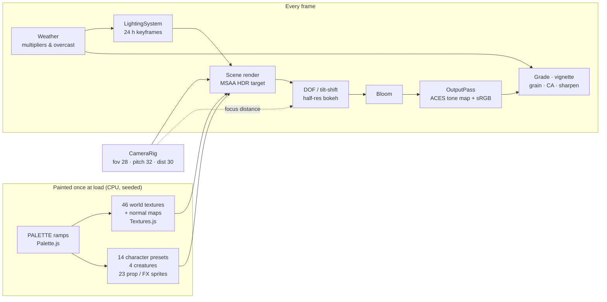

# Visual design — the Lumina HD-2D look

This document explains **what makes Lumina look like an HD-2D game** and where every part of that
look is set: pixel density and palette, how textures and sprites are painted, the diorama camera,
the depth-of-field / bloom / grade values the demo actually uses, the 24-hour lighting palette,
weather, particles, god rays, water, and the UI's visual language. Every number below was read
from the code; when you change one, change it in the file named next to it (and update this page).

| | |
| --- | --- |
| **Audience** | Artists and designers tuning the look; engineers and AI agents who need to know which constant produces which effect before touching it. |
| **Source of truth** | [`ARCHITECTURE.md`](../../ARCHITECTURE.md) §1 (the target), [`src/demo/config.js`](../../src/demo/config.js), `Game._tunePost` in [`src/demo/Game.js`](../../src/demo/Game.js), [`src/demo/Weather.js`](../../src/demo/Weather.js), [`src/demo/AtmosphereFog.js`](../../src/demo/AtmosphereFog.js), [`src/engine/pixel/Palette.js`](../../src/engine/pixel/Palette.js), [`src/engine/pixel/PixelCanvas.js`](../../src/engine/pixel/PixelCanvas.js), [`src/engine/pixel/Textures.js`](../../src/engine/pixel/Textures.js), [`src/engine/pixel/CharacterSprites.js`](../../src/engine/pixel/CharacterSprites.js), [`src/engine/render/PostFX.js`](../../src/engine/render/PostFX.js), [`src/engine/lighting/LightingSystem.js`](../../src/engine/lighting/LightingSystem.js), [`src/engine/fx/Particles.js`](../../src/engine/fx/Particles.js), [`src/engine/fx/GodRays.js`](../../src/engine/fx/GodRays.js), [`src/engine/ui/ui.css`](../../src/engine/ui/ui.css) |
| **Related docs** | [Render pipeline](../architecture/RENDER_PIPELINE.md) · module references [pixel](../architecture/modules/pixel.md), [sprite](../architecture/modules/sprite.md), [render](../architecture/modules/render.md), [lighting](../architecture/modules/lighting.md), [fx](../architecture/modules/fx.md), [world](../architecture/modules/world.md), [ui](../architecture/modules/ui.md) · [Level design guide](LEVEL_DESIGN_GUIDE.md) · [Performance](../architecture/PERFORMANCE.md) · [Features](../features/FEATURES.md) |

*Emberfall's Village Square at 17:14 (golden hour) — everything on this page in one frame.*

---

## 1. The seven ingredients

`ARCHITECTURE.md` §1 defines the target. This table maps each ingredient to the code that
produces it and to the section of this page that holds its tuning.

| # | Ingredient (ARCHITECTURE §1) | Produced by | Tuning |
| --- | --- | --- | --- |
| 1 | Pixel art everywhere at one density, normal-mapped | `TextureLibrary`, `CharacterSprites`, `PropSprites`, `PixelCanvas` (`src/engine/pixel/`) | [§2](#2-pixel-density-and-scale) – [§4](#4-textures) |
| 2 | Diorama camera: narrow FOV, looking down, far away | `CameraRig` (`src/engine/core/CameraRig.js`) + `CAMERA` in `src/demo/config.js` | [§6](#6-the-diorama-camera) |
| 3 | Strong depth of field / tilt-shift with bokeh | `PostFX` DOF (`src/engine/render/PostFX.js`, `shaders/DofShaders.js`) | [§7](#7-post-processing-dof-bloom-grade) |
| 4 | Rich lighting: warm sun, cool fill, flickering lanterns, day/night | `LightingSystem`, `LightPool`, `Sky` (`src/engine/lighting/`) | [§8](#8-the-24-hour-lighting-palette) |
| 5 | Bloom + colour grade + vignette + grain + CA | `PostFX` bloom and grade passes | [§7](#7-post-processing-dof-bloom-grade) |
| 6 | Atmosphere: motes, god rays, fireflies, leaves, smoke, water sparkle, wind, fog | `Particles`, `GodRays`, `Water`, wind uniforms, `installFogStart` | [§9](#9-weather), [§10](#10-particles-god-rays-and-water) |
| 7 | Ornate UI: gold-bordered dialog, serif type, banners | `src/engine/ui/*` + `ui.css` | [§11](#11-ui-visual-language) |

---

## 2. Pixel density and scale

| Constant | Value | Where | Meaning |
| --- | --- | --- | --- |
| `PPU` | 16 | `src/engine/constants.js` | Texels per world unit, for world textures **and** sprites. |
| `TILE_SIZE` | 1 | same | One map tile = one world unit. |
| `LEVEL_HEIGHT` | 0.5 | same | One terrain height level = half a unit (8 texels). |
| Character frame | 32 × 32 px | `CharacterSprites.js` | ≈ 2 × 2 units; adults are 27 px tall plus a 1 px outline (feet on row 30), children ≈ 20 px. |
| Creature frames | cat 24 × 16, dog 28 × 20, chicken 18 × 16, bird 16 × 16 | `CREATURE_DEFS` in `CharacterSprites.js` | Same 16 px per unit. |

Rules that keep the density consistent:

- **Magnification is always `NEAREST`.** Pixel textures are created through `makePixelTexture` /
  `PixelCanvas#toTexture` (`src/engine/pixel/PixelCanvas.js`). World textures keep mipmaps
  (linear-mipmap-linear minification, anisotropy 4) so distant ground doesn't shimmer; sprite
  sheets use `NEAREST` both ways with no mipmaps. Only the soft particle textures `smoke_puff` and
  `bokeh_soft` use linear filtering.
- **UVs are world-space and scaled by `meta(name).units`**, never "one repeat per face". Terrain
  tops and plaster repeat every 4 × 4 units (64 px), most walls, roofs and cloths every 2 × 2,
  details (window, door, crate, barrel, cliff…) are 1 × 1 or 1 × 2 decals. A texel is the same size
  on a roof, a cliff and a character.
- **Heights come in 0.5-unit steps**, and every stone texture with courses (`stone_wall`,
  `stone_brick`, `well_stone`, the `cliff` strata) uses 8 px rows, so any half-unit offset lines up
  with no seam.

At the diorama zoom (camera distances 24–36) a texel covers roughly 3–5 screen pixels (the
texture auditor's figure in [`docs/contracts/MODULE_NOTES.md`](../contracts/MODULE_NOTES.md)), which
is why mip level 0 is what you see around the player.

---

## 3. Palette and hue-shifted shading

Everything — terrain, props and characters — is painted from the ramps in
[`src/engine/pixel/Palette.js`](../../src/engine/pixel/Palette.js) (`PALETTE`). Sharing ramps is what
makes a pixel villager look like they belong on the pixel cobbles.

Every ramp runs **dark → light and is hue-shifted the way a pixel artist paints**: shadows go cool
and saturated, highlights warm and soft (e.g. `grass` runs `#1f3a2c` → `#d6e58a`, from blue-green
to yellow-green).

| Group | Ramps |
| --- | --- |
| Nature | `grass`, `grassDry`, `leaves`, `leavesAutumn`, `pine`, `dirt`, `sand`, `stone`, `stoneWarm`, `moss`, `water` (7 steps), `bark` |
| Building materials | `wood`, `woodGray`, `plaster`, `brick`, `roofRed`, `roofBlue`, `thatch`, `slate`, `metal`, `gold` |
| Cloth / accents | `red`, `blue`, `green`, `purple`, `yellow`, `cream`, `brown`, `black`, `white` |
| Characters | `skinLight`, `skinTan`, `skinDark`, `hairBrown`, `hairBlonde`, `hairBlack`, `hairRed`, `hairWhite` |
| Light / glow | `fire` (ramp), `glowWarm` `#ffc27a`, `glowCool` `#9fd8ff`, `outline` `#140f17` |

`rampAt(ramp, i)` clamps an index into a ramp.

**Generating new shades** — `shadeColor(c, amount)` in `PixelCanvas.js` is the one shading function
the whole engine uses (`rampFrom(base, n, spread)` builds a ramp with it):

| `amount` | Hue | Lightness | Saturation |
| --- | --- | --- | --- |
| negative (shadow) | moves toward **245°** (blue-violet) by 18 % of the hue distance × \|amount\| | − 0.42 × \|amount\| | × (1 + 0.15 × \|amount\|) |
| positive (light) | moves toward **55°** (warm yellow) by 18 % × amount | + 0.42 × amount | × (1 − 0.25 × amount) |

Use it (never plain `multiplyScalar`) whenever you need a darker or lighter version of a colour, so
new art stays on-palette.

---

## 4. Textures

[`src/engine/pixel/Textures.js`](../../src/engine/pixel/Textures.js) paints **46 textures**
(`TEXTURE_NAMES`) texel by texel from the palette, seeded (`new TextureLibrary({ seed: 1337 })` in
the game), lazily on first use.

| Family | Names |
| --- | --- |
| Terrain tops (4 × 4 units) | `grass`, `grass_dark`, `grass_flowers`, `dirt`, `dirt_path`, `cobblestone`, `stone_tiles`, `sand`, `farmland`, `moss_stone`, `riverbed`, `wood_deck` |
| Terrain sides | `cliff`, `grass_side`, `dirt_side` (1 × 1), `stone_wall` (2 × 2) |
| Buildings | `plaster`, `timber_frame`, `wood_planks`, `wood_planks_dark`, `log_wall`, `brick`, `stone_brick`, `roof_red`, `roof_blue`, `roof_thatch`, `roof_slate`, `door`, `window`, `chimney_stone` |
| Nature & props | `bark`, `leaves`, `leaves_autumn`, `pine`, `hay`, `cloth_red`, `cloth_stripe`, `metal`, `barrel`, `crate`, `fence_wood`, `rope`, `well_stone`, `lantern_glass`, `sign_board`, `flowerbox` |

Design principles (from the file header and the texture auditor's notes):

1. **Baked top-left key light.** Forms are painted with highlights on upper-left edges and shadows
   on lower-right ones — subtle, because the real sun does the rest.
2. **Every texture has a normal map.** Relief textures paint a height field next to the colour;
   `normalMapFromHeight` turns it into a tangent-space normal map, so bricks, cobbles, bark and
   roof tiles catch lantern light. `material()` sets a per-texture `normalScale` of about 0.45–0.8.
3. **Hand-placed detail, no visible repetition.** Cracks, moss, blades, wood grain and roof tiles
   are painted per texel; big surfaces are 64 px so a 20 × 20 field doesn't show a grid. (Known
   limit: the 1 × 1 cliff / `grass_side` / `dirt_side` faces repeat every unit along long cliffs.)
4. **Orientation conventions.** On terrain tops canvas-up points toward −Z (away from the camera),
   so grass blades stand up on screen; on walls canvas-up is world-up; on roofs canvas-up points to
   the ridge.
5. **Cliff faces wear a grass lip.** The top unit of a grassy cliff uses the legend's `lip`
   (`grass_side`, jagged grass hanging over the edge), the rest uses `side`. `TileMap` adds baked
   vertex ambient occlusion (darker inner corners and cliff bases) and organic grass fringes.
6. **Glowing parts are masks.** `window` and `lantern_glass` carry emissive masks (emissive colour
   `#ffb870`). Windows glow at night at emissive intensity 1.6, lantern glass at 2.4; both are driven
   by `LightingSystem.registerEmissive` (day 0 → night level).
7. **Cut-outs are binary.** `leaves`, `leaves_autumn`, `pine`, `fence_wood` and `flowerbox` use
   alpha-tested materials (`alphaTest 0.5`, double-sided), so their shadows are cut out too.

*`sandbox/props.html?mode=gallery` — every PropFactory prop in the shared texture set.*

---

## 5. Sprite style

*`sandbox/sprite_art.html` — each sheet is 6 columns (idle0, idle1, walk0–3) × 4 rows (down, left, right, up).*

**Painting** ([`CharacterSprites.js`](../../src/engine/pixel/CharacterSprites.js)):

- **Chibi proportions.** The head template is 12 × 11 px on a 27 px adult — about a third of the
  height. Children use the adult head on a ≈ 20 px body (a deliberately big-headed look).
- **Layered, then resolved.** Parts are drawn in z-order (body → legs → clothing → arms → head/face
  → hair → hat → cape → gear) into a material + shade label buffer, then resolved to per-character
  **5-tone ramps** `[deep, shadow, base, light, shine]` (`materialRamp`). Selective inner lines
  (hair over forehead, arm over torso) separate overlapping parts.
- **Outline.** A dark plum silhouette outline, `PALETTE.outline` `#140f17` — never pure black.
- **Light from the upper left.** The `right` row is the `left` row mirrored (so it is lit from the
  upper right), with asymmetric gear (sword, satchel, staff hand) redrawn on the correct side.
- **Animation.** Rows follow `DIRECTIONS` (`down`, `left`, `right`, `up`); `idle_<dir>` 2 frames at
  2.5 fps, `walk_<dir>` 4 frames (contact, passing, contact, passing) at 8 fps, `run_<dir>` the same
  frames at 13 fps. The demo plays idle "breathing" at 0.5–0.62 × speed, different per villager
  (`IDLE_SPEED` in `config.js`), so a crowd never breathes in lockstep. Walk speed 3.2 u/s, run
  5.6 u/s (`src/demo/Player.js`).
- **14 presets** (`CHARACTER_PRESETS`): traveler, swordsman, merchant, cleric, scholar, dancer,
  hunter, villager, farmer, elder, child, guard, innkeeper, bard. A `seed` on a preset adds a subtle
  deterministic colour variation for crowds; creatures are `cat`, `dog`, `chicken`, `bird`.

**Lighting the billboards** ([`src/engine/sprite/Sprite3D.js`](../../src/engine/sprite/Sprite3D.js)):
sprites are cylindrical billboards that all share `globalUniforms.uCameraYaw`. Their shading normal
is bent toward "up" and toward the camera, with wrap diffuse, so a sprite with the low sun behind it
never goes black. The demo pushes this a little further for every character and critter:

| `CHARACTER_SPRITE_OPTS` (`src/demo/config.js`) | Value | Engine default | Effect |
| --- | --- | --- | --- |
| `normalUp` | 0.6 | 0.55 | Shading normal leans to world-up: a low sun still grazes the figure. |
| `wrap` | 0.6 | 0.6 | Wrap diffuse `(N·L + w) / (1 + w)`. |
| `roundness` | 0.55 | 0.8 | Horizontal curvature so a lantern rims one side. |
| `emissive` / `emissiveIntensity` | `#ffe9d2` / 0.06 | — | Warm bounce fill (multiplied by the sprite's own texels). The 0.06 is only the starting value: `Game.init` registers every character / critter material with `registerEmissive(material, SPRITE_FILL)`, which rewrites `emissiveIntensity` every frame. |
| `SPRITE_FILL` | day 0.05, night 0.03 | — | The fill intensity actually used, `lerp(day, night, nightFactor)`: it fades at night, where lanterns take over. |

These values were lowered in the Emberfall art review: stacked with the sun they had blown faces
and white hair out to flat orange blobs at golden hour and noon (see
[history/DECISIONS.md](../history/DECISIONS.md)). Known trade-off: fully zoomed in (distance 18) at
golden hour sprites still read slightly hot.

**Shadows and readability:**

- Each sprite casts a full silhouette shadow through a sun-facing, shadow-only proxy quad, plus a
  soft blob contact shadow under the feet (`BlobBatch` draws all blobs in one instanced call on big
  levels).
- When a roof, the well or a tree crown hides the player, a **pale lilac x-ray silhouette** shows
  through (`src/demo/Player.js`): it writes depth (so the DOF keeps it sharp instead of blurring it
  with the roof), draws last (`renderOrder` 60), is pulled 1.3 units toward the camera so grass at
  the feet doesn't reveal it, and dims at night (`setSilhouetteLevel(lerp(1, 0.5, nightFactor))`).

---

## 6. The diorama camera

The engine's `CameraRig` defaults are the contract values (fov 28°, pitch 32°, distance 24 within
14–36). The game pulls the camera further back so the village reads as a miniature:

| `CAMERA` (`src/demo/config.js`) | Value | Notes |
| --- | --- | --- |
| `fov` | 28° | Narrow lens — little perspective distortion, strong "model" feel. |
| `pitch` | 32° | Looking down; per level `environment.camera.pitch` (clamped 10–80). |
| `distance` | 30 | Characters are about a tenth of the screen tall; per level `environment.camera.distance` (clamped 8–80). |
| `minDistance` / `maxDistance` | 18 / 42 | Z / X and the mouse wheel zoom in this range. |

Other framing behaviour (in `Game` and `CameraRig`):

- **Yaw** starts at 0: the camera sits on the +Z side and **looks north (−Z)**. Q / E orbit at
  70°/s within ±60° (`yawLimit`). Near the east / west map edges the allowed yaw toward the edge
  shrinks to 10° so the camera never swings out over the border forest.
- **Follow**: `followLambda` 5 /s, look-ahead 1.3 units in the walking direction, focus 1 unit
  above the feet.
- **Focus bounds** (`environment.camera.bounds`, one rect or `near` / `mid` / `far`) clamp the
  camera's focus point and are interpolated with the zoom, so the player stays in frame up to the
  map edges. Without them the game shrinks the walkable area by Emberfall's margins
  (`AUTO_BOUNDS_MARGINS` in `Game.js`).
- **High ground**: `environment.highGround { minY, pitch }` tilts the camera down while the player
  stands above `minY` — Emberfall's Windmill Hill uses 39° above y 3.2, so the blurred roofs below
  don't fill the frame.
- **Title screen**: the camera drifts around `environment.titleCamera` (yaw ± 18° on a slow sine,
  distance ± 3).

Because the camera always looks north, **anything tall hides what stands north of it**. That single
fact drives most of the level-layout rules in the [level design guide](LEVEL_DESIGN_GUIDE.md#2-the-camera-looks-north).

---

## 7. Post-processing: DOF, bloom, grade

The pipeline (scene → DOF → bloom → OutputPass tone map → grade) is described in
[RENDER_PIPELINE.md](../architecture/RENDER_PIPELINE.md). The **look** is set by the engine defaults
in `PostFX.settings` and the game's override in `Game._tunePost`:

| Setting | Engine default (`PostFX.js`) | **Demo value** (`Game._tunePost`) | What it does |
| --- | --- | --- | --- |
| `dof.focusRange` | 5 | **6** | Depth band (world units) that stays sharp around the focus. |
| `dof.maxBlur` | 12 | **13** | Max circle of confusion in px at 1080p (scaled with the buffer height). |
| `dof.nearScale` / `farScale` | 1.4 / 1.0 | **1.5 / 1.15** | Foreground blurs more than background — the tilt-shift feel. |
| `dof.tiltShift` | 0.35 | **0.42** | Strength of the screen-space tilt-shift term. |
| `dof.tiltCenter` / `tiltWidth` | 0.52 / 0.28 | **0.5 / 0.3** | Sharp horizontal band, centred. |
| `dof.bokehBoost` | 1.5 | **1.6** | Highlight gain inside the bokeh gather. |
| `dof.bokehThreshold` | 1.5 | 1.5 | HDR luminance above which specks scatter into bokeh discs. |
| `bloom.strength` / `radius` | 0.55 / 0.55 | **0.5 / 0.58** | |
| `bloom.threshold` | 0.82 | **1.05** | Above 1: sunlit sprites, white hair and spray stop blooming; lantern glass, emissives and sparkles still do. |
| `grade.exposure` | 1.0 | **1.03** | Post-tonemap multiply (scene exposure belongs to `LightingSystem`). |
| `grade.contrast` | 1.08 | **1.04** | |
| `grade.saturation` | 1.12 | **1.3** | Compensates the lower contrast. |
| `grade.temperature` | 0.08 | **0.04** | Weather adds its own offset (§9). |
| `grade.shadowsTint` | [0.02, 0.04, 0.08] | **[−0.04, 0.05, 0.15]** | Lifted, slightly teal shadows (ARCHITECTURE §1.5). |
| `grade.highlightsTint` | [0.06, 0.03, −0.02] | same | Warm highlights. |
| `grade.vignette` / `vignetteSoftness` | 0.5 / 0.55 | **0.55** / 0.55 | |
| `grade.grain` | 0.035 | **0.03** | |
| `grade.chromaticAberration` / `sharpen` | 0.0015 / 0.15 | same | |

Behaviour the numbers don't show:

- **Focus follows the player, not the camera.** While playing, `postfx.setFocus()` gets the view
  depth of the player's chest (feet + 0.9); the camera's focus point is clamped by bounds and would
  leave the player blurred near map edges.
- **Night gives back saturation**: the game sets `grade.saturation = base + weather offset −
  0.22 × nightFactor`, so blue nights don't turn neon.
- Tone mapping (ACES Filmic) happens **once**, in the OutputPass; the grade runs after it in display
  space. `LightingSystem` owns `renderer.toneMappingExposure`.
- Cost-driven choices: the DOF gather is capped at 64 taps (`maxTaps: 64`), MSAA is 4× below
  ~1.8 MP drawing buffers and 2× above; the drawing buffer is capped at about 2.1 MP and a
  resolution governor may lower the render scale to 0.7 ([performance](../architecture/PERFORMANCE.md)).

*`sandbox/postfx.html` — tilt-shift band, near/far blur and highlight bokeh.*

### Aerial perspective (fog start)

`installFogStart(camera.distance − 7)` ([`src/demo/AtmosphereFog.js`](../../src/demo/AtmosphereFog.js))
patches three.js' `fog_vertex` chunk so fog only begins **23 units from the camera** (at the default
distance of 30): the diorama around the player stays crisp and saturated while everything past it
melts into the horizon colour. It must run before the first material compiles; particles include the
same chunk. The final fog density is

`keyframe fog × tuning.fogMul (2.0) × weather fog × zoomFog × environment.fogScale`

(`Weather.update` writes the product into `LightingSystem.settings.fogMul`; the fog colour is the
keyframe's sky horizon colour.) `zoomFog = clamp(((base − 7) / max(1, distance − 7))², 0.4, 1)`,
where `base` is the level's camera distance (30 unless `environment.camera.distance` says otherwise)
and `distance` the current zoom: it thins the haze when you zoom out (a fixed fog start would
otherwise bury the focus band in orange fog at distance 42). `environment.fogScale` (default 1) lets
a big level keep its far layers (Starfall Vale: 0.65).

---

## 8. The 24-hour lighting palette

`LightingSystem` interpolates 13 keyframes (`DEFAULT_KEYFRAMES` in
[`LightingSystem.js`](../../src/engine/lighting/LightingSystem.js)) in **linear colour space with a
cyclic monotone cubic (PCHIP) spline**, so transitions never overshoot. Each keyframe drives the
sky (top / horizon / bottom), the directional light (sun, or moon when `moon` = 1), the hemisphere
fill, `FogExp2` density and colour, tone-mapping exposure, the night factor `uNight`, shadow
strength, sky glow and cloud cover.

The game applies `KEYFRAME_OVERRIDES` from `src/demo/config.js` (matched by name — both `night`
keyframes get the night override). **Bold** = demo override.

| Hour | Name | Sky horizon | Sun colour | Sun I | Hemi I | Fog | Exposure | Night |
| --- | --- | --- | --- | --- | --- | --- | --- | --- |
| 0.0 | night | `#1b2a5c` | `#7294ff` (moon) | **1.0** | **1.6** | 0.011 | **1.36** | 1 |
| 4.3 | late night | `#213062` | `#7a98ff` (moon) | **0.9** | **1.55** | 0.0115 | **1.36** | 1 |
| 5.25 | pre-dawn | `#5c5a92` | `#a0a6ea` (moon) | 0.16 | 1.05 | 0.014 | 1.26 | 0.86 |
| 6.1 | pink dawn | `#f59aa0` | `#ff7c6a` | 2.3 | 0.98 | 0.012 | 1.08 | 0.3 |
| 6.9 | sunrise | `#f8c0a0` | `#ffb88a` | 2.8 | 1.05 | 0.013 | 1.06 | 0.06 |
| 8.0 | morning | `#d6e6f0` | `#ffe6c0` | 3.2 | 1.05 | 0.011 | 1.02 | 0 |
| 12.2 | noon | `#c4e0f2` | `#fff4e2` | 3.5 | 1.1 | 0.009 | 1.0 | 0 |
| 15.3 | afternoon | `#dde2da` | `#ffe0b0` | 3.6 | 1.1 | 0.0095 | 1.0 | 0 |
| 17.2 | **golden hour** | `#f7a068` | `#ffb466` | 6.0 | 1.45 | 0.0098 | 1.12 | 0 |
| 18.45 | sunset | `#ec7e6c` | `#ff8050` | 3.1 | **1.45** | 0.0112 | **1.2** | 0.22 |
| 19.25 | purple dusk | `#8a5a9e` | `#c07aaa` | **0.85** | **1.62** | 0.013 | **1.46** | 0.62 |
| 20.05 | blue hour | `#2c3e82` | `#7090f4` (moon) | 0.38 | **1.5** | 0.0125 | **1.36** | 0.92 |
| 21.4 | night | `#1c2b5c` | `#7294ff` (moon) | **1.0** | **1.6** | 0.011 | **1.36** | 1 |

Night keyframes also get a brighter, bluer hemisphere (`hemiSky #3656c0`, `hemiGround #1a2042`);
golden hour gets a cooler ground bounce and sky fill (`hemiGround #7a6058`, `hemiSky #6a80d4`) so
long shadows stay lifted and slightly teal instead of muddy red-brown.

**Why these overrides:** the Emberfall art review measured nights as near-black away from the
lanterns and the old "Dusk" preset darker than night. Octopath nights are blue, not black; the
overrides raised the night fill and the dusk trough (see [DECISIONS](../history/DECISIONS.md)).

**Sun and moon paths** (`SUN_PATH`, `MOON_PATH` in `config.js`):

- `SUN_PATH = { noon: 12.6, lat: 32, dec: 14, refTime: 17.2, refAzimuth: −112 }` — at 17.2 h the
  sun stands about **25° up, behind and to the left** of the default view, so shadows rake long
  toward the lower right without swallowing the plaza, and god rays slant. (Noon elevation ≈ 72°;
  the sun rises about 6.0 h and sets about 19.2 h.)
- `MOON_PATH = { refAzimuth: 40 }` — the moon keys the night from the **front-right** (camera side),
  so the faces the camera sees are moonlit and hills don't read as black frames.
- The directional light glides between sun and moon during twilight; shadows stay on all night,
  just softer (keyframe shadow strength 0.35–0.6 from purple dusk to pre-dawn, 1 by day).

**Shadows:** one 2048² sun shadow map, `shadowExtent` 26 in the game, texel-snapped in light space so
shadows don't shimmer when the camera moves.

**Time of day in play:** the clock runs at `TIME_SPEED = 1/90` game hours per second (one game hour
≈ 90 s; a level can stop it with `environment.clock: false`). **T** glides (2 s, always forward) to
the next preset of `TIME_PRESETS` in `Weather.js`:

| Preset | Dawn | Midday | Golden Hour | Dusk | Night |
| --- | --- | --- | --- | --- | --- |
| Hour | 6.5 | 12.5 | 17.2 | 18.9 | 22.5 |

Levels start at `environment.timeOfDay` (default 17.2; Starfall Vale 17.4, Brightwater Crossing and
Willowmere 16.8).

| Dawn | Dusk | Night |
| --- | --- | --- |
|  |  |  |

### Point lights and glowing windows

- **At most twelve real point lights** (`MAX_POINT_LIGHTS` in `src/demo/World.js`), all created
  before the first frame (changing the light count would recompile every shader). A level with
  ≤ 12 light sources gets exactly one permanent light each (Willowmere has 6, Emberfall 12); a level
  with more gets 12 lights that `LightPool` hands to the lanterns around the camera, crossfading
  (0.35 s out, move, 0.35 s in) as you walk — see the
  [level design guide](LEVEL_DESIGN_GUIDE.md#9-lights).
- Flicker is **smooth noise**, not random jitter; each light has its own seed.
- Prop light values (`src/engine/world/props/LightProps.js`, `House.js`):

  | Source | Colour | Intensity (cd) | Distance | Flicker | Night only |
  | --- | --- | --- | --- | --- | --- |
  | Lamppost | `#ffb46b` | 12 | 9 | 0.2 | yes |
  | Wall torch | `#ff9a45` | 7 | 7 | 0.45 | no |
  | Campfire | `#ff8c3a` | 14 | 10 | 0.5 | no |
  | House door lantern (`light: true`) | `#ffb46b` | 6 | 7 | 0.25 | yes |
  | House window glow (`light: true` + `opts.windowLights`; unused in the shipped levels) | `#ffa65a` | 3 | 6 | 0.1 | yes |
  | `light` object (default) | `#ffb46b` | 8 | 8 | 0.2 | yes (configurable) |

- By day a night-only lamp burns at `dayIntensity` × its intensity: `lerp(0.05, 0.45, overcast)`,
  i.e. 5 % in clear weather, about 34 % in rain and 30 % in snow (overcast 0.72 / 0.62, §9). Lantern
  glass is dimmed to half brightness while the lamps are unlit, because its albedo is bright amber.

---

## 9. Weather

**R** cycles `clear → rain → snow` (`WEATHERS` in `Weather.js`); a level may start in rain or snow
(`environment.weather`). Weather is a set of multipliers blended smoothly (`damp(1.1, dt)` per
frame) on top of the time-of-day palette and the debug "tuning" base values:

| Parameter | clear | rain | snow | Drives |
| --- | --- | --- | --- | --- |
| `sun` | 1 | 0.26 | 0.45 | sun intensity multiplier |
| `ambient` | 1 | 0.9 | 1.15 | hemisphere fill multiplier |
| `fog` | 1 | 2.1 | 1.9 | fog density multiplier |
| `exposure` | 1 | 0.92 | 1.04 | exposure multiplier |
| `wind` (x, z) | 1 (1.0, 0.35) | 2.3 (2.2, 0.9) | 1.3 (1.2, 0.5) | `uWindStrength`, `uWind` (foliage sway, particles) |
| `temp` / `sat` | 0 / 0 | −0.12 / −0.24 | −0.3 / −0.42 | grade temperature / saturation offsets |
| `rays` | 1 | 0 | 0.25 | god-ray intensity |
| `dust` / `bugs` / `leaves` | 1 / 1 / 1 | 0.15 / 0 / 1.6 | 0 / 0 / 0.3 | particle-area intensities |
| `overcast` | 0 | 0.72 | 0.62 | grey the golden cast (below) |

- **Overcast** blends fog, sun and hemisphere colours toward their own luminance tinted
  `(0.9, 0.97, 1.12)` — rain and snow lose the golden cast without getting darker than intended.
- **Rainy villages glow**: by day, night-only lamps burn at `lerp(0.05, 0.45, overcast)` of their
  intensity and windows / lantern glass at `lerp(baseDay, 0.4 × night level, overcast)` — about
  30 % of their night brightness in rain (25 % in snow).
- **Snow settles**: `snowCover` (`src/demo/SnowCover.js`) whitens up-facing terrain, grass tips and
  roofs, building up over ~15 s of snowfall and melting in ~8 s.
- Rain (2600 streaks) and snow (2400 flakes) are camera-following emitters in a 44 × 16 × 44 /
  44 × 15 × 44 box, created at load with intensity 0 so their shaders are compiled before play.

| Rain | Snow |
| --- | --- |
|  |  |

---

## 10. Particles, god rays and water

**Particle presets** (`PARTICLE_PRESETS` in [`Particles.js`](../../src/engine/fx/Particles.js); one
draw call per emitter; continuous emitters are animated statelessly on the GPU):

| Preset | Look | Notes |
| --- | --- | --- |
| `dust` | tiny warm glints (`#ffe0a0`, additive) | Fades out at night (`nightVisibility` −0.85). The game adds 120 motes in a 20 × 4.5 × 16 box that follows the camera focus (`environment.dust`). |
| `fireflies` | green → gold glows (`#b6ff3c` → `#ffd23c`), blinking | **Night only** (`nightVisibility` 1). Starfall recolours them blue → warm for the sleeping stars. |
| `embers` | rising orange sparks (`#ff8a2a` → `#ff3a12`) | Campfires, forges. |
| `smoke` | soft grey puffs, normal blending, lit | Chimneys and campfires use a softer, greyer variant (`SMOKE` in `World.js`). |
| `leaves` / `petals` | tumbling lit cut-outs (autumn oranges / pinks) | Leaves thin out at night (× (1 − 0.6 · night)); petals stop in rain and snow. |
| `mist` | pale spray (`#eef8ff`, alpha 0.28) | Waterfall pools. Waterfall objects add their own mist (8 particles per unit of width, alpha 0.07 by default). |
| `sparkle` | 4-point stars, additive, very bright (hdr 6) | Glints on water pools; bursts at waterfall feet. |
| `rain`, `snow` | camera-following weather (`followCamera`) | The Weather's own emitters. They are in the catalog's `EMITTER_PRESETS` list, but no shipped level uses them as particle areas. |
| `footstep`, `splash` | bursts | Running dust; waterfall splashes. |

At the foot of every splashing waterfall within 30 units of the camera focus the game bursts
`splash` particles every 0.28 s and `sparkle` glints every 0.9 s (`Game._waterfallFx`).

**God rays** ([`GodRays.js`](../../src/engine/fx/GodRays.js)): soft additive shafts, each one quad
billboarded around its own axis, following the live sun direction (elevation steepened by
`steepness` 0.45 so beams stay readable when the sun is low), tinted by `uSunColor`, fading near the
camera, with height, fog, at night and with a high sun. The game creates them with `gain: 0.2` and
drives their intensity with two gaussians — strongest around **17.3 h** and a smaller peak around
**7.0 h**, never below 35 % — times the weather's `rays` factor (`Weather.update`). Levels place
them with `environment.godRayAreas` (3 shafts per area unless `count` says otherwise, at most 12);
without the field, `World._autoGodRayArea` puts one area over the walkable ground with one shaft per
~90 square units of it (1–6); `environment.godRays: false` switches them off.

**Water** ([`Water.js`](../../src/engine/world/Water.js)): flow-mapped, pixel-quantised ripples,
shore foam and a depth tint from a baked shore-distance texture, and sun / moon glints bright enough
to bloom. Per level: `water.flow`, `reflect`, `neutral` and `glint`. The level defaults
(`buildLevelTerrain` in `src/engine/level/ObjectBuilder.js`) are flow `[0, 0.45]` (south),
`reflect 0.2`, `neutral 0.2`, `glint 1` — a little more sky reflection and less hue
neutralisation than the `Water` class's own defaults (0.1 / 0.35). Emberfall, Brightwater Crossing
and Willowmere use them; Starfall's big calm lake uses `reflect 0.08, neutral 0.55, glint 0.45` —
with the defaults its review saw "pink milk covered in glitter" at golden hour. At night the game
multiplies water brightness by 0.66 and glints by 0.55.

---

## 11. UI visual language

The in-game UI is a DOM overlay ([`src/engine/ui/`](../../src/engine/ui/)) styled by
[`ui.css`](../../src/engine/ui/ui.css) — "deep navy → black translucent panels, thin warm-gold double
borders with small diamond ornaments, serif typography, cream text with a faint dark shadow, and slow,
elegant easing".

| Token (`.lu-root`) | Value | Use |
| --- | --- | --- |
| `--lu-gold` | `#c9a45c` | Borders, ornaments, name plates |
| `--lu-gold-hi` / `--lu-gold-pale` / `--lu-gold-lo` | `#e8cf8a` / `#f4e3b3` / `#8c6a32` | Ornament highlights and shading |
| `--lu-cream` | `#f3ead7` | Body text |
| `--lu-ink` | `#07080f` | Deepest background |
| `--lu-panel-top` / `--lu-panel-mid` / `--lu-panel-bot` | `rgba(26,34,66,.86)` / `rgba(12,16,34,.9)` / `rgba(4,5,12,.93)` | Panel gradient (top → bottom) |
| (`.lu-dialog__text .lu-hl`) | `#f3cf7a` | `{word}` highlights in dialog text |
| `--lu-serif` | Crimson Pro | Dialog and body text |
| `--lu-display` | Cinzel | Titles, banners, name plates, HUD place names |
| `--lu-pixel` | Pixelify Sans | Small numerics and key caps |

Fonts are bundled from `@fontsource` packages (imported in `src/engine/ui/UI.js`) — no CDN. Sizes use
`clamp()` against the viewport width (dialog body ≈ 23 px at 1600 px wide), so the UI reads from
1280 to 2560 px.

- **Dialog**: bottom-centre, about two thirds of the viewport wide, gold double border with diamond
  corner ornaments, speaker name plate on the top-left edge, typewriter text (the game sets 55
  characters/s; punctuation adds short pauses), a bobbing ▼ "next" indicator, choices with a 0.25 s
  input guard (`choiceGuard`) so mashing can't pick one by accident. `{word}` renders gold.
- **Area banner**: Cinzel title between ornamental lines with a serif subtitle, fading in and out —
  shown on entering a level and on first entering a region with a `banner`.
- **HUD**: clock with sun / moon icon and phase name, place-name plate (region name + subtitle),
  toasts, a controls legend (hidden below 540 px window height), a gold-framed minimap (north up,
  34 units across, hidden below 560 px; `environment.minimap: false` turns it off) and the
  full-screen world map (N / Tab).
- **Title screen**: level title in Cinzel over the live, drifting 3D scene.

| Dialog | Area banner | World map |
| --- | --- | --- |
|  |  |  |

The **level editor** deliberately uses a different language — a dense dark tool UI in `system-ui`
(`src/editor/editor.css`) with navy / gold accents and Cinzel only for the logo, the level name
and the About dialog ([EDITOR.md](../architecture/EDITOR.md)).

---

## 12. Where to change what

| I want to… | Change | File |
| --- | --- | --- |
| Make the whole game warmer / cooler, more or less saturated | `grade.temperature`, `grade.saturation` in `_tunePost` (weather adds offsets) | `src/demo/Game.js` |
| Widen / narrow the sharp band | `dof.focusRange`, `tiltWidth`, `tiltShift` | `src/demo/Game.js` |
| Make more things bloom | lower `bloom.threshold` (below 1 sunlit sprites start to glow) | `src/demo/Game.js` |
| Brighten nights or dusk | `KEYFRAME_OVERRIDES` (`hemiI`, `exp`, `sunI`) | `src/demo/config.js` |
| Move the golden-hour sun | `SUN_PATH.refAzimuth` / `lat` / `dec` | `src/demo/config.js` |
| Change how far the camera sits | `CAMERA`, or per level `environment.camera` | `src/demo/config.js`, level JSON |
| Thin the haze on one level | `environment.fogScale` | level JSON ([LEVEL_FORMAT](../specs/LEVEL_FORMAT.md)) |
| Calm a lake's sparkle | `water.glint` (and `reflect` / `neutral`) | level JSON |
| Change character shading | `CHARACTER_SPRITE_OPTS`, `SPRITE_FILL` | `src/demo/config.js` |
| Add a colour | a new ramp in `PALETTE`, shades via `shadeColor` | `src/engine/pixel/Palette.js` |
| Try values live | the debug panel (` or F1): Time & Weather, Post FX, Lighting, Camera, Atmosphere, Render | `src/demo/DebugControls.js` |

Small levels (≤ 64 tiles) must keep looking exactly as before any engine change — compare against
the baseline screenshots as described in [TESTING_AND_VERIFICATION](../development/TESTING_AND_VERIFICATION.md).
Known look limitations (night brighter than dusk in lantern-lit places, the silhouette reading as a
pale figure, cliff texture repetition) are tracked in [KNOWN_ISSUES](../ai/KNOWN_ISSUES.md).
