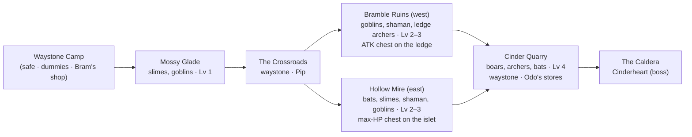
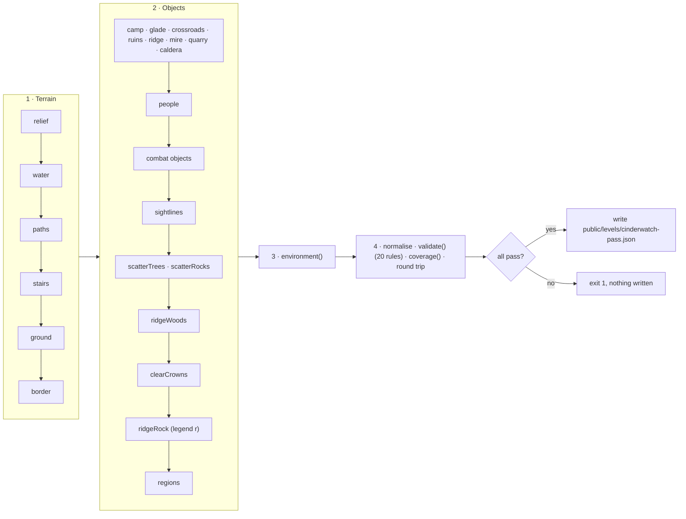

# Cinderwatch Pass — Where the Old Fires Wake

The design document of **Cinderwatch Pass**, the combat demo level: a 96 × 120 mountain pass climbed
from a safe camp at the south edge, through a meadow, over one of two branches (the Bramble Ruins or
the Hollow Mire) and across a quarry, to Cinderheart's caldera. It is the only shipped level with
enemies, so it is the only one that turns the ARPG combat of
[COMBAT.md](../../contracts/COMBAT.md) on (automatically: it has `enemy` objects and no
`environment.combat` key). Like Starfall Vale it is **generated** by a deterministic,
self-validating script; this page documents what the script builds and how to change it.

| | |
| --- | --- |
| **Audience** | Designers and AI agents extending or testing the combat level; anyone writing a level generator with enemies. |
| **Source of truth** | [`tools/make-cinderwatch-pass.mjs`](../../../tools/make-cinderwatch-pass.mjs) (the generator — edit this) and its helpers [`tools/lib/levelgen.mjs`](../../../tools/lib/levelgen.mjs); [`public/levels/cinderwatch-pass.json`](../../../public/levels/cinderwatch-pass.json) (its output — never hand-edit). The binding design is [COMBAT.md §15](../../contracts/COMBAT.md#15-demo-level-cinderwatch-pass). |
| **Related docs** | [COMBAT.md](../../contracts/COMBAT.md) (the combat contract: enemies, boss, waystones, chests) · [Level design guide](../LEVEL_DESIGN_GUIDE.md) · [Object catalog](../../specs/OBJECT_CATALOG.md) (`enemy`, `chest`, `waystone`) · other levels: [Starfall Vale](starfall-vale.md), [Emberfall](emberfall.md), [Brightwater Crossing](brightwater-crossing.md), [Willowmere](sample-hamlet.md) |

```bash
node tools/make-cinderwatch-pass.mjs              # regenerate (≈ 2 s); refuses to write if a check fails
node tools/make-cinderwatch-pass.mjs --check      # write nothing; exit 1 unless the file matches byte for byte
node tools/make-cinderwatch-pass.mjs --out=<file> # write elsewhere (e.g. a scratch copy)
node tools/make-cinderwatch-pass.mjs --ascii      # also print the tile map
node tools/make-cinderwatch-pass.mjs --quiet      # no report (errors still go to stderr)
node tools/make-cinderwatch-pass.mjs --force      # write a failing level for inspection (exit code stays 1)
```

Play it: `index.html?level=cinderwatch-pass` (`&autostart=1` skips the title). Edit (view) it:
`editor.html?open=cinderwatch-pass`. Tour it: `sandbox/cinderwatch.tour.json` (below). The
player's guide to it — controls, the HUD, a light-spoiler walk up the pass and the bestiary — is
[PLAYING_THE_GAME.md §15](../../user/PLAYING_THE_GAME.md#15-combat-cinderwatch-pass).

| Waystone Camp (start) | Bramble Ruins (a fight) | The Caldera (Cinderheart, phase 3) |
| --- | --- | --- |
|  |  |  |

*Captured with the harness at 1280 × 720 (2026-09-28, retaken after the known-issues pass: the
moved lodge and campfire, the magma crust); the fight and boss frames were set up with the combat
test hooks in god mode and stepped to a frame with a telegraph on screen.*

---

## Concept

*The Cinderwatch kept the old fires of the pass asleep for a hundred years. This spring the watch
fire went out, and the pass woke up: slimes in the glade, goblins squatting in the ruined keep,
bats over the mire — and something big breathing in the caldera.*

The traveller starts at golden hour (16:48; **the clock is stopped**, `environment.clock: false`, so
a twenty-minute run never turns into night — T still cycles the hour) in the Waystone Camp, where
Captain Maren's drillmaster script teaches the controls on three straw dummies. The pass is climbed
south → north, up the screen, so the camera always looks ahead:



Both branches end on the quarry lip and are balanced (≈ 189 XP each): the Ruins give the attack
upgrade and the ridge pocket's gold and draught, the Mire the max-HP upgrade; the quarry chest's
max-MP upgrade is on either way. The player reaches Cinderheart at level 5 either way (the XP pacing
of COMBAT.md §15.3).

| Fact | Value |
| --- | --- |
| Name / slug | `Cinderwatch Pass` (frozen: it seeds the terrain noise) / `cinderwatch-pass` |
| Size | 96 × 120 tiles; the big-level build path (> 64) |
| Objects | 277: 95 rocks, 57 trees, 24 enemy groups (53 enemies incl. 3 dummies and the boss), 14 particle areas, 11 fences, 10 barrels, 9 regions, 7 campfires, 7 crate stacks, 6 chests, 5 bridges, 5 villagers, 4 benches, 4 signposts, 3 lampposts, 3 critter groups, 3 waystones, 2 houses, 2 crates, a haystack, a market stall, a flower box, a wall torch, a waterfall, a `light` |
| Tiles | 6865 walkable, 382 water; height levels 0–12 |
| Custom legend chars | `e` — the glade brook, flowing east (`flow: [0.45, 0]`); `q` — dressed stone (the quarry's cut faces and stacked blocks: `stone_tiles` top, `stone_wall` sides, blocked); `r` — crag (Cinder Ridge's 324 rock tiles: `moss_stone` top, the on-demand `crag` rock-face texture on the sides, blocked; set by `ridgeRock()` after all scattering, so the seeded scatter is unchanged) |
| Water | `waterLevel` 0.4, `flow [0, 0.45]`, `reflect 0.12`, `neutral 0.45`, `glint 0.6` |
| Spawn | (48.5, 113.5) facing up — the camp's south road |
| Light descriptors | exactly 12 (static: one permanent point light each, not pooled) |
| Interactables | 2 doors, 4 signposts, 6 chests, 3 waystones; 5 villagers with 14 pages (two of them run the combat shop) |

---

## Layout

| Zone | Rect (x; z) | Ground level | What is there |
| --- | --- | --- | --- |
| Waystone Camp | 30–66; 99–117 | 2 | the lodge (46.5, 104.75; 4 × 3, no chimney), the cobbled campfire square (`campfire_camp` at (47.5, 110)), the sparring yard with 3 dummies, Bram's stall (58.5, 104.5), `waystone_camp`, a palisade along z 98.5 with the gate at x 45–52 (fences down both flanks), the secret chest behind crates in the north-east corner, hens and a cat |
| Mossy Glade | 7–89; 80–98 | 2 (3 below the crossroads) | meadow, flower beds away from the slime homes, the east-flowing brook — about two tiles wide, meandering ±1.5 u across the map (`BROOK`), straight on rows 93–94 only under its two bridges (x 28.5 and 48.5) — with sandy, reedy banks and stones at the bends, the west chest under a lone oak, petals, god rays |
| The heath and the fen | 15–37 and 59–92; 72–81 | 3 / 1–2 | wooded margins either side of the crossroads (the heath is part of the Ruins region, the fen of the Mire) |
| The Crossroads | 37–59; 72–81 | 3 | the stone-flagged junction round `waystone_crossroads`, the three-board signpost, `lamppost_crossroads`, Pip |
| Bramble Ruins | 3–41; 44–71 | 4; the archer ledge 6 (x 3–23, z 45–57) | the broken south wall with its gate (goblins), the goblins' camp and fire (`campfire_ruins`), the court and the shaman, the ledge stair (x 16–18, rising north), the Old Keep (a two-storey stone house at (30.5, 53), 5 × 3.5, `torch_keep` on its south wall), broken wall stubs, the **north rampart** (row z 44, x 3–31, blocked, level 8–9: 1–1.5 u above the ledge, 1.5–2 u above the lip — the ledge archers and the quarry's west pack cannot see each other, rule 19), the east lane to the quarry lip (the Ruins open onto the lip east of the rampart) |
| Cinder Ridge | 42–53; 44–71 | blocked rock 4–11 (legend `r`: crag sides) | a craggy spine of broken rock faces (the `crag` texture: upright rock pieces split by dark fissures, no strata): a crest of broken rock clumps (level 9–11) with pines and boulders, and flanks that drop in a few tall cliffs rather than a stair — a one-to-two-tile shelf at level 6 above the Ruins (4), a two-tile shelf at level 4 above the Mire road (2), a level-7 shelf toward the lip and a level-5 one behind the crossroads; the shelf edges wander ±1.5 tiles along the flank (`ridgeLevel`); low at its north end, with no pines there (the lip and the Quarry Waystone stay in view behind it); the ridge pocket (x 40–43, z 57–62, level 6) reached by a stair from the Ruins holds `chest_ridge` |
| Hollow Mire | 54–92; 44–71 | 2 (the ridge-foot road) / 1 | the still pond by the road, the great pond round the islet, three flat boardwalks (the islet is reached only by one), sand banks with reeds, the quarry spring's waterfall `fall_mire` into its plunge pool, the marsh light (`light_mire`: a teal will-o'-wisp hovering 2.4 u over a mossy standing stone by the great pond — a steady teal core of two `fireflies` at 2.2 u and six motes rising from 1.3 u, `#8af2ff` → `#3cc6ea`, no blinking, shown day and night), mist and fireflies, the Mire → quarry stair at x 56–58, z 44–46 (level 2 → 5, rising north, at the foot of the ridge's east flank) |
| Cinder Quarry | 3–92; 26–43 | the lip 5 (z 37–43) / the upper terrace 6 (z 26–36) | dirt, moss and sand floors, ragged cut-stone pads, two stepped **cut faces** of dressed stone at the terrace's back wall (x 4–21 and 74–91, benches 1–4 levels high, `QUARRY_FACES`), stacked dressed blocks on the lip and the terrace (charge-stun targets like the rock pillars), a gravel **spoil heap** one level up between the goblins' yard and the arena road, Odo's camp (`campfire_quarry`, `waystone_quarry`), the goblins' salvage pile, a stone-cutters' yard, the railing above the Mire, the arena road; no scatter on the strip under the caldera's south cliff; the woods behind it stand two levels higher |
| The Caldera | 30–66; 4–25 | the arena 8 (tiles x 36–60, z 8–22) | stone flags and a ring of cobbles, the four brazier campfires, a blocked level-9 ledge on the east and west sides and the level-11 rim (N / E / W); the stair from the terrace to the gate (x 46–51, z 23–24, level 6 → 8); embers, the braziers' own smoke, god rays |
| Border | the rest | — | forest (`T`) three tiles deep round the map (four in the north); the woods beside the caldera sit below the rim so their trees stay under the arena's view rays |

### Encounters (explicit ids, COMBAT.md §15.3)

| Where | Groups (kind × count, level) |
| --- | --- |
| Camp | `dummies` (dummy × 3) |
| Glade | `glade_slimes_w` (slime × 3, 1), `glade_slimes_n` (slime × 4, 1; at (38.5, 88.5)), `glade_slimes_e` (slime × 3, 1), `glade_goblins` (goblin × 2, 1) |
| Ruins | `ruins_gate_goblins` (goblin × 3, 2), `ruins_slimes` (slime × 2, 2), `ruins_court` (goblin × 2, 3), `ruins_shaman` (shaman × 1, 3), `ruins_archers_w` (archer × 2, 2, ledge), `ruins_archers_n` (archer × 2, 3, ledge; at (19.5, 49.5)) |
| Mire | `mire_bats_s` (bat × 3, 2), `mire_slimes` (slime × 3, 2), `mire_bats_islet` (bat × 3, 3), `mire_bats_n` (bat × 3, 3), `mire_shaman` (shaman × 1, 3), `mire_goblins` (goblin × 2, 3, at the stair foot) |
| Quarry | `quarry_boar_w`, `quarry_boar_e` (boar × 1, 4), `quarry_boar_elite` (boar, 4, elite "Old Ironhide"; at (56.5, 32.5), radius 1, `spotOffsets [[0, 0]]`), `quarry_goblins` (goblin × 3, 4), `quarry_archers` (archer × 2, 4), `quarry_bats` (bat × 2, 4) |
| Caldera | `cinderheart` (golem, 6) with `arena { minX: -12, maxX: 12, minZ: -6.5, maxZ: 8.5 }` and `gate [-2.5, 8.5, 2.5, 8.5]` (the arena x 36.5–60.5, z 8–23; the gate x 46–51 at z 23) |

Two groups carry an `area` (relative scatter rect) that keeps their start spots off a bank edge:
`glade_slimes_w` (not on the brook's bank) and `mire_slimes` (not on the still pond's bank or the
west boardwalk). Every group's start spots come out the same whether the game tests plain tiles or
full standability (rule 4 below), so they do not depend on how strict the combat system's test is.

### Waystones, chests, people

| Kind | Objects |
| --- | --- |
| Waystones | `waystone_camp` (53.5, 107.5) "Camp Waystone" · `waystone_crossroads` (48.5, 77.5) "Crossroads Waystone" · `waystone_quarry` (48.5, 42.5) "Quarry Waystone" |
| Chests | `chest_camp_secret` (63.5, 101.5) gold 40 · `chest_glade` (15.5, 86.5) gold 20 + 1 draught · `chest_ruins_ledge` (10.5, 50.5) attack · `chest_ridge` (42.5, 60.5) gold 30 + 1 draught · `chest_mire_islet` (78.5, 60.5) max HP · `chest_quarry` (84.5, 30.5) gold 30 + 1 draught + max MP |
| Villagers | Captain Maren (swordsman, `script: 'drillmaster'`, 2 fallback pages) · Bram (merchant, `script: 'shopkeeper'`, `action: 'shop'`, `item: 'Healing Draught'`, 2 pages — the second: "Whetstones, ironbark tonic, a warding charm or two — the watch pays me in stories, so the rest of you pay in gold."; posted beside his stall, not behind it — KNOWN_ISSUES PROP-13) · Sister Ilse (cleric, 3 pages on waystones) · Pip at the crossroads (hunter, 3 pages naming what each branch offers) · Odo on the quarry lip (guard, `script: 'shopkeeper'`, `action: 'shop'`, `item: 'Healing Draught'`, 4 pages: bait the charge into a brazier, roll *through* the rings toward him, step out of the magma, and "The watch keeps its last stores up here — draughts, whetstones, tonic. …"; after the first visit his menu's *Tell me again* replays the hints) |

On a peaceful level (or with `environment.combat: false`) chests and waystones are only examined
("The chest is locked tight." / "An old waystone hums quietly."); on Cinderwatch the combat system
turns them into *Open* and *Rest* (COMBAT.md §6.12). The two shopkeepers sell the Healing Draught
(25 gold) and three one-time wares — Whetstone ATK +2 (120), Ironbark Tonic max HP +15 (90),
Warding Charm DEF +3 (150) — through a menu (the gold sink of COMBAT-12, COMBAT.md §6.12).

### Lights (exactly 12)

`campfire_camp`, `lamppost_camp_w`, `lamppost_camp_e`, `lamppost_crossroads`, `campfire_ruins`,
`torch_keep`, `light_mire` (the marsh light: teal `#4fc4dc`, intensity 4.5, range 9, 2.4 u up, burns by day too), `campfire_quarry` and the four braziers
`brazier_nw` / `ne` / `sw` / `se`. No house has `light: true` and nothing else emits a point light:
with 12 descriptors every light is permanent (no pooling), and the caldera keeps all four brazier
lights during the boss fight. The waystone crystals glow through bloom only (no light descriptors).

### Regions (smallest first; first match wins)

`region_caldera` "The Caldera" (no banner) · `region_camp` "Waystone Camp" (*Straw dummies and a warm
fire · Safe*) · `region_crossroads` · `region_ridge` "Cinder Ridge" · `region_glade` "Mossy Glade"
(*Slimes and goblins · Lv 1*) · `region_ruins` "Bramble Ruins" (*Goblins, archers and a shaman ·
Lv 2–3*) · `region_mire` "Hollow Mire" (*Bats, slimes and a shaman · Lv 2–3*) · `region_quarry`
"Cinder Quarry" (*Ironhide boars and archers · Lv 4*) · `region_pass` "Cinderwatch Pass" (the whole
map).

### Environment

`timeOfDay 16.8`, `clock: false`, weather clear, forest border, outer scenery, god rays, dust, music;
`camera { distance: 28, pitch: 34 }`; `highGround { minY: 3.4, pitch: 38 }` (the arena and the
ledges); the title card, with the title camera drifting over the Hollow Mire — the falls from the
quarry lip, the ponds, boardwalks and reeds (`titleCamera { x: 78, z: 52, y: 1, driftX: 4, driftZ: 2,
distance: 34 }`); `fogScale 0.7`;
`scenery.southGap 8`; `forest.areas` (pines north of z 44, broadleaf woods south of it); god-ray
areas over the glade and the caldera; flower areas over the camp and the glade's slime-free parts,
shrub areas over the ruins and the mire's edges. There is **no `combat` key**: combat turns on
because the level has `enemy` objects.

---

## Pacing and rewards

The numbers behind "the player meets Cinderheart at level 5 either way" (COMBAT.md §15.3; XP per
enemy from `ENEMY_DEFS`, scaled by the group's level, §7.2):

| Stretch | Enemies | XP (≈) | Player level after it | Rewards on the way |
| --- | --- | --- | --- | --- |
| Camp | 3 dummies (no XP) | 0 | 1 | the drill's 2 draughts; the hidden camp chest (40 gold) |
| Mossy Glade | 10 slimes, 2 goblins (Lv 1) | 84 | 2 (Ember Bolt) | the glade chest (20 gold, a draught) |
| One branch — Ruins **or** Mire | Ruins 12 foes, Mire 15 (Lv 2–3) | 189 | 3 | Ruins: ATK +3 on the ledge, the ridge pocket's 30 gold and a draught · Mire: max HP +20 on the islet |
| Cinder Quarry | 3 boars (one elite), 3 goblins, 2 archers, 2 bats (Lv 4) | 370 | 5 (Radiant Nova at 4) | the quarry chest (30 gold, a draught, max MP +10) |
| The Caldera | Cinderheart (1800 HP, ATK 22, phases at 70 % / 35 %) and up to 6 bat adds | 400 | 6 | its core (max HP +20), 150 gold, the results card |

Doing both branches gives 832 XP before the boss — still level 5. The boss fight's length has a
floor: a greedy scripted player (god mode, always attacking) needs 39.9 s at Lv 5 (phases
12.5 / 13.35 / 14.0 s; the contract asks ≥ 30 s and ≥ 7 s for phase 3), 34.7 s (phase 3 11.4 s)
with every chest and shop ware.

**Balance** (tuned 2026-09-28, KNOWN_ISSUES COMBAT-12; measured with the fixed-step play-through bot
in its expert and seeded human settings, boss-only probes and the greedy runs; the bat has 24 HP /
ATK 8 and Cinderheart ATK 22 since):

| Stretch | Time | Damage taken (shares of max HP) | Design intent |
| --- | --- | --- | --- |
| Mossy Glade | — | 0 (expert, both routes); 0.08 (human, full route) | teaches |
| Bramble Ruins | 94–110 s | 0.24–0.74 | the harder branch: ATK and more gold |
| Hollow Mire | 50–70 s | 0–0.29 | the gentler branch: max HP (still gentler than the Ruins — open) |
| Cinder Quarry | 74–181 s | 0.14–0.96 (the hardest normal zone in 6 of 8 runs) | the last step up |
| Cinderheart | human model at 30–35 % uptime 83–114 s (mean 95.5 s; target 90–120 s); expert 45–87 s, no fall in 8 runs | the human model falls in 7 of 18 probes, mostly late in phase 3 with the draughts gone (0.72 falls per run, was 1.28) | a real fight, deaths possible but not the norm — a human play-test is still open |

Gold now has somewhere to go: a thorough player reaches the quarry lip with 262–351 gold, buys two
wares at Odo's and the third (plus draughts) after the quarry chest; gold left at the end is
158–286 (454–634 with nothing to buy before). The final expert run: 304.35 s, Lv 6, 36 kills, one
planned fall, all three wares bought, Cinderheart down in 44.5 s (digest `54c13fa2`); the human
model: 390.7 s, the boss won first try in 75.0 s with 2 draughts — after the goblin back-hop
fix (KNOWN_ISSUES COMBAT-24, 2026-10-01; the expert run is unchanged) 378.5 s, the boss first try
in 63.5 s with one draught (digest `d99e2c65`).

---

## How it was made

The generator runs these passes in order, all seeded (`RNG`, `fbm2`, `hash2`, `hashString` — never
`Math.random`, never a date):



- **Helpers.** [`tools/lib/levelgen.mjs`](../../../tools/lib/levelgen.mjs) holds copies of Starfall's
  helpers, parametrised by a grid object (`createGrid`: the terrain stamps; `createPlacer`: `add`,
  the approximate colliders — with `chest` circle r 0.45 and `waystone` circle r 0.5 —, keep-clear
  zones and the small builders; `createWalkModel`: the quarter-unit walk BFS and the route
  Dijkstra, with an optional forbidden area; `createOcclusion`: the crown / roof / terrain / forest
  view-ray model at any camera yaw and pitch; `scatterTrees` / `scatterRocks`;
  `normalizedChanges`, `canonicalObject`). Starfall's generator is not refactored onto it.
- **Terrain.** The map starts as forest; every zone is carved out of it. The ridge is blocked
  rock: each flank is a band or two (`ridgeLevel`: the Ruins side 6, the Mire side 4, the lip end
  7, the crossroads end 5) whose inner edge wanders with the noise, then the crest's clumps of
  9–11 — a few tall cliffs instead of one level per tile, which read as stacked planks. Rules 14
  and 19 re-prove the fights at its foot. The caldera's east and west rims rise through a blocked
  level-9 ledge before the level-11 rim, and the woods beside the caldera stand at level 7, below
  the arena's view rays.
- **Scatter.** Trees and rocks follow per-zone rules (`TREE_RULES`, `ROCK_RULES`) and avoid every
  enemy home (radius + 1.2), the boars' four 9.5 u axis lanes and the terrace strip under the
  caldera's south cliff. `ridgeWoods()` then puts pines on the crest (none north of z 51) and up to
  30 boulders on the shelves and among the crest's blocks. `clearCrowns()` finally drops scattered
  trees whose crowns hide a villager, door, sign or campfire (yaw 0) or a chest or waystone (any of
  yaw −60 / 0 / +60; a crest pine hid the ridge pocket's chest at +60), hide more than half of a
  walker on the two roads along the ridge (`RIDGE_ROADS`) at yaw ±60, cover any arena point
  (> 25 % at yaw −60 / 0 / +60) or cover more than 10 % of an enemy home's views (rule 14 allows
  15 %). A tree-only avoid (`treeAvoid`) keeps trees out of the keep's back yard (from the
  rampart to the keep, keep.x ± 5.1), so moving the keep did not reshuffle the scatter. Last,
  `ridgeRock()` turns the ridge's 324 blocked rock tiles into the crag char `r`.
- **Moves from the design** (printed by every run): the four braziers moved 1 u toward the arena
  centre (z 9.5 → 10.5, 21.5 → 20.5) so they stand ≥ 2 u inside the arena edges (rule 9); the
  waterfall stands at (79.5, 44), the tile edge between the spring pool and the plunge pool, not at
  (79.5, 44.5) (rule 13); `glade_slimes_n` sits at (38.5, 88.5), not (40.5, 87.5), and
  `quarry_boar_elite` at (56.5, 32.5) with radius 1 and one spot at home, not (55.5, 32.5) with
  radius 1.5 — a player resting at the Crossroads / Quarry Waystone is out of their sight (rule 5);
  `ruins_archers_n` sits at (19.5, 49.5), not (19.5, 47.5) (rule 14: the north rampart hides the
  lip side of its home disc; then rule 20: a fight with `quarry_boar_w` drifting under the rampart
  came within 3 u of a roaming archer); `light_mire` moved 0.8 u onto its standing stone; the lodge
  stands at (46.5, 104.75), 4 × 3 without a chimney (with `lamppost_camp_w`, its flowers and the
  camp cat 2 u south and 0.5 u west), the campfire at (47.5, 110) to keep the square open, and the
  keep at (30.5, 53), 3.5 u deep, with `torch_keep` (29, 54.87) (rule 13: no walker behind a roof
  above the knee on a path tile — both hid path tiles before, KNOWN_ISSUES COMBAT-13).

### `validate()` — COMBAT.md §15.5

| # | Rule | Current result |
| --- | --- | --- |
| 1 | `normalizeLevel` zero warnings, `validateLevel` no errors, `normalizedChanges` empty, byte-stable round trip (also through `parseLevel`) | ✓ |
| 2 | walk BFS from the spawn: no unreachable walkable pocket of 1 u² or more (16 quarter-unit nodes) | 94382 of 94385 nodes reachable |
| 3 | routes ≤ 1.5 × straight + 3 | spawn → crossroads 35.2 u; crossroads → quarry via the Ruins (Mire forbidden) 47.4 u, via the Mire (Ruins forbidden) 47.0 u, both for 35.0 straight (limit 55.5); quarry → arena centre 29.0 u |
| 4 | every ground start spot standable and reachable; flier spots over ground or water within 8 u of reachable ground; the spots identical under a plain tile test and the standable test | ✓ |
| 5 | non-dummy homes ≥ 20 u from the spawn, ≥ 12 u from every waystone and villager; a player **resting at a waystone** (reachable ground within 2.5 u of it) wakes no pack: no member at its start spot or roaming its home radius round it is within 3 u, or within its aggro range with line of sight (the projectile model), at a height difference < 1.5 | ✓ |
| 6 | ground home discs (radius + 2) ≥ 70 % walkable | ✓ (lowest 73 %: `glade_slimes_n`, beside the brook's bend) |
| 7 | boars: ≥ 2 of 8 directions with 8 u of straight, same-level ground (move radius 0.45) | boar_w E W · boar_e E W · elite E W N |
| 8 | archers: LOS by the projectile height model (ground + 0.9 to ground + 0.9, blocked where the terrain is above the path − 0.1 or inside a collider) to reachable ground 5–9 u away in ≥ 3 of 8 directions; ledge archers see the floor below | ruins_archers_w 8, ruins_archers_n 6 (both incl. the floor below), quarry_archers 7 |
| 9 | the arena: one level, ≥ 95 % walkable, sealed but for the gate, no other group inside, the boss home inside, every inset point ≤ 25 % covered at yaw −60 / 0 / +60, braziers ≥ 2 u inside | worst cover 0 % over 966 views |
| 10 | chests: the spot 0.8 u in front standable and reachable; chest and waystone footprints flat and dry | ✓ |
| 11 | ≥ 3 waystones, reachable; `waystone_camp` ≤ 10 u from the spawn | 7.8 u |
| 12 | light descriptors (the editor's `countLights` rule) ≤ 12 | 12 |
| 13 | Starfall's prop rules: props on flat dry ground, no overlaps, doors clear, paths unblocked, stairs directions, waterfall drop, bridges bank to bank and walkable end to end, no villager / door / sign / campfire / chest / waystone behind a roof, no crown hiding half a sight target; **no walker behind a roof above the knee on a path tile** (an error since 2026-09-28: the knee, 0.25 u, at six points per tile — the centre, the south edge, near both sides — against a roof model with the slab, the ridge cap, eaves and barge boards and a chimney box at every spot the house RNG can put it), and no wall or cliff hiding a walker to the waist at a path tile's centre (where one hides only the legs is listed) | ✓ (0 of 658 path tiles; legs behind a wall on 10 tiles of the lip road's row z 41, the rampart's merlons — KNOWN_ISSUES COMBAT-22) |
| 14 | every non-dummy home disc (radius + 3, 1 u grid) at yaw −60 / 0 / +60: ≤ 15 % of the views > 25 % covered by crowns, roofs, terrain or forest | worst 11.6 % (`quarry_boar_w`, the north rampart south of its disc) |
| 15 | ≤ 30 hostile start spots within 28 u of any point | 28 |
| 16 | the 9 regions, in order, with the 5 banners; each has reachable ground | ✓ |
| 17 | every non-boss home disc (radius + 2) ≥ 6 u from the arena; flier clamp rects (home ± (radius + 8)) outside it | ✓ (`quarry_boar_elite` 6.5) |
| 18 | no flower area over a slime home (radius + 1) | ✓ (and no flower tiles either) |
| 19 | **zone separation** (added by the review fix pass): for two hostile groups whose homes lie in different regions, a player fighting one (reachable ground within 1.5 u of its start spots, 3 u for fliers) wakes no member of the other (its spots and 8 points at 0.7 × its radius round them) by the rule-5 sight test | ✓ (32 near pairs; it caught `ruins_archers_n` ↔ `quarry_boar_w`, 4 u apart across the ledge's edge, before the north rampart) |
| 20 | **chase and group-wake margins** (2026-09-28): (a) no roaming member of a pack of another region within 6 u in line of sight of a roaming member (the group wake's radius); (b) the rule-19 fight ring plus a *walked* 3 u drift (about one roll; `walkBall()` in `levelgen.mjs` stops at walls and cliffs) stays out of another region pack's sight aggro. Conflicts too big to fix with a ≤ 3 u move would go into `RULE20_ACCEPTED` (printed as warnings; a stale entry fails) — it is empty | ✓ (97 cross-region pairs; it caught `quarry_boar_w`'s fight under the rampart against `ruins_archers_n`, fixed by moving the archers 1 u south) |

Rule 9's boundary test counts an outside neighbour that is not walkable (the blocked level-9 ledge)
as sealed, like a two-level drop: with the ledge walkable the player could step onto it. The view
rays of rules 9 and 14 use the pitch the game uses there (`highGround`: 38° above y 3.4, else 34°)
and model the forest border's trees (`scatterForestTop`: none in the southmost three rows or the
third column from the east / west edge).

### `coverage()` — COMBAT.md §15.6

Every `OBJECT_TYPES` type with `combat: true` (`enemy`, `chest`, `waystone`), every `ENEMY_KINDS`
kind, exactly one golem with `arena` and `gate`, an elite, every `CHEST_UPGRADES` value but `none`
plus a gold-only chest, ≥ 3 waystones, a `drillmaster` villager, a Healing Draught shop and a
`shopkeeper` villager at the camp and at the Quarry Waystone, the
particle presets mist, fireflies, embers, smoke, dust, leaves and petals, a waterfall, ≥ 3 bridges,
the environment keys of §15.1 with `clock === false` and no `combat` key.

**Coupling rule:** a new `OBJECT_TYPES` type with `combat: true`, a new `ENEMY_KINDS` value or a
new `CHEST_UPGRADES` value makes this generator fail its `coverage()` (and write nothing) until it
is placed here; every other new type must still be placed in Starfall Vale.

---

## The tour

[`sandbox/cinderwatch.tour.json`](../../../sandbox/cinderwatch.tour.json) is the level's visual
check:

```bash
npm run check -- --page=index.html --query="level=cinderwatch-pass&autostart=1" --out=cw_tour --wait=3000 --fps=0 --script=sandbox/cinderwatch.tour.json
```

It locks the resolution governor, freezes the clock at 16.8 h, enters photo mode and visits every
zone at yaw 0 and ±60° at zoom 42, measuring `state().drawCalls` with the combat sprites hidden
(throws — page error, exit 1 — above 200) and again with them shown; it shoots the Ruins' east edge
and the arena's edges at yaw ±60, a boar lane across the z 37 step and a ledge archer's lane down
into the court (`GroundMarkers`, draped), an attuned and an unattuned waystone by day, and the camp,
the Ruins and the arena at 21.5 h. Its last eval prints the draw calls of every view.

Measured (2026-09-28, 1600 × 900, GTX 1060, after the review fix pass): baseline 106–188 calls
with the enemies hidden (the glade at yaw −60 is the busiest), 114–238 with the enemy sprites
shown; 63 programs after load and after a full fight; load ≈ 4.2 s
(`__lumina.loadMs`). After the known-issues pass (the crag ridge, the marsh wisps, the moved lodge
and keep): at most 188 calls with the enemies hidden; the §16 fingerprint at the spawn ≈ 164 calls,
≈ 611 890 triangles, 12 lights for 12 descriptors (not pooled), `batching` true, 277 objects. The
tour also shoots the brook walk and the lip road at yaw 0 (the player in front of the eaves), the
marsh light by day and at night, and the ridge from the south-east and south-west (yaw ±60).

---

### Combat scripts on this level

The generator proves the layout; these scripts prove the fights (details in
[TESTING_AND_VERIFICATION.md §8.2](../../development/TESTING_AND_VERIFICATION.md#82-scripted-suites)):

```bash
npm run check -- --page=index.html --query="level=cinderwatch-pass&autostart=1" --out=cw_fight --wait=5000 --fps=0 --script=sandbox/combat.fight.cw.json     # stepped combo goldens, ledge shots, level-up
npm run check -- --page=index.html --query="level=cinderwatch-pass&autostart=1" --out=cw_boss --wait=5000 --fps=0 --script=sandbox/combat.boss.cw.json       # intro, phases, brazier stun, rings, greedy run
npm run check -- --page=index.html --query="level=cinderwatch-pass&autostart=1" --out=cw_prog --wait=5000 --fps=0 --script=sandbox/combat.programs.json     # 63 programs at load and after a full tour
npm run check -- --page=index.html --query="level=cinderwatch-pass&autostart=1" --out=cw_perf --wait=5000 --fps=0 --script=sandbox/combat.perf.json         # draw calls and GPU time per zone, woken enemies
npm run check -- --page=sandbox/index.html --query= --out=cw_play --wait=0 --fps=0 --script=sandbox/combat.play.json                                        # the fixed-step bot plays the whole level (deterministic)
```

Final verification (2026-09-28): combo goldens 21 · 13 · 23 = 57; greedy boss run 39.083 s; 63
programs at load and after the tour, no frame over 45 ms; worst 230 draw calls with every enemy of
a zone woken; the bot's run: drill, 5 chests, a rest, the Ruins, the quarry, a planned death and
respawn at the Quarry Waystone, Cinderheart in 64.3 s, results card `5:54 · 36 foes · 1 fall ·
3 perfect dodges · Lv 6`. After the known-issues pass (same day): greedy 39.883 s (the bat adds
have 43 HP), the equipped greedy run 34.733 s; worst 229–231 draw calls; the fixed-step bot:
drill, 5 chests, a rest, the Ruins, the quarry and Odo's three wares, the planned death, Cinderheart
in 44.48 s, 304.35 s in all (digest `54c13fa2`, identical over repeated runs and the fast variant).

## How to modify it safely

1. **Edit the generator, not the JSON.** Then run `node tools/make-cinderwatch-pass.mjs` and read
   the ✗ lines if it refuses; `--check` tells whether the committed file is current.
2. **Ids, kinds, counts and levels of the combat objects are the contract** (COMBAT.md §15.3):
   the combat scripts and tests address them by id. A position may move by ≤ 3 u only when a rule
   requires it — and the move is printed (add it to `MOVES`).
3. **The scatter shifts.** A new tree, rock or `nextSeed()` placement reshuffles the scatter after
   it; the validator re-proves every rule, but look at the level again (the tour).
4. **Keep 12 lights.** Any extra lamppost, torch, campfire, `light` or `light: true` house fails
   rule 12; there is no pooling on this level.
5. **Keep enemy homes readable:** no tall trees south of a fight (the scatter already avoids the
   homes; `clearCrowns()` trims the rest), no flower areas over slimes; a taller ridge band next
   to a road shows up in rules 14 and 19 — read the tour's yaw ±60 shots of the Ruins' east edge
   and the Mire road.
6. **Re-run the tour** and the regression checks of TASK_PLAYBOOKS §16; the shipped peaceful
   levels must stay byte-identical.

## Known limits

- Rule 4 makes the start spots independent of the game's walkability test, but the enemy AI's
  actual behaviour (leashes, charges, arrows) is checked by the combat scripts
  (`combat.fight.cw.json`, `combat.boss.cw.json`) and the play-through bot (`combat.play.json`),
  not by the generator.
- No path tile is behind a roof any more (rule 13, since the lodge and the keep moved). On 10
  tiles of the lip road's row z 41 the ruins rampart's taller merlons (level 9) hide a walker's legs
  — below the knee at the tile centre, up to the waist at its south edge — so the x-ray silhouette
  shows there (KNOWN_ISSUES COMBAT-22; terrain, kept for the ruins' crenellated look; flattening the
  rampart is one line, see there).
- `quarry_boar_elite`'s home disc is 6.5 u from the arena (rule 17's minimum is 6): moving it
  north or growing its radius much fails the rule, and moving it toward the Quarry Waystone fails
  rule 5.
- Rules 5, 19 and 20 are the layout's side of pack separation; since 2026-09-28 the game enforces
  the rest with **zones** (the first `region` containing a group's centre, grown to hold its home
  disc): the group wake stays inside a zone, a player outside the zone + 3 u is not seen, and the
  leash breaks when an enemy leaves that margin or 1 s after the player did. So region order is part
  of the combat design here: a group centred only in `region_pass` would have no zone limits. Flee
  probes from the Ruins to the quarry lip: two zones engaged for 121 / 115 frames (198 / 691 without
  the zone rules); the three waystones stay calm. Within the 3 u margin a fleeing player can still
  have two packs on them for a moment; the quarry terrace's goblins, bats and west boar are one
  zone and wake together by design.
