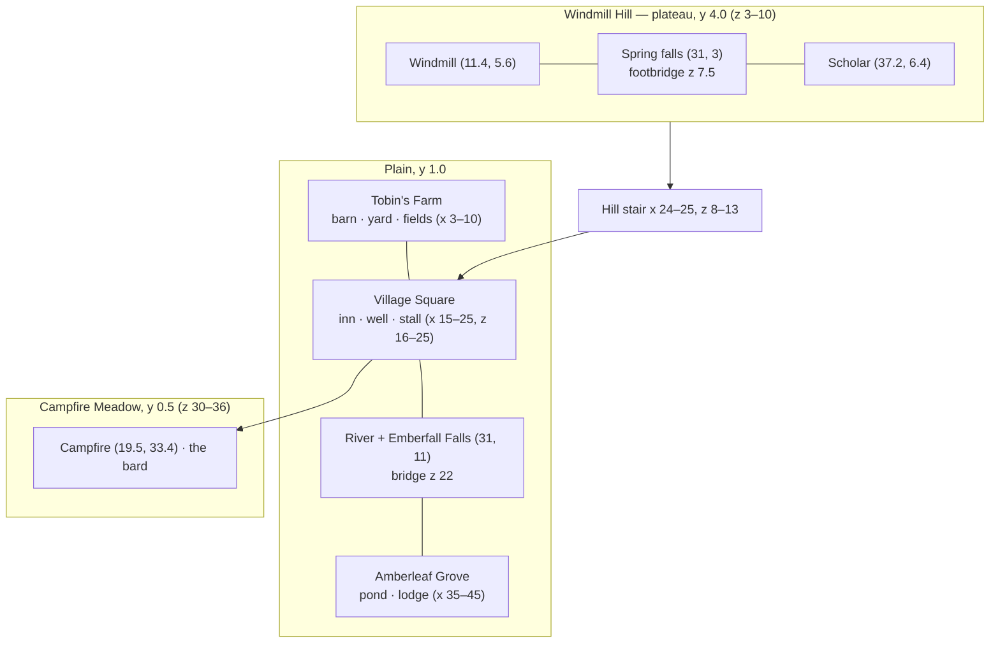

# Emberfall — Riverside Village

The design document of **Emberfall**, the demo level the game plays when no `?level=` is given: a
small, dense riverside village at golden hour with a windmill on the hill, a waterfall, a river and
bridge, a farm, an autumn grove with a pond and a campfire meadow — and eight villagers with
hand-written conversations. This page records its layout, landmarks with coordinates, people,
mechanics and settings, and how to change it without breaking the look it was tuned to.

| | |
| --- | --- |
| **Audience** | Designers and AI agents editing or testing Emberfall; anyone using it as the reference small level. |
| **Source of truth** | [`public/levels/emberfall.json`](../../../public/levels/emberfall.json) (the level), [`src/demo/dialogue.js`](../../../src/demo/dialogue.js) (`CONVERSATIONS`: its eight scripts), [`tools/convert-emberfall.mjs`](../../../tools/convert-emberfall.mjs) (how it was made) |
| **Related docs** | [Level design guide](../LEVEL_DESIGN_GUIDE.md) · [Visual design](../VISUAL_DESIGN.md) · [Level format](../../specs/LEVEL_FORMAT.md) · [Playing the game](../../user/PLAYING_THE_GAME.md) · [Game architecture](../../architecture/GAME.md) · other levels: [Starfall Vale](starfall-vale.md), [Brightwater Crossing](brightwater-crossing.md), [Willowmere](sample-hamlet.md) |

Play it: `index.html` (or `index.html?level=emberfall`, `&autostart=1` to skip the title).
Edit it: `editor.html?open=emberfall`.


---

## Concept and story

*"Our founders followed this river up from the lowlands four hundred years ago. At dusk the falls
catch the last of the sun and glow like embers in a hearth. Hence the name."* — Elder Maren

Emberfall is the engine's showcase **in miniature**: every feature within a minute's walk, framed
for the diorama camera. The player, a traveller, arrives in the village square at golden hour
(17:12). There is no quest; the village is a place to wander, talk, rest at the inn, take an
apple, hear the bard's song and watch the day turn — the scholar on Windmill Hill explains the
controls in character.

| Fact | Value |
| --- | --- |
| Size | 48 × 40 tiles, ringed by a 3-tile forest border (open only where the spring enters in the north and the river leaves in the south) |
| Objects | 136 (37 trees, 14 rocks, 8 benches, 8 fences, 8 villagers, 7 regions, 6 houses, 6 lampposts, 6 particle areas, 6 barrels …) |
| Walkable / water tiles | 1324 / 131 |
| Height levels | 0–11 (plain at level 2 = y 1.0; Windmill Hill level 8 = y 4.0; meadow level 1 = y 0.5) |
| Water | `waterLevel` 0.4, flow `[0, 0.45]` (south), `reflect 0.2`, `neutral 0.2` |
| Spawn | (19.5, 24.2) facing down — in the square, south of the well |
| Light sources | 12 — exactly the engine's 12 point lights, so each is permanent |

---

## Layout

North is up (the camera looks north). The village sits on a plain at level 2 between Windmill Hill
(north), the river (east of centre) and the Campfire Meadow, one level lower (south).



### ASCII map with objects

Generated from the level file: the tile map with object markers on top. `H` house footprint,
`M` windmill, `O` well, `$` market stall, `i` lamppost / wall torch, `*` campfire, `!` signpost,
`@` villager, `&` critter group, `|` waterfall, `=` bridge deck, `S` spawn. Tiles: `T` forest
border (blocked), `g G f` grass / dark grass / flower grass, `F` farmland, `d` dirt, `.` dirt path,
`c` cobblestone, `s` sand, `m` mossy stone, `~` river, `p` plunge pool, `w` fast stream, `o` still
pond, `^` stairs rising north.

```text
     0         1         2         3         4
     012345678901234567890123456789012345678901234567
  0  TTTTTTTTTTTTTTTTTTTTTTTTTTTTTmwwmTTTTTTTTTTTTTTT
  1  TTTTTTTTTTTTTTTTTTTTTTTTTTTTTmwwmTTTTTTTTTTTTTTT
  2  TTTTTTTTTTTTTTTTTTTTTTTTTTTTTmwwmTTTTTTTTTTTTTTT
  3  TTTGggggGGggGGggggGGggggGGGGmww|wmggggggggggGTTT
  4  TTTgGGggGGffgggggffffGggggggmwwwwmggfffffgGGGTTT
  5  TTTgGGggGddMddgggffffGggggggmmwwmmggfffffgGGGTTT
  6  TTTfgggggddddd.........gGG!Gimwwmgfff@fffgggfTTT
  7  TTTfgggggddddd..............======........ggfTTT
  8  TTTGggggggggggffggffgggg^^GGGmwwmgf.......gggTTT
  9  TTTGggggggggggffggffgggg^^GGGmwwmgffggGGgggggTTT
 10  TTTgggGGggffggffggggGGgg^^gggmwwmGggGGggggggGTTT
 11  TTTgggGGggffggffggggGGgg^^ggspp|ppsgGGgggHHHHTTT
 12  TTTgggggggggGGggfHHHHHHg^^ggspppppsgggGGfHHHHTTT
 13  TTTgHHHHHgggGGggfHHHHHHg^^ggspppppsgggGGfHHHHTTT
 14  TTTgHHHHHGggGGGGgHHHHHHG..ffgs~~~sgggggssssggTTT
 15  TTTgHHHHHGggGGGGgHHHHHHG..ffgs~~~sggggsoooosgTTT
 16  TTTGHHHHigggGGggcicccccc.gHHHs~~~sggGGsoooosgTTT
 17  TTTdddddddHHHGgiccccc@ccigHHHs~~~sggGGsoooosgTTT
 18  TTTddd&dddHHHgGccccccccccgHHHs~~~sGGgggssssggTTT
 19  TTTdddddddHHHgGccccccccccgHHHs~~~ssGgg..GGgggTTT
 20  TTTfGGggGGHHHGGccc@ccccccggggis~~~sg!g..GGGGgTTT
 21  TTT...........&cccccOcccc.....s~~~s.....GGGGgTTT
 22  TTT.........!..!cccccc@cc....=======....gggggTTT
 23  TTTGgggggggggggccccccc$ccGffg@s~~~ssGGgggggggTTT
 24  TTTgFFFFFFgggggcc&cScccccfgggggs~~~sGGgggggggTTT
 25  TTTgFFFFFFgggggiccccccccifgggggs~~~sGGgggggggTTT
 26  TTTGFF@FFFGHHHHgggg..Gggggffgggs~~~sgggggggggTTT
 27  TTTGFFFFFFGHHHHgggg..Gggggffgggs~~~sgggggggggTTT
 28  TTTgFFFFFFgHHHHgggG..ggggggggggs~~~sffggggGGgTTT
 29  TTTgffggffgg...............ggggs~~~ssfggggGGgTTT
 30  TTTGfGgfffggggggfGf..ffffGffffffs~~~sgggggGGgTTT
 31  TTTfGGfgfffggggfGff..fGGffGGffffs~~~sgggggGGgTTT
 32  TTTfGGfGfgfgfffgGgddd@gGggfffgggs~~~sgggggggfTTT
 33  TTTGGfGfggfgGfgffdd*dddGgggggfggs~~~sgggggggfTTT
 34  TTTfGfGGfGfgggffgddddddfGfGfgffGs~~~ssgggggggTTT
 35  TTTGfGGGGfffffffggddddggGGGGggGGgs~~~sgggggggTTT
 36  TTTfgggggfGGggffggfffffgfGggggffGs~~~sggggggGTTT
 37  TTTTTTTTTTTTTTTTTTTTTTTTTTTTTTTTTs~~~sTTTTTTTTTT
 38  TTTTTTTTTTTTTTTTTTTTTTTTTTTTTTTTTs~~~sTTTTTTTTTT
 39  TTTTTTTTTTTTTTTTTTTTTTTTTTTTTTTTTs~~~sTTTTTTTTTT
```

<details>
<summary>Raw height map (one character per tile: '0'–'9', 'a' = 10, 'b' = 11; world y = level × 0.5)</summary>

```text
  0  aaaabbbbbbbbaaaaaaaabbbbaaaaba99aaaabbbbaaaabbbb
  1  aaaabbbbbbbbaaaaaaaabbbbaaaaba99aaaabbbbaaaabbbb
  2  aaaaaaaaaaaaaaaaaaaaaaaaaaaaaa99aaaaaaaaaaaaaaaa
  3  888888888888888888888888888887777888888888888888
  4  888888888888888888888888888887777888888888888888
  5  888888888888888888888888888888778888888888888888
  6  888888888888888888888888888888778888888888888888
  7  888888888888888888888888888888778888888888888888
  8  888888888888888888888888778888778888888888888888
  9  555555555555555888888888668888778888888855555888
 10  555555555555555888888888558888778888555555555888
 11  222222222222222888222222442210000012222222222222
 12  222222222222222222222222332210000012222222222222
 13  222222222222222222222222222210000012222222222222
 14  222222222222222222222222222221000122222111122222
 15  222222222222222222222222222221000122221000012222
 16  222222222222222222222222222221000122221000012222
 17  222222222222222222222222222221000122221000012222
 18  222222222222222222222222222221000122222111122222
 19  222222222222222222222222222221000112222222222222
 20  222222222222222222222222222222100012222222222222
 21  222222222222222222222222222222100012222222222222
 22  222222222222222222222222222222100012222222222222
 23  222222222222222222222222222222100011222222222222
 24  222222222222222222222222222222210001222222222222
 25  222222222222222222222222222222210001222222222222
 26  222222222222222222222222222222210001222222222222
 27  222222222222222222222222222222210001222222222222
 28  222222222222222222222222222222210001222222222222
 29  222222222222222222222222222222210001122222222222
 30  111111111111111111111111111111111000111111111111
 31  111111111111111111111111111111111000111111111111
 32  111111111111111111111111111111111000111111111111
 33  111111111111111111111111111111111000111111111111
 34  111111111111111111111111111111111000111111111111
 35  111111111111111111111111111111111100011111111111
 36  111111111111111111111111111111111100011111111111
 37  111111111111111111111111111111111100011111111111
 38  111111111111111111111111111111111100011111111111
 39  111111111111111111111111111111111100011111111111
```

</details>

### Areas

| Area | Where | What is there |
| --- | --- | --- |
| **Windmill Hill** | plateau at level 8 (y 4.0), x 3–44, z 3–10; lower ledges at level 5 along its south-west (x 3–14) and south-east (x 36–44) edges, z 9–10 | the windmill (11.4, 5.6) in a dirt yard, pines and oaks, the spring falling into a stream that crosses the hill under a footbridge and drops over Emberfall Falls, a hill lamppost and bench, the scholar |
| **Hill stair** | x 24–25, z 8–13 | a cobbled flight 2 tiles wide and 6 deep (`^`, levels 2–7), rising north to the plateau at level 8, fenced on both sides (`fence_6`, `fence_7`) |
| **Village Square** | cobbles x 15–25, z 16–25 | the Ember & Oak inn on its north side, the well in the middle, the market stall, benches, flower boxes, barrels and crates, 4 lampposts at the corners, the plaza signpost, the plaza birds and the cat |
| **Emberfall Falls & river** | falls at (31, 11); plunge pool x 29–33, z 11–13; river 3 tiles wide from z 14 to the south edge (x 30–36), sand banks | the pool glints (a sparkle area); the bridge at z 22 carries the east road over the river; the guard stands at its west end |
| **Tobin's Farm** | x 3–10, z 11–30 | the barn (6.5, 14.5), the dirt yard where Pip chases the chickens (z 17–19), the fenced fields (farmland x 4–9, z 24–28, gate on the east side), haystacks, the farm sign |
| **Amberleaf Grove** | x 35–45, z 10–30 | the still pond (x 39–42, z 15–17) with sand banks, autumn trees, the woodcutter's lodge against the cliff north-east of the pond, a bench, fireflies and falling leaves |
| **Campfire Meadow** | level 1 (y 0.5), z 30–36 — one walkable step below the village | flower meadows, the campfire (19.5, 33.4) with two log benches, the bard, fireflies and drifting petals |
| **Beyond the south edge** | trees `tree_31`–`tree_37` at z 40.9–42.6 (outside the 40-deep map, no colliders, 6.2–7 tall) | blurred foreground oaks that frame the south of the view |

---

## Regions

Order matters (first match wins). All have the subtitle ("sub") *Emberfall*.

| # | Region | Rect (x, z) | `minY` | Banner |
| --- | --- | --- | --- | --- |
| 1 | Windmill Hill | 0–48 × 0–11 | 3.2 | "Where the valley keeps its winds" |
| 2 | Windmill Hill (the stair) | 23.5–26.5 × 8–11 | — | — (keeps the plate from flashing a generic name on the stair) |
| 3 | Tobin's Farm | 0–11 × 11–30 | — | — |
| 4 | Amberleaf Grove | 34.5–48 × 10–30 | — | — |
| 5 | Campfire Meadow | 0–48 × 29.6–40 | — | — |
| 6 | Emberfall Falls | 27–35 × 10–16 | — | — |
| 7 | Village Square | 11–35 × 11–30 | — | — |

On entering gameplay the level banner shows the name "Emberfall" with the subtitle "Riverside
Village". Region banners show once per gameplay session (`Game._bannersShown` is cleared only in
`enterGameplay`).


---

## Landmarks

| Id | Object | Position | Notes |
| --- | --- | --- | --- |
| `inn` | house "The Ember & Oak" | (20, 14) | 6 × 4, 2 storeys, plaster + timber-frame upper storey, red roof, hanging sign, door hood, door lantern (`light: true`), faces south onto the square |
| `elder_house` | house "Elder's cottage" | (12, 18.5), rotation π/2 (faces east) | stone brick, slate roof, woodpile |
| `brick_house` | house "Riverside house" | (27, 17.5), rotation −π/2 (faces west) | brick, blue roof, lantern |
| `thatch_cottage` | house "Thatched cottage" | (12.5, 27.6) | plaster, thatch, lantern, woodpile |
| `lodge` | house "Woodcutter's lodge" | (43.3, 12.6) | timber frame, red roof, door hood, woodpile |
| `barn` | house "Tobin's barn" | (6.5, 14.5) | 5 × 4 log walls, thatch, gable front, no chimney |
| `windmill` | windmill | (11.4, 5.6), rotation 0.12 | height 6.2, red roof, turning sails |
| `well` | well | (20, 21.5) | examine text (2 pages), `sfx: splash` |
| `stall` | market stall | (22.2, 23.7) | striped cloth, width 3; Bertram stands behind it |
| `campfire` | campfire | (19.5, 33.4) | fire, embers, smoke, a light that burns day and night |
| `falls` | waterfall | (31, 11), width 2, facing S | stream y 3.85 → pool y 0.4; mist 16 particles, alpha 0.07; splash |
| `spring` | waterfall | (31, 3), width 2, facing S | y 4.85 → 3.85; mist 10, alpha 0.06; `splash: false` |
| `bridge` | bridge | (29.7, 22) → (35.3, 22) | deck y 1, width 2.2, arch 0.28 |
| `footbridge` | bridge | (28.8, 7.5) → (33.2, 7.5) | deck y 4, width 1.6, arch 0.18, `postDepth` 0.8 |
| `sign_plaza` | signpost (3 boards) | (15.3, 22.9) | "↑ Windmill Hill · → Emberfall Falls & Amberleaf Grove / ↓ Campfire Meadow · ← Tobin's Farm" |
| `sign_farm` | signpost | (12.2, 22.95) | "Tobin's Farm. Mind the chickens." |
| `sign_grove` | signpost | (36.2, 20.6) | "Amberleaf Grove. Please do not feed the fireflies." |
| `sign_hill` | signpost | (26.6, 6.9) | Windmill Hill view text |

**Light sources (12):** lampposts `lamppost_1`–`4` at the square's corners (15.6 / 24.4 × 17.4 /
25.4, arm style), `lamppost_5` by the bridge (29.3, 20.4) and `lamppost_6` on the hill (28.3, 6.3)
(top style); wall torches `torch_inn` (17.6, 16.05, with embers) and `torch_barn` (8.9, 16.55); the
campfire; the door lanterns of the inn, the Riverside house and the thatched cottage.

---

## People

All eight villagers use hand-written scripts (`script` ids → `CONVERSATIONS` in
[`src/demo/dialogue.js`](../../../src/demo/dialogue.js)); their data `dialogue` is unused while the
script exists. These ids are part of the automation API (`window.__game.talkTo(id)`).

| Id | Name | Preset | Position | Behaviour | Action | What they do |
| --- | --- | --- | --- | --- | --- | --- |
| `elder` | Elder Maren | elder | (18.3, 20.1) | wander 1.1 | — | Tells the founding story and recommends the inn; later visits alternate between the well / the hill and a short farewell. |
| `innkeeper` | Rosalind | innkeeper | (21.6, 17.1) | wander 0.7 | rest | "Will you rest until morning?" — **Not yet** / **Rest until morning**. Resting fades out, sets the clock to 8:00, plays a chime ("You feel well rested.") and she greets you in the morning. |
| `merchant` | Bertram | merchant | (22.2, 22.35) behind the stall | post, wander 0.35 | shop | Offers an apple "on the house" — **Just looking** / **Take an apple**; each apple adds to `inventory.apples` with a toast "Obtained: Crisp Apple ×n". `talkOffset [0, 2.7]`, `talkRadius 1.5`: you talk to him from in front of the counter. |
| `guard` | Corporal Hale | guard | (29, 23.55) at the bridge | post, wander 0.4 | — | "Halt! State your— ah." Guards the bridge, warns about the river after dark. |
| `farmer` | Old Tobin | farmer | (6.8, 26.3) in the fields | wander 2 | — | Talks to his turnips; the chickens have filed a complaint. |
| `child` | Pip | child | (6.2, 18.6) | chase in `area` −2.6…3.2 × −1.3…1.2 | — | Chases the chickens (they scatter from Pip and the player); alternates two lines ("I'm sneaking up on Duchess"). |
| `bard` | Wren | bard | (21, 32.5) at the campfire | perform | music | First talk: introduces his song *Emberfall Evening* and starts the music if it is off. Later, while it plays: **Keep playing** / **Rest a while** (stops it); when silent he plays again. `talkRadius 1.7`. |
| `scholar` | Ottoline Quill | scholar | (37.2, 6.4) on Windmill Hill | wander 1.6 | — | Explains T, R, P, Q / E, Z / X (or the wheel), the debug-panel key (Backquote, written `{~}` in her text) and H in character. |

**Critters:** 5 chickens in the barn yard (`chickens`, (6.5, 18.55), yard rect −3.1…3.1 × −1.35…1.35,
seed 4242); a cat round the square (`cat`, (14.4, 21.6), radius 3.2); 4 plaza birds with fixed start
spots that take flight when you come close (`birds`, (17.5, 24.8)).


**Interactables:** all 6 house doors have knock text ("Knock"), the well ("Look", splash sound) and
4 signposts ("Read").

---

## Particle areas and atmosphere

| Id | Preset | Centre (x, z), `dy` | Box (w × h × d), count | Purpose |
| --- | --- | --- | --- | --- |
| `firefliesPond` | fireflies | (40.8, 16.5), 1.6 | 8 × 2.2 × 7, 34 | the grove pond at night |
| `firefliesGrove` | fireflies | (40, 27), 1 | 9 × 2.6 × 12, 30 | the southern grove |
| `firefliesMeadow` | fireflies | (14, 33), 0.9 | 20 × 2.2 × 7, 40 | the campfire meadow |
| `leaves` | leaves | (40, 21), 2.2 | 11 × 3.6 × 18, 34 | autumn leaves in Amberleaf Grove |
| `petals` | petals | (16, 33), 2.7 | 26 × 4.5 × 8, 44 | the meadow |
| `poolSparkle` | sparkle | (31, 12.8), 0.7 | 4.4 × 0.5 × 2.4, 9 (`life [0.5, 1.1]`) | glints on the plunge pool |

Plus chimney smoke from every house with a chimney, campfire embers and smoke, waterfall mist,
dust motes following the camera, and god rays in two areas (below).

| Dusk at the campfire | Night in the square |
| --- | --- |
|  |  |

---

## Environment settings

| Field | Value | Why |
| --- | --- | --- |
| `timeOfDay` | 17.2 | golden hour, the look the whole engine was tuned for |
| `clock`, `weather`, `music` | true, `clear`, true | |
| `border`, `outerScenery` | `forest`, true | forest ring + fogged outer heightfield: no view shows the world's edge |
| `camera` | distance 30, pitch 32, `bounds` near `{4.8–43.2, 3.5–36.2}`, mid `{6.5–41.5, 3.5–35}`, far `{7.5–40.5, 4–34}` | hand-tuned focus bounds (they became the game's automatic margins, `AUTO_BOUNDS_MARGINS`) |
| `highGround` | `{ minY: 3.2, pitch: 39 }` | tilt down on the hill so the village roofs don't fill the frame |
| `title` | subtitle "A Lumina HD-2D Engine Demo", credit "Lumina HD-2D Engine · three.js" | the title itself defaults to the name in capitals |
| `titleCamera` | x 22, z 21, y 1.5, drift 7 × 5, distance 35 | drifts over the square and the river |
| `scenery.southGap` | 0 | the outer forest starts right at the south edge |
| `godRayAreas` | x 12–30 × z 13–31 (y 1, 4 shafts, seed 7); x 35–45 × z 12–32 (y 1, 2 shafts, seed 11) | shafts over the square and the grove |
| `foliage.flowerAreas` | z 30–40 across the map, palette `[0, 1, 2, 3, 0, 2]` | a mixed flower meadow in the south |
| `foliage.shrubAreas` | x 35–48 × z 11–37, chance 0.16 | bushy grove |

---

## How it was made

Emberfall started as hand-written JavaScript (`src/demo/maps/emberfall.js` plus `NPC_DEFS` /
`OBJECT_TEXT` in `dialogue.js` and `CAMERA_BOUNDS` in `config.js`), built and reviewed in phase 2 of
the project (57 review findings, 43 fixed — see [history](../../history/PROJECT_HISTORY.md)). When the
level editor arrived, **`tools/convert-emberfall.mjs` converted it once** into
`public/levels/emberfall.json`, with one binding requirement: *Emberfall must look and play exactly
as before*. The converter:

- transcribes what the old code built procedurally (windmill, spring cascade, particle areas,
  critters, god-ray areas, foliage zones, title camera);
- writes options the `PropFactory` picks at random when absent as `null` ("seeded random": house
  shutters, door hoods, woodpiles; tree and rock seeds), so the props come out identical;
- computes the random rotations of barrels, crates and crate stacks with the factory's own RNG.

The old module no longer exists; the JSON is the **single source of truth**.

---

## How to modify it safely

- **Edit in the editor** (`editor.html?open=emberfall`, Ctrl+S saves back to
  `public/levels/emberfall.json` under `npm run dev`) or edit the JSON by hand, one object per line.
  Saving it unchanged leaves `git diff` empty.
- **Never re-run `tools/convert-emberfall.mjs`.** It rebuilds the level from the pre-conversion code
  in git and would overwrite every later change. With its default `--rev=HEAD` it now stops with
  "The legacy Emberfall constants are gone from the working tree and could not be read from git
  revision "HEAD"" and writes nothing; only an old revision (e.g. `--rev=8e36884`, the phase-2
  commit) makes it run — and then it writes `public/levels/emberfall.json` unless `--out` says
  otherwise.
- **Keep it at ≤ 12 light sources.** With 12 descriptors every lantern owns a permanent light; a 13th
  switches the level to the pooled mode, where lights follow the camera — a visible change.
- **Keep the ids** `elder`, `innkeeper`, `merchant`, `guard`, `farmer`, `child`, `bard`, `scholar`
  and their `script` fields: tests and the README's automation hooks use them. The scripts mention
  Emberfall's places (the Ember & Oak, Windmill Hill, Duchess the hen); rename a place and update
  [`dialogue.js`](../../../src/demo/dialogue.js) too.
- **Emberfall is the regression baseline** for engine changes on small levels — the game loads it by
  default, and its draw calls, triangles and light list must stay identical unless a change is
  intended (see [TESTING_AND_VERIFICATION](../../development/TESTING_AND_VERIFICATION.md)).
- Follow the [level design guide](../LEVEL_DESIGN_GUIDE.md) for anything you add north of a house,
  near the river or on the hill.

## Known issues

- **Blind zones behind buildings.** At the default camera 94 of 987 standable points (1-unit grid)
  are hidden by buildings — worst behind the thatched cottage (the west road from the square to the
  farm, x 10.5–14.5, z 21.5–25.5, including the farm sign) and the Riverside house (the falls' west
  bank, x 25.5–28.5, z 11.5–14.5). The x-ray silhouette covers them; moving the houses would change
  the layout.
- In lantern-lit places night is still brighter than dusk (by design of the lamps; away from them
  dusk ≥ night).
- At the start position the thatched cottage in the lower-left foreground is blurred by the near
  depth of field — intentional Octopath-style framing that hides part of the farm from some angles.
- **Tobin's fenced field is sealed.** Its gate (the gap in the east fence at x 9.9, z 26.2–27.6)
  opens onto the thatched cottage's west wall, too close for the player to pass, so Old Tobin can
  only be talked to across the fence ([KNOWN_ISSUES LVL-20](../../ai/KNOWN_ISSUES.md#levels-and-generators);
  found by `npm run level:check -- emberfall`).

| Rain in the grove | Snow at midday | Dawn on the hill |
| --- | --- | --- |
|  |  |  |
