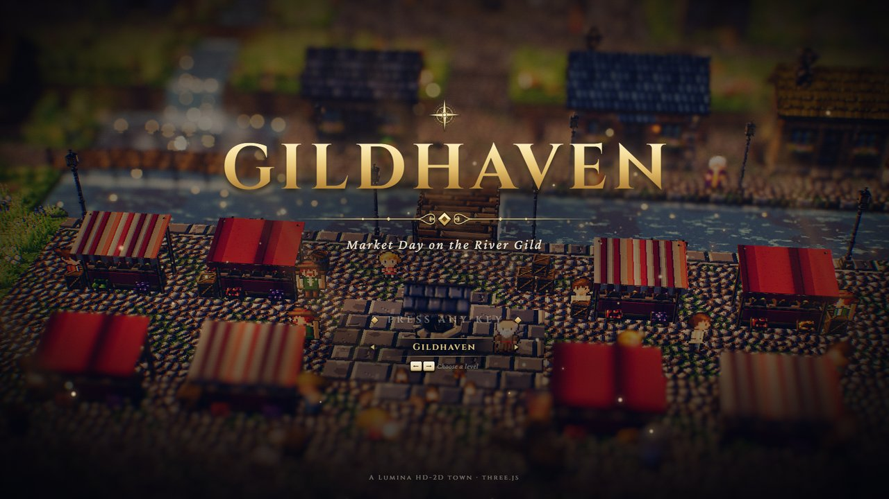
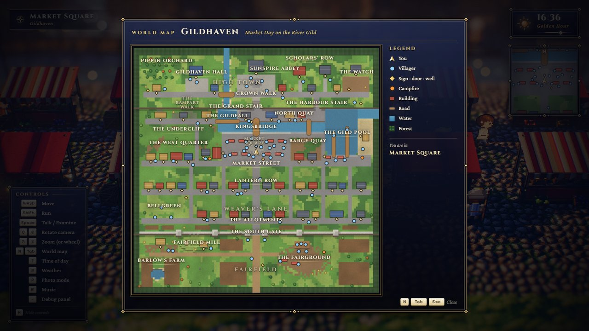
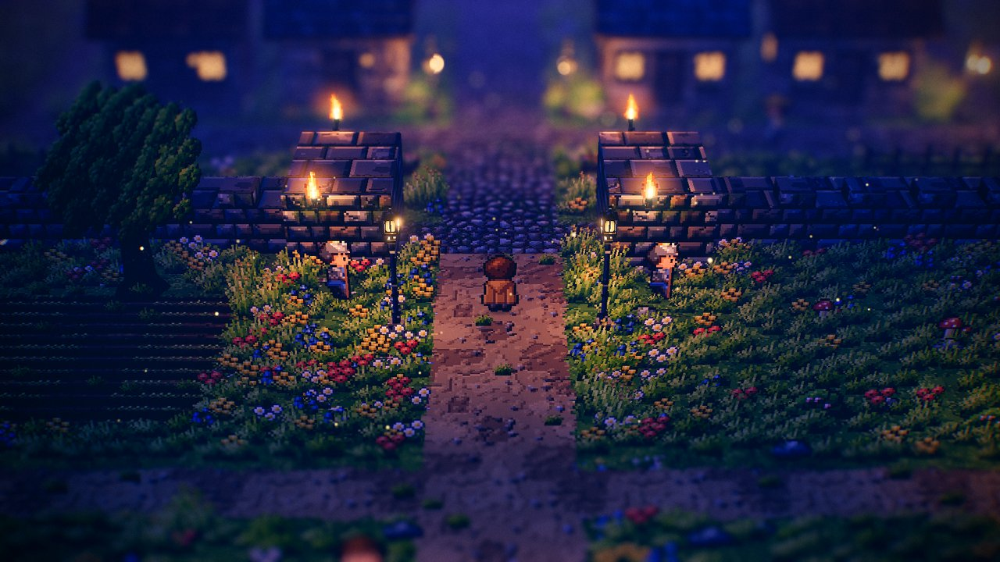
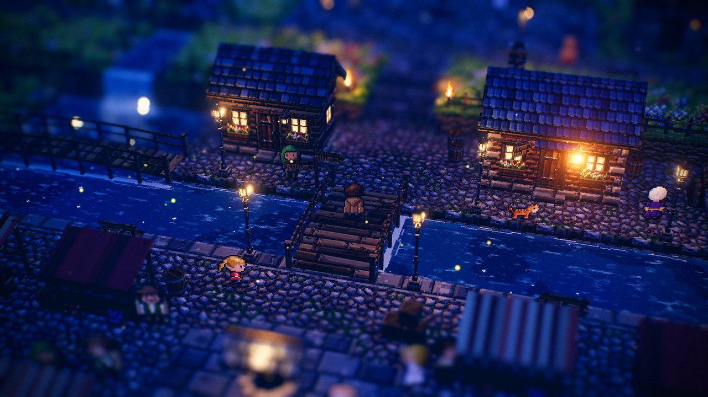
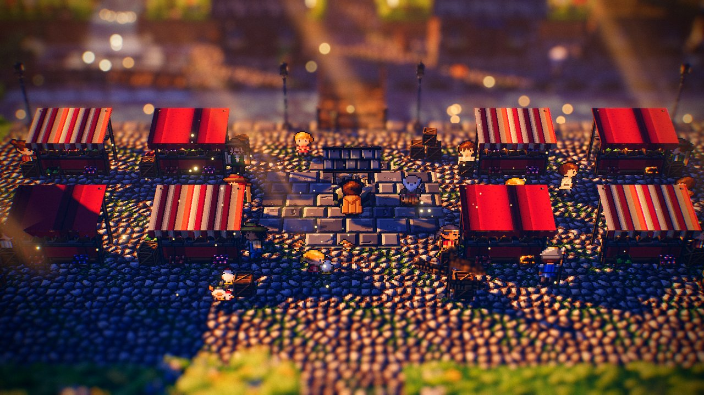

# Gildhaven — Market Day on the River Gild

The design document of **Gildhaven**, a 128 × 128 walled river town on fair day: High Town on its
terrace with Sunspire Abbey and the Hall, the Gildfall dropping off the terrace edge into the river,
a Market Square on the water with eight stalls round the Gild Well, quays, three bridges, a harbour
with piers and a beach, two rows of homes and shops, a town wall with the South Gate, and outside it
Fairfield with the players' stage, a windmill and a farm. 68 villagers, 53 buildings. It is a
peaceful level, **generated** by a deterministic, self-validating script; this page documents what
the script builds and how to change it.

| | |
| --- | --- |
| **Audience** | Designers and AI agents extending or testing the town; anyone laying out a dense town for a camera that looks north. |
| **Source of truth** | [`tools/make-gildhaven.mjs`](../../../tools/make-gildhaven.mjs) (the generator — edit this; helpers in [`tools/lib/levelgen.mjs`](../../../tools/lib/levelgen.mjs)), [`public/levels/gildhaven.json`](../../../public/levels/gildhaven.json) (its output — never hand-edit) |
| **Related docs** | [Level design guide](../LEVEL_DESIGN_GUIDE.md) · [Performance](../../architecture/PERFORMANCE.md) · [Level format](../../specs/LEVEL_FORMAT.md) · other levels: [Starfall Vale](starfall-vale.md) (the other 128 × 128 level), [Emberfall](emberfall.md), [Brightwater Crossing](brightwater-crossing.md), [Willowmere](sample-hamlet.md), [Cinderwatch Pass](cinderwatch-pass.md) |

```bash
node tools/make-gildhaven.mjs              # regenerate (≈ 1 s); refuses to write if a check fails
node tools/make-gildhaven.mjs --check      # write nothing; exit 1 unless the file matches byte for byte
node tools/make-gildhaven.mjs --out=<file> # write elsewhere (e.g. a scratch copy)
node tools/make-gildhaven.mjs --ascii      # also print the tile map
node tools/make-gildhaven.mjs --quiet      # no report (errors still go to stderr)
node tools/make-gildhaven.mjs --force      # write a failing level for inspection (exit code stays 1)
```

Play it: `index.html?level=gildhaven` (`&autostart=1` skips the title; the title screen's ◂ ▸ row
also offers it). Edit (view) it: `editor.html?open=gildhaven`.



---

## Concept

*Long ago the barge-folk found gold dust in the river below the falls. There was not much, but they
named the town for it, and they have been gilding everything since.* — Lady Odelia Fairgild

The traveller arrives at 16:36 on the King's Road through Fairfield, on the day of the **Gild
Fair**: the farms have come in, the players are on their stage outside the South Gate, the square is
full of stalls, and at dusk the Sunspire Bell rings the fair closed while the lanterns are lit along
the river. The clock runs, so the town lights up as the evening comes.

Dialogue forms loose threads round the town; every direction given matches the map:

- **The bell:** Crier Bertil (the square) → Lady Odelia in the court of Gildhaven Hall (up the Grand
  Stair and west along Crown Walk, over the Hall Bridge) → Mother Celandine at Sunspire Abbey → the
  Rampart Walk and the Lookout, where Captain Hale watches the harbour.
- **The goose:** the gold-leaf goose over the door of the Gilded Goose "gets stolen every year and
  always comes back" (Mother Wenna); Captain Hale reports it missing again.
- **Trade:** Azar's saffron goes to the Saffron Bakery on Lantern Row; Saffi weaves the river-blue
  cloth Signora Vell sells; Pippin Orchard's apples end up on Hetty's toffee sticks; Alba Quern's
  water mill and her cousin Tobias's windmill argue about flour.

| Fact | Value |
| --- | --- |
| Size | 128 × 128 tiles — the maximum (`MAX_SIZE`); uses the big-level build path |
| Objects | 518: 68 villagers, 60 barrels, 58 lampposts, 53 houses, 48 trees, 40 crates, 30 regions, 20 benches, 17 flower boxes, 17 particle areas, 16 fences, 13 crate stacks, 13 critter groups, 12 wall torches, 12 market stalls, 11 haystacks, 9 signposts, 6 bridges, 5 rocks, 3 `light` objects, 3 campfires, 2 wells, 1 waterfall, 1 windmill |
| Tiles | 13 598 walkable, 935 water; height levels 0–7 |
| Custom legend chars | `e` — the river flowing east (`flow: [0.45, 0]`); `q` — dressed stone (the town wall and its towers: stone tiles on top, stone-wall sides, blocked) |
| Water | `waterLevel` 0.4, `flow [0, 0.45]`, `reflect 0.16`, `neutral 0.35`, `glint 0.6` |
| Spawn | (64, 121.5) facing up — the King's Road at the south edge |
| Light descriptors | 86 (58 lampposts, 12 wall torches, 3 campfires, 3 `light` objects, 10 lit houses), shared by the 12 pooled point lights |
| Interactables | 53 doors, 9 signposts, 2 wells; 68 villagers with 120 dialogue pages |
| Villagers | 39 wander, 23 post, 4 perform, 2 chase; 13 shops, 1 inn (rest), 1 bard (music) |

---

## Layout



*The world map (N / Tab). North is up; the player arrow is in the Market Square.*

The town is a stack of east–west bands, laid out for the camera that looks north (golden rule 1 of
the [level design guide](../LEVEL_DESIGN_GUIDE.md)): every street runs past the **fronts** of the
houses north of it, so doors, stalls and villagers face the player, and the backs of the houses face
their own yards.

| Area | Rough extent (x × z) | Ground | Highlights |
| --- | --- | --- | --- |
| **High Town** | 3–125 × 4–31 | terrace level 5 (y 2.5) | Sunspire Abbey and Abbey Plaza with the Sun Well, Gildhaven Hall and its court, the Guild Exchange, the Gilt Library, the Watch House and its yard, three town houses, Crown Walk, the Rampart Walk along the edge, the Lookout over the harbour, Pippin Orchard west of the stream |
| **The Gild** | stream x 47–50; river z 39–44 | stream bed 4, river bed 0 | the stream crosses High Town (Hall Bridge), drops 1.95 off the terrace as the **Gildfall** into its pool, and runs east to the harbour |
| **North Quay** | 54–100 × 32–39 | level 2 | the Salt Store, Customs House, Tamsin's Boatyard and the Harbour Office against the terrace wall; the **Grand Stair** (x 62–66) and the **Harbour Stair** (x 94–97) cut into it |
| **The Undercliff** (West Quarter) | 3–44 × 32–41 | level 2 | the Ropewalk, Cliffside Cottage, Gildfall Mill; the Mistbridge over the Gildfall's pool to the North Quay |
| **Market Square** | 46–82 × 44–59 | level 2, cobbles | on the river, opposite Kingsbridge: the Gild Well, eight stalls in two rows with their keepers beside the counters, the poultry corner, the Gilded Goose (facing east into the square) |
| **The West Quarter** | 3–44 × 41–59 | level 2 | the craft row on Market Street (carpentry, tannery, the Barrelhouse, the Dye Works), Hammerstane Smithy set back with its open forge, Mill Lane |
| **Barge Quay, East Quarter** | 82–100 × 44–59 | level 2 | the barge yard, the chandlery and the Saltcellar; Saltbridge to the North Quay |
| **The Gild Pool** | 98–125 × 32–62 | bed 0, beach level 1 | the harbour under the terrace cliff: the Fish Quay with two stalls and the smokehouse fire, the West and East Piers, the beach and the Boathouse, the outlet east under the cliff |
| **Lantern Row, Weaver's Lane** | 3–125 × 62–92 | level 2 | two rows of 25 homes and shops facing south onto their street, five north–south lanes and Main Street, Bellgreen (the little green at the west end) |
| **The Allotments, the wall** | 3–125 × 92–98 | level 2; wall level 5–6, towers 6–7 | vegetable plots; the town wall (merlons on its outer row) with six towers and the **South Gate** (x 61–67) |
| **Fairfield** | 0–128 × 98–125 | level 2; knoll level 3; stage level 3 | the King's Road from the spawn, the fairground with the players' stage, benches and stalls, Fairfield Mill (windmill and Quern Cottage) on its knoll, Barlow's Farm with its duck pond, fields |

### Streets, stairs and crossings

- **East–west:** Crown Walk (z 23–26, High Town), the Undercliff Walk (z 37–40), Market Street
  (z 59–62, the whole width), Lantern Row (z 74–77), Weaver's Lane (z 89–92), Mill Lane and Fair Lane
  in Fairfield (z 107–109).
- **North–south:** the town's spine at x 64 — the King's Road, Main Street, the square, Kingsbridge,
  the Grand Stair and Abbey Way to the Abbey; Mill Lane (x 32–34), Tanner's, Cooper's, Chandler's,
  Harbour and Saltwick Lanes between the rows.
- **Stairs:** the Grand Stair (4 wide) and the Harbour Stair (3 wide) climb the terrace wall from
  level 2 to level 5, rising north; each is cut into the wall, its foot a one-row recess.
- **Bridges:** Kingsbridge (3.4 wide, the square to the North Quay), Saltbridge (Barge Quay to the
  North Quay), the Mistbridge (10.9 long, over the Gildfall's pool), the Hall Bridge (Crown Walk over
  the stream, deck 2.5); the West Pier and East Pier in the harbour.

### Why the streets are where they are

A house hides the ground north of it from the camera. With the chimney modelled at its tallest
candidate spot (`roofsOf` in `tools/lib/levelgen.mjs`), a one-storey row house of depth 3.4 hides a
walker's chest up to about **9.8 units** north of its centre, a two-storey one about 11.3 units. The
first draft put the streets 12–13 units apart and 7.4 % of all path tiles were hidden behind roofs.
Lantern Row and Weaver's Lane moved south until each row's chimney band ends on the row's own back
yards (front walls 0.4 north of their street, depth ≤ 3.5, one storey): now **0.6 %** of the
3 417 path tiles are hidden, all behind the two well roofs, the windmill (over the wall, onto
Weaver's Lane) and Pippin Cottage. Two-storey buildings stand only where no street or interactable lies
within 11 units north of them: High Town's back row against the forest, the Gilded Goose (no chimney, so its
stack does not hide the Undercliff Walk), and the Barrelhouse.

The same rule placed Fairfield Mill **north** of Mill Lane, on a knoll between the lane and the wall,
and the quay warehouses' back strip is paving, not path: nobody walks behind a warehouse.

---

## Regions

Smallest first (first match wins); High Town's regions have `minY 2.2`. Arrival banners: Sunspire
Abbey, the Rampart Walk, High Town, the Gildfall, Market Square, the Gild Pool, the Fairground and
Fairfield.

The Lookout · Sunspire Abbey · Gildhaven Hall · Scholars' Row · The Watch · Pippin Orchard ·
Crown Walk · The Rampart Walk · High Town · The Grand Stair · The Harbour Stair · The Gildfall ·
Kingsbridge · North Quay · The Undercliff · Market Square · Barge Quay · The Gild Pool · The West
Quarter · Market Street · Bellgreen · Lantern Row · Weaver's Lane · The South Gate · The Allotments ·
The Fairground · Fairfield Mill · Barlow's Farm · Fairfield · Gildhaven (the whole map, subtitle
"Market Day on the River Gild").

---

## People

68 villagers, ids in the generator's `people()`. `__game.talkTo('<id>')` places the player beside
one.

| Where | Who |
| --- | --- |
| South Gate, Fairfield | Sergeant Brask and Corporal Lisbet at the gate; the Wandering Lark Players on their stage — Florin Fiddlewick (bard, **music**), Mirela, Corwin the Juggler (`perform`); Edda and Old Ambrose in the audience; Hetty Bramble (**shop** Toffee Apple), Rosalind (Fair Ribbon); Daro the Wayfarer; Farmer Barlow and Nim (`chase`, the farm hens); Tobias Quern at the mill |
| Market Square | Crier Bertil at the well; the eight stall keepers beside their counters, all **shops** — Dora Haddock (Gild Trout), Azar (Pinch of Saffron), Pim Crumble (Goose Loaf), Signora Vell (River-Blue Cloth), Ottilie Clay (Clay Cup), Goodman Hollis (Dozen Eggs), Daisy (Marigold Posy), Master Brie (Wedge of Gild Blue); Mother Wenna at the Gilded Goose (**rest**); shoppers Garr, Sister Wynn, Tilda, Beck, Fennick; Tilly; Wren (`chase`, the poultry corner); Corporal Dunn on patrol |
| River, quays, harbour | Old Salt Merrow, Master Odd (customs), Tamsin (boatyard); Harbourmaster Ysolde, Dob and Merrit on the piers, Gran Tessaly on the beach, Fenna (**shop** Smoked Gild Trout); Gwen the Bargewife |
| West Quarter | Alba Quern (the mill), Rurik Hammerstane (smithy), Hamish Mott (**shop** Mug of Gild Ale), Joss Plane; Tam the Piper (`perform`) on Market Street |
| The rows | Ned the Porter on Main Street, Old Wick the lamplighter, Bramwell Bun (**shop** Saffron Bun), Ada and Bram, Saffi the weaver, Hob and Hester on Bellgreen's benches, Kit, Milla, Dame Agnes, Brother Tuck at the Shrine of the Tide |
| High Town | Lady Odelia Fairgild and Guardsman Pell (the Hall), Mother Celandine, Novice Cass and Elric the Pilgrim (the Abbey), Brother Anselm (the Library), Guildmaster Orrin (the Exchange), Captain Hale (the Lookout), Sorrel the gardener, Lady Amabel Thornbury, Hazel (Pippin Orchard) |

Stall keepers stand **beside** their counters, not behind them, where the awning would hide them
(KNOWN_ISSUES PROP-13); the player talks to them from the aisle. The first answer of every shop and
rest question is the harmless one.

---

## Lights, particles, critters

- **Lights:** 86 descriptors through the 12-light pool — lampposts on every street (arm lamps reach
  over Lantern Row and Weaver's Lane), wall torches on the gate towers (both faces), at the stair
  feet, the Abbey, the Hall, the Watch House and the smithy; the forge, the smokehouse and the
  players' campfire; fair lanterns over the Gild Well, candles behind the Abbey's windows, the Shrine
  of the Tide's sea-glass lamp.
- **Particle areas (17):** dust over the square and the fairground, smoke over the three fires,
  embers at the forge, mist and sparkle at the Gildfall, mist over the harbour, fireflies along the
  river and over the duck pond, petals in High Town, the orchard, the stage and the knoll, leaves in
  the West Quarter and on Bellgreen.
- **Critters (13 groups):** pigeons round the Gild Well, doves on Abbey Plaza, gulls on the Fish
  Quay, birds in the orchard; hens in the poultry corner, the allotments and at the farm; cats on the
  North Quay, at the inn and on Bellgreen; dogs at the Watch, the fairground and the farm.

---

## Environment settings

`timeOfDay 16.6`, `clock true`, weather clear, `camera { distance 30, pitch 33 }`, `highGround
{ minY 2.2, pitch 39 }` (High Town), title texts and a title camera drifting over the square and
Kingsbridge (`{ x 62, z 44, y 1.2, driftX 6, driftZ 3, distance 40 }`), `fogScale 0.7`, `scenery
{ southGap 10 }`, forest kinds by band (pines behind High Town, broadleaf further south), four
god-ray areas (the square, Abbey Plaza, the fairground, the West Quarter) and flower / shrub zones
(High Town, Bellgreen, Fairfield; the Undercliff, the allotments).



---

## How it was made

`tools/make-gildhaven.mjs` uses the shared helpers of [`tools/lib/levelgen.mjs`](../../../tools/lib/levelgen.mjs)
(`createGrid`, `createPlacer`, `createWalkModel`, `createOcclusion`, `roofsOf`, the scatters) — the
second generator on them after Cinderwatch Pass. Passes, in order:

1. **Terrain:** `relief` (High Town's terrace, zones, the knoll), `water` (stream, pool, river,
   harbour, outlet, beach, duck pond), `paths` (streets as tile rects with a centre line for the
   blocked-path check; squares and quays as plazas), `stairs`, `wall`, `ground` (variety by zone,
   allotments, fields, the fairground, the stage, the flagstone rings), `border`.
2. **Objects,** area by area: `highTown`, `river`, `square`, `westQuarter`, `eastQuarter`,
   `harbour`, `rows` (two calls of `rowS(front, list)`: south-facing houses whose front walls stand
   0.4 north of their street), `fairfield`, `people`.
3. `sightlines` → `scatterTrees` / `scatterRocks` (RNG `gildhaven:trees` / `gildhaven:rocks`;
   sparse `TREE_RULES` with `south: 6` in town, so no tree stands just south of a street) →
   `dressHouses` (RNG `gildhaven:dressing`: one or two barrels, crates or flower boxes per house) →
   `clearCrowns` (drops a scattered tree hiding ≥ 25 % of a villager, talk spot, door, sign, well or
   campfire) → `regions` → `environment`.
4. **Validation** (`validate()`: `checkLevel` of [`tools/lib/levelcheck.mjs`](../../../tools/lib/levelcheck.mjs)
   with `strict: true`, the 16 routes, the real street centre lines and the scattered trees — the
   checks `npm run level:check` runs on any level file; any failure writes nothing): zero `normalizeLevel` warnings and
   changes, `validateLevel`; a walk BFS from the spawn with the game's movement rules — no
   unreachable pocket, every villager (and its chase area), door, sign, well and region reachable;
   16 **routes** that must stay direct (≤ 1.5 × the straight line + 3), each crossing and stair
   included; streets not blocked by props; stairs rising one level per tile; the Gildfall on a tile
   edge with a real drop; bridges spanning water, walkable end to end; buildings on flat dry
   footprints; no overlapping props; doors clear; the camera (yaw 0) seeing every villager, talk
   spot, door, sign, well and campfire past the roofs; **at most 3 % of path tiles hidden behind
   roofs**; no wall or cliff hiding a walker to the waist on a path; hand-placed trees out of the
   sightlines and no crown hiding half of a sight target; critters on walkable ground; wall torches
   on a wall; every map point inside a region; at least 40 villagers. Then the round trip:
   `serializeLevel(normalizeLevel(…))` and `parseLevel → serializeLevel` byte-identical.

The run is deterministic (seeded RNG, no `Math.random`, no `Date`): two runs write byte-identical
files, and `--check` compares without writing. The level opens in the editor with no problems
("Ready to play-test"), and saving it unchanged leaves `git diff` empty.

### The tour

[`sandbox/gildhaven.tour.json`](../../../sandbox/gildhaven.tour.json) visits 26 views at the
default camera and records draw calls (fails above 300) and checks that no shader program
compiles after load:

```bash
npm run check -- --page=index.html --query="level=gildhaven&autostart=1" --out=gh_tour --wait=8000 --fps=0 --script=sandbox/gildhaven.tour.json
```

Measured 2026-10-02 (GTX 1060, 1600 × 900): first gameplay frame 4.0–4.5 s from navigation, 59
programs at load and after the tour, 12 pooled lights for 86 descriptors, **124–274 draw calls** at
the default zoom (the busiest: the Market Square at yaw +60, 274; Market Street 262), 280 zoomed
out over the square. The editor opens it with ~944 draw calls (Starfall ~915) and idles at the
display rate.



---

## How to modify it safely

- **Edit the generator, never the JSON.** Re-run `node tools/make-gildhaven.mjs`; read its report
  (the hidden-path share and its hiders, the routes, any ✗ line) and look at the level again with the
  tour. Don't rename the level: `name` seeds the terrain noise.
- **A new house in a row:** add it to the `rowS(...)` list of its street with depth ≤ 3.5 and one
  storey; a deeper or two-storey house there hides the street to its north (the report names it).
- **A new street or a moved row:** keep about 10 units of yards between a row's centre and the
  street north of it.
- **New villagers:** on walkable ground, clear of colliders, not in a crown's or roof's shadow; the
  validator checks the villager and the spot south of it. Stall keepers beside the counter.
- **Placements shift the seeds:** `P.nextSeed()` gives every house, stall, rock and tree its seed in
  placement order, and the scatter runs after the hand placements, so adding an object can reshuffle
  the scattered trees. That is fine — the output is still deterministic — but re-read the report.
- **Pines:** keep the two pines by the King's Road (or another pine within the spawn's shadow
  frustum): they make the load-time warm-up compile the pine's shadow program; without them it
  compiled on the first walk into High Town (KNOWN_ISSUES REN-13).
- After a change: `node tools/make-gildhaven.mjs --check`, the tour, `npm run typecheck`.



---

## Known limits

- **No boats.** The level format has no boat object; the dialogue says the barges came up at dawn,
  unloaded and went back down to the sea.
- **Foreground roofs.** Walking Lantern Row or Market Street, the rooftops of the row south of the
  player fill the bottom of the frame in the near blur — the HD-2D framing, but heavier than in
  Starfall's open town.
- **The windmill hides nine tiles of Weaver's Lane** behind the town wall from the default camera
  (the player shows as the x-ray silhouette there).
- **Hidden-by-model tiles are conservative:** the validator models every candidate chimney spot of
  a house, the real chimney stands at one of them.
