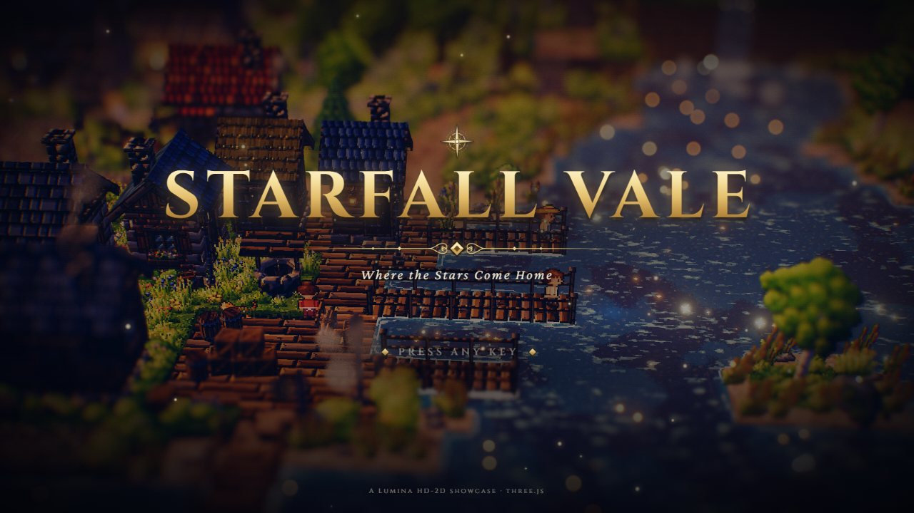
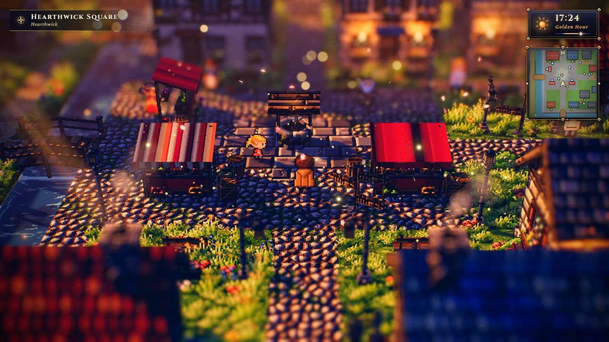
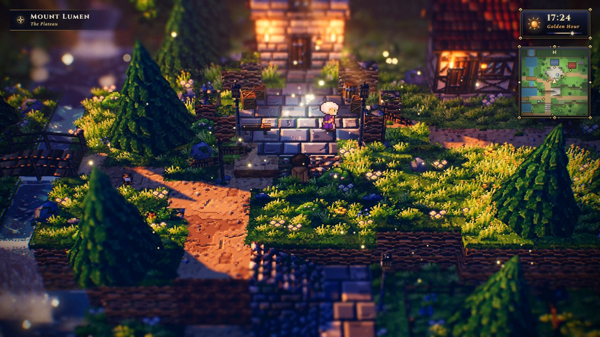
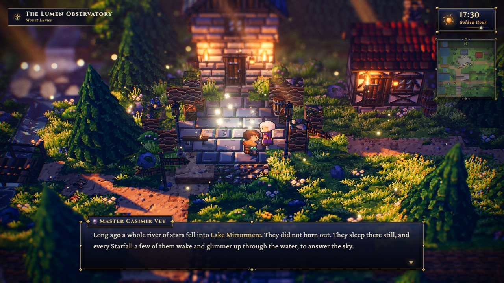
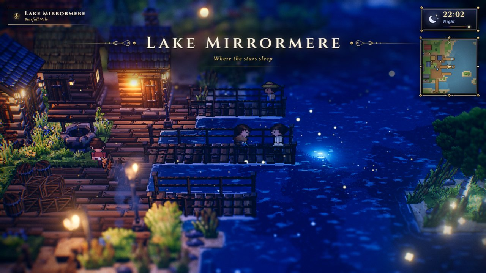
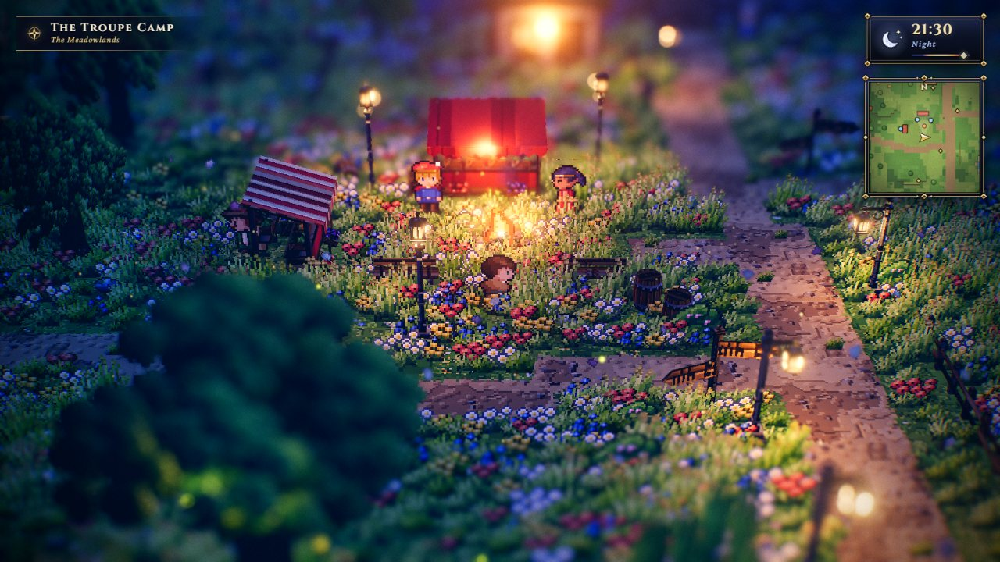
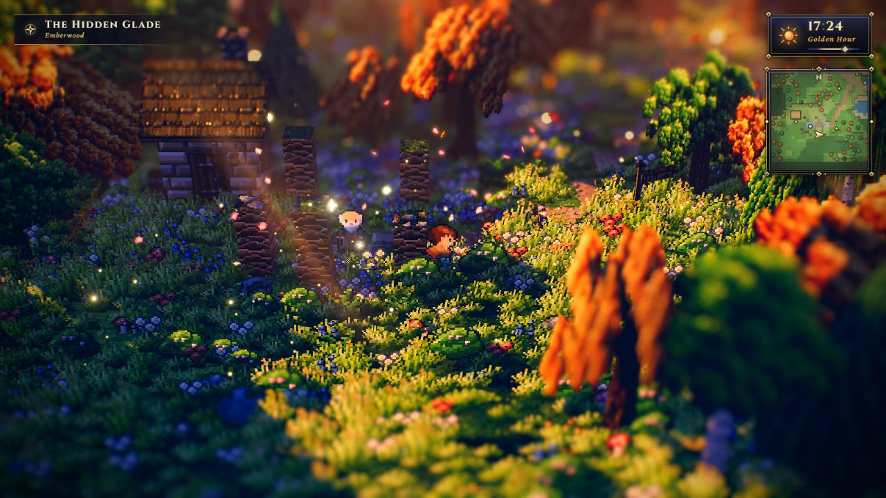
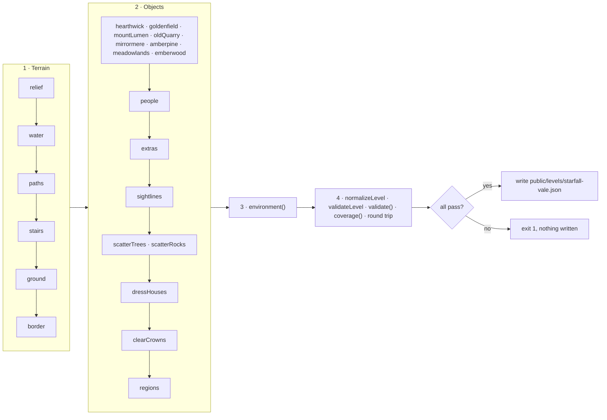

# Starfall Vale — Where the Stars Come Home

The design document of **Starfall Vale**, the flagship 128 × 128 showcase level: a whole vale on the
night of the Starfall Festival — the market town of Hearthwick on the Silverrun, Mount Lumen with its
observatory and the three waterfalls of the Three Sisters, Goldenfield Farms, Lake Mirrormere and its
fishing hamlet, the Meadowlands with a travelling troupe, the autumn Emberwood with a hidden glade,
and the Old Quarry. It uses every tile type, every non-combat object type, villager action and
behaviour, critter kind and particle-area preset of the level format (except `rain` and `snow`,
which follow the camera and are driven by the weather). The combat-only types (`enemy`, `chest`,
`waystone`) are covered by [Cinderwatch Pass](cinderwatch-pass.md) instead, so Starfall stays a
peaceful level. It is **generated** by a deterministic, self-validating
script; this page documents what the script builds and how to change it.

| | |
| --- | --- |
| **Audience** | Designers and AI agents extending or testing the big level; anyone writing a level generator. |
| **Source of truth** | [`tools/make-starfall-vale.mjs`](../../../tools/make-starfall-vale.mjs) (the generator — edit this), [`public/levels/starfall-vale.json`](../../../public/levels/starfall-vale.json) (its output — never hand-edit) |
| **Related docs** | [Level design guide](../LEVEL_DESIGN_GUIDE.md) (most of its rules come from this level's reviews) · [Performance](../../architecture/PERFORMANCE.md) (big-level batching) · [Level format](../../specs/LEVEL_FORMAT.md) · [Project history](../../history/PROJECT_HISTORY.md) · other levels: [Emberfall](emberfall.md), [Brightwater Crossing](brightwater-crossing.md), [Willowmere](sample-hamlet.md), [Cinderwatch Pass](cinderwatch-pass.md) (the combat demo) |

```bash
node tools/make-starfall-vale.mjs              # regenerate (≈ 0.8 s); refuses to write if a check fails
node tools/make-starfall-vale.mjs --out=<file> # write elsewhere (e.g. a scratch copy)
node tools/make-starfall-vale.mjs --ascii      # also print the tile map (still writes the level)
node tools/make-starfall-vale.mjs --quiet      # no report (errors still go to stderr)
node tools/make-starfall-vale.mjs --force      # write a failing level for inspection (exit code stays 1)
```

The run is deterministic: `--out=<scratch file>` produces a file byte-identical to the shipped
`public/levels/starfall-vale.json` (checked while writing this page).

Play it: `index.html?level=starfall-vale` (`&autostart=1` skips the title). Edit (view) it:
`editor.html?open=starfall-vale`.



---

## Concept and story

*Once a year the sky over the vale lets go of a few stars. Long ago a whole river of them fell into
Lake Mirrormere; they did not burn out. They sleep on the lakebed, and every Starfall a few of them
wake and glimmer up through the water to answer the sky.*

The traveller arrives at golden hour (17:24) on the King's Road at the south edge, on the evening of
the Starfall Festival. The villagers' dialogue forms loose chains that lead around the whole vale:

- **The main thread:** Mayor Aldous (Hearthwick) → Master Casimir, the Stargazer at the observatory
  on Mount Lumen → Grandmother Isolde at the fishing hamlet → the end of the **Long Pier** after dusk,
  where the sleeping stars rise.
- **Side threads:** Wendel sends you up to the Old Quarry; Dunstan points out the upland stair to the
  terrace; Old Gorse the switchbacks; Warden Ivo the stair down to the North Shore; Ansel and Signor
  Orsino the hermit's standing stones in the Emberwood glade; Tamsin Bloom the troupe camp south of the
  river; Garrick and Dunstan trade messages about a mended pickaxe.

Every direction a villager or signpost gives matches the geography (checked by the reviewers and, for
the signposted walks, by the generator's route checks).

| Fact | Value |
| --- | --- |
| Size | 128 × 128 tiles — the maximum (`MAX_SIZE`); uses the big-level build path |
| Objects | 874: 288 trees, 101 rocks, 70 barrels, 60 lampposts, 42 particle areas, 32 fences, 31 signposts, 31 regions, 29 villagers, 28 benches, 28 flower boxes, 27 houses, 24 crates, 13 critter groups, 13 haystacks, 12 wall torches, 10 bridges, 8 `light` objects, 8 crate stacks, 5 market stalls, 5 waterfalls, 4 campfires, 4 wells, 1 windmill |
| Tiles | 12555 walkable, 1633 water; height levels 0–20 |
| Custom legend chars | `e` — a river flowing east (`flow: [0.45, 0]`); `:` — the King's Road beyond the border (a dirt path that is not walkable) |
| Water | `waterLevel` 0.4, `flow [0, 0.45]`, `reflect 0.08`, `neutral 0.55`, `glint 0.45` |
| Spawn | (70.5, 121.5) facing up — the King's Road at the south edge |
| Light descriptors | 95 (60 lampposts, 12 wall torches, 8 `light` objects, 4 campfires, 11 lit houses), shared by the 12 pooled point lights |
| Interactables | 27 doors, 31 signposts, 4 wells; 29 villagers with 92 dialogue pages |

---

## Layout


*The world map (N / Tab). North is up; the player arrow is in Hearthwick Square.*

| Area | Rough extent (x × z) | Ground | Highlights |
| --- | --- | --- | --- |
| **Hearthwick** (market town) | 43–88 × 38–80 | plain, level 2 (y 1.0) | the square (cobbles 62–77 × 51–64, well at (70, 57.5)), the Starlight Inn, Town Hall, Chapel of the Fallen Stars, bakery, smithy with an open forge, 3 stalls, 3 bridges over the Silverrun |
| **Mount Lumen** | 38–98 × 0–44 | foothills level 5, terrace 9, plateau 15, observatory knoll 16 | the Three Sisters falls, the King's Road stairs and switchbacks, the Lumen Observatory, Stargazer's Cottage, Lumen Lookout, Silverspring, the Star Cairn |
| **Amberpine Heights** | 94–125 × 3–40 | highland level 9, ledge 5 | pine forest, the Mirror Falls and their lookout |
| **Lake Mirrormere** | 87–125 × 36–112 | lake level 0, shores level 1 | Mirrormere Landing (the fishing hamlet on decks), 3 piers, the island of the sleeping stars, Reedmouth, the North Shore, the South Beach, the Heron Spit |
| **Goldenfield Farms** | 3–44 × 37–84 | plain; windmill knoll level 3 | the windmill, Barleycorn Farm, the chicken yard, the orchard, field plots, the farm pond |
| **The Old Quarry** | 3–38 × 3–38 | upland level 6, pit floor level 3 | the stepped quarry pit and old shaft (void), the ruins of Old Lumen and their well |
| **The Meadowlands** | 43–95 × 80–125 | plain with one-level knolls | the King's Road south, the Wandering Lanterns troupe camp, the Wishing Oak, the meadow pond, Brambleberry Cottage, Bramble Hollow |
| **Emberwood** | 3–45 × 83–125 | undulating forest floor levels 2–4 | the woodcutter's camp (Birchwood Lodge), the hunter's post, the Emberwood pond, the Forager's Hut, the sunken Hidden Glade (level 1) with standing stones |

**The Silverrun** rises from a spring in the northern ridge (a rill at level 16 falling into the
spring pool), crosses the plateau as a fast stream, drops over the **Three Sisters** — high (62, 20),
middle (58, 28), low (60, 36) — into the pool at the foot of the mountain, runs south through
Hearthwick (x 57–59), then turns east along the town's south edge (tiles `e`) into Lake Mirrormere.
The **Mirror Falls** (113, 40) drop from Amberpine Heights into the lake's north lobe.

<details>
<summary>Coarse ASCII overview (every second column and every fourth row; object markers may be dropped)</summary>

Markers: `H` house, `M` windmill, `O` well, `$` stall, `i` lamp / torch, `*` campfire, `+` light,
`!` signpost, `@` villager, `&` critters, `|` waterfall, `=` bridge, `S` spawn. Tiles as in the
[level format](../../specs/LEVEL_FORMAT.md); `e` river flowing east, `:` the road past the border.
For the exact map run `node tools/make-starfall-vale.mjs --ascii --out=<scratch file>`.

```text
     0    1    2    3    4    5    6    7    8    9    0    1    2
     0246802468024680246802468024680246802468024680246802468024680246
  0  TTTTTTTTTTTTTTTTTTTTTTTTTTTTTTxwTTTTTTTTTTTTTTTTTTTTTTTTTTTTTTTT
  4  TTTTTTmGGGmmGGTTTmgggTTTGGGGGGp|pGGgggggGGGGGmmGGGgGGTTTTTTTTTTT
  8  TTTTTGGGgggGGmGTTgggTTTTTgGGGGpppGggikggmHHGGGGGGGGGGTTTTTTTTTGT
 12  TTmmGGxxxkkkdxmGggggggxxgGGGGGGwGGgkkkk.....GGGGGGGGGGGGGmxxTTTT
 16  TTmmmmGkkdddkkxGGggGgggG....GggwG..!.GGggggggGGGmGG.GGGGmmmTTTTT
 20  TTGg.mgxddmkmxxGgmmGgggGggmgmpp|pGG.<<kgggmgGGGGGGGG.GGGggmggGGT
 24  TTgk.mGggvmmmGG.ggggg.......mwG................GGGgG.GGpppgmmGGT
 28  TTgg.mGggg.mGmGGgmgggggggfgfp|pgggg^gGmmfgffgGGGGTGGGGGGwmmmgGGT
 32  TTggGGmmdg.ggmGGGm..........ggw!gGG.gGGGgggGGGGgggGG..GGwGGGGggT
 36  TTxGggmddd.mmdmmmGGGggggGGGgpp|pggg^GGGgggggGGgggggG^gggwGGGGGGT
 40  TTfggGGggg^gggffgGGGGgggggggppppgHiciHGGggggggGGGGG..gooooossGGT
 44  TTsoosgggg.fgggggGGGGGgggHH.g~cigggcGgggHHggfgggGGf^Gsoooooo.gfT
 48  TTggggggggf.fddddHHHgggggg..g~cHHHgcgHHgHHgggffgG...gsooooos.ffT
 52  TTGHHGggggg.fddddHHHgggHHHG.G~cccccccccgggHHHGG..fgsoooooosGGGfT
 56  TTFFFGgggfg..i.&ggGigggggGi.G~cccckkkccgggggggg..gsoooooooossGfT
 60  TTgggggggggg.gFFFGGGG!ggggi.g~ccccc&cccgggggHHHHbooooooooooos.GT
 64  TTFFFFFGFFFiGGGGGGGGGGHHggg.g~cicccccccggggHffbbooooooooooooo.GT
 68  TTgggggggGg.ggggggggggg.ggg.g~cggggcggggHHggbb@booooooooooooo.GT
 72  TTFFFFFFFFF.gggggfffffggHHg.g~cgHHgciHHHGGHHbbbbsooooosssooos.fT
 76  TTFFFFgggggg.fggggggggggggg.g~ccccc=ccccccccss=eeoooooooosGsG.GT
 80  TTggggFFFFgg.fgggGggggggggggsssssss=ssssssssse=eeeoooooooooos.gT
 84  TTfTTfffffgf.gffGGGGGGggggggfffHHgg.ggggfffff.@ssoooooooooos.fgT
 88  TTTTTTfGGGGG.fffGGGTTTGfffggggffggi.fffffffff.goooooooooosG.GGfT
 92  TTGTTTgG@GGGg.ggGHHGGGGGGfffffffff..GfGffff..f.oooooooooos.GGGgT
 96  TTGGggGGGGffggg.fGGGGGGGggggfigggg.......ggGGg..oooooooos.ffffgT
100  TTTTGGGGgggGggfgffG..GGGggfg$ffff...gggffffffGGg..sooos..gfffggT
104  TTTTGGffgGgffg.fsooogGG....fffifffg.gg&fGgfggffgggffgffffgggffgT
108  TTTTfHHffffgg.ggssssgggffggggggfffi.gfGggssgggggggggffggggGgGGGT
112  TTggggggkdd>.gggggGGGGffgfggggggffg.ggfgooosffggggggfgggggGGGGGT
116  TTGgggggfGGGGGggggggHHGfffGGG+!gggg.fGgffffgHHgfffgg!GggggGGGGGT
120  TTGggggGGGGGGGGGGgggGGGffgGfGGffggg.fffggggffggfffffgggGgggGGGgT
124  TTGGGGGGGGGggffgGGGGGGGGGffGGgffgg!.fgffgggfffffgggggffggggGGGgT
126  TTTTTTTTTTTTTTTTTTTTTTTTTTTTTTTTTTT:TTTTTTTTTTTTTTTTTTTTTTTTTTTT
```

(Every fourth row shown; the full-resolution map is 128 rows.)

</details>

### Roads, stairs and crossings

The generator draws **43 named paths** as polylines with widths — cobbles (`c`) in Hearthwick
(the King's Road through town is 3 wide, x 69–71), dirt (`.`) outside: the King's Road south to the
spawn and north over the mountain, Lantern Lane, the Quay walk, the River walk, the West Road to
Goldenfield, the East Road to the lake, the shore paths, the Heron trail, the Emberwood and glade
trails, the plateau walks and the quarry road.

**13 stair flights** (stairs in all four orientations: `^` 46 tiles, `v` 9, `>` 16, `<` 24):

| Flight | Tiles (x × z) | Rises | Levels |
| --- | --- | --- | --- |
| King's Road · foothill stair | 69–71 × 36–38 | N | 2 → 5 |
| King's Road · terrace stair | 69–71 × 28–31 | N | 5 → 9 |
| Switchback · east flight | 72–74 × 22–23 | E | 9 → 12 (landing 75–76 × 20–23) |
| Switchback · west flight | 72–74 × 20–21 | W | 12 → 15 (the plateau) |
| Observatory step | 73–75 × 15 | N | 15 → 16 |
| Highland stair | 96–101 × 14–15 | W | 9 → 15 (plateau ↔ Amberpine Heights) |
| Ledge stair | 103–104 × 36–39 | N | 5 → 9 |
| Shore stair | 101–102 × 44–46 | N | 2 → 5 |
| Quarry stair | 20–21 × 37–40 | N | 2 → 6 (farms → upland) |
| Quarry pit stair | 17–19 × 22–24 | S | 3 → 6 (pit floor → upland) |
| Ruins stair | 10–12 × 17–18 | W | 3 → 6 (pit → Old Lumen) |
| Upland stair | 34–36 × 22–23 | E | 6 → 9 (upland → terrace) |
| Glade stair | 21–22 × 111–112 | E | 1 → 3 (Hidden Glade → Emberwood) |

**10 bridges** (3 of them piers):

| Id | Name | From → to | Deck y | Width, arch |
| --- | --- | --- | --- | --- |
| `millrace_bridge` | Millrace Bridge | (56.5, 58.5) → (60.4, 58.5) | 1 | 2.6, 0.22 |
| `fallsview_bridge` | Fallsview Bridge | (56.6, 43) → (60.4, 43) | 1 | 1.7, 0.18 |
| `southgate_bridge` | Southgate Bridge | (70.5, 76.6) → (70.5, 80.8) | 1 | 2.8, 0.3 |
| `spring_bridge` | Spring Footbridge | (60.3, 15) → (63.7, 15) | 7.5 | 1.8, 0.2 |
| `terrace_bridge` | Terrace Footbridge | (56.3, 25.5) → (59.7, 25.5) | 4.5 | 1.7, 0.18 |
| `sisters_crossing` | Sisters' Crossing | (58.3, 33.5) → (61.7, 33.5) | 2.5 | 1.7, 0.18 |
| `pier_long` | The Long Pier | (94.7, 66.5) → (102.6, 66.5) | 0.5 | 1.8, 0 |
| `pier_north` | North Pier | (96.6, 61.5) → (102.4, 61.5) | 0.5 | 1.6, 0 |
| `pier_south` | South Pier | (95.6, 71) → (100.4, 71) | 0.5 | 1.6, 0 |
| `reedmouth_bridge` | Reedmouth Bridge | (92, 75.3) → (92, 81.7) | 0.5 | 2, 0.32 |

**5 waterfalls**, all facing south:

| Id | Position, width | Drop (water surfaces) |
| --- | --- | --- |
| `spring_fall` | (62, 4), 2 | 8.35 → 7.35 (1.00), `splash: false`, mist 10 / 0.06 |
| `sisters_high` | (62, 20), 2 | 7.35 → 4.35 (3.00) |
| `sisters_mid` | (58, 28), 2 | 4.35 → 2.35 (2.00) |
| `sisters_low` | (60, 36), 2 | 2.35 → 0.40 (1.95) |
| `mirror_falls` | (113, 40), 2 | 4.35 → 0.40 (3.95), mist 18 |


---

## Regions

31 regions, listed in file order (first match wins, so small places come first). `minY 7.2` = the
plateau only (level 15 = y 7.5), `4.2` = terrace and highland, `2.2` / `2.8` = foothills / the
Old Lumen upland.

| # | Region | Sub | Rect (x × z) | `minY` | Banner |
| --- | --- | --- | --- | --- | --- |
| 1 | The Lumen Observatory | Mount Lumen | 66–81 × 4–16 | 7.2 | Home of the Stargazer |
| 2 | Lumen Lookout | Mount Lumen | 40–52 × 12–22 | 7.2 | |
| 3 | Silverspring | Mount Lumen | 56–67 × 4–12 | 7.2 | |
| 4 | Mount Lumen | The Plateau | 38–98 × 0–22 | 7.2 | The roof of the vale |
| 5 | Stargazer's Steps | Mount Lumen | 66–79 × 18–28 | 4.2 | |
| 6 | The Three Sisters | Mount Lumen | 50–67 × 18–41 | — | Three falls, one river |
| 7 | The High Terrace | Mount Lumen | 34–98 × 18–30 | 4.2 | |
| 8 | The Foothills | Mount Lumen | 32–100 × 26–39 | 2.2 | |
| 9 | Mirror Falls | Amberpine Heights | 103–120 × 26–40 | 4.2 | |
| 10 | Amberpine Heights | Above Mirrormere | 94–125 × 3–40 | 4.2 | Pines above the mirror |
| 11 | The North Shore | Lake Mirrormere | 93–110 × 36–53 | — | |
| 12 | Old Lumen | The Old Quarry | 3–13 × 10–35 | 2.8 | Ruins of the first town |
| 13 | The Old Quarry | Starfall Vale | 3–38 × 3–38 | — | Where the first stones were cut |
| 14 | The Windmill | Goldenfield Farms | 8–23 × 42–56 | — | |
| 15 | Barleycorn Farm | Goldenfield Farms | 23–45 × 40–58 | — | |
| 16 | Goldenfield Orchard | Goldenfield Farms | 25–44 × 61–83 | — | |
| 17 | Goldenfield Farms | Starfall Vale | 3–44 × 37–84 | — | Barley, windmills and wishes |
| 18 | Hearthwick Square | Hearthwick | 61–79 × 50–66 | — | |
| 19 | Chapel Row | Hearthwick | 78–87 × 40–52 | — | |
| 20 | Southgate | Hearthwick | 60–81 × 74–84 | — | |
| 21 | Hearthwick | The Market Town | 43–88 × 38–80 | — | The market town of the vale |
| 22 | Mirrormere Landing | Lake Mirrormere | 83–99 × 56–75 | — | Fresh fish, old stories |
| 23 | Reedmouth | Lake Mirrormere | 84–99 × 75–90 | — | |
| 24 | The South Beach | Lake Mirrormere | 90–125 × 93–112 | — | |
| 25 | Bramble Hollow | The Meadowlands | 95–125 × 112–125 | — | |
| 26 | Lake Mirrormere | Starfall Vale | 87–125 × 36–112 | — | Where the stars sleep |
| 27 | The Troupe Camp | The Meadowlands | 50–70 × 91–106 | — | The Wandering Lanterns |
| 28 | The Meadowlands | Starfall Vale | 43–95 × 80–125 | — | Flowers as far as the lantern-light |
| 29 | The Hidden Glade | Emberwood | 4–26 × 100–122 | — | Where the first star is remembered |
| 30 | Woodcutter's Camp | Emberwood | 26–43 × 88–102 | — | |
| 31 | Emberwood | Starfall Vale | 3–45 × 83–125 | — | The forest that remembers autumn |

The world map shows all 31 names; three area labels (Goldenfield Farms, Amberpine Heights, The High
Terrace) are set compact on two lines (checked in the game at 1600 × 900).

---

## Landmarks

### Buildings (27)

Doors face south (`rotation 0`) unless noted; ✦ = lit door lantern (`light: true`). Every door has
knock text.

| Id | Name | Position | Build |
| --- | --- | --- | --- |
| `inn` ✦ | The Starlight Inn | (65.25, 47.5) | 6.5 × 4.5, 2 storeys, plaster / timber, red roof, sign, door at offset −1.25 (knock spot (64, 50.75)) |
| `town_hall` ✦ | Hearthwick Town Hall | (75.4, 47.25) | 5.5 × 4.5, 2 storeys, stone brick / plaster, blue roof — the festival notice is on its door |
| `chapel` | Chapel of the Fallen Stars | (82.5, 46.25) | 4.5 × 6, 2 storeys, stone brick, slate, gable front; candlelight behind the windows (`light_1`) |
| `bakery` ✦ | Crumb's Bakery | (86.2, 54.1) | timber frame, red roof, sign |
| `smithy` | Ironwell Smithy | (81.5, 67.2) | stone brick, slate; the forge (`campfire_1`) burns in the open yard in front |
| `lamplighter` ✦ | Lamplighter's Cottage | (66.5, 42), faces east | by the north gate |
| `rosewater` | Rosewater House | (74.5, 42), faces west | brick, blue roof |
| `hollyhock` | Hollyhock Cottage | (50.9, 45) | plaster, thatch |
| `weaver` | The Weaver's House | (48.5, 52.5) | 2 storeys, plaster / timber |
| `riverside` | Riverside Cottage | (45.6, 65) | stone brick, slate |
| `millhouse` | The Old Millhouse | (50, 71.5) | wood planks, thatch, gable front |
| `tinker` | Tinker's House | (86.6, 64.9), faces east | brick, blue roof |
| `cobbler` | The Cobbler's | (64.5, 72.5) | timber frame, sign |
| `merrow` ✦ | Merrow House | (76, 72.5) | brick, one storey on purpose (a second storey hid a third of the view from the square) |
| `quayside` | Quayside Cottage | (85.2, 72.5) | wood planks, slate |
| `bluebell` ✦ | Bluebell Cottage | (64.2, 85.4) | plaster, thatch, south of the river |
| `farmhouse` ✦ | Barleycorn Farmhouse | (29.5, 50.5) | plaster, thatch |
| `barn` | The Old Barn | (36.5, 50) | log walls, thatch, gable front; west wall of the chicken yard |
| `pondside` | Pondside Cottage | (6.8, 51.3) | by the farm pond |
| `observatory` ✦ | The Lumen Observatory | (74, 6.6) | 2 storeys, stone brick, blue roof, gable front, in a ring of broken walls; the blue lens light `light_3` burns day and night |
| `stargazer_cottage` ✦ | Stargazer's Cottage | (83, 8.2) | timber frame, red roof — deliberately unlike the observatory |
| `tench_cabin` ✦ | Tench's Cabin | (93.8, 60.8) | 2.8 × 2.8 on the hamlet decks |
| `reed_cabin` | Reed's Cabin | (89.4, 60.9) | 2.8 × 2.8; the East Road enters the Landing down the 1.4-unit lane between the two cabins |
| `lodge` | Birchwood Lodge | (36.5, 93) | log walls, the woodcutter's camp |
| `hermit_hut` | The Hermit's Hut | (11.4, 108.6) | in the Hidden Glade |
| `forager` | The Forager's Hut | (42, 116.6) | Emberwood |
| `brambleberry` ✦ | Brambleberry Cottage | (88.6, 117.2) | Meadowlands, with a hen run |

### Other landmarks

| What | Where |
| --- | --- |
| Wells | `square_well` (70, 57.5) under festival lanterns (`light_2`); `farm_well` (25.4, 54.6); `old_well` (7.5, 29.6) in Old Lumen — "it hums on Starfall night"; `hamlet_well` (91, 66.6) |
| Windmill | (15.5, 48.5) on its knoll, height 6.4 |
| Market stalls | Quentin (65, 61.5), Nell (75, 61.5), Tamsin (63.8, 54.5, facing east), the troupe booth (62, 95.8), Orsino (56.4, 100.6, facing east) |
| Campfires | the forge (79.6, 71.25); Reedmouth cove (93.5, 85.2); the troupe camp (62.4, 99.7); the woodcutter's camp (32.8, 94.4) — the last three with log seats |
| `light` objects | chapel candles `light_1` (82.5, 45.8); well lanterns `light_2` (70, 58.2); observatory lens `light_3` (74, 11.8, blue, always on); island glow `light_4` (111.3, 71.2); the stars off the Long Pier `light_5` (104.2, 66.6); troupe stage `light_6` (62, 97.4); glade stones `light_7` (16.5, 111.8); wish-lanterns in the Wishing Oak `light_8` (58.2, 116.8, 5 units up) |
| The Wishing Oak | a 7.4-tall oak at (58.2, 114.3) on a meadow knoll, with a sign, a bench and fireflies in its crown |
| The Star Cairn | rocks and a sign at (90–92, 22–24) on the terrace |
| The island | (111, 71) in the lake — deliberately unreachable (the only allowed unreachable pocket) |
| The toll gate | a fence across the King's Road at z 124.75 with a barrel and crate: the road ends visibly, not in an invisible wall |

| Hearthwick at golden hour | The observatory |
| --- | --- |
|  |  |

---

## People

29 villagers, 13 character presets, all with plain `dialogue` (no `script`) and 2–5 pages
(92 pages in all; 14 villagers end on or include a choice page). Actions: none × 22, rest × 1,
shop × 5, music × 1. Behaviours: wander × 18, post × 8, perform × 2, chase × 1.

| Id | Name | Preset | Position | Behaviour | Action / item | Role |
| --- | --- | --- | --- | --- | --- | --- |
| `aldous` | Mayor Aldous Bramblecote | elder | (73.8, 53.4) | wander 1.2 | — | Welcomes you to the festival; sends you to the Stargazer. |
| `marigold` | Marigold Fenn | innkeeper | (65.6, 51.5) | wander 0.6 | **rest** | "Rest now and you will sleep right through the stars" — **I will stay up** / **Rest until morning**. |
| `barnaby` | Barnaby Crumb | villager | (83.6, 57.6) | wander 0.8 | **shop**: Starlight Bun | The baker. |
| `garrick` | Garrick Ironwell | swordsman | (81, 71.7) | wander 0.5 | — | The smith at the forge; the chapel bell, Dunstan's pickaxe. |
| `quentin` | Quentin Fairweather | merchant | (65, 60.05) | post, `talkOffset [0, 3.15]`, radius 1.5 | **shop**: Paper Lantern | Stall keeper: lanterns floated on the lake. |
| `nell` | Old Nell | innkeeper | (75, 60.05) | post, `talkOffset [0, 3.15]`, radius 1.5 | **shop**: Moonpetal Tea | Stall keeper. |
| `tamsin` | Tamsin Bloom | dancer | (62.45, 54.5), facing right | post, `talkOffset [2.95, 0]`, radius 1.5 | **shop**: Starbloom Garland | Stall keeper; points to the troupe camp. |
| `hobb` | Sergeant Hobb Vane | guard | (72.9, 82.6), facing left | post | — | Guards Southgate Bridge; the Meadowlands and the Emberwood. |
| `amarantha` | Sister Amarantha | cleric | (79.9, 51.3) | wander 0.8 | — | Keeps the Star Register at the chapel; the lake legend. |
| `poppy` | Poppy | child | (67.6, 59.4) | wander 2.2 | — | Drops coins in the well hoping for a star. |
| `hollis` | Hollis Barleycorn | farmer | (17.5, 68.6) | wander 2.2 | — | The farmer; Biscuit the dog. |
| `wendel` | Wendel the Miller | villager | (19.6, 52.8) | wander 1.2 | — | Sends you up to the Old Quarry. |
| `tansy` | Tansy | child | (41.6, 52.4) | **chase** in `area` −1.3…1.4 × −5.2…2.3 | — | Chases Duchess Feathers round the chicken yard. |
| `casimir` | Master Casimir Vey | scholar | (75.5, 12.7) | wander 1.0 | — | The Stargazer: tells the story of the sleeping stars; sends you to Isolde. |
| `rowan` | Rowan the Wayfarer | cleric | (44.6, 18.6) | wander 0.8 | — | At Lumen Lookout. |
| `gorse` | Old Gorse | farmer | (65.4, 26.6) | wander 1.4 | — | By the Three Sisters; the switchbacks. |
| `dunstan` | Dunstan Flint | guard | (21.8, 15.2) | wander 1.5 | — | In the quarry pit: star-glass, the upland stair. |
| `ptolemy` | Professor Ptolemy Marrow | scholar | (7.4, 24.4) | wander 1.0 | — | Maps the ruins of Old Lumen. |
| `isolde` | Grandmother Isolde | innkeeper | (92.4, 68.3) | wander 0.4 | — | At the hamlet: the end of the Long Pier after dusk. |
| `marlow` | Marlow Tench | villager | (101.8, 66.5), facing right | post | — | Fishing at the end of the Long Pier. |
| `wick` | Wick Reed | farmer | (101.6, 61.5), facing right | post | — | Fishing on the North Pier. |
| `finn` | Finn Ashdown | swordsman | (92.4, 84.4) | wander 0.6 | — | At the Reedmouth campfire. |
| `ivo` | Warden Ivo | hunter | (107.4, 34.4) | wander 1.0 | — | At the Mirror Falls lookout. |
| `lark` | Lark Silverstring | bard | (60.2, 97.7) | **perform**, radius 1.7 | **music** | The troupe's bard (*Where the Stars Come Home*); no choice page of its own, so the built-in "Another song, or a little quiet?" applies. |
| `saffi` | Saffi | dancer | (64.4, 97.9) | **perform**, radius 1.7 | — | Practises the Star Dance. |
| `orsino` | Signor Orsino | merchant | (55.1, 100.6), facing right | post, `talkOffset [2.95, 0]`, radius 1.5 | **shop**: Festival Ribbon | Ribbons for the glade stones. |
| `ansel` | Ansel Birchwood | hunter | (34.6, 97.2) | wander 1.2 | — | The woodcutter; points to the glade. |
| `kestrel` | Kestrel | hunter | (16.4, 92.6), facing right | post | — | The hunter's post in the Emberwood. |
| `thistle` | Old Thistle | elder | (16.5, 111.9) | wander 0.8 | — | The hermit of the Hidden Glade. |

**Critters (13 groups):** birds in the square (5), on Mount Lumen (3), on the highland trail (3), the
farm (4), the South Beach (4), the meadow (3), the Heron Spit (2) and Bramble Hollow (3); cats at the
old mill (52.2, 66.4) and in the hamlet (91.6, 67.5); **Biscuit** the dog at the farm (30.5, 56.3);
6 chickens in the Barleycorn yard (41.6, 51) and 4 hens at Brambleberry Cottage (88.4, 121.6).



---

## Special mechanics

### The Starfall night event

After dusk the sleeping stars glimmer up through the lake off the end of the Long Pier. It is built
entirely from level data — no code:

| Object | Where | What |
| --- | --- | --- |
| `emitter_20` (fireflies) | (104.5, 66.5), box 10 × 0.8 × 8, 44 particles, `dy` 0.3 (centred 0.3 above the lakebed, just under the 0.4 surface; the box reaches 0.7) | rising lights, recoloured `#a8d8ff` → `#fff4c8` through `params` |
| `emitter_21` (fireflies) | (101, 58.8), box 6 × 0.8 × 4, 18 | the same by the North Pier |
| `light_5` | (104.2, 66.6), 0.9 up | a blue (`#9ec9ff`) night-only glow on the water (intensity 9, distance 9, flicker 0.4) |
| `light_4` + `emitter_17` (sparkle) | the island (111, 71) | the island's own glow — "that glow is the stars' own" |

The `fireflies` preset only shows at night (`nightVisibility` 1), so the lights fade in as the night
factor rises through dusk. The level starts at 17.4; at the game's clock speed (one game hour ≈ 90 s)
full night (21.4 h) arrives about six minutes later, or press **T** until "Night". Casimir, Isolde,
Ivo, Quentin and the town-hall notice all point at it.



### Rest, shops and music

- **Rest** — Marigold at the Starlight Inn: her own choice page ends the dialogue, so any answer but
  the first ("Rest until morning") fades out, sets the clock to 8:00 and shows "You feel well rested."
  Her line warns that you will sleep through the stars.
- **Shops** — Barnaby (Starlight Bun), Quentin (Paper Lantern), Nell (Moonpetal Tea), Tamsin
  (Starbloom Garland), Orsino (Festival Ribbon). Each "yes" adds the item to the session inventory
  (`game.inventory`, keyed by the lower-cased item name) with a chime and "Obtained: …". Items have no
  further use; the dialogue describes what villagers do with them rather than giving instructions.
- **Music** — Lark starts the music if it is off; while it plays he offers "Keep playing / Some
  quiet" (the second stops it).

### Night lighting

95 light descriptors share the 12 pooled lights: every 0.2 s they go to the lamps nearest the camera
focus whose range touches the view (+1.5 units per priority step), crossfading as you walk. The
busiest square has 20+ lamps within 12 units, so a few of them are always dark. The review's
verifier found every lamp within 9 units of the player lit at 10 night spots (the art reviewer's
272-spot sweep: 5 unlit lamps within 9 units in total, down from 114 before `priorityWeight` went
from 4 to 1.5). The square's well lanterns and the Wishing Oak's lanterns were added because those
spots were dark.

| Hearthwick at night | The troupe camp at night | The Hidden Glade |
| --- | --- | --- |
|  |  |  |

---

## Particle areas

42 areas, using every non-weather preset (`dust`, `fireflies`, `mist`, `sparkle`, `leaves`, `smoke`,
`petals`, `embers`):

| Preset | Count | Where |
| --- | --- | --- |
| fireflies | 12 | the millrace, the farm pond, the lake (the star lights ×2, the South Beach, Reedmouth), the meadow pond and meadows, the Wishing Oak's crown, the glade, the Emberwood pond and woods |
| sparkle | 10 | the pools below the falls, the spring, the Mirror Falls stream, the observatory lens, the glade stones, the island and the lake |
| leaves | 5 | the orchard, three in the Emberwood, Amberpine Heights |
| mist | 5 | the foot of the Sisters, the spring, the Mirror Falls |
| petals | 4 | the Meadowlands (×2), the glade, the square |
| dust | 3 | the square, the farm fields, the quarry |
| smoke | 2 | the hamlet's fish-smoking rack, the woodcutter's camp |
| embers | 1 | the troupe's campfire |

On this big level, areas whose box is more than 34 units from the camera focus are switched off.

---

## Environment settings

| Field | Value | Why |
| --- | --- | --- |
| `timeOfDay` | 17.4 | golden hour, a little later than Emberfall's 17.2 |
| `camera` | distance 30, pitch 32 (no bounds: automatic from the walkable area) | |
| `highGround` | `{ minY: 4.2, pitch: 40 }` | tilt down on the terrace, plateau and highland |
| `title` | "STARFALL VALE", "Where the Stars Come Home", "Press any key", credit "A Lumina HD-2D showcase · three.js" | |
| `titleCamera` | x 97, z 62, y 0.6, drift 5 × 3, distance 42 | the hamlet, the piers and the calm lake under the title |
| `fogScale` | 0.65 | thinner haze: dawn and dusk otherwise dissolved the far layers into one salmon fog |
| `scenery.southGap` | 10 | open meadow south of the map, so the outer woods don't stand between the camera and the spawn |
| `forest.areas` | 7 world rects | tree kinds of the border and outer woods: autumn Emberwood, pines on Amberpine Heights and Mount Lumen, oaks and birches round the farms, the lake and the meadows |
| `godRayAreas` | 5 | Hearthwick (6 shafts), the Emberwood (6), the plateau (4, y 7.5), Amberpine Heights (3, y 4.5), the Meadowlands (3) |
| `foliage` | seed 2024; 6 flower areas, 5 shrub areas | blue-white glade flowers, mixed meadow flowers, yellow farm flowers, blue lakeside flowers; bushy Emberwood and highland |

---

## How it was made

Starfall Vale was built in phase 4 of the project (see [PROJECT_HISTORY](../../history/PROJECT_HISTORY.md)):
a scalability engineer made big levels affordable (`LightPool`, spatial batching and culling,
shadow proxies, the collider grid, the shore worker, the minimap and world map) while a level designer
wrote the generator; an integration and art pass followed; four reviewers (explorer, art, perf, data)
filed 50 findings, all fixed, and a verifier toured the result with real input.

The generator ([`tools/make-starfall-vale.mjs`](../../../tools/make-starfall-vale.mjs), ~2400 lines)
runs these steps in order, all seeded (`RNG`, `fbm2`, `hash2` — never `Math.random`):



- **Terrain** — `relief()` (tiers with noisy edges pinned straight where falls and stairs sit),
  `water()`, `paths()` (43 polylines), `stairs()` (13 flights with landing pads), `ground()` (grass
  variety, farmland plots, hamlet decks, the observatory floor and broken walls, ruins, the void mine
  shaft, the glade's standing stones, quarry benches), `border()` (4 rows north, 3 elsewhere, 11
  deep-forest patches, no one-tile corridors between forest tiles).
- **Objects** — every placement goes through `add()`, which reserves the prop's approximate
  `PropFactory` colliders in a spatial hash; keep-clear zones protect door fronts, villagers, wells,
  campfires and bridge ends; the scatter follows `TREE_RULES` / `ROCK_RULES` per zone; `clearCrowns()`
  then drops the scattered trees whose crowns hide a sight target (8 in the current output).
- **Validation** — see the [level design guide §14](../LEVEL_DESIGN_GUIDE.md#14-validation). The
  current run reports: 156214 of 156468 standable quarter-unit nodes reachable (99.8 %), the island as
  the only unreachable pocket, all 20 routes within limits (e.g. spawn → square 58.5 u for 58.5 u
  straight; Hearthwick → observatory 31.0 for 28.2), 2.5 % of path tiles hidden behind roofs, and a
  green feature-coverage checklist.
- **Output** — `serializeLevel` of the normalised level; the run is byte-identical every time, and the
  editor saves it byte-identically too.

---

## How to modify it safely

1. **Edit the generator, not the JSON.** Change the area function (`hearthwick()`, `people()`, …),
   then run `node tools/make-starfall-vale.mjs`. If it refuses, read the ✗ lines; `--force` writes the
   failing level for inspection only.
2. **Expect the scatter to move.** Placements that draw a seed (`nextSeed()`: houses, trees, rocks,
   crate stacks, stalls) shift every seed after them, and any new collider or keep-clear zone changes
   what the tree and rock scatter may place. Re-check the busy places visually after a change.
3. **Add a route** to `ROUTES` for every new walk a sign or villager promises and for every new
   crossing — reachability alone misses closed alleys and removed bridges.
4. **New sight targets** (a landmark the camera must see) go into `sightlines()`.
5. **Keep coverage green**: the level must keep using every tile type, every non-combat object type
   (`coverage()` checks the `OBJECT_TYPES` entries without `combat: true`; the combat types —
   `enemy`, `chest`, `waystone` — are [Cinderwatch Pass](cinderwatch-pass.md)'s to cover), every
   action, behaviour, critter kind and non-weather particle preset, 24–30 villagers with 2–5 pages,
   text on every door, sign and well.
6. **Re-test in the game**: walk the King's Road from the spawn to the observatory, talk to the
   villagers you touched, check night lighting, and compare draw calls
   (`__game.state().drawCalls` ≤ ~300 at the default zoom). Test coordinates: spawn (70.5, 121.5);
   square (70, 57.5); Fallsview Bridge (58.5, 44.6) for the Sisters; observatory (74, 12.6); hamlet
   lane (91.6, 58.8) → (92.5, 64.5); Long Pier end (100.9, 66.5); Wishing Oak (58.2, 114.3); glade
   (19.5, 115.5).
7. **To continue by hand**, open it in the editor and **Save as** a new name — then that copy is an
   editor level and the generator no longer owns it. Never commit hand edits to `starfall-vale.json`.

## Known limits

- The world's densest views: fully zoomed out (distance 42) and turned, the square reaches ~300 draw
  calls; at the default distance every town view stays ≤ 283.
- In the busy square a few of the 20+ nearby lamps are unlit at any moment at night (12 pooled
  lights; the build report measured about 3.4 within 12 units, before the review's pool tuning) —
  by design.
- 1.8 % of walkable ground is unreachable in tiny (< 3 tile) patches the pocket rule allows; the only
  large pocket is the island.
- Dunstan mentions "glittery bits in the stone", but the quarry has dust, not sparkle. The review
  left it, reasoning that an emitter would shift the generator's seeds; in fact `emit()` draws no
  seed and reserves no collider, so a sparkle area in `oldQuarry()` would only renumber the later
  `emitter_N` ids.
- The festival items are inventory flavour only; the Starfall "event" is visual (no star falls).
