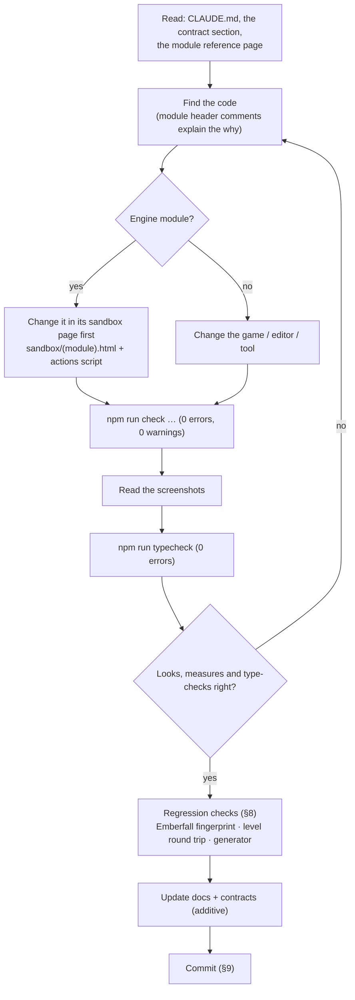
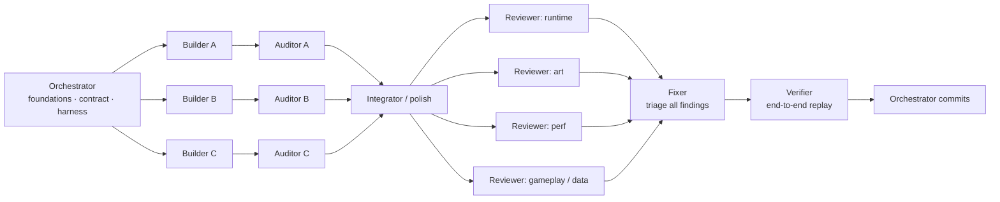

# Development workflow

> **Current workflow (2026-10-08):** [AGENTS.md](../../AGENTS.md) defines the Codex / GitHub
> setup: make and verify changes in `lumina-test` (`test`); promote completed, verified changes
> to `lumina-main` (`main`). Section 9's local-only `master` conventions describe the historical
> Claude development setup, rather than the current branch policy.

> **Purpose.** How to work on Lumina day to day: setup, the project layout, running and building,
> the sandbox-first approach for engine work, how levels are edited or generated, the regression
> practice that keeps Emberfall and the level files stable, the git conventions used so far,
> Windows specifics, and how the multi-agent build was organised — with a recipe to run such a
> workflow again.
>
> **Audience:** developers and AI agents starting work on the repository.
>
> **Source of truth:** [`package.json`](../../package.json), [`vite.config.js`](../../vite.config.js),
> [`tools/`](../../tools/) (`check.mjs`, `vite-level-api.js`, `make-starfall-vale.mjs`,
> `make-sample-hamlet.mjs`, `make-cinderwatch-pass.mjs`, `make-gildhaven.mjs`, `convert-emberfall.mjs`, `check-docs-links.mjs`), [`sandbox/`](../../sandbox/),
> [`.gitattributes`](../../.gitattributes), [`.gitignore`](../../.gitignore),
> [`.claude/launch.json`](../../.claude/launch.json), `git log`, and the workflow reports in
> [`docs/history/reports/`](../history/reports/README.md) (summarised in
> [PROJECT_HISTORY.md](../history/PROJECT_HISTORY.md)).
>
> **Related:** [TESTING_AND_VERIFICATION.md](TESTING_AND_VERIFICATION.md) (the harness in depth) ·
> [CONVENTIONS.md](CONVENTIONS.md) · [contracts/README.md](../contracts/README.md) ·
> [ai/AGENT_ONBOARDING.md](../ai/AGENT_ONBOARDING.md) · [ai/TASK_PLAYBOOKS.md](../ai/TASK_PLAYBOOKS.md) ·
> [user/GETTING_STARTED.md](../user/GETTING_STARTED.md) · [DECISIONS.md](../history/DECISIONS.md)

---

## 1. At a glance

| Command | What it does |
| --- | --- |
| `npm install` | Install dependencies (three 0.186.1, vite 8.3.1, puppeteer-core 25.12.0, lil-gui 0.21.0, the `@fontsource` fonts; for the type check typescript 7.0.2, @types/three 0.186.0, @types/node 24.19.0). |
| `npm run dev` | Vite dev server on **http://127.0.0.1:5173** with the level-save API. |
| `npm run build` | Production build of `index.html` and `editor.html` into `dist/`; `public/levels/` is copied to `dist/levels/`. |
| `npm run preview` | Serve `dist/` (Vite's default preview port, 4173). |
| `npm run check -- --page=… [--query=… --out=… --script=… --wait=… --fps=…]` | Headless real-GPU check: errors, evals, fps, screenshots → `.check/<out>/`. The project's "test". |
| `npm run typecheck` | Type-check the JavaScript through its JSDoc (`tsc`, both programs, ~2 s; exit 1 on any error). Nothing is emitted and Vite never type-checks ([CONVENTIONS.md §3.1](CONVENTIONS.md#31-the-type-check)). |
| `npm run docs:check` | Validate every relative link, image and anchor in `docs/`, `README.md` and `CLAUDE.md`. |
| `npm run level:check -- <level> [--strict] [--routes=<file>]` | Run the generators' level checks on any level file (a name in `public/levels/` or a path) — e.g. after saving a level in the editor. Read-only; exit 1 on errors ([LEVEL_DESIGN_GUIDE §14](../design/LEVEL_DESIGN_GUIDE.md#from-the-command-line-any-level)). |
| `node tools/make-starfall-vale.mjs` | Regenerate and validate `public/levels/starfall-vale.json` (128 × 128). |
| `node tools/make-gildhaven.mjs` | Regenerate and validate `public/levels/gildhaven.json` (the 128 × 128 town); `--check` writes nothing and exits 1 unless the file matches byte for byte. |
| `node tools/make-sample-hamlet.mjs` | Regenerate `public/levels/sample-hamlet.json` (Willowmere). `--out=<path>` writes elsewhere; `--check` writes nothing and exits 1 unless the file matches byte for byte. |

---

## 2. Setup

- **Node.js** — the project was built with Node 24 (npm 11). It needs a version that runs Vite 8
  and supports `import.meta.dirname` (used in `vite.config.js`).
- **A Chromium browser for the harness** — Chrome or Edge in a standard Windows location, or set
  `CHROME_PATH` to any Chrome / Chromium / Edge executable
  ([TESTING_AND_VERIFICATION.md §3](TESTING_AND_VERIFICATION.md#3-how-the-harness-works)).
- **A GPU with WebGL2.** The performance target is 60 fps at 1600 × 900 on a GTX 1060 3 GB, the
  development machine.
- `npm install`, then `npm run dev` and open http://127.0.0.1:5173/ (the game),
  `/editor.html` (the level editor), `/sandbox/` (module test pages) or `/docs/` (this
  documentation's HTML pages).

There is no environment configuration, no backend, no database and no secret. Everything the game
shows is generated at runtime.

---

## 3. Project layout

```
.
├─ index.html                  game page: loading screen, #app, boots src/main.js
├─ editor.html                 level editor page: boot splash, boots src/editor/main.js
├─ src/
│  ├─ main.js                  game entry: resolves ?level=, shows load errors, exposes window.__lumina
│  ├─ globals.d.ts             types of the window.__* hooks (type check only; folders add a types.d.ts)
│  ├─ engine/                  the engine (public API: engine/index.js), ~28 k lines
│  │  ├─ constants.js · utils/math.js · render/GlobalUniforms.js     shared foundation files
│  │  ├─ core/  audio/  render/  pixel/  sprite/  fx/  lighting/  world/  level/  ui/
│  ├─ demo/                    the game layer: Game, World, Player, Npc, Critters, Weather, dialogue … (~4 k lines)
│  └─ editor/                  the level editor: EditorApp, EditorState, tools/, map2d/, viewport3d/, ui/ (~16 k lines)
├─ public/levels/*.json        shipped levels (served as /levels/<name>.json, copied into dist/)
├─ sandbox/                    per-module test pages (*.html + *.js), action scripts (*.json), test helpers (~12.6 k lines)
├─ tools/
│  ├─ check.mjs                the headless check harness (npm run check)
│  ├─ typecheck.mjs            the type check (npm run typecheck); tools/tsconfig.json = the Node program
│  ├─ vite-level-api.js        dev-server plugin: GET/PUT/DELETE /api/levels
│  ├─ make-starfall-vale.mjs   deterministic generator + validator for starfall-vale.json
│  ├─ make-sample-hamlet.mjs   generator for sample-hamlet.json
│  ├─ make-cinderwatch-pass.mjs  generator + validator for cinderwatch-pass.json (the combat level)
│  ├─ make-gildhaven.mjs       generator + validator for gildhaven.json (the 128 × 128 town)
│  ├─ lib/levelgen.mjs         helpers shared by the two generators above
│  ├─ lib/levelcheck.mjs       the level checks (checkLevel): make-gildhaven.mjs and check-level.mjs
│  ├─ check-level.mjs          the level checks on any level file (npm run level:check)
│  ├─ convert-emberfall.mjs    one-off converter (old JS map → emberfall.json; reads git history)
│  └─ check-docs-links.mjs     docs link / image / anchor checker (npm run docs:check)
├─ docs/                       this documentation; docs/contracts/ holds LEVEL_EDITOR.md (binding) and MODULE_NOTES.md
├─ ARCHITECTURE.md             binding engine contract and visual target
├─ README.md · CLAUDE.md       overview · guidance for Claude Code sessions
├─ vite.config.js              dev server 127.0.0.1:5173, level API plugin, two-page build
├─ tsconfig.json               the type check of src/ + sandbox/ (allowJs, checkJs, noEmit, strict off)
├─ .claude/launch.json         "emberfall" preview server config (npm run dev, port 5173)
├─ dist/                       build output (gitignored)
├─ .check/                     harness output: screenshots + report.json per --out (gitignored)
└─ node_modules/.vite-check/   Vite dependency caches of running harness checks (each run deletes its own)
```

Module-by-module detail: [architecture/OVERVIEW.md](../architecture/OVERVIEW.md) and
[architecture/modules/](../architecture/modules/README.md).

---

## 4. Running and building

### 4.1 Dev server

`npm run dev` serves the whole project root, so every page and module is reachable:

| URL | Page |
| --- | --- |
| `/` or `/index.html` | The game; Emberfall by default, title screen first. |
| `/?autostart=1` | Skip the title screen (`?autostart` without a value works too; `autostart=0` does not skip). |
| `/?level=<name>` | Play `public/levels/<name>.json` (`starfall-vale`, `brightwater-crossing`, `sample-hamlet`, `emberfall`). |
| `/?level=local:<slot>` | Play a level stored in this browser; the editor's play-test uses `local:__playtest__`. |
| `/editor.html` | The editor (restores the last layout and offers an autosaved copy). |
| `/editor.html?open=<name>` · `?new` · `?local=<slot>` | Open a project level · start blank · open a browser-stored level. |
| `/sandbox/` | Gallery of the module test pages. |
| `/docs/` | This documentation's landing page ([`docs/index.html`](../index.html)) and its other HTML pages; they also work opened from `file://`. |
| `/api/levels`, `/api/levels/<name>` | The level API (dev only): list, read, write, delete. |

Full parameter lists: [specs/INPUT_AND_CONTROLS.md](../specs/INPUT_AND_CONTROLS.md),
[specs/LEVEL_STORAGE_API.md](../specs/LEVEL_STORAGE_API.md) and
[user/GETTING_STARTED.md](../user/GETTING_STARTED.md).

### 4.2 Build and preview

`npm run build` bundles the two pages (`rollupOptions.input`: `main` = `index.html`, `editor` =
`editor.html`; target `es2022`; chunk-size warning raised to 2,000 kB) and copies `public/` —
including **every** file in `public/levels/`, also untracked scratch levels (for example an
`untitled.json` saved from the editor). The sandboxes and `docs/` are not part of the build.
Bundling takes about half a second to a second (Vite reported 0.37 s, 0.45 s and 1.20 s in three
runs during the documentation pass) and emits the shore worker as a separate asset
(`dist/assets/shoreWorker-*.js`); the largest chunk is ~840 kB (three.js plus the shared engine
code), under the raised 2,000 kB warning limit.

In `npm run preview` (and any static hosting of `dist/`) the level API does not exist
(`apply: 'serve'`): the game still loads `levels/<name>.json`, but the editor cannot save to the
project folder — it offers browser storage and downloads instead. (`vite preview` answers
`/api/levels` with its `index.html` fallback, HTTP 200; `LevelStorage.hasProjectApi` checks for a
JSON content type, so the editor correctly treats the API as absent.)

### 4.3 Preview tooling

`.claude/launch.json` defines one configuration, `emberfall` (`npm run dev`, port 5173), for
IDE preview panes. Remember that a dev-server tab left open in such a pane renders continuously
and competes for the GPU with harness measurements.

---

## 5. The daily loop



1. **Read before editing.** [`CLAUDE.md`](../../CLAUDE.md) (invariants), the contract section for the
   area ([contracts/README.md](../contracts/README.md)), and the module reference page. Every
   source file starts with a header comment that explains its rules — read it.
2. **Make the change** following [CONVENTIONS.md](CONVENTIONS.md).
3. **Check it in the real renderer** with `npm run check` and read the PNGs. Use `--headful` or
   `npm run dev` in a browser when you need to look interactively.
4. **Run `npm run typecheck`** (0 errors) and **the regression checks** that match the change
   ([§8](#8-regression-practice)).
5. **Update the docs** in the same change and commit.

---

## 6. Sandbox-first engine work

Every engine module was built and audited in isolation before any integration
(ARCHITECTURE §6): *each module author creates `sandbox/<module>.html` (+ `.js`) that exercises
the module with raw three.js and the shared foundation files only … A module is not done until its
sandbox renders correctly with zero errors.* Keep working that way:

- **Reproduce in the sandbox first.** It isolates the module from the game's weather, time,
  post-processing and 100+ other meshes, and it loads in a second. The sandbox pages have views and
  query parameters that frame the interesting cases
  ([TESTING_AND_VERIFICATION.md §8](TESTING_AND_VERIFICATION.md#8-sandbox-pages-and-scripted-suites)).
- **Expose a hook** (`window.__<module>`) with setters and self-tests (`runTests()`, `check()`,
  `info()`), and add assertions to the module's action script when you fix a bug — the audits
  added regression evals for their fixes (for example `interruptedResolvedWith` in the UI
  sandbox, `disposeTest()` in the props sandbox).
- **Then check the integration**: the game (`index.html`), the editor preview when the module is
  used there (`editor.html?open=emberfall`), and the big level if performance is involved.
- New module? Create `sandbox/<name>.html`, `sandbox/<name>.js` and `sandbox/<name>.actions.json`,
  and link the page from `sandbox/index.html`.

---

## 7. Working with levels

| Level | Source of truth | How to change it |
| --- | --- | --- |
| `emberfall.json` (48 × 40, 136 objects) | the JSON file itself | In the editor (`editor.html?open=emberfall`, Ctrl+S saves back through the dev API) or by hand in the JSON. NPC `script` ids point to hand-written conversations in `src/demo/dialogue.js`. |
| `brightwater-crossing.json` (36 × 28, 68 objects) | the JSON file (built through the editor UI) | In the editor. |
| `sample-hamlet.json` (Willowmere, 28 × 22, 38 objects) | `tools/make-sample-hamlet.mjs` | Edit the script, run `node tools/make-sample-hamlet.mjs`. See the note below. |
| `starfall-vale.json` (128 × 128, 874 objects) | `tools/make-starfall-vale.mjs` | Edit the generator, run it; **never hand-edit the JSON**. To continue it by hand, copy it to a new name first. |
| `gildhaven.json` (128 × 128, 518 objects) | `tools/make-gildhaven.mjs` | The same: edit the generator, run it (`--check` confirms the file is up to date); see [its page](../design/levels/gildhaven.md). |
| any untracked `*.json` | the user's own scratch levels (e.g. an `untitled.json` saved from the editor) | Do not touch, do not commit. |

- **Generators are deterministic.** `make-starfall-vale.mjs` validates the level (reachability,
  routes, bridges, stairs, sightlines, coverage, round trip) and writes nothing if a check fails.
  Options: `--out=<path>` (write elsewhere), `--ascii` (print the tile map), `--quiet`, `--force`
  (write a failing level for inspection; still exits 1). It runs in under a second. Changing an
  early scatter rule reshuffles every tree placed after it — re-run your checks afterwards.
- **`make-sample-hamlet.mjs`** writes `public/levels/sample-hamlet.json` (`--out=<path>` writes
  elsewhere, relative to the repository root). `--check` writes nothing and compares: exit 0 when
  the file matches byte for byte, else exit 1 saying whether the data or only the key order /
  formatting differs. It pins each object's key order itself and refuses to write unless the output
  round-trips byte-identically, so an unchanged script reproduces the committed file exactly.
- **`convert-emberfall.mjs` is historical.** The old JS map was deleted in `dadfcd6`; the script
  reads it from git and needs `--rev=<a revision before dadfcd6>`, e.g. `--rev=8ec4849`. Emberfall
  has been edited as JSON since, so do not re-run it over the current file.
- **New levels**: editor *File › New*, build, *Save as › Project folder* → `public/levels/<name>.json`,
  play with `index.html?level=<name>`. Format reference: [specs/LEVEL_FORMAT.md](../specs/LEVEL_FORMAT.md);
  workflow: [user/LEVEL_EDITOR_GUIDE.md](../user/LEVEL_EDITOR_GUIDE.md); design advice:
  [design/LEVEL_DESIGN_GUIDE.md](../design/LEVEL_DESIGN_GUIDE.md).
- **Scripted editor tests can write levels** through the dev API. Delete any temporary level you
  create (`zz-…`, `rv-…` names were used) and check `git status public/levels` before committing.

---

## 8. Regression practice

### 8.1 What to run for which change

| You changed… | Run |
| --- | --- |
| anything | `npm run typecheck`; `npm run build`; the game and the editor clean in the harness; screenshots read |
| an engine module | its sandbox suite; Emberfall fingerprint ([§8.2](#82-emberfall-fingerprint-and-screenshots)); shader-program count; draw calls |
| rendering or look | shots across hours and weather; frozen-frame image diffs where nothing should change |
| the level format, catalog or storage | round trip ([§8.3](#83-byte-stable-level-round-trip)); editor open + Ctrl+S + `git diff`; `sandbox/game_levels.html` cases |
| a generator or anything it imports | determinism and validation ([§8.4](#84-generator-determinism)) |
| big-level code | small levels identical ([§8.5](#85-small-levels-must-not-change)); Starfall draw calls, load time, light pool |
| the editor | the editor suites, `editor_perf.json` exactness, play-test |

The complete checklist is in
[TESTING_AND_VERIFICATION.md §12](TESTING_AND_VERIFICATION.md#12-pre-commit-verification-checklist).

### 8.2 Emberfall fingerprint and screenshots

Emberfall is the reference scene: every engine change during the build was checked against it.
Two techniques, both documented with working snippets in
[TESTING_AND_VERIFICATION.md §11](TESTING_AND_VERIFICATION.md#11-visual-regression-techniques-used-in-this-project):

- **World fingerprint** — hashes of the 12 point lights, all static colliders and all 100 world
  meshes, plus interactables and the program count. Current baseline (the same at `584fbc5` and
  `8ae4ad8`): `lights 12:b5a82211`, `colliders 150:55d60d2f`, `meshes 100:82b0b920`,
  11 interactables, 57 programs. If a change is not meant to alter the world, these must not change.
- **Frozen-frame screenshot diffs** — `timeScale = 0`, grain off, particles hidden, then a mean
  absolute pixel difference. Two runs of the same code differ by a mean of ~0.4; unfrozen runs by
  ~5–7.

### 8.3 Byte-stable level round trip

Parsing and re-serialising a level must reproduce the file byte for byte
([ADR-023](../history/DECISIONS.md#adr-023--byte-stable-level-serialisation)):

```bash
node --input-type=module -e "
import fs from 'node:fs';
import { parseLevel, serializeLevel } from './src/engine/level/LevelFormat.js';
for (const f of fs.readdirSync('public/levels').filter((f) => f.endsWith('.json'))) {
  const text = fs.readFileSync('public/levels/' + f, 'utf8');
  console.log(f, serializeLevel(parseLevel(text).level) === text ? 'byte-identical' : 'CHANGED');
}"
```

All four shipped levels print `byte-identical`. The in-editor version: open a level
(`editor.html?open=emberfall`), press Ctrl+S, and `git diff public/levels` must be empty.

### 8.4 Generator determinism

```bash
node tools/make-starfall-vale.mjs --out=.check/sv.json --quiet \
  && git hash-object .check/sv.json public/levels/starfall-vale.json
```

`git hash-object` prints the blob id of each file; the two lines must be equal. For the committed
file both are `499a8bd382ce98fce59ab5ca3d8e3d826952ccf4` (md5 `bfeb767fc9c4a6c61c125eeca4a42a35`),
re-checked at `8ae4ad8`; the generator ran in 0.8 s. If you changed the generator on purpose, run
it without `--out`, review the diff and the in-game result, and commit the regenerated file with
the generator change.

### 8.5 Small levels must not change

Big-level systems are gated at 64 tiles. After touching them, compare Emberfall, sample-hamlet and
brightwater-crossing before and after at fixed teleports and hours: draw calls, triangles and the
light list must be identical (the build workflows reported e.g. Emberfall 202 / 335,238,
sample-hamlet 138 / 160,850, brightwater-crossing 192 / 222,638 at their comparison spots), and
frozen screenshots must differ only where villagers walked.

### 8.6 Shader programs and hitches

`renderer.info.programs.length` after load (57 Emberfall, 59 Starfall Vale) must not grow while
cycling time (T), weather (R), opening the world map (N) or photo mode (P). A new program at
runtime is a visible hitch ([ADR-008](../history/DECISIONS.md#adr-008--compile-every-shader-at-load-against-the-hdr-target)).

---

## 9. Git conventions

- **One branch, `master`, no remote.** 14 commits at the time of writing, the last being the
  first draft of this documentation (`8ae4ad8`); see [PROJECT_HISTORY.md §9](../history/PROJECT_HISTORY.md#9-commit-log).
  All commits carry the user's own git identity as author.
- **Line endings are LF.** `.gitattributes` has `* text=auto eol=lf` and `*.png binary`. Some agents
  saved files with CRLF on Windows; git normalises them on commit, so diffs stay small. Do not
  commit CRLF-only changes.
- **Ignored:** `node_modules/`, `dist/`, `.check/`, `*.log`. Harness output, ad-hoc scripts and the
  build history all live in `.check/` and are never committed — copy anything worth keeping into
  `docs/`.
- **Never commit untracked user levels** in `public/levels/` or temporary test levels.
- **Commit style** (from the history):
  - Subject: imperative or descriptive summary in sentence case, no trailing period, naming the
    feature area first when useful — `Level editor: apply all review findings; Brightwater
    Crossing showcase level`, `Add CLAUDE.md with commands, architecture and invariants for Claude Code`,
    `Docs: first draft of the docs/ tree (…)`. Subjects run long (up to ~130 characters) rather than
    dropping an area.
  - Body (optional): a blank line, then either short `- ` bullets, one per area (`dadfcd6`,
    `30290d0`, `1643b2c`, `ef71917`, `db41c62`), or one prose paragraph (`807bfe4`, `8e36884`,
    `8ec4849`, `8ae4ad8`), wrapped near 80 columns.
  - Trailer, on every commit so far: `Co-Authored-By: Claude Opus 5.5 <noreply@anthropic.com>`.
  - One commit per completed phase or workflow; an interrupted pass is committed as
    `WIP: … (interrupted … pass)` so the next agent can resume from it (`9dadcf8`). A draft that
    still needs checking says so in the body (`8ae4ad8`: "Fact-checking pending.").

Example (abridged from `db41c62`):

```
Starfall Vale: apply 50 review findings; Starfall night event, sightline and light-pool fixes

- LightPool favours nearby lamps; waterfall burst shaders warmed at load;
  shore bake reused from the worker; editor draw calls 2872 -> 915
- Dawn/dusk grading, lake colour at golden hour, world-map label placement,
  minimap outer ground; docs and README updated

Co-Authored-By: Claude Opus 5.5 <noreply@anthropic.com>
```

Subagents inside a parallel workflow do **not** commit on their own; the orchestrating session makes
the commits after each workflow. Otherwise, commit finished, verified changes without waiting to be
asked (see [`CLAUDE.md`](../../CLAUDE.md)).

---

## 10. Windows notes

- **Shells.** Claude Code's Bash tool is Git Bash (POSIX syntax: `/dev/null`, forward slashes,
  `$VAR`); PowerShell is also available. Paths like `E:\workspace\3d_pixel` appear as
  `/e/workspace/3d_pixel` in Git Bash. Use absolute paths in agent sessions (the working directory
  resets between calls).
- **Quote `&` in queries:** `npm run check -- --page=index.html "--query=level=starfall-vale&autostart=1"`.
- **Chrome location.** The harness looks in `C:/Program Files (x86)/Google/Chrome/…` first (where
  Chrome is installed on the dev machine), then `C:/Program Files/…`, then Edge; override with
  `CHROME_PATH`. It launches Chrome with `--use-angle=d3d11`, so rendering goes through ANGLE /
  Direct3D 11 on the real GPU.
- **Reserved file names.** `con`, `nul`, `prn`, `aux`, `com0`–`com9` and `lpt0`–`lpt9` cannot be
  file names on Windows. `slugify` gives such level names a `-level` suffix and the level API refuses
  them (a review repro once created `con.json`).
- **Locked or read-only files.** A save to a file that is read-only or open elsewhere fails with
  `EPERM` / `EACCES` / `EBUSY`; the API answers "the file is read-only or in use by another program"
  and removes its `.tmp`.
- **Disk.** Each harness run deletes its Vite dependency cache in `node_modules/.vite-check/`
  when it ends (since 2026-10-01; before that the caches were kept and reached 36 GB); only a
  hard-killed run leaves one behind, so delete the folder any time no check is running. The
  screenshots and reports in `.check/` are kept, one folder per `--out` name, and grow with every
  run — delete old ones from time to time (the build history is archived in
  [`docs/history/reports/`](../history/reports/README.md)).
- **GPU sharing.** Other desktop apps, an IDE browser pane and parallel harness runs all share the
  GPU; measure with GPU minima and interleaved runs
  ([TESTING_AND_VERIFICATION.md §9](TESTING_AND_VERIFICATION.md#9-measuring-performance-correctly)).

---

## 11. How the multi-agent work was organised

Lumina was built by one orchestrating Claude Code session running **multi-agent workflows**: 49
agents in seven workflows. The seven workflows ran for about 20 hours in total, within about
31 hours of wall-clock time from the first commit (09-25 21:19) to the last Starfall commit
(09-27 04:51), idle gaps included
([PROJECT_HISTORY.md](../history/PROJECT_HISTORY.md),
[ADR-009](../history/DECISIONS.md#adr-009--contract-first-multi-agent-development)).

### 11.1 Roles

| Role | Input | Job | Output |
| --- | --- | --- | --- |
| **Orchestrator** | the user's request | Write the foundation files, the binding contract and the harness; design the workflow; start agents; merge results; commit. | contract docs, foundations, commits |
| **Builder** | the contract + ownership of one area | Build it against the contract, with its own sandbox page and action scripts; report deviations. | code + a structured report |
| **Auditor** | a builder's area | Independently and sceptically re-check the contract, the look and robustness; **fix** what it finds; add regression evals. | fixes + audit report |
| **Integrator / polish** | all modules | Wire everything into the product (the demo, the editor preview, the big level) and make it perform. | integration + measurements |
| **Reviewer** (per lens) | the integrated product | Find problems through one lens — runtime, art direction, performance, gameplay / UX, data integrity, exploration — with real input; **change nothing**. | findings with severity, files, evidence, repro, suggested fix |
| **Fixer** | all findings | Triage every finding, confirm it with a baseline run, fix it, re-run the repro. | per-finding status and notes |
| **Verifier** | the fixed product | Replay everything end to end with real input; fix what is left; record final measurements and best screenshots. | checks, fixed, remaining, measurements |



### 11.2 Rules every agent got

Only the first lines of each prompt survive in the reports (`promptPreview`); the list below is
reconstructed from those openings and from what the reports say the agents did. The prompts
shared a project header (what Lumina is, the Windows / Git Bash environment, what
already exists), a *read first* list (`ARCHITECTURE.md` or the level/editor contract — then at
`docs/LEVEL_EDITOR.md`, now [`docs/contracts/LEVEL_EDITOR.md`](../contracts/LEVEL_EDITOR.md) — as
"the binding contract", `README.md`, `MODULE_NOTES.md`), the role, and these rules:

- The contract is binding; additions are fine, never rename or change the meaning of a member.
  Report any foundation change.
- Write only the files you own; another agent is changing the rest at the same time.
- Verify in the real renderer with `npm run check`, read the screenshots, reach zero page errors,
  console errors, warnings and failed requests. Use your own `--out` names and keep your scripts in
  your own namespace (`sandbox/<module>.*`, `.check/<role>/`).
- Measure GPU minima and CPU times; the GPU is shared.
- Never touch an untracked level you did not create;
  delete the temporary levels you create; no git commits.
- Finish with a structured report (JSON) in the fields the orchestrator asked for.

### 11.3 Structured results

Structured outputs made the orchestration mechanical. The shapes used:

| Role | Fields |
| --- | --- |
| Builder + auditor (per module, workflows 01 and 03) | `key, build_status, files, api_summary, deviations, foundation_changes, limitations, audit_status, audit_fixed[], audit_remaining[], visual, integrator_notes, screenshots[]` (03: `integration_notes` and `quality` instead of `integrator_notes` and `visual`, no `deviations`) |
| Builder / integrator (workflow 06) | `status, summary, files, measurements, notes_for_integrator, problems, screenshots` |
| Reviewer | `lens, summary, count`, and per finding `severity (critical/major/minor/polish), title, files, evidence, repro, suggested_fix` |
| Fixer | `triage[] { finding, status, note }, files_changed, notes` — status `fixed_before` / `fixed_now` in 05, `fixed` in 07 (02 used `applied[]`, `skipped[]` instead of a triage) |
| Verifier | `status, checks[], fixed[], remaining[], best_screenshots[]`, plus `perf` (02), `showcase_level` (05) or `measurements` and `tour` (07) |

The builder reports were condensed into [`docs/contracts/MODULE_NOTES.md`](../contracts/MODULE_NOTES.md);
all reports are summarised in [PROJECT_HISTORY.md](../history/PROJECT_HISTORY.md).

### 11.4 Scheduling and dependencies

- Start independent builders together; start dependent ones as soon as their dependency is built
  (terrain and props waited for the texture library, then ran while the texture audit ran).
- Pair every builder with an auditor that starts when that builder finishes.
- Review lenses run in parallel; there is one fixer (findings overlap — the NPC jitter bug was
  reported by two lenses — and one agent resolves conflicts).
- Two parallel builders can own complementary halves of one feature (the big-level engine work and
  the level design), followed by one integrator who owns the combination.
- **The combat workflow (2026-09-28)** went further: the lead wrote the whole design as a binding
  contract ([COMBAT.md](../contracts/COMBAT.md), reviewed twice before any code) with a table of
  **disjoint file ownership** for seven packages (§22.2) and a *foundation* commit of
  **shape-complete placeholders** — real exports with the final signatures and return shapes — so
  every package could run its sandbox, and combat-core the game against an in-page fixture level,
  from the first minute. Packages wrote change requests for files they did not own into their
  reports; the integrator applied them and recorded every kept deviation in the contract (§27).
  After integration a code and play review fed three fix passes on disjoint areas (game, art and
  level, editor), then a final regression pass.

### 11.5 Interruptions

Agents hit usage and session limits twice during the build (the first Emberfall integrator,
workflow 04's fixer and verifier), once more during the documentation pass and once during the
combat documentation pass. What worked:

1. Commit the partial work as a WIP commit so nothing is lost and the next agent sees the tree.
2. Keep the reviewers' findings (with evidence and repro) in a file.
3. Start a fresh fixer that triages every finding as *fixed before* or *fixed now*, re-runs each
   repro against the current code, and reviews the interrupted agent's changes — the replacement
   fixer found three bugs in them.
4. Run the verifier only after that.
5. For writing work (the documentation pass): commit the drafts as they are, mark the commit
   ("Fact-checking pending."), and resume each writer on its *own* files with the instruction to
   review against the code and fix, not to start over.

### 11.6 Repeating it

1. **Write the contract first.** Names, signatures, units, ownership, the visual or behavioural
   target, and the performance budget. Put shared helpers in foundation files before anyone starts.
2. **Make verification possible first.** The harness, a sandbox per module, `window.__*` hooks.
3. **Split by ownership, not by layer.** Each builder owns a directory and a sandbox namespace.
4. **Give every prompt** the project header, the read-first list, the rules of §11.2 and the exact
   result fields.
5. **Audit every builder**, independently and sceptically, with permission to fix.
6. **Integrate**, then **review through lenses** with real input and numbers, then **fix** with
   triage, then **verify** end to end.
7. **Record** — condense the reports into docs (`MODULE_NOTES.md`, the history), update the
   contracts additively, commit per phase.

---

## 12. Before you finish

- The harness is clean for the pages you touched, and you have looked at the screenshots.
- The regression checks for your change pass ([§8](#8-regression-practice)).
- Contracts and docs are updated ([contracts/README.md](../contracts/README.md)), and
  `npm run docs:check` reports no broken link.
- `git status` shows no temporary levels and no `.check/` files, and nothing stages a user's
  untracked level.
- Full list: [TESTING_AND_VERIFICATION.md §12](TESTING_AND_VERIFICATION.md#12-pre-commit-verification-checklist).
