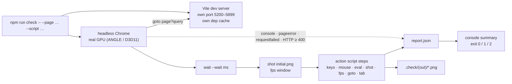

# Testing and verification

> **Purpose.** How Lumina is verified: the headless check harness in depth (its own Vite server,
> Chrome on the real GPU, `report.json`, exit codes), how to write action scripts with keys, real
> mouse drags, tabs and assertions, the sandbox pages and scripted suites, how to measure
> performance without fooling yourself, how to review screenshots, the visual-regression
> techniques used during the build, the JSDoc type check and what it catches, and a pre-commit
> checklist. Every command and snippet on this page was run against the current code.
>
> **Audience:** developers and AI agents who change anything and need to prove it still works.
>
> **Source of truth:** [`tools/check.mjs`](../../tools/check.mjs) (the harness),
> [`sandbox/`](../../sandbox/) (module pages, action scripts, helpers
> [`editor_shell.helpers.js`](../../sandbox/editor_shell.helpers.js) and
> [`editor_perf.helpers.js`](../../sandbox/editor_perf.helpers.js)), the automation hooks in
> [`src/demo/Game.js`](../../src/demo/Game.js) (`_exposeGlobal`, `state`), [`src/main.js`](../../src/main.js)
> (`window.__lumina`), [`src/editor/EditorApp.js`](../../src/editor/EditorApp.js) (`window.__editor`,
> set in the `EditorApp` constructor), [`src/engine/core/Engine.js`](../../src/engine/core/Engine.js)
> (`window.__engine`), [`src/engine/render/PostFX.js`](../../src/engine/render/PostFX.js)
> (`enableTimings`, `sceneInfo`), [`src/engine/ui/DebugPanel.js`](../../src/engine/ui/DebugPanel.js)
> (`DebugStats`), and for the type check [`tools/typecheck.mjs`](../../tools/typecheck.mjs) with
> [`tsconfig.json`](../../tsconfig.json) and [`tools/tsconfig.json`](../../tools/tsconfig.json).
>
> **Related:** [DEVELOPMENT_WORKFLOW.md](DEVELOPMENT_WORKFLOW.md) (the daily loop and regression
> matrix) · [specs/AUTOMATION_API.md](../specs/AUTOMATION_API.md) (every `window.__*` hook) ·
> [architecture/PERFORMANCE.md](../architecture/PERFORMANCE.md) (budgets and measured numbers) ·
> [CONVENTIONS.md](CONVENTIONS.md) · [ai/TASK_PLAYBOOKS.md](../ai/TASK_PLAYBOOKS.md)

---

## 1. Overview

There is **no unit-test runner and no linter**. Verification means running the real pages in a
real browser on the real GPU and checking three things: nothing threw, the numbers are right, and
the screenshots look right. Beside it, a static **type check** of the JavaScript against its JSDoc
(`npm run typecheck`, [§8.4](#84-the-type-check)) catches renamed members, wrong shapes and arities
before anything runs.

| Kind of check | Tool | Typical use |
| --- | --- | --- |
| Types | `npm run typecheck` (0 errors in both programs) | every change |
| Page runs clean | `npm run check` (0 page errors, 0 console errors, 0 warnings, 0 failed requests) | every change |
| Behaviour | action scripts with `eval` steps reading `window.__game`, `__editor`, sandbox hooks | gameplay, editor, module APIs |
| Look | screenshots in `.check/<out>/*.png`, read and judged | rendering, art, UI |
| Performance | GPU timer minima, CPU timings, draw calls, program counts, frame pacing | engine, big levels, editor strokes |
| "Nothing changed" | world fingerprint, frozen-frame image diff, editor exactness check | refactors, big-level work |
| Data | level round-trip byte check, generator determinism and validation (Node) | level format, generators |



---

## 2. Quick start

```bash
# The game (Emberfall), skipping the title screen (autostart=1 is the default query)
npm run check -- --page=index.html --out=game --wait=6000

# Another level: quote the query because of the '&'
npm run check -- --page=index.html "--query=level=starfall-vale&autostart=1" --out=sv --wait=9000

# The editor on a project level, no fps window
npm run check -- --page=editor.html --query=open=emberfall --out=ed --fps=0

# One engine module in isolation
npm run check -- --page=sandbox/terrain.html --out=terrain --script=sandbox/terrain.quick.json

# Editor stroke performance with real mouse drags
npm run check -- --page=editor.html --query=new --out=perf --fps=0 --script=sandbox/editor_perf.json

# The type check (no browser; ~2 s)
npm run typecheck
```

Then read the console summary, open `.check/<out>/report.json` if needed, and **look at the
screenshots** (`.check/<out>/initial.png` and every `shot`).

---

## 3. How the harness works

`tools/check.mjs`, in order:

1. **Parses arguments** of the form `--name=value` (a bare `--name` becomes `true`).
2. **Finds a browser**: `CHROME_PATH` if set, else the first that exists of
   `C:/Program Files (x86)/Google/Chrome/Application/chrome.exe`,
   `C:/Program Files/Google/Chrome/Application/chrome.exe`,
   `C:/Program Files (x86)/Microsoft/Edge/Application/msedge.exe`,
   `C:/Program Files/Microsoft/Edge/Application/msedge.exe`. None → prints
   `No Chrome/Edge found; set CHROME_PATH` and exits with code **2**. On macOS or Linux, set
   `CHROME_PATH`.
3. **Cleans the output folder** `.check/<out>/`: deletes `*.png` and `report.json` only; other files
   you put there survive.
4. **Starts its own Vite dev server** with `createServer` on a random port 5200–5899 (not strict),
   host `127.0.0.1`, HMR off, `logLevel: 'error'`, using the project's `vite.config.js` — so the
   **level API is active** and scripts can write into `public/levels/`. The dependency-optimizer
   cache is `node_modules/.vite-check/<out>-<pid>` (every character of `<out>` other than letters,
   digits, `_` and `-` replaced by `_`), one per run, so several checks can run **in parallel**
   without racing, and the run **deletes it when it ends** — also after a failure, an uncaught
   error or Ctrl+C. Only a hard-killed run (a tool timeout) leaves its cache behind; delete
   `node_modules/.vite-check/` any time no check is running. A cold cache costs under a second
   per run (5.7 vs 4.8 s on `sandbox/terrain.html`). Before 2026-10-01 the caches were kept, one per
   `--out` name, 5–20 MB each: 36 GB had piled up. `--keep-cache` keeps that behaviour (a cache
   named `<out>`, kept and reused by the next run with the same `--out`).
5. **Launches Chrome** (headless `'new'`, or visible with `--headful`) with
   `--window-size=<w>,<h> --ignore-gpu-blocklist --enable-gpu --enable-webgl --use-angle=d3d11
   --autoplay-policy=no-user-gesture-required --no-first-run --no-default-browser-check` and a
   `<w> × <h>` viewport. `--use-angle=d3d11` is Windows-specific. Each launch uses a fresh
   temporary profile, so **the GPU shader cache is cold** on the first load of every run.
6. **Watches the page** — and every tab the page opens, from its first request — for console
   messages, page errors (uncaught exceptions and unhandled rejections), failed requests and
   HTTP responses ≥ 400.
7. **Navigates** to `http://127.0.0.1:<port>/<page>?<query>` and waits for the `load` event
   (60 s timeout), then records the GPU renderer string (`UNMASKED_RENDERER_WEBGL`).
8. **Sleeps `--wait` ms**, takes `initial.png`, and — unless `--fps=0` — measures fps over `--fps`
   ms (label `initial`).
9. **Runs the action script** steps in order ([§5](#5-writing-action-scripts)). An exception in a
   step (a timeout, a missing tab) is recorded as a page error `HARNESS: …` and stops the script.
10. **Closes** Chrome and the server, writes `report.json`, prints the summary, exits.

### Options

| Option | Default | Meaning |
| --- | --- | --- |
| `--page=<path>` | `index.html` | Page relative to the project root (`editor.html`, `sandbox/props.html`, `docs/index.html` …). |
| `--query=<query>` | `autostart=1` | Query string without `?`. **Pass `--query=` for none** (a bare `--query` would send `true`). Quote it when it contains `&`. |
| `--out=<name>` | page file name without `.html` | Output folder `.check/<name>/` and cache folder name. Use a new name per concurrent run. |
| `--wait=<ms>` | `4000` | Sleep after `load`, before `initial.png`. The game needs ~4–6 s to reach gameplay (Starfall Vale longer) — or use `--wait=0` and a readiness eval ([§5.4](#54-waiting-for-readiness)). |
| `--width=<px>` `--height=<px>` | `1600` `900` | Window and viewport size (the performance target is 1600 × 900). |
| `--script=<file>` | none | JSON action script, path relative to the project root (absolute paths work too). |
| `--fps=<ms>` | `3000` | Length of the initial fps window; `0` skips it. |
| `--headful` | off | Show the browser window. |
| `--keep-cache` | off | Keep the Vite dependency cache (`node_modules/.vite-check/<out>`) for the next run with the same `--out`; by default each run deletes its own. |

---

## 4. Output: `report.json`, console summary and exit codes

`.check/<out>/report.json`:

| Field | Content |
| --- | --- |
| `page`, `query` | What was opened. |
| `gl` | GPU renderer string, e.g. `ANGLE (NVIDIA, NVIDIA GeForce GTX 1060 3GB (0x00001C02) Direct3D11 vs_5_0 ps_5_0, D3D11)`, or `NO WEBGL2`. |
| `console` | Every console message `{ type, text }`. |
| `errors` | Texts of `console.error` messages, **except** those matching `favicon` or `status of 404 (Not Found)`. |
| `warnings` | Texts of `console.warn` messages. |
| `pageErrors` | Uncaught exceptions (with stack) and `HARNESS: …` step failures. |
| `failedRequests` | Network failures and HTTP ≥ 400 responses (except `/favicon.ico`), e.g. a 404 from the level API or a missing module. |
| `evals` | `{ code, result }` or `{ code, error }` per `eval` step, plus `{ code: 'tab last' \| 'tab <n>', result: <url> }` when a `tab` step switched tabs. |
| `fps` | `{ label, fps, p50ms, p95ms }` per fps window. |
| `shots` | Paths of the screenshots, relative to the project root. |

The console summary prints the URL, the GPU, every fps window, then the total count and the
first unique entries of page errors (20, first 6 lines of each stack), console errors (20, each
cut to 500 characters), console warnings (10, cut to 300) and failed requests (10), every eval with
its result (truncated to 400 characters; `report.json` has the full value) and the screenshot
list. The harness's own Vite server may add a line before the summary: Vite forwards uncaught
page errors to the terminal as `[vite] (client) [Unhandled error] …`.

| Exit code | When |
| --- | --- |
| `0` | No page errors. |
| `1` | At least one page error (including `HARNESS:` step failures). Also when the harness itself crashes before the page opens — for example an unreadable or invalid `--script` JSON file (parsed first) or a Vite server that cannot start; Node prints the stack and no `report.json` is written. |
| `2` | No Chrome / Edge found. |

**What does *not* fail a run** — you must read the output for these: console errors, console
warnings, failed requests, an `eval` that throws (recorded as `error`), and wrong results. "Clean"
in this project means all four counts are zero, not just the exit code. The only expected warnings
are deliberate ones (for example the `game_levels` cases log the spawn move and the unknown-script
warning on purpose, and the `hostile` case about 30: its 15 load warnings, unknown textures, particle
areas and scripts, in the game and the editor).

A missing level is a good example: `index.html?level=zz-missing-level` exits with code 0, 0 page
errors and 0 failed requests — the Vite dev server answers the unknown `/levels/…json` path with
`index.html` (HTTP 200), `loadProjectLevel` rejects the HTML, and the only trace is one warning,
`[Lumina] Could not load level "zz-missing-level": Level "zz-missing-level" not found`, plus the
error text on the loading screen (re-checked during the fact-check). `npm run preview` behaves the
same way (its SPA fallback also answers `/levels/<missing>.json` with `index.html`, HTTP 200). Only
a plain static host of `dist/` returns a real 404, which then also appears under failed requests.

---

## 5. Writing action scripts

A script is a JSON array of step objects run in order after the initial wait. Each step does
**one** thing; the harness checks the keys in the order of the table and runs the first one it
finds (so `{ "wait": 0 }` does nothing).

### 5.1 Step reference

| Step | Fields | What it does |
| --- | --- | --- |
| `{ "wait": 1000 }` | ms | Sleep. |
| `{ "key": "KeyW", "hold": 800 }` | key name, `hold` ms (default 300) | Hold a key down, then release. |
| `{ "press": "Space" }` | key name | Tap a key. |
| `{ "eval": "…" }` | JS source | Evaluate in the page ([§5.2](#52-eval-semantics)). |
| `{ "shot": "night" }` | name | Save `.check/<out>/night.png`. |
| `{ "fps": 2000, "label": "night" }` | ms, optional label | Measure frame rate over the window with `requestAnimationFrame`: fps, p50 and p95 frame time. |
| `{ "click": [x, y], "button": "left", "count": 1 }` | viewport px; `left` / `right` / `middle`; count | Real mouse click (`count: 2` sends a real `dblclick`). |
| `{ "dblclick": [x, y] }` | viewport px | Real double click. |
| `{ "move": [x, y], "steps": 1 }` | viewport px, interpolation steps | Move the mouse (hover). |
| `{ "mouse": "down", "button": "left" }` | `down` / `up` | Press or release at the current mouse position. |
| `{ "drag": [[x0, y0], [x1, y1], …], "button": "left", "steps": 8, "pause": 0, "modifiers": ["Shift"] }` | points, button, moves per segment, ms pause after each segment, held keys | Real drag: move to the first point, press, move through the others, release. |
| `{ "wheel": [x, y], "deltaY": -240 }` | viewport px, delta (default −240) | Move there and scroll. |
| `{ "type": "text", "selector": "input.name", "delay": 10 }` | text, optional CSS selector, ms per key (default 10) | With `selector`: triple-click that element first (selects its text). Then type into whatever has focus. |
| `{ "combo": ["Control", "KeyZ"] }` | keys | Hold all but the last key, tap the last, release. |
| `{ "goto": "editor.html?open=x" }` | path relative to the dev server, or a full `http…` URL | Navigate; waits for `load`. |
| `{ "tab": "last" }` or `{ "tab": 0 }` | `last` or an index | Continue in another tab (see [§5.6](#56-tabs-and-navigation)). |

Key names are Puppeteer key names; use the `KeyboardEvent.code` form the game binds (`KeyW`,
`ShiftLeft`, `Space`, `Enter`, `ArrowDown`, `Escape`, `Tab`, `Backquote`, `F5`, `Control`,
`Shift`, `Alt`).

### 5.2 Eval semantics

- The string is evaluated in the page like a script; the value of the **last expression** is the
  result. Statement sequences work: `"__game.setTime(21); 'ok'"`.
- A returned **Promise is awaited** — use this for waits, async checks and async IIFEs
  (`"(async () => { … })()"`).
- The result is JSON-serialised; `undefined` becomes `null`. Return strings or
  `JSON.stringify(…)` for objects with cycles, DOM nodes or three.js objects.
- A thrown exception is recorded as `{ code, error }` and **does not fail the run**.
- An eval that returns a promise which only settles when a dialog closes (for example calling an
  editor command that opens a dialog) blocks the script; wrap it: `"(app.commands.x.run(), 'ok')"`.
- Every page served by the dev server can `import()` any module under the project root, so helper
  libraries can live in `sandbox/` (versioned) or `.check/` (local): 
  `"import('/sandbox/editor_shell.helpers.js').then((m) => m.install())"`.

### 5.3 Assertions that fail the run

Throw **asynchronously** so the exception becomes a page error (exit code 1):

```json
{ "eval": "(() => { const s = __game.state(); if (s.pointLights !== 12) setTimeout(() => { throw new Error('ASSERT expected 12 point lights, got ' + s.pointLights); }); return s.pointLights; })()" }
```

A synchronous `throw` inside the eval is only recorded in `evals[].error`. `console.assert` is not
counted as an error either (Puppeteer reports it as type `assert`, not `error`). (Checked twice,
the second time during the fact-check: one eval that throws synchronously *and* schedules an
asynchronous throw produced `evals[].error: "Error: sync"`, one page error `Error: ASSERT …` and
exit code 1; a failing `console.assert` left 0 console errors.)

### 5.4 Waiting for readiness

`goto` and the initial navigation only wait for the `load` event; the game then generates
textures, builds the world and compiles shaders. Instead of guessing `--wait`, poll:

```json
[
  { "eval": "new Promise((r) => { const t = setInterval(() => { if (window.__lumina?.loadMs) { clearInterval(t); r(window.__lumina.loadMs); } }, 100); })" }
]
```

`__lumina.loadMs` (navigation start → first gameplay frame) is set only after the warm-up frames,
so the game is fully ready when it resolves (Starfall Vale in a cold harness profile: 5,691 ms).
For the title flow (no `autostart`) the loader lifts to the title screen at the same point.

For the editor: `__editor.app.ready` (level loaded and 3D preview created), `__editor.ready3d`
(the preview's first full build), then wait until `__editor.view3d.busy` is `false` before reading
`view3d.stats`:

```json
{ "eval": "(async () => { const E = window.__editor; await E.ready3d; while (E.view3d.busy) await new Promise((r) => setTimeout(r, 100)); await new Promise((r) => setTimeout(r, 1500)); return JSON.stringify(E.view3d.stats); })()" }
```

### 5.5 Real mouse input

Coordinates are **viewport pixels** (1600 × 900 by default). For the editor, work out the pixel of
a world point once and then hard-code it, or make the layout deterministic first:

- `__editor.view2d.worldToScreen(x, z)` plus the 2D canvas's `getBoundingClientRect()` gives the
  2D map pixel; `editor_shell.helpers.js` wraps this (`T.drag([[x, z], …])` dispatches synthetic
  pointer events in world coordinates, which is fine for logic tests).
- `editor_perf.helpers.js` exposes `P.s2d(x, z)`, `P.s3d(x, z)` and `P.path(view, points)` to turn
  world points into viewport points for harness `drag` steps.
- Fixed pixel coordinates are brittle: they depend on the window size and layout
  (`editor_perf*.json` assume the default 1600 × 900 split layout). Several review scripts broke
  when the object palette moved.

Real drags matter: the 2026-09-26 reviews with real mouse input found stroke, focus and
transaction bugs that synthetic events had hidden.

### 5.6 Tabs and navigation

- `goto` is relative to the dev server root. In the editor, navigating away from unsaved work
  triggers the browser's "Leave site?" dialog and the harness hangs for 60 s. Save, discard, or
  make the state clean first.
- **`tab: "last"` needs a `wait` before it.** Puppeteer starts with an `about:blank` tab plus the
  harness page, so the "wait up to 10 s for a second tab" loop in `check.mjs` never waits; if the
  new tab is not open yet, `last` is the current page and the step silently does nothing. Give the
  editor's Play button ~2 s:

```json
[
  { "eval": "__editor.app.ready.then(() => __editor.state.level.name)" },
  { "press": "F5" },
  { "wait": 2000 },
  { "tab": "last" },
  { "wait": 7000 },
  { "eval": "JSON.stringify({ url: location.search, mode: window.__game?.state().mode, level: window.__game?.state().level })" }
]
```

  Result on `editor.html?open=sample-hamlet`: `tab last => …/index.html?level=local:__playtest__&autostart=1`
  and `{"url":"?level=local:__playtest__&autostart=1","mode":"play","level":"Willowmere"}`. The same
  script without the `wait` before `tab` records no `tab` entry at all and the next eval still runs
  in `/editor.html?open=sample-hamlet` (re-checked during the fact-check: a `tab` step placed
  directly after `F5` did nothing, a later one after a 2 s `wait` switched). Alternatively `goto`
  `index.html?level=local:__playtest__&autostart=1` directly after pressing F5.

### 5.7 Timing pitfalls

- **Two taps in the same frame count as one** (Input keeps per-frame press edges). Put a `wait`
  of ~100–400 ms between repeated `press` steps.
- **Slow frames slow the world.** `Engine` clamps a frame's delta to 1/20 s, so on a busy GPU the
  player walks fewer units per real second. For walk and dialogue scripts, disable the resolution
  governor and speed up the typewriter:
  `__game.game.resolution.enabled = false; __game.ui.dialog.speed = 400`.
- While a dialog is open, gameplay keys (T, R, movement) are ignored.
- `talkTo(id)` returns `false` for an unknown id and whenever the game is busy — a conversation
  or a rest is running, a dialog is open, photo mode is on, or the title screen is still up. After
  a conversation closes, the *confirm key* has a 0.8 s cooldown (`TALK_COOLDOWN` in `Game.js`) so
  the key that closed it does not start the next one; `talkTo` itself is not delayed.
- Audio only unlocks on the first real key press or click; `state().audioReady` tells you.

---

## 6. Worked examples

All four were run for this page and passed with 0 page errors, console errors, warnings and failed
requests; all four were re-run during the fact-check (code of `8ae4ad8`) with the same results.

### 6.1 Game: walk with real keys, change the time, open a dialogue

```json
[
  { "eval": "__game.game.resolution.enabled = false; __game.ui.dialog.speed = 400; __game.setTime(17.2); JSON.stringify(__game.teleport(19.5, 24.2))" },
  { "wait": 500 },
  { "key": "KeyW", "hold": 1000 },
  { "eval": "JSON.stringify(__game.state().player)" },
  { "press": "KeyT" },
  { "wait": 2500 },
  { "eval": "JSON.stringify({ time: __game.state().time, phase: __game.state().phase })" },
  { "eval": "__game.talkTo('elder')" },
  { "wait": 1200 },
  { "shot": "elder_talk" },
  { "eval": "(() => { const open = __game.state().dialogOpen; if (!open) setTimeout(() => { throw new Error('ASSERT: the elder dialog did not open'); }); return open; })()" }
]
```

```bash
npm run check -- --page=index.html --out=walk --wait=5000 --fps=0 --script=<file>.json
```

Observed: the player walked from z 24.2 to z ≈ 21.5 (`walk_up`, speed 3.2); `T` moved the clock
from 17.2 to 18.9 (`purple dusk`); `talkTo('elder')` returned `true` and the dialog was open.

### 6.2 Editor: paint with a real drag, then undo

```json
[
  { "eval": "__editor.app.ready.then(() => { __editor.state.setView({ layout: '2d' }); return new Promise((r) => setTimeout(r, 500)); }).then(() => { __editor.view2d.frameLevel(false); return __editor.state.level.width + 'x' + __editor.state.level.depth; })" },
  { "wait": 300 },
  { "press": "KeyB" },
  { "eval": "__editor.state.setToolOption('tile', '.'); __editor.state.setToolOption('brushSize', 2); __editor.state.toolId" },
  { "drag": [[650, 450], [800, 450], [950, 470]], "steps": 10 },
  { "eval": "JSON.stringify({ canUndo: __editor.state.canUndo, dirty: __editor.state.dirty, paths: __editor.state.level.tiles.join('').split('.').length - 1 })" },
  { "shot": "painted" },
  { "combo": ["Control", "KeyZ"] },
  { "eval": "(() => { const n = __editor.state.level.tiles.join('').split('.').length - 1; if (n !== 0) setTimeout(() => { throw new Error('ASSERT undo left ' + n + ' path tiles'); }); return n; })()" }
]
```

```bash
npm run check -- --page=editor.html --query=new --out=paint --wait=5000 --fps=0 --script=<file>.json
```

Observed on the blank 32 × 24 level: the drag painted 26 dirt-path tiles as **one** undo step;
Ctrl+Z restored all of them.

### 6.3 Editor → game: the Play button

See the script in [§5.6](#56-tabs-and-navigation).

### 6.4 Performance probe

See [§9.5](#95-a-complete-measurement-script).

---

## 7. Page hooks for scripts

| Global | Page | What it offers |
| --- | --- | --- |
| `window.__game` | `index.html` | Engine handles (`engine, rig, postfx, lighting, ui, audio, tileMap, textures, particles, godRays, player, npcs, world, weather, game, level, levelSource`) and actions (`setTime, teleport, talkTo, setWeather, cycleTime, cycleWeather, setMusic, photo, map, state`). |
| `window.__lumina` | `index.html` | `level, source, warnings, loadMs, storage, playLocal(level, slot, query)` — `playLocal` saves a level to browser storage and reloads into `?level=local:<slot>`. |
| `window.__editor` | `editor.html` | `app, state, tools, view3d, view2d, textures, ready3d`. |
| `window.__engine` | pages that create an `Engine` (the game, most sandboxes) when the URL has `?debug` or `?autostart` | the `Engine` instance (`exposeGlobal` option; the editor's 3D view and `lighting_engine.html` pass `exposeGlobal: false`). |
| `window.__core` | `sandbox/core.html` | `runAllTests()`, `tests.*`, `analyzeAudio`, `exerciseAudio`, `teardown` … |
| `window.__tex` | `sandbox/textures.html` | `check()`, `setView`, `setLightAngle` … |
| `window.__sprites` | `sandbox/sprite_art.html` | `sheets`, `creatures`, `props`, `buildMs` … |
| `window.__sb` | `sandbox/sprite_runtime.html` | `stats()`, `setView`, `setNight`, `testPlaySemantics()`, `freeze` … |
| `window.__lighting` / `__lightEngine` | `sandbox/lighting.html` / `lighting_engine.html` | `setTime`, `setView`, `info()`, `shadowLag()` … |
| `window.__postfx` | `sandbox/postfx.html` | `info()`, `set(path, value)`, `freeze`, `flickerTest`, `nanTest`, `zoom`, `postfx` … |
| `window.__props` | `sandbox/props.html` | `info()`, `check()`, `disposeTest()`, `frame(view)`, `setNight` … |
| `window.__terrain` | `sandbox/terrain.html` | `runTests()`, `stats()`, `setView`, `setTime`, `setClock` … |
| `window.__ui`, `window.__sandbox` | `sandbox/ui.html` | the `UI` instance and sandbox controls. |
| `window.__vp` | `sandbox/editor3d.html` | `vp` (the `Viewport3D`), `state`, `view()`, `frames(n)`, `hoverWorld()`, `info()` … |
| `window.__levelCases` | `sandbox/game_levels.html` | `CASES`, `runCase(name)`. |
| `window.__smoke` | `sandbox/level_builder.html` | build counts and timings. |

Details and return shapes: [specs/AUTOMATION_API.md](../specs/AUTOMATION_API.md). The sandbox
hooks are documented in the header comment of each `sandbox/*.js`.

---

## 8. Sandbox pages and scripted suites

### 8.1 Sandbox pages

`http://127.0.0.1:5173/sandbox/` (dev server) is a gallery linking all of them. Each page tests one
module against raw three.js ([ARCHITECTURE.md §6](../../ARCHITECTURE.md)).

| Page | Module(s) | Query parameters |
| --- | --- | --- |
| `sandbox/smoke.html` | three.js / WebGL2 smoke test | — |
| `sandbox/core.html` | Engine, Input, CameraRig, AudioSystem | — (its first eval expects `window.__engine`, which the default `autostart=1` query provides) |
| `sandbox/textures.html` | TextureLibrary | `view=gallery0` (default) · `gallery1` · `gallery2` · `gallery3` · `atlas` · `diorama`; `night=1`; `only=a,b`; `group=`; `scale=`; `tiles=` (2); `aux=0` |
| `sandbox/sprite_art.html` | CharacterSprites, PropSprites; MonsterSprites, FxSprites, Sprite3D `combatFx` | `mode=gallery` (default) · `focus` · `frames` · `walk` · `creatures` · `props` · `combat` (enemy sheets, player combat sheet, FX atlas, flash / glow diorama; `focus=`, `z=`, `cols=`) · `hashes` (prints the existing-sheet canvas hashes); `z=` zoom; `t=` frozen time; `names=a,b`; `cols=`; `rows=`; `dir=` |
| `sandbox/sprite_runtime.html` | Sprite3D, SpriteManager, Foliage, Particles | — |
| `sandbox/terrain.html` | TileMap, Water, createWaterfall | `view=hd2d` (default) · `overview` · `cliffs` · `waterfall` · `edge` · `pond` · `terrace` · `fringe` …; `time=day` (default) · `golden` · `night` |
| `sandbox/props.html` | PropFactory | `mode=lot` (default) · `gallery`; `merge=1`; `night=1`; `view=overview` (default) or a named view |
| `sandbox/lighting.html` | LightingSystem, Sky, GodRays | `t=17.2` (start hour); `speed=0` (hours per second); `post=0` (no bloom); `view=default` · `far` · `wide` · `low` · `sky` · `close` |
| `sandbox/lighting_engine.html` | lighting through the real Engine + PostFX | — |
| `sandbox/postfx.html` | PostFX | `gui`; `label`; `freeze`; `samples=4`; `scale=0.5` (dofScale) |
| `sandbox/ui.html` | UI components | `combat=1` (the combat UI: vitals, skills, loot, boss bar, 40 numbers, 30 bars, edge arrows, announcer, death screen, title destinations; `window.__sandbox.combat`) |
| `sandbox/combat_fx.html` | FxQuads, GroundMarkers, combat bursts, combat SFX / music, Input mouse buttons, `CameraRig.stickZoom` | `view=overview` (default) · `gallery` · `galleryNear` · `stepped` · `steppedYaw` · `steppedYawL` · `quads` · `probe` · `probeYaw` · `bursts`; `t=` hour. Self-test: `window.__cfx.results.allOk` |
| `sandbox/combat_audio.html` | the combat audio QA and listening page: every combat SFX, stinger, music section and dense scene rendered offline and measured, with waveform, spectrogram and live playback per row | — (`window.__caudio`: `results.allOk`, `identity()`, `compare(url)`) |
| `sandbox/enemy_ai.html` | Enemy + the eight brains against a scripted player with a mock `CombatContext` (with the real walk grid, `Nav`) | — (scenarios via `window.__sb`; `assertAll()`) |
| `sandbox/level_builder.html` | LevelFormat, ObjectCatalog, ObjectBuilder | — |
| `sandbox/game_levels.html` | the game's level loading | `case=tiny` · `bare` · `wetspawn` · `stormnight` · `everything` · `hamlet` · `moved` · `hostile` (`Object.prototype` names and `{"toString": 1}` values in level data, KNOWN_ISSUES LVL-17); `autostart=0` |
| `sandbox/editor3d.html` | the editor's Viewport3D on a generated 64 × 64 valley | `level=<name>`; `empty`; `size=64`; `time=14`; `postfx`; `atmosphere`; `realtools` |

### 8.2 Scripted suites

| Suite(s) | Run with | Checks |
| --- | --- | --- |
| `core.actions.json` (+ `core.audio.actions.json`, `core.audio2.actions.json`) | `--page=sandbox/core.html` | 12 sync self-tests (`runAllTests().allOk`), resize and delayed-sfx tests, offline audio analysis |
| `textures.actions.json` | `--page=sandbox/textures.html` | `check()` (colour spaces, cache keys), galleries and dioramas |
| `sprite_art.actions.json` | `--page=sandbox/sprite_art.html` | sheet counts, robustness evals, galleries |
| `sprite_runtime.actions.json` | `--page=sandbox/sprite_runtime.html` | play / setFrame semantics, day and night views, particles |
| `terrain.actions.json` (+ `.quick`, `.detail`, `.perf`) | `--page=sandbox/terrain.html` | `runTests()` (36 assertions), views and hours, build timings |
| `props.actions.json`, `props.flame.json`, `props.wind.json`; `props.gallery.json`; `props.merge.json` | `--page=sandbox/props.html`; `--query=mode=gallery`; `--query=merge=1` | `check()`, `disposeTest()`, flames, wind, merged batches |
| `lighting.actions.json` (+ `.quick`, `.shadow`) | `--page=sandbox/lighting.html` | the day cycle, shadows |
| `lighting_engine.actions.json` | `--page=sandbox/lighting_engine.html` | shadow-frustum lag through the real Engine |
| `postfx.actions.json` (+ `.flicker`, `.nan`, `.perf`, `.robust`) | `--page=sandbox/postfx.html` | DOF, bloom, grade; temporal flicker; NaN resistance; GPU timings; refocus robustness |
| `ui.actions.json` | `--page=sandbox/ui.html` | title, banner, dialog, choices, HUD, animations stopped after the title |
| `editor3d.actions.json`, `editor3d.audit.actions.json` | `--page=sandbox/editor3d.html --query=` | 3D viewport tour, stroke robustness |
| `editor3d.real.actions.json` | `--page=sandbox/editor3d.html "--query=level=emberfall&realtools"` | the real tools on Emberfall |
| `editor3d.tilemap.actions.json` | `--page=sandbox/editor3d.html --query=level=emberfall` | incremental terrain rebuilds equal full builds |
| `editor3d.app.actions.json` | `--page=editor.html --query=open=emberfall` | the viewport inside the real editor |
| `editor_shell.{build,io,tools,keys,map2d,inspector,perf,perf2,audit}.json` | `--page=editor.html --query=open=emberfall --fps=0` | menus, tools, keys, 2D map, inspector, file I/O, stroke timing, audit regressions |
| `editor_shell.small.json` | same, plus `--width=1280 --height=720` | inspector and dialogs at 1280 × 720 |
| `editor_shell.cancel.json` | `--page=editor.html --query=open=emberfall --fps=0` (saves nothing) | interrupted strokes (KNOWN_ISSUES ED-16), in the split layout, in the 2D map (`T.fire`, pointer 7) and the 3D view (projected world points, pointer 41). Each case is ended by a `pointercancel`, a lost pointer capture and a window blur (3D: the blur, then a move without the button — a blur alone does not end a 3D stroke), then gets a late pointerup that must change nothing, and has a normal-release control: box select and click-narrowing leave the selection unchanged; Rectangle, Place region and fence apply nothing (no undo step, no open transaction; the next click does not finish the dropped fence); a Paint stroke, an object move and a player-start drag keep what was applied as one undo step (an interrupted spawn drag leaves the selection alone); in 2D also a switch to *3D only* mid-drag. The last step checks the level JSON against the opened one, no open transaction, no undo steps left, not dirty. A failed check throws a page error (exit 1; the old code exits 1). Screenshots `01`–`10`: held and cancelled previews |
| `editor_perf.json`, `editor_perf.stress.json` | `--page=editor.html --query=new --fps=0` (add `&perf=ember` for Emberfall at 64 × 64) | real-drag stroke frame times + the exactness check |
| `sprite_art.combat.json` | `--page=sandbox/sprite_art.html --query=mode=combat --fps=0` | `__spriteCombat.verify()`: the 86 existing-sheet hashes equal `sprite_art.hashes.json`, every enemy sheet × pose × direction, the player combat sheet, the FX atlas, value contrast ≥ 1.6, glow texels survive upload |
| `combat_fx.actions.json` | `--page=sandbox/combat_fx.html --query= --fps=0` | 11 checks (`__cfx.results.allOk`): quads and markers API, the draped height texture (and a deliberately slow 128 × 128 bake: still 4 texels per unit, sliced, no long task, the forced finish), one burst pool (the three victory / level-up presets share existing pools and sit at the bloom threshold), one program + one draw call per batch, input on / off the canvas, stick zoom, 35 combat SFX, battle / boss music; a second burst row shows the boss-death bursts before / after |
| `combat_audio.actions.json` | `--page=sandbox/combat_audio.html --query= --fps=0 --wait=1000` (the analysis takes 35–80 s) | 12 checks (`__caudio.results.allOk`): no NaN, true peak ≤ −1 dBTP, truncation cuts ≤ −50 dB, no gain steps or leaks, role loudness windows, 2–6 kHz ≤ the brightest peaceful sound + 3 dB, < 40 Hz ≤ 20 %, tracks within ±3 LU of the song, the stress / pack / boss scenes, the victory sequence; `identity().ok` (the peaceful audio against recorded numbers) and the live victory path through `CombatMusic`. Screenshots: waveforms, spectrograms, the table |
| `ui.combat.actions.json` | `--page=sandbox/ui.html --query=combat=1` | the combat UI components, the title destination rules (D then W does not travel), the death screen and its priming; the world labels' HUD keep-out (`panelOverlaps()`: 0 with every panel shown and with the legend hidden; ≤ 0.5 px drift in the open; 0 layout reads in the frame loop) |
| `enemy_ai.actions.json` | `--page=sandbox/enemy_ai.html --query= --fps=0` | `__sb.assertAll()` → 143 checks of the brains (incl. which player actions start a goblin back-hop), telegraphs, ledge shots, the off-screen rule, paths on the walk grid (chase up the stair to a ledge, the walled-off give-up with its calm, the walk home), zones, determinism, the per-sub-step cost |
| `combat.fight.json`, `combat.iframes.json`, `combat.death.json`, `combat.boss.json` | `--page=sandbox/index.html --query= --fps=0` (they save the fixture level of `combat_fixture.js` into browser storage and `goto` the game) | the stepped combo (golden 21 / 13 / 23 = 57 at seed 1), costs, zones (`zoneAt` with `minY`), level-up, the shop (menu, *Tell me again*, *(not enough)*, the engaged refusal, a menu screenshot), ledge shots, photo freeze, resume guard, pad legend; perfect-dodge i-frames; death and respawn; the boss intro, phases, kneel cap, brazier stun, rim skid, ring roll (moves forced through `combat.boss.force`), victory, the results card after 100 stepped frames and the greedy-run length (≥ 30 s, phase 3 ≥ 7 s; 38.9 s) |
| `combat.fight.cw.json`, `combat.boss.cw.json` | `--page=index.html "--query=level=cinderwatch-pass&autostart=1" --wait=6000 --fps=0` | the same checks on Cinderwatch Pass, plus `tests.nav()` (the Ruins ledge archer walks home from the stair foot, a court goblin climbs to the ledge edge without winding up below, stair kiting without give-ups), the greedy run (39.9 s) and the equipped greedy run with every chest and shop ware (34.7 s), `tests.labelsBoss` (numbers on their anchors in the boss fight) |
| `combat.programs.json`, `combat.perf.json` | same (run them **alone**: frame gaps and tick times need an unshared GPU — under load the gap assertion fails even on known-good code, KNOWN_ISSUES TOOL-18) | programs after load == after a full tour and fight, no frame > 45 ms; draw calls ≤ 300 in the busiest zones, tick p95 ≤ 1 ms |
| `combat.peaceful.json` | `--page=index.html --query=autostart=1 --wait=5000 --fps=0` | Emberfall and Starfall: no `state().combat`, no combat DOM or bindings, combat keys do nothing, programs 57 / 59 |
| `game_levels.hostile.json` | `--page=sandbox/game_levels.html --query=case=hostile --fps=0` | the `hostile` level (KNOWN_ISSUES LVL-17: `Object.prototype` names — `HOSTILE_NAMES` in `game_levels.js` — in every field that is looked up, and `{"toString": 1}` values where the load converts) loads in the game and then in the editor (`goto editor.html?local=test-hostile`). Game: exactly the 15 expected load warnings (12 *Unknown object type … skipped*: the 10 names plus an object and an array `type`; 2 legend keys; 1 row count), the defaults for the unconvertible values (`region_2`, `subtitle` "", `version` 1, `waterLevel` 0.35, 24 rows of 32), the fallbacks (flat stairs tiles, magenta textures, both falls toward +Z with frozen direction vectors and no NaN vertex, chickens, villager / wander / down, the scripts' NPCs on their own dialogue, the shop inventory `{ constructor, __proto__ }`), two screenshots. Editor: the *Opened with warnings* list, the paint palette without the long legend keys, painting them changes nothing, paste and `insertObjects` with prototype types (level unchanged, no open transaction), the Inspector on every hostile object, picking over the flat stairs tiles, the particle preview with an unknown preset (a warning, no console error), character-sheet hashes for prototype colour names. A failed check throws a page error (exit 1); with the old code it exits 1 |
| `cinderwatch.tour.json` | `--page=index.html "--query=level=cinderwatch-pass&autostart=1" --wait=6000 --fps=0` | every zone at yaw 0 / ±60 (≤ 200 calls with enemies hidden), draped lanes, waystones, night shots |
| `gildhaven.tour.json` | `--page=index.html "--query=level=gildhaven&autostart=1" --wait=8000 --fps=0` | 26 views of the town at the default camera (fails above 300 draw calls), and no shader program compiled after load (KNOWN_ISSUES REN-13) |
| `editor_shell.combat.json` | `--page=editor.html --query=open=cinderwatch-pass --fps=0` | round trip, enemy previews and their draw cost (the batch: `enemyCalls`, calls per sprite), place / edit / move / delete an enemy group, chest and waystone, boss-arena handles (the gate stays on a dragged edge: `gateGap` 0), Ctrl+R turning the arena and gate, the boss *Count* (field max 1, clamp on Kind → golem, hint and warning), the 2D-only dots against the 3D test (and a rock placed in 2D only), the 2D hit grades (the islet chest picked at zooms 3–36; all 212 dots pick their own group), the Combat setting, a browser-slot save (deleted again), the play-test; step 5: the batch's look (frozen frames batched / unbatched / enemies hidden in three scenes, ≤ 4 pixels off by more than 8) and the far-view cost (= enemies hidden) |
| `combat.play.json` | any page — its first step is a `goto` to `index.html?level=cinderwatch-pass&autostart=1&fixedstep=1`: `--page=sandbox/index.html --query= --wait=0 --fps=0` (≈ 2.5 min on a quiet GPU, 4–8 min shared) | the **fixed-step** bot (`combat_play.js`) plays the whole level with real key events: the drill and its reward, 5 chests, a rest, the Ruins, the quarry and Odo's wares, a planned death and the respawn, Cinderheart and the results card; `verify()` fails the run on a missed goal. Deterministic: the same tree gives the same `summary` line and `digest` on any GPU load (final tree: `54c13fa2`, 304.35 s, Lv 6, 36 kills, boss down in 44.48 s) — compare the line with the previous run's; `trace` locates where two runs part. Need not run alone |
| `combat.play.fast.json` | same (≈ 1.7 min) | the same run drawing every 4th frame (`renderEvery: 4`): the same digest. Keep the program check on the full script |
| `combat.play.human.json` | same | the seeded human model (`skill: 'human'`, every 4th frame drawn): 378.5 s, boss won first try in 63.5 s (digest `d99e2c65`; `171d83e6` before the COMBAT-24 fix) |
| `combat.play.realtime.json` | `--page=index.html "--query=level=cinderwatch-pass&autostart=1" --wait=5000 --fps=0` (**alone**; ≈ 6 min) | the real-time run through the engine loop, for feel checks; frame pacing changes its path (another digest every run) |

**Suites that touch files:** `editor_shell.io.json` saves `public/levels/zz-editor-test.json` through
the dev API and deletes it at the end — if the run aborts, delete the leftover. Suites that call
`saveAs` with the project API mocked away write to browser storage only (fresh profile per run).
Never let a script overwrite an untracked user level or a shipped level; note that `slugify` turns a blank name into the file name `untitled` (names
with no Latin letters or digits get a stable `level-<hash>` name instead).

Checked for this page (twice, the second time at `8ae4ad8`): `editor_shell.keys.json` (editor,
Emberfall), `terrain.quick.json` and `editor3d.audit.actions.json` ran in parallel, all with exit
code 0 and zero errors or warnings. `core.html`'s `runAllTests()` returns 12 named test results
plus `allOk: true`; `terrain.html`'s `runTests()` returns `{ passed: 36, failed: [], total: 36,
results }` (`failed` lists the failing checks). Both were re-run during the fact-check.

### 8.3 Checks outside the browser

```bash
# every shipped level survives parse → serialize byte for byte
node --input-type=module -e "
import fs from 'node:fs';
import { parseLevel, serializeLevel } from './src/engine/level/LevelFormat.js';
for (const f of fs.readdirSync('public/levels').filter((f) => f.endsWith('.json'))) {
  const text = fs.readFileSync('public/levels/' + f, 'utf8');
  console.log(f, serializeLevel(parseLevel(text).level) === text ? 'byte-identical' : 'CHANGED');
}"

# the Starfall generator validates, and writes the same bytes (write to a scratch path, then compare)
node tools/make-starfall-vale.mjs --out=.check/sv.json --quiet && git hash-object .check/sv.json public/levels/starfall-vale.json

# the Willowmere generator reproduces its file (writes nothing; exit 0 = byte-identical)
node tools/make-sample-hamlet.mjs --check

# the Cinderwatch generator validates (20 rules) and reproduces its file
node tools/make-cinderwatch-pass.mjs --check

# the Gildhaven generator validates (routes, roofs, sightlines) and reproduces its file
node tools/make-gildhaven.mjs --check

# the same level checks on any level file — e.g. one made in the editor (read-only; exit 1 on errors)
npm run level:check -- brightwater-crossing emberfall sample-hamlet
```

`make-starfall-vale.mjs` exits with code 1 and writes nothing when a validation check fails
(`--force` writes anyway, still exit 1). `make-sample-hamlet.mjs` writes
`public/levels/sample-hamlet.json` unless given `--out=<path>`; `--check` compares without writing
(exit 1 when the file differs, with whether the data or only the key order / formatting differs).

### 8.4 The type check

```bash
npm run typecheck                    # both programs; exit 1 on any error
npm run typecheck -- --pretty false  # one "file(line,col): error TSnnnn: …" line per error
npx tsc -p tools/tsconfig.json       # one program alone
```

[`tools/typecheck.mjs`](../../tools/typecheck.mjs) runs `tsc` (TypeScript 7, `noEmit`) on
[`tsconfig.json`](../../tsconfig.json) — `src/` and `sandbox/` with DOM and `vite/client`
types — and on [`tools/tsconfig.json`](../../tools/tsconfig.json) — `tools/` with Node types, plus
the `src/` modules the generators import — about a second each, and prints
`typecheck <config>: ok` or `FAILED` per program. Both report **0 errors** (from 1 927 + 274 when
the check was introduced on 2026-09-30). Vite does not type-check, so a type error never shows in
the browser: run it with the other checks. The rules for writing typed code are in
[CONVENTIONS.md §3.1](CONVENTIONS.md#31-the-type-check); the recipe for an error is
[TASK_PLAYBOOKS §21](../ai/TASK_PLAYBOOKS.md#21-fix-a-failing-type-check).

**What it catches — measured.** A mutation test on 2026-09-30 applied 88 deliberate breakages, one
at a time, to a copy of the tree and ran both programs: **87 were caught (98.9 %)**. They were
renamed or removed members of typed classes and contracts (`Enemy`, `CombatContext` as the brains
read it, `CombatHUD.refuse` / `Announcer.clear` including their `?.()` calls, `PointerEv`, `Tool`,
`EditorState`, `PropResult`, `LightPool` handles, `GlobalUniforms`, three.js members); misspelt
literal-union values (enemy states, hit and marker shapes, SFX, input actions, particle presets,
editor events); call arities, including the brain methods and a parameter that lost its default
while its JSDoc still called it optional; renamed automation hooks on either side — the `GameHooks`
/ `EditorHooks` / `CombatHooks` objects and the sandbox code that reads them; Node and puppeteer API
misuse (`fs.rename` without a destination, `clickCount`); wrongly shaped level spawns, environment
keys and generator option bags; and a catalog prop type without a builder `case` or `PropFactory`
method (KNOWN_ISSUES PROP-10). Before 20 comment-only follow-up fixes (typed helper parameters,
closed brain-state typedefs, typed names, the builder and catalog assertions) the same set scored 55
of 88.

**What it does not catch** ([KNOWN_ISSUES § Type check](../ai/KNOWN_ISSUES.md#type-check)): the
`eval` strings of the JSON action scripts (the one miss: `__game.teleprot` — only a harness run
sees it); anything that flows through an `any` (`strict` is off: an unannotated parameter, an
unknown member of a plain object literal, a value looked up by a plain string); missing null
checks; and behaviour — the light count, warm-up, determinism, byte-stable levels and peaceful
levels are what the harness, the fingerprints and the generators' validators are for.

**Proving a types-only change changed nothing.** A change that touches only comments, JSDoc,
parenthesised casts or `.d.ts` files must build to the same bytes: build the tree before and after
into two scratch folders (`npx vite build --outDir <scratch>/a --emptyOutDir`) and `diff -r`
them. That was the final gate of the type-check pass.

---

## 9. Measuring performance correctly

### 9.1 Frame rate is not the metric

Headless Chrome presents frames at the compositor's cadence, ~57–60 Hz on this machine (a blank
page measures the same), so `fps` and `p50ms` say only "no worse than the cap". Use fps windows to
spot **hitches** (`p95ms`, maximum frame time), not to compare costs. Budgets are judged with GPU
timers, CPU timings and draw calls.

### 9.2 GPU timings

`PostFX` measures each stage with `EXT_disjoint_timer_query_webgl2`:

- `postfx.enableTimings(true)` — starts (and resets) the timers; returns `false` if unsupported.
  In the game the resolution governor has already enabled them.
- `postfx.timings` — smoothed milliseconds per stage: `scene` (includes the shadow pass), `dof`,
  `bloom`, `output` (OutputPass + grade).
- `postfx.timingsMin` — minimum per stage since the last `enableTimings(true)`. **Report the
  minima**: other processes share the GPU (during this project it was often 26–98 % busy), which
  inflates averages but not minima. Example from the documentation run below: `timingsMin`
  scene 3.51 ms vs `timings` scene 6.02 ms in the same window.
- Hold the resolution fixed while measuring: `__game.game.resolution.enabled = false;
  __game.engine.renderScale = 1`.

### 9.3 CPU timings

Record in the page. A probe system registered with a very low order runs first each frame, and
the engine's `beforeRender` / `afterRender` events bracket the render submission:

```js
(() => {
  const E = __game.engine;
  const cpu = window.__cpu = { update: [], render: [] };
  let t0 = 0, t1 = 0;
  E.addSystem({ name: 'probe-start', update: () => { t0 = performance.now(); } }, -1000);
  E.events.on('beforeRender', () => { t1 = performance.now(); cpu.update.push(t1 - t0); });
  E.events.on('afterRender', () => { cpu.render.push(performance.now() - t1); });
  return 'recording';
})()
```

`update` covers every system's update and late update (game logic, lighting, particles, UI);
`render` is the CPU cost of submitting the scene, shadow and post passes.

### 9.4 Draw calls, triangles and shader programs

- **Do not read `renderer.info.render` from a script.** three.js resets it at the start of every
  `renderer.render()` call when `info.autoReset` is `true` (the default), and PostFX renders the
  scene and then ~20 full-screen passes, so in a sandbox it shows only the last pass. In the game
  it is worse: `Game` calls `ui.debug.stats.update(renderer)` on every `'afterRender'` (whether or
  not the debug panel is open), and `DebugStats` switches `autoReset` off and resets the counters
  after each frame — an eval between frames reads **0 calls** (measured twice; the fact-check run
  read `renderer.info.render.calls` 0, `autoReset` false, `postfx.sceneInfo.calls` 233).
- **Use `postfx.sceneInfo`** (`{ calls, triangles, points, lines }` of the scene render, which
  includes the shadow pass; correct whether `autoReset` is on or off) — `__game.state().drawCalls`
  and `.triangles` report exactly that. The budget is ≤ ~300 at the default camera distance.
- The debug panel's stats overlay (`__game.ui.debug.stats.calls`) counts the whole frame: 258
  against a scene figure of 237 in one sample and 254 against 233 in another, i.e. ~21 post-pass
  calls more.
- The editor reports its own `view3d.stats.drawCalls` (it switches `autoReset` off around its
  frame).
- **Shader programs:** `renderer.info.programs.length`. It must be stable after load — through time
  of day, weather, dialogs, the world map and photo mode. Growth means a runtime compile (a hitch).
  Reference: 57 on Emberfall, 59 on Starfall Vale. The count cannot show a program that is released
  and compiled again (the count stays the same): to prove that an action compiles nothing, compare
  the *set* of program ids (`renderer.info.programs.map((p) => p.id)`) before and after it. Editor
  reference (`__editor.view3d.renderer`, since 2026-09-27): 60 in the default view and 87 with
  PostFX and the atmosphere preview on Emberfall and Brightwater (Starfall 62 / 89), constant
  through weather switches, undo and redo.

### 9.5 A complete measurement script

```json
[
  { "eval": "__game.game.resolution.enabled = false; __game.engine.renderScale = 1; __game.setTime(17.2); __game.teleport(20, 19.4); 'ok'" },
  { "wait": 1500 },
  { "eval": "__game.postfx.enableTimings(true)" },
  { "eval": "(() => { const E = __game.engine; const cpu = window.__cpu = { update: [], render: [] }; let t0 = 0, t1 = 0; E.addSystem({ name: 'probe-start', update: () => { t0 = performance.now(); } }, -1000); E.events.on('beforeRender', () => { t1 = performance.now(); cpu.update.push(t1 - t0); }); E.events.on('afterRender', () => { cpu.render.push(performance.now() - t1); }); return 'recording'; })()" },
  { "fps": 3000, "label": "plaza" },
  { "eval": "(() => { const med = (a) => { const s = [...a].sort((x, y) => x - y); return +s[s.length >> 1].toFixed(2); }; const s = __game.state(); return JSON.stringify({ gpuMin: __game.postfx.timingsMin, drawCalls: s.drawCalls, triangles: s.triangles, cpuUpdateMedian: med(__cpu.update), cpuRenderMedian: med(__cpu.render), programs: __game.engine.renderer.info.programs.length }); })()" }
]
```

Results on the GTX 1060 at 1600 × 900 (Emberfall plaza, 17:12), three runs of the same engine code
during the documentation pass, hours apart and with different background load:

| | Run 1 | Run 2 (`8ae4ad8`) | Run 3 (fact-check) |
| --- | --- | --- | --- |
| fps (p95) | 60.1 (16.8 ms) | 56.3 (18.1 ms) | 60.2 (16.8 ms) — all just the compositor cadence |
| `gpuMin` scene / dof / bloom / output | 3.51 / 1.34 / 0.30 / 0.25 ms | 3.63 / 1.39 / 0.30 / 0.25 ms | 3.45 / 1.32 / 0.29 / 0.24 ms |
| `timings` (smoothed) scene | 6.02 ms | 5.34 ms | — |
| draw calls / triangles | 215 / 336,622 | 212 / 336,652 | 213 / 336,662 |
| CPU update / render submission (medians) | 0.6 / 2.7 ms | 0.3 / 2.0 ms | 0.4 / 2.2 ms |
| programs | 57 | 57 | 57 |

The scene minima agree within 0.2 ms while the smoothed averages differ by 0.7 ms — which is why
the minima are the figure to report.

### 9.6 Frame pacing, loading and memory

- **Frame pacing:** `fps` steps give p50 / p95. For strokes in the editor, `editor_perf.helpers.js`
  has an in-page recorder: `P.start()` … `P.stop(label)` returns rAF frame times, long tasks and
  per-phase costs of the 3D view.
- **Loading:** `__lumina.loadMs` (navigation → first gameplay frame), `__game.game.loadStats`
  (`engine`, `world`, `characters`, `compile`, `map` in ms) and `__game.world.stats.phases`
  (`textures`, `terrain`, `props`, `trees`, `water`, `foliage`, `lights`, `merge`, `snow`, plus
  `shoreWait` and `culling` when those steps run — on Emberfall they do not appear). Emberfall
  measured `loadMs` 3,640 with `loadStats` engine 33, world 1,232, characters 530, compile 935,
  map 111 on a quiet GPU; with four harness runs sharing the GPU the same load took 6,850 ms, so
  compare load times only between runs made under the same conditions. (Until 2026-09-28 a large
  `.check/` also delayed every cold load by seconds: the dev server's file watcher walked it —
  [KNOWN_ISSUES TOOL-16](../ai/KNOWN_ISSUES.md#tooling-and-harness).) The first load of a
  harness run is **cold** (fresh profile, empty shader
  cache); add a `goto` to the same URL to measure a warm reload. Starfall Vale measured
  4.0–4.4 s cold and 2.4–2.5 s warm in the final verification; 5.7 s cold in the readiness example
  above on a busier GPU.
- **Leaks:** `renderer.info.memory.geometries` / `.textures` and the program count must return to
  the same numbers after repeated open / close cycles (the editor reviews used 4 open cycles and
  50 × undo / redo bursts).

### 9.7 Discipline

- Compare **interleaved** before / after runs (A, B, A, B) on the same machine state.
- Record the conditions with the numbers: resolution, render scale, governor on or off, camera
  spot and hour, whether the GPU was shared.
- Measure at fixed teleports and times (`__game.teleport(x, z)`, `__game.setTime(h)`); the
  resolution governor and wandering villagers otherwise change the scene between runs.

---

## 10. Screenshot review practice

Agents judge the look by reading the PNGs (an image-capable Read tool shows them). What worked
during the build:

- **Name shots by content** (`t1720_golden`, `night_long_pier_end`) and keep a fixed set of
  positions, hours and weathers per area so runs are comparable.
- **Cover the time of day and weather grid** for visual work: dawn 6.5, midday 12.5, golden hour
  17.2, dusk 18.9, night 22.5; clear, rain, snow. Several of the worst art bugs only showed at one
  hour (dusk darker than night; the lake at golden hour).
- **Cover the camera range:** zoom 18 and 42, yaw ±60°, map edges and corners (look for voids,
  sky gaps, orange fog, the player hidden or out of the DOF band).
- **Check more than one resolution** when UI is involved: 1280 × 720, 1600 × 900, 1920 × 1080,
  2560 × 1440, and 640 × 360 for overlap.
- **Crop and zoom** when judging pixels (`__postfx.zoom(x, y, factor)` in the PostFX sandbox;
  otherwise crop the PNG), and compare crops side by side.
- **Look for the known failure modes:** near-black cliff faces, blown-out sprites or white hair
  blooming, muddy red-brown shadows, flat lavender water, fog washing the frame, blurred player,
  UI overlapping, text clipped, lantern glass lit at noon, bokeh flicker between frames.
- **Numbers help:** mean luminance per shot, share of dark pixels and clipped highlights (the art
  reviewers kept a small stats script), before / after montages.
- **A/B live:** change a parameter in an `eval` (`__game.postfx.settings.bloom.threshold = 1.2`,
  `__game.lighting…`) and shoot both variants in one run before touching code.
- **Freeze a combat moment:** real-time fights never repeat, so shoot them in stepped mode —
  `c.seed(n); c.reset(); c.god(true)`, place the player, `c.wake(…)`, then step one frame at a time
  (`c.step(1)`, with `aim` / `press` in between) until a condition holds (a wind-up, a marker, a few
  damage numbers) and leave the loop stopped (`__game.engine.stop()`) for the `shot`; restart it
  with `engine.start()`. DOM banners and bars animate on the wall clock, so add a real `wait`
  after an intro before the frame you shoot. The combat screenshots in `docs/assets/screenshots/`
  were taken this way at 1280 × 720.

---

## 11. Visual regression techniques used in this project

Screenshots of the game are never pixel-identical between runs — villagers wander, particles,
wind, the windmill and the clock move. Three techniques made "nothing changed" provable.

### 11.1 World fingerprint

Hash the static content of the built world. This compact version was checked for this page (two
runs produced identical `lights`, `colliders` and `meshes`):

```json
{ "eval": "(() => { const g = window.__game, W = g.world; const r = (v) => Math.round(v * 1000) / 1000; const h = (s) => { let x = 2166136261; for (let i = 0; i < s.length; i++) { x ^= s.charCodeAt(i); x = Math.imul(x, 16777619); } return (x >>> 0).toString(16); }; const lights = W.lights.map((l) => [l.light.position.toArray().map(r), l.light.color.getHexString(), l.light.distance].join()); const cols = W.tileMap.colliders.filter((c) => !c.dynamic).map((c) => c.type === 'circle' ? `c${r(c.x)},${r(c.z)},${r(c.r)}` : `b${r(c.minX)},${r(c.maxX)},${r(c.minZ)},${r(c.maxZ)}`); const meshes = []; W.root.traverse((o) => { if (!o.isMesh) return; const p = o.geometry.getAttribute('position'); let s = 0; if (p) for (let i = 0; i < p.count; i++) s += p.getX(i) + 2 * p.getY(i) + 3 * p.getZ(i); o.updateWorldMatrix(true, false); const e = o.matrixWorld.elements; meshes.push(`${o.material?.name ?? ''}|${p ? p.count : 0}|${Math.round(s)}|${r(e[12])},${r(e[13])},${r(e[14])}`); }); meshes.sort(); const s = g.state(); return JSON.stringify({ lights: `${lights.length}:${h(lights.join('|'))}`, colliders: `${cols.length}:${h(cols.join('|'))}`, meshes: `${meshes.length}:${h(meshes.join('|'))}`, interactables: W.interactables.length, drawCalls: s.drawCalls, triangles: s.triangles, programs: g.engine.renderer.info.programs.length }); })()" }
```

**Emberfall baseline** (commits `584fbc5` and `8ae4ad8`, after `teleport(19.5, 24.2)` at 17.2 h):
`lights 12:b5a82211`, `colliders 150:55d60d2f`, `meshes 100:82b0b920`, `interactables 11`,
`programs 57` — reproduced again during the fact-check. Draw calls (229–233 in these runs) and
triangles vary by a few between runs because of particles and birds; the hashes must not. The
same runs showed the program count staying at 57 after T (time), R (weather), N (world map, opened
and closed) and P (photo mode on and off). `colliders` counts only static colliders (the
villagers' `dynamic` ones move).

The build workflows used a longer version of the same idea (per
light seeds and flicker, emitters, NPC definitions, critter spawns, walk surfaces, god rays, camera
bounds, audio mix) with a comparison script that also checked *order*; it proved the Emberfall →
JSON conversion and every big-level change exact for the small levels.

### 11.2 Frozen-frame image diffs

Freeze the world, remove the noise, then compare PNGs:

```json
[
  { "eval": "__game.setTime(17.2); __game.teleport(20, 19.4); 'ok'" },
  { "wait": 1500 },
  { "eval": "__game.engine.time.timeScale = 0; __game.postfx.settings.grade.grain = 0; __game.particles.object.visible = false; 'frozen'" },
  { "wait": 500 },
  { "shot": "plaza_frozen" }
]
```

`timeScale = 0` stops `uTime`, animation, wind, villagers and the clock; grain and particles are the
remaining per-frame noise. A small Node helper computes the mean absolute RGB difference per PNG
pair (save it as `.check/tools/imgdiff.mjs`, which is gitignored, or promote it into `tools/`):

```js
// node .check/tools/imgdiff.mjs <dirA> <dirB>  — mean absolute RGB difference (0–255) per PNG pair
import fs from 'node:fs';
import path from 'node:path';
import puppeteer from 'puppeteer-core';

const [A, B] = process.argv.slice(2);
const executablePath = [process.env.CHROME_PATH,
  'C:/Program Files (x86)/Google/Chrome/Application/chrome.exe',
  'C:/Program Files/Google/Chrome/Application/chrome.exe'].find((p) => p && fs.existsSync(p));
const browser = await puppeteer.launch({ executablePath, headless: 'new' });
const page = await browser.newPage();
const url = (f) => `data:image/png;base64,${fs.readFileSync(f).toString('base64')}`;
for (const f of fs.readdirSync(A).filter((n) => n.endsWith('.png'))) {
  if (!fs.existsSync(path.join(B, f))) continue;
  const r = await page.evaluate(async (a, b) => {
    const load = (src) => new Promise((ok) => { const i = new Image(); i.onload = () => ok(i); i.src = src; });
    const [ia, ib] = await Promise.all([load(a), load(b)]);
    const c = Object.assign(document.createElement('canvas'), { width: ia.width, height: ia.height });
    const x = c.getContext('2d');
    x.drawImage(ia, 0, 0); const da = x.getImageData(0, 0, c.width, c.height).data;
    x.drawImage(ib, 0, 0); const db = x.getImageData(0, 0, c.width, c.height).data;
    let sum = 0, big = 0;
    for (let i = 0; i < da.length; i += 4) {
      const d = (Math.abs(da[i] - db[i]) + Math.abs(da[i + 1] - db[i + 1]) + Math.abs(da[i + 2] - db[i + 2])) / 3;
      sum += d; if (d > 40) big++;
    }
    const n = c.width * c.height;
    return { mean: +(sum / n).toFixed(2), over40: +((100 * big) / n).toFixed(2) };
  }, url(path.join(A, f)), url(path.join(B, f)));
  console.log(`${f.padEnd(32)} mean ${r.mean}  pixels >40: ${r.over40}%`);
}
await browser.close();
```

**Noise floor, measured for this page** (two runs of the same code, Emberfall plaza):
unfrozen mean 5.5–6.6 with 2.3–3.1 % of pixels differing by more than 40; frozen mean 0.37–0.45
with ~0.07 %. The build reports quote run-to-run means of 3–22 unfrozen (the elder dialog shot
depends on where the wandering elder stood) and 0–0.23 frozen, where the remaining differences
were villagers that had walked before the freeze. A real change shows up well above these floors,
and the heat map of differing pixels tells you where.

### 11.3 Exactness checks in the editor

The editor's 3D preview updates incrementally, so it carries its own proof: `P.fingerprint()` and
`P.exactCheck()` in [`editor_perf.helpers.js`](../../sandbox/editor_perf.helpers.js) compare the
current scene (terrain meshes, water mesh, shore texture bytes, every prop) with a forced full
rebuild. `editor_perf.json` runs it after every stroke series; it must report *identical*.
Refactors of `TileMap` were checked the same way: geometry attributes, indices, materials and
height queries bit-identical at chunk sizes 64, 32 and 16.

### 11.4 Byte-level data checks

- Level round trip: [§8.3](#83-checks-outside-the-browser); in the editor, open a level, press
  Ctrl+S, and `git diff public/levels` must be empty.
- Generator determinism: two runs (or a run and the committed file) have the same hash
  (`bfeb767fc9c4a6c61c125eeca4a42a35` md5 for the current `starfall-vale.json`).

---

## 12. Pre-commit verification checklist

Run what matches your change; "clean" means 0 page errors, 0 console errors, 0 warnings, 0 failed
requests.

**Every change**
- [ ] `npm run typecheck` reports 0 errors in both programs ([§8.4](#84-the-type-check)).
- [ ] `npm run build` succeeds.
- [ ] `npm run check -- --page=index.html --out=pre_game --wait=6000` is clean and the screenshot looks right.
- [ ] `npm run check -- --page=editor.html --query=open=emberfall --out=pre_editor --fps=0` is clean.
- [ ] `git status`: no temporary levels in `public/levels/`; untracked user levels (if any) untouched and not staged.

**Engine module**
- [ ] The module's sandbox page and its action script(s) are clean; screenshots reviewed.
- [ ] Emberfall fingerprint unchanged ([§11.1](#111-world-fingerprint)) unless the change is meant to alter the world.
- [ ] Shader program count unchanged after load and after cycling time (T) and weather (R).
- [ ] Draw calls ≤ ~300 at the default camera; GPU minima not worse (interleaved A/B).

**Rendering / look**
- [ ] Shots at dawn, midday, golden hour, dusk and night, plus rain and snow, at a few spots.
- [ ] Frozen-frame diffs against the previous build where the change should be invisible.

**Level format, catalog or storage**
- [ ] Round trip byte-identical for every shipped level ([§8.3](#83-checks-outside-the-browser)).
- [ ] Open + Ctrl+S in the editor leaves `git diff` empty.
- [ ] `npm run level:check -- <level>` for a level you changed in the editor: no new errors or warnings.
- [ ] `sandbox/game_levels.html` cases run with only their intended warnings (`case=hostile` with
      its script: exit 0, 0 console errors).
- [ ] `node tools/make-starfall-vale.mjs --out=.check/sv.json` passes and matches the committed file (or regenerate it deliberately).

**Editor**
- [ ] Relevant `editor_shell.*.json` suites and `editor3d.app.actions.json` clean.
- [ ] `editor_perf.json`: strokes at the display rate and the exactness check *identical*.
- [ ] Play-test (F5) opens the level in the game.

**Combat**
- [ ] `combat.peaceful.json` clean (the peaceful levels stay combat-free, programs 57 / 59).
- [ ] The combat scripts of [§8.2](#82-scripted-suites) for the area you touched; `combat.programs.json` and `combat.perf.json` alone.
- [ ] Gameplay changes: `combat.play.json` (or `.fast`) still passes; compare its `summary` line with the previous run and say why the digest moved. Audio changes: `combat_audio.actions.json`.
- [ ] After a change to a plain sprite sheet: `sprite_art.html?mode=hashes` re-taken into `sandbox/sprite_art.hashes.json` in the same commit.
- [ ] `node tools/make-cinderwatch-pass.mjs --check` passes.

**Big-level systems**
- [ ] Emberfall, sample-hamlet and brightwater-crossing: draw calls, triangles and light lists identical to before.
- [ ] Starfall Vale: draw calls at several town spots, load time, program count, night light pool (every lamp within ~9 units lit).
- [ ] Gildhaven: `gildhaven.tour.json` clean (≤ 300 calls at every view, programs at load = programs after the tour); `node tools/make-gildhaven.mjs --check` passes.

**Docs**
- [ ] Contracts, reference pages, `README.md` and `MODULE_NOTES.md` updated for new behaviour ([contracts/README.md](../contracts/README.md)).
- [ ] `npm run docs:check` passes (every relative link, image and anchor in `docs/`, `README.md`, `CLAUDE.md` resolves); HTML docs rendered with `npm run check -- --page=docs/<file>.html --query= --out=<name> --wait=1000 --fps=0`.
