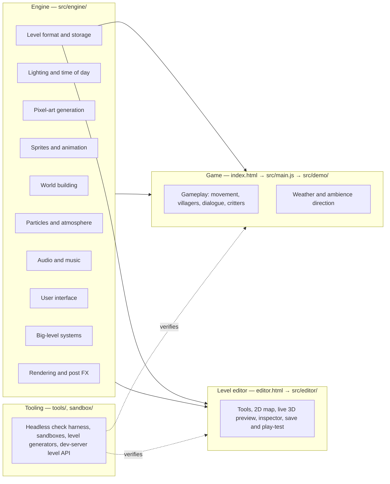
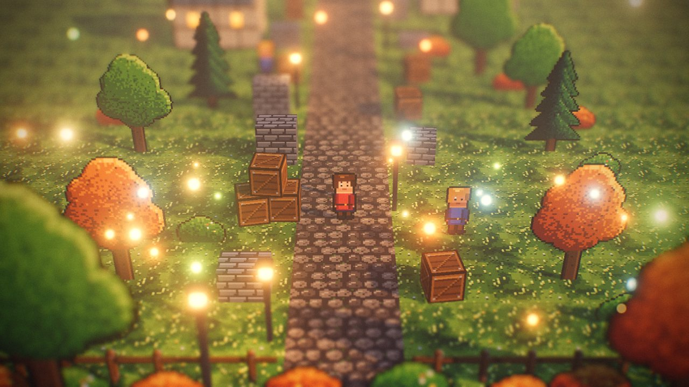
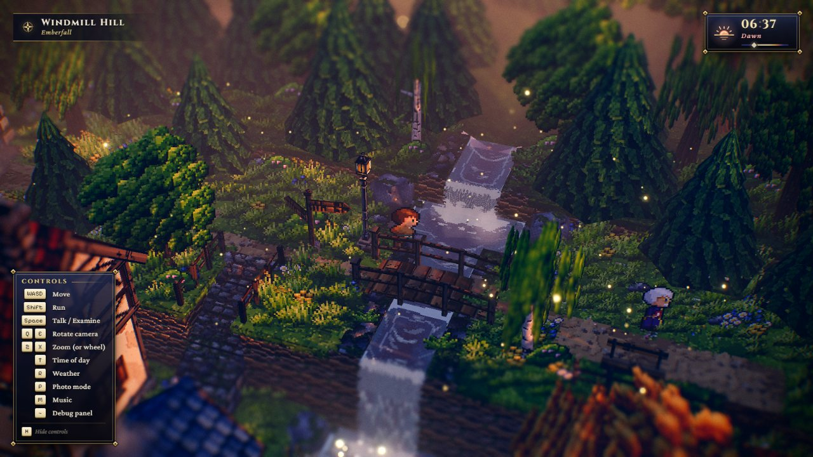
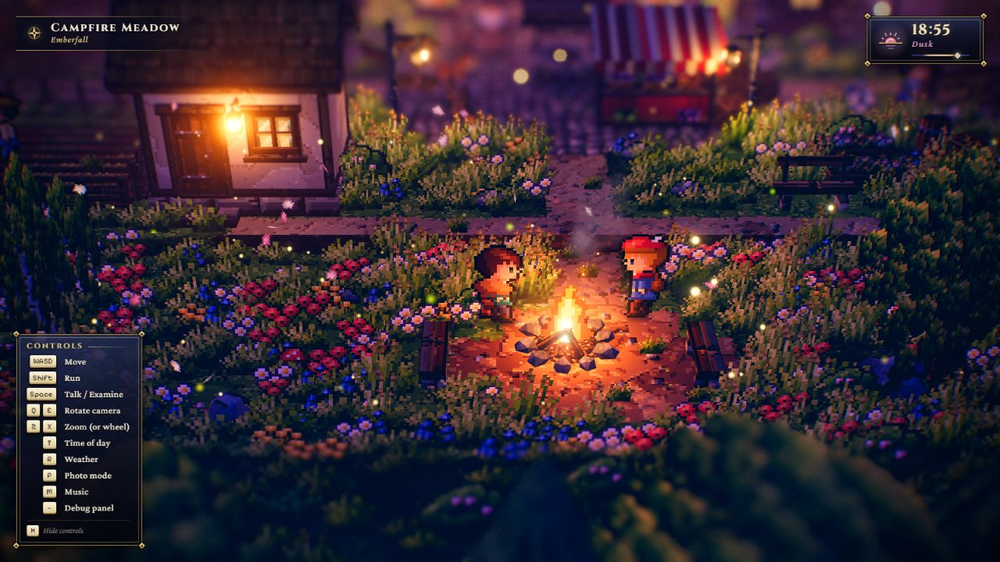
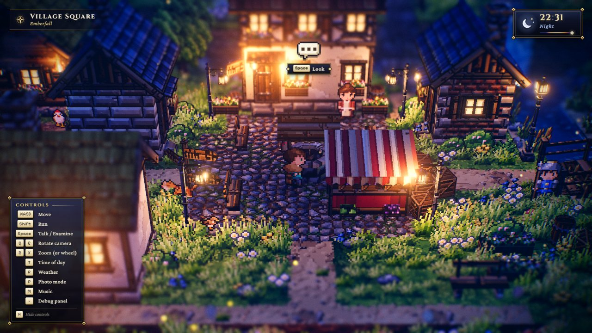
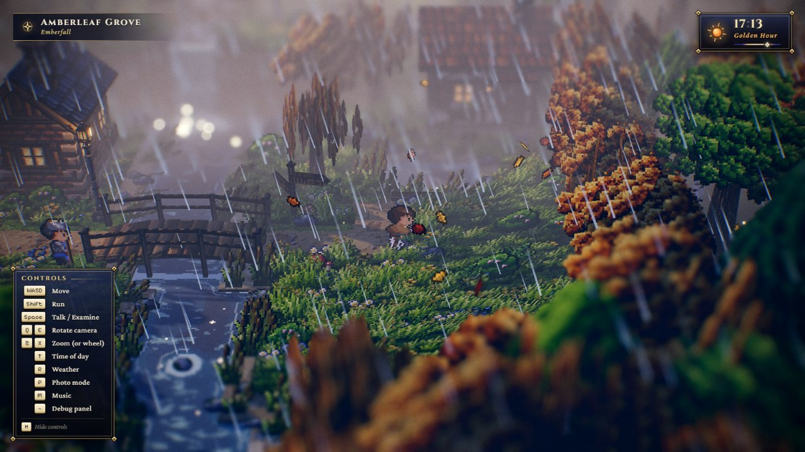
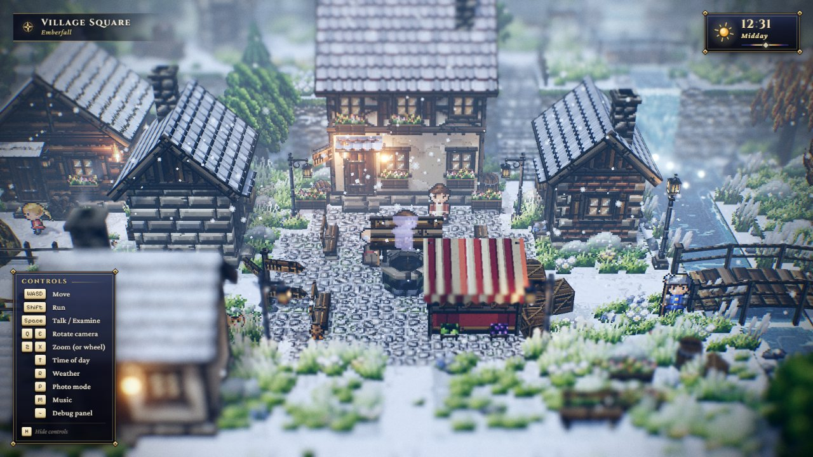
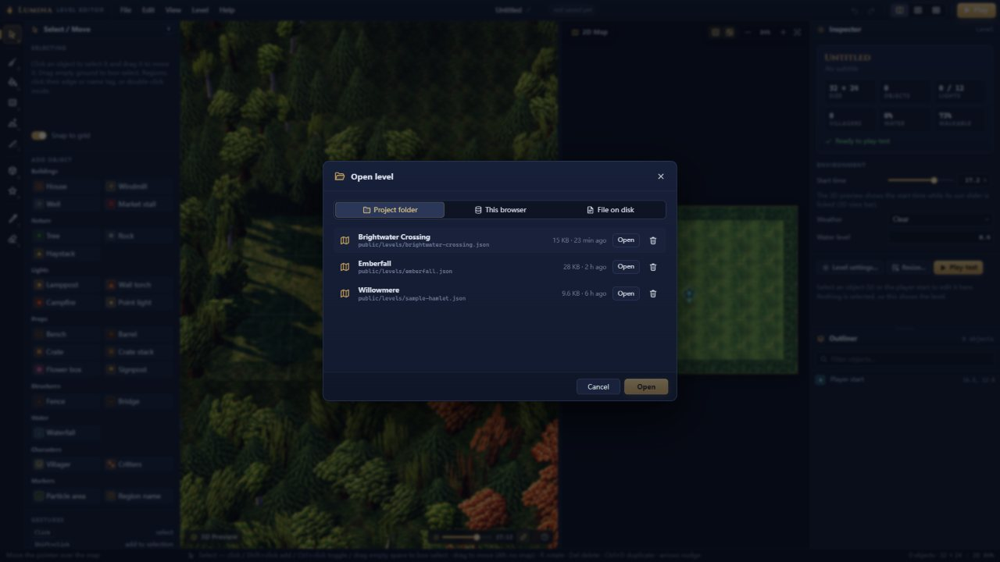
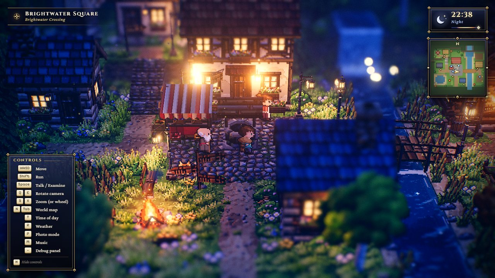

# Lumina feature catalogue

> **Purpose.** This page lists everything Lumina can do, grouped by area. Each feature gets a
> one-line description, the code that implements it, the doc that covers it in depth, and a status.
> Read it before you build something, to answer "does Lumina already do X, and where?". It points
> you to the right code and docs; it does not re-explain them.
>
> **Audience.** People who want to evaluate or extend the engine, and AI agents starting a fresh
> session. Search this page for a keyword, then follow the code path and the linked doc.
>
> **Source of truth.** The code: [`src/engine/`](../../src/engine/index.js),
> [`src/demo/`](../../src/demo/Game.js), [`src/editor/`](../../src/editor/EditorApp.js),
> [`src/main.js`](../../src/main.js), [`tools/`](../../tools/check.mjs), [`sandbox/`](../../sandbox/index.html)
> and [`public/levels/*.json`](../../public/levels/emberfall.json). Every count, default and key
> binding here was checked against the code on 2026-09-27. Where this page disagrees with the code,
> the code wins.
>
> **Related docs.** [Docs index](../README.md) · [Visual landing page](../index.html) ·
> [Architecture overview](../architecture/OVERVIEW.md) · [Known issues](../ai/KNOWN_ISSUES.md) ·
> [Level format](../specs/LEVEL_FORMAT.md) · [Playing the game](../user/PLAYING_THE_GAME.md) ·
> [Level editor guide](../user/LEVEL_EDITOR_GUIDE.md)

*Starfall Vale, Hearthwick Square at golden hour. Everything in this frame is generated at
runtime: textures, sprites, the post-processing look, the HUD and the painted minimap.*

---

## How to read this page

Each area has a table with the columns **Feature · What it does · Code · Docs · Status**. Code
links go to the file, and the symbol is named in backticks. Docs links go to the canonical doc
for that topic.

| Status | Meaning |
| --- | --- |
| **Stable** | Shipped and used by the shipped levels. Verified by the multi-agent review workflows with real input in headless Chrome, with zero page or console errors (see [PROJECT_HISTORY](../history/PROJECT_HISTORY.md)). |
| **Limits** | Works, but has a known limitation. The limitation is summarised in the row and listed in [KNOWN_ISSUES](../ai/KNOWN_ISSUES.md). |
| **Big levels** | Active only on levels wider or deeper than 64 tiles (`max(width, depth) > SMALL_LEVEL` = 64, budgets in `BIG_LEVEL_BATCHING`, both in [src/demo/World.js](../../src/demo/World.js)). Levels up to 64 × 64 build exactly as before. |
| **Dev only** | Needs the Vite dev server (`npm run dev`). The production build (`dist/`) does not include it. |
| **One-off** | A historical tool kept for reference. Not part of the normal workflow. |

## At a glance

| What | Count / value | Where it is defined |
| --- | --- | --- |
| Procedural world textures (with normal maps, emissive masks where needed) | **46** (+ 1 on demand: `crag`, Cinderwatch's ridge) | `TEXTURE_NAMES` in [Textures.js](../../src/engine/pixel/Textures.js) |
| Character presets · creature kinds | **14** · **4** (cat, dog, chicken, bird) | `CHARACTER_PRESETS`, `createCreatureSheet` in [CharacterSprites.js](../../src/engine/pixel/CharacterSprites.js) |
| Prop and particle sprite kinds | **23** | `PROP_SPRITE_KINDS` in [PropSprites.js](../../src/engine/pixel/PropSprites.js) |
| Particle presets | **21** (12 + 9 combat bursts) | `PARTICLE_PRESETS` in [Particles.js](../../src/engine/fx/Particles.js) |
| Sound effects · ambience layers · music tracks | **8** (+ **35** combat) · **5** · **3** (emberfall, battle, boss) + 2 stingers | `SFX_NAMES`, `COMBAT_SFX_NAMES`, `AMBIENCE_LAYERS`, `MUSIC_TRACKS`, `MUSIC_STINGERS` in [AudioSystem.js](../../src/engine/audio/AudioSystem.js) |
| Enemy kinds (combat levels) | **8** (slime, goblin, archer, shaman, bat, boar, dummy, the golem boss) | `ENEMY_KINDS` in [ObjectCatalog.js](../../src/engine/level/ObjectCatalog.js), `ENEMY_DEFS` in [defs.js](../../src/demo/combat/defs.js) |
| Lighting keyframes over 24 h · time presets (T key) | **13** · **5** | `DEFAULT_KEYFRAMES` in [LightingSystem.js](../../src/engine/lighting/LightingSystem.js), `TIME_PRESETS` in [Weather.js](../../src/demo/Weather.js) |
| Weathers | **3** (clear, rain, snow) | `WEATHERS` in [WeatherLook.js](../../src/demo/WeatherLook.js) (re-exported by `Weather.js`) |
| Built-in tile types · height levels | **22** · **0–35** (world y = level × 0.5) | `TILE_TYPES`, `MAX_LEVEL` in [LevelFormat.js](../../src/engine/level/LevelFormat.js) |
| Level size | **8–128** tiles per side | `MIN_SIZE`, `MAX_SIZE` in [LevelFormat.js](../../src/engine/level/LevelFormat.js) |
| Level object types (categories) | **27** (9; the Combat category holds `enemy`, `chest`, `waystone`) | `OBJECT_TYPES`, `OBJECT_CATEGORIES` in [ObjectCatalog.js](../../src/engine/level/ObjectCatalog.js) |
| NPC actions · behaviours · hand-written scripts | **4** · **4** · **11** (incl. the combat `drillmaster` and `shopkeeper`) | `NPC_ACTIONS`, `NPC_BEHAVIOURS`, `NPC_SCRIPTS` in [ObjectCatalog.js](../../src/engine/level/ObjectCatalog.js) |
| Editor tools | **10** | `TOOLS` in [tools/index.js](../../src/editor/tools/index.js) |
| Real point lights | **≤ 12**, all created at load and never added or removed (one per light descriptor up to 12; above 12 the 12 lights are shared by any number of descriptors) | `MAX_POINT_LIGHTS` in [World.js](../../src/demo/World.js), [LightPool.js](../../src/engine/lighting/LightPool.js) |
| Frame budget (GTX 1060, 1600 × 900) | 60 fps · ≤ ~300 scene draw calls (including shadows) · one 2048² sun shadow map · DOF at half resolution | [ARCHITECTURE.md §1](../../ARCHITECTURE.md), [PERFORMANCE](../architecture/PERFORMANCE.md) |
| Shipped levels | **5**: Emberfall 48 × 40 · Starfall Vale 128 × 128 · Brightwater Crossing 36 × 28 · Willowmere 28 × 22 · Cinderwatch Pass 96 × 120 (combat) | [`public/levels/`](../../public/levels/emberfall.json) |
| Image, model or audio files loaded at runtime | **0**. Fonts come from `@fontsource/*` npm packages. The JPEGs in `docs/assets/screenshots/` are documentation only. | [package.json](../../package.json) |

## Feature map

---

## Rendering and post-processing

 

*Left: the PostFX sandbox (`sandbox/postfx.html`), showing the tilt-shift band, bokeh discs and
bloom. Right: Emberfall on arrival. This capture predates the HUD minimap; current builds also
show it.*

| Feature | What it does | Code | Docs | Status |
| --- | --- | --- | --- | --- |
| Engine loop | Ordered systems (`addSystem(system, order)`) with `update` / `lateUpdate` phases, events (`resize`, `update`, `lateUpdate`, `beforeRender`, `afterRender`, plus `start`, `stop`, `error`, `contextlost`, `contextrestored`, `dispose`), delta clamped to ≤ 1/20 s and multiplied by `time.timeScale`, a swappable render function (`setRenderFn`), and resize handling (a window `resize` listener always, plus a ResizeObserver on the container unless the canvas fills the window). A throwing system is reported, not fatal. Exposes `window.__engine` with `?debug` or `?autostart`. | [core/Engine.js](../../src/engine/core/Engine.js) `Engine` | [core](../architecture/modules/core.md) | Stable |
| Diorama camera | Narrow 28° FOV looking down at 32°. Smooth follow with look-ahead, Q/E orbit (70°/s, yaw clamped to ±60° unless `freeYaw`), zoom (Z / X, = / −, wheel), focus bounds, screen shake, `snap()`. The engine defaults to distance 24 (range 14–36); the game uses 30 (range 18–42), and a level can override distance and pitch with `environment.camera`. | [core/CameraRig.js](../../src/engine/core/CameraRig.js) `CameraRig`; [demo/config.js](../../src/demo/config.js) `CAMERA` | [core](../architecture/modules/core.md), [GAME](../architecture/GAME.md) | Stable |
| HDR scene target with MSAA | The scene renders into a HalfFloat multisampled target with a depth texture. The game uses 4× MSAA, or 2× when the drawing buffer exceeds 1.8 MP. | [render/PostFX.js](../../src/engine/render/PostFX.js) `PostFX` | [RENDER_PIPELINE](../architecture/RENDER_PIPELINE.md) | Stable |
| Tilt-shift depth of field | Circle of confusion from depth plus a screen-space tilt-shift term, then a half-resolution golden-angle bokeh gather (48/64/96-tap variants picked by the blur radius; the game caps it at 64 with `maxTaps: 64`). A CoC-aware tent filter and a full-resolution composite follow, so the in-focus band stays pixel-exact. In the game, autofocus follows the player's chest. | [render/shaders/DofShaders.js](../../src/engine/render/shaders/DofShaders.js); `PostFX.setFocus` | [RENDER_PIPELINE](../architecture/RENDER_PIPELINE.md) | Limits: near bokeh discs are not occluded by other near geometry |
| Bokeh highlight scatter | Bright HDR specks above `dof.bokehThreshold` are re-drawn as crisp bokeh disc sprites. This produces the signature "lantern bokeh". | `DofBokehSpriteShader` in [DofShaders.js](../../src/engine/render/shaders/DofShaders.js) | [RENDER_PIPELINE](../architecture/RENDER_PIPELINE.md) | Stable |
| Bloom | `UnrealBloomPass` fed by a half-resolution soft-knee bright pass with a warm tint on the wide mips. The game sets `threshold` to 1.05, so only emissive light blooms. | [BloomShaders.js](../../src/engine/render/shaders/BloomShaders.js), `PostFX` | [RENDER_PIPELINE](../architecture/RENDER_PIPELINE.md) | Stable |
| Tone mapping | ACES filmic plus sRGB output, applied exactly once in `OutputPass`. `LightingSystem` owns `renderer.toneMappingExposure`. | `PostFX` | [RENDER_PIPELINE](../architecture/RENDER_PIPELINE.md), [CONVENTIONS](../development/CONVENTIONS.md) | Stable |
| Display grade | Exposure, white balance (temperature / tint), contrast, saturation, split toning (lifted teal shadows), vignette, chromatic aberration, film grain, sharpen and dither. Every toggle is live. | [GradeShader.js](../../src/engine/render/shaders/GradeShader.js); game tuning in `Game._tunePost` ([Game.js](../../src/demo/Game.js)) | [RENDER_PIPELINE](../architecture/RENDER_PIPELINE.md), [VISUAL_DESIGN](../design/VISUAL_DESIGN.md) | Stable |
| GPU stage timings | `postfx.enableTimings(true)` measures the `scene`, `dof`, `bloom` and `output` stages with `EXT_disjoint_timer_query_webgl2` (returns `false` when the extension is missing). The summed time feeds the resolution governor and `__game.state().gpuMs`. | `PostFX.enableTimings`, `timings`, `timingsMin` | [PERFORMANCE](../architecture/PERFORMANCE.md) | Stable |
| Shader warm-up | Every program is compiled against the HDR scene target at load (`renderer.compileAsync`), then 5 real frames are drawn behind the loader with rain and snow on. As a result nothing compiles during play (the review runs counted 57–59 programs after load). | `Game.init`, `Game._compileScene`, `Game.start`; `PostFX.warmup` | [RENDER_PIPELINE](../architecture/RENDER_PIPELINE.md), [DECISIONS](../history/DECISIONS.md) | Stable |
| Pixel budget and dynamic resolution | Caps the drawing buffer at about 2.1 MP (`pixelBudget`) by lowering `engine.maxPixelRatio`. When GPU timings are available it samples them twice a second and, on the median of the last 5 samples, lowers `engine.renderScale` by 0.1 (not below `minScale` 0.7) after 2 s above 13.5 ms, and raises it after 10 s below 8.5 ms, never twice within 3 s. The debug panel's Render › render scale slider takes manual control (`manual = true`). | [demo/ResolutionGovernor.js](../../src/demo/ResolutionGovernor.js) `ResolutionGovernor` | [PERFORMANCE](../architecture/PERFORMANCE.md) | Limits: each step reallocates the render targets (a hitch of a few ms, up to about 0.2 s) |
| Shared global uniforms | `uTime`, `uNight`, `uWind`, `uWindStrength`, camera yaw and position, sun direction and colour, fog colour. Billboards, foliage, water, particles and flames stay in sync without calling each other. | [render/GlobalUniforms.js](../../src/engine/render/GlobalUniforms.js) `globalUniforms` | [OVERVIEW](../architecture/OVERVIEW.md), [CONVENTIONS](../development/CONVENTIONS.md) | Stable |
| Fog start offset | Patches three's `fog_vertex` chunk so fog starts at a distance from the camera instead of at the camera. The start is the level's camera distance − 7 (about 7 units short of the focus point), so the diorama centre stays crisp while distant layers fade. Fog density also scales with zoom (`Weather.zoomFog`). | [demo/AtmosphereFog.js](../../src/demo/AtmosphereFog.js) `installFogStart` | [GAME](../architecture/GAME.md) | Stable |

## Lighting and time of day

  

*Dawn on Windmill Hill, dusk at the campfire, and night in the square (Emberfall; these captures
predate the minimap).*

| Feature | What it does | Code | Docs | Status |
| --- | --- | --- | --- | --- |
| 24-hour keyframed palette | 13 keyframes run from night through pre-dawn, pink dawn, sunrise, morning, noon, afternoon, **golden hour (17.2 h)**, sunset, purple dusk and blue hour back to night. They drive the sun and moon, hemisphere fill, `FogExp2`, exposure and the sky. The game overrides a few keyframes with `KEYFRAME_OVERRIDES`. | [lighting/LightingSystem.js](../../src/engine/lighting/LightingSystem.js) `LightingSystem`, `DEFAULT_KEYFRAMES`; [demo/config.js](../../src/demo/config.js) | [lighting](../architecture/modules/lighting.md), [VISUAL_DESIGN](../design/VISUAL_DESIGN.md) | Stable |
| Sun and moon shadows | One 2048² directional shadow map whose frustum follows the player and is texel-snapped. The sun arc (`SUN_PATH`) puts it about 25° up, behind-left, at golden hour. The moon keys the night from the front-right (`MOON_PATH`). | `LightingSystem`, `SUN_PATH` / `MOON_PATH` in [config.js](../../src/demo/config.js) | [lighting](../architecture/modules/lighting.md) | Limits: slight shadow crawl while the clock runs |
| Running clock | While playing, 1 game hour takes about 90 s (`TIME_SPEED` = 1/90). The clock pauses on the loading and title screens. A level sets its start time (`environment.timeOfDay`), and `environment.clock: false` stops the clock. | `TIME_SPEED` in [config.js](../../src/demo/config.js); `Game.init` | [PLAYING_THE_GAME](../user/PLAYING_THE_GAME.md), [LEVEL_FORMAT](../specs/LEVEL_FORMAT.md) | Stable |
| Time presets (T) | Cycles Dawn 6.5 → Midday 12.5 → Golden Hour 17.2 → Dusk 18.9 → Night 22.5 with a 2-second glide, always forward in time. | `TIME_PRESETS`, `Weather.cycleTime` in [Weather.js](../../src/demo/Weather.js) | [PLAYING_THE_GAME](../user/PLAYING_THE_GAME.md) | Stable |
| Flickering point lights | Warm lanterns, torches and campfires use physically based point lights (decay 2). The flicker is smooth noise, not random jitter. Lights can be night-only with a small day level. Point lights never cast shadows. | `LightingSystem.addPointLight`, `flickerAt` | [lighting](../architecture/modules/lighting.md) | Stable |
| Emissive windows and glass | `registerEmissive(material, { day, night })` drives glow by night factor, so windows and lantern glass light up at dusk and on grey days. | `LightingSystem.registerEmissive` | [lighting](../architecture/modules/lighting.md) | Stable |
| Sky dome | Gradient dome with sun and moon glow, stars at night, soft pixel clouds and a lower "sea of clouds" band (the game sets `lowerClouds` 0.25). | [lighting/Sky.js](../../src/engine/lighting/Sky.js) `Sky` | [lighting](../architecture/modules/lighting.md) | Limits: at the gameplay pitch you mostly see only the horizon band |
| God rays | Additive, animated light shafts along the live sun direction. They fade at night and when the sun is high, and are culled by a sphere round their base. Placement comes from `environment.godRayAreas` (`count` 3 per area by default, at most 12), or one automatic area over the walkable ground; `environment.godRays: false` turns them off. | [fx/GodRays.js](../../src/engine/fx/GodRays.js) `GodRays` | [fx](../architecture/modules/fx.md), [LEVEL_FORMAT](../specs/LEVEL_FORMAT.md) | Stable |
| Light pool | At most 12 point lights, created once at load, shared by any number of light descriptors. See [Big-level systems](#big-level-systems). | [lighting/LightPool.js](../../src/engine/lighting/LightPool.js) `LightPool` | [lighting](../architecture/modules/lighting.md) | Stable |

## Weather

 

| Feature | What it does | Code | Docs | Status |
| --- | --- | --- | --- | --- |
| Weather cycling (R) | Cycles clear → rain → snow → clear. The change blends over a few seconds: sun, ambient, fog, exposure, wind, grade temperature and saturation, god rays, dust, fireflies, leaves and precipitation. | [demo/Weather.js](../../src/demo/Weather.js) `Weather`; `WEATHER_PARAMS` in [demo/WeatherLook.js](../../src/demo/WeatherLook.js) (the weather look, shared with the editor preview) | [PLAYING_THE_GAME](../user/PLAYING_THE_GAME.md), [GAME](../architecture/GAME.md) | Stable |
| Overcast light | Rain and snow grey the sun, hemisphere and fog colours toward a cool overcast (`overcastColor` / `applyOvercast`, driven by `WEATHER_PARAMS[*].overcast`). On grey days lanterns and windows glow a little by day too (`applyLampDayGlow`, `applyEmissiveDay`). | `Weather.update`; [demo/WeatherLook.js](../../src/demo/WeatherLook.js) | [GAME](../architecture/GAME.md) | Stable |
| Rain and snow particles | Camera-following emitters (2600 rain streaks, 2400 flakes) exist from load, faded by intensity, so the first rain never compiles a shader. | `Weather` constructor, `precipitationEmitter` in [WeatherLook.js](../../src/demo/WeatherLook.js); `rain` / `snow` presets in [Particles.js](../../src/engine/fx/Particles.js) | [fx](../architecture/modules/fx.md) | Limits: precipitation does not collide with terrain |
| Snow cover | Snow settles over about 15 s on terrain tops, grass tips, flowers and roofs, and melts when the snow stops. It is a shared uniform patched into materials at load, so toggling it never compiles. | [demo/SnowCover.js](../../src/demo/SnowCover.js) `snowCover`, `addSnowCover` | [GAME](../architecture/GAME.md) | Stable |
| Level start weather | `environment.weather` (`clear` / `rain` / `snow`) is applied instantly after the warm-up. | `Game.init`, `Weather.setWeather(name, { instant })` | [LEVEL_FORMAT](../specs/LEVEL_FORMAT.md) | Stable |
| Fog scale per level | `environment.fogScale` multiplies the fog density, so big levels keep their far layers at dawn and dusk (Starfall Vale uses 0.65). | `Weather.levelFog` | [LEVEL_FORMAT](../specs/LEVEL_FORMAT.md) | Stable |

## Pixel-art generation

 

*Left: `sandbox/sprite_art.html` character sheets. Right: the `sandbox/props.html` gallery lot.*

| Feature | What it does | Code | Docs | Status |
| --- | --- | --- | --- | --- |
| Pixel canvas | Drawing primitives (pixels, rects, lines, circles, ellipses, polygons), dithered noise fills, speckles, outlines and blits, plus colour helpers, `makePixelTexture` (NEAREST magnification) and `normalMapFromHeight`. | [pixel/PixelCanvas.js](../../src/engine/pixel/PixelCanvas.js) `PixelCanvas` | [pixel](../architecture/modules/pixel.md) | Stable |
| Palette | Hue-shifted colour ramps (`PALETTE`, `rampAt`) shared by all generators. | [pixel/Palette.js](../../src/engine/pixel/Palette.js) | [pixel](../architecture/modules/pixel.md), [VISUAL_DESIGN](../design/VISUAL_DESIGN.md) | Stable |
| World texture library | 46 seamless textures at 16 px per world unit: terrain tops, cliff and side faces, walls, roofs, doors, windows with emissive glass, bark, leaf clumps, cloth, barrels, crates, fences and more. Normal maps are generated for relief, and the library supplies cached `MeshLambertMaterial`s. Seeded (`seed` 1337 in the game), deterministic, and painted on first use in about 150–190 ms for all. | [pixel/Textures.js](../../src/engine/pixel/Textures.js) `TextureLibrary`, `TEXTURE_NAMES` | [pixel](../architecture/modules/pixel.md) | Limits: 1 × 1 cliff and side textures repeat visibly on long faces; sign lettering is pseudo-text |
| Character sprite sheets | 32 × 32 frames with 4 direction rows × 6 columns (2 idle + 4 walk), and animations `idle_*`, `walk_*`, `run_*`. 14 presets: traveler, swordsman, merchant, cleric, scholar, dancer, hunter, villager, farmer, elder, child, guard, innkeeper, bard. Spec fields cover skin, hair, hair style, outfit, cape, hat, weapon and beard. | [pixel/CharacterSprites.js](../../src/engine/pixel/CharacterSprites.js) `createCharacterSheet`, `CHARACTER_PRESETS` | [pixel](../architecture/modules/pixel.md), [OBJECT_CATALOG](../specs/OBJECT_CATALOG.md) | Limits: sheets have exactly 6 columns (no talk / wave frames) |
| Creature sheets | Cat, dog, chicken and bird, with the same animation naming as characters. | `createCreatureSheet` | [pixel](../architecture/modules/pixel.md) | Limits: creature art is simpler than the characters |
| Prop and FX sprites | 23 kinds: grass tufts, flowers in four colours, bush, fern, reeds, mushroom, small rock, animated campfire / torch / candle flames, speech bubble, exclamation, sparkle, and the leaf, petal, ember, smoke, dust and soft-bokeh particle textures. | [pixel/PropSprites.js](../../src/engine/pixel/PropSprites.js) `createPropSprite`, `PROP_SPRITE_KINDS` | [pixel](../architecture/modules/pixel.md) | Stable |
| Prop-only textures | Extra lazily painted textures outside the library (`birch`, `produce`, `sail`, `leaf_litter`, `ash`, `boulder`, `boulder_moss`) for the prop builders. | [world/props/PropTextures.js](../../src/engine/world/props/PropTextures.js) `PropTextureSet` | [world](../architecture/modules/world.md) | Stable |
| Determinism | All procedural content uses the seeded `RNG` / `hash2` / `fbm2`, never `Math.random()`, so every load looks identical. | [utils/math.js](../../src/engine/utils/math.js) | [CONVENTIONS](../development/CONVENTIONS.md) | Stable |

## Sprites and animation

| Feature | What it does | Code | Docs | Status |
| --- | --- | --- | --- | --- |
| Lit billboard sprite | `Sprite3D` is an animated quad whose origin is at the feet. Billboard modes: cylindrical, spherical or none. Lighting uses bent normals and wrap diffuse, so a character with the sun behind it never goes black, and opacity fades with ordered dithering. | [sprite/Sprite3D.js](../../src/engine/sprite/Sprite3D.js) `Sprite3D` | [sprite](../architecture/modules/sprite.md) | Stable |
| Silhouette shadows | A shadow-only proxy quad turns to face the sun (`shadowMode: 'sunFacing'`), so the cast shadow is always a full silhouette. | `Sprite3D` (`shadowProxy`) | [sprite](../architecture/modules/sprite.md) | Limits: a wall right next to a sprite on the sun side may not shadow it (self-skip) |
| Blob contact shadows | A soft ellipse under the feet, with no z-fighting. On big levels all blobs draw in **one instanced call**. | `Sprite3D`; [sprite/BlobBatch.js](../../src/engine/sprite/BlobBatch.js) `BlobBatch` | [sprite](../architecture/modules/sprite.md) | Stable (the batch is Big levels only) |
| Sprite manager | Updates every registered sprite each frame (animation, billboard orientation, shadow proxy). | [sprite/SpriteManager.js](../../src/engine/sprite/SpriteManager.js) `SpriteManager` | [sprite](../architecture/modules/sprite.md) | Stable |
| Character look | Shared sprite options for every character and critter: an upward-leaning normal, wrap lighting and a small warm emissive fill that fades at night. Characters read clearly at every hour. | `CHARACTER_SPRITE_OPTS`, `SPRITE_FILL` in [config.js](../../src/demo/config.js) | [VISUAL_DESIGN](../design/VISUAL_DESIGN.md) | Stable |
| Player x-ray silhouette | When a roof or tree canopy hides the player, a pale silhouette shows through. It writes its own depth, so the depth of field keeps it sharp. It is disabled on the title screen. | `Player` in [demo/Player.js](../../src/demo/Player.js) | [GAME](../architecture/GAME.md) | Stable |
| Idle breathing variety | Villagers play the idle cycle at slightly different speeds (`IDLE_SPEED` 0.5–0.62), so the village does not breathe in lockstep. | [config.js](../../src/demo/config.js), [Npc.js](../../src/demo/Npc.js) | [GAME](../architecture/GAME.md) | Stable |

## World building

 

### Terrain

| Feature | What it does | Code | Docs | Status |
| --- | --- | --- | --- | --- |
| Tile map from an ASCII legend | One character per tile in `tiles`, one height character per tile in `heights` ('0'–'9', 'a'–'z' = level 0–35, world y = level × 0.5). Blocky multi-level terrain with world-space UVs, built in chunks. | [world/TileMap.js](../../src/engine/world/TileMap.js) `TileMap` | [world](../architecture/modules/world.md), [LEVEL_FORMAT](../specs/LEVEL_FORMAT.md) | Stable |
| Cliffs with grass lips | Vertical faces wherever a neighbour is lower. The top unit uses the `lip` texture (grass hanging over the edge) and the rest uses `side`. Brims, skirts and baked ambient occlusion. | `TileMap` | [world](../architecture/modules/world.md) | Limits: long cliff faces show texture repetition |
| Stairs | `stairs: 'N' / 'S' / 'E' / 'W'` tiles rise one level with 4 real steps, and the walk height interpolates smoothly. | `TileMap` | [world](../architecture/modules/world.md) | Limits: 2 px risers read thin from far away |
| Organic grass fringes | Grass tiles spill tufts over neighbouring path, cobble, sand, farmland and moss tiles at the same height (`FRINGE_RECEIVERS`, `FRINGE_PRIORITY`). Organic tops (`ORGANIC_TOPS`: grass, dirt, sand, riverbed, moss) also get per-cell random rotations to hide texture repetition. | `TileMap`, `paintDecalMask` | [world](../architecture/modules/world.md) | Limits: only grass tiles at the same height have fringes |
| Movement and collision | Circle-vs-grid movement with sliding, a maximum step height of 0.55, circle and box colliders on a 2-unit spatial hash (`dynamic` colliders are tested on every query), and walk surfaces for bridge decks. | `TileMap.move`, `addCollider`, `addWalkSurface`, `queryColliders` | [world](../architecture/modules/world.md) | Limits: `move()` samples the centre plus 8 perimeter points (a corner can intrude about 2 % of the radius) |
| Incremental rebuilds | `updateTiles` (data only), `rebuildRect`, `rebuildChunks` and the time-sliced `rebuildChunkSteps`. Used by the editor; the game builds once. | `TileMap` | [EDITOR](../architecture/EDITOR.md), [world](../architecture/modules/world.md) | Stable |

### Water

| Feature | What it does | Code | Docs | Status |
| --- | --- | --- | --- | --- |
| Pixel water surface | One mesh over all water tiles. Depth-tinted bands with dithered edges, pixel-quantised ripples advected by a two-phase flow map, crest highlights, a sky and fog fresnel, lighting from the scene lights, and cross-section faces at drops. | [world/Water.js](../../src/engine/world/Water.js) `Water` | [world](../architecture/modules/world.md) | Limits: no geometry reflections |
| Shore bake | A texture with 8 texels per tile: distance to the shore and obstacles, depth, and flow. It drives foam rims and foam lines. The bake is a pure function and runs in a worker on big levels and in the editor. | [world/WaterShore.js](../../src/engine/world/WaterShore.js) `bakeShore`; [world/shoreWorker.js](../../src/engine/world/shoreWorker.js); `Water.refreshAsync` | [world](../architecture/modules/world.md) | Stable |
| Glints | 4-point HDR sun glints that bloom, masked by shadows, and cool moon glints at night. Density is set with `water.glint` (Starfall's lake uses 0.45). | `Water`; `waterGlint` in [ObjectBuilder.js](../../src/engine/level/ObjectBuilder.js) | [LEVEL_FORMAT](../specs/LEVEL_FORMAT.md) | Stable |
| Flow per tile type | River, plunge pool (flow 0.45), fast stream (2.2) and still pond (0). Levels can define custom flow chars; Starfall's `e` river flows east. | `TILE_TYPES` in [LevelFormat.js](../../src/engine/level/LevelFormat.js) | [LEVEL_FORMAT](../specs/LEVEL_FORMAT.md) | Stable |
| Waterfalls | An animated falling sheet with a curved lip, accelerating streaks, foam, droplets and a churning pool. The game adds spray and glint bursts, a mist emitter and a splash ambience anchor. | `createWaterfall` in [Water.js](../../src/engine/world/Water.js); `buildWaterfall` in [ObjectBuilder.js](../../src/engine/level/ObjectBuilder.js); `Game._waterfallFx` | [world](../architecture/modules/world.md), [OBJECT_CATALOG](../specs/OBJECT_CATALOG.md) | Limits: axis-aligned facings only (N / S / E / W) |

### Props

| Feature | What it does | Code | Docs | Status |
| --- | --- | --- | --- | --- |
| Houses | Timber-frame, plaster, brick, stone brick, log or plank walls (`WALL_TEXTURES`, optional different `upperWall`) with red, blue, thatch or slate roofs, one or two storeys. Options include a jettied upper floor, hanging sign, flower boxes, shutters, door hood, woodpile, gable front and door lantern (a real light when the object's `light` is on). Windows glow at night and the chimney smokes. | [world/props/House.js](../../src/engine/world/props/House.js) `buildHouse`; `PropFactory.house` | [world](../architecture/modules/world.md), [OBJECT_CATALOG](../specs/OBJECT_CATALOG.md) | Limits: 10–13 draw calls per house until merged |
| Trees | Oak, autumn, birch and pine. Camera-facing leaf-clump canopies sway with the wind and cast dappled, swaying shadows. | [world/props/Trees.js](../../src/engine/world/props/Trees.js), [world/props/Wind.js](../../src/engine/world/props/Wind.js) | [world](../architecture/modules/world.md) | Stable |
| Light props | Lamppost, wall torch and campfire (logs, animated shader flame, embers, smoke, light), plus a bare point light object. | [world/props/LightProps.js](../../src/engine/world/props/LightProps.js), [world/props/Flame.js](../../src/engine/world/props/Flame.js) | [world](../architecture/modules/world.md) | Stable |
| Structures | Well, market stall, windmill with turning sails, and bridge (wooden plank deck with rails and an automatic gentle arch of at most 0.4 units; the walkable deck comes back as stepped `walkRects`). | [world/props/Structures.js](../../src/engine/world/props/Structures.js) | [world](../architecture/modules/world.md) | Limits: diagonal bridges' walk rects slightly over-cover the water |
| Small props | Fences (runs between two points), benches, barrels, crates, crate stacks, haystacks, rocks, signposts and flower boxes. | [world/props/SmallProps.js](../../src/engine/world/props/SmallProps.js) | [world](../architecture/modules/world.md) | Stable |
| `PropResult` wiring | Every prop returns its object, colliders, light descriptors, emissives, emitters, an optional per-frame update and an interaction point. Integrators wire these into lighting, particles and the tile map. | [world/Props.js](../../src/engine/world/Props.js) `PropFactory` | [world](../architecture/modules/world.md), [ARCHITECTURE §4.7](../../ARCHITECTURE.md) | Stable |
| Static batching | `mergeStatic()` merges the static meshes of a whole village into a few dozen draw calls per material. On big levels, batches are cut into spatial pieces. | `PropFactory.mergeStatic` | [PERFORMANCE](../architecture/PERFORMANCE.md) | Stable |
| Custom-prop building blocks | The barrel exports `MeshBuilder`, `trs`, `applyWind`, `createWindDepthMaterial`, `createFlame`, `createFlameMaterial`, `createGlowMaterial` and `PropTextureSet`. | [engine/index.js](../../src/engine/index.js) | [world](../architecture/modules/world.md) | Stable |

### Foliage and scenery

| Feature | What it does | Code | Docs | Status |
| --- | --- | --- | --- | --- |
| Instanced foliage | Thousands of camera-facing sprites in one `InstancedMesh` per field. Tips sway with `uTime` / `uWind` while roots stay fixed. | [sprite/Foliage.js](../../src/engine/sprite/Foliage.js) `Foliage` | [sprite](../architecture/modules/sprite.md) | Stable |
| Ground detail | Grass, tall grass, flowers, reeds, bushes, ferns, mushrooms and pebbles, scattered by tile and by zone (`environment.foliage` flower and shrub areas, seed 2024 by default). | [demo/GroundDetail.js](../../src/demo/GroundDetail.js) `buildGroundDetail` | [GAME](../architecture/GAME.md), [LEVEL_FORMAT](../specs/LEVEL_FORMAT.md) | Stable |
| Forest border and outer world | Trees on blocked `T` tiles, and a fogged outer heightfield with deterministic forest scatter, so no view looks like a floating island. Kinds per area come from `environment.forest`, and `scenery.southGap` sets the open ground south of the map. | [demo/Scenery.js](../../src/demo/Scenery.js) `scatterForest`, `buildOuterGround`, `mergeTrees`, `forestKindAreas` | [GAME](../architecture/GAME.md), [LEVEL_FORMAT](../specs/LEVEL_FORMAT.md) | Stable |

## Particles and atmosphere

 

| Feature | What it does | Code | Docs | Status |
| --- | --- | --- | --- | --- |
| GPU particle emitters | Stateless vertex-shader animation, one draw call per emitter, fogged. Additive glows write no depth. Emitters have `enabled` and `intensity` controls. | [fx/Particles.js](../../src/engine/fx/Particles.js) `Particles`, `Emitter` | [fx](../architecture/modules/fx.md) | Limits: particles do not collide with terrain; normal-blended particles in one emitter are not depth-sorted |
| 12 presets | `dust`, `fireflies` (visible only at night), `embers`, `smoke`, `leaves`, `petals`, `rain`, `snow`, `mist`, `footstep`, `splash`, `sparkle`. Presets can be overridden per emitter. | `PARTICLE_PRESETS` | [fx](../architecture/modules/fx.md) | Stable |
| Bursts | One-shot bursts (`burst(preset, position, count)`) write a few spawn records into a small ring buffer per material variant, and the GPU animates them: footstep dust while running, waterfall splash and sparkle. The game primes these pools at load so the first burst never compiles a shader. | `Particles.burst`; `Game.init` | [fx](../architecture/modules/fx.md) | Stable |
| Particle areas in levels | `emitter` objects: a box of a preset (10 are offered in the editor), with `count`, `dy` and extra `params`. | `EMITTER_PRESETS` in [ObjectCatalog.js](../../src/engine/level/ObjectCatalog.js); [World.js](../../src/demo/World.js) | [OBJECT_CATALOG](../specs/OBJECT_CATALOG.md) | Stable |
| Camera dust | Glinting motes that follow the camera focus (`environment.dust`). | [World.js](../../src/demo/World.js), `Game.update` | [GAME](../architecture/GAME.md) | Stable |
| Chimney and campfire smoke | Softer, greyer smoke than the preset (`SMOKE`), with embers from fires. | [World.js](../../src/demo/World.js) | [GAME](../architecture/GAME.md) | Stable |

## Audio and music

| Feature | What it does | Code | Docs | Status |
| --- | --- | --- | --- | --- |
| Procedural sound effects | `step`, `blip`, `confirm`, `cancel`, `open`, `close`, `chime`, `splash`, synthesised with WebAudio. There is a minimum re-trigger spacing per effect. | [audio/AudioSystem.js](../../src/engine/audio/AudioSystem.js) `AudioSystem.playSfx` | [audio](../architecture/modules/audio.md) | Limits: never judged by ear (headless checks are silent) |
| Ambience layers | Wind, birds, crickets, fire and water, with smooth crossfades (`setAmbience`). | `AudioSystem.setAmbience` | [audio](../architecture/modules/audio.md) | Stable |
| Music | "Emberfall Evening": a 72 bpm folk loop with Karplus-Strong harp arpeggios, a string pad and a flute melody (D dorian / D mixolydian), plus generated-IR reverb. M toggles it. | `AudioSystem.startMusic` / `stopMusic` | [audio](../architecture/modules/audio.md), [PLAYING_THE_GAME](../user/PLAYING_THE_GAME.md) | Stable |
| Audio unlock | Nothing touches WebAudio before a user gesture: dismissing the title screen, or the first key press or pointer press with `?autostart` (the level's music then starts unless `environment.music` is `false`). | `AudioSystem.unlock`; `Game._armAudioUnlock` | [audio](../architecture/modules/audio.md) | Stable |
| Ambience direction | Birds by day, crickets at night, fire louder near campfires, water louder near rivers and falls, and weather-aware wind. | [demo/AudioDirector.js](../../src/demo/AudioDirector.js) `AudioDirector` | [GAME](../architecture/GAME.md) | Stable |
| Dialogue blips | A soft blip on every other typed character, with slight pitch variation. | `ui.dialog.onChar` in `Game.init` | [GAME](../architecture/GAME.md) | Stable |

## User interface

  

| Feature | What it does | Code | Docs | Status |
| --- | --- | --- | --- | --- |
| Dialog box | Octopath-style panel: dark translucent navy, gold double border with diamond corners, speaker plate, typewriter text with punctuation pauses, `{word}` gold highlights, a bobbing ▼ indicator, a choice list with a gold cursor, and mouse support. | [ui/DialogBox.js](../../src/engine/ui/DialogBox.js) `DialogBox` | [ui](../architecture/modules/ui.md), [VISUAL_DESIGN](../design/VISUAL_DESIGN.md) | Stable |
| Title screen | Elegant title over the live scene with a drifting camera (`environment.title`, `titleCamera`). Dismissed by any key, a click or tap, or any gamepad button. Skipped with `?autostart`. | [ui/TitleScreen.js](../../src/engine/ui/TitleScreen.js); `Game.showTitle` | [ui](../architecture/modules/ui.md) | Stable |
| Area banners | Ornamental area-title banner shown on arrival in the level, and the first time the player enters a region that has a `banner` (once per play session). | [ui/Banner.js](../../src/engine/ui/Banner.js); `Game._updateRegion` | [ui](../architecture/modules/ui.md) | Stable |
| HUD | Clock with a sun or moon icon and the phase name, a location plate (region name and subtitle), a controls legend (toggled with H) and toasts. | [ui/HUD.js](../../src/engine/ui/HUD.js) `HUD`, `TIME_PHASES`, `createKeycaps` | [ui](../architecture/modules/ui.md) | Stable |
| Interaction prompt | A floating "…" bubble with a key hint and a label (Talk, Knock, Read, Look) above the nearest interactable in front of the player. | [ui/InteractPrompt.js](../../src/engine/ui/InteractPrompt.js); `Game._findInteractable` | [ui](../architecture/modules/ui.md) | Stable |
| Fades | Full-screen fade out and in (used by resting at the inn). | [ui/Fader.js](../../src/engine/ui/Fader.js) | [ui](../architecture/modules/ui.md) | Stable |
| Minimap and world map | A gold-framed HUD minimap under the clock and a full-screen world map (N / Tab), both drawn from a painted level map. See [Big-level systems](#big-level-systems). | [ui/Minimap.js](../../src/engine/ui/Minimap.js) `Minimap`, `WorldMap` | [ui](../architecture/modules/ui.md) | Stable |
| Debug panel and stats | A themed lil-gui panel (` or F1) with the folders Time & Weather, Post FX (Depth of field, Bloom, Grade), Lighting, Camera, Atmosphere and Render. A stats overlay shows fps, frame ms, draw calls, triangles, geometries, textures and programs, with a pixel-art fps graph. | [ui/DebugPanel.js](../../src/engine/ui/DebugPanel.js) `DebugPanel`, `DebugStats`; [demo/DebugControls.js](../../src/demo/DebugControls.js) | [ui](../architecture/modules/ui.md) | Limits: at 1280 × 720 the panel overlaps the right of an open dialog |
| Loading screen | An ember, a gold progress rule and phase captions. Errors are shown in words (for example `Could not load level "x": levels/x.json does not exist`), with a link to the editor and, when another level failed, to Emberfall. It is never a blank page. | [index.html](../../index.html), [src/main.js](../../src/main.js) | [GETTING_STARTED](../user/GETTING_STARTED.md) | Stable |
| Reduced motion | Under `prefers-reduced-motion: reduce`, every UI animation inside `.lu-root` runs once at a near-zero duration (0.01 ms). | [ui/ui.css](../../src/engine/ui/ui.css) | [ui](../architecture/modules/ui.md) | Stable |
| Combat HUD | Vitals under the location plate (level, HP / MP bars with lag fills, SP, XP), a skill bar with cooldown veils, keyboard / gamepad keycaps and a refused-press shake, the draught count, gold and a pooled loot feed. Combat levels only (`ui.enableCombat()`). | [ui/CombatHUD.js](../../src/engine/ui/CombatHUD.js) | [ui §10](../architecture/modules/ui.md) | Stable |
| World labels | Pooled DOM damage numbers (40), enemy HP bars and aggro pips (32), edge arrows for off-screen foes (8), `!` alerts and the lock-on reticle — 0 draw calls, crisp, not blurred, kept out of the HUD panels. | [ui/WorldLabels.js](../../src/engine/ui/WorldLabels.js) | [ui §10](../architecture/modules/ui.md) | Limits: not depth-occluded (by design) |
| Boss bar, announcer, death screen | The boss's name plate, epithet, phase gems and lag fill; queued level-up and results cards; the *You Have Fallen* screen dismissed by a key, click or pad button. | [ui/BossBar.js](../../src/engine/ui/BossBar.js), [ui/Announcer.js](../../src/engine/ui/Announcer.js), [ui/DeathScreen.js](../../src/engine/ui/DeathScreen.js) | [ui §10](../architecture/modules/ui.md) | Stable (the death screen is pre-rendered at load) |
| Title destinations | A ◂ level ▸ row on the title screen: ← / → or the d-pad choose, only a confirm travels; any other key starts the current level. | [ui/TitleScreen.js](../../src/engine/ui/TitleScreen.js) `destinations`; `SHIPPED_LEVELS` in [demo/levels.js](../../src/demo/levels.js) | [PLAYING_THE_GAME §15](../user/PLAYING_THE_GAME.md#15-combat-cinderwatch-pass) | Stable |

## Gameplay

 

| Feature | What it does | Code | Docs | Status |
| --- | --- | --- | --- | --- |
| Traveler movement | Camera-relative movement (walk 3.2, run 5.6 units/s with Shift or RT), 4-direction facing, smooth height on stairs and bridges, footsteps on the contact frames, and dust while running. | [demo/Player.js](../../src/demo/Player.js) `Player` | [PLAYING_THE_GAME](../user/PLAYING_THE_GAME.md), [GAME](../architecture/GAME.md) | Stable |
| Input actions | Keyboard, mouse wheel, pointer and a standard-mapping gamepad behind named actions. Presses between frames still register, and the bound browser defaults are suppressed. | [core/Input.js](../../src/engine/core/Input.js) `Input`, `DEFAULT_BINDINGS`, `DEFAULT_PAD_BINDINGS` | [INPUT_AND_CONTROLS](../specs/INPUT_AND_CONTROLS.md) | Limits: a gamepad is detected only after its first button press (browser rule) |
| Game shortcuts | T time, R weather, P photo mode (Esc also leaves), M music, H controls legend, N / Tab world map (Esc also closes), ` / F1 debug panel, Q / E rotate, Z / X, = / − or the wheel zoom. T, R, P and M are ignored during a conversation and while the map is open. The gamepad has its own bindings (`DEFAULT_PAD_BINDINGS`: Back map, Start legend, right-stick click photo). | `Game.update`; `DEFAULT_BINDINGS` in [Input.js](../../src/engine/core/Input.js) | [PLAYING_THE_GAME](../user/PLAYING_THE_GAME.md), [shortcuts](../user/shortcuts.html) | Stable |
| Photo mode | Hides the whole UI 1.2 s after a "P or Esc to return" hint. Not available during a conversation or with the map open. | `Game.togglePhotoMode` | [PLAYING_THE_GAME](../user/PLAYING_THE_GAME.md) | Stable |
| Camera tuning per level | Distance, pitch and near / mid / far focus bounds, interpolated by zoom (`environment.camera`, or automatic from the walkable area). A high-ground tilt (`environment.highGround`). An edge-aware yaw clamp so the camera never swings out over the border forest. | `Game._resolveCameraBounds`, `_updatePlayCamera`, `_updateCameraBounds` | [LEVEL_FORMAT](../specs/LEVEL_FORMAT.md), [GAME](../architecture/GAME.md) | Stable |
| Villagers | `npc` objects with a preset look, a name plate colour, wander radius and speed. Behaviours: `wander`, `post` (stands and looks around), `perform`, `chase` (runs after chickens in an area). They turn to face you, then carry on. | [demo/Npc.js](../../src/demo/Npc.js) `Npc` | [OBJECT_CATALOG](../specs/OBJECT_CATALOG.md), [GAME](../architecture/GAME.md) | Stable |
| Dialogue | Plain `dialogue` pages (strings or `{ text, choices }`) written in the editor, or hand-written scripts (`script`: elder, innkeeper, merchant, guard, farmer, child, bard, scholar) with per-visit lines. | [demo/dialogue.js](../../src/demo/dialogue.js) `CONVERSATIONS`, `levelConversation`, `conversationFor` | [OBJECT_CATALOG](../specs/OBJECT_CATALOG.md) | Stable |
| Built-in NPC actions | `rest` fades to 08:00. `shop` hands over `item` (default "Crisp Apple"), adds it to the inventory and shows a toast. `music` starts the song, or offers quiet when it is already playing. The non-committal answer comes first in the built-in and Emberfall questions; a designer's one-answer closing question runs the action. | `levelConversation`, `Game.restUntilMorning` | [OBJECT_CATALOG](../specs/OBJECT_CATALOG.md) | Stable |
| Examinable objects | House doors (Knock), signposts (Read) and wells (Look) are interactive when their `text` is non-empty. A door also answers when the player walks right up to the wall and faces its leaf. Wells play a sound (`sfx`, default `splash`). | [World.js](../../src/demo/World.js) `interactables`; `Game._interact` | [OBJECT_CATALOG](../specs/OBJECT_CATALOG.md) | Stable |
| Regions | Rect `region` objects name the HUD location plate (first match wins, optional `minY`; between regions the last plate stays). An optional arrival `banner` shows the first time the player enters (once per play session). | `Game._updateRegion` | [OBJECT_CATALOG](../specs/OBJECT_CATALOG.md) | Stable |
| Critters | `critters` groups of chickens (scatter from the player and from chasing villagers), cats, dogs and birds (take flight), each with a yard, start spots and seeds. | [demo/Critters.js](../../src/demo/Critters.js) `Critters`; `critterYard`, `critterStartPoints` | [OBJECT_CATALOG](../specs/OBJECT_CATALOG.md) | Stable |
| Robust spawn and teleport | A spawn that is not standable moves to the nearest standable spot. `teleport` snaps within 3 units or refuses. | `Game._ensureStandingSpawn`, `teleport`, `_standable` | [AUTOMATION_API](../specs/AUTOMATION_API.md) | Stable |
| Automation hooks | `window.__game` provides engine handles, `setTime`, `teleport`, `talkTo`, `setWeather`, `cycleTime`, `cycleWeather`, `setMusic`, `photo`, `map` and `state()`. `window.__lumina` provides `storage`, `playLocal(level, slot, query)`, and once loaded `level`, `source`, `warnings` and `loadMs` (navigation start to the first gameplay frame). | `Game._exposeGlobal`, `Game.state`; `exposeHook` in [main.js](../../src/main.js) | [AUTOMATION_API](../specs/AUTOMATION_API.md) | Stable |

Lumina has no quests, save games or inventory screen. The inventory is a counter that only toasts
and `state().inventory` show. Combat exists only on levels with enemies — see [Combat](#combat).

## Combat

Only on levels with `enemy` objects (or `environment.combat: true`); peaceful levels create nothing
of it. Binding design: [contracts/COMBAT.md](../contracts/COMBAT.md); overview:
[GAME.md §15](../architecture/GAME.md#15-combat-combat-levels-only).

 

| Feature | What it does | Code | Docs | Status |
| --- | --- | --- | --- | --- |
| Combat system | A sub-stepped combat clock with combat-local hit-stop and slow motion, fixed-order hit resolution, the damage formula with crits, separation by inverse mass, engagement, the combat look (DOF / grade offsets), music switching, `window.__game.combat`. | [demo/combat/CombatSystem.js](../../src/demo/combat/CombatSystem.js) | [COMBAT §4, §9](../contracts/COMBAT.md) | Stable |
| Player kit | 3-hit combo with magnet and lunges, dodge roll / backstep with i-frames and perfect dodge, Whirl Slash, Ember Bolt, Radiant Nova, the Healing Draught, hitstun and knockdown with tech roll, stamina, XP and 10 levels, upgrades. | [demo/combat/PlayerCombat.js](../../src/demo/combat/PlayerCombat.js), [rules.js](../../src/demo/combat/rules.js) | [COMBAT §6](../contracts/COMBAT.md) | Stable |
| Enemies | Eight kinds with a shared state machine (idle, notice, engage, wind-up / active / recover, hitstun, stagger, stun, return), attack tokens, leashes, telegraphs (wind-up flash, draped ground markers, lane lock), ledge-aware projectiles, seeded AI; paths on a walk grid (up stairs, onto ledges, home again) and zones from the level's regions that keep each pack in its part of the level. | [demo/combat/Enemy.js](../../src/demo/combat/Enemy.js), [ai/*](../../src/demo/combat/ai/index.js), [defs.js](../../src/demo/combat/defs.js) | [COMBAT §7](../contracts/COMBAT.md) | Stable |
| Cinderheart | A three-phase golem boss in an arena closed by an ember wall: slam, sweep, rock toss, magma, ember rain, a charge you bait into braziers, shockwave rings, adds, an exposed-core kneel; boss music, bar and results card. | [ai/golem.js](../../src/demo/combat/ai/golem.js), [BossArena.js](../../src/demo/combat/BossArena.js) | [COMBAT §8](../contracts/COMBAT.md) | Stable |
| Loot, chests, waystones | Seeded drops that land on standable ground and fly to the player; chests (gold, draughts, upgrades; map marker on discovery); waystones (attune = checkpoint, rest = refill + respawn every group); death → respawn at the checkpoint (−10 % gold); shopkeepers selling draughts and three one-time upgrades (the gold sink). | [Pickups.js](../../src/demo/combat/Pickups.js), [Loot.js](../../src/demo/combat/Loot.js), [Waystones.js](../../src/demo/combat/Waystones.js) | [COMBAT §6.11–§6.12, §7.8](../contracts/COMBAT.md) | Stable |
| Combat rendering | One instanced atlas-quad batch for effects, projectiles and pickups (`FxQuads`), one instanced batch of terrain-draped telegraph markers (`GroundMarkers`), the `Sprite3D` `combatFx` variant (hit flash, selective glow and the highlight tint for wind-ups), nine burst presets in one extra pool — no runtime lights; peaceful levels fetch none of it. | [fx/FxQuads.js](../../src/engine/fx/FxQuads.js), [fx/GroundMarkers.js](../../src/engine/fx/GroundMarkers.js), [sprite/Sprite3D.js](../../src/engine/sprite/Sprite3D.js) | [fx](../architecture/modules/fx.md), [sprite](../architecture/modules/sprite.md) | Stable |
| Combat art and audio | Enemy sheets (8 kinds, painted with the character painter), the player's 12 combat poses, a 512² FX atlas; 35 combat SFX, the `battle` and `boss` tracks and two stingers. | [pixel/MonsterSprites.js](../../src/engine/pixel/MonsterSprites.js), [pixel/FxSprites.js](../../src/engine/pixel/FxSprites.js), [audio/AudioSystem.js](../../src/engine/audio/AudioSystem.js) | [pixel](../architecture/modules/pixel.md), [audio](../architecture/modules/audio.md) | Limits: measured by an offline QA page (`sandbox/combat_audio.html`), but nobody has listened yet (COMBAT-11) |
| Combat input | Combat-only bindings registered at runtime (`Input.addBindings`), mouse buttons on the canvas, the right-stick zoom, a device-aware legend and keycaps. | [core/Input.js](../../src/engine/core/Input.js), [demo/combat/bindings.js](../../src/demo/combat/bindings.js) | [INPUT_AND_CONTROLS §9](../specs/INPUT_AND_CONTROLS.md) | Stable |
| Editor support | Enemy groups, chests and waystones in the palette; real enemy sprites in the 3D preview (drawn instanced, ≈ 0.3 draw calls each); start spots exact in every layout; home rings, boss arena and gate with drag handles; the boss's *Count* held at 1; the level card's combat line; *Combat: Auto / On / Off*; soft warnings. | [src/editor/](../../src/editor/viewport3d/ActorPreview.js) | [EDITOR §8.6](../architecture/EDITOR.md), [LEVEL_EDITOR_GUIDE](../user/LEVEL_EDITOR_GUIDE.md) | Stable |

## Big-level systems

 

*A level wider or deeper than 64 tiles switches on the rows marked **Big levels** below. Smaller
levels build the same meshes as before these systems existed. The light pool, the collider grid,
the painted map, the minimap and the world map work on every level.*

| Feature | What it does | Code | Docs | Status |
| --- | --- | --- | --- | --- |
| Light pool | Up to 12 real point lights (`size` 12) serve any number of light descriptors. With ≤ 12 descriptors each gets a permanent light, ordered by `LIGHT_PRIORITY` (campfire 0, torch / light 1, lamppost 2, house lantern 3). With more, the lights are re-ranked every 0.2 s among the descriptors whose range touches the view: nearest to the camera focus first, 1.5 units per priority step, with hysteresis and a day penalty. A light that changes owner fades out, moves and fades in (0.35 s each way). `snap()` re-lights after a teleport. | [lighting/LightPool.js](../../src/engine/lighting/LightPool.js) `LightPool`; `LIGHT_PRIORITY` in [ObjectBuilder.js](../../src/engine/level/ObjectBuilder.js) | [lighting](../architecture/modules/lighting.md), [PERFORMANCE](../architecture/PERFORMANCE.md) | Stable (pooled mode only when there are more than 12 descriptors) |
| k-d spatial batching | Terrain in 32-tile chunks is merged back into batches of ≤ 48 k triangles over ≤ 48 units. Props and trees are merged into batches of ≤ 16 k triangles over ≤ 64 / 96 units. Foliage uses ≤ 4000 tufts per instanced mesh. | [world/SpatialSplit.js](../../src/engine/world/SpatialSplit.js) `kdSplit`; `TileMap.consolidateChunks`; `BIG_LEVEL_BATCHING` in [World.js](../../src/demo/World.js) | [PERFORMANCE](../architecture/PERFORMANCE.md) | Big levels |
| Box culling | Every batch is frustum-culled by its world bounding box. A sphere around a flat batch would count as visible far outside the tilted view. | `cullByBox` | [PERFORMANCE](../architecture/PERFORMANCE.md) | Big levels |
| Shadow-only proxies | Opaque props and cliffs cast shadows through a few position-only proxy meshes merged across materials. The shadow frustum depth is limited around the view (`setShadowDepthRange(60, 45)`). | [world/ShadowCasters.js](../../src/engine/world/ShadowCasters.js) `buildShadowCasters`, `makeShadowOnly`; `LightingSystem.setShadowDepthRange` | [PERFORMANCE](../architecture/PERFORMANCE.md) | Big levels |
| Collider grid | Collision queries go through a 2-unit spatial hash. Walking villagers are `dynamic` colliders. | `TileMap.queryColliders` | [world](../architecture/modules/world.md) | Stable |
| Shore bake in a worker | The shore texture bakes in a worker while trees, foliage and batches build. Only static colliders shape it. | `Water.refreshAsync`, [shoreWorker.js](../../src/engine/world/shoreWorker.js) | [world](../architecture/modules/world.md) | Big levels |
| Far-actor throttle | Villagers and critters farther than `max(42, 1.15 × camera distance + 4)` units from the focus update every 4th frame, with the accumulated time. | `FAR_ACTOR_DISTANCE`, `FAR_EVERY` in [Game.js](../../src/demo/Game.js) | [PERFORMANCE](../architecture/PERFORMANCE.md) | Big levels |
| Particle cull | Particle areas, waterfall mist and chimney smoke more than 34 units from the focus are switched off (`particleCull`). | [World.js](../../src/demo/World.js) | [PERFORMANCE](../architecture/PERFORMANCE.md) | Big levels |
| Painted level map | Rendered once at load: tile colours shaded by height, cliffs, water, roads, roofs in their roof colour, bridges, fences, trees, wells, stalls and campfires. | [level/LevelMap.js](../../src/engine/level/LevelMap.js) `renderLevelMap` | [level](../architecture/modules/level.md) | Stable |
| HUD minimap | North-up. Shows the player arrow with the camera's view wedge, villagers, signs, doors, wells and campfires. The window stays over the map, so near an edge the arrow moves off centre. Hidden with `environment.minimap: false`. | `Minimap` in [Minimap.js](../../src/engine/ui/Minimap.js); `Game._setupMaps` | [ui](../architecture/modules/ui.md) | Stable |
| World map (N / Tab / Esc) | A full-screen painted map with region names (area labels, collision-avoiding placement, compact retry, the label under the arrow fades), a legend and "You are in". You stand still while it is open; the clock and villagers carry on. | `WorldMap`; `Game.toggleMap` | [ui](../architecture/modules/ui.md), [PLAYING_THE_GAME](../user/PLAYING_THE_GAME.md) | Stable |

Measured results (Starfall Vale, 874 objects, 95 light descriptors, GTX 1060 at 1600 × 900):
135–283 draw calls across 26 measured spots (including night, rain, snow and zoomed out),
0.73–1.21 M triangles, and 2.4–2.8 s to the first gameplay frame on a warm dev server (the final
verification measured 2.40–2.46 s, the README quotes the fixer's 2.7–2.8 s). Separate probes of the busiest view measured 281 calls zoomed out to 42 and about 300
with the camera turned 45°. The full tables, including later load-time measurements, are in
[PERFORMANCE](../architecture/PERFORMANCE.md).

## Level format and storage

| Feature | What it does | Code | Docs | Status |
| --- | --- | --- | --- | --- |
| `lumina-level` JSON v1 | Plain data: name and texts, size, water level and settings, `environment`, `spawn`, `legend`, `tiles` / `heights` strings (one per row) and `objects`. | [level/LevelFormat.js](../../src/engine/level/LevelFormat.js) | [LEVEL_FORMAT](../specs/LEVEL_FORMAT.md) (canonical), [contracts/LEVEL_EDITOR §1](../contracts/LEVEL_EDITOR.md) (binding) | Stable |
| Byte-stable round trip | `parseLevel` → `serializeLevel` reproduces a saved file exactly. Unknown fields and keys are kept, and object key order is preserved. | `serializeLevel`, `normalizeObject` | [LEVEL_FORMAT](../specs/LEVEL_FORMAT.md) | Stable |
| Normalisation and validation | `normalizeLevel` never throws for recoverable problems; it repairs them and returns `warnings` (unknown tile chars and object types, legend keys that are not one character, row-count mismatches, duplicate ids, the reserved `spawn` id). Names are matched as own keys, so an `Object.prototype` name such as `"constructor"` is unknown like a misspelt one, and a value that `String()` cannot convert takes its default (`utils/own.js`; tested by `game_levels.html?case=hostile`). `normalizeObject` turns legacy absolute NPC / critter fields (`talkPoint`, `bounds`, `spots`) into their relative forms. `validateLevel` returns the remaining problems (row lengths, a spawn off the map or off walkable ground). `isWalkablePoint` is the game's walk rule. | `normalizeLevel`, `validateLevel`, `onBridgeDeck`, `isWalkablePoint` | [LEVEL_FORMAT](../specs/LEVEL_FORMAT.md) | Stable |
| Resize and shift | `resizeLevel` / `shiftLevelContent` move every absolute position with the content (spawn, objects, camera bounds, areas, title camera). Exact identity when grown and shrunk back. | `resizeLevel`, `shiftLevelContent` | [LEVEL_FORMAT](../specs/LEVEL_FORMAT.md) | Stable |
| Object catalog | 24 types in 8 categories: Buildings (house, windmill, well, marketStall), Nature (tree, rock, haystack), Lights (lamppost, wallTorch, campfire, light), Props (bench, barrel, crate, crateStack, flowerbox, signpost), Structures (fence, bridge), Water (waterfall), Characters (npc, critters) and Markers (emitter, region). Each has an inspector schema, defaults and hit-testing. | [level/ObjectCatalog.js](../../src/engine/level/ObjectCatalog.js) `OBJECT_TYPES` | [OBJECT_CATALOG](../specs/OBJECT_CATALOG.md) | Stable |
| Level builder | `buildLevelTerrain` (tile map and water) and `LevelObjectBuilder.build` (one PropFactory call per object). Also `bridgeDeckHeight`, `computeCameraBounds` and `waterGlint`. | [level/ObjectBuilder.js](../../src/engine/level/ObjectBuilder.js) | [level](../architecture/modules/level.md) | Stable |
| Browser storage | Levels saved under `lumina.level.<slot>` in `localStorage`, listed by the index key `lumina.levels`. The play-test slot is `__playtest__` (`PLAYTEST_SLOT`); the editor's autosave uses `__autosave__`. | [level/LevelStorage.js](../../src/engine/level/LevelStorage.js) `saveLocalLevel`, `loadLocalLevel`, `listLocalLevels` | [LEVEL_STORAGE_API](../specs/LEVEL_STORAGE_API.md) | Stable |
| Project folder API | `GET / PUT / DELETE /api/levels[/name]` reads and writes `public/levels/<name>.json`. Names are validated, Windows device names refused, bodies limited to 4 MB and written atomically. Same origin only (other origins get 403, no CORS); writes need `PUT` with `content-type: application/json`. Vite's own CORS is off too (`server.cors` / `preview.cors: false`), so no served file is readable from another origin. | [tools/vite-level-api.js](../../tools/vite-level-api.js); `saveProjectLevel`, `listProjectLevels`, `deleteProjectLevel` | [LEVEL_STORAGE_API](../specs/LEVEL_STORAGE_API.md) | Dev only |
| Files | Download `<slug>.level.json`, read a dropped or picked file, open-file dialog. | `downloadLevel`, `readLevelFile`, `openLevelFileDialog` | [LEVEL_STORAGE_API](../specs/LEVEL_STORAGE_API.md) | Stable |
| Game level URL | No query plays Emberfall. `?level=<name>` loads `levels/<slugify(name)>.json`, also in production builds. `?level=local:<slot>` loads from browser storage. `?autostart=1` skips the title. Load errors appear on the loading screen. | `resolveLevelFromURL`; [src/main.js](../../src/main.js) | [LEVEL_STORAGE_API](../specs/LEVEL_STORAGE_API.md), [GETTING_STARTED](../user/GETTING_STARTED.md) | Stable |
| Slugs | `slugify` gives a stable `level-<hash>` for names without Latin letters or digits, and a `-level` suffix for Windows device names. | `slugify` | [LEVEL_STORAGE_API](../specs/LEVEL_STORAGE_API.md) | Stable |

## Level editor

  

 

Open `editor.html` on the dev server (`npm run dev`). It also runs from a production build, but
without the project-folder API. `editor.html?open=<name>` opens a project level, `?local=<slot>`
opens a browser level, and `?new` starts an empty "Untitled" level. With no query, the editor
offers to restore an autosaved working copy from an earlier session, otherwise it starts empty. The
last layout and view options are always restored from the editor's preferences.

| Feature | What it does | Code | Docs | Status |
| --- | --- | --- | --- | --- |
| Layouts | 3D + 2D split (1), 3D only (2), 2D only (3), with resizable splitters. | [EditorApp.js](../../src/editor/EditorApp.js) `EditorApp` | [LEVEL_EDITOR_GUIDE](../user/LEVEL_EDITOR_GUIDE.md) | Limits: splitter drags reach p95 about 50 ms (the drawing buffer is reallocated) |
| Live 3D preview | The real engine renders terrain, water, props, lights, sprites and sky. Optional gameplay camera, HD-2D post effects and atmosphere (particles, god rays, ground foliage, rain / snow and snow cover). The level's weather always shows its light: grey overcast sun and sky, wind, the grade, lanterns and windows glowing by day (the game's `WeatherLook.js`). A sun slider previews the time of day and stays linked to the level's start time until you drag it. Right-drag orbits, middle-drag, Shift+right-drag or Space+left-drag pans, the wheel zooms toward the cursor, F or a double-click focuses, and WASD / QE fly while the right button is held. | [viewport3d/Viewport3D.js](../../src/editor/viewport3d/Viewport3D.js) `Viewport3D`, [EditorCamera.js](../../src/editor/viewport3d/EditorCamera.js) | [EDITOR](../architecture/EDITOR.md), [LEVEL_EDITOR_GUIDE](../user/LEVEL_EDITOR_GUIDE.md) | Limits: region labels clip at the left edge of the view |
| Textured 2D map | A top-down canvas map with real texture swatches, water shimmer per flow, object glyphs and labels, critter yards and start spots, wheel zoom to the cursor, and pan with a middle or right drag or Space+drag. | [map2d/Map2DView.js](../../src/editor/map2d/Map2DView.js) `Map2DView` | [EDITOR](../architecture/EDITOR.md) | Stable |
| 10 tools | Select / Move (V), Paint (B), Fill (G), Rectangle (U), Height (H: raise, lower, set, flatten, smooth), Stairs (T, auto-oriented; one stroke builds a whole flight), Place (O), Player start (P), Eyedropper (I: a tile and level, or an object type), Erase (X). | [tools/*](../../src/editor/tools/index.js) `TOOLS`, `getTool` | [LEVEL_EDITOR_GUIDE](../user/LEVEL_EDITOR_GUIDE.md), [EDITOR](../architecture/EDITOR.md) | Stable |
| Place tool ghost | The ghost shows exactly what a click places, including the next variation seed. Rotation is remembered per type. Lines (fences, bridges) take two clicks or a drag; regions are dragged. Alt disables snapping. | [tools/PlaceTool.js](../../src/editor/tools/PlaceTool.js), [viewport3d/Ghost.js](../../src/editor/viewport3d/Ghost.js) | [LEVEL_EDITOR_GUIDE](../user/LEVEL_EDITOR_GUIDE.md) | Stable |
| Selection and transforms | Click, Shift+click, Ctrl+click, box select; drag to move (0.5 snap, Alt free); handles on lines, regions and particle areas; rotate 15° with R (Shift+R the other way) or 90° with Ctrl+R / Ctrl+Shift+R; nudge with the arrows by 0.5 (Shift 2, Alt 0.1 with the Select tool; other tools nudge 0.5 / Shift 2); copy, cut, paste at the pointer, duplicate; select all. | [tools/SelectTool.js](../../src/editor/tools/SelectTool.js), [viewport3d/Gizmos.js](../../src/editor/viewport3d/Gizmos.js) | [LEVEL_EDITOR_GUIDE](../user/LEVEL_EDITOR_GUIDE.md) | Stable |
| Inspector and outliner | Every catalog field of the selection, with multi-selection. With nothing selected it shows level stats and settings. The dialogue text syntax is `Q? [Yes \| No]`. The outliner filters, hides types and reconciles rows by key. | [ui/Inspector.js](../../src/editor/ui/Inspector.js), [ui/fields.js](../../src/editor/ui/fields.js), [ui/Outliner.js](../../src/editor/ui/Outliner.js) | [LEVEL_EDITOR_GUIDE](../user/LEVEL_EDITOR_GUIDE.md), [OBJECT_CATALOG](../specs/OBJECT_CATALOG.md) | Stable |
| Undo / redo | Transactions: one stroke or drag is one undo step. The unsaved state is revision-based, so undoing back to the save is clean. | [EditorState.js](../../src/editor/EditorState.js) `EditorState` | [EDITOR](../architecture/EDITOR.md) | Stable |
| Dialogs | New level (Small 24 × 18, Medium 32 × 24, Large 48 × 40, Huge 64 × 64, or custom 8–128), Open (Project folder, This browser, File on disk), Save as, Level settings (General / Environment / Camera / Water tabs), Resize (3 × 3 anchor), Keyboard shortcuts, restore prompt, problems list. | [ui/dialogs.js](../../src/editor/ui/dialogs.js) | [LEVEL_EDITOR_GUIDE](../user/LEVEL_EDITOR_GUIDE.md) | Stable |
| Saving | Ctrl+S saves where the level came from. Save as goes to the project folder (dev only), the browser or a download. Save as asks for a display name while the level is "Untitled". Drag and drop a `.json` to open it, or paste a level from the clipboard. | [EditorApp.js](../../src/editor/EditorApp.js) | [LEVEL_EDITOR_GUIDE](../user/LEVEL_EDITOR_GUIDE.md), [LEVEL_STORAGE_API](../specs/LEVEL_STORAGE_API.md) | Stable |
| Autosave and recovery | The working copy is saved every 20 s to `__autosave__`. A copy from another session is never overwritten; up to 3 recovered copies are listed under File › Open › This browser › Recovered unsaved work. A failed autosave turns the unsaved dot red. | [editor/autosave.js](../../src/editor/autosave.js) | [LEVEL_EDITOR_GUIDE](../user/LEVEL_EDITOR_GUIDE.md) | Stable |
| Check for problems | `validateLevel`, plus bridge ends that are too high to step on and houses with no knock text. | `EditorApp.validate`, `bridgeStepIssues` | [LEVEL_EDITOR_GUIDE](../user/LEVEL_EDITOR_GUIDE.md) | Stable |
| Play-test (F5 / Play ▶) | Validates the level, stores it in `__playtest__` and opens `index.html?level=local:__playtest__&autostart=1` in a tab named `lumina-playtest` (reused by the next play-test). Level › Open saved level in the game plays the saved project level. | `EditorApp.playtest` | [LEVEL_EDITOR_GUIDE](../user/LEVEL_EDITOR_GUIDE.md) | Stable |
| Smooth editing | Data updates at once, while meshes follow in time slices: terrain chunks, water in place, the shore bake in a worker, props translated during a drag and rebuilt afterwards, and per-chunk prop batching (16 tiles, or 32 on big levels). The result is exactly a fresh build once `view3d.busy` is false. | [Viewport3D.js](../../src/editor/viewport3d/Viewport3D.js), [ObjectPreview.js](../../src/editor/viewport3d/ObjectPreview.js), [TerrainPreview.js](../../src/editor/viewport3d/TerrainPreview.js), [viewport3d/shoreWorker.js](../../src/editor/viewport3d/shoreWorker.js) | [EDITOR](../architecture/EDITOR.md), [PERFORMANCE](../architecture/PERFORMANCE.md) | Limits: on 128 × 128, 15–28 % of stroke frames take 33 ms; opening 96 × 96 blocks about 0.6 s and 128 × 128 about 2 s (under a loading overlay) |
| Keyboard | Tool keys, Ctrl+N (Alt+N) / O / S / Shift+S / E, F5, undo and redo, copy / cut / paste / duplicate, 1 / 2 / 3, F, Home, Ctrl+G, [ / ], ?. While a text field has focus only Ctrl+S, Ctrl+Shift+S and F5 act (the field commits first). | `EditorApp._buildCommands` (the `commands` table), `_onKeyDown` | [shortcuts](../user/shortcuts.html), [LEVEL_EDITOR_GUIDE](../user/LEVEL_EDITOR_GUIDE.md) | Stable |
| Automation hook | `window.__editor` = `{ app, state, tools, view3d, view2d, textures, ready3d }`. | [EditorApp.js](../../src/editor/EditorApp.js) | [AUTOMATION_API](../specs/AUTOMATION_API.md) | Stable |

## Tooling

The `module-*` screenshots in [Rendering](#rendering-and-post-processing) and
[Pixel-art generation](#pixel-art-generation) come from the sandbox pages listed below.

| Feature | What it does | Code | Docs | Status |
| --- | --- | --- | --- | --- |
| Headless check harness | `npm run check -- [--page=index.html] [--query=autostart=1] [--out=<page name>] [--wait=4000] [--width=1600] [--height=900] [--script=<actions.json>] [--fps=3000] [--headful] [--keep-cache]` (defaults shown) starts its own Vite server and drives headless Chrome or Edge on the real GPU (`CHROME_PATH` overrides the browser). It reports page errors, console errors and warnings, failed requests and fps, and writes `.check/<out>/report.json` and PNGs. It exits with code 1 on page errors (2 when no browser is found). | [tools/check.mjs](../../tools/check.mjs) | [TESTING_AND_VERIFICATION](../development/TESTING_AND_VERIFICATION.md) | Stable |
| Action scripts | JSON steps: `wait`, `key` (hold), `press`, `eval`, `shot`, `fps`, `click`, `dblclick`, `move`, `mouse`, `drag`, `wheel`, `type`, `combo`, `goto`, `tab`. | [tools/check.mjs](../../tools/check.mjs) header; `sandbox/*.json` | [TESTING_AND_VERIFICATION](../development/TESTING_AND_VERIFICATION.md) | Stable |
| Module sandboxes | 14 standalone pages under `/sandbox/`: `core`, `textures`, `sprite_art`, `sprite_runtime`, `terrain`, `props`, `lighting`, `lighting_engine`, `postfx`, `ui`, `level_builder`, `game_levels`, `editor3d`, `smoke` (and the combat pages `combat_fx`, `combat_audio`, `enemy_ai`), plus the `sandbox/index.html` hub (it does not link `level_builder`, `game_levels` or `editor3d`; open those directly). Eight of them read URL parameters for variants (textures, sprite_art, terrain, props, lighting, postfx, game_levels, editor3d). | [sandbox/](../../sandbox/index.html) | [TESTING_AND_VERIFICATION](../development/TESTING_AND_VERIFICATION.md) | Dev only (not in `dist/`) |
| Scripted editor suites | `sandbox/editor_shell.*.json` (menus, tools, IO, inspector, 2D map, keys), `sandbox/editor3d.*.actions.json`, and `sandbox/editor_perf*.json` (stroke frame times with real drags plus an exactness check). | [sandbox/](../../sandbox/editor_perf.json) | [TESTING_AND_VERIFICATION](../development/TESTING_AND_VERIFICATION.md) | Stable |
| Starfall Vale generator | `node tools/make-starfall-vale.mjs [--out=] [--ascii] [--quiet] [--force]` builds the level deterministically, then validates it: walk BFS reachability, signpost routes, bridges, stairs, sightlines, tree crowns and a byte-stable round trip. It refuses to write a failing level. | [tools/make-starfall-vale.mjs](../../tools/make-starfall-vale.mjs) | [starfall-vale](../design/levels/starfall-vale.md), [LEVEL_DESIGN_GUIDE](../design/LEVEL_DESIGN_GUIDE.md) | Stable |
| Cinderwatch Pass generator | `node tools/make-cinderwatch-pass.mjs [--check] [--out=] [--ascii] [--quiet] [--force]` builds the combat level with the shared helpers of `tools/lib/levelgen.mjs` and validates 20 rules (reachability, routes, enemy homes, zone separation, chase and group-wake margins, no roof-hidden path tiles, boar lanes, archer sightlines by the projectile height model, the sealed boss arena, occlusion at three yaws, light count…) plus a coverage of every combat type, enemy kind and chest upgrade. | [tools/make-cinderwatch-pass.mjs](../../tools/make-cinderwatch-pass.mjs) | [cinderwatch-pass](../design/levels/cinderwatch-pass.md), [COMBAT §15](../contracts/COMBAT.md) | Stable |
| Combat scripts | `sandbox/combat.*.json`: stepped checks on an in-page fixture level and on Cinderwatch (combo goldens, i-frames, death, boss, paths, shop, programs, perf, peaceful levels) and `combat.play.json`, a bot that plays the whole level with real key events — in fixed step, deterministic (a digest per run; `.fast`, `.human` and `.realtime` variants); `combat_audio.actions.json`, the audio QA. | [sandbox/combat_fixture.js](../../sandbox/combat_fixture.js), [sandbox/combat_play.js](../../sandbox/combat_play.js) | [TESTING_AND_VERIFICATION §8.2](../development/TESTING_AND_VERIFICATION.md#82-scripted-suites) | Stable |
| Gildhaven generator | `node tools/make-gildhaven.mjs [--check] [--out=] [--ascii] [--quiet] [--force]` builds the 128 × 128 town with the shared helpers of `tools/lib/levelgen.mjs` and validates it: reachability, 16 direct routes, bridges, stairs, the Gildfall, footprints, overlaps, doors, villagers and doors in view past the roofs, at most 3 % of path tiles behind roofs, crowns, regions, round trip. | [tools/make-gildhaven.mjs](../../tools/make-gildhaven.mjs) | [gildhaven](../design/levels/gildhaven.md) | Stable |
| Sample hamlet generator | `node tools/make-sample-hamlet.mjs` builds Willowmere with the LevelFormat helpers. | [tools/make-sample-hamlet.mjs](../../tools/make-sample-hamlet.mjs) | [sample-hamlet](../design/levels/sample-hamlet.md) | Stable |
| Emberfall converter | Converted the former hand-coded demo map into `emberfall.json` by reading old sources from git (`--rev`). | [tools/convert-emberfall.mjs](../../tools/convert-emberfall.mjs) | [emberfall](../design/levels/emberfall.md), [PROJECT_HISTORY](../history/PROJECT_HISTORY.md) | One-off |
| Production build | `npm run build` does a multi-page build (`index.html` and `editor.html`) into `dist/`, with `public/levels/` copied. `npm run preview` serves it. | [vite.config.js](../../vite.config.js) | [DEVELOPMENT_WORKFLOW](../development/DEVELOPMENT_WORKFLOW.md) | Stable |
| Type check | `npm run typecheck` runs `tsc` (`allowJs`, `checkJs`, `noEmit`, `strict` off) over the JavaScript and its JSDoc in two programs — `src/` + `sandbox/` and the Node `tools/` — and exits 1 on any error (0 today). Contract types (the level document, the combat interfaces, the tool interface, the automation hooks) live in type-only `.d.ts` files and typedefs; nothing is emitted and the bundles are unaffected. A mutation test caught 87 of 88 deliberate breakages. | [tools/typecheck.mjs](../../tools/typecheck.mjs), [tsconfig.json](../../tsconfig.json) | [CONVENTIONS §3.1](../development/CONVENTIONS.md#31-the-type-check), [TESTING_AND_VERIFICATION §8.4](../development/TESTING_AND_VERIFICATION.md#84-the-type-check) | Dev only |
| Level checker | `npm run level:check -- <level> [--strict] [--routes=<file>]` runs the Gildhaven generator's checks (`checkLevel` of `tools/lib/levelcheck.mjs`) on any level file, e.g. one made in the editor: reachability, stairs, waterfalls, bridges and piers, footprints, overlaps, doors, what the camera cannot see past roofs and crowns, critters, regions. Errors for a broken level, warnings for the composition rules (`--strict`: errors). | [tools/check-level.mjs](../../tools/check-level.mjs) | [LEVEL_DESIGN_GUIDE §14](../design/LEVEL_DESIGN_GUIDE.md#from-the-command-line-any-level) | New |
| Docs link checker | `npm run docs:check` validates every relative link, image and `#anchor` (GitHub-style heading slugs, exact letter case) in `docs/**/*.md`, `docs/**/*.html`, `README.md` and `CLAUDE.md`; exits 1 on a broken one. Dependency-free; does not fetch external URLs. | [tools/check-docs-links.mjs](../../tools/check-docs-links.mjs) | [docs index](../README.md#keeping-the-docs-correct) | Dev only |

## Shipped levels

 

| Level | Size · objects · villagers | How it was made | Play | Design doc |
| --- | --- | --- | --- | --- |
| **Emberfall**, Riverside Village | 48 × 40 · 136 · 8 (hand-written scripts) | Converted from the original hand-written map. The JSON is the source of truth, so edit it in the editor. | `index.html` | [emberfall](../design/levels/emberfall.md) |
| **Starfall Vale**, Where the Stars Come Home | 128 × 128 · 874 · 29 · 27 houses · 31 regions | Generated by `tools/make-starfall-vale.mjs`. Never hand-edit it. | `index.html?level=starfall-vale` | [starfall-vale](../design/levels/starfall-vale.md) |
| **Gildhaven**, Market Day on the River Gild | 128 × 128 · 518 · 68 · 53 houses · 30 regions · 13 shops | Generated by `tools/make-gildhaven.mjs`: a walled river town on fair day (High Town, the Gildfall, the Market Square, the harbour, Fairfield). Never hand-edit it. | `index.html?level=gildhaven` | [gildhaven](../design/levels/gildhaven.md) |
| **Brightwater Crossing**, A Riverside Hamlet | 36 × 28 · 68 · 4 | Built only through the editor UI (one later layout fix moved the market-stall group, byte-for-byte as the editor saves). | `index.html?level=brightwater-crossing` | [brightwater-crossing](../design/levels/brightwater-crossing.md) |
| **Willowmere**, A Hamlet by the Pond (`sample-hamlet.json`) | 28 × 22 · 38 · 3 | Generated by `tools/make-sample-hamlet.mjs`. | `index.html?level=sample-hamlet` | [sample-hamlet](../design/levels/sample-hamlet.md) |
| **Cinderwatch Pass**, Where the Old Fires Wake | 96 × 120 · 277 · 5 · 53 enemies · 6 chests · 3 waystones | Generated and validated (20 rules) by `tools/make-cinderwatch-pass.mjs`. The only combat level. Never hand-edit it. | `index.html?level=cinderwatch-pass` | [cinderwatch-pass](../design/levels/cinderwatch-pass.md) |

Untracked files in `public/levels/` are the user's scratch levels, not shipped levels. Agents must
not modify or commit them (see [AGENT_ONBOARDING](../ai/AGENT_ONBOARDING.md)).

## What Lumina does not do

These are the boundaries an agent should know before planning work:

- **No asset pipeline.** There are no image, model or audio files to import. New art means new
  procedural generator code.
- **No gameplay systems beyond exploration, talk and the combat of levels with enemies.** There is
  no quest log, save game, inventory screen, party or cutscene system; combat progress (level, gold,
  opened chests) lasts for one session.
- **No touch controls.** Input is keyboard, mouse and standard-mapping gamepad.
- **No localisation.** All texts are English strings in levels and in `src/demo/dialogue.js`.
- **No automated unit tests, `.ts` sources or linter.** Verification is the headless harness with
  scripted checks and screenshots, plus a static type check of the plain JavaScript through its
  JSDoc (`npm run typecheck`); nothing runs them automatically (no CI).
- **The shadow and light counts are fixed.** There are at most 12 point lights, all created at
  load (a changing light count would recompile every lit shader) and shared through the light
  pool, no point-light shadows and one sun shadow map. See the invariants in
  [CLAUDE.md](../../CLAUDE.md) and [AGENT_ONBOARDING](../ai/AGENT_ONBOARDING.md).

## Keeping this page current

When you add or change a feature:

1. Add or update its row in the right area.
2. Check any counts in [At a glance](#at-a-glance) against the exported constants.
3. Link the canonical doc, and move any new limitation into [KNOWN_ISSUES](../ai/KNOWN_ISSUES.md).
4. If the feature is visual, add a harness screenshot to `docs/assets/screenshots/` (1280 × 720
   JPEG) and to the gallery in [docs/index.html](../index.html).

Screenshot note: the `emberfall-*` images were captured before the HUD minimap and the world map
existed (they arrived in phase 4, the Starfall Vale build; see
[PROJECT_HISTORY](../history/PROJECT_HISTORY.md)). Today every level shows the minimap under the clock
and an "N / Tab World map" row in the controls legend, unless `environment.minimap` is `false`. The
`brightwater-*` images and the Brightwater editor captures were retaken on 2026-09-27, after the
square's market stall moved (they show the minimap).
