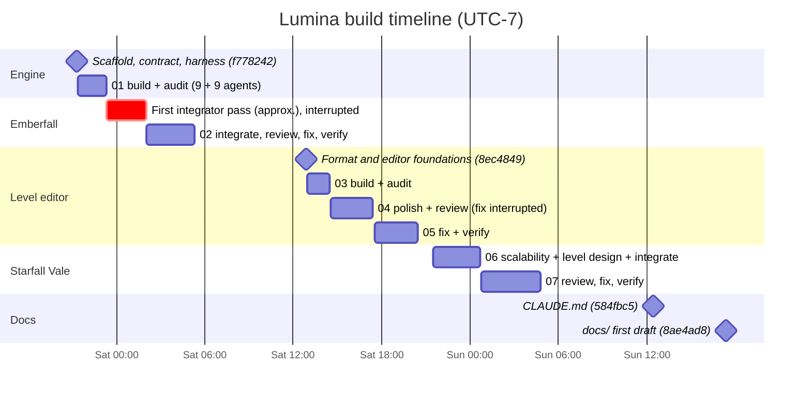
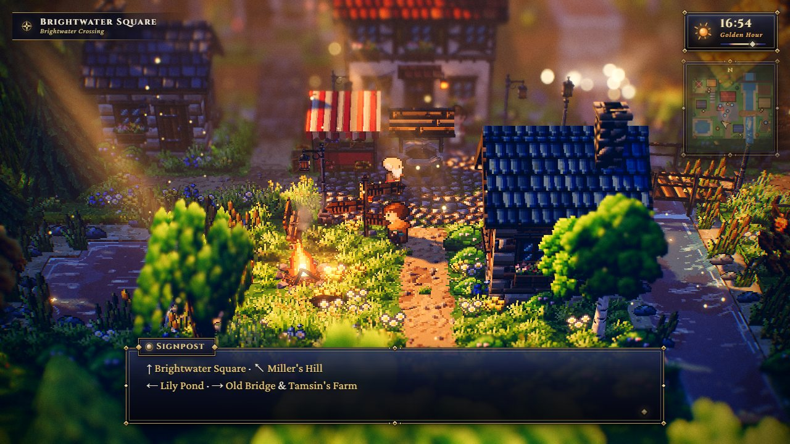

# Project history

> **Purpose.** The story of how Lumina was built: the user requests, the seven multi-agent
> workflows, what each one produced, the notable review findings and how they were fixed, the
> measurements over time, and the interruptions and how work was resumed. The raw material — one
> JSON report per workflow plus a timeline — is archived in [`reports/`](reports/README.md) (until 2026-10-01 it
> lived in the gitignored `.check/history/`); this page is the durable summary of it.
>
> **Audience:** anyone who wants to know *why* the code looks the way it does, and AI agents that
> need context before repeating or extending a phase.
>
> **Source of truth:** `git log` (the commits on `master`, listed in [§9](#9-commit-log); 14 when
> this page was first written), the workflow reports in [`reports/`](reports/README.md)
> (`01-…19-*.json`, `04b-editor-review-findings.json`, `timeline.md`), and the code.
>
> **Related:** [DECISIONS.md](DECISIONS.md) (the decisions these phases produced) ·
> [DEVELOPMENT_WORKFLOW.md §11](../development/DEVELOPMENT_WORKFLOW.md#11-how-the-multi-agent-work-was-organised)
> (how to run such a workflow again) · [contracts/MODULE_NOTES.md](../contracts/MODULE_NOTES.md)
> (the engine builders' reports, condensed) · [KNOWN_ISSUES.md](../ai/KNOWN_ISSUES.md)

All times are the commit timezone, UTC−7 (US Pacific daylight time). `timeline.md` dates some
requests one day later because it uses UTC dates.

---

## 1. At a glance

| Phase | Request | Workflow(s) | Agents | Commits | Result |
| --- | --- | --- | --- | --- | --- |
| 0. Scaffold | "Create a 3D pixel art game engine looks like the OCTOPATH TRAVELER II game. Use three.js … Create a demo scene." (09-25) | — (orchestrator) | 1 | `f778242`, `0b2f3df` | Vite + three r186 project, foundation modules, `ARCHITECTURE.md`, `tools/check.mjs` |
| 1. Engine modules | (same) | 01 `lumina-build-modules` | 18 | `807bfe4` | core, audio, postfx, textures, sprite art, sprite runtime + particles, lighting + sky + god rays, UI, terrain + water, props |
| 2. Emberfall demo | (same) | first integrator (interrupted), 02 | 7 (+1) | `9dadcf8`, `8e36884` | the playable village demo, 57 review findings fixed |
| 3. Level editor | "Create a visual map/level editor so that the user can create map by hand and save the map." (09-26) | 03, 04, 05 | 15 | `8ec4849` … `1643b2c` | level format, editor, Emberfall as JSON, Brightwater Crossing |
| 4. Starfall Vale | "Create a 128×128 full featured demo level." (09-26 evening) | 06, 07 | 9 | `ef71917`, `db41c62` | big-level scalability, light pool, minimap, the 128 × 128 showcase |
| 5. Guidance & docs | `/init` → `CLAUDE.md`, "commit it"; then "Create detailed documentations in the docs folder…" (09-27) | documentation workflow (writers, then a fact-checking pass) | — | `584fbc5`, `8ae4ad8` (first draft), `6f87685` | `CLAUDE.md`, this `docs/` tree |
| 6. Known-issue fixes | fixes of items from [KNOWN_ISSUES.md](../ai/KNOWN_ISSUES.md) (09-27 evening) | fix workflows (implement, review, fix, regression check) | — | `4f30592`, `a9f02a8` and the ED-18 / GAME-23 / LVL-15 / TOOL-15 change after it | see [§8.1](#81-known-issue-fixes-2026-09-27) |
| 7. ARPG combat | "add an ARPG style battle system, create a new level to demo it" (09-28) | contract-first combat workflow: foundation, 7 parallel packages, integration, a code and play review, 3 fix passes, a final regression pass, docs | — | `65e76a3` (contract + foundation), `eb82076` | real-time combat on levels with enemies, Cinderwatch Pass; see [§8.2](#82-phase-6--arpg-combat-and-cinderwatch-pass-2026-09-28) |
| 8. Combat known issues | "fix the open combat issues in known issues" (09-28 evening) | 7 parallel builders (runtime, FX and UI, art and level, editor, audio, tooling, balance), a code / play / visual / regression review, 3 fix passes, a final verification, docs | — | `630855d` | enemy paths and zones, the fixed-step bot, a gold sink, the audio QA page, the art and bundle fixes; see [§8.3](#83-combat-known-issues-pass-2026-09-28) |
| 9. Type check | whether TypeScript would pay off, then approval of a type check of the existing JavaScript through JSDoc (09-29) | an evaluation of the history; contract types first (level, combat, editor and hooks); 9 parallel area agents; a mutation test with comment-only gap fixes; a code and style review; docs | — | the commit after `630855d` | `npm run typecheck` (`tsc`, `checkJs`) at 0 errors, every bundle byte-identical; see [§8.4](#84-type-check-of-the-javascript-2026-09-29--30) |

Seven recorded workflows used **49 agents, 21.2 M tokens and 7,801 tool calls**:

| Workflow | Summary (from the report) | Agents | Tokens | Tool calls | Wall clock |
| --- | --- | --- | --- | --- | --- |
| 01 | Build the engine modules in parallel against `ARCHITECTURE.md`, each followed by an independent audit + fix pass | 18 | 6.45 M | 1,879 | 09-25 21:22 → 23:19 |
| 02 | Integrate the modules into the Emberfall demo, review through four lenses, fix, verify | 7 | 2.54 M | 1,036 | 09-26 02:02 → 05:19 |
| 03 | Build the level editor (shell / 2D / tools, 3D viewport) and make the game load level files, each audited | 6 | 3.09 M | 1,013 | 09-26 12:56 → 14:30 |
| 04 | Editor stroke performance and integration polish, four-lens review with real mouse input, fix, verify | 7 | 2.84 M | 1,002 | 09-26 14:34 → 17:25 (fix and verify hit the session limit) |
| 05 | Finish the 53 editor findings after the interrupted fix, verify with a showcase level built through the UI | 2 | 1.18 M | 634 | 09-26 17:33 → 20:28 |
| 06 | Big-level scalability in parallel with designing the 128 × 128 level, then integration and art polish | 3 | 2.21 M | 797 | 09-26 21:31 → 09-27 00:43 |
| 07 | Four-lens review of Starfall Vale and the big-level systems, fix, final verification | 6 | 2.88 M | 1,440 | 09-27 00:44 → 04:49 |

---

## 2. Environment

Everything was built and measured on one Windows 10 machine: Git Bash, Node 24, a GTX 1060 3 GB,
12 logical CPUs. Headless Chrome (the x86 Chrome install) renders on the real GPU through
ANGLE / Direct3D 11, and the compositor caps the headless frame rate at ~57–60 fps. During the
workflows several agents (and sometimes a dev-server tab in the IDE's browser pane) shared the GPU,
so reports give GPU *minimum* timings, CPU times and draw calls rather than averages.

`public/levels/untitled.json` appeared during the session (the timeline calls it probably the
user's own experiment; one editor reviewer's repro also created and then deleted an `untitled.json`).
It was intentionally left untracked, and every agent was told never to modify or commit it; the
Starfall agents checked it by md5. The user later deleted it, so `public/levels/` holds only the
four shipped levels.

---

## 3. Phase 0 — Scaffold (`f778242`, `0b2f3df`)

The orchestrating session set up Vite 8, three r186, lil-gui, the three `@fontsource` fonts and
puppeteer-core, then wrote the pieces every builder would share (12 files, +2,851 lines, 1,215 of
them `package-lock.json`):

- the foundation modules `src/engine/constants.js`, `utils/math.js`, `render/GlobalUniforms.js`,
  `pixel/PixelCanvas.js`, `pixel/Palette.js`;
- `ARCHITECTURE.md` — the visual target and the binding contract of every module (652 lines);
- `tools/check.mjs` — the first version of the headless harness (167 lines; steps wait, key, press,
  eval, shot, fps and a plain click);
- `sandbox/smoke.html`.

`.gitattributes` (`* text=auto eol=lf`, `*.png binary`) followed in a separate commit.

---

## 4. Phase 1 — Engine modules (workflow 01, `807bfe4`)

**Shape.** Seven builders started in parallel — core + audio, postfx, textures, sprite art, sprite
runtime + particles, lighting + sky + god rays, UI. Terrain + water and props started once the
texture library existed. Every builder was followed by an independent auditor that fixed what it
found. 18 agents, 87 files, 30,699 lines. Each module got a sandbox page under `sandbox/`.

**Deviations reported by builders** (all additive; recorded in `MODULE_NOTES.md`):
- r186 removed `PCFSoftShadowMap`: five of the nine module reports flagged the warning
  independently (core, postfx, sprite runtime, lighting, props); `Engine` and `LightingSystem`
  switched to `PCFShadowMap`, and the sandboxes already used it
  ([ADR-004](DECISIONS.md#adr-004--pcfshadowmap-instead-of-pcfsoftshadowmap)).
- PostFX: bokeh boost moved from the gather to a highlight-scatter pass; the stock bloom bright
  pass replaced by a soft-knee one ([ADR-005](DECISIONS.md#adr-005--half-resolution-dof-with-a-coc-aware-full-resolution-composite)).
- Textures: every texture got a normal map; large surfaces became 4 × 4-unit textures, so consumers
  must scale UVs by `meta(name).units`.
- Terrain: organic UV variation done in the shader (per-tile rotation had produced a visible grid).
- Prop sprites: `width` / `height` are one frame, not the strip.

**Notable audit findings and fixes.**

| Module | Found by the auditor | Fix |
| --- | --- | --- |
| core | `playSfx(…, { delay })` produced silence (the panner disconnected relative to *now*); the first `'resize'` event never reached listeners added after construction. | Disconnect relative to the voice start; `start()` forces one resize emit. |
| postfx | Boosted bokeh flickered while panning; blurred sprites kept crisp "cut-out" outlines. | Prefilter and gather reworked, taps weighted by 1 / max(CoC, 2)²; added `PostFX.sceneInfo` (true scene draw calls). |
| sprite runtime | `pow(negative)` in the particle twinkle produced NaN, which spread through bloom as black and white blocks; `play()` speed carried over between animations. | Guarded shader maths; contract speed semantics; `clone()` and group-rotation fixes. |
| lighting | Golden hour was as dark as midnight (mean luminance ~51/255); god rays 3–10× too bright without PostFX; the sky shader ran on every pixel (~0.6 ms). | Retuned keyframe (~69/255); screen blending when drawing to the canvas; sky drawn last with early-Z. |
| UI | 27 CSS animations kept running after the title screen; interrupting a dialog lost the player's choice. | `is-gone` class, paused hidden animations; interrupted promises resolve with the choice so far. |
| textures | Cliff, dirt side and hay read as planks, lattices and mush; the material cache key dropped `onBeforeCompile` functions. | Redesigned generators; robust cache keys. |
| terrain | Camera-facing cliff faces rendered nearly black at golden hour. | Sun-driven ground bounce on vertical faces. |
| props | Flame glow cut a hard line into the ground; unmerged houses cost 10–13 draw calls each. | Glow fade below the flame base; opt-in `PropFactory.mergeStatic` (436 → 212 calls in the sandbox). |

---

## 5. Phase 2 — The Emberfall demo (`9dadcf8`, `8e36884`)

**Interrupted integrator.** The first integrator pass stopped on a usage limit. Its state was
committed as `9dadcf8` "WIP: Emberfall demo integration (interrupted integrator pass)" (19 files,
4,655 lines), and workflow 02 started at 02:02 with an integrator that resumed from that state.

**Integration** (30 min; 19 files plus action scripts): `src/main.js`, `index.html`, `src/demo/*`
(Game, World, Scenery, GroundDetail, Player, Npc, Critters, dialogue, Weather, AudioDirector,
AtmosphereFog, DebugControls, config), the hand-written map `src/demo/maps/emberfall.js`, and
edits to `src/engine/index.js`, `sandbox/index.html` and `README.md`. Measured on an idle
GPU: 60 fps (vsync), ~9.1 ms per frame uncapped, scene 2.9–3.5 ms GPU, DOF 1.15–1.25, bloom
0.28–0.30, output 0.21–0.22; 235–245 scene draw calls; 405–431 k triangles; 84 shader programs.

**Review: 57 findings** (1 critical, 16 major, 22 minor, 18 polish) from four lenses — runtime (12),
art direction (17), performance (12), gameplay (16). The headline problems:

- **Critical:** wandering villagers moved 0.3 units per frame and flipped left / right every frame —
  their own collider pushed them (`TileMap._pushOut` self-collision).
- Shader warm-up compiled the wrong variants: a 3.1–3.3 s freeze on the first frame, 217–300 ms on
  the first rain ([ADR-008](DECISIONS.md#adr-008--compile-every-shader-at-load-against-the-hdr-target)).
- The player's x-ray silhouette was invisible (three.js alpha-tests `opacity × texel alpha`, so
  opacity 0.42 with `alphaTest` 0.5 discarded every pixel).
- DOF focused on the clamped camera focus, so the player blurred near map edges; the camera lost
  the player at close zoom.
- Night was near-black away from lanterns and "Dusk" was darker than "Night"; sprites blew out at
  golden hour; zooming out filled the frame with orange fog; golden-hour shadows were muddy.
- Nothing lowered the resolution above 1080p (29–59 fps at 2560 × 1440).
- `?autostart=1` never unlocked audio; the bard switched the music *off* on the first talk.

**Fix** (one agent, 55 min): 43 applied, 7 skipped with reasons (two light sets by day and night,
creating the AudioContext during loading, atlasing prop textures, bucketing outer trees, a collider
grid, an engine-side idle-fps change, a luminance target that lanterns make impossible). New files
came out of it: `ResolutionGovernor.js` ([ADR-022](DECISIONS.md#adr-022--a-resolution-governor-with-a-pixel-budget-and-median-decisions))
and `SnowCover.js`; the bloom threshold went 0.88 → 1.05; terrain top faces stopped casting
shadows; the DOF gather was capped at 64 taps.

**Verify** (60 min, a full playthrough with real keys) found and fixed three more: the silhouette
was blurred by DOF (it must write depth), particles bypassed the fog-start offset, and a stale debug
checkbox. Final numbers: 57.2–57.8 fps (the compositor cadence; a blank page measures 56.7), GPU
7.3–8.75 ms average under background load, 165–245 draw calls, ~0.34 M triangles, 57 programs, no
frame over 45 ms on the first rain, snow, dialog or toast. A sweep of 1,443 standable points × 3
zooms × 3 yaws never lost the player off-screen.

---

## 6. Phase 3 — The level editor (`8ec4849` … `1643b2c`)

**Foundations (orchestrator, `8ec4849`).** The level format (`LevelFormat.js`), the object catalog
that drives the inspector (`ObjectCatalog.js`), a per-object builder shared by game and editor
(`ObjectBuilder.js`), level storage (`LevelStorage.js`), the dev-server level API
(`tools/vite-level-api.js`), `EditorState` with undo / redo, and `docs/LEVEL_EDITOR.md` (now
[`docs/contracts/LEVEL_EDITOR.md`](../contracts/LEVEL_EDITOR.md)) as the contract ([ADR-011](DECISIONS.md#adr-011--levels-are-json-with-one-string-per-row),
[ADR-015](DECISIONS.md#adr-015--editorstate-transactions-with-whole-level-snapshot-undo),
[ADR-017](DECISIONS.md#adr-017--a-dev-server-api-saves-levels-into-the-project)).

**Workflow 03 — build (`dadfcd6`).** Three builders in parallel, each audited:

- *game_levels* converted Emberfall to `public/levels/emberfall.json` with a deterministic converter
  and made the game build only from level data ([ADR-012](DECISIONS.md#adr-012--emberfall-becomes-a-level-file-the-single-source-of-truth));
  added `sample-hamlet.json` (Willowmere). Proof of exactness: a world fingerprint (lights,
  interactables, colliders, walk surfaces, emitters, all 100 meshes by checksum) identical to the
  pre-conversion build. The auditor found that NPC talk points and critter yards were absolute
  coordinates that did not follow moved objects ([ADR-013](DECISIONS.md#adr-013--object-behaviour-fields-are-relative-to-the-object)),
  and hardened loading against a hostile hand-edited file (NaN values, a 10⁷-particle area).
- *editor_shell* built `editor.html`: menus, toolbar, ten tools, tool options, schema-driven
  inspector, outliner, textured 2D map, dialogs, autosave, play-test. The auditor fixed
  robustness bugs: dismissing the restore dialog deleted autosaved work; a lost pointer-up left a
  transaction open and disabled undo; typed values escaped the catalog ranges.
- *editor_3d* built the live HD-2D preview on the real engine and `TileMap.rebuildRect` (verified
  bit-identical to full builds at chunk sizes 64, 32 and 16). The auditor fixed sky clicks that
  placed objects ~600 tiles off the map and level-settings edits that never reached the terrain.

The orchestrator then extended the harness with real-mouse `drag`, `wheel`, `type` and `combo`
steps (`4a32326`) so the next reviewers could use real input.

**Workflow 04 — polish and review (`30290d0`).** A polish agent made strokes smooth in the split
layout ([ADR-018](DECISIONS.md#adr-018--the-editor-previews-with-the-real-engine-incrementally-and-exactly)):
paint p95 68 → 22.6 ms, height p95 168 → 21.0 ms, drag max 380 → 33.5 ms; per-chunk prop batching
(valley 1,372 → 722 draw calls, Emberfall in the editor 976 → 591); the shore bake in a worker
([ADR-020](DECISIONS.md#adr-020--the-shore-bake-is-a-pure-function-that-can-run-in-a-worker)); an
exactness check that the incremental preview equals a fresh build. Four reviewers with real mouse
and keyboard input then produced **53 findings** (2 critical, 13 major, 22 minor, 16 polish): UX 16,
data 15, performance 10, play 12. The critical ones: the single autosave slot was overwritten before
the user could restore it, and pasting level JSON replaced the level with no prompt and no undo.
Others: saving Emberfall unchanged rewrote all 136 object lines
([ADR-023](DECISIONS.md#adr-023--byte-stable-level-serialisation)); an object renamed to `spawn`
became unselectable; Enter in dialogs dropped the typed number; the Stairs tool broke sculpted ramps;
first placements compiled shaders synchronously (0.2–0.5 s).

**Interruption.** The fixer hit the session limit after 45 minutes and the verifier never started
("You've hit your session limit · resets 5:30pm"). The orchestrator committed the polish work and
the partial fixes as `30290d0`, kept the full findings with evidence and repro steps
(`04b-editor-review-findings.json`), and started a new workflow.

**Workflow 05 — fix and verify (`1643b2c`).** The new fixer triaged all 53, none skipped. Its
summary counts 38 as fixed by the interrupted agent (each re-verified by re-running its repro) and
15 fixed then; its per-finding triage table marks 43 `fixed_before` and 10 `fixed_now`. The
report does not reconcile the two counts; several `fixed_before` notes record additions made in
this pass (Windows device names in `slugify` and the level API, a music-start refinement), which
probably accounts for the difference.
It also found three bugs in the interrupted agent's work (a loading overlay that never showed, an
outline warm-up race, props left floating after undoing a terrain step) and fixed the harness:
with puppeteer 25, `dblclick` and `type` with a selector had silently sent single clicks — which is
why one review repro "failed". The verifier then built **Brightwater Crossing** (36 × 28, 68 objects)
entirely through the editor UI with real clicks, drags and typing, played it through, and added
the harness `tab` step to follow the editor's Play tab.

---

## 7. Phase 4 — Starfall Vale, 128 × 128 (`ef71917`, `db41c62`)

**Baseline (orchestrator).** A synthetic 128 × 128 level ran, but only 12 of ~150 lights ever lit
(the first 12 in file order) and 1.29 M triangles were drawn at all times — nothing was culled.

**Workflow 06 — build (`ef71917`).** Two agents in parallel, then an integrator:

- *Scalability engineer:* `LightPool` ([ADR-007](DECISIONS.md#adr-007--a-fixed-set-of-12-point-lights-then-a-lightpool)),
  k-d batching with box culling and shadow-only proxy casters
  ([ADR-019](DECISIONS.md#adr-019--big-levels-k-d-batching-box-culling-and-shadow-proxies-gated-at-64-tiles)),
  a collider spatial grid (30,000 moves: 66 ms vs 1,555 ms, identical results), a worker shore
  bake, sliced loading, and the minimap and world map ([ADR-021](DECISIONS.md#adr-021--minimap-and-world-map-from-one-cached-level-render)).
  A first attempt with naive 32-tile chunks gave 459–818 draw calls and was rejected. On the
  892-object build: draw calls 182–353 → 159–283, triangles 1.08–1.53 M → 0.81–1.17 M, load
  9.6–10.3 s → 7.1–8.5 s on a busy machine. Emberfall, Willowmere and Brightwater were verified
  identical (draw calls, triangles, light lists: 203 / 335,250, 138 / 160,850, 192 / 222,638).
- *Level designer:* `tools/make-starfall-vale.mjs`, a deterministic generator with a validator that
  refuses to write a broken level ([ADR-014](DECISIONS.md#adr-014--big-levels-come-from-deterministic-validating-generators)).
  It found that a bridge whose bank is one level below its deck cannot be entered (the first plank
  is 0.558 above the bank, over the 0.55 step limit).
- *Integrator:* 38 scripted walks through the real player movement code, 29 villagers,
  59 interactables, 30 regions; fixed a routing
  bug (Mirrormere Landing unreachable from the East Road — the validator could not see it because
  the long way round existed, so it gained route checks), a light-pool snap that left moved lights
  dark for one frame, un-culled god-ray shafts (22 on Starfall; culling them saves 10–15 draw calls
  per view and, since it is not gated, took one shaft off Emberfall: 203 → 202 calls), and added
  `environment.forest.areas`.

**Workflow 07 — review, fix, verify (`db41c62`).** Four reviewers — explorer (17), art (14),
performance (9), data (10) — found **50 findings** (0 critical, 12 major, 20 minor, 18 polish).
Examples: house roofs in Hearthwick hid three villagers and four door or talk spots; the promised
Starfall night event never happened; lamps
next to the player stayed dark while torches 9–10 units away were lit (`priorityWeight` 4 → 1.5);
the lake at golden hour looked "like pink milk covered in glitter" (new `water.glint`); dawn and dusk
dissolved into magenta fog (new `environment.fogScale`); the first gameplay frame re-baked the shore
on the main thread for 421–450 ms; waterfall spray compiled shaders on first approach; the editor
drew 2,872 calls on Starfall; the Silverrun river was dammed by a sand bar; the validator accepted 6
bridge and 3 stair removals. All 50 were handled (47 fully; editor draw calls 2,872 → 915, not the
reviewer's 700 target; the worst zoomed-out town view reaches ~300 calls; governor steps still
reallocate targets). The generator's validator now refuses 43 of 44 deliberate mutations.

The verifier toured everything from the title screen with real keys. Final: 874 objects, 95 light
descriptors; load 4.03–4.40 s with a cold shader cache, 2.40–2.46 s warm; 59 programs; Hearthwick
Square 261 draw calls, 1.13 M triangles, 5.32 ms best-case GPU; every lamp within 9 units of the
player lit at 10 night spots.

---

## 8. Phase 5 — Guidance and documentation

`584fbc5` added `CLAUDE.md` (commands, architecture, invariants for Claude Code sessions). The
documentation workflow then moved `docs/LEVEL_EDITOR.md` and `docs/MODULE_NOTES.md` into
`docs/contracts/`, updated the comments that cite them, curated 30 screenshots into
`docs/assets/screenshots/`, and wrote this `docs/` tree with one writer per section. The pass was
interrupted by a usage limit just before the writers returned their reports; the complete drafts
were committed as `8ae4ad8` ("Docs: first draft …", body: "Fact-checking pending."), and after the
limit reset the writers resumed, reviewed every draft against the code and fixed what was wrong —
the same commit-then-resume pattern as `9dadcf8` and `30290d0`. That fact-checking pass re-ran the
Emberfall fingerprint, the level round trip, the generator checks, the worked harness examples and
several sandbox suites, all with the results quoted in
[TESTING_AND_VERIFICATION.md](../development/TESTING_AND_VERIFICATION.md).

### 8.1 Known-issue fixes (2026-09-27)

With the docs in place, [KNOWN_ISSUES.md](../ai/KNOWN_ISSUES.md) became the work list. Each fix went
through an implementation, independent review and a fix round, followed by a final regression
check; the second run also captured before-state baselines first (fingerprints, the weather look
numbers of the game and the editor, editor draw calls) and ended with a docs pass:

- **`4f30592`, `a9f02a8`** — the level API's cross-site writes (TOOL-12: `PUT` + JSON only, same
  origin only), one-choice dialogue pages (GAME-16), Brightwater's villagers (LVL-12: Posy's talk
  point, Marigold off the inn door), the editor's light pool replaced by the engine `LightPool`
  (LIT-02), and `make-sample-hamlet.mjs` reproducing its file again (LVL-11, LVL-08).
- **The next change** ("fix the three smaller problems in known issues and the editor weather
  system issue"): TOOL-15 (`server.cors` / `preview.cors: false`), GAME-23 (house doors get their
  leaf as a second interaction target, so *Knock* shows at the wall), LVL-15 (Brightwater's market
  stall moved out from behind Riverside Cottage, eight objects) and the weather part of ED-18 (the
  shared [`WeatherLook.js`](../../src/demo/WeatherLook.js); the editor previews rain and snow with the
  game's look and lights). Review rounds reshaped two of them: the first door fix let doors steal
  the prompt from villagers the player faced, and the first stall position trapped the square's
  cat behind the stall and clipped the well roof; weather switching still compiled a god-ray
  program, and an older foliage recompile on every editor undo turned up (ED-24). The regression
  pass found one stray file — a harness report named `nul` in the repository root, written because
  Git Bash turns a `/dev/null` *argument* into `nul` (ENV-05).

### 8.2 Phase 6 — ARPG combat and Cinderwatch Pass (2026-09-28)

The request "add an ARPG style battle system, create a new level to demo it" ran as a contract-first
workflow: the lead wrote [COMBAT.md](../contracts/COMBAT.md) (revised once after a feasibility and a
player-experience review, §26) and a *foundation* commit (`65e76a3`: the catalog types, shape-complete
engine placeholders, the Starfall coverage change), then seven packages built in parallel on
disjoint files — **sprites** (enemy sheets, the player's combat poses, the FX atlas, the `Sprite3D`
flash / glow variant, a sheet-hash baseline taken before the first edit), **fx-audio-input**
(`FxQuads`, draped `GroundMarkers`, bursts, 35 combat sounds, battle / boss music, mouse and stick
input), **ui** (combat HUD, world labels, boss bar, announcer, death screen, title destinations),
**enemies** (the enemy state machine and eight brains against a mock context), **combat-core** (the
combat system, the player kit, game integration and an in-page fixture level, so it could verify
before the level existed), **level** (chest and waystone props, the Cinderwatch Pass generator with
18 validation rules — 19 after the review) and **editor**. The integrator then fixed what only showed with the real
pieces together (arrow and thrust quads drawn sideways, a white bloom over every slash and boss hit,
the push ring dealing damage, flashes hiding the sprites), wrote a bot that plays the whole level
with real key events (`combat.play.json`: drill, chests, rest, the Ruins, the quarry, a death and
respawn, Cinderheart, the results card in about five minutes) and recorded every kept deviation in
COMBAT.md §27. Peaceful levels kept their fingerprints (Emberfall 57 programs); Cinderwatch runs 63
programs at load and after a full fight, ≤ 231 draw calls in its busiest zones.

A **code and play review** followed, and three **fix passes** ran on disjoint areas:

- **game** (28 findings, 6 major): slimes flung ~11 u in one frame by a detour (hop speed now fixed
  when aimed); the boss idling forever after two slams (it walks in, and the no-repeat rule yields
  after 90 f); the player hidden inside the 4 u boss sprite (hurt-radius separation, a see-through
  dither); quarry archers shooting into the closed arena (`PlayerView.sealed`); a red bloom smear
  over the player in phase 3 — traced by reading back the bloom target to an instance progress of
  1 that interpolates to 0.99999994 — and an orange haze over the closed arena (dimmer markers,
  ember wall and barrier); plus readability, pickups at a full bar, events, a lazily loaded
  `CombatSystem` chunk.
- **art and level** (11 findings): the ledge archers and the quarry's west pack woke each other
  across a shared edge (a north rampart and a new generator rule 19, *zone separation*, with
  aggro probes standing still in god mode); wind-up tints that still flattened dark sheets (the
  new Sprite3D **highlight**, ADR-040); a marsh light with no source; Cinder Ridge redrawn from
  one-level "planks" into cliffs and a broken crest; a meandering brook; cut stone in the quarry;
  labelled chest upgrades in the editor.
- **editor** (8 findings): start spots made exact (the game's test with bridge decks, props and
  villagers, re-scattered when anything under a pack changes), the arena and gate carried by corner
  drags and quarter turns, stray-arena and gate warnings (`src/editor/enemyGroups.js`).

The **final regression pass** found nothing to fix in the code; it made Vite's watcher skip
`.check/` (19 GB of harness output had added ≈ 3.8 s to every cold dev-server load, TOOL-16) and
noted that COMBAT.md did not yet record the fix passes — which revision 4 of the contract
(§27.9–§27.12) and this documentation pass (screenshots, ADR-026 – ADR-040, playbooks for enemy
kinds and tuning) did. The play-through bot's final run beat Cinderheart in 64 s with one planned
fall (`5:54 · 36 foes · 1 fall · 3 perfect dodges · Lv 6`). This phase, too, was interrupted once
by a usage limit and resumed from the files on disk. It was committed as `eb82076`.

### 8.3 Combat known-issues pass (2026-09-28)

The request "fix the open combat issues in known issues" took on the 21 COMBAT rows of
[KNOWN_ISSUES.md](../ai/KNOWN_ISSUES.md) and ED-25. Seven builders worked in parallel on disjoint
files of the same working tree, sharing one GPU (each with its own harness server and `--out`
prefix):

- **runtime** — the enemies' walk grid (`src/demo/combat/Nav.js`, a bounded A* on 0.5 u cells):
  chasers climb stairs and ledges and walk home by path instead of fading and snapping; a player
  out of reach makes them give up at once; **zones** from the level's regions stop a fight in one
  zone from pulling in the next zone's pack; numeric hit tags; boss test hooks
  (`combat.boss.force / info / hazards`, `stepUntil`); `Sprite3D.bodyOpacity` (the boss's
  see-through keeps its shadow); the barrel's combat modules marked side-effect free
  ([ADR-041](DECISIONS.md#adr-041--enemies-path-on-a-walk-grid-and-zones-bound-a-pack),
  [ADR-042](DECISIONS.md#adr-042--combat-only-engine-modules-stay-out-of-peaceful-chunks));
- **FX and UI** — the marker height bake sliced into ≤ 6 ms pieces (never half resolution), world
  labels that keep out of the HUD panels, a pre-rendered death screen, dim boss-death and
  level-up bursts, a cellular magma crust;
- **art and level** — the roll pose, the archer's draw and the bat's side view redrawn; an
  on-demand `crag` rock-face texture for Cinder Ridge; the lodge and the keep moved off the paths
  (rule 13 now fails a roof-hidden path tile); the marsh light's wisps; generator rule 20
  (chase and group-wake margins);
- **editor** — an instanced batch for enemy previews (≈ 0.3 draw calls per sprite instead of
  ≈ 2.85), the boss *Count* capped at 1, exact start dots in the 2D-only layout, graded 2D hits
  (ED-25);
- **audio** — `sandbox/combat_audio.html`, an offline QA and listening page (loudness, true peak,
  truncation, gain steps, leaks, spectrum, dense mixes); it found envelope leaks, clicking
  re-triggers, 16 cut tails, over-loud big moments, harsh chimes, sub-bass rumble and the victory
  stinger playing over the clashing boss track — all fixed, the peaceful audio identical;
- **tooling** — a fixed-step, deterministic mode for the play-through bot (`Engine#manualStep`,
  a virtual page clock, a one-line `summary` with a digest;
  [ADR-043](DECISIONS.md#adr-043--a-fixed-step-mode-for-the-play-through-bot));
- **balance** — tuned against the new bot (an expert and a seeded human model, boss-only probes)
  and a gold sink: a `shopkeeper` menu at Bram and Odo with three one-time wares; bats 24 HP / ATK
  8, Cinderheart ATK 22. It also applied the builders' cross-file requests (the combat UI registry,
  the direct imports of the shared demo modules, the boss-death bursts).

A **code, play, visual and regression review** then found, among smaller things, an archer stuck
at the Ruins stair foot on its way home (waypoints passed too early along a cliff), melee enemies
winding up under a ledge edge, an aggro loop after a give-up, world labels pushed next to the
player in the boss fight (the legend and boss-bar zones merged), a glare left by the boss's death
flash and a pickup's sparkles, enemy batches that were never frustum-culled, the start test
building props at every editor open, and a first `enableCombat(classes)` that made a contract
member non-additive. Three **fix passes** (game, art-level, editor) fixed all of them — the game
pass, cut off by a usage limit, rebuilt its state from its scratch notes and the diff — and moved the lodge and keep a second time against a stricter roof model (knee height,
chimneys). The **final verification** changed no file: peaceful levels byte-identical with their
fingerprints; `enemy_ai` 141 / 141; every stepped script clean; Cinderwatch 163–164 calls, 63
programs at load and after a full fight, worst 230 of 300 with woken enemies; the fixed-step bot
identical run after run (digest `54c13fa2`: 304.35 s, 36 kills, boss down in 44.5 s), the human
model winning the boss first try in 75 s. What stays open is listed in KNOWN_ISSUES: a human
listening pass (COMBAT-11) and play-test (COMBAT-12), the legs behind the ruins rampart
(COMBAT-22), ≈ 24 kB gzip of combat code in shared modules (COMBAT-23). The documentation was
brought up to date last (this entry, COMBAT.md revision 5 §27.13–§27.20, the five combat
screenshots retaken).

### 8.4 Type check of the JavaScript (2026-09-29 – 30)

The user asked whether TypeScript would pay off. An evaluation of the history said: of 413 bug
fixes a type checker would have caught about 3 (at most 12), it helps with none of the
invariants, and a `.ts` conversion would touch ≈ 250 files and ≈ 900 checked doc links and break
the chunk split and the Node generators — but a check of the existing JSDoc would catch contract
renames and dependency drift and keep the JSDoc honest. The user approved that check
([ADR-044](DECISIONS.md#adr-044--jsdoc-types-checked-by-tsc-instead-of-a-typescript-conversion)):

- **setup** — `typescript`, `@types/three`, `@types/node`; `tsconfig.json` (browser: `src/`,
  `sandbox/`) and `tools/tsconfig.json` (Node: `tools/`), `npm run typecheck`
  ([`tools/typecheck.mjs`](../../tools/typecheck.mjs)). Baseline: 1 927 errors in the browser
  program and 274 in the tools program;
- **contract types first** — the level document derived from `OBJECT_TYPES`
  (`src/engine/level/types.d.ts`), the combat interfaces of COMBAT.md §9
  (`src/demo/combat/types.d.ts`), the editor's tool interface and the automation hooks
  (`GameHooks`, `EditorHooks`, `LuminaHooks`, `src/globals.d.ts`), each written from the code and
  marking where the contract text differs;
- **nine area agents in parallel** (engine core, pixel and UI, world and level, game, combat,
  editor, 3D viewport, sandbox, tools) on disjoint files, each allowed only comments, parenthesised
  JSDoc casts and `.d.ts` files, with cross-area changes filed as requests. A usage limit cut the
  pass off once; the agents resumed from the tree on disk and their partial reports;
- **a mutation test** — 88 deliberate breakages applied one at a time to a copy of the tree: 55
  caught at first, 87 after 20 comment-only fixes of the gaps it showed (typed helper parameters,
  closed brain-state typedefs, typed event / action / sound / preset names, a check for a catalog
  type without a builder case); the miss is an `eval` string in a JSON action script;
- **a code and style review**, then the final gate: both programs at 0 errors, no `@ts-nocheck`,
  11 `@ts-expect-error` lines with reasons, the Vite bundles byte-identical to the ones built
  before the pass.

The pass corrected about a hundred stale JSDoc items (eight of them KNOWN_ISSUES CMT rows) and
found the contract text behind the code in places (DOC-15, COMBAT.md §27.21); its review found two
real bugs, recorded and not fixed because the pass changed no runtime code — goblins never
back-hop from Whirl Slash (COMBAT-24) and level data names such as `"constructor"` passing the
catalog lookups (LVL-17). The documentation was brought up to date last (CONVENTIONS.md §3.1,
TESTING_AND_VERIFICATION.md §8.4, TASK_PLAYBOOKS §21, the contract pointers to the typed copies).

The goblin back-hop (COMBAT-24) was fixed the next day (2026-10-01): one pattern in
`ai/goblin.js`, two new `enemy_ai` checks, the expert bot's digest unchanged and the human
model's run re-recorded (`d99e2c65`).

The level-data names (LVL-17) were fixed the same day. A new foundation module,
`src/engine/utils/own.js`, holds own-key lookups (`isOwnKey`, `ownValue`) and conversions that
never throw (`showValue`, `toText`, `toNumber`); every lookup of a name read from a level, across
the engine, the game and the editor, goes through them, and one exported `waterfallDir` in
`Water.js` replaced three private copies of the facing table. `"constructor"` or `"__proto__"` now
acts like any unknown name, and a `{"toString": 1}` value no longer aborts a load. The review of
the fix added the one-character rule for legend keys (a longer key had been offered in the paint
palette and spliced whole into a row), a paste that cannot leave a transaction open and an editor
particle preview that warns instead of logging an error. The new `hostile` case of
`sandbox/game_levels.html` and its script `game_levels.hostile.json` check all of it in the game
and the editor and fail on the old code; the shipped levels, the generators' output and the level
fingerprints are unchanged. Two related gaps stay open (KNOWN_ISSUES LVL-18, LVL-19).

Interrupted strokes in the editor's 2D map (KNOWN_ISSUES ED-16) were fixed the same day: a
`pointercancel`, a lost pointer capture or a window blur had ended the stroke as a normal release,
so an interrupted box select still changed the selection. `Map2DView` now ends every interruption
with `cancelled: true` on the stroke's last pointer event, as the 3D view already did. An audit of
every tool's release and its review found four more changes made on release that ignored the
flag, in both views — Select's click-narrowing, Rectangle, Place's region and dragged line, Player
start's marker selection — which now skip it, while strokes that edit as they go (Paint, Height, Stairs,
Erase, moves) keep what they applied as one undo step. The new `sandbox/editor_shell.cancel.json`
checks every case in both views and fails on the old code; the review left one gap open, the 2D
map's missing lost-release detection (ED-27).

### 8.5 Gildhaven, a 128 × 128 town (2026-10-02)

The user asked for a new 128 × 128 bustling town. Gildhaven — a walled river town on fair day —
is generated by [`tools/make-gildhaven.mjs`](../../tools/make-gildhaven.mjs), the second
generator on the shared helpers of `tools/lib/levelgen.mjs`. Its first draft hid 7.4 % of the
path tiles behind roofs: with the chimney modelled, a one-storey row house hides a walker up to
≈ 9.8 units north of its centre, and the rows stood 12–13 units apart. Moving two streets south
and keeping row houses at one storey brought it to 0.6 %. The tour
([`sandbox/gildhaven.tour.json`](../../sandbox/gildhaven.tour.json)) found one shadow program
compiled during play — the pine foliage's, because the woods round the spawn had no pines — which
two pines by the King's Road fixed for this level; the general gap is KNOWN_ISSUES REN-13.
Design page: [design/levels/gildhaven.md](../design/levels/gildhaven.md).

The user then asked for editor-made levels to get the same checks. The generator's validator
moved into [`tools/lib/levelcheck.mjs`](../../tools/lib/levelcheck.mjs) (`checkLevel`; the
generator's level and report unchanged byte for byte), and
[`tools/check-level.mjs`](../../tools/check-level.mjs) (`npm run level:check`) runs it on any level
file. Its first run over the shipped levels found that Emberfall's fenced field has been sealed
since the demo was built: the gate opens onto a cottage wall (KNOWN_ISSUES LVL-20).

---

## 9. Commit log

| Commit | Date (UTC−7) | Subject | Size |
| --- | --- | --- | --- |
| `f778242` | 09-25 21:19 | Scaffold Lumina HD-2D engine: foundations, contract, check harness | 12 files, +2,851 |
| `0b2f3df` | 09-25 21:19 | Add .gitattributes | 1 file, +2 |
| `807bfe4` | 09-25 23:19 | Build engine modules: core, postfx, textures, sprites, particles, lighting, terrain, water, props, UI | 87 files, +30,699 |
| `9dadcf8` | 09-26 02:02 | WIP: Emberfall demo integration (interrupted integrator pass) | 19 files, +4,655 |
| `8e36884` | 09-26 05:21 | Complete Emberfall demo: review fixes, weather, snow cover, resolution governor | 27 files, +1,062 / −198 |
| `8ec4849` | 09-26 12:54 | Level format, object catalog, builder, storage and editor state foundations | 12 files, +2,123 / −1 |
| `dadfcd6` | 09-26 14:31 | Level editor: editor app, 2D map, tools, 3D viewport; game loads level files | 87 files, +16,481 / −866 |
| `4a32326` | 09-26 14:33 | Shift environment rects on resize; clearer missing-level error; harness drag/wheel/type/combo steps | 3 files, +79 / −5 |
| `30290d0` | 09-26 17:33 | Editor stroke performance, prop batching, water shore worker; partial review fixes | 46 files, +6,866 / −756 |
| `1643b2c` | 09-26 20:29 | Level editor: apply all review findings; Brightwater Crossing showcase level | 20 files, +611 / −61 |
| `ef71917` | 09-27 00:43 | Starfall Vale 128x128 demo level; big-level scalability, light pool, minimap and world map | 38 files, +5,966 / −173 |
| `db41c62` | 09-27 04:51 | Starfall Vale: apply 50 review findings; Starfall night event, sightline and light-pool fixes | 30 files, +2,073 / −1,018 |
| `584fbc5` | 09-27 12:27 | Add CLAUDE.md with commands, architecture and invariants for Claude Code | 1 file, +126 |
| `8ae4ad8` | 09-27 17:22 | Docs: first draft of the docs/ tree (user, features, specs, architecture, modules, design, development, history, AI onboarding) | 93 files, +20,971 / −24 |
| `6f87685` | 09-27 18:57 | Docs: fact-checked documentation tree, glossary, index and link checker | 51 files, +2,800 / −1,132 |
| `cccbd23` | 09-27 18:58 | Docs: drop references to the removed user scratch level; keep the generic rule | 10 files, +25 / −30 |
| `8631218` | 09-27 19:19 | CLAUDE.md: bring up to date with the code and docs; commit without asking | 3 files, +64 / −24 |
| `4f30592` | 09-27 20:49 | Regenerate sample-hamlet.json from its generator; add --out and --check | 2 files, +125 / −44 |
| `a9f02a8` | 09-27 20:49 | Fix level-API cross-site writes, one-choice dialogue, Brightwater villagers, editor light pool | 36 files, +869 / −312 |
| `7df6c5b` | 09-28 01:45 | Fix door Knock prompt at the wall, Brightwater stall occlusion, editor weather preview, dev-server CORS | 57 files, +972 / −297 |
| `65e76a3` | 09-28 04:20 | Combat: design contract and foundation (catalog types, engine placeholders) | 22 files, +3,808 / −16 |
| `eb82076` | 09-28 16:44 | Add ARPG combat system and the Cinderwatch Pass demo level | 152 files, +31,343 / −837 |
| `630855d` | 09-29 10:11 | Fix open combat issues: enemy pathing, zones, shop, fixed-step bot, audio QA, art and editor | 112 files, +9,242 / −1,997 |
| `afd58b6` | 09-30 22:33 | Add a TypeScript type check of the JavaScript through JSDoc (checkJs) | 220 files, +9,223 / −1,198 |

Every commit ends with the trailer `Co-Authored-By: Claude Opus 5.5 <noreply@anthropic.com>`
([DEVELOPMENT_WORKFLOW.md §9](../development/DEVELOPMENT_WORKFLOW.md#9-git-conventions)).

---

## 10. Measurements over time

All at 1600 × 900 on the GTX 1060 unless noted. Draw calls are the scene pass including the shadow
pass (`postfx.sceneInfo`). Headless fps is capped by the compositor, so it is not a budget figure.

| When | Level / page | Measurement |
| --- | --- | --- |
| 01 (`807bfe4`) | props sandbox | `mergeStatic`: 436 → 212 draw calls |
| 01 | lighting sandbox | sky with early-Z saves ~0.6 ms |
| 02 integration | Emberfall | 60 fps vsync; scene 2.9–3.5 ms, DOF 1.15–1.25, bloom 0.28–0.30, output 0.21–0.22 ms GPU; 235–245 draw calls; 405–431 k triangles; 84 programs |
| 02 review | Emberfall | first-frame freeze 3.1–3.3 s; 12 point lights ≈ 1.25 ms; 29–59 fps at 2560 × 1440 |
| 02 verify (`8e36884`) | Emberfall | 57.2–57.8 fps (compositor); GPU 7.3–8.75 ms average under load; 165–245 draw calls; ~0.34 M triangles; 57 programs; 2560 × 1440 rendered at 1932 × 1086, 9.9 ms GPU |
| 03 | editor 2D map | full terrain cache rebuild 7 ms (48 × 40), 51–54 ms (128 × 128) |
| 03 | editor 3D preview | ~1,000–1,400 draw calls with ~200 unbatched objects |
| 04 (`30290d0`) | editor, 64 × 64 | stroke p95: paint 68 → 22.6 ms, height 168 → 21.0 ms; drag max 380 → 33.5 ms; draw calls 1,372 → 722 (Emberfall 976 → 591) |
| 05 (`1643b2c`) | editor, 128 × 128 | stroke frame p50 35 → 16.7 ms |
| 06 baseline | synthetic 128 × 128 | 12 of ~150 lights lit; 1.29 M triangles always drawn |
| 06 (`ef71917`) | Starfall (892 objects) | 182–353 → 159–283 draw calls; 1.08–1.53 → 0.81–1.17 M triangles; load 9.6–10.3 → 7.1–8.5 s (busy machine) |
| 07 verify (`db41c62`) | Starfall (874 objects) | load 4.03–4.40 s cold / 2.40–2.46 s warm; 59 programs; square 261 calls, 1.13 M triangles, 5.32 ms GPU; editor 2,872 → 915 calls |
| Documentation pass (three runs of the `8ae4ad8` engine code, the last during the fact-check) | Emberfall plaza, 17:12 | 56.3–60.2 fps (compositor); 212–215 draw calls; 0.34 M triangles; GPU minimum scene 3.45–3.63, DOF 1.32–1.39, bloom 0.29–0.30, output 0.24–0.25 ms; CPU update 0.3–0.6 ms, render submission 2.0–2.7 ms (medians); 57 programs; load 3.64 s cold on a quiet GPU |
| Known-issue fixes after `a9f02a8` (§8.1) | §16 fingerprints, spawn / golden views | game unchanged: Emberfall 228–237 draw calls (villager noise), 0.34 M triangles, 57 programs; Sample Hamlet 165 / 168,386 / 54; Starfall 176 / 869,132 / 59; Brightwater 211 / 231,148 / 57 after the stall move. Editor programs 58 → 60 (default view) and 83 → 87 (PostFX + atmosphere) on the small levels, 60 → 62 and 85 → 89 on Starfall, constant through weather switches; editor draw calls unchanged |
| Combat (§8.2), final verification | Cinderwatch Pass / peaceful levels | Cinderwatch: 165–166 draw calls and ≈ 0.62 M triangles at the spawn, 106–188 calls per zone with the enemies hidden (budget 200), worst 230–231 with woken enemies (budget 300), 63 programs at load and after a full fight, combat update p95 0.3–0.7 ms, no frame over 45 ms after warm-up; load (production build) 3.6–3.7 s. Peaceful: Emberfall 230 calls, 57 programs, 12 lights (unchanged), production load 2.7–2.8 s before and after; Willowmere, Brightwater, Starfall identical |
| Combat known issues (§8.3), final verification | Cinderwatch Pass / peaceful levels / editor / bundle | Cinderwatch: 163–164 calls and ≈ 0.61 M triangles at the spawn, ≤ 188 per zone with the enemies hidden, worst 229–231 with woken enemies, 63 programs, tick p50 / p95 0.2 / 0.3 ms, max frame gap 18.5 ms (alone); walk grid ≈ 20 ms at load, path searches 0.01–0.4 ms. Editor on Cinderwatch 580 → 455 calls (enemy batch). Peaceful JS gzip 422.5 → ≈ 397 kB (372.9 before combat); `main.css` 18.8 → 13.9 kB gzip. Peaceful fingerprints and editor stats unchanged |
| Type check (§8.4), final gate | build / `tsc` | Vite bundles byte-identical before and after (every changed sandbox and tools file minifies identically); `npm run typecheck` ≈ 1 s per program; errors 1 927 + 274 → 0 + 0; the mutation test 55 → 87 of 88 caught |

---

## 11. Interruptions and how work resumed

| What happened | How it was handled |
| --- | --- |
| The first Emberfall integrator stopped on a usage limit. | Its partial work was committed as a WIP commit (`9dadcf8`); the next workflow's integrator started from that tree. |
| Workflow 04's fixer hit the session limit mid-way; the verifier never started. | Commit the partial state (`30290d0`); save the reviewers' structured findings; start a new workflow whose fixer triages every finding as *fixed before* or *fixed now*, re-runs each repro, and reviews the interrupted agent's changes (it found three bugs in them). |
| The documentation writers hit a usage limit just before returning their reports. | The complete drafts were committed as `8ae4ad8` with "Fact-checking pending." in the body; after the reset each writer resumed on its own files, reviewed them against the code and fixed them instead of starting over. |
| Agents shared one GPU with each other and with desktop apps (26–98 % busy at times). | Report GPU minima, CPU times and draw calls; interleave before / after runs; switch the resolution governor off for measurements. |
| The combat documentation pass hit a usage limit before it had written anything. | It resumed after the reset from the files on disk (the fix passes' and the final verifier's edits), without redoing their work. |
| In the combat known-issues pass, seven builders shared one working tree and one GPU, and a usage limit cut the workflow off once (the game and art-level fix passes mid-way). | Disjoint file ownership with cross-file changes filed as requests (the balance builder applied them); frozen copies of the tree for the bot's determinism proofs; program counts and stepped results trusted under load, frame gaps only alone (TOOL-18). The interrupted passes resumed from their scratch notes, the diff and the reports (the art-level pass found its attempt had changed nothing and started from the current tree). |
| In the type-check pass a usage limit stopped the nine area agents mid-way. | Each resumed from the working tree and its partial report rather than starting over (some counted their `errors_before` from the resume point; the baselines saved before the pass, 1 927 + 274, are the reference); a file-by-file "same code" check (comments stripped, minified) proved no runtime change slipped in. |
| A shell-quoting slip in one audit wiped a builder's screenshots. | The auditor regenerated them from the fixed code under the same names. |
| Scripted editor tests saved temporary levels into `public/levels/`. | Every agent deleted its temporary levels; the user's untracked `untitled.json` was checked by md5 and left untouched. |

---

## 12. Lessons the reports keep repeating

- **Measure the right thing.** Headless fps is the compositor's cadence; use GPU timer minima,
  CPU timings, draw calls and shader-program counts ([TESTING_AND_VERIFICATION.md §9](../development/TESTING_AND_VERIFICATION.md#9-measuring-performance-correctly)).
- **Prove "nothing changed" with fingerprints and exactness checks**, not screenshots alone —
  wandering villagers, particles and wind make every screenshot differ.
- **Real input finds real bugs.** The reviews with real mouse drags found problems that synthetic
  events had hidden, and a harness bug (`dblclick`) that made a fix look broken.
- **Validators need mutation tests.** The Starfall validator passed a level with a dammed river
  until a reviewer deleted bridges on purpose and saw nothing fail.
- **Keep data relative and byte-stable.** Absolute NPC talk points and key-reordering saves were
  both found only when someone moved objects or saved unchanged files.
