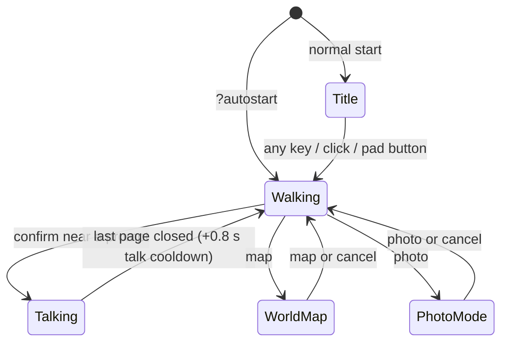

# Input and controls

> **Purpose.** The normative specification of every input the game and the editor react to: the
> engine's named input actions and their default keyboard and gamepad bindings, what the game does
> with each action in each situation (title, walking, talking, world map, photo mode), the editor's
> keyboard shortcuts and the order in which keys are dispatched, and the focus rules that keep
> keys from being stolen while the user types.
>
> **Audience.** Game and editor developers changing controls, testers and AI agents scripting input
> (see also [AUTOMATION_API.md](AUTOMATION_API.md)), and anyone documenting controls.
>
> **Source of truth.** [`src/engine/core/Input.js`](../../src/engine/core/Input.js)
> (`DEFAULT_BINDINGS`, `DEFAULT_PAD_BINDINGS`, `GAMEPAD_BUTTON_CODES`, focus handling),
> [`src/engine/core/CameraRig.js`](../../src/engine/core/CameraRig.js) (camera input),
> [`src/demo/Game.js`](../../src/demo/Game.js) (`update`, `CONTROLS`, `toggleMap`,
> `togglePhotoMode`, `_armAudioUnlock`), [`src/demo/Player.js`](../../src/demo/Player.js),
> [`src/engine/ui/DialogBox.js`](../../src/engine/ui/DialogBox.js),
> [`src/engine/ui/TitleScreen.js`](../../src/engine/ui/TitleScreen.js),
> [`src/demo/Weather.js`](../../src/demo/Weather.js) (time presets, weather cycle),
> [`src/editor/EditorApp.js`](../../src/editor/EditorApp.js) (`_buildCommands`, `_onKeyDown`,
> `_shortcutGroups`), [`src/editor/tools/`](../../src/editor/tools/) (tool keys),
> [`src/editor/viewport3d/Viewport3D.js`](../../src/editor/viewport3d/Viewport3D.js) and
> [`src/editor/map2d/Map2DView.js`](../../src/editor/map2d/Map2DView.js) (view keys). The binding
> contract for `Input` is [ARCHITECTURE.md §4.1](../../ARCHITECTURE.md); where docs disagree, the
> code wins.
>
> **Related.** [../user/PLAYING_THE_GAME.md](../user/PLAYING_THE_GAME.md) (the controls for
> players) · [../user/LEVEL_EDITOR_GUIDE.md](../user/LEVEL_EDITOR_GUIDE.md) (editor workflows and
> mouse gestures) · [../user/shortcuts.html](../user/shortcuts.html) (printable shortcut sheet) ·
> [../architecture/modules/core.md](../architecture/modules/core.md) (the `Input` and `CameraRig`
> API) · [AUTOMATION_API.md](AUTOMATION_API.md) (driving input from scripts)

---

## Contents

1. [The input model](#1-the-input-model)
2. [Actions and default bindings](#2-actions-and-default-bindings)
3. [Gamepad](#3-gamepad)
4. [What the game does with each action](#4-what-the-game-does-with-each-action)
5. [Game focus and browser rules](#5-game-focus-and-browser-rules)
6. [Rebinding](#6-rebinding)
7. [Editor keyboard shortcuts](#7-editor-keyboard-shortcuts)
8. [Editor key dispatch and focus rules](#8-editor-key-dispatch-and-focus-rules)
9. [Combat levels](#9-combat-levels)

---

## 1. The input model

`Input` ([`Input.js`](../../src/engine/core/Input.js)) is owned by the `Engine` (`engine.input`)
and listens on `window` by default.

- **Keys are `KeyboardEvent.code` values** (layout independent: `KeyW` is the key in the W
  position on any keyboard layout, `Backquote` is the key left of `1`).
- **Gamepad buttons** of the standard mapping appear as virtual codes (`GamepadA` …), so they work
  with the same queries as keys.
- **Actions** are names bound to lists of codes: `bindings` (keyboard) and `padBindings`
  (gamepad). Game code asks for actions, never for keys.
- **Edges accumulate between frames.** `wasPressed` / `actionPressed` see a key tapped between two
  frames on the next frame; `endFrame()` (called by the Engine after rendering) clears the edges
  and the wheel accumulator. Key auto-repeat does not create new pressed edges.
- `consumeAction(name)` swallows an action's pressed edge for the rest of the frame (the dialog
  box does this with `confirm`, so one press never both advances a line and starts a new talk).

| Query | Meaning |
| --- | --- |
| `isDown(code)`, `wasPressed(code)`, `wasReleased(code)` | Raw key or virtual pad button state / edges. |
| `action(name)`, `actionPressed(name)`, `actionReleased(name)` | Any bound key or pad button held / pressed / released. |
| `anyPressed()` | Any key or pad button pressed since the last frame. |
| `getMoveVector()` | `{x, y}`, length ≤ 1, `y > 0` = screen up: `up`/`down`/`left`/`right` actions (diagonals normalised) plus the left stick. |
| `getLookVector()` | Right stick `{x, y}` (deadzoned, `y > 0` = up). |
| `wheelDelta` | Mouse-wheel `deltaY` accumulated this frame (line / page modes converted to pixels: ×16 / ×400). |
| `pointer` | `{ x, y, down, buttons, inside }` in CSS pixels. |
| `enabled` | `false` makes every query return false / zero (including `wheelDelta`). |

## 2. Actions and default bindings

`DEFAULT_BINDINGS` and `DEFAULT_PAD_BINDINGS` (frozen; each `Input` gets editable copies):

| Action | Keyboard (`bindings`) | Gamepad (`padBindings`) | Game meaning |
| --- | --- | --- | --- |
| `up` | `KeyW`, `ArrowUp` | `GamepadDpadUp` (+ left stick) | Move (camera-relative); dialog choice up |
| `down` | `KeyS`, `ArrowDown` | `GamepadDpadDown` (+ left stick) | Move; dialog choice down |
| `left` | `KeyA`, `ArrowLeft` | `GamepadDpadLeft` (+ left stick) | Move |
| `right` | `KeyD`, `ArrowRight` | `GamepadDpadRight` (+ left stick) | Move |
| `run` | `ShiftLeft`, `ShiftRight` | `GamepadRT` | Run while held |
| `confirm` | `Space`, `Enter`, `KeyF` | `GamepadA` | Talk / examine; advance or complete dialog; pick a choice |
| `cancel` | `Escape`, `Backspace` | `GamepadB` | Close the world map; leave photo mode; complete the typing line |
| `camLeft` | `KeyQ` | `GamepadLB` | Rotate the camera (hold) |
| `camRight` | `KeyE` | `GamepadRB` | Rotate the camera (hold) |
| `zoomIn` | `KeyZ`, `Equal` | `GamepadY` | Zoom in (hold) |
| `zoomOut` | `KeyX`, `Minus` | `GamepadX` | Zoom out (hold) |
| `debug` | `Backquote`, `F1` | — | Toggle the debug panel |
| `time` | `KeyT` | — | Next time-of-day preset |
| `photo` | `KeyP` | `GamepadRS` (right stick click) | Toggle photo mode |
| `help` | `KeyH` | `GamepadStart` | Toggle the controls legend |
| `weather` | `KeyR` | — | Next weather |
| `music` | `KeyM` | — | Music on / off |
| `map` | `KeyN`, `Tab` | `GamepadBack` | Open / close the world map |

Also bound outside the action table: the **mouse wheel** zooms the camera; **clicking** the dialog
window acts as confirm, and hovering / clicking a choice selects it; the **right stick's x axis**
rotates the camera. On **combat levels only** mouse buttons on the canvas, more keys and a
different pad layout are added at runtime — see [§9](#9-combat-levels).

## 3. Gamepad

- Polling starts once a `gamepadconnected` event has been seen; the first connected pad is used.
- Button index → virtual code (`GAMEPAD_BUTTON_CODES`, W3C standard mapping):

  | Index | Code | Index | Code | Index | Code |
  | --- | --- | --- | --- | --- | --- |
  | 0 | `GamepadA` | 6 | `GamepadLT` | 12 | `GamepadDpadUp` |
  | 1 | `GamepadB` | 7 | `GamepadRT` | 13 | `GamepadDpadDown` |
  | 2 | `GamepadX` | 8 | `GamepadBack` | 14 | `GamepadDpadLeft` |
  | 3 | `GamepadY` | 9 | `GamepadStart` | 15 | `GamepadDpadRight` |
  | 4 | `GamepadLB` | 10 | `GamepadLS` | 16 | `GamepadHome` |
  | 5 | `GamepadRB` | 11 | `GamepadRS` | | |

- Triggers (6, 7) count as pressed above `triggerThreshold` = 0.35; their analog values are in
  `input.gamepad.leftTrigger` / `rightTrigger`. `GamepadLT`, `GamepadLS` and `GamepadHome` are
  unbound by default.
- Sticks use a radial deadzone of `deadzone` = 0.2, rescaled so movement starts at 0 just past the
  deadzone. Stick y is flipped so `+y` = up. The left stick adds to the move vector; the right
  stick's x rotates the camera (its y is unused on peaceful levels; combat levels zoom with it,
  [§9](#9-combat-levels)).
- With a non-standard mapping only buttons 0–11 are read (the d-pad indices are meaningless there).
- The title screen polls every pad itself: any newly pressed button dismisses it.

## 4. What the game does with each action

`Game.update` ([`Game.js`](../../src/demo/Game.js)) reads the actions every frame. Its behaviour
depends on the mode (`loading` → `title` → `play`) and on what is open.



| Action | Title screen | Walking | Talking (dialog open) | World map open | Photo mode |
| --- | --- | --- | --- | --- | --- |
| move (`up`/`down`/`left`/`right`, stick) | — | walk 3.2 u/s, camera-relative | choice cursor (`up` / `down`) | frozen | walk |
| `run` | — | run 5.6 u/s | — | — | run |
| `confirm` | dismisses (any key does) | talk / examine the prompted target | complete the line, then next page; pick the choice | — | — (no prompts in photo mode) |
| `cancel` | dismisses (any key does) | — | complete the typing line (does not close) | close the map | leave photo mode |
| `camLeft` / `camRight`, right stick x | — | rotate 70°/s (±60° round north; tighter near the east / west map edges) | — | — | rotate |
| `zoomIn` / `zoomOut`, wheel | — | zoom (14 u/s; wheel 0.012 u per px) within 18–42 | — | — | zoom |
| `map` (N / Tab / Back) | — | open the world map | — | close the map | — (blocked) |
| `photo` (P / RS) | — | enter photo mode | — (blocked) | — (blocked) | leave photo mode |
| `time` (T) | — | next preset (2 s glide) | — | — | next preset |
| `weather` (R) | — | next weather | — | — | next weather |
| `music` (M) | — | music on / off | — | — | music on / off |
| `help` (H / Start) | — | toggle the controls legend | toggle | — | toggle (UI hidden) |
| `debug` (\` / F1) | — | toggle the debug panel | toggle | toggle | toggle |

Details:

- **Title screen** ([`TitleScreen.js`](../../src/engine/ui/TitleScreen.js)): accepts input
  0.45 s after it appears. Any key dismisses it except Shift, Ctrl, Alt, Meta, CapsLock, Tab, F5,
  F11 and F12; so does a click on it or any gamepad button. The dismissing key is stopped before it
  reaches gameplay input. Dismissing unlocks audio and (unless `environment.music` is `false`)
  starts the music.
- **`?autostart`** skips the title. Audio is then unlocked by the first key press or click, which
  also starts the level's music — unless that first key is bound to `music` (M), which toggles it
  on in the same frame instead.
- **Talking** ([`DialogBox.js`](../../src/engine/ui/DialogBox.js)): text types at 55 characters
  per second. For 0.15 s after the window opens `confirm` is ignored (`inputGuard`, so the talk
  press does not skip the first line). `confirm` (or a click on the window) completes a typing
  line, then advances; on a
  choice page `up` / `down` move the gold cursor (the first choice is preselected; input is ignored
  for 0.25 s after the choices appear, `choiceGuard`) and `confirm` picks. `cancel` only completes
  a typing line. The player is frozen and the camera input is off
  until the dialog closes; afterwards `confirm` is ignored for 0.8 s (`TALK_COOLDOWN`).
- **Interaction prompt**: shown for the best target within reach (NPCs within their talk radius,
  doors 1.0, signs 1.35, wells 1.75; at most 1.3 units above or below, roughly in front — for a
  door, facing its leaf also counts, so the prompt stays when the player walks up to the wall). `confirm`
  starts it (the key hint reads "Space").
- **World map** (`toggleMap`): opens only while playing, not while talking, not in photo mode. The
  player stands still while it is open; the clock and the villagers carry on. Open / close play
  UI sounds.
- **Photo mode** (`togglePhotoMode`): not while talking, not with the map open. From the keyboard a
  toast "Photo mode · P or Esc to return" shows first and the UI hides 1.2 s later; the automation
  hook hides it at once. `help` still toggles the legend, but the whole UI is hidden.
- **Time presets** (`TIME_PRESETS` in [`Weather.js`](../../src/demo/Weather.js)): Dawn 6.5 →
  Midday 12.5 → Golden Hour 17.2 → Dusk 18.9 → Night 22.5 → Dawn…; `T` glides forward to the next
  preset after the current hour over 2 s and shows its name.
- **Weather**: `R` cycles clear → rain → snow → clear (blended over a few seconds) with a toast
  ("Clear skies", "Rain", "Snowfall").
- **Music**: `M` toggles and toasts "♪ Music on" / "Music off".
- **Debug panel**: a lil-gui panel with Time & Weather, Post FX, Lighting, Camera, Atmosphere and
  Render folders ([`DebugControls.js`](../../src/demo/DebugControls.js)).
- The on-screen controls legend lists: WASD Move, Shift Run, Space Talk / Examine, Q/E Rotate
  camera, Z/X Zoom (or wheel), N/Tab World map, T Time of day, R Weather, P Photo mode, M Music,
  \` Debug panel (`CONTROLS` in `Game.js`); H hides it.

## 5. Game focus and browser rules

- **Never while typing.** A `keydown` whose target — or the focused element — is a text-accepting
  element (`<textarea>`, `<select>`, a content-editable element, or an `<input>` other than button,
  checkbox, radio, submit, reset, image, color, file, range) is ignored entirely (typing into the
  debug panel's fields never moves the player). `keyup` always releases a held key.
- **Browser defaults.** For keys bound to any action, `preventDefault()` is called (no page
  scrolling on Space / arrows, no F1 help, no focus move on Tab) — unless Ctrl, Meta or Alt is
  held, so browser shortcuts keep working.
- **Wheel.** Wheel events over lil-gui panels, form fields, `[contenteditable]` and
  `[data-input-ignore]` elements are ignored (`wheelIgnoreSelector`).
- **Losing focus.** Window blur or the tab becoming hidden releases every held key (with release
  edges), so no key sticks.
- The canvas has `tabIndex = -1`: it is not in the Tab order (it can still be focused by a click
  or from script). Focus does not matter for the game, because `Input` listens on `window`.

## 6. Rebinding

`input.bindings` and `input.padBindings` are plain editable objects; changes apply immediately
(the set of keys to `preventDefault` is rebuilt when bindings change). `input.addBindings(keyboard,
pad)` replaces whole action lists in one call and may add new action names (combat levels use it,
[§9](#9-combat-levels)). There is no in-game rebinding UI. From code or a page console:

```js
const input = window.__game.engine.input;
input.bindings.map = ['KeyN', 'KeyJ'];   // add J for the world map (Tab removed)
input.bindings.photo = ['KeyP', 'F2'];
input.padBindings.map = ['GamepadBack', 'GamepadLS'];
```

The game only asks for action names, so rebinding needs no other change. (The autostart audio
unlock reads `bindings.music` to know which key toggles the music.) Do not rename actions: they
are part of the engine contract.

## 7. Editor keyboard shortcuts

The editor ([`EditorApp.js`](../../src/editor/EditorApp.js)) uses `KeyboardEvent.key` combos
(`Ctrl` also matches ⌘ on macOS). Mouse gestures (painting, box selection, handles, orbit / pan /
zoom) are described in [../user/LEVEL_EDITOR_GUIDE.md](../user/LEVEL_EDITOR_GUIDE.md); Help ›
Keyboard shortcuts (`?`) shows the same list in the app.

### 7.1 Commands

| Keys | Command | Id |
| --- | --- | --- |
| Ctrl+N, Alt+N | New level… (Chrome reserves Ctrl+N in normal tabs: use Alt+N or File › New) | `file.new` |
| Ctrl+O | Open… | `file.open` |
| Ctrl+S | Save (to where the level came from; Save as when it was never saved) | `file.save` |
| Ctrl+Shift+S | Save as… | `file.saveAs` |
| Ctrl+E | Download .json (a copy; the save location does not change) | `file.export` |
| F5 | Play-test | `file.playtest` / `level.playtest` |
| Ctrl+Z | Undo (one stroke or drag = one step) | `edit.undo` |
| Ctrl+Y, Ctrl+Shift+Z | Redo | `edit.redo` / `edit.redo2` |
| Ctrl+X / Ctrl+C / Ctrl+V | Cut / copy / paste objects (paste lands at the pointer when it is over a view) | `edit.cut` / `edit.copy` / `edit.paste` |
| Ctrl+D | Duplicate the selection | `edit.duplicate` |
| Delete, Backspace | Delete the selection | `edit.delete` |
| Ctrl+R / Ctrl+Shift+R | Rotate the selection +90° / −90° | `edit.rotateCcw` / `edit.rotateCw` |
| Ctrl+A | Select all objects (of the visible types) | `edit.selectAll` |
| Escape | Deselect (tools use Esc first to cancel a gesture) | `edit.deselect` |
| 1 / 2 / 3 | Layout: 3D + 2D map / 3D only / 2D map only | `view.split` / `view.3d` / `view.2d` |
| F | Frame the selection | `view.frameSelection` |
| Home | Frame the whole level | `view.frameLevel` |
| Ctrl+G | Toggle the grid | `view.grid` |
| ] / [ | Bigger / smaller brush (1–9) | `view.brushBigger` / `view.brushSmaller` |
| ? (Shift+/) | Keyboard shortcut list | `help.shortcuts` |

Menu-only commands (no key): Open file from disk (`file.openFile`), Level settings
(`level.settings`), Resize level (`level.resize`), Check for problems (`level.validate`), Open saved
level in the game (`level.openInGame`, only for a project-folder level), the View toggles
(`view.textured2d`, `view.objects`, `view.markers`, `view.showAll` "Show all hidden types",
`view.gameCamera`, `view.postfx`, `view.atmosphere`), Open the Emberfall demo (`help.game`), About
(`help.about`). Scripts can run any
command with `window.__editor.app.run('<id>')` ([AUTOMATION_API.md](AUTOMATION_API.md)).

### 7.2 Tools

| Key | Tool | Tool-specific keys |
| --- | --- | --- |
| V | Select / Move | R / Shift+R rotate the selection ±15° (Ctrl: ±90°); arrows nudge 0.5 (Shift 2, Alt 0.1); Delete / Backspace delete; Ctrl+D duplicate; Esc cancels a move or handle drag (restores), else ends a box, else deselects |
| B | Paint tiles | Shift+click: straight line from the last stroke; Alt+click: pick the tile and level under the pointer |
| G | Fill | Shift+click: replace that tile everywhere on the map (not only the connected area); Alt+click: pick |
| U | Rectangle | Shift: toggles "Outline only" for this drag; Esc cancels the rectangle being dragged; Alt+click: pick |
| H | Height (raise / lower / set / flatten / smooth) | Shift inverts raise / lower; Alt+click: pick the level under the pointer |
| T | Stairs | — (click or drag on a ledge; drag from the foot to the top of a cliff for a whole flight) |
| O | Place object | R / Shift+R rotate the ghost ±15° (Ctrl: ±90°; remembered per object type; a non-rotatable type only shows a notice); Esc cancels a line or rect in progress; Alt: no snapping |
| P | Player start | R / Shift+R cycle the start's facing (down → left → right → up; Shift goes backwards); Alt: no snapping |
| I | Eyedropper | Click a tile: picks its tile and level, then returns to the previous terrain tool (Paint, Fill, Rectangle or Height; otherwise Paint). Click an object: picks its type and switches to Place. Shift: stay in the eyedropper |
| X | Erase objects | — (click an object, or drag across several) |

With a tool other than Select active, arrow keys still nudge the selection (0.5, Shift 2).

### 7.3 View keys

| Keys | Where | Effect |
| --- | --- | --- |
| Space + left drag | 2D map and 3D view (pointer over the view) | Pan |
| Right button held + W A S D | 3D view | Fly (Shift: 2.5× faster) |
| Right button held + Q / E | 3D view | Turn |
| Q / E | 3D view in gameplay-camera mode (View › 3D: gameplay camera), pointer over the view | Rotate like the game camera |
| F | anywhere (the `view.frameSelection` command) | Frame the selection in both views (the 3D view only frames it itself when no other handler took the key) |

## 8. Editor key dispatch and focus rules

`EditorApp._onKeyDown` (listening on `window`) handles a key in this order:

1. Ignored if another handler already prevented it, during IME composition, while a dialog is open
   (dialogs own the keyboard: Enter commits the focused field first, then confirms) or while a menu
   is open.
2. **Typing** (focus in a text input, textarea, select or content-editable): only **Ctrl+S**,
   **Ctrl+Shift+S** and **F5** work; the field is blurred (committing its value) first. Every other
   key belongs to the field.
3. A focused **slider** keeps its arrows, Home, End and Page keys.
4. **Mid-gesture** (a transaction is open: a stroke, a drag, an inspector slider): only the active
   tool's keys and **Esc** work. Esc cancels the gesture and restores the level as it was.
   Commands are not run, so they cannot fold into the stroke's undo step.
5. Ctrl+C / Ctrl+X / Ctrl+V go through the browser's copy / cut / paste events (the clipboard
   carries `{ "format": "lumina-objects", "objects": [...] }` as text; pasting a whole
   `lumina-level` JSON replaces the document after asking about unsaved changes).
6. **Ctrl combos and F-keys** run their command first — except Ctrl+D, Ctrl+R and Ctrl+Shift+R,
   which the active tool may handle first (the Place tool rotates its ghost by 90°).
7. The **active tool's** `keyDown` (Esc, R, Delete, arrows…).
8. Any other **command** shortcut.
9. A **tool letter** (V, B, G, U, H, T, O, P, I, X) switches tools; **arrows** nudge the selection.

The 3D view and the 2D map listen on `window` in the capture phase for their own keys: while the
right button is held in the 3D view, W A S D Q E and Shift fly the camera and never reach the
tools; Space over a view arms panning and does not scroll the page or press a focused button.
Controls outside dialogs hand the keyboard back after a mouse edit (dropdowns after a pick,
sliders, switches, toolbar buttons), so tool keys, arrows and Space+drag keep reaching the views.

## 9. Combat levels

Levels with combat ([COMBAT.md §3](../contracts/COMBAT.md#3-enabling-combat-per-level): an
`enemy` object, or `environment.combat: true`) register extra bindings at load with
`input.addBindings(COMBAT_BINDINGS, COMBAT_PAD_BINDINGS)`, report mouse buttons with
`input.enableMouseButtons(canvas)` and set `rig.stickZoom = 14`
([`src/demo/combat/bindings.js`](../../src/demo/combat/bindings.js), combat-core;
engine side in [core.md §3.6](../architecture/modules/core.md#36-runtime-bindings-and-mouse-buttons-combat-levels-opt-in)).
**Peaceful levels never do any of this:** there J, K, L, U, I, O, C, 1–4 and mouse clicks do
nothing and are not `preventDefault`ed, pad X / Y keep zooming and RS keeps taking photos.

### 9.1 Combat actions

| Action | Keyboard | Mouse (on the canvas) | Gamepad |
| --- | --- | --- | --- |
| `attack` (3-hit combo) | J | left button (`Mouse0`) | X |
| `dodge` (roll) | K | right button (`Mouse2`) | B |
| `skill1` / `skill2` / `skill3` | U / I / O, and 1 / 2 / 3 | — | hold LT (`skillMod`) + X / Y / B |
| `draught` (Healing Draught) | C, and 4 | — | Y |
| `lock` (tap: lock / next target; hold 0.35 s: release) | L | middle button (`Mouse1`) | RS click |
| confirm (talk / read / rest / open) | Space / Enter / F (unchanged) | — | A (unchanged) |
| run | Shift (unchanged) | — | RT (unchanged) |
| photo | P (unchanged) | — | LS click (`photoPad`, guarded, §9.2) |
| zoom | Z / X / = / − and the wheel (unchanged) | wheel | right stick Y (`stickZoom`) |

- While LT (`skillMod`) is held, pad X / Y / B give `skill1` / `skill2` / `skill3` instead of
  `attack` / `draught` / `dodge`. Keyboard and mouse ignore LT.
- Several action edges in one combat sub-step resolve as `dodge` > `skill*` > `attack` >
  `draught`; `lock` is independent. A pressed action is buffered for 10 frames and fires as soon
  as the current action's cancel window allows it.
- Mouse buttons count only when pressed **on the canvas**: clicks on the dialog, choices, title,
  lil-gui panels or the death screen never attack. Releases count anywhere, and losing window
  focus releases every button. The context menu and middle-button autoscroll are suppressed on
  the canvas only. A mouse-triggered attack, skill or dodge aims at the point where the camera ray
  through the pointer meets the plane `y = player.y + 0.8`.

### 9.2 What moves on the gamepad (combat levels only)

| Binding | Peaceful levels (unchanged) | Combat levels |
| --- | --- | --- |
| pad X / Y | `zoomOut` / `zoomIn` | `attack` / `draught` |
| pad zoom | X / Y | right stick Y (`rig.stickZoom = 14` u/s, stick up zooms in) |
| pad RS click | photo | `lock` |
| pad LS click | — | photo (`photoPad`) |
| pad B | `cancel` | `cancel` **and** `dodge` (`cancel` is only read while the map, photo mode or a dialog is up, when combat is paused; the resume guard below covers the closing press) |

Keyboard bindings are only added (J K L U I O C 1–4 were unbound); nothing moves on the keyboard.

- **LS-click photo guard:** `photoPad` toggles photo mode only while the move vector is ≤ 0.35
  **and** it has not been deflected beyond 0.35 in the last 0.3 s, so a runner clicking the
  stick by accident does not open photo mode. (The keyboard P and the `photo` action are not
  guarded.)
- **Resume guard:** when combat becomes active again (the map, a dialog or photo mode closed),
  combat drops every combat action edge of that frame and ignores an action whose binding is
  still held until it is released — the B press that closed the map does not also roll.
  After a respawn, combat action edges are ignored for 0.25 s.
- Photo mode is refused while foes are engaged ("Not while foes are near") and freezes the player
  on combat levels.

### 9.3 Device-aware controls legend

On combat levels the HUD legend follows `input.lastDevice` (the device of the latest pressed
edge: `'keyboard'`, `'mouse'` or `'gamepad'`). When it changes between the gamepad and
keyboard / mouse, combat calls `ui.hud.setControls(COMBAT_PAD_CONTROLS | COMBAT_CONTROLS)` and
`ui.combat.hud.setDevice('gamepad' | 'keyboard')` (the skill-slot keycaps swap). The first gamepad
edge of the session also shows the one-time toast
"Pad: X attack · B roll · LT+X/Y/B skills · Y draught · RS lock · right stick zoom · LS click photo".
Peaceful levels keep the single legend of §4.

| Keyboard / mouse legend (`COMBAT_CONTROLS`) | | Gamepad legend (`COMBAT_PAD_CONTROLS`) | |
| --- | --- | --- | --- |
| WASD | Move | LS | Move |
| Shift | Run | RT | Run |
| J / LMB | Attack (combo) | X | Attack (combo) |
| K / RMB | Dodge roll | B | Dodge roll |
| U/I/O | Skills (or 1-3) | LT+X/Y/B | Skills |
| C | Healing Draught | Y | Healing Draught |
| L / MMB | Lock on / next | RS | Lock on / next |
| Space | Talk / Rest / Open | A | Talk / Rest / Open |
| Q/E | Rotate camera | LB/RB | Rotate camera |
| Z/X | Zoom (or wheel) | R-Stick | Zoom |
| N/Tab | World map | Back | World map |
| T/R/P/M | Time / Weather / Photo / Music | LS-Click | Photo |

(The legend's key labels come from `HUD`'s `KEY_LABELS`: `Mouse0` → LMB, `Mouse1` → MMB,
`Mouse2` → RMB.)
