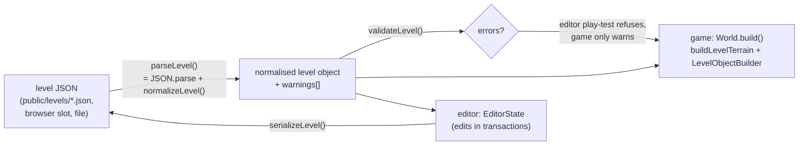

# Level format — `lumina-level` v1

> **Purpose.** The normative, field-by-field specification of a Lumina level file: the JSON
> document that describes a whole playable diorama (terrain, water, environment, player start,
> every placed object). It says what each field means, its type, its default when missing, its
> constraints, how files are normalised, validated and written back byte-for-byte, and how the
> format stays forward-compatible. It ends with a complete small level that plays.
>
> **Audience.** Level designers who hand-edit or generate level JSON, tool authors (generators,
> converters), engine and editor developers, and AI agents that read or write levels.
>
> **Source of truth.** [`src/engine/level/LevelFormat.js`](../../src/engine/level/LevelFormat.js)
> (format, defaults, `normalizeLevel`, `validateLevel`, `serializeLevel`),
> [`src/engine/level/ObjectCatalog.js`](../../src/engine/level/ObjectCatalog.js) (object shapes,
> `normalizeObject`), [`src/engine/world/TileMap.js`](../../src/engine/world/TileMap.js) (how the
> legend, heights, stairs and water surfaces are interpreted),
> [`src/engine/world/Water.js`](../../src/engine/world/Water.js),
> [`src/demo/Game.js`](../../src/demo/Game.js), [`src/demo/World.js`](../../src/demo/World.js),
> [`src/demo/Scenery.js`](../../src/demo/Scenery.js),
> [`src/demo/GroundDetail.js`](../../src/demo/GroundDetail.js) and
> [`src/demo/Weather.js`](../../src/demo/Weather.js) (how the game uses the optional fields).
> The **binding contract** is [contracts/LEVEL_EDITOR.md §1–§5](../contracts/LEVEL_EDITOR.md);
> this page is its readable, code-verified expansion. Where the two disagree, the code wins. The
> same document is declared as types in [`src/engine/level/types.d.ts`](../../src/engine/level/types.d.ts),
> which the code is type-checked against ([§1](#1-overview)).
>
> **Related.** [OBJECT_CATALOG.md](OBJECT_CATALOG.md) (every object type and field) ·
> [LEVEL_STORAGE_API.md](LEVEL_STORAGE_API.md) (where level files live, how they are saved) ·
> [../architecture/modules/level.md](../architecture/modules/level.md) (the level module API) ·
> [../design/LEVEL_DESIGN_GUIDE.md](../design/LEVEL_DESIGN_GUIDE.md) (how to design a good level) ·
> [../user/LEVEL_EDITOR_GUIDE.md](../user/LEVEL_EDITOR_GUIDE.md) (making levels in the editor) ·
> [../design/levels/](../design/levels/) (the shipped levels)

---

## Contents

1. [Overview](#1-overview)
2. [Coordinates and units](#2-coordinates-and-units)
3. [Top-level fields](#3-top-level-fields)
4. [Terrain: legend, tiles, heights](#4-terrain-legend-tiles-heights)
5. [Built-in tile types (`TILE_TYPES`)](#5-built-in-tile-types-tile_types)
6. [Heights and walkability](#6-heights-and-walkability)
7. [Stairs](#7-stairs)
8. [Water](#8-water)
9. [Environment](#9-environment)
10. [Spawn (player start)](#10-spawn-player-start)
11. [Objects](#11-objects)
12. [Normalisation (loading)](#12-normalisation-loading)
13. [Validation](#13-validation)
14. [Serialisation (byte-stable writing)](#14-serialisation-byte-stable-writing)
15. [Versioning and forward compatibility](#15-versioning-and-forward-compatibility)
16. [Custom legend characters](#16-custom-legend-characters)
17. [Resizing and shifting](#17-resizing-and-shifting)
18. [A complete example level](#18-a-complete-example-level)
19. [Checklist for hand-written and generated levels](#19-checklist-for-hand-written-and-generated-levels)

---

## 1. Overview

A level is **plain JSON data**. Nothing in a level file is code. The editor edits the data, the
storage layer saves and loads it, and the game builds a 3D world from it. The terrain rows are
strings with one character per tile, so files stay small and diffs stay readable. Every loader
runs the same normaliser, so a hand-edited, partial or older file opens the same way everywhere.



| Constant | Value | Where |
| --- | --- | --- |
| `LEVEL_FORMAT` | `"lumina-level"` | `LevelFormat.js` |
| `LEVEL_VERSION` | `1` | `LevelFormat.js` |
| `MIN_SIZE` / `MAX_SIZE` | `8` / `128` tiles per side | `LevelFormat.js` |
| `MAX_LEVEL` | `35` (highest terrain level a height char can hold) | `LevelFormat.js` |
| `LEVEL_HEIGHT` | `0.5` world units per terrain level | [`src/engine/constants.js`](../../src/engine/constants.js) |
| `PPU` | `16` pixel-art texels per world unit (1 tile = 1 unit) | `constants.js` |

**Types.** [`src/engine/level/types.d.ts`](../../src/engine/level/types.d.ts) declares this format
for the type check (`npm run typecheck`): `Level` (the normalised document), `LevelEnvironment` and
its parts, `LevelWater`, `LevelSpawn`, `TileDef` (a legend entry), `ObjectType` and `LevelObject` — a
union discriminated on `type`, derived from `OBJECT_TYPES`, so each catalog type's position fields
and defaults are typed from the catalog itself; the optional fields without a default are listed
in `ObjectExtras`. Narrow on `type` (`if (o.type === 'npc')`) for one type's exact fields. The
types describe what `normalizeLevel` returns, and where this page and the code differ they follow
the code. JavaScript that reads or writes levels imports them with
`/** @import { Level, LevelObject } from '<path>/src/engine/level/types.js' */`; the generators do.

## 2. Coordinates and units

- **Y is up.** One tile is one world unit wide and deep.
- Tile `(i, j)` covers `x ∈ [i, i+1]`, `z ∈ [j, j+1]`. `i` is the column (character index in a
  row string), `j` is the row (index in the `tiles` / `heights` arrays).
- **Rows run toward +Z.** Row 0 is the north edge of the map. The game camera looks north
  (yaw 0 sits on +Z looking toward −Z), so row 0 is the far edge of the screen and the last
  row is nearest to the camera. "North" = −Z, "south" = +Z, "east" = +X, "west" = −X.
- The centre of tile `(i, j)` is `(i + 0.5, j + 0.5)`. Objects and the spawn use continuous world
  coordinates, not tile indices.
- World height of a terrain level: `y = level × 0.5` (`levelToWorld(level)`).
- Rotations (`rotation` on objects) are **radians about +Y**. Rotation `0` means the object's
  front faces +Z (toward the default camera). Positive angles turn the front toward +X:
  `rotation = π/2` faces east, `−π/2` faces west, `π` faces north.

## 3. Top-level fields

All fields are optional when **reading** (the normaliser fills them in). `serializeLevel` always
writes every field below, in this order: `format`, `version`, `name`, `subtitle`, `author`,
`description`, `width`, `depth`, `waterLevel`, `water`, `environment`, `spawn`, `legend`, `tiles`,
`heights`, `objects`, then any unknown fields (see [§15](#15-versioning-and-forward-compatibility)).

| Field | Type | Default when missing | Constraints and meaning |
| --- | --- | --- | --- |
| `format` | string | `"lumina-level"` | Must be `"lumina-level"` if present; any other value throws `Unknown level format "<value>"`. A file with **no** `format` is accepted only if it has a `tiles` or `heights` array. |
| `version` | integer | `1` | Always written as `1`. A value above `1` loads with a warning ([§15](#15-versioning-and-forward-compatibility)). |
| `name` | string | `"Untitled"` | Display name: title screen (upper-cased), arrival banner, HUD location fallback, world-map title. The game renames a blank name to `"Untitled"` ([`src/main.js`](../../src/main.js) `boot`). |
| `subtitle` | string | `""` | Shown under the name on the title screen and banner, and as the HUD sub-line outside any region. |
| `author` | string | `""` | Informational only. |
| `description` | string | `""` | Informational only (the editor's Level settings shows it). |
| `width` | integer | longest `tiles` row | Number of columns. Clamped to `8…128` (`Math.round`). |
| `depth` | integer | number of `tiles` rows | Number of rows. Clamped to `8…128`. |
| `waterLevel` | number | `0.35` (new levels: `0.4`) | Global water surface height in world units ([§8](#8-water)). |
| `water` | object | `{ "flow": [0, 0.45], "reflect": 0.2, "neutral": 0.2 }` | Water look ([§8](#8-water)). |
| `environment` | object | `DEFAULT_ENVIRONMENT` | Time, weather, camera, scenery and presentation options ([§9](#9-environment)). |
| `spawn` | object | `{ x: width/2, z: depth/2, facing: "down" }` | Player start ([§10](#10-spawn-player-start)). |
| `legend` | object | the built-in legend | Map character → tile definition ([§4](#4-terrain-legend-tiles-heights)). The file's entries are merged **over** the built-in legend. |
| `tiles` | string[] | rows of `g` | One string per row, one character per tile ([§4](#4-terrain-legend-tiles-heights)). |
| `heights` | string[] | rows of `0` | One string per row, one height character per tile ([§6](#6-heights-and-walkability)). |
| `objects` | object[] | `[]` | Every placed object ([§11](#11-objects), [OBJECT_CATALOG.md](OBJECT_CATALOG.md)). |

> New levels made by `createEmptyLevel({ name, width = 32, depth = 24, fill = 'g', level = 2, border = 2 })`
> get `waterLevel: 0.4`, the full default legend, a `border`-tile-wide ring of `T` (blocked
> forest) and the spawn at the centre tile (`floor(width/2) + 0.5`, `floor(depth/2) + 0.5`).

## 4. Terrain: legend, tiles, heights

### 4.1 `tiles` and `heights`

- `tiles[j]` is a string of exactly `width` characters; character `i` is the legend key of tile
  `(i, j)`. There are exactly `depth` rows.
- `heights[j]` is a string of exactly `width` height characters ([§6](#6-heights-and-walkability)).
- A tile character must be a key of the (merged) `legend`. Unknown characters are replaced with
  `g` (grass) on load, with one warning per occurrence (a row of 40 unknown characters gives 40
  warnings).
- Rows are plain strings, so a level can be read like a map. The file writes one row per line.

### 4.2 Legend entries

`legend` maps a **single character** to a tile definition. (A key of any other length — `"ab"`,
`"constructor"` — is kept in the file, but no tile can use it: `normalizeLevel` warns
([§12](#12-normalisation-loading)), and the editor's palette and paint tools leave it out.) The
keys of a definition are read by [`TileMap`](../../src/engine/world/TileMap.js) (`makeTile`,
`_computeWaterSurface`, the mesh builders) and by [`Water`](../../src/engine/world/Water.js):

| Key | Type | Default | Meaning |
| --- | --- | --- | --- |
| `top` | texture name | — (required for visible tiles) | Texture of the tile's top face (e.g. `grass`, `dirt_path`, `riverbed`). Texture names come from the [`TextureLibrary`](../architecture/modules/pixel.md). |
| `side` | texture name | the `lip` texture, else the `top` texture | Texture of vertical faces (cliffs, where a neighbour is lower). |
| `lip` | texture name | none | Texture of the top 1-unit band of vertical faces (e.g. `grass_side` gives grassy cliff edges). |
| `riser` | texture name | the `top` texture | Texture of stair risers. |
| `walkable` | boolean | `!water` | Can characters stand here? `false` makes a blocked tile (forest, rock). |
| `water` | boolean | `false` | Water tile: gets a water surface ([§8](#8-water)); not walkable unless `walkable: true`. |
| `flow` | number or `[x, z]` | the level's `water.flow` | Water tiles only. A number multiplies the level's default flow; `[x, z]` sets the flow in units per second; `0` is still water. |
| `waterLevel` | number | — | Water tiles only: absolute surface height (overrides everything else). |
| `waterDepth` | number | — | Water tiles only: surface = bed height + `waterDepth`. |
| `stairs` | `"N"`/`"S"`/`"E"`/`"W"` | none | Stairs tile rising toward that direction ([§7](#7-stairs)). Any other value (an `Object.prototype` name such as `"constructor"` too) is ignored: the tile is flat. |
| `void` | boolean | `false` | Empty tile: no geometry, not walkable; neighbours show cliff faces down to the diorama base. |
| `uvVariation` | boolean | `true` | `false` disables the random quarter-turn / mirror of organic top textures on this tile type. |
| `fringe` | boolean | `true` | `false` stops a grass tile from spilling grass fringes onto neighbours, or a receiving tile from receiving them. |
| `overhang` | boolean | `true` | `false` disables the grassy brim and hanging skirt along the top of this tile type's cliff faces. |

Unknown keys in a legend entry are kept and written back unchanged. An unknown texture name
(misspelt, or an `Object.prototype` name such as `"toString"`) draws the magenta-checkered
fallback texture, with one `[TextureLibrary] unknown texture "…"` warning per name.

## 5. Built-in tile types (`TILE_TYPES`)

`TILE_TYPES` in [`LevelFormat.js`](../../src/engine/level/LevelFormat.js) is the editor's tile
palette and the default legend (`defaultLegend()`). Every new level has all 22 entries; the
normaliser adds any that a file lacks. `color` is the flat colour used by 2D map views (the
editor's untextured map and, shaded by height, the in-game minimap and world map).

| Char | Name | Category | 2D colour | `top` / `side` (`lip`, `riser`) | Walkable | Water / stairs |
| --- | --- | --- | --- | --- | --- | --- |
| `g` | Grass | ground | `#5f9a3e` | `grass` / `cliff` (lip `grass_side`) | yes | |
| `G` | Dark grass | ground | `#3f7434` | `grass_dark` / `cliff` (lip `grass_side`) | yes | |
| `f` | Flower grass | ground | `#8fb14e` | `grass_flowers` / `cliff` (lip `grass_side`) | yes | |
| `F` | Farmland | ground | `#7a5433` | `farmland` / `dirt_side` | yes | |
| `s` | Sand | ground | `#d6c08b` | `sand` / `dirt_side` | yes | |
| `m` | Mossy stone | ground | `#6e7d5c` | `moss_stone` / `cliff` | yes | |
| `.` | Dirt path | path | `#b18a5c` | `dirt_path` / `dirt_side` | yes | |
| `d` | Dirt | path | `#8e6a47` | `dirt` / `dirt_side` | yes | |
| `c` | Cobblestone | path | `#8d8a8e` | `cobblestone` / `stone_wall` | yes | |
| `k` | Stone tiles | path | `#a6a39b` | `stone_tiles` / `stone_wall` | yes | |
| `b` | Wooden deck | path | `#9c6b3f` | `wood_deck` / `wood_planks_dark` | yes | |
| `~` | River | water | `#3b7fa6` | `riverbed` / `cliff` | no | water, level default flow |
| `p` | Plunge pool | water | `#2f6f99` | `riverbed` / `cliff` | no | water, `flow: 0.45` (× default) |
| `w` | Fast stream | water | `#4f93b8` | `riverbed` / `cliff` | no | water, `flow: 2.2` (× default) |
| `o` | Still pond | water | `#346b8f` | `riverbed` / `cliff` | no | water, `flow: 0` (still) |
| `^` | Stairs up north | stairs | `#b9b4ac` | `cobblestone` / `stone_wall` (riser `stone_wall`) | yes | `stairs: "N"` |
| `v` | Stairs up south | stairs | `#b9b4ac` | same | yes | `stairs: "S"` |
| `>` | Stairs up east | stairs | `#b9b4ac` | same | yes | `stairs: "E"` |
| `<` | Stairs up west | stairs | `#b9b4ac` | same | yes | `stairs: "W"` |
| `T` | Forest floor (blocked) | special | `#2b4f2a` | `grass_dark` / `cliff` (lip `grass_side`) | no | |
| `x` | Rock (blocked) | special | `#5d5a60` | `moss_stone` / `cliff` | no | |
| ` ` (space) | Void | special | `#101018` | `{ "void": true }` | no | |

Characters with behaviour beyond their legend entry (the game looks at the **character**, not
at the definition):

| Char | Extra behaviour | Code |
| --- | --- | --- |
| `T` | With `environment.border: "forest"`, `T` tiles get forest-border trees (one try per tile in rows 0–2, two elsewhere; none in the 3 southmost rows, which keep only undergrowth; from row 9 southward the third column from the east / west map edge stays open and the second gets lower trees, so the border never hides a player walking along it). Ground foliage draws dense undergrowth on `T` tiles. The 2D maps draw `T` as tree crowns. | `Scenery.scatterForest`, `GroundDetail`, `LevelMap` |
| `g` `G` `f` | Grass tufts, flowers (dense on `f`), bushes and ferns | `GroundDetail` (`GRASSY`) |
| `s` | Reeds next to water, pebbles elsewhere | `GroundDetail` |
| `F` | A few weeds between the furrows | `GroundDetail` |
| `d` `.` | Sparse tufts along path edges | `GroundDetail` |
| `m` | Shrubs and ferns | `GroundDetail` |

A custom character gets none of these extras ([§16](#16-custom-legend-characters)).

## 6. Heights and walkability

### 6.1 Height characters

| Character | Terrain level | World height `y` |
| --- | --- | --- |
| `0` … `9` | 0 … 9 | 0 … 4.5 |
| `a` … `z` | 10 … 35 | 5 … 17.5 |
| `A` … `Z` | 10 … 35 on read; rewritten to lower case by the normaliser | |
| anything else | 0 on read; rewritten to `0` | 0 |

`charToLevel(ch)` / `levelToChar(level)` convert (the latter clamps to 0…35 and rounds).
`getHeightLevel(level, i, j)` / `setHeightLevel(level, i, j, lvl)` read and write one tile.

The TileMap builds the diorama down to a base below the lowest tile, so the map reads as a
floating chunk; map edges and void tiles show cliff faces down to that base.

### 6.2 Walkability (the rules the game moves by)

A character (player radius 0.3; villagers, critters use their own radius) can stand at a point
when ([`TileMap.isWalkable`](../../src/engine/world/TileMap.js), `TileMap.move`):

1. the point is inside the map rectangle `[0, width] × [0, depth]`;
2. the point is on a **bridge deck** walk surface, or on a tile whose definition is walkable
   (`walkable ?? !water`) and not void;
3. it is outside every collider (props, villagers);
4. moving there does not change the ground height by more than **0.55** (`maxStep`). A
   difference of one terrain level (0.5) is therefore a walkable step; **two or more levels form
   a cliff** that only stairs (or a bridge) cross. Every sample round the character's circle must
   pass, so a gap narrower than the character is blocked.

`LevelFormat.isWalkablePoint(level, x, z)` is the data-only version used by validation (walkable
tile or bridge deck). It treats every water tile as unwalkable, even one whose legend says
`walkable: true` (the TileMap would let characters wade there).

## 7. Stairs

- A stairs tile (`stairs: "N" | "S" | "E" | "W"`) at terrain level **L** rises from L at its low
  edge to **L + 1** at its high edge, toward the named direction. Its height character is the
  **low** level.
- It is drawn as 4 steps (treads and risers); the walk height ramps smoothly across the tile.
- The neighbour on the high side should be at level L + 1, the neighbour on the low side at L.
  Otherwise the step rule (0.55) blocks the ends.
- A cliff of **n** levels needs a flight of **n** stairs tiles on its low side: levels `top − 1`,
  `top − 2`, … down to the ground, each one level lower than the tile before it. The editor's
  Stairs tool (T) builds such flights automatically (`StairsTool.planStairs`).
- `^` rises toward −Z (north, away from the camera), `v` toward +Z, `>` toward +X, `<` toward −X.

Example: a terrace at level 4 above ground at level 2, reached from the south through column 11.

```text
tiles              heights
row 2  …GGGGG…     …44444…      terrace (level 4)
row 3  …cc^cg…     …22322…      stairs at level 3, rising north to 4
row 4  …cc^cc…     …22222…      stairs at level 2, rising north to 3
row 5  …ggggg…     …22222…      ground (level 2)
```

## 8. Water

### 8.1 Water tiles and their surface

A tile is water when its legend entry has `water: true`. Each water tile gets a surface height,
chosen in this order ([`TileMap._computeWaterSurface`](../../src/engine/world/TileMap.js)):

1. legend `waterLevel` (absolute world height), if the entry has one;
2. legend `waterDepth`: bed height + `waterDepth`;
3. the level's global `waterLevel`, **if it is more than 0.02 above the tile's bed**;
4. otherwise an automatic shallow surface **0.35 above the bed** (`AUTO_WATER_DEPTH`).

So a river on a plateau works without any settings: its bed is above the global level, so it
gets its own surface 0.35 above the bed. The bed height is the tile's terrain level × 0.5, so a
water tile at level 0 with `waterLevel: 0.4` is 0.4 deep.

A water mesh is built only if at least one tile is water. Props standing in the water (bridge
posts, rocks, trees with colliders) carve the shore foam; the shore texture is baked once all
static colliders exist.

### 8.2 `water` (level-wide look)

| Key | Type | Default | Meaning |
| --- | --- | --- | --- |
| `flow` | `[x, z]` | `[0, 0.45]` | Default ripple drift in units per second (`[0, 0.45]` flows toward +Z, "down" the screen). Must be a 2-element array, otherwise it is reset to the default. |
| `reflect` | number | `0.2` | Strength of the sky / fog colour reflection. |
| `neutral` | number | `0.2` | How much of the light's hue is neutralised on the water, so it keeps its own teal under golden or purple light. |
| `glint` | number ≥ 0 | `1` (not written unless set) | Density of the sun and moon sparkles; a big calm lake reads better with fewer (Starfall Vale: `0.45`). Read by `ObjectBuilder.waterGlint`. |

Unknown keys of `water` are kept; the editor's Level settings writes back the file's own keys in
their order.

### 8.3 Per-tile flow

The legend `flow` of a water tile overrides the default flow: a **number** multiplies
`water.flow` (`p` = 0.45×, `w` = 2.2×), an **`[x, z]` array** is used as is (Starfall Vale's
custom `e` flows east with `[0.45, 0]`), `0` gives still water (`o`). Tiles without `flow` use
`water.flow`.

### 8.4 Waterfalls and bridges

Water tiles only make flat surfaces. A drop between two water surfaces is dressed with a
`waterfall` **object** placed on the edge between the higher and the lower water tile; a crossing
is a `bridge` **object** whose deck is walkable. Both are specified in
[OBJECT_CATALOG.md](OBJECT_CATALOG.md#waterfall).

## 9. Environment

`environment` holds presentation and gameplay options. Normalisation fills in the ten defaults of
`DEFAULT_ENVIRONMENT`; all other fields are optional and **absent means the game's automatic
choice**. Unknown keys are kept. Values are not type-checked on load: the game ignores invalid
values field by field (the column "Invalid values" says how).

### 9.1 Default fields (always present after normalisation)

| Field | Type | Default | Meaning | Invalid values |
| --- | --- | --- | --- | --- |
| `timeOfDay` | number (hours) | `17.2` (golden hour) | Starting hour; wrapped into 0…24. The editor's 3D preview shows this hour until you drag its sun slider. | non-number → 17.2 |
| `clock` | boolean | `true` | Does time advance while playing? The clock runs at `TIME_SPEED` = 1/90 game hour per real second ([`src/demo/config.js`](../../src/demo/config.js)); it is paused on the loading and title screens. `false` freezes the hour. | only `false` stops it |
| `weather` | `"clear"` \| `"rain"` \| `"snow"` | `"clear"` | Starting weather, applied instantly (lighting, particles and settled snow). The editor's 3D preview shows it too (the light always; rain / snow, haze and snow cover with its atmosphere preview). | unknown names are ignored (clear) |
| `border` | `"forest"` \| `"none"` | `"forest"` | `"forest"` scatters dense border trees on every `T` tile ([§5](#5-built-in-tile-types-tile_types)). | anything but `"forest"` = no border trees |
| `outerScenery` | boolean | `true` | Fogged outer ground, tree clusters and hills around the map. `false` = none. | only `false` turns it off |
| `godRays` | boolean | `true` | Light shafts (see `godRayAreas`). | only `false` turns them off |
| `dust` | boolean | `true` | Camera-following dust motes (120 particles in a 20 × 4.5 × 16 box). | only `false` |
| `music` | boolean | `true` | Start the procedural music when the game leaves the title screen. With `?autostart` it starts at the first key or click (unless that key is M, which toggles it itself). | only `false` |
| `camera` | `null` or object | `null` | Camera framing ([§9.3](#93-camera)). `null` = automatic. | see §9.3 |
| `highGround` | `null` or `{ minY, pitch }` | `null` | While the player stands **above** world height `minY`, the camera tilts to `pitch` degrees (Emberfall's Windmill Hill: `{ "minY": 3.2, "pitch": 39 }`). `pitch` is clamped to 10–80 and defaults to the camera pitch. | ignored unless `minY` is a finite number |

### 9.2 Optional fields

| Field | Shape | Default when absent | Meaning |
| --- | --- | --- | --- |
| `title` | `{ title?, subtitle?, prompt?, credit? }` | title = `name` in capitals; subtitle = `subtitle` or `"A Lumina HD-2D Level"`; prompt = `"Press any key"`; credit = `"Lumina HD-2D Engine · three.js"` | Title-screen texts. An empty `title` or `prompt` falls back to the default; an empty `subtitle` or `credit` stays empty. |
| `titleCamera` | `{ x?, z?, y?, driftX?, driftZ?, distance? }` | centre of the mid camera bounds; `y` = the most common walkable ground height + 0.5; `driftX` = min(7, ¼ of the bounds width); `driftZ` = min(5, ¼ of the bounds depth); `distance` = clamp(min(35, max(22, 0.8 × max(width, depth))), 8, 80) | The slow drifting camera behind the title screen: centre, height, drift amplitudes and distance. |
| `godRayAreas` | `[{ minX, maxX, minZ, maxZ, y?, count?, seed? }]` | one area over the walkable ground: the walkable extent shrunk by 1, `y` = the most common walkable height, `count` = clamp(round(area / 90), 1, 6), `seed` 7 | World-space rects the god-ray shafts stand in. `count` is rounded and clamped to 0–12 (default 3); `y` defaults to 0; `seed` to 7. An area with `count` 0 or an empty rect is skipped; an empty array means automatic. Ignored when `godRays` is `false`. |
| `foliage` | `{ seed?, flowerAreas?, shrubAreas? }` | seed 2024; default flower colours; bush / fern chance 0.05 | Ground-foliage zones in **tile** coordinates (tile `(i, j)` is inside when `minX ≤ i < maxX` and `minZ ≤ j < maxZ`; the first matching zone wins). `flowerAreas: [{ minX, maxX, minZ, maxZ, palette }]` — `palette` is a list of flower frames (0 red, 1 yellow, 2 white, 3 blue; repeat a frame to weight it; default `[1, 2, 3, 1, 2]`). `shrubAreas: [{ minX, maxX, minZ, maxZ, chance }]` — bush / fern chance per grass tile. Malformed zones are dropped. |
| `scenery` | `{ southGap? }` | `southGap` 5 | Open ground, in world units, south of the map before the outer forest starts (the camera looks north, so tall trees just past the south edge would hide the player). Emberfall uses `0`, Starfall Vale `10`. |
| `forest` | `{ areas: [{ minX, maxX, minZ, maxZ, kinds: { oak?, pine?, birch?, autumn? } }] }` | the automatic mix (`Scenery.scatterForest` `kindFor`): pine-heavy north of z = 6, autumn-heavy in the east (x > 0.72 × width, z > 8), noise patches of pine, elsewhere 62 % oak / 20 % pine / 11 % birch / 7 % autumn | Tree kinds of the scattered forest (the trees on `T` tiles, wherever they are, and the outer-scenery trees) by area, in **world** units (a tree at `(x, z)` is inside when `minX ≤ x < maxX` and `minZ ≤ z < maxZ`; rects may reach past the map; the first match wins). `kinds` are relative weights; zero or negative weights are ignored, an area without a positive weight is dropped. Only the kinds (and with them each tree's base height) change: positions and the random sequence stay the same. Read by `Scenery.forestKindAreas`. |
| `fogScale` | number > 0 | `1` | Multiplier on the game's fog density at every hour. A big level whose views reach far can thin the haze so dawn and dusk keep their far layers (Starfall Vale: `0.65`). Non-positive or non-numeric values count as 1. No editor field; kept when editing. |
| `minimap` | boolean | shown | `false` hides the HUD minimap under the clock. The world map (N / Tab) works either way. The editor's Level settings never writes the default (`true`) into a file that did not have the field. |
| `combat` | boolean | auto: combat is on exactly when the level has an `enemy` object | `true` forces combat on (the player's sword kit, chests and waystones work without enemies); `false` forces a peaceful level (enemies are not spawned; chests and waystones are only examined). `levelHasCombat(level)` in `ObjectCatalog.js` is the one test ([COMBAT.md §3](../contracts/COMBAT.md#3-enabling-combat-per-level)). Never written by default; the editor's Level settings (*Combat: Auto / On / Off*) removes it again for Auto. Cinderwatch Pass has no key (auto). |

Two additional optional environment fields support dungeon levels (2026-10-08):

| Key | Type | Default | Meaning |
| --- | --- | --- | --- |
| `look` | string | normal outdoor look | `'dark-dungeon'` dims and desaturates ambient/sun lighting toward charcoal, retains warm point lights and adjusts the grade. Game and editor share the preset in `WeatherLook.js`. Missing/unknown values preserve the default exactly. No inspector field; kept when editing. |
| `combatText` | `{ bossEpithet?: string, victorySubtitle?: string }` | existing Cinderwatch text | Level-specific boss subtitle and victory banner. Each absent/non-string field retains the existing text. Kept when editing; no inspector field. |

### 9.3 Camera

`environment.camera` is `null` (automatic) or an object:

| Key | Type | Default | Meaning |
| --- | --- | --- | --- |
| `distance` | number | `30` | Gameplay camera distance, clamped to 8–80. The zoom range is `18…42` (`CAMERA` in [`src/demo/config.js`](../../src/demo/config.js)), widened to include `distance`. |
| `pitch` | number (degrees) | `32` | Camera pitch, clamped to 10–80. |
| `bounds` | rect or `{ near, mid, far }` | automatic | Where the camera focus may go. |

A **rect** is `{ minX, maxX, minZ, maxZ }` in world units (swapped min / max are accepted).
`bounds` takes three forms:

1. `{ "near": rect, "mid": rect, "far": rect }` — the focus bounds at the closest zoom, at the
   default distance and at the farthest zoom; the game interpolates between them as you zoom
   (near → mid between the minimum and the default distance, mid → far between the default and
   the maximum distance). Emberfall uses this form.
2. a single rect — used for all three zooms;
3. `{ "mid": rect }` without valid `near` / `far` — the mid rect is used for all three.

Without bounds, the game computes them from the walkable tiles
(`ObjectBuilder.computeCameraBounds(level, 0)`), shrunk by `AUTO_BOUNDS_MARGINS` in
[`src/demo/Game.js`](../../src/demo/Game.js): near `x 1.8, north 0.5, south 0.8`; mid
`x 3.5, north 0.5, south 2`; far `x 4.5, north 1, south 3`.

The game also narrows the camera's yaw range near the east and west map edges (so the camera
does not swing out over the border forest). This is automatic and has no level field.

### 9.4 What the editor's Level settings dialog edits

Name, subtitle, author, description; `timeOfDay`, `clock`, `weather`, `border`, `outerScenery`,
`godRays`, `dust`, `music`, `minimap`; `camera.distance` and `camera.pitch` (existing `bounds` are
kept, not edited); `highGround`; `waterLevel`; `water.flow`, `reflect`, `neutral`, `glint`. The
other optional fields have no dialog field and are kept as they are.

## 10. Spawn (player start)

```json
"spawn": { "x": 19.5, "z": 24.2, "facing": "down" }
```

| Key | Type | Default | Meaning |
| --- | --- | --- | --- |
| `x`, `z` | number | `width / 2`, `depth / 2` | World position of the player start. |
| `facing` | `"down"` \| `"up"` \| `"left"` \| `"right"` | `"down"` | Initial facing (`down` faces the camera). Any other value becomes `"down"`. |
| other keys | any | — | Kept and written back (a tool or a newer engine may add fields). |

The spawn must be inside the map and on walkable ground or a bridge deck (`validateLevel`). The
editor refuses to play-test otherwise. The game itself only warns: if the spawn is not
standable it moves the player to the nearest standable spot (`Game._ensureStandingSpawn`).

The editor selects the player start with the id `"spawn"` (`SPAWN_ID`), which is therefore
reserved: no object may use it.

## 11. Objects

`objects` is an array of placed objects. Every object has a unique non-empty `id` and a `type`
from `OBJECT_TYPES`. There are three shapes:

| Placement | Shape | Types |
| --- | --- | --- |
| point | `{ id, type, x, z, rotation?, opts?, …fields }` | every type except the ones below |
| line | `{ id, type, x0, z0, x1, z1, opts?, …fields }` | `fence`, `bridge` |
| rect | `{ id, type, minX, maxX, minZ, maxZ, …fields }` | `region` |

- `opts` is passed straight to the matching `PropFactory` method
  ([`src/engine/world/Props.js`](../../src/engine/world/Props.js)), so a file may set builder
  options that have no editor field.
- Ids: the editor generates `<type>_<n>` (`generateObjectId`); hand-written files may use any
  string (Emberfall uses readable ids like `elder`, `well`, `sign_plaza`). NPC ids are the handles
  for `window.__game.talkTo(id)` ([AUTOMATION_API.md](AUTOMATION_API.md)).
- Object order matters in two places: point lights of equal priority are ranked in object order
  ([OBJECT_CATALOG.md §4](OBJECT_CATALOG.md#4-point-lights-budget-and-priority)), and where regions
  overlap the first matching `region` in the array wins (HUD plate and arrival banner).
- Objects may lie outside the map rectangle (scenery trees past the edge are allowed).
- The combat types (`enemy`, `chest`, `waystone`; `combat: true` in the catalog) are ordinary
  point objects. An `enemy` group's optional `spotOffsets`, `area`, `seed`, `arena` and `gate` are
  all **relative** to its `x, z` and never written by default; an engine older than the combat
  types drops these objects with a `normalizeLevel` warning.

Every type, its fields, defaults and ranges, and what the game builds from it are specified in
[OBJECT_CATALOG.md](OBJECT_CATALOG.md).

## 12. Normalisation (loading)

`parseLevel(textOrObject)` = `JSON.parse` (if given a string) + `normalizeLevel(raw)`, which
returns `{ level, warnings }`. Every loader (game, editor, storage, generators) uses it.

**Throws** (the level cannot be opened):

- `Level data is not an object` — `null`, an array or a primitive;
- `Unknown level format "<format>"` — `format` present and not `"lumina-level"`;
- `Not a Lumina level (no "format": "lumina-level" and no tiles)` — neither `format` nor a
  `tiles` / `heights` array (so a `package.json` never opens as a blank map);
- JSON syntax errors (from `JSON.parse`).

**Repairs with a warning:**

| Situation | Repair | Warning text |
| --- | --- | --- |
| `version` > 1 | loaded as v1 | `Level version N is newer than this engine (1); some data may be ignored.` |
| no `tiles` | rows of `g` | `Level has no tiles; filled with grass.` |
| unknown tile character | replaced with `g` | `Unknown tile char "Q" in row 3; replaced with grass.` (one per occurrence) |
| `tiles` row count ≠ `depth` | padded / truncated | `Row count N ≠ depth D; padded / truncated.` |
| unknown object `type` — anything but a string naming one of the catalog's own types: a misspelt name, an `Object.prototype` name (`"constructor"`, `"__proto__"`, `"toString"` …), a number, an array or an object | object **dropped** | `Unknown object type "t" skipped.` (a value that is not a string is shown as JSON: `["house"]`) |
| a `legend` key that is not exactly one character (`"ab"`, `"constructor"`) | kept in the file; no tile can use it (the editor's palette and painting leave it out) | `Legend key "k" is not a single character; no tile can use it.` |
| duplicate or reserved (`"spawn"`) object id | renamed to a fresh `<type>_<n>` not used anywhere in the file (of two objects with the same id, the first keeps it; `"spawn"` is always renamed) | `Duplicate object id "a" renamed to "b".` / `Object id "spawn" is reserved for the player start; renamed to "b".` |

**Repairs without a warning:**

- an object with a missing or empty `id` gets a fresh `<type>_<n>` **silently** (no warning);
- `width` / `depth` are clamped to 8…128; rows are cut to `width`; a short `tiles` row is padded
  with its own last character (a missing row with `g`); a short `heights` row with its last
  character (a missing row with `0`);
- height characters are rewritten to the canonical form (`A`–`Z` → `a`–`z`, invalid → `0`);
- the legend becomes `{ ...defaultLegend(), ...file.legend }`: built-in characters come first,
  in `TILE_TYPES` order (a file may redefine them), then the file's own characters in file order;
- `environment` becomes `{ ...DEFAULT_ENVIRONMENT, ...file.environment }`;
  `water` becomes `{ ...DEFAULT_WATER, ...file.water }` (a malformed `flow` is reset);
- `spawn.x` / `spawn.z` default to the map centre, an invalid `facing` becomes `"down"`;
- `name` / `subtitle` / `author` / `description` are converted to strings; `waterLevel` falls
  back to `0.35` when it is not a finite number;
- a value that `String()` or `Number()` cannot convert — a JSON object with its own `toString`
  key, such as `{"toString": 1}` — never aborts the load: a text field gets its default
  (`"Untitled"` for `name`, `""` for the others), a `tiles` / `heights` row counts as empty, a
  number is treated like any other non-number (`waterLevel` 0.35, the spawn the map centre, an
  object position or rect bound its default, `width` / `depth` the minimum 8), and an object `id`
  becomes empty and is renamed;
- each object goes through `normalizeObject` ([OBJECT_CATALOG.md §2](OBJECT_CATALOG.md#2-object-shapes-and-normalisation)):
  missing catalog defaults are added (the object's own keys keep their order, new keys are
  appended), positions and `rotation` are coerced to numbers, a reversed rect is swapped, and the
  legacy absolute NPC / critter fields `talkPoint`, `bounds`, `spots` are converted to the
  relative `talkOffset`, `area`, `spotOffsets`;
- unknown top-level fields are kept (except `__proto__`, `constructor`, `prototype` and
  `undefined` values).

**Names are matched as own keys.** Every name the engine, the game and the editor read from a
level — object `type`, legend `stairs` and texture names, waterfall / NPC / spawn `facing`, tree,
critter and enemy `kind`, NPC `preset`, `behaviour`, `action` and `script`, emitter `preset`,
colour names, `environment.weather` … — is looked up only among the **own** keys of its table
(`isOwnKey` / `ownValue` in [`src/engine/utils/own.js`](../../src/engine/utils/own.js), or an
equivalent test such as a list's `includes`). An
`Object.prototype` member name (`"constructor"`, `"__proto__"`, `"toString"`,
`"hasOwnProperty"` …) is therefore unknown like any misspelt name and gets that field's
documented fallback (fixed on 2026-10-01, KNOWN_ISSUES LVL-17). An NPC's `item` is an ordinary
name: `"constructor"` is just another item. The one exception is a colour that three.js parses
itself (a `light`'s `color`, a particle area's `params` colours): `"constructor"` and
`"__proto__"` give black ([LVL-19](../ai/KNOWN_ISSUES.md#levels-and-generators)).

The game logs normalisation warnings to the console (`[Lumina] <source>: <warning>`); the editor
shows them in an "Opened with warnings" dialog.

## 13. Validation

`validateLevel(level)` returns the hard errors that make a normalised level unplayable (an empty
array means OK):

| Error | When |
| --- | --- |
| `tiles row count does not match depth` / `heights row count does not match depth` | never after `normalizeLevel` (it pads) |
| `tiles row j has length n` / `heights row j has length n` | never after `normalizeLevel` |
| `spawn is outside the map` | `x < 0`, `z < 0`, `x ≥ width` or `z ≥ depth` |
| `spawn is not on walkable ground` | not `isWalkablePoint` (a walkable tile or a bridge deck) |

Who acts on it:

- **Editor play-test** (F5 / Play) refuses to start and shows the problems in plain words.
  **Level › Check for problems** shows them together with soft warnings (bridge ends that are
  too high a step, objects outside the map, no villagers, houses without a knock text, walkable
  ground that reaches the map edge).
- **The game** logs them as console warnings and plays anyway (the spawn is moved ashore).
- **`tools/make-starfall-vale.mjs`** runs a much stricter validation (zero warnings, reachability,
  sightlines, route lengths) before it writes its file; see
  [../design/levels/starfall-vale.md](../design/levels/starfall-vale.md).
  **`tools/make-cinderwatch-pass.mjs`** adds the combat rules (enemy start spots, homes away from
  the spawn, boar runs, archer sightlines, the boss arena, occlusion of every fight at three camera
  yaws); see [../design/levels/cinderwatch-pass.md](../design/levels/cinderwatch-pass.md).

## 14. Serialisation (byte-stable writing)

`serializeLevel(level)` writes pretty JSON with **one line per legend entry, per tile row, per
height row and per object**, so files are readable and diffs stay small:

```text
{
  "format": "lumina-level",          ← 12 lines, one per scalar/object field, in this order:
  "version": 1,                         format version name subtitle author description
  …                                     width depth waterLevel water environment spawn
  "spawn": {"x":8.5,"z":10.5,"facing":"up"},
  "legend": {
    "g": {"top":"grass",…},           ← one line per legend entry
    …
  },
  "tiles": [
    "TTTT…",                           ← one line per row
  ],
  "heights": [ … ],
  "objects": [
    {"id":"house_1","type":"house",…}, ← one line per object
  ]                                     ← "]," when unknown top-level fields follow
  "extra": …                            ← unknown top-level fields, one per line
}
```

Rules:

- Two-space indentation for top-level keys, four for legend entries, rows and objects; every
  value on a line is compact `JSON.stringify` output (no spaces; non-ASCII characters are written
  as UTF-8, not escaped).
- The file ends with exactly one `\n`. Line endings are LF (the repository's `.gitattributes`
  normalises them).
- Object keys keep their order: `createObject` writes `id`, `type`, the position, then the
  catalog defaults, then overrides; `normalizeObject` keeps the order of a loaded object and
  appends defaults it lacks.
- `serializeLevel` expects a **normalised** level (all known top-level fields present).

**Byte stability.** For any file that `serializeLevel` wrote, `serializeLevel(parseLevel(text).level) === text`.
Opening a level in the editor and saving it unchanged leaves `git diff` empty. All five shipped
levels (`emberfall`, `starfall-vale`, `brightwater-crossing`, `sample-hamlet`, `cinderwatch-pass`)
round-trip byte-identically with zero warnings. A file written by hand in another layout is rewritten into
this layout on its first save.

Quick check from the repository root (Node 20+ reads the ES modules directly):

```bash
node --input-type=module -e "
import fs from 'node:fs';
import { parseLevel, serializeLevel, validateLevel } from './src/engine/level/LevelFormat.js';
const text = fs.readFileSync('public/levels/emberfall.json', 'utf8');
const { level, warnings } = parseLevel(text);
console.log({ warnings, errors: validateLevel(level), byteStable: serializeLevel(level) === text });
"
```

## 15. Versioning and forward compatibility

The format is **v1**; every change so far has been additive (new optional fields). Rules for
evolving it (from [CLAUDE.md](../../CLAUDE.md) and the contract): never rename a field or change
its meaning; add optional fields whose absence keeps the old behaviour; document them here and
in the contract.

What survives a load → save cycle in this engine:

| Data | Kept? |
| --- | --- |
| unknown top-level fields | yes, written after `objects` |
| unknown keys in `environment`, `water`, `spawn`, legend entries | yes |
| unknown keys inside an object (including inside `opts`) | yes |
| unknown **object types** | **no** — dropped with a warning |
| `version` | rewritten as `1` |

A file whose `version` is greater than 1 opens with a warning. The editor remembers that and,
before overwriting that same project file or browser slot, asks "Overwrite a newer level file?"
(saving writes it as version 1; data this editor does not know may be lost).

## 16. Custom legend characters

A level may add its own characters to `legend` (any single character not used by the built-in
palette, or a built-in one redefined; a longer key is kept but unusable, [§4.2](#42-legend-entries)).
Starfall Vale adds two:

```json
"e": {"top":"riverbed","side":"cliff","water":true,"walkable":false,"flow":[0.45,0]},
":": {"top":"dirt_path","side":"dirt_side","walkable":false}
```

- `e` is a river that flows **east** (per-tile flow array).
- `:` is the road beyond the forest border: it looks like a dirt path but cannot be walked on.

Cinderwatch Pass uses the same `e` for its glade brook, and adds `q`, dressed stone for its
quarry's cut faces and stacked blocks:

```json
"q": {"top":"stone_tiles","side":"stone_wall","walkable":false}
```

How custom characters behave:

- Terrain, water, walkability and stairs follow the definition exactly like built-in tiles.
- The editor's tile palette shows them in a **Custom** group (`Custom “e” (riverbed)`), after the
  built-in categories, so they can be painted like any other tile; the Eyedropper (I) picks them
  too. They survive editing and saving. The editor has no UI to *create* a legend entry: add it to
  the file (or the generator), or from a script in the open editor with
  `__editor.state.setLevelProps({ legend: { ...__editor.state.level.legend, e: { … } } })`
  (one undo step; `setLevelProps` replaces `legend` as a whole).
- The 2D maps colour a custom character by its definition: water colour for water, otherwise a
  colour for its `top` texture.
- Ground foliage, border trees and the minimap's forest drawing key on the **character**
  ([§5](#5-built-in-tile-types-tile_types)), so a custom character gets no grass tufts, flowers or
  border trees.
- Redefining a built-in character (e.g. giving `~` a different flow) is allowed; the file's
  definition replaces the built-in one for that level.

## 17. Resizing and shifting

`resizeLevel(level, width, depth, { anchor = 'c', fill = 'g', fillLevel })` returns a new level;
`anchor` is one of `nw n ne w c e sw s se` (which side the old content sticks to), new tiles get
`fill` at `fillLevel` (default: the level of the top-left tile). `shiftLevelContent(level, dx, dz)`
moves, in place, every absolute position with the content:

- the spawn; every object's `x`/`z`, `x0`…`z1` and rect corners; the legacy absolute `bounds`,
  `spots` and `talkPoint` of NPCs and critters;
- `environment.camera.bounds` (single rect or near / mid / far), `godRayAreas`,
  `foliage.flowerAreas`, `foliage.shrubAreas`, `forest.areas` and `titleCamera.x` / `.z`.

Relative fields (`talkOffset`, `area`, `spotOffsets`) need no change. Shifted values are rounded
to 1e-6, so growing a level and shrinking it back is an exact identity. Objects that end up
outside the map are kept.

## 18. A complete example level

"Mossbrook" is a 16 × 12 level with a terrace reached by a two-tile stair flight, a still pond with
fireflies, a cottage with a knock text and a lit door lantern, a lamppost, a signpost, a birch,
a villager who offers a pear, three chickens and two regions (the terrace one only counts above
height 1.5 and shows an arrival banner). This exact text loads with zero warnings, passes
`validateLevel`, round-trips byte-identically through `parseLevel` → `serializeLevel`, and plays
in the game (the player climbs the stairs to "The Terrace"; the door of `house_1` is
interactable).

```json
{
  "format": "lumina-level",
  "version": 1,
  "name": "Mossbrook",
  "subtitle": "A Tiny Example",
  "author": "Lumina docs",
  "description": "The example level of docs/specs/LEVEL_FORMAT.md.",
  "width": 16,
  "depth": 12,
  "waterLevel": 0.4,
  "water": {"flow":[0,0.45],"reflect":0.2,"neutral":0.2},
  "environment": {"timeOfDay":17.2,"clock":true,"weather":"clear","border":"forest","outerScenery":true,"godRays":true,"dust":true,"music":true,"camera":null,"highGround":null,"title":{"subtitle":"An example level"}},
  "spawn": {"x":8.5,"z":10.5,"facing":"up"},
  "legend": {
    "g": {"top":"grass","side":"cliff","lip":"grass_side","walkable":true},
    "G": {"top":"grass_dark","side":"cliff","lip":"grass_side","walkable":true},
    "f": {"top":"grass_flowers","side":"cliff","lip":"grass_side","walkable":true},
    "F": {"top":"farmland","side":"dirt_side","walkable":true},
    "s": {"top":"sand","side":"dirt_side","walkable":true},
    "m": {"top":"moss_stone","side":"cliff","walkable":true},
    ".": {"top":"dirt_path","side":"dirt_side","walkable":true},
    "d": {"top":"dirt","side":"dirt_side","walkable":true},
    "c": {"top":"cobblestone","side":"stone_wall","walkable":true},
    "k": {"top":"stone_tiles","side":"stone_wall","walkable":true},
    "b": {"top":"wood_deck","side":"wood_planks_dark","walkable":true},
    "~": {"top":"riverbed","side":"cliff","water":true,"walkable":false},
    "p": {"top":"riverbed","side":"cliff","water":true,"walkable":false,"flow":0.45},
    "w": {"top":"riverbed","side":"cliff","water":true,"walkable":false,"flow":2.2},
    "o": {"top":"riverbed","side":"cliff","water":true,"walkable":false,"flow":0},
    "^": {"top":"cobblestone","side":"stone_wall","riser":"stone_wall","stairs":"N","walkable":true},
    "v": {"top":"cobblestone","side":"stone_wall","riser":"stone_wall","stairs":"S","walkable":true},
    ">": {"top":"cobblestone","side":"stone_wall","riser":"stone_wall","stairs":"E","walkable":true},
    "<": {"top":"cobblestone","side":"stone_wall","riser":"stone_wall","stairs":"W","walkable":true},
    "T": {"top":"grass_dark","side":"cliff","lip":"grass_side","walkable":false},
    "x": {"top":"moss_stone","side":"cliff","walkable":false},
    " ": {"void":true}
  },
  "tiles": [
    "TTTTTTTTTTTTTTTT",
    "TggggggGGGGGGggT",
    "TgggggfGGGGGGggT",
    "Tggggggcccc^cggT",
    "Tg....ccccc^ccgT",
    "Tg.ggg.ggggggggT",
    "Tg.gooogggffgggT",
    "Tg.goooggggffggT",
    "Tg.gggggggggxggT",
    "Tg............gT",
    "TggggggggggggggT",
    "TTTTTTTTTTTTTTTT"
  ],
  "heights": [
    "4444444444444444",
    "4444444444444444",
    "4444444444444444",
    "2222222222232222",
    "2222222222222222",
    "2222222222222222",
    "2222111222222222",
    "2222111222222222",
    "2222222222222222",
    "2222222222222222",
    "2222222222222222",
    "2222222222222222"
  ],
  "objects": [
    {"id":"house_1","type":"house","x":9,"z":6.5,"rotation":0,"name":"Mill cottage","light":true,"text":["Nobody answers. A cat watches you from the window."],"opts":{"width":4,"depth":3,"stories":1,"wall":"timber_frame","upperWall":"","roof":"roof_blue","chimney":true,"shutters":true,"sign":false,"doorHood":false,"woodpile":false,"gableFront":false,"seed":1}},
    {"id":"lamppost_1","type":"lamppost","x":7.5,"z":4.5,"rotation":0,"opts":{"style":"arm"}},
    {"id":"signpost_1","type":"signpost","x":14.5,"z":9.5,"rotation":-1.5708,"speaker":"Signpost","text":["← Mossbrook Green","↑ The terrace"],"opts":{"boards":2}},
    {"id":"tree_1","type":"tree","x":13.5,"z":1.8,"collider":true,"opts":{"kind":"birch","height":4.2,"seed":3}},
    {"id":"npc_1","type":"npc","x":13.5,"z":7.5,"name":"Wren","preset":"farmer","facing":"down","wander":1.2,"speed":1,"portraitColor":"#c9a45c","action":"shop","item":"Pear","behaviour":"wander","script":"","dialogue":["Morning! The {pond} is full of frogs this year.",{"text":"Fancy a pear?","choices":["No thanks","Yes, please"]}]},
    {"id":"critters_1","type":"critters","x":12.5,"z":5.5,"kind":"chicken","count":3,"radius":1.2},
    {"id":"emitter_1","type":"emitter","x":5.5,"z":7,"preset":"fireflies","size":[4,1.5,3],"count":14,"dy":0.8},
    {"id":"region_1","type":"region","minX":1,"maxX":15,"minZ":1,"maxZ":3,"name":"The Terrace","sub":"","minY":1.5,"banner":"Above the green"},
    {"id":"region_2","type":"region","minX":1,"maxX":15,"minZ":3,"maxZ":11,"name":"Mossbrook Green","sub":"","minY":null,"banner":""}
  ]
}
```

Things to notice:

- Rows 1–2 are a terrace at level 4 (y = 2); the ground is level 2 (y = 1), a two-level cliff.
  Column 11 holds the flight: a `^` at level 3 in row 3 and a `^` at level 2 in row 4.
- The pond tiles (`o`) sit at level 1: bed y = 0.5, and since the global `waterLevel` 0.4 is below
  the bed, they get an automatic surface 0.35 above it (y = 0.85).
- The `T` ring is the forest border; with `border: "forest"` it fills with trees.
- The NPC's last page is a choice, so it decides the `shop` action: "Yes, please" (any answer but
  the first) gives the player a Pear.
- The file does not need the full legend: a hand-written file may omit `legend` entirely (the
  built-in legend is merged in) and even most fields. The minimal loadable level is
  `{"format":"lumina-level","tiles":["gggggggg", …8 rows]}`; saving it once writes the full form.

To play it: save it as `public/levels/mossbrook.json` and open `index.html?level=mossbrook`, or
from a page console: `window.__lumina.playLocal(levelObject, 'mossbrook')`
([AUTOMATION_API.md](AUTOMATION_API.md)).

## 19. Checklist for hand-written and generated levels

- `format` is `"lumina-level"`; every row of `tiles` and `heights` has exactly `width` characters
  and there are exactly `depth` rows.
- Every tile character is in the legend (built-in or your own), and every legend key is one
  character.
- The spawn stands on walkable ground (or a bridge deck) inside the map.
- Height differences of two or more levels have stairs or a bridge wherever the player should
  cross.
- Object ids are unique, non-empty and never `spawn`.
- Run the file through `parseLevel` and expect **zero warnings**; run `validateLevel` and expect
  `[]`; check `serializeLevel(parseLevel(text).level) === text` for byte stability (generators:
  write exactly `serializeLevel` output).
- Generators: type the raw level and the option bags with the level types and run
  `npm run typecheck` — a wrongly shaped spawn, environment key or object field then fails before
  the file is written.
- Generated levels: re-run the generator instead of hand-editing its output
  (`node tools/make-starfall-vale.mjs`, `node tools/make-sample-hamlet.mjs`,
  `node tools/make-cinderwatch-pass.mjs`, `node tools/make-gildhaven.mjs`).
- Play it: `npm run check -- --page=index.html --query="level=<name>&autostart=1" --out=<name>`
  and read the screenshots ([../development/TESTING_AND_VERIFICATION.md](../development/TESTING_AND_VERIFICATION.md)).
