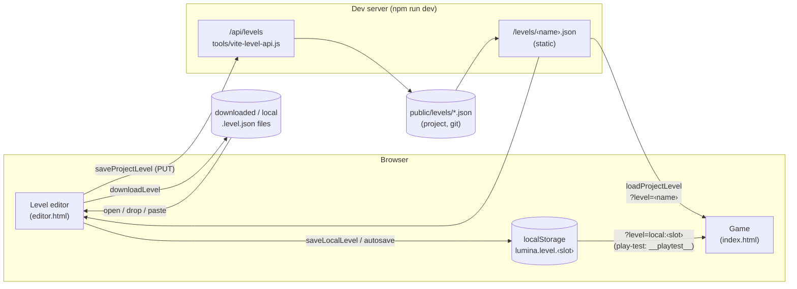

# Level storage API

> **Purpose.** How Lumina levels are stored, found, loaded and saved: the `LevelStorage` functions,
> every browser-storage key and slot (user slots, the play-test slot, the editor's autosave and
> recovered copies, preferences), the dev-server REST API that writes `public/levels/`
> (methods, origin and content-type checks, validation, errors, atomic writes), how the game
> resolves `?level=` URLs, file import and export, the editor's save flows, and the security
> limits of all this.
>
> **Audience.** Editor and tool developers, anyone scripting level I/O, AI agents that need to put
> a level where the game or the editor can open it.
>
> **Source of truth.** [`src/engine/level/LevelStorage.js`](../../src/engine/level/LevelStorage.js),
> [`tools/vite-level-api.js`](../../tools/vite-level-api.js) (registered in
> [`vite.config.js`](../../vite.config.js)), [`src/editor/autosave.js`](../../src/editor/autosave.js),
> [`src/editor/EditorApp.js`](../../src/editor/EditorApp.js) (open / save / play-test / autosave
> flows), [`src/editor/ui/dialogs.js`](../../src/editor/ui/dialogs.js) (Open and Save as dialogs),
> [`src/main.js`](../../src/main.js) (game level loading). Binding contract:
> [contracts/LEVEL_EDITOR.md §4 and §8](../contracts/LEVEL_EDITOR.md). Every status code and
> message below was checked against the running dev server.
>
> **Related.** [LEVEL_FORMAT.md](LEVEL_FORMAT.md) (what is stored) ·
> [AUTOMATION_API.md](AUTOMATION_API.md) (`window.__lumina.playLocal`, query parameters) ·
> [../user/LEVEL_EDITOR_GUIDE.md](../user/LEVEL_EDITOR_GUIDE.md) (saving and opening in the editor) ·
> [../architecture/EDITOR.md](../architecture/EDITOR.md) ·
> [../architecture/modules/level.md](../architecture/modules/level.md)

---

## Contents

1. [Where levels live](#1-where-levels-live)
2. [`LevelStorage` functions](#2-levelstorage-functions)
3. [Browser storage (`localStorage`)](#3-browser-storage-localstorage)
4. [Editor autosave and recovered copies](#4-editor-autosave-and-recovered-copies)
5. [The dev-server REST API (`/api/levels`)](#5-the-dev-server-rest-api-apilevels)
6. [Published levels and URL resolution](#6-published-levels-and-url-resolution)
7. [Files: download, open, drag and drop, clipboard](#7-files-download-open-drag-and-drop-clipboard)
8. [Editor save flows](#8-editor-save-flows)
9. [Security notes](#9-security-notes)

---

## 1. Where levels live



| Place | Written by | Read by | Available |
| --- | --- | --- | --- |
| **Project folder** `public/levels/<name>.json` | the editor (Save as › Project folder) through the dev-server API; generators (`tools/make-*.mjs`) directly | the game (`?level=<name>`), the editor (`?open=<name>`, Open › Project) | writing: only under `npm run dev`; reading: dev server, `npm run preview` and any static host of `dist/` (Vite copies `public/` into the build) |
| **Browser storage** `localStorage` | the editor (Save as › This browser, autosave, play-test), `window.__lumina.playLocal`, `sandbox/game_levels.html` | the game (`?level=local:<slot>`), the editor (Open › This browser, `?local=<slot>`) | always; per browser and per origin |
| **Files** `*.level.json` | the editor (Save as › Download, File › Download .json) | the editor (Open › File, drag and drop) | always |

Every load goes through `parseLevel` (normalisation + warnings,
[LEVEL_FORMAT.md §12](LEVEL_FORMAT.md#12-normalisation-loading)); every save writes
`serializeLevel` output, so files are byte-stable wherever they are stored.

## 2. `LevelStorage` functions

[`src/engine/level/LevelStorage.js`](../../src/engine/level/LevelStorage.js):

| Function | Returns | Behaviour |
| --- | --- | --- |
| `slugify(name)` | string | Safe slot / file name ([§2.1](#21-slugify)). |
| `RESERVED_FILE_NAMES` | RegExp | `/^(con\|prn\|aux\|nul\|com[0-9]\|lpt[0-9])$/` — Windows device names. |
| `PLAYTEST_SLOT` | `"__playtest__"` | The play-test slot. |
| `listLocalLevels()` | `{ slot, name, savedAt, width, depth }[]` | Levels saved in this browser (from the index), newest first, **without** the play-test slot. Autosave and recovered copies are not in it. |
| `saveLocalLevel(slot, level)` | the slot | Writes `serializeLevel(level)` to `lumina.level.<slot>` and updates the index. The slot is slugified, except `__playtest__`. **Throws** when storage is full or unavailable. |
| `loadLocalLevel(slot)` | `{ level, warnings }` or `null` | Reads `lumina.level.<slot>` (the slot is used as is — no slugify) and parses it; `null` when missing or storage is unavailable. Throws if the stored text is not a valid level. |
| `deleteLocalLevel(slot)` | — | Removes the slot and its index entry. |
| `hasProjectApi()` | `Promise<boolean>` | `true` when `GET /api/levels` answers OK with a JSON content type (i.e. under `npm run dev`). Never throws. |
| `listProjectLevels()` | `Promise<{ name, file, title, size, modified }[]>` | `GET /api/levels`. Throws `Level API: HTTP <status>` on failure. |
| `saveProjectLevel(name, level)` | `Promise<string>` — the file written (`levels/<slug>.json`) | `PUT /api/levels/<slugify(name)>` with `serializeLevel(level)`. Throws with the server's `error` text (or `HTTP <status>`). |
| `deleteProjectLevel(name)` | `Promise<void>` | `DELETE /api/levels/<slugify(name)>`. Throws `Delete failed: HTTP <status>`. |
| `loadProjectLevel(name)` | `Promise<{ level, warnings }>` | Fetches `<BASE_URL>levels/<slugify(name)>.json` (no cache). Throws `Level "<name>" not found` (plus ` (HTTP <status>)` for HTTP errors) when the answer is an error or an HTML page (the dev server's fallback for unknown paths). Works in dev and production. |
| `downloadLevel(level, filename = '<slug>.level.json')` | — | Saves the serialised level as a file download (`application/json`). |
| `readLevelFile(file)` | `Promise<{ level, warnings }>` | Parses a `File` (from a file input or drag and drop). |
| `openLevelFileDialog()` | `Promise<{ level, warnings, fileName } \| null>` | Shows a file picker (`.json,application/json`); resolves with the parsed file, rejects if it is not a level. It resolves `null` only when a `change` event arrives without a file; a cancelled picker normally fires no event, so the promise then simply never settles (harmless for the editor, but do not `await` it in a script). |
| `resolveLevelFromURL(search = location.search)` | `Promise<{ level, warnings, source } \| null>` | The game's `?level=` resolver ([§6](#6-published-levels-and-url-resolution)). |

### 2.1 `slugify`

Lower-cases, strips accents (NFKD), turns every run of other characters into `-`, trims dashes,
cuts to 60 characters. A name with no Latin letters or digits gets a stable `level-<6-char hash>`
(FNV-1a, base 36), so two such levels never share a file; a blank name is `untitled`; a Windows
device name gets a `-level` suffix.

| Input | `slugify` |
| --- | --- |
| `My Village!` | `my-village` |
| `Starfall Vale` | `starfall-vale` |
| `Ünïcödé Town` | `unicode-town` |
| `村の広場` | `level-fue3hd` |
| `` (empty) | `untitled` |
| `CON` | `con-level` |
| `__playtest__` | `playtest` (so `saveLocalLevel` special-cases `PLAYTEST_SLOT`) |

The result always matches the API's name rule `^[a-z0-9][a-z0-9-]{0,59}$`.

## 3. Browser storage (`localStorage`)

Browser storage is per **origin** (scheme + host + port): `http://127.0.0.1:5173` (dev),
the `npm run preview` port and a deployed site each have their own levels. The check harness
starts every run with a fresh temporary browser profile on a new random port, so each harness run
begins with **empty** storage (a slot written in a run is visible to later `goto` steps of the same
run, not to the next run).

| Key | Content | Written by |
| --- | --- | --- |
| `lumina.level.<slot>` | a level, as `serializeLevel` text | `saveLocalLevel`; the editor autosave (below) |
| `lumina.levels` | the index: JSON array of `{ slot, name, savedAt, width, depth }` | `saveLocalLevel`, `deleteLocalLevel` |
| `lumina.level.__playtest__` | the level being play-tested (in the index, hidden from `listLocalLevels`) | the editor's Play / F5 |
| `lumina.level.__autosave__` | the editor's working copy (not in the index) | `autosave.writeAutosave` |
| `lumina.editor.autosave` | autosave meta: `{ sid, savedAt, name, width, depth, fileRef, exported? }` | `autosave.writeAutosave` |
| `lumina.level.__recovered_<id>__` | recovered copies of other sessions' unsaved work (at most 3) | `autosave.archiveAutosave` |
| `lumina.editor.recovered` | list of recovered copies: `{ id, sid, savedAt, name, width, depth, fileRef, exported }[]` | `autosave.archiveAutosave`, `deleteRecovered` |
| `lumina.editor.prefs` | editor preferences: `{ view: { layout, grid, split, textured2d, showObjects, showMarkers, cameraMode, postfx, atmosphere }, inspector }` | `EditorApp._savePrefs` |
| `lumina.level.test` / `lumina.level.test-<case>` | test levels | `window.__lumina.playLocal` (default slot `test`), `sandbox/game_levels.html` |

Slots written through `saveLocalLevel` are always slugs (`[a-z0-9-]`), so they never collide with
the reserved `__…__` slots. `fileRef` is `{ kind: 'new' | 'local' | 'project' | 'file', name }`.

Capacity: browsers typically allow about 5 MB of `localStorage` per origin (strings count twice
in some browsers). Shipped level sizes: Willowmere (28 × 22) 10 KB, Brightwater Crossing (36 × 28)
15 KB, Emberfall (48 × 40) 29 KB, Starfall Vale (128 × 128, 874 objects) 167 KB. When storage is full, `saveLocalLevel` throws (Save as › This browser
and play-test report it), and a failed autosave is reported once and turns the unsaved-changes
dot red.

## 4. Editor autosave and recovered copies

[`src/editor/autosave.js`](../../src/editor/autosave.js) keeps unsaved work safe without ever
overwriting another session's work:

- **Working copy.** While the document is dirty and no gesture is in progress, the editor writes
  it to slot `__autosave__` every 20 s (`AUTOSAVE_MS`), and immediately when the tab is being
  closed with unsaved changes (the browser also asks "Leave site?"). The meta records the editor
  session (`SESSION_ID`, one per page load), the file it came from and its size.
- **Never overwritten unresolved.** When this session is about to write and the slot holds
  **another** session's copy (a dismissed restore prompt, a start through `?open=` / `?new` /
  `?local=`, another editor tab), that copy is first moved to the recovered copies
  (`__recovered_<id>__`, newest 3, one per session).
- **Restore prompt at start-up.** Without query parameters the editor offers the autosave of an
  earlier session (not one flagged `exported`). With `?open=<name>` / `?local=<slot>` it offers it
  only when it is a copy of that same level. "Restore" loads it as an unsaved document; "Discard"
  deletes it; closing the prompt (Esc / ×) keeps it (it becomes a recovered copy once this session
  autosaves).
- **Recovered copies** are listed under File › Open › This browser › "Recovered unsaved work";
  opening one removes it from the list and loads it as an unsaved document.
- **After a save**, when the document is clean, this session's autosave (and any of its own
  recovered copies) is removed. "Don't save" in the unsaved-changes question drops the copy only
  once another level has actually replaced the document, so a file that fails to open never costs
  the work.
- **Downloads** (Save as › Download, or Ctrl+S of a document that came from a file) count as saved,
  but a copy stays in the autosave slot flagged `exported`, because a browser download cannot be
  confirmed. It is never offered at start-up; once another session archives it, it is listed
  among the recovered copies as "(was downloaded)".

## 5. The dev-server REST API (`/api/levels`)

[`tools/vite-level-api.js`](../../tools/vite-level-api.js) is a Vite plugin (`lumina-level-api`,
`apply: 'serve'`): it exists only while the Vite dev server runs (`npm run dev`, and the servers
the check harness starts). It is not part of `npm run build` output and not served by
`npm run preview`. It reads and writes `public/levels/` (created if missing).

### 5.1 Endpoints

All JSON answers carry `content-type: application/json`, `cache-control: no-store` and
`x-content-type-options: nosniff`, and never any `Access-Control-*` header (Vite's own CORS
middleware is switched off in `vite.config.js`, [§5.3](#53-origin-check); with it on, a
`Vary: Origin` could appear). A query string is ignored; a trailing slash is ignored
(`/api/levels/` is the list).

| Method and path | Success | Errors |
| --- | --- | --- |
| `GET /api/levels` | `200 { "levels": [{ "name", "file", "title", "size", "modified" }] }` — every `*.json` in `public/levels/`, newest first. `file` = `levels/<name>.json`, `title` = the file's `name` field (the file name if it cannot be read), `size` in bytes, `modified` = mtime in ms. | `405 {"error":"method not allowed"}` with `Allow: GET` for any other method on the list |
| `GET /api/levels/<name>` | `200` the level as **compact** JSON (parsed and re-stringified — not the file's bytes; fetch `/levels/<name>.json` for the exact file) | `404 {"error":"not found"}` — also when the file exists but is not valid JSON |
| `PUT /api/levels/<name>` | `200 { "ok": true, "file": "levels/<name>.json" }` | see §5.2 (`415` without `content-type: application/json`) |
| `DELETE /api/levels/<name>` | `200 { "ok": true }` — also when the file did not exist | — |
| `POST` and any other method on `/api/levels/<name>` | — | `405 {"error":"method not allowed"}` with `Allow: GET, PUT, DELETE` — writes go only through `PUT` |
| `OPTIONS` (any path under `/api/levels`) | `204`, `Allow: GET, PUT, DELETE`, no CORS headers — never a CORS grant | `403` from another origin |
| every method, from a page of another origin | — | `403 {"error":"request from <origin> refused: only pages served by this dev server (http://<host>) may use the level API"}` ([§5.3](#53-origin-check)) |

Order of the checks for every request: the **origin check** (`403`, [§5.3](#53-origin-check)) comes
first, for reads too, before anything is read or written; then, on the list, the method (`405`);
on `/api/levels/<name>`, the **name rules** below (`400`), then the method (`405`), then for `PUT`
the content type (`415`) and the body steps of §5.2. So a `POST` or a `text/plain` `PUT` to an
invalid name gets `400`, not `405` / `415`.

Name rules (for every method on `/api/levels/<name>`, after the origin check):

| Rule | Error |
| --- | --- |
| must match `^[a-z0-9][a-z0-9-]{0,59}$` (after URL decoding) | `400 {"error":"invalid level name (use a-z, 0-9 and -)"}` |
| must not be a Windows device name (`con`, `prn`, `aux`, `nul`, `com0`–`com9`, `lpt0`–`lpt9`) | `400 {"error":"“con” is a reserved file name on Windows — choose another name"}` |

Because of the name rule no request can reach a path outside `public/levels/` (no `/`, `.`, `%2F`
or `..` survive it). A malformed percent-escape in the name (e.g. `%E0%A4%A`) makes
`decodeURIComponent` throw, which ends as `500 {"error":"URI malformed"}`.

### 5.2 Writing (`PUT`)

0. The request's media type must be `application/json` (case-insensitive; parameters such as
   `; charset=utf-8` are allowed) → else `415 {"error":"content-type must be application/json"}`,
   checked before the body is read. `text/plain`, `application/x-www-form-urlencoded`,
   `multipart/form-data` and a missing content type are all refused, so no browser can send a
   write as a CORS "simple" request (form posts, `sendBeacon`, `no-cors` fetches).
1. The body is read up to **4 MiB** (`MAX_BYTES` = 4 × 1024 × 1024); larger →
   `413 {"error":"level too large"}`.
2. It must parse as JSON → else `400 {"error":"body is not valid JSON"}`.
3. It must look like a level: `format === "lumina-level"` and `tiles` and `heights` arrays → else
   `400 {"error":"body is not a lumina-level"}`. There is **no further validation or
   normalisation** on the server: the text that was sent is the text that is written (the editor
   always sends `serializeLevel` output of a normalised level).
4. **Atomic write:** the text (with a final `\n` added if missing) is written to
   `public/levels/<name>.json.tmp`, then renamed over `<name>.json`. A reader never sees a
   half-written file.
5. If writing or renaming fails, the `.tmp` file is removed (so `npm run build` never copies a
   stray `.tmp` into `dist/`) and the answer is
   `500 {"error":"Cannot write public/levels/<name>.json (<why>)"}` — `<why>` is "the file is
   read-only or in use by another program" for `EPERM` / `EACCES` / `EBUSY`, else the error code.
   The editor shows this message as is.
6. Any other unexpected failure: `500 {"error":"<message>"}`.

Example (from the page console of the dev server, or `curl`):

```js
const { createEmptyLevel, serializeLevel } = await import('/src/engine/level/LevelFormat.js');
const r = await fetch('/api/levels/my-test', { method: 'PUT', headers: { 'content-type': 'application/json' },
  body: serializeLevel(createEmptyLevel({ name: 'My Test' })) });
console.log(r.status, await r.json());   // 200 { ok: true, file: 'levels/my-test.json' }
```

```bash
curl -s http://127.0.0.1:5173/api/levels                     # list
curl -s -X PUT -H 'content-type: application/json' --data-binary @my-level.json http://127.0.0.1:5173/api/levels/my-level
curl -s -X DELETE http://127.0.0.1:5173/api/levels/my-level
```

`-H 'content-type: application/json'` is required: without it curl sends
`application/x-www-form-urlencoded`, which gets `415`. curl sends no `Origin`, `Sec-Fetch-Site` or
`Referer`, so the origin check lets it through (§5.3). A script running in a page served by the
dev server (the `fetch` example above, `LevelStorage`'s functions, harness `eval` steps) is
same-origin and works unchanged.

### 5.3 Origin check

Only pages served by this dev server — and command-line clients — may use the API. The check runs
on every request under `/api/levels` (reads included), before name validation and before anything
is read or written:

1. **With an `Origin` header**, it must equal one of the server's own origins:
   `http://<request Host>` (`https:` on a TLS server). When the Host is `127.0.0.1`, `localhost` or
   `[::1]`, the other two loopback names **on the same port** also count. Pages on other ports —
   other `localhost` ports included — are foreign, and `Origin: null` is refused.
2. **Without `Origin`**, `Sec-Fetch-Site` must be `same-origin`, or `none` for `GET` / `HEAD` only
   (a URL typed into the address bar). Any other value →
   `403 {"error":"request refused (Sec-Fetch-Site: <value>): only pages served by this dev server (http://<host>) may use the level API"}`.
3. **Without either**, a `Referer` must have one of the own origins.
4. **With none of the three headers** the request is served: that is curl or a node script.
   Browsers always send `Origin` with `PUT` and `DELETE`.

A refused request gets `403` with the message above and nothing is read, written or deleted.

**No CORS is granted.** Vite 8's default `server.cors` allows every `localhost` / `127.0.0.1` /
`[::1]` origin on any port. [`vite.config.js`](../../vite.config.js) therefore sets
`server.cors: false` and `preview.cors: false` (since 2026-09-27), so Vite installs no CORS
middleware and no response of the dev or preview server — source files, `/levels/*.json`, the
`OPTIONS` preflight — carries `Access-Control-Allow-Origin`. The plugin does not rely on that
setting (defence in depth): it registers a guard middleware for `/api/levels` and moves it to the
front of Vite's connect stack, ahead of Vite's CORS middleware (if one is ever switched on) and its
Host-check middleware: it refuses foreign origins with `403` before any CORS header could be added,
and answers `OPTIONS` preflights itself (`403` for foreign origins, else `204` with `Allow` and no
CORS headers). The main handler repeats the check in case the guard could not be moved first, and
strips any `access-control-*` response headers.

**DNS rebinding** (a foreign host name that resolves to `127.0.0.1`, so `Origin` matches `Host`) is
refused earlier by Vite's own Host check (`server.allowedHosts`): `403` text/plain
"Blocked request. This host (…) is not allowed", before the API handler runs. Setting
`server.allowedHosts: true` would disable that protection.

Consequences: behind a reverse proxy that rewrites the `Host` header, the editor's saves are refused
with `403` (the editor then reports the project folder as unavailable). Opening the editor as
`http://localhost:5173` works like `http://127.0.0.1:5173`.

## 6. Published levels and URL resolution

Files in `public/` are served as-is by the dev server and copied into `dist/` by `npm run build`,
so a level saved to the project folder is playable everywhere at `levels/<name>.json`.

`loadProjectLevel(name)` fetches `${import.meta.env.BASE_URL}levels/<slugify(name)>.json`
(`BASE_URL` is `/` with this project's Vite config). The dev server answers unknown paths with
`index.html` (HTTP 200), so the loader also treats an HTML content type as "not found".

The game ([`src/main.js`](../../src/main.js)) resolves its level with
`resolveLevelFromURL(location.search)`:

| URL | Loads | `source` |
| --- | --- | --- |
| `index.html` | `levels/emberfall.json` (the default) | `levels/emberfall.json` |
| `index.html?level=<name>` | `levels/<slugify(name)>.json` | `levels/<slug>.json` |
| `index.html?level=local:<slot>` | browser slot `<slot>` (exact, not slugified) | `local:<slot>` |

Errors: a missing browser slot throws `No level "<slot>" in this browser's storage`; a missing
project level `Level "<name>" not found`; invalid JSON is reported as "the file is not valid level
JSON (…)". The game shows `Could not load level "<requested>": <why>` on the loading screen with
links to Emberfall and the editor. A level that loads with warnings plays; the warnings and any
`validateLevel` errors go to the console.

The editor opens project levels the same way (`editor.html?open=<name>`, File › Open › Project
folder). Without the dev server (a static host), the Open dialog's Project tab explains that the
folder needs `npm run dev`, Save as disables the "Project folder" destination, and
`?open=<name>` still opens published levels (read-only: save them to the browser or a file).

## 7. Files: download, open, drag and drop, clipboard

- **Download** — `downloadLevel(level)` saves `<slug>.level.json` (`application/json`).
  File › Download .json (Ctrl+E) downloads a copy without changing where the document is saved;
  Save as › Download makes the file the document's save target.
- **Open** — File › Open › File, or File › Open file from disk: a `.json` picker
  (`openLevelFileDialog`). The current document is replaced only after the new file parsed, so a
  broken file never costs the current work. File › Open file from disk and drag and drop parse the
  file **before** asking about unsaved changes; File › Open… (Ctrl+O) asks first, before its
  dialog opens — "Don't save" there drops nothing until another level has actually replaced the
  document.
- **Drag and drop** — dropping files anywhere on the editor window opens the first `.json` (or
  JSON-typed) file.
- **Paste** — pasting text that is a whole `lumina-level` JSON replaces the document (after the
  unsaved-changes question; the pasted level stays unsaved). Copying objects puts
  `{ "format": "lumina-objects", "objects": [ … ] }` on the clipboard (as text); pasting it inserts
  the objects at the pointer (fresh ids).
- Opening a file written by a newer engine version works with a warning; saving back to that same
  project file or browser slot asks first ("Overwrite a newer level file?").

## 8. Editor save flows

The editor tracks where the document came from in `state.fileRef`:

| `fileRef.kind` | Came from | Ctrl+S (Save) writes to |
| --- | --- | --- |
| `new` | File › New, `?new`, a pasted level | opens Save as |
| `project` | the project folder | `public/levels/<name>.json` via the API (if the dev server is gone: a notice, then Save as) |
| `local` | a browser slot | that slot |
| `file` | a file (open / drop) or a download | downloads `<name>.level.json` again |

**Save as** (Ctrl+Shift+S) asks for a file name (slugified; shown as `→ public/levels/<slug>.json`,
`→ browser slot “<slug>”` or `→ <slug>.level.json (download)`) and a destination: **Project
folder** (needs the dev server), **This browser** or **Download file**. While the level is still
called "Untitled" it also asks for the display name (derived from the file name until edited). If
the target already exists (another project file or browser slot) it asks "Replace existing
level?".

**Saved state.** Every committed edit has a revision number; a save records the revision it wrote,
so edits made while a project save is in flight keep the document dirty, and undoing back to the
saved revision makes it clean again. The unsaved-changes dot next to the level name shows the
state; `document.title` starts with `●` while dirty.

**Play-test** (Play ▶ / F5): `validateLevel` → on errors a problems dialog (with a "fix the player
start" shortcut for spawn problems) → `saveLocalLevel('__playtest__', level)` → opens
`index.html?level=local:__playtest__&autostart=1` in the window named `lumina-playtest` (the same
tab is reused on the next play-test). If the pop-up is blocked, the level is still saved in the
slot. The play-test does not save the document anywhere else and does not change its dirty state.

## 9. Security notes

- **Development only.** The write API exists only in the Vite dev server (`apply: 'serve'`). A
  production build is static files; nothing can write levels there.
- **Local only by default.** `vite.config.js` binds the dev server to `127.0.0.1:5173`. The API has
  **no authentication**: do not start the dev server on a public interface
  (`npm run dev -- --host`) on an untrusted network, because anyone who can reach it directly (a
  non-browser client, not a web page) could create, overwrite or delete files in `public/levels/`.
- **Same origin only.** The API refuses requests from pages of other origins with `403` — other
  `localhost` / `127.0.0.1` / `[::1]` ports included, reads included — and grants no CORS
  ([§5.3](#53-origin-check)). Writes need `PUT` with `content-type: application/json`, which no
  browser sends cross-origin without a preflight (and the preflight is refused). So a web page open
  in the same browser while `npm run dev` runs can no longer write, delete or list levels. (Until
  this check was added, a cross-site `POST` with a `text/plain` body could write a level, and pages
  on any other localhost port could `PUT`, `DELETE` and read the list through Vite's default CORS.)
  Still review `git status` in `public/levels/` before committing.
- **Outside the API.** `vite.config.js` sets `server.cors: false` and `preview.cors: false`, so
  pages on other origins — other localhost ports included — cannot read the files the dev or
  preview server serves (for example `/levels/<name>.json` or source files) either: no response
  grants CORS. (Until 2026-09-27 Vite's default `server.cors` let them read those files.) On
  `npm run preview` there is no API at all: `/api/levels` is answered by the `index.html`
  fallback (`200`, `text/html`) and a `PUT` gets `404`.
- **Path safety.** Names are validated after URL decoding against `^[a-z0-9][a-z0-9-]{0,59}$`;
  Windows device names are refused (they would address a device, not a file).
- **Browser storage** is per origin and per browser profile; it is not shared with other users and
  not backed up. Treat it as a scratch space: put anything worth keeping in the project folder or a
  downloaded file.
- **Level content is data.** Levels contain no code; text fields are rendered as text (the dialog
  box only interprets `{word}` highlighting and line breaks), so a level file cannot inject
  scripts into the game or the editor.
