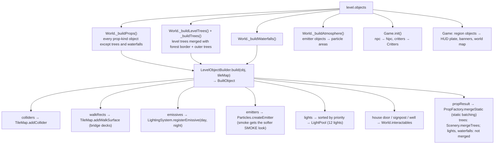

# Object catalog

> **Purpose.** The normative reference for every object type a Lumina level can contain: its
> category and placement, every field with type, default and editor range, what the game builds
> from it (geometry, colliders, point lights and their priority, emissive materials, particle
> emitters, interactions), and the behaviour of villagers (dialogue syntax, built-in actions,
> behaviours, hand-written scripts), critters, particle areas and region banners.
>
> **Audience.** Level designers and tool authors writing objects by hand or in generators; engine,
> game and editor developers adding or changing object types; AI agents reading or writing levels.
>
> **Source of truth.** [`src/engine/level/ObjectCatalog.js`](../../src/engine/level/ObjectCatalog.js)
> (`OBJECT_TYPES`, defaults, inspector fields, `normalizeObject`, dialogue text helpers,
> `critterStartPoints`), [`src/engine/level/ObjectBuilder.js`](../../src/engine/level/ObjectBuilder.js)
> (`LevelObjectBuilder`, `LIGHT_PRIORITY`, `bridgeDeckHeight`, `buildWaterfall`),
> [`src/engine/world/Props.js`](../../src/engine/world/Props.js) and
> [`src/engine/world/props/`](../../src/engine/world/props/) (the prop builders),
> [`src/demo/World.js`](../../src/demo/World.js) (how the game wires built objects),
> [`src/demo/Game.js`](../../src/demo/Game.js), [`src/demo/Npc.js`](../../src/demo/Npc.js),
> [`src/demo/dialogue.js`](../../src/demo/dialogue.js), [`src/demo/Critters.js`](../../src/demo/Critters.js),
> [`src/engine/fx/Particles.js`](../../src/engine/fx/Particles.js),
> [`src/demo/Weather.js`](../../src/demo/Weather.js). The binding contract is
> [contracts/LEVEL_EDITOR.md §2–§3](../contracts/LEVEL_EDITOR.md). Where they disagree, the code
> wins. The object types are also declared for the type check in
> [`src/engine/level/types.d.ts`](../../src/engine/level/types.d.ts) ([§15](#15-extending-the-catalog)).
>
> **Related.** [LEVEL_FORMAT.md](LEVEL_FORMAT.md) (the file around the objects) ·
> [AUTOMATION_API.md](AUTOMATION_API.md) (`talkTo(id)` and friends) ·
> [../architecture/modules/world.md](../architecture/modules/world.md) (PropFactory, TileMap, Water) ·
> [../architecture/modules/fx.md](../architecture/modules/fx.md) (particles) ·
> [../architecture/modules/lighting.md](../architecture/modules/lighting.md) (LightPool) ·
> [../architecture/GAME.md](../architecture/GAME.md) (the game loop) ·
> [../user/LEVEL_EDITOR_GUIDE.md](../user/LEVEL_EDITOR_GUIDE.md) (placing objects in the editor) ·
> [../design/LEVEL_DESIGN_GUIDE.md](../design/LEVEL_DESIGN_GUIDE.md)

---

## Contents

1. [Summary of all types](#1-summary-of-all-types)
2. [Object shapes and normalisation](#2-object-shapes-and-normalisation)
3. [How the game builds objects](#3-how-the-game-builds-objects)
4. [Point lights: budget and priority](#4-point-lights-budget-and-priority)
5. Types — Buildings: [house](#house) · [windmill](#windmill) · [well](#well) · [marketStall](#marketstall)
6. Types — Nature: [tree](#tree) · [rock](#rock) · [haystack](#haystack)
7. Types — Lights: [lamppost](#lamppost) · [wallTorch](#walltorch) · [campfire](#campfire) · [light](#light)
8. Types — Props: [bench](#bench) · [barrel](#barrel) · [crate](#crate) · [crateStack](#cratestack) · [flowerbox](#flowerbox) · [signpost](#signpost)
9. Types — Structures: [fence](#fence) · [bridge](#bridge)
10. Types — Water: [waterfall](#waterfall)
11. Types — Characters: [npc](#npc) · [critters](#critters)
12. Types — Markers: [emitter](#emitter) · [region](#region) · Combat: [enemy](#enemy) · [chest](#chest) · [waystone](#waystone)
13. [Text fields and dialogue syntax](#13-text-fields-and-dialogue-syntax)
14. [NPC actions, behaviours and scripts](#14-npc-actions-behaviours-and-scripts)
15. [Extending the catalog](#15-extending-the-catalog)

---

## 1. Summary of all types

`OBJECT_TYPES[type]` = `{ label, category, placement, kind, glyph, color, radius, rotatable?, snap?, help?, defaults, fields, combat? }`.
`combat: true` marks the three combat-only types (`enemy`, `chest`, `waystone`,
[COMBAT.md §14](../contracts/COMBAT.md#14-level-data)): an `enemy` object turns combat on for its
level, and the combat demo [Cinderwatch Pass](../design/levels/cinderwatch-pass.md) covers them
(Starfall Vale's coverage check skips them).
`kind` decides who builds the object: **prop** objects are built by `LevelObjectBuilder` (3D
geometry through `PropFactory`), **actor** objects by the game's character code, **marker**
objects have no geometry (the game reads them directly). `glyph`, `color` and `radius` are for
the editor's palette, 2D map and picking; `snap` is the placement snap step. Every type snaps to
0.5 units (`house` and `marketStall` declare it, the rest use the default 0.5); Alt or the snap
toggle in the tool options places freely (`snapStep` in
[`src/editor/tools/common.js`](../../src/editor/tools/common.js)).

| Type | Editor label | Category | Placement | Kind | Rotatable | Collider | Point light | Interaction in game |
| --- | --- | --- | --- | --- | --- | --- | --- | --- |
| `house` | House | Buildings | point | prop | yes | box | door lantern, only with `light: true` | Knock (only with `text`) |
| `windmill` | Windmill | Buildings | point | prop | yes | circle | — | — |
| `well` | Well | Buildings | point | prop | yes | circle | — | Look (only with `text`) |
| `marketStall` | Market stall | Buildings | point | prop | yes | box | — | — |
| `tree` | Tree | Nature | point | prop | no (random yaw) | trunk circle (optional) | — | — |
| `rock` | Rock | Nature | point | prop | no (random yaw) | circles | — | — |
| `haystack` | Haystack | Nature | point | prop | no (random yaw) | circle | — | — |
| `lamppost` | Lamppost | Lights | point | prop | yes | circle | yes, night only | — |
| `wallTorch` | Wall torch | Lights | point | prop | yes | none | yes, day and night | — |
| `campfire` | Campfire | Lights | point | prop | yes | circle | yes, day and night | — |
| `light` | Point light | Lights | point | prop | no | none | yes (configurable) | — |
| `bench` | Bench | Props | point | prop | yes | box | — | — |
| `barrel` | Barrel | Props | point | prop | yes | circle | — | — |
| `crate` | Crate | Props | point | prop | yes | box | — | — |
| `crateStack` | Crate stack | Props | point | prop | yes | box | — | — |
| `flowerbox` | Flower box | Props | point | prop | yes | box | — | — |
| `signpost` | Signpost | Props | point | prop | yes | circle | — | Read (only with `text`) |
| `fence` | Fence | Structures | line | prop | — | boxes along the run | — | — |
| `bridge` | Bridge | Structures | line | prop | — | rail boxes; deck is walkable | — | — |
| `waterfall` | Waterfall | Water | point | prop | no (`facing`) | none | — | — |
| `npc` | Villager (NPC) | Characters | point | actor | no (`facing`) | moving circle | — | Talk |
| `critters` | Critters | Characters | point | actor | no | none | — | — |
| `emitter` | Particle area | Markers | point | marker | no | none | — | — |
| `region` | Region name | Markers | rect | marker | — | none | — | HUD name, arrival banner |
| `enemy` | Enemy group | Combat | point | actor | no | none (the combat system separates actors itself) | — | — (the creatures fight) |
| `chest` | Treasure chest | Combat | point | prop | yes | circle r 0.45 | — | Examine; on a combat level Open |
| `waystone` | Waystone (checkpoint) | Combat | point | prop | no | circle r 0.5 | — (it glows by bloom) | Examine; on a combat level attune by walking close, Rest |

Palette categories, in display order (`OBJECT_CATEGORIES`): Buildings, Nature, Lights, Props,
Structures, Water, Characters, Markers, Combat. The player start is **not** an object: it is
`level.spawn` ([LEVEL_FORMAT.md §10](LEVEL_FORMAT.md#10-spawn-player-start)); editors show it with
`SPAWN_MARKER` (`★`, `#7fe3ff`).

Enumerations exported by the catalog:

| Constant | Values |
| --- | --- |
| `WALL_TEXTURES` | `timber_frame`, `plaster`, `brick`, `stone_brick`, `log_wall`, `wood_planks`, `wood_planks_dark` |
| `ROOF_TEXTURES` | `roof_red`, `roof_blue`, `roof_thatch`, `roof_slate` |
| `TREE_KINDS` | `oak`, `autumn`, `pine`, `birch` |
| `CLOTH_TEXTURES` | `cloth_stripe`, `cloth_red` |
| `FACINGS` | `down`, `left`, `right`, `up` |
| `CARDINALS` | `N`, `S`, `E`, `W` |
| `CHARACTER_PRESET_NAMES` | `traveler`, `swordsman`, `merchant`, `cleric`, `scholar`, `dancer`, `hunter`, `villager`, `farmer`, `elder`, `child`, `guard`, `innkeeper`, `bard` |
| `CRITTER_KINDS` | `chicken`, `cat`, `bird`, `dog` |
| `EMITTER_PRESETS` | `fireflies`, `leaves`, `petals`, `dust`, `embers`, `smoke`, `mist`, `sparkle`, `snow`, `rain` |
| `NPC_ACTIONS` | `none` (Just talk), `rest` (Innkeeper), `shop` (Merchant), `music` (Bard) |
| `NPC_BEHAVIOURS` | `wander`, `post`, `perform`, `chase` |
| `NPC_SCRIPTS` | `''` (use `dialogue`), `elder`, `innkeeper`, `merchant`, `guard`, `farmer`, `child`, `bard`, `scholar`, `drillmaster`, `shopkeeper` |
| `ENEMY_KINDS` | `slime`, `goblin`, `archer`, `shaman`, `bat`, `boar`, `dummy`, `golem` |
| `ENEMY_INFO` | frozen `{ label, flier, boss, passive, humanoid }` per kind: Moss Slime, Bramble Goblin, Thorn Archer, Hex Shaman, Cinder Bat (flier), Ironhide Boar, Straw Dummy (passive), Cinderheart (boss) |
| `CHEST_UPGRADES` | `none`, `maxHp` (+20 max HP), `maxMp` (+10 max MP), `attack` (+3 ATK) |

## 2. Object shapes and normalisation

| Placement | Position fields | Created by `createObject(type, x, z)` |
| --- | --- | --- |
| point | `x`, `z` (world units; a tile centre is `i + 0.5`) | at `(x, z)` |
| line | `x0`, `z0`, `x1`, `z1` | from `(x, z)` to `(x + 2, z)` |
| rect | `minX`, `maxX`, `minZ`, `maxZ` | a 4 × 4 rect centred on `(x, z)` |

Every object also has `id` (unique, non-empty, never `"spawn"`) and `type`. Point objects of
rotatable types have `rotation` in radians about +Y (0 = front faces +Z, toward the camera;
`π/2` = faces east). Non-rotatable types ignore `rotation`.

`opts` is handed to the matching `PropFactory` method unchanged (plus `id` and, for rotatable
types, `rotation`), so a file can use builder options that have no inspector field. Randomness
inside a prop is seeded from the factory seed (42 in the game), the prop kind, its position
(1/16-unit grid) and `opts.seed`: moving an object or changing its seed changes its details;
rebuilding the same level gives the same result.

`normalizeObject(o)` (run on every load):

- throws `Unknown object type "t"` unless `o.type` is a string naming one of `OBJECT_TYPES`' own
  types — an `Object.prototype` name such as `"constructor"` is unknown too (`createObject` throws
  the same). `normalizeLevel` and the editor's paste drop such objects first, so a load or a paste
  never reaches the throw ([LEVEL_FORMAT.md §12](LEVEL_FORMAT.md#12-normalisation-loading));
- adds every catalog default the object lacks, recursing into plain objects (`opts`), and keeps
  the object's own key order (new keys are appended), so load → save is byte-stable;
- coerces positions to numbers (point: `x`, `z` default 0; line: `x1` defaults to `x0 + 2`,
  `z1` to `z0`; rect: `maxX` to `minX + 4`, `maxZ` to `minZ + 4`, and a reversed rect is
  swapped); coerces `rotation` when the type has one or the object sets it; makes `id` a string
  (a position that `Number()` cannot convert, such as `{"toString": 1}`, takes its default; an
  `id` that `String()` cannot convert becomes `""`, so `normalizeLevel` renames the object);
- converts the legacy **absolute** NPC / critter fields to the **relative** ones:
  `talkPoint: [x, z]` → `talkOffset: [dx, dz]`, `bounds: rect` → `area: rect` (offsets from the
  object), `spots: [[x, z], …]` → `spotOffsets` (rounded to 1e-6). Relative fields move with the
  object when it is dragged, duplicated or rotated in the editor. The game still reads both forms.

Other field values are not clamped on load; the ranges in the tables below are the editor's
inspector ranges. Where the game sanitises a value, the "Notes" column says so. A name field
(`select` fields such as `kind`, `preset`, `facing`, `script`, and texture names in `opts`) is
matched only against the own keys of its table, so an `Object.prototype` name (`"constructor"`,
`"__proto__"`, `"toString"` …) gets the same fallback as a misspelt name (KNOWN_ISSUES LVL-17,
fixed on 2026-10-01); an unknown texture name draws the magenta fallback texture with a warning.

Inspector field types (`fields[].type`): `number`, `int`, `angle` (radians stored, degrees shown),
`bool`, `select`, `text`, `textarea`, `lines` (`string[]`, one entry per paragraph), `dialogue`
(see [§13](#13-text-fields-and-dialogue-syntax)), `color`. `nullable` numbers may be left blank
(stored as `null`). `key` is a dotted path (`opts.width`, `size.0`).

## 3. How the game builds objects



`LevelObjectBuilder.build()` returns `null` for actors and markers. For props it returns a
`BuiltObject`: `{ object, colliders, walkRects, lights, emissives, emitters, update, interact, anchor, source, propResult, dispose }`.
Each light descriptor gets `tag: "<type>:<id>"` and `priority` from `LIGHT_PRIORITY`. A prop that
fails to build is skipped with a console warning (`[Lumina] could not build <type> "<id>"`).

Static meshes of all props (not trees, lights or waterfalls) are merged per material by
`PropFactory.mergeStatic`; animated parts (windmill sails, flames, wind-swayed foliage) stay
separate. On levels larger than 64 tiles on a side the merged batches are additionally cut
into spatial pieces and culled ([../architecture/PERFORMANCE.md](../architecture/PERFORMANCE.md)).

Interactables in the game (the prompt appears when the player is within the radius, less than
1.3 units above or below, and roughly facing it):

| Source | Id in `state().nearest` | Prompt label | Radius | Speaker | Condition |
| --- | --- | --- | --- | --- | --- |
| house door | `door:<id>` | Knock | 1.0 | none | non-empty `text` |
| signpost | `<id>` | Read | 1.35 | `speaker` (default `Signpost`) | non-empty `text` |
| well | `<id>` | Look | 1.75 | none; plays `sfx` | non-empty `text` |
| npc | `<id>` | Talk | `talkRadius` (1.6) | the NPC's `name` | always |
| chest | `<id>` | Examine ("The chest is locked tight."); on a combat level **Open** | 1.2 (0.8 in front of the chest) | none | always |
| waystone | `<id>` | Examine ("An old waystone hums quietly."); on a combat level **Rest** | 1.5 | the waystone's `name` | always |

A chest's and a waystone's interactable also carries the level `object` and the prop's `controls`
as `prop` (`open()` / `setAttuned(on)`); the combat system sets the label and `onInteract` at load
([COMBAT.md §9.8](../contracts/COMBAT.md#98-world-interactables-level-package-and-game_interact-combat-core)).

## 4. Point lights: budget and priority

The engine has a fixed budget of **12 point lights**, all created before the first frame
(changing the light count recompiles every shader). A level may contain any number of light
sources; the game hands every descriptor to a
[`LightPool`](../../src/engine/lighting/LightPool.js) of 12:

- **≤ 12 descriptors:** each gets a permanent light, sorted by priority (lower first), ties by
  object order.
- **> 12 descriptors:** every 0.2 s the 12 lights are reassigned to the descriptors whose range
  (+ 4 units margin) touches the camera view, nearest the camera focus first, with
  `priority × 1.5` units added to the distance, a bonus of 2 for lights already lit and a penalty
  of up to 10 for lanterns that are dark by day; a light that changes lantern fades out, moves and
  fades in (0.35 s each way). Teleports snap the pool at once (`LightPool` options `interval`,
  `margin`, `priorityWeight`, `hysteresis`, `dayPenalty`, `fadeTime`).

`LIGHT_PRIORITY` ([`ObjectBuilder.js`](../../src/engine/level/ObjectBuilder.js)):

| Type | Priority | Colour | Intensity | Range | Flicker | When lit |
| --- | --- | --- | --- | --- | --- | --- |
| `campfire` | 0 | `#ff8c3a` | 14 | 10 | 0.5 | day and night |
| `wallTorch` | 1 | `#ff9a45` | 7 | 7 | 0.45 | day and night |
| `light` | 1 | `color` (`#ffb46b`) | `intensity` (8) | `distance` (8) | `flicker` (0.2) | `nightOnly` (true) |
| `lamppost` | 2 | `#ffb46b` | 12 | 9 | 0.2 | night |
| `house` | 3 | `#ffb46b` | 6 | 7 | 0.25 | night (door lantern, only with `light: true`) |

"Night" lights fade with the night factor; under an overcast sky (rain, snow) lanterns and
windows glow a little by day too. Before the lights are created the game sanitises the numbers:
intensity 0–200 (default 8), distance 0.5–100 (default 8), flicker 0–1 (default 0.2).

---

## Buildings

### house

A timber / plaster / brick house with plinth, gable roof with overhang, door, windows that glow
at night, optional jettied upper story, chimney smoke, shutters, flower boxes, a door lantern.

| Field | Type | Default | Editor range / options | Notes |
| --- | --- | --- | --- | --- |
| `x`, `z` | number | — | snap 0.5 | Centre of the footprint. |
| `rotation` | angle | `0` | step 15° | Door side faces +Z at 0. |
| `name` | text | `""` | | Editor label only (outliner, 2D-map label when zoomed in); not shown in the game. |
| `light` | bool | `false` | | Door lantern casts a real point light (priority 3). The lantern glass glows either way. |
| `text` | lines | `[]` | | "Text when knocking". Empty = the door is not interactive. |
| `opts.width` | number | `4` | 3–8, step 0.5 | Width along the ridge. |
| `opts.depth` | number | `3` | 2.5–6, step 0.5 | |
| `opts.stories` | int | `1` | 1–2 | 2 adds a jettied upper floor. |
| `opts.wall` | select | `timber_frame` | `WALL_TEXTURES` | |
| `opts.upperWall` | select | `""` | `""` + `WALL_TEXTURES` | `""` = same as `wall`. |
| `opts.roof` | select | `roof_red` | `ROOF_TEXTURES` | Also the colour on the 2D maps. |
| `opts.chimney` | bool | `true` | | Chimney with a smoke emitter. |
| `opts.shutters` | bool | `true` | | |
| `opts.sign` | bool | `false` | | Hanging sign beside the door. |
| `opts.doorHood` | bool | `false` | | |
| `opts.woodpile` | bool | `false` | | Log pile against a gable wall. |
| `opts.gableFront` | bool | `false` | | Gable (not the eaves) faces the front. |
| `opts.seed` | int | `1` | 0–9999 | Variation (door offset, pitch, shutter colour…). |

Builder options without an inspector field (`PropFactory.house`, `HouseOptions` in
[`props/House.js`](../../src/engine/world/props/House.js)): `pitch` (degrees, random 38–45),
`overhang` (0.35), `roofThickness` (0.22), `flowerboxes` (true), `lantern` (true), `door` (the door's
side: `front` — the default —, `back`, `left`, `right`, or `none` / `false` for no door),
`doorOffset`, `windowLights` (adds a second, dim night light at the door), `plinth` (texture),
`plinthHeight` (0.5), `storyHeight` (3.0), `upperHeight` (the second storey, 2.0), `jetty` (its
overhang, 0.25), `gable` (gable-end texture; default the upper wall, `wood_planks` for brick and
stone), `ridge` (ridge-cap texture; default the roof), `chimneySide` (1 or −1).

**In the game:** one box collider around the footprint (+0.1). Window material emissive
(night 1.6) and lantern glass (night 2.4). Chimney smoke emitter (`smoke`, rate 3, softened).
With a non-empty `text` the door becomes an interactable "Knock" (radius 1.0 around the door
step, ≈ 1 unit in front of the door); the prompt also shows when the player walks on until they
touch the wall and faces the door leaf. Pressing Space shows the text pages without a speaker name. The Level › Check for
problems command lists houses without a knock text. Roofs receive snow cover.

### windmill

| Field | Type | Default | Editor range | Notes |
| --- | --- | --- | --- | --- |
| `rotation` | angle | `0` | step 15° | Sails face +Z at 0. |
| `opts.height` | number | `6` | 4–9, step 0.2 | Tower height. |
| `opts.roof` | select | `roof_thatch` | `ROOF_TEXTURES` | |
| `opts.seed` | int | (none) | 0–9999 | |

Builder extras: `wall` (upper wall texture, `plaster`), `sailLength` (3.7), `speed` (0.55).

**In the game:** circle collider round the tower; windows emissive (night 1.6); four lattice sails
that turn every frame (speed scaled by the wind; never merged). Drawn on the 2D maps as a roof
disc with crossed sails.

### well

| Field | Type | Default | Editor range | Notes |
| --- | --- | --- | --- | --- |
| `rotation` | angle | `0` | step 15° | |
| `opts.roof` | select | `wood_planks` | `wood_planks` + `ROOF_TEXTURES` | |
| `text` | lines | `["The well is deep and cold. You make a small wish."]` | | Empty = not interactive. |
| `sfx` | string | `"splash"` | (no inspector field) | Sound played when examined. |

**In the game:** circle collider (radius 0.94). With text: interactable "Look" (radius 1.75); the
prompt floats well above the roof. Examining plays `sfx` and shows the pages without a speaker.

### marketStall

| Field | Type | Default | Editor range | Notes |
| --- | --- | --- | --- | --- |
| `x`, `z` | number | — | snap 0.5 | |
| `rotation` | angle | `0` | step 15° | Counter faces +Z at 0. |
| `opts.cloth` | select | `cloth_stripe` | `CLOTH_TEXTURES` | Awning. |
| `opts.width` | number | `3` | 2–4, step 0.25 | |
| `opts.seed` | int | (none) | 0–9999 | |

Builder extras: `depth` (1.6), `display` (produce display in front, default on).

**In the game:** box collider (extended 0.5 in front with the display). The stall itself has no
interaction; put a merchant `npc` behind it and give it a `talkOffset` in front of the counter
(Emberfall's `merchant` does this).

## Nature

### tree

| Field | Type | Default | Editor range | Notes |
| --- | --- | --- | --- | --- |
| `opts.kind` | select | `oak` | `TREE_KINDS` | `autumn` drops fallen leaves around its foot (`fallenLeaves: false` disables). Unknown → `oak`. |
| `opts.height` | number | `4.5` | 2.5–8, step 0.1 | Actual height varies ±6 %. |
| `collider` | bool | `true` | | Trunk circle collider; `false` = walk through. |
| `opts.seed` | int | `1` | 0–9999 | |

**In the game:** built with the forest border and outer trees and merged with them
(`Scenery.mergeTrees`); canopies and their shadows sway with the wind. The forest scatter treats
every level tree as a keep-out circle of radius 1.2 (1.8 for a tree outside the map) around its
trunk; ground foliage adds ferns round trees standing on the map. Trees may stand outside the map
as scenery.

### rock

| Field | Type | Default | Editor range |
| --- | --- | --- | --- |
| `opts.size` | number | `1` | 0.3–2.5, step 0.05 |
| `opts.seed` | int | `1` | 0–9999 |

Builder option without an inspector field: `opts.flat` (`true`: a flatter top).

**In the game:** irregular mossy rock (random yaw); a circle collider plus circles for its side
stones. Rocks standing in water carve the shore foam.

### haystack

| Field | Type | Default | Editor range |
| --- | --- | --- | --- |
| `opts.size` | number | `1` | 0.5–1.6, step 0.05 |
| `opts.seed` | int | (none) | 0–9999 |

**In the game:** random yaw; circle collider.

## Lights

### lamppost

| Field | Type | Default | Editor range | Notes |
| --- | --- | --- | --- | --- |
| `rotation` | angle | `0` | step 15° | The arm points toward local +X. |
| `opts.style` | select | `arm` | `arm`, `top` | Hanging lantern on an arm, or lantern on top. |

Builder extras: `height` (2.9), `intensity` (12), `distance` (9).

**In the game:** circle collider (0.26); lantern glass emissive (night 2.4); a night-only point
light (priority 2, see [§4](#4-point-lights-budget-and-priority)).

### wallTorch

| Field | Type | Default | Editor range | Notes |
| --- | --- | --- | --- | --- |
| `rotation` | angle | `0` | step 15° | The flame points away from the wall along local +Z. Place the object on the wall face. |
| `dy` | number | `2.1` | 0.5–4, step 0.05 | Mount height above the ground sampled 0.6 in front of the wall (on the flame side). |
| `opts.embers` | bool | `false` | | Adds an ember emitter (rate 2). |

Builder extras: `intensity` (7), `distance` (7), `seed`.

**In the game:** animated flame billboard; no collider; a point light that burns day and night
(priority 1).

### campfire

| Field | Type | Default | Editor range | Notes |
| --- | --- | --- | --- | --- |
| `rotation` | angle | `0.8` | step 15° | |
| `opts.seat` | bool | `false` | | Log seats beside the fire (the builder's own default, when `seat` is absent, is `true`). |

Builder extras: `seed`, `stones` (10), `logs` (4), `intensity` (14), `distance` (10).

**In the game:** stone ring, logs, animated flame and glow; circle collider (0.95); `embers`
(rate 6) and `smoke` (rate 2.5) emitters; a strongly flickering point light, day and night
(priority 0, always kept first). Registered as a fire: the crackle ambience grows louder near it
and the world map marks it.

### light

An invisible point light (a glow in a window, a lantern that is part of the terrain…).

| Field | Type | Default | Editor range | Notes |
| --- | --- | --- | --- | --- |
| `dy` | number | `1.5` | 0–6, step 0.1 | Height above the ground at `(x, z)`. |
| `color` | color | `#ffb46b` | | |
| `intensity` | number | `8` | 0–40, step 0.5 | The game clamps to 0–200. |
| `distance` | number | `8` | 2–20, step 0.5 | Range; the game clamps to 0.5–100. |
| `flicker` | number | `0.2` | 0–1, step 0.05 | |
| `nightOnly` | bool | `true` | | `false` = lit day and night. |

**In the game:** only a light descriptor (priority 1); no mesh, no collider, not batched.

## Props

All props below are static meshes merged into batches.

### bench

| Field | Type | Default | Editor range |
| --- | --- | --- | --- |
| `rotation` | angle | `0` | step 15° |
| `opts.length` | number | `1.8` | 1–3, step 0.1 |
| `opts.back` | bool | `true` | (backrest) |

**In the game:** box collider. (The builder also returns an interaction point 0.6 units in
front of the seat; the game does not use it — benches are not interactive.)

### barrel

| Field | Type | Default | Editor range |
| --- | --- | --- | --- |
| `rotation` | angle | `0` | step 15° |
| `opts.height` | number | `1.0` | 0.6–1.4, step 0.05 |
| `opts.lying` | bool | `false` | (lying on its side) |

Builder extra: `radius` (0.4). **In the game:** circle collider (radius + 0.04).

### crate

| Field | Type | Default | Editor range |
| --- | --- | --- | --- |
| `rotation` | angle | `0` | step 15° |
| `opts.size` | number | `0.9` | 0.4–1.4, step 0.05 |

**In the game:** box collider.

### crateStack

| Field | Type | Default | Editor range |
| --- | --- | --- | --- |
| `rotation` | angle | `0` | step 15° |
| `opts.count` | int | `3` | 1–4 |
| `opts.size` | number | `0.85` | 0.5–1.2, step 0.05 |
| `opts.seed` | int | (none) | 0–9999 |

Builder extra: `barrel` (adds a barrel; random 60 % when absent). **In the game:** box collider.

### flowerbox

| Field | Type | Default | Editor range |
| --- | --- | --- | --- |
| `rotation` | angle | `0` | step 15° |
| `opts.length` | number | `1.2` | 0.6–2.4, step 0.1 |

Builder extra: `wall` (wall-mounted, no legs and no collider). **In the game:** box collider
(free-standing).

### signpost

| Field | Type | Default | Editor range | Notes |
| --- | --- | --- | --- | --- |
| `rotation` | angle | `0` | step 15° | |
| `opts.boards` | int | `2` | 1–3 | Arrow boards. |
| `speaker` | text | `"Signpost"` | | Name plate of the text window. |
| `text` | lines | `["↑ Somewhere nice"]` | | Sign text, one page per entry. Empty = not interactive. |

**In the game:** circle collider (0.22); with text: interactable "Read" (radius 1.35).

## Structures (line objects)

### fence

| Field | Type | Default | Notes |
| --- | --- | --- | --- |
| `x0`, `z0`, `x1`, `z1` | number | start + 2 units east | The run. |
| `opts` | object | `{}` | No inspector fields. Builder options: `height` (0.95), `spacing` (post spacing, 1.0), `rails` (2; `1` = one rail). |

**In the game:** posts and rails; box colliders along the run. The whole fence sits at the ground
height of its **midpoint**, so keep a fence on level ground (split it where the ground steps).

### bridge

| Field | Type | Default | Editor range | Notes |
| --- | --- | --- | --- | --- |
| `x0`, `z0`, `x1`, `z1` | number | | | Bank to bank. |
| `opts.width` | number | `2` | 1.2–3.5, step 0.1 | Deck width. |
| `opts.arch` | number | `0.25` | 0–0.6, step 0.02 | Arch height (the builder's default when absent is `min(0.4, 0.05 × length)`). |
| `deckY` | number or `null` | `null` | −2–20, step 0.05, blank = auto | Deck height. |

Builder extras: `postDepth` (1.4), `rails` (true).

**Deck height** (`bridgeDeckHeight`) when `deckY` is null: the ground just outside the start
point (0.5 units beyond `x0, z0`), or outside the end point if the start is not solid ground;
never below the highest water surface under the span + 0.1 (sampled at the ends, quarter points
and middle); with no bank at either end, the water surface + 0.3.

**In the game:** planks, posts and rails; box colliders along both rails; **walk surfaces**
stepped along the arch, so the deck is walkable ground even over water (and a spawn on a deck is
valid). The first plank segment of an arched deck is `arch · sin(π / 2n)` above the deck height
(n = one segment per half unit), so a bank one level below the deck can be too high a step
(> 0.55); Level › Check for problems lists such bridge ends. Posts standing in water carve the
shore foam.

## Water

### waterfall

Place it on the edge between a higher and a lower water tile.

| Field | Type | Default | Editor range | Notes |
| --- | --- | --- | --- | --- |
| `width` | number | `2` | 1–6, step 0.5 | |
| `facing` | select | `S` | `N`, `S`, `E`, `W` | Direction the water falls **toward**. Any other value falls toward +Z like `S` (`waterfallDir` in `Water.js`, shared by the builder, the game's spray anchors and the editor). |
| `mist` | `{ count?, alpha? }` | count `max(4, round(8 × width))`, alpha `0.07` | (no inspector field) | Spray emitter tuning. |
| `splash` | bool | `true` | (no inspector field) | `false`: no spray bursts or glints, not an audio anchor. |

**Build** (`buildWaterfall`): the top surface is sampled half a tile upstream of `(x, z)` and the
bottom half a tile downstream (water surface there, else ground), and the falling sheet runs
between them (bottom at least 0.05 below the top). The sheet animates every frame; a `mist`
emitter rises from its foot.

**In the game:** no collider, not batched. While the foot of a splashing fall is within 30 units
of the camera focus, the game adds splash bursts (every 0.28 s) and glints (every 0.9 s); the
roar of the water ambience is anchored at the foot (0.6 units downstream).

## Characters

### npc

A villager who idles, walks, turns to the player and talks.

| Field | Type | Default | Editor range / options | Notes |
| --- | --- | --- | --- | --- |
| `name` | text | `"Villager"` | | Speaker name plate. Blank → `Villager`. |
| `dialogue` | dialogue | `["Hello, traveler!"]` | | Pages ([§13](#13-text-fields-and-dialogue-syntax)). Ignored when `script` names a known script. |
| `action` | select | `none` | `NPC_ACTIONS` | Built-in action after the dialogue ([§14](#14-npc-actions-behaviours-and-scripts)). |
| `item` | text | `""` | | What a `shop` NPC hands out; blank = `Crisp Apple`. Any text is an item name (the inventory has no prototype, so `constructor` is an ordinary item). |
| `preset` | select | `villager` | `CHARACTER_PRESET_NAMES` | Look (procedural sprite sheet). Unknown → `villager`. |
| `facing` | select | `down` | `FACINGS` | Start / home facing. |
| `behaviour` | select | `wander` | `NPC_BEHAVIOURS` | How it moves ([§14.2](#142-behaviours)). |
| `wander` | number | `1.2` | 0–5, step 0.1 | Wander radius around home. ≤ 0.2 = stays put. |
| `speed` | number | `1` | 0.3–2, step 0.05 | Walk speed (units/s; the game's floor is 0.1). |
| `portraitColor` | color | `#c9a45c` | | Name plate colour. |
| `script` | select | `""` | `NPC_SCRIPTS` | Hand-written conversation; overrides `dialogue` + `action`. |
| `talkOffset` | `[dx, dz]` | (none) | (no inspector field) | Where the player talks to the NPC, relative to `x, z` (e.g. across a counter). Legacy absolute: `talkPoint: [x, z]`. |
| `talkRadius` | number | `1.6` | (no inspector field) | Talk distance; the game's floor is 0.5. |
| `area` | rect | square of `max(0.5, wander)` round home | (no inspector field) | The rect a `chase` NPC roams, relative to `x, z`. Legacy absolute: `bounds`. |

**In the game:** a `Sprite3D` with the preset's sheet (sheets are shared between NPCs with the
same preset), a blob contact shadow and a sun-facing shadow; a moving circle collider (0.34) that
the player and other characters bump into; ground foliage keeps a clearing of
`min(8, wander) + 0.8` round the home spot. The "Talk" prompt appears above the head (lower for
the `child` preset). While talking the NPC stops, faces the player and resumes afterwards. The
game counts visits per NPC (`visits` in scripts). Big levels update far villagers every 4th frame.

### critters

A group of animals.

| Field | Type | Default | Editor range / options | Notes |
| --- | --- | --- | --- | --- |
| `kind` | select | `chicken` | `CRITTER_KINDS` | Unknown → `chicken`. |
| `count` | int | `4` | 1–8 | The game accepts 0–16 (rounded, clamped). `null` or `""` = the number of `spotOffsets` (a *missing* `count` is filled with 4 on load). |
| `radius` | number | `2.5` | 0.5–8, step 0.1 | Roam radius (minimum 0.3); also the default yard (a square of this half-size). |
| `area` | rect | (none) | (no inspector field) | Chicken yard relative to `x, z` (legacy absolute `bounds`). Chickens are kept inside it. |
| `spotOffsets` | `[[dx, dz], …]` | (none) | (no inspector field) | Exact start spots relative to `x, z` (legacy absolute `spots`), at most 16. The first animals take the spots; extra ones are scattered. |
| `seed` | number | hash of the id | (no inspector field) | Placement RNG seed. |
| `seedBase` | number | hash of the id mod 10000 | (no inspector field) | Behaviour seed of animal `i` is `seedBase + i`. |
| `speed` | number | per kind | (no inspector field) | Walk speed override (minimum 0.1). |

Start positions (`critterStartPoints`, identical in the editor preview and the game): animals on
their spots first; the rest scattered over the yard (the `area`, else the roam-radius square),
inset 0.3 / 0.2 units, with up to 6 tries each to land on walkable ground; a single animal
without spots starts at `(x, z)`.

| Kind | Speed | Radius | Behaviour |
| --- | --- | --- | --- |
| chicken | 0.8 | 0.15 | Pecks and wanders inside its yard; scatters (3.4 u/s) from the player and from `chase` villagers within 1.7 units. |
| cat | 1.1 | 0.18 | Wanders within the roam radius of home, rests 3–8 s, looks at the player within 2 units. |
| dog | 1.3 | 0.22 | Same behaviour as the cat. |
| bird | 0.9 | 0.10 | Hops round home (within the roam radius); flies off when the player comes within 2.3 units and lands again 9–15 s later once the player is more than 5 units from its home. Casts no sprite shadow. |

**In the game:** sprites only, no colliders. Big levels update far critters every 4th frame.

## Markers

### emitter

A **particle area**: a box of particles centred at `(x, ground + dy, z)`.

| Field | Type | Default | Editor range / options | Notes |
| --- | --- | --- | --- | --- |
| `preset` | select | `fireflies` | `EMITTER_PRESETS` | The effect. Unknown: the game skips the area (`could not create particle area … unknown preset` warning); the editor shows its box without particles (`[Viewport3D] particle area "…": unknown preset "…"; not previewed.`). |
| `size` | `[x, y, z]` | `[8, 2.4, 8]` | x, z 0.5–40 (step 0.5); y 0.5–12 (step 0.1) | Box size. The game clamps x, z to 0.1–200 and y to 0.1–60. |
| `count` | int | `30` | 1–200 | Particles; the game clamps to 1–1000. |
| `dy` | number | `1.2` | 0–10, step 0.1 | Box centre height above the ground at `(x, z)`; the game clamps to −5…30. |
| `params` | object | (none) | (no inspector field) | Extra `Particles.createEmitter` config merged **under** the object's own values: it cannot override `preset`, the box or `count` (but see the note on `rate` below). |

Presets as particle areas ([`PARTICLE_PRESETS`](../../src/engine/fx/Particles.js)):

| Preset | Look | Time / weather behaviour in the game |
| --- | --- | --- |
| `fireflies` | green-gold blinking glows, slow drift | Night only (`nightVisibility: 1`); off in rain and snow. |
| `leaves` | tumbling autumn leaves (cutout sprites) | Thin out to 40 % at night; less in snow. |
| `petals` | tumbling pink petals | Off in rain and snow. |
| `dust` | warm glowing motes | Dimmed at night; 15 % in rain, off in snow. |
| `embers` | rising orange sparks | Always on. |
| `smoke` | soft grey plumes | Always on. |
| `mist` | pale spray / haze | Always on. |
| `sparkle` | four-point star glints | Always on (used over water pools for sun glints). |
| `snow` | snowflakes | Camera-following precipitation preset (see note). |
| `rain` | rain streaks | Camera-following precipitation preset (see note). |

Notes:

- `params` accepts any preset parameter: `life`, `size`, `sizeEnd`, `color`, `colorEnd`, `colors`,
  `hdr`, `alpha`, `fade`, `velocity`, `velocityVariance`, `gravity`, `drag`, `windInfluence`,
  `turbulence`, `spin`, `twinkle`, `blink`, `nightVisibility`, `lit`, `followCamera`, `seed`…
  (full list in the header of [`Particles.js`](../../src/engine/fx/Particles.js)). Shipped levels
  use e.g. `"params": {"life": [0.5, 1.1]}` on sparkle areas.
- A `rate` in `params` **does** change the particle count (`count = ceil(rate × mean life)`),
  despite the rule above.
- `rain` and `snow` presets carry `followCamera: true`: as a particle area they follow the camera
  instead of staying in their box. Add `"params": {"followCamera": false}` to pin them. (For the
  level's weather use `environment.weather`.)
- An emitter object whose id is `dust` is kept as a particle area; the camera-following dust of
  `environment.dust` is separate.
- Each particle area is one instanced draw call. On big levels areas more than 34 units from the
  camera focus are switched off.

### region

A named rectangle: the HUD location plate, arrival banners and world-map labels.

| Field | Type | Default | Editor range | Notes |
| --- | --- | --- | --- | --- |
| `minX`, `maxX`, `minZ`, `maxZ` | number | 4 × 4 round the click | drag | World units. |
| `name` | text | `"New area"` | | HUD plate title and world-map label. |
| `sub` | text | `""` | | HUD plate sub-line; blank = the level name. |
| `minY` | number or `null` | `null` | −5–20, step 0.1, blank = any | Only counts while the player stands **above** this world height (a plateau region over a lower one). |
| `banner` | text | `""` | | Arrival banner subtitle; blank = no banner. |

**In the game** (checked every 0.3 s): the first region, in object order, with
`minX ≤ x < maxX`, `minZ ≤ z < maxZ` (and `y > minY` when set) is the current region; its name
and `sub` go on the HUD plate. Between regions the plate keeps the last name. The first time in a
play session the player enters a region **name** that has a `banner`, the banner shows
`name` + `banner` for 2.6 s (Emberfall's Windmill Hill uses a `minY` region with the banner and a
second, banner-less region for the stairs below it). On the world map (N / Tab) regions label the
map, one label per region name; a region that contains a smaller region's centre gets the bold,
letter-spaced "area" style, and labels move (or, for areas, are set compact) to avoid overlaps
(`WorldMap` in [`src/engine/ui/Minimap.js`](../../src/engine/ui/Minimap.js)). The level's own
banner (name + subtitle, 3.2 s) shows when play starts.

## Combat

The combat-only types (`combat: true`, category **Combat**). A level with an `enemy` object — or
`environment.combat: true` — plays with combat; `environment.combat: false` forces a peaceful level
([LEVEL_FORMAT.md §9.2](LEVEL_FORMAT.md#92-optional-fields)). On a peaceful level `enemy` objects
spawn nothing and chests and waystones are props with examine text. Older engines that do not know
these types drop them with a `normalizeLevel` warning.

### enemy

A group of hostile creatures (or the training dummies, or the boss) that the combat system spawns
at load. No geometry of its own (`LevelObjectBuilder.build` returns `null`; the editor previews the
group with its sprites, home ring and, for the boss, the arena).

| Field | Type | Default | Editor range / options | Notes |
| --- | --- | --- | --- | --- |
| `kind` | select | `slime` | `ENEMY_KINDS` (labels from `ENEMY_INFO`) | Unknown: the editor previews slimes, the game spawns nothing for the group. Stats per kind: `src/demo/combat/defs.js` (COMBAT.md §7.1). |
| `count` | int | `3` | 1–8 | The game accepts 0–8 (a `golem` group: 0–1). `null` or `""` = the number of `spotOffsets` (as for critters). |
| `radius` | number | `3` | 0.5–12, step 0.1 | Home radius: the default scatter square, the idle wander area, the leash's base. |
| `level` | int | `1` | 1–10 | Scales non-boss HP ×(1 + 0.2 (L − 1)), ATK ×(1 + 0.12 (L − 1)), XP, gold; display only for the boss. |
| `elite` | bool | `false` | | HP ×1.8, ATK ×1.25, poise ×1.5, XP ×2.5, gold ×3, a guaranteed heart, an always-visible gold-framed bar. |
| `name` | text | `""` | | Name plate (blank: the kind's label; elites `Elite <label>`). |
| `spotOffsets` | `[[dx, dz], …]` | (none) | (no inspector field) | Exact start spots **relative** to `x, z`; the first creatures take them. |
| `area` | rect | (none) | (no inspector field) | Scatter rect **relative** to `x, z` instead of the radius square. |
| `seed` | int | `hashString('enemy:' + id)` | (no inspector field) | Scatter seed. |
| `arena` | rect | (none) | (no inspector field) | **Required for a `golem`:** the boss arena, relative to `x, z`. |
| `gate` | `[dx0, dz0, dx1, dz1]` | (none) | (no inspector field) | **Required for a `golem`:** the gate segment on the arena's boundary, relative to `x, z`. |

The optional fields are never written by default and are all relative, so moving the object in the
editor moves them. Start positions: `enemyStartPoints(g, isWalkable)` — the `critterStartPoints`
algorithm (spots first, then up to 6 seeded tries per creature onto ground the caller accepts;
fliers pass a test that also accepts water), identical in the game, the editor and the generators.

### chest

An iron-banded treasure chest (`PropFactory.chest`, [`props/CombatProps.js`](../../src/engine/world/props/CombatProps.js)).

| Field | Type | Default | Editor range / options | Notes |
| --- | --- | --- | --- | --- |
| `rotation` | angle | `0` | step 15° | 0 = the front (and the lock) faces +Z, the camera. |
| `gold` | int | `20` | 0–500 | Coins that pop out on opening. |
| `potions` | int | `0` | 0–5 | Healing Draughts that pop out. |
| `upgrade` | select | `none` | `CHEST_UPGRADES` | One `upgrade` pickup: +20 max HP, +10 max MP or +3 ATK (Inspector labels: None, Max HP +20, Max MP +10, Attack +3; the file stores the values). |

**In the game:** ~0.9 × 0.6 × 0.6 u, a circle collider r 0.45, the interact point 0.8 u in front
(radius 1.2). The lid is a separate animated part: the prop's `controls.open()` swings it open in
0.4 s. On a combat level *Open* pops the contents out as pickups and disables the chest for the
session (COMBAT.md §6.12); on the world map a chest's marker appears once it is discovered.

### waystone

A rune pillar with a floating crystal: the combat checkpoint (`PropFactory.waystone`).

| Field | Type | Default | Editor range / options | Notes |
| --- | --- | --- | --- | --- |
| `name` | text | `"Waystone"` | | Toasts (`<name> attuned`, `Rested at <name>`) and the examine speaker. |

**In the game:** ~2.1 u pillar (the crystal floats to ≈ 3 u), a circle collider r 0.5, the interact
point at the stone (radius 1.5). The crystal and its runes wear a per-instance emissive material
registered with `{ day: 0.9, night: 1.6 }` (it glows by day, through bloom — no point light); the
prop's `controls.setAttuned(on)` switches its emissive colour from `#3a8fb0` to `#7fe3ff`. On a
combat level walking within 2 u attunes the stone (the respawn point is 1.2 u south of it) and
*Rest* heals and returns every non-boss enemy home (COMBAT.md §6.12).

---

## 13. Text fields and dialogue syntax

### 13.1 In the file

- `text` (house, well, signpost): `string[]`, one dialog page per entry. Blank entries are
  dropped; a single string is accepted as one page.
- `dialogue` (npc): an array of pages; a page is either a **string** or a **choice page**
  `{ "text": "Question?", "choices": ["First answer", "Second answer"] }`.
- Markup in any page: `{word}` is drawn in gold; `\n` (a newline character in the JSON string)
  forces a line break.
- In the game a choice page needs **at least one** non-blank choice (blank or whitespace-only
  choices are dropped; a page left with none is shown as plain text). A single choice — the
  editor's one-choice form `[Okay |]` — is shown as a one-item choice list. Blank string pages
  are dropped. An NPC left with no page at all (and no action question) says `…`.
- The **first choice is the non-committal answer** on pages with two or more choices: built-in
  actions run on any choice but the first, so mashing the confirm key never buys, rests or changes
  the music by accident. A one-choice closing page runs the action with its only answer.

### 13.2 In the editor (inspector text)

`dialogueToText(dialogue)` / `parseDialogueText(text)`:

- pages are separated by a blank line;
- a page that **ends** with a bracket group containing `|` is a choice page:
  `Will you rest? [Not yet | Rest until morning]`; a one-choice page is written `[Okay |]`
  (`dialogueToText` leaves blank choices out, so data that reduces to one choice is written so);
- `\[`, `\]`, `\|` and `\\` are literal characters, so any page survives text → parse → text;
- a bracket group without `|` is plain text.

`mergeDialogueText(pages, text)` and `mergeLinesText(lines, text)` apply an edit so that pages the
edit did not touch are kept exactly (extra keys, blank lines, padding).

Example (inspector text ↔ JSON):

```text
Morning! The {pond} is full of frogs this year.

Fancy a pear? [No thanks | Yes, please]
```

```json
"dialogue": ["Morning! The {pond} is full of frogs this year.", {"text": "Fancy a pear?", "choices": ["No thanks", "Yes, please"]}]
```

## 14. NPC actions, behaviours and scripts

### 14.1 Built-in actions (`action`)

`conversationFor(obj)` in [`src/demo/dialogue.js`](../../src/demo/dialogue.js) uses the NPC's
`script` when it names a known one; otherwise `levelConversation(obj)`: the `dialogue` pages,
then the action. If the dialogue **ends with its own choice page**, that choice decides the action
(any answer but the first runs it; with a one-choice closing page, its only answer). Otherwise
the action appends its own closing question:

| Action | Closing question (when the dialogue has none) | What "yes" does |
| --- | --- | --- |
| `none` | — | — |
| `rest` | "Will you rest until morning?" [Not yet · Rest until morning] | Fade out, set the time to 08:00, chime, fade in, toast "You feel well rested." |
| `shop` | "Would you like the *item*?" [Just looking · Yes, please] | `inventory[item.toLowerCase()] += 1`, chime, toast "Obtained: *item*" (with "×n" from the second one). |
| `music` | only while music plays: "Another song, or a little quiet?" [Keep playing · Some quiet] | Music off: the NPC simply starts it (toast "♪ Music"). Music on: the second answer stops it ("The music fades…"). With the dialogue's own final choice, any answer but the first — or the only answer of a one-choice page — **plays** the music (never stops it). |

The inventory is visible in `window.__game.state().inventory` (it starts as `{ "apples": 0 }`;
Emberfall's merchant script adds to `apples`, a `shop` NPC adds to the lower-cased item name).

### 14.2 Behaviours

| Behaviour | What the NPC does ([`Npc.js`](../../src/demo/Npc.js)) |
| --- | --- |
| `wander` | Idles 2.5–6.5 s, then walks (≤ 6 s) to a random walkable point within `wander` of home; glances at the player within 2.4 units. `wander ≤ 0.2` never walks. |
| `post` | Stands at home (walks back if pushed more than 0.15), faces the player within 2.2 units, otherwise looks around every 2.5–5 s (down, left, right or its home facing). |
| `perform` | Like `post`, but looks mostly down toward the audience (the Emberfall bard). |
| `chase` | Picks a chicken inside its `area` (± 2 units) and runs after it at 2.6 u/s, clamped to the area; chickens scatter from it. Default area: a square of `max(0.5, wander)` round home. |

### 14.3 Hand-written scripts (`script`)

Scripts are Emberfall's conversations in `CONVERSATIONS` ([`dialogue.js`](../../src/demo/dialogue.js)),
available to any level. An unknown script id (an `Object.prototype` name such as `"__proto__"`
too) logs a warning and falls back to the dialogue.

| Script | Conversation |
| --- | --- |
| `elder` | A welcome speech on the first visit; afterwards it alternates between a tip (the well, the stair up to Windmill Hill) and a short "Still here?" line. |
| `innkeeper` | Welcome, then "Will you rest until morning?" — resting runs the same rest sequence as the `rest` action. |
| `merchant` | Offers an apple on the house — taking it adds to `inventory.apples`. |
| `guard` | Bridge guard: a longer first-visit speech, then a short line. |
| `farmer` | Fixed lines about the turnips and the chickens. |
| `child` | Alternates between sneaking up on the chicken Duchess and asking you to stand still like a fence. |
| `bard` | Introduces the song and starts the music if it is silent. Later visits: while the music plays, a choice [Keep playing · Rest a while] — the second stops it; while it is off, the bard starts it again. |
| `scholar` | Explains the controls in character (T, R, P, Q/E, Z/X or wheel, ~, H). |
| `drillmaster` | The combat tutor (combat levels): explains the controls for the keyboard or the pad, asks for a 3-hit combo on a dummy and a dodge, rewards 2 draughts once, and has post-victory pages after the boss falls. On a peaceful level it falls back to the NPC's `dialogue` (COMBAT.md §6.12). |
| `shopkeeper` | The combat shop (combat levels; added 2026-09-28): the NPC's `dialogue` pages (all on the first visit, then the last page, with *Tell me again* in the menu for the others), then a menu — *Nothing more* first, then the Healing Draught (25 gold) and the one-time wares not yet bought (Whetstone ATK +2 for 120, Ironbark Tonic max HP +15 for 90, Warding Charm DEF +3 for 150; `SHOP_WARES` in `src/demo/combat/rules.js`), marked *(not enough)* when the gold does not reach — repeated after each purchase. Refused while enemies are engaged. On a peaceful level it plays the NPC's own `dialogue` and `action` (COMBAT.md §6.12). |

A conversation is `async (ctx) => void` with `ctx = { say(lines, opts?) → Promise<choiceIndex|undefined>, toast(text), sfx(name), visits, game, npc }`.

## 15. Extending the catalog

Changes must be **additive** (never rename a type or field or change its meaning; old files must
keep loading and looking the same). To add an object type:

1. Add the entry to `OBJECT_TYPES` in
   [`ObjectCatalog.js`](../../src/engine/level/ObjectCatalog.js) (label, category, placement,
   kind, glyph, colour, radius, defaults, inspector fields).
2. For a prop: a `PropFactory` method ([`Props.js`](../../src/engine/world/Props.js), builders in
   [`props/`](../../src/engine/world/props/)) and a case in `LevelObjectBuilder.build`; add a
   `LIGHT_PRIORITY` entry if it casts light. For an actor or marker: handle it in
   [`World.js`](../../src/demo/World.js) / [`Game.js`](../../src/demo/Game.js).
3. Optional: draw it on the 2D maps ([`LevelMap.js`](../../src/engine/level/LevelMap.js)), give it
   an editor preview for non-prop kinds ([`src/editor/viewport3d/`](../../src/editor/viewport3d/)),
   extend `objectBounds` for picking.
4. New NPC scripts: add a function to `CONVERSATIONS` and its id to `NPC_SCRIPTS`.
5. Types: nothing to add for the type itself — the level types derive each type's fields from its
   `OBJECT_TYPES` entry (checked against `ObjectTypeDef` with `@satisfies`). Optional fields without
   a default (read by the builder or the game, never written) go into `ObjectExtras` in
   [`level/types.d.ts`](../../src/engine/level/types.d.ts). `npm run typecheck` then fails on a prop
   type without a `LevelObjectBuilder.build` case or `PropFactory` method, and on a default `opts`
   key the method does not declare.
6. Document it here and in [contracts/LEVEL_EDITOR.md](../contracts/LEVEL_EDITOR.md); verify with
   `sandbox/game_levels.html?case=everything` (one of every object type) and the editor.
7. Coverage: a non-combat type must be placed in Starfall Vale
   ([`tools/make-starfall-vale.mjs`](../../tools/make-starfall-vale.mjs), whose `coverage()` fails
   until it is); a type with `combat: true`, a new `ENEMY_KINDS` kind or a new `CHEST_UPGRADES`
   value must be placed in Cinderwatch Pass
   ([`tools/make-cinderwatch-pass.mjs`](../../tools/make-cinderwatch-pass.mjs)).

Step-by-step recipes: [../ai/TASK_PLAYBOOKS.md](../ai/TASK_PLAYBOOKS.md).
