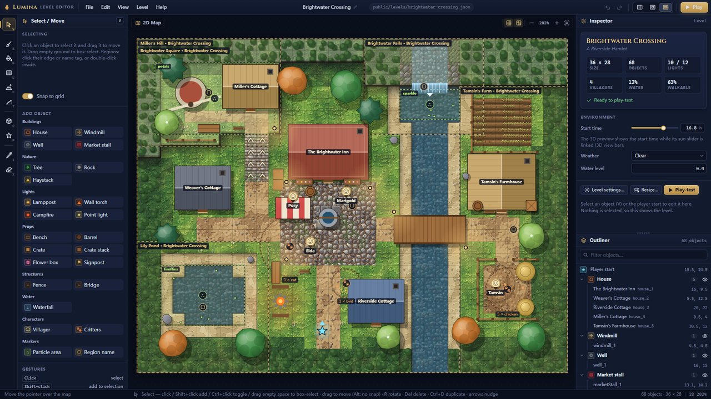
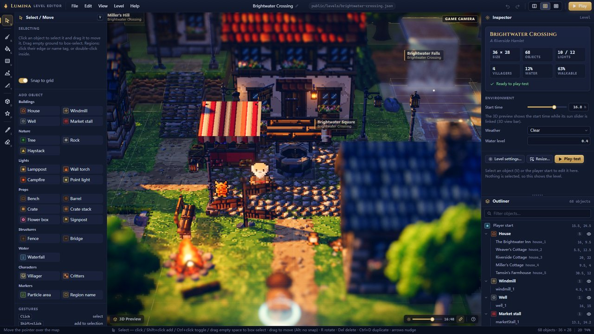
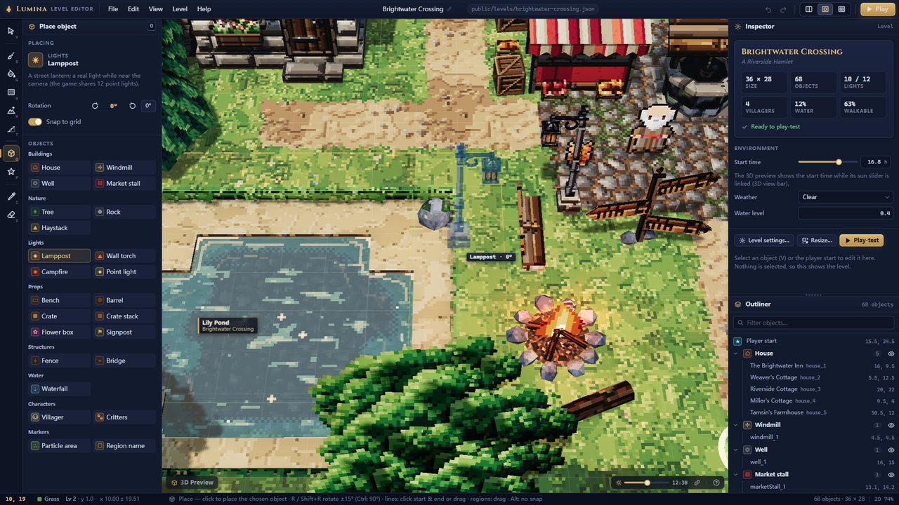
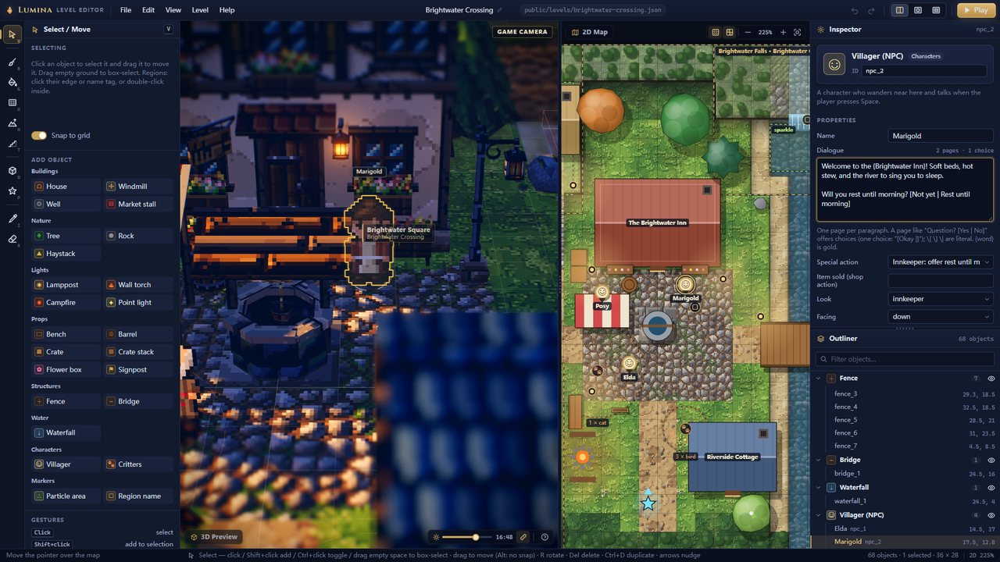
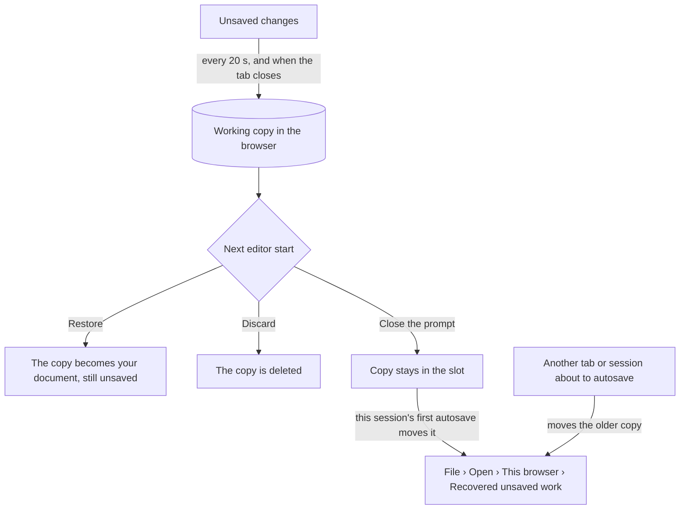

# Level editor guide

> **Purpose** — The complete manual of the Lumina level editor (`editor.html`): layout, views and
> camera controls, every tool with its options and modifier keys, the palettes, the inspector
> (including the dialogue syntax), the outliner, level settings, saving and opening, autosave and
> recovery, play-testing, clipboard and undo, enemies, chests and waystones for combat levels, a
> 15-minute tutorial and the editor's limits.
>
> **Audience** — Level designers, and AI agents that drive or change the editor.
>
> **Source of truth** — [`src/editor/EditorApp.js`](../../src/editor/EditorApp.js) (commands,
> menus, shortcuts, files, play-test), [`src/editor/tools/`](../../src/editor/tools/) (one file per
> tool), [`src/editor/ui/`](../../src/editor/ui/) (`ToolOptions`, `Inspector`, `fields`, `Outliner`,
> `dialogs`, `StatusBar`), [`src/editor/map2d/Map2DView.js`](../../src/editor/map2d/Map2DView.js),
> [`src/editor/viewport3d/Viewport3D.js`](../../src/editor/viewport3d/Viewport3D.js) +
> `EditorCamera.js`, [`src/editor/autosave.js`](../../src/editor/autosave.js),
> [`src/editor/EditorState.js`](../../src/editor/EditorState.js),
> [`src/engine/level/ObjectCatalog.js`](../../src/engine/level/ObjectCatalog.js) and
> [`LevelFormat.js`](../../src/engine/level/LevelFormat.js).
>
> **Related** — [Getting started](GETTING_STARTED.md) · [Shortcut cheat-sheet](shortcuts.html) ·
> [Level format spec](../specs/LEVEL_FORMAT.md) · [Object catalog](../specs/OBJECT_CATALOG.md) ·
> [Level storage API](../specs/LEVEL_STORAGE_API.md) · [Editor architecture](../architecture/EDITOR.md) ·
> [Level design guide](../design/LEVEL_DESIGN_GUIDE.md) · binding contract:
> [contracts/LEVEL_EDITOR.md](../contracts/LEVEL_EDITOR.md)


---

## 1. Opening the editor

Start the dev server (`npm run dev`) and open **http://127.0.0.1:5173/editor.html**. Without the
dev server (a built site, `npm run preview`) everything works except the project folder (saving
to it, listing and deleting its files; `?open=<name>` still opens published levels) — see
[Getting started › Build and deploy](GETTING_STARTED.md#5-build-and-deploy).

| URL | Starts with |
| --- | --- |
| `editor.html` | The *Restore unsaved work?* prompt if an earlier session left unsaved changes, otherwise a blank level *Untitled* (32 × 24 grass, a 2-tile forest border). |
| `editor.html?open=<name>` | `public/levels/<name>.json`, e.g. `?open=emberfall`. |
| `editor.html?local=<slot>` | A level saved in this browser. |
| `editor.html?new` | A blank level, no restore prompt. |

The layout, grid, split position and 3D-preview options of your last session are remembered
(`localStorage` key `lumina.editor.prefs`). "Building the 3D preview…" shows in the 3D pane until
its first full build is on screen.

---

## 2. The editor at a glance

```
+-------------------------------------------------------------------------+
| Menu bar: File Edit View Level Help | name * location | undo redo       |
|           layout: split / 3D / 2D | Play                                |
+----+------------+------------------------+---------------+--------------+
| T  | Tool       |                        |               | Inspector    |
| o  | options    |      3D Preview        |    2D Map     |              |
| o  | and        |   (sun slider, help)   |  (grid, tex,  |              |
| l  | palettes   |                        |   zoom, home) +--------------+
| s  |            |                        |               | Outliner     |
+----+------------+------------------------+---------------+--------------+
| Status bar: tile, height, position | tool help, messages | counts, zoom |
+-------------------------------------------------------------------------+
```

| Area | What it holds |
| --- | --- |
| **Menu bar** | *File*, *Edit*, *View*, *Level*, *Help* menus · the **level name** (click it to open *Level settings*) · a dot while there are unsaved changes (red when autosave failed) · where the level is saved (`public/levels/x.json`, `browser · slot`, `file · name` or *not saved yet*) · **Undo** / **Redo** · the **layout switch** (3D + 2D, 3D only, 2D only) · the gold **Play** button. The browser tab title starts with ● while unsaved. |
| **Toolbar** (far left) | The ten tools in four groups: Select · Paint, Fill, Rectangle, Height, Stairs · Place, Player start · Eyedropper, Erase. Each button shows its key. |
| **Tool options** (left) | The active tool's options and, for terrain and object tools, the **tile palette** or **object palette**. |
| **3D Preview** (centre) | The level rendered by the real engine — terrain, water, props, lights, sprites, sky. |
| **2D Map** | A textured top-down map with object glyphs, labels, region and particle-area outlines and the player start (★). |
| **Inspector** (right, top) | Every field of the selection — or the level summary when nothing is selected. |
| **Outliner** (right, bottom) | All objects by type, with a filter and per-type visibility. |
| **Status bar** | Under the pointer: tile (column, row), tile name, height level and world y, world x / z · the tool's help or the latest message · object count, selection count, level size · 2D zoom. |

Drag the splitter between the views to resize them (20–80 %; double-click it to reset to 60 %),
and the splitter between inspector and outliner to share the right column.

---

## 3. Views and camera controls

### 3.1 Layouts

| Key | Layout |
| --- | --- |
| **1** | 3D + 2D map side by side (split) |
| **2** | 3D only |
| **3** | 2D map only — the lightest on big levels |

The same switch sits in the menu bar and in *View › Layout*.

### 3.2 2D map

| Gesture | Does |
| --- | --- |
| **Wheel** | Zoom toward the cursor (about 19 % – 800 %; 100 % = 16 px per tile) |
| **Right-drag**, **middle-drag** or **Space + left-drag** | Pan |
| **Right-click** (without dragging) | Context menu |
| **Double-click** (Select tool) | Focus the object under the pointer in both views; inside a region or particle area, select it |
| **Home** | Frame the whole level (also the *Frame level* button in the 2D bar) |
| **−** / **+** buttons | Zoom out / in |
| **Ctrl+G** | Grid on / off (also the grid button) |
| texture button | Real tile textures or flat tile colours (*View › Textured 2D map*) |



### 3.3 3D preview

The 3D preview has two cameras: the free **edit camera** (default) and the **gameplay camera**
(*View › 3D: gameplay camera*: the game's 28° lens at the level's camera pitch and distance — 32°
and 30 unless *Level settings › Camera* sets them — what the player will see).

| Gesture | Does |
| --- | --- |
| **Right-drag** | Orbit (in the gameplay camera: turn only) |
| **Middle-drag**, **Shift + right-drag** or **Space + left-drag** | Pan |
| **Wheel** | Zoom toward the point under the cursor |
| **F** | Frame the selection (in both views) |
| **Double-click** (Select tool) | Focus an object; on open ground, look at that point |
| **Hold the right button + W A S D** | Fly (hold **Shift** to fly 2.5× faster) |
| **Hold the right button + Q / E** | Turn while flying |
| **Q / E** (gameplay camera, pointer over the 3D view) | Rotate |
| **Right-click** (short, without flying) | Context menu |
| Click on the sky (Select tool, no modifier) | Clear the selection |

The **3D bar** at the bottom of the pane holds a **sun slider** (0–24 h in quarter hours) that
previews any time of day. While the **link** button next to it is lit, the preview follows the
level's start time; dragging the slider unlinks it, clicking the link re-links it. The **?** button
opens the keyboard shortcut list.

The level's **weather** always shows in the 3D preview the way it looks in the game once it has
settled: rain and snow turn the sunlight grey and cool, the wind picks up, and lanterns and
windows glow a little by day. The falling rain or snow, its haze and the settled snow cover appear
with *3D: particles & god rays* (below), so the tiles stay readable while you edit.

*View › 3D preview* switches on the parts that are off by default to keep editing fast:

| Menu item | Adds |
| --- | --- |
| *3D: gameplay camera* | The game's framing (the pane shows a GAME CAMERA badge). |
| *3D: HD-2D post effects* | Tilt-shift depth of field, bloom and the colour grade. |
| *3D: particles & god rays* | Particle areas, god rays, ground foliage — and, when the level's weather is rain or snow, the **rain / snowfall**, its haze and **snow cover** on the ground, roofs and grass. |



### 3.4 View menu — what is shown

| Item | Effect |
| --- | --- |
| *Frame selection* (**F**) / *Frame level* (**Home**) | Centre the views. |
| *Grid* (**Ctrl+G**), *Textured 2D map* | 2D map drawing. |
| *Show objects* | Props, buildings, villagers… in both views. |
| *Show markers (areas, regions, start)* | Particle areas, regions, critter areas, enemy home rings and boss arenas, and the player start. (In the 2D map enemy groups are markers, like critter groups; in the 3D view their sprites follow *Show objects*.) |
| *Show all hidden types* | Undo every eye toggle of the outliner. |

Hidden objects cannot be picked or box-selected; **Ctrl+A** skips the types hidden with the
outliner's eye toggles.

### 3.5 Context menu (right-click)

- **On an object**: *Focus*, *Duplicate*, *Copy*, *Rotate +90°*, *Pick this type* (switches to
  Place with that type), *Delete*. On the player start: *Focus*.
- **On empty ground**: *Paste here*, *Place player start here*, *Place ‹current object type› here*
  (point objects only), *Frame level*.

---

## 4. The tools

Choose a tool with its key or the toolbar. A **stroke** (press, drag, release) is always **one undo
step**; **Esc** during a stroke cancels it and restores the level as it was.

A drag can also be **interrupted** rather than released: the browser cancels a touch or pen
stroke, a layout change hides the view, or you switch to another window (the 2D map ends the drag
at once; the 3D preview keeps it while the button is held, and a release it never saw counts as an
interruption). Whatever the stroke already did stays, as one undo step — painted tiles, changed
heights, a move so far, erased objects — but nothing is added on release: a Rectangle, a region or
a dragged fence / bridge is not placed, and a box selection or a click on a selected object leaves
the selection as it was.

| Key | Tool | In one line |
| --- | --- | --- |
| **V** | Select / Move | Select, move, reshape, rotate, delete |
| **B** | Paint tiles | Paint the chosen tile with a brush |
| **G** | Fill | Flood-fill a connected area, or replace a tile everywhere |
| **U** | Rectangle | Fill (or outline) a rectangle of tiles |
| **H** | Height | Raise, lower, set, flatten or smooth terrain |
| **T** | Stairs | Turn ledges into stairs, or build a whole flight |
| **O** | Place object | Place the object chosen in the palette |
| **P** | Player start | Move the player start and set its facing |
| **I** | Eyedropper | Pick a tile and level, or an object type |
| **X** | Erase objects | Click or drag across objects to delete them |

Tool keys use the printed letter and never fire while a text field has focus.

### 4.1 Select / Move (V)

| Gesture | Does |
| --- | --- |
| **Click** | Select an object (or the player start ★) |
| **Shift + click** | Add to the selection |
| **Ctrl + click** | Toggle in the selection |
| **Drag on empty ground** | Box-select (Shift adds, Ctrl toggles). Regions, particle areas, critter groups and enemy groups must lie fully inside the box; other objects only need to touch it. Only what the 2D map shows is picked up: hidden types, and critter / enemy groups while *Show markers* is off, stay unselected. |
| **Drag an object** | Move the selection; snaps to 0.5 (the player start to tile centres). Hold **Alt** for free movement. |
| **Drag a handle** | Fences / bridges: move an end point. Regions / particle areas: drag a corner to resize. A boss enemy group: drag an arena corner to resize its arena (gate ends on the dragged edges move with them, so the gate stays on the edge), or a gate end to move the gate. (Handles show while up to 8 objects are selected.) |
| **Click empty ground** / **Esc** | Deselect |
| **Double-click** | Focus; inside a region or particle area: select it |
| **R / Shift + R** | Rotate the selection +15° / −15° (counter-clockwise / clockwise seen from above) |
| **Ctrl + R / Ctrl + Shift + R** | Rotate +90° / −90° |
| **Arrow keys** | Nudge 0.5 (**Shift**: 2, **Alt**: 0.1) |
| **Delete / Backspace** | Delete the selection |
| **Ctrl + D** | Duplicate (the copy is offset by +1, +1) |

Regions and particle areas are picked by their **edge or name tag** with a single click (so you can
still box-select inside a big region); double-click inside one to select it. A group rotates about
its centre; things that only face four ways (the waterfall's *Falls toward*, villagers' facing)
turn in quarter steps.

The tool options show the **Snap to grid** switch (shared with Place and Player start), the object
palette (a click switches to Place) and a gesture reference.

### 4.2 Paint tiles (B)

Drag to paint the tile chosen in the **tile palette**.

- **Brush**: size 1–9 (**[** and **]** anywhere in the editor) and shape square / round.
- **Height › Also set height** + **Level**: painted tiles also get that height level.
- **Shift + click**: a straight line from the end of your previous stroke to the click.
- **Alt + click**: pick the tile and its height level under the pointer.

### 4.3 Fill (G)

Click to flood-fill the connected area of the same tile with the chosen tile.

- **Only same height**: the fill also stops where the height changes.
- **Shift + click**: replace that tile **everywhere** on the map.
- **Also set height** + **Level**, **Alt + click** to pick, as in Paint.
- The preview label shows how many tiles the fill covers (*Fill N tiles → …*, *Replace N tiles →
  …* with Shift).

### 4.4 Rectangle (U)

Drag a rectangle of tiles; the preview shows its size.

- **Outline only** switch, or hold **Shift** while dragging to toggle it for this drag.
- **Also set height** + **Level**, **Alt + click** to pick, **Esc** cancels the drag.

### 4.5 Height (H)

Sculpt the terrain in **height levels**: one level is 0.5 world units, levels run from 0 to 35.
**One level is a walkable step; two or more form a cliff.**

| Mode | Each tile the stroke touches… |
| --- | --- |
| **Raise** | goes up one level (**Shift** lowers) |
| **Lower** | goes down one level (**Shift** raises) |
| **Set** | is set to the **Target level** |
| **Flatten** | takes the level of the tile where the stroke started |
| **Smooth** | takes the rounded average of its 3 × 3 neighbourhood (as it was when the stroke began) |

Each tile changes **once per stroke** — click again to raise further. **Alt + click** copies a
tile's level into *Target level*. Brush size and shape as in Paint.

### 4.6 Stairs (T)

Stairs tiles (`^` `v` `>` `<`) climb **one level per tile** in the direction they rise.

- **Click or drag along a ledge**: each tile becomes stairs rising toward its higher neighbour
  (*Direction* **Auto**), or in the direction you force (**↑ N**, **↓ S**, **→ E**, **← W**). Drag
  along a ledge for wide stairs.
- **Drag across a cliff** — from its foot to its top — to build **a whole flight**: the tiles on the
  low side become stairs one level each (top − 1 next to the cliff, down to the ground). A cliff
  three levels high needs three tiles of stairs. The stroke is re-planned as it grows and stays one
  undo step.
- The status bar says what is missing: *drag N more tiles away from the cliff*, *No higher
  neighbour here*, or *The ledge is N levels high*.

### 4.7 Place object (O)

Pick an object in the **object palette**, then click in either view. A translucent **ghost** shows
exactly what the click will place — including the variation (seed) of trees, rocks and houses; a
new seed is rolled after every placement, so repeated props differ. The new object is selected, so
its fields appear in the inspector at once.

| Object kind | How to place |
| --- | --- |
| **Point** objects (almost everything) | Click. |
| **Lines** — Fence, Bridge | Click the start, then the end — or drag from start to end. **Esc** cancels a started line. |
| **Areas** — Region name | Drag a rectangle (a simple click makes a 4 × 4 region). |

- **R / Shift + R** turn the ghost ±15°, **Ctrl + R / Ctrl + Shift + R** ±90°; the *Rotation* row in
  the tool options has ±15° buttons and a **0°** reset. The rotation is remembered **per object
  type** (turning a house does not turn the next lamppost). At 0° a house's door faces **south**,
  toward the default camera; +90° turns it to face east.
- **Snap to grid** (0.5) — hold **Alt** for a free position.
- Types that cannot rotate say so in the status bar.



### 4.8 Player start (P)

Click or drag to move where the player appears (the ★). It snaps to tile centres (**Alt**: free).
**R / Shift + R** turn its facing (down → right → up → left), or use the facing buttons in the tool
options. The tool warns when the spot is not walkable — a level cannot be play-tested until the
player start stands on walkable ground or a bridge deck.

### 4.9 Eyedropper (I)

Click a tile to pick its **tile and level** (you return to the previous tool if it was Paint, Fill,
Rectangle or Height, otherwise to Paint), or an object to pick its **type** (you switch to Place).
Hold **Shift** to stay in the eyedropper.

### 4.10 Erase objects (X)

Click an object to delete it, or drag across several — the whole stroke is one undo step. Terrain
is not affected (paint over tiles to change them).

---

## 5. The palettes

### 5.1 Tile palette (Paint, Fill, Rectangle)

Real texture swatches, grouped. Hover a swatch for its name, character and flags.

| Group | Tiles (character) |
| --- | --- |
| **Ground** | Grass `g` · Dark grass `G` · Flower grass `f` · Farmland `F` · Sand `s` · Mossy stone `m` |
| **Paths & floors** | Dirt path `.` · Dirt `d` · Cobblestone `c` · Stone tiles `k` · Wooden deck `b` |
| **Water** | River `~` · Plunge pool `p` (slow flow) · Fast stream `w` · Still pond `o` |
| **Stairs** | Stairs up north `^` · south `v` · east `>` · west `<` (normally made with the Stairs tool) |
| **Blocked & void** | Forest floor (blocked) `T` — the game grows border forest on it · Rock (blocked) `x` · Void (space) — no ground at all |
| **Custom** | Extra legend characters a level file defines (e.g. Starfall Vale's east-flowing river); only one-character keys — a longer key from a hand-written file is listed in the *Opened with warnings* dialog instead and cannot be painted |

**Water depth.** Water tiles whose bed is below the level's **water level** (0.4 world units by
default, *Level settings › Water*) fill up to it; water tiles whose bed is at or above it get their
own surface 0.35 above the bed — so a stream on a plateau just works. For a river or pond in
ground at level 2, give the water tiles **level 0** (the *Also set height* switch) and, for gentle
banks, a ring of sand at **level 1**.

### 5.2 Object palette (Place, Select)

| Category | Objects |
| --- | --- |
| **Buildings** | House · Windmill · Well · Market stall |
| **Nature** | Tree · Rock · Haystack |
| **Lights** | Lamppost · Wall torch · Campfire · Point light (invisible) |
| **Props** | Bench · Barrel · Crate · Crate stack · Flower box · Signpost |
| **Structures** | Fence (line) · Bridge (line) |
| **Water** | Waterfall |
| **Characters** | Villager (NPC) · Critters |
| **Markers** | Particle area · Region name |
| **Combat** | Enemy group · Treasure chest · Waystone (checkpoint) — see [§5.3](#53-combat-enemies-chests-and-waystones) |

Hover a button for its help text. Every field of every type is listed in the
[object catalog spec](../specs/OBJECT_CATALOG.md); the most useful notes:

- **House** — the door only becomes interactive when *Text when knocking* has text; *Door lantern
  casts light* adds a real light at night.
- **Lights** — use as many as you like: the game has 12 real point lights and shares them among the
  lights around the player (they crossfade as you walk). The inspector's level card shows the count
  (*10 / 12*, or *30 · 12 lit*).
- **Waterfall** — place it on the **edge** between a higher and a lower water tile; *Falls toward*
  (N / S / E / W) is the direction the water falls.
- **Villager** — see [§6.3](#63-villagers-dialogue-actions-and-behaviours).
- **Critters** — chickens, cats, birds or dogs: *Count* 1–8 roaming a *Roam radius*. Chickens
  scatter from the player; birds take flight.
- **Particle area** — a box of fireflies (night only), leaves, petals, dust, embers, smoke, mist or
  sparkles. *Size X / Y / Z*, *Height above ground*, *Particles* 1–200. (The *rain* and *snow*
  presets follow the camera; use the level's weather for precipitation.)
- **Region name** — the HUD shows its name while the player is inside. *Only above height* limits
  it to high ground — it is a **world height** (level × 0.5), and the player must stand strictly
  above it; *Arrival banner subtitle* shows a banner the first time the player enters.
  **The first matching region wins**, in object order — place small regions before the big ones
  they sit in.

### 5.3 Combat: enemies, chests and waystones

A level **plays with combat** as soon as it has an **Enemy group** (or when *Level settings ›
Environment › Combat* is *On*, [§8.1](#81-level-settings)). The player then carries a sword, has
health, mana and stamina, gains levels and respawns at the last Waystone. Levels without enemies
stay peaceful exactly as before. The demo level *Cinderwatch Pass* shows every combat object —
open it (`editor.html?open=cinderwatch-pass`) to see how it is built.

| Object | Fields | Notes |
| --- | --- | --- |
| **Enemy group** (⚔) | *Kind* (Moss Slime, Bramble Goblin, Thorn Archer, Hex Shaman, Cinder Bat, Ironhide Boar, Straw Dummy, Cinderheart (boss)), *Count* 1–8, *Home radius* 0.5–12, *Level* 1–10, *Elite*, *Name plate (optional)* | One object is a whole pack. The enemies start scattered over the home radius on walkable ground (bats may also start over water) and return there when they lose the player. *Level* scales health, damage, XP and gold (a boss's level is only shown); an *Elite* has more health and damage, is worth more, always drops a heart and shows its health bar in a gold frame with the *Name plate* (or *Elite …*). The **Straw Dummy** never attacks — a training target. |
| **Cinderheart** (boss) | as above (its *Count* stays 1), plus the **Boss arena** section | Always one boss per group: its *Count* field stops at 1, and switching a group's *Kind* to Cinderheart sets it to 1. It needs an **arena** (the fight is locked inside it) and a **gate** on the arena's edge (it closes behind the player). Select the group and click **Add arena and gate** in the inspector: an 18 × 18 arena around it with the gate in its south edge; then drag the arena corners and the gate ends with the select tool, or type the values (relative to the group). Resizing the arena by a corner keeps the gate on its edge; **Ctrl+R** turns the arena and gate with the boss (in 90° steps only — a 15° turn of a selection leaves them as they are). Only the boss kind uses them: a group switched to another *Kind* keeps its arena in the file, but the views no longer show it and *Check for problems* reminds you to remove it. One boss per level. |
| **Treasure chest** (▣) | *Rotation* (the front faces the camera at 0°), *Gold* 0–500, *Healing Draughts* 0–5, *Upgrade* (None, Max HP +20, Max MP +10, Attack +3) | **Space** opens it on a combat level; its contents pop out as pickups. Leave room in front of it. On a peaceful level it can only be examined. |
| **Waystone** (◆) | *Name* | A checkpoint: walking close attunes it (the player respawns there after a defeat); **Space** rests (full heal, the enemies return). Put one near the start and one before every hard fight. |


What the views show:

- **2D map** — an enemy group is a dashed red ring of its home radius (gold for elites) with a dot
  where each enemy starts and, zoomed in or selected, a tag like `slime ×3 · Lv1`; a boss shows its
  arena (dashed) and gate (bright bar). Chests are drawn as small chests with the lock at the
  front, waystones as a stone with a blue crystal.
- **3D preview** — the enemies stand idle at their start spots (bats hover), with the home ring
  and the boss arena and gate drawn on the ground; a selected group also gets a name tag. The
  enemies of one kind are drawn together (a few draw calls for a whole level of packs). The first
  time you pick the *Enemy group* tool the view may pause once for a moment while it prepares
  them. The preview shows plain sprites: hit flashes, glowing eyes and magma, the combat HUD and the attack
  markers appear only in the game — press **F5** to play-test.
- **Start spots** are the game's: an enemy starts on standable ground — a walkable tile or a
  bridge deck, never open water (bats may also start over water) — and not inside a prop or a
  villager. Paint water under a pack, or put a rock, chest or villager into it, and its members
  move at once, as they would in the game — in every layout, the **2D only** one included (the
  dots then use the props' real collision shapes too). Right after opening a level the dots may
  move once, when the 3D view has built the props.
- **Inspector** — with nothing selected the level card adds a line *Enemies n (groups g) ·
  Waystones n · Chests n* (in the warning colour when combat is switched off although enemies are
  placed, or when a combat level has no waystone).

*Level › Check for problems* warns about the usual combat mistakes ([§8.3](#83-check-for-problems)).
Good practice: keep enemies at least 12 tiles away from the player start, keep other packs 6 tiles
away from the boss arena (no other enemy can enter it, but a pack beside it crowds against its edge
and is sent home when the fight starts), and play-test often.

---

## 6. The inspector

### 6.1 What it shows

| Selection | Inspector |
| --- | --- |
| **Nothing** | The **level card**: name, subtitle (or *by ‹author›*), *Size*, *Objects*, *Lights*, *Villagers*, *Water* and *Walkable* (percent of the tiles), on combat levels a line *Enemies n (groups g) · Waystones n · Chests n*, and a status line (*Ready to play-test* or the problems). **Environment**: *Start time*, *Weather*, *Water level*. With rain or snow set and the particles preview off, a hint says "Rain and haze show in the 3D view with particles on." (or "Snowfall and snow cover show …") with a **Show it** button that turns it on. Buttons: *Level settings…*, *Resize…*, *Play-test*. |
| **One object** | A header with the type, category and an editable **id**, the type's help, **Properties** (the catalog fields), **Transform** and *Focus* / *Duplicate* / *Delete*. A boss enemy group also has a **Boss arena** section ([§5.3](#53-combat-enemies-chests-and-waystones)). |
| **Several objects** | The count, one row per type (click a row to keep only that type), *Focus*, *−90°*, *+90°*, *Duplicate*, *Delete*; when all are the same type, **Shared … properties** — edits apply to every selected object, differing values show blank or *mixed*. |
| **The player start** | *X*, *Z*, *Facing*, a status line (*On walkable ground*, *On a bridge deck*, *Not walkable — …*, *Outside the map*), *Focus*, *Snap to tile centre*. |

**Transform** holds *X / Z* for point objects, *Start / End X / Z* and the length for fences and
bridges, *Min / Max X / Z* and the size for regions, plus *Rotation* where it applies.

**Ids** can be renamed in the header: letters, digits, `_` and `-`, unique, and not `spawn`
(reserved for the player start).

Every edit is undoable; dragging a slider is a single undo step.

### 6.2 Field types

| Field | Control | Behaviour |
| --- | --- | --- |
| Number / whole number | slider + number box | Typed values are clamped to the field's range. With the box focused, the mouse wheel steps it. **Enter** commits, **Esc** restores. |
| **Nullable number** | slider + number box that shows *auto* when blank + a × button | Blank means "automatic": a bridge's *Deck height (blank = auto)*, a region's *Only above height (blank = any)*. × clears it. |
| Angle | slider + box in degrees | −180° to 180° in 15° steps; typed values wrap round. Stored in radians. |
| Switch | toggle | |
| Choice | dropdown | An empty option reads *(none)*. |
| Colour | colour swatch + hex box | `#abc` expands to `#aabbcc`. |
| Text | one line | Commits on **Enter** or when you leave the field; **Esc** restores. |
| **Pages** (sign text, knock text, well text) | multi-line box with a page count | **One page per paragraph** — separate pages with a blank line; a single line break stays a line break inside the page. **Ctrl + Enter** commits. |
| **Dialogue** (villagers) | multi-line box with page and choice counts | Pages as above, plus choices — next section. |

In any text, `{word}` is shown in **gold** in the game — use it for names and places.

### 6.3 Villagers: dialogue, actions and behaviours



**Dialogue syntax**

```text
Welcome to the {Copper Kettle}! Soft beds and a
fire that never goes out.

Will you rest until morning? [Not yet | Rest until morning]
```

- A **blank line** starts a new page.
- A page that **ends with `[answer | answer | …]`** is a question with choices. A bracket group
  without `|` is ordinary text. A single answer written as `[Okay |]` is a question with one
  answer; the game shows it as a one-item choice list.
- `\[`, `\]`, `\|` and `\\` type those characters literally.
- The field header counts the pages and choices, e.g. *2 pages · 1 choice*.
- Choices do **not** branch the conversation: the following pages are shown whatever the player
  answers. The answer matters for the villager's *Special action* (below).

**Special action**

| Action | In the game |
| --- | --- |
| *Just talk* | Only the dialogue. |
| *Innkeeper: offer rest until morning* | If your dialogue does not end with a question, the game adds *Will you rest until morning? [Not yet \| Rest until morning]*. Any answer but the first fades to 08:00. If your dialogue ends with a one-answer question (`[Good night \|]`), that answer does. |
| *Merchant: sell an item* | Adds *Would you like the ‹item›? [Just looking \| Yes, please]* unless your dialogue ends with a question. Any answer but the first gives the item (field *Item sold (shop action)*, blank = "Crisp Apple"); with a one-answer closing question of your own, that answer gives it. |
| *Bard: play music (offers quiet when playing)* | Starts the music when it is silent. When it is already playing, the game asks *Another song, or a little quiet?*; *Some quiet* stops it. If your dialogue ends with its own question, any answer but the first plays the music (a one-answer question: that answer). |

**Other villager fields**: *Name* (shown on the name plate), *Look* (14 character presets:
traveler, swordsman, merchant, cleric, scholar, dancer, hunter, villager, farmer, elder, child,
guard, innkeeper, bard), *Facing*, *Behaviour* — **wander** (strolls within *Wander radius* of its
spot), **post** (stands and looks around), **perform** (faces its audience, like a bard), **chase**
(runs after the chickens) — *Walk speed*, *Name plate colour*, and *Built-in script*, which replaces
the dialogue with one of Emberfall's hand-written conversations (elder, innkeeper, merchant, guard,
farmer, child, bard, scholar).

---

## 7. The outliner

- Objects grouped by type with a count; the **Player start** row sits on top.
- **Filter objects…** matches ids, names, type names and categories (**Esc** clears it).
- Click a **group header** to collapse it; **Shift / Ctrl + click** it to add every object of the
  type to the selection.
- The **eye** on a header hides that type in both views (and from picking and select-all).
- Click a row to select, **Shift + click** to add, **Ctrl + click** to toggle, **double-click** to
  focus it. Rows show each object's position.

---

## 8. The Level menu

### 8.1 Level settings…

Also opened by clicking the level name in the menu bar. *Apply* makes one undoable edit.

| Tab | Fields |
| --- | --- |
| **General** | *Name* (title screen and banner), *Subtitle*, *Author*, *Description* |
| **Environment** | *Start time* (0–24 h; 17.2 = golden hour, 21+ = night), *Clock runs*, *Weather* (clear / rain / snow — the 3D preview shows its grey light and lanterns; the rain / snow, haze and snow cover with *View › 3D: particles & god rays*), *Map border* (forest / none), *Outer scenery*, *God rays*, *Dust motes*, *Music*, *Minimap*, *Combat* — *Auto* (combat is on when the level has an enemy group; the default), *On* (the player's sword, skills and draughts even without enemies) or *Off (peaceful)* (enemies are not spawned; chests and waystones can only be examined). Only *On* and *Off* are written into the level file; choosing *Auto* again removes the setting. |
| **Camera** | *Distance* (12–60, blank = 30), *Pitch* (10–80°, blank = 32°), *High ground: steeper camera on high ground* with *…above height* (world height = level × 0.5; default 3) and *…pitch* (default 40°) |
| **Water** | *Water level*, *Flow* (x · z ripple drift), *Reflection*, *Neutral tint*, *Glints* (1 = default; fewer suits a big calm lake) |

Camera focus bounds, title texts, the title camera, god-ray areas, foliage and forest zones, the
outer-scenery tuning (`scenery`) and `fogScale` have no dialog fields; they are kept when you edit.
See [specs/LEVEL_FORMAT.md](../specs/LEVEL_FORMAT.md).

### 8.2 Resize level…

New width and depth (8–128 each), a **3 × 3 anchor** (the content stays attached to that side; the
arrows show where the map grows or shrinks) and the tile for new ground. Shrinking removes the
tiles outside the new edges; objects are kept (and moved with the content).

### 8.3 Check for problems

Lists **problems** that must be fixed before play-testing (for example *The player start is on
water, void or blocked ground…*) and **things to consider**:

- a bridge end more than a step (0.55) above or below its bank — the player could not get on or off;
- objects outside the map;
- no villagers yet;
- houses without *Text when knocking* (their doors are not interactive);
- walkable ground reaching the map edge ("the player can walk to the edge of the world there") —
  block it with forest `T` or rock `x`;
- on combat levels: no Waystone; enemies that would start off walkable ground; enemies (not
  training dummies) starting within 12 tiles of the player start; a boss without arena or gate;
  a boss gate whose end lies more than half a tile off the arena's edge (its ember wall would not
  meet the barrier); more than one boss; an arena left on a group that is not the boss (the game
  ignores it); a boss whose *Count* is above 1 (a hand-edited file — the game spawns one);
  enemy groups whose home (radius + 2) comes within 6 tiles of the boss arena; combat switched
  *Off* while enemies are placed.

**Deeper checks.** The generated levels pass stricter checks than this menu runs. To give your level
the same, save it and run, in a terminal in the project folder:

```bash
npm run level:check -- my-level
```

(`my-level` is the file name in `public/levels/`, without `.json`.) It lists **errors** — a
villager, door, sign or well nobody can reach, a broken stair, waterfall or bridge — and
**warnings** — anything the camera cannot see past a roof or a tree, overlapping props, uneven
footprints, places outside every region. It never changes the file. Details:
[Level design guide §14](../design/LEVEL_DESIGN_GUIDE.md#from-the-command-line-any-level).

### 8.4 Play-test (F5, the Play button)

Checks the level, stores it in the browser slot `__playtest__` and opens
`index.html?level=local:__playtest__&autostart=1` in a tab named *lumina-playtest* — pressing
**F5** again later reuses that tab. The game starts straight in gameplay; audio starts at your first
key press or click. A level with enemies plays with combat (see *Combat* in [§8.1](#81-level-settings)). If problems block it, a dialog lists them (with *Select player start* when the
start is the problem). If the pop-up is blocked, allow pop-ups for the editor — the level is already
in the slot.

*Level › Open saved level in the game* (enabled for levels saved in the project folder) opens
`index.html?level=<name>` in a new tab.

---

## 9. Files: new, open, save

### 9.1 Where levels live

| Place | Stored as | Save with | Open with | Play with |
| --- | --- | --- | --- | --- |
| **Project folder** (dev server only) | `public/levels/<name>.json` — ships with the game | *Save as › Project folder* | *Open › Project folder*, `editor.html?open=<name>` | `index.html?level=<name>` |
| **This browser** | `localStorage` key `lumina.level.<slot>` | *Save as › This browser* | *Open › This browser*, `editor.html?local=<slot>` | `index.html?level=local:<slot>` |
| **A file** | `<name>.level.json` in your downloads | *Save as › Download file*, **Ctrl+E** (a copy) | *Open › File on disk*, or drop it on the window | copy it to `public/levels/<name>.json` |

File and slot names are **slugs**: lower case, digits and dashes (*My River Village!* →
`my-river-village`; a name without Latin letters or digits becomes `level-<hash>`). The shipped
levels are `emberfall`, `starfall-vale` (generated — edit
[`tools/make-starfall-vale.mjs`](../../tools/make-starfall-vale.mjs) instead for lasting changes),
`brightwater-crossing` and `sample-hamlet` (also written by
[`tools/make-sample-hamlet.mjs`](../../tools/make-sample-hamlet.mjs): re-running that script
overwrites editor changes).

### 9.2 New level (Alt+N, Ctrl+N, File › New level…)

*Name*, *Size* (8–128 each way; presets **Small 24 × 18**, **Medium 32 × 24**, **Large 48 × 40**,
**Huge 64 × 64**), *Ground* tile, *Ground level* (default 2 = 1.0 units — leave room below for
rivers and ponds) and *Forest border* width (0–8, default 2). The editor then switches to the Paint
tool. Chrome keeps **Ctrl+N** for a new window — use **Alt+N**.

### 9.3 Open (Ctrl+O)

Three tabs: **Project folder** (name, file, size, age; only with the dev server), **This browser**
(saved levels and *Recovered unsaved work*) and **File on disk**. Double-click a row, press Enter
or use *Open*; the bin icon deletes a file or browser level after a confirmation. You can also
**drop a `.json` file** anywhere on the editor, or **paste** a whole level's JSON (Ctrl+V) — it opens
as a new, unsaved document.

Every open reads and checks the level **before** asking about unsaved changes, so a broken file
never costs your current work. A level whose data had to be adjusted opens with an *Opened with
warnings* list.

### 9.4 Save (Ctrl+S) and Save as (Ctrl+Shift+S)

**Ctrl+S** saves back to where the level came from: the project file, the browser slot, or — for a
level opened from a file — a fresh download. A new level goes to *Save as*.

*Save as* asks for the **File name** and a destination card (**Project folder** — "ships with the
game; playable at ?level=‹name›", **This browser**, **Download file**) and shows the exact target.
While the level is still called *Untitled* it also asks for the **Level name** shown on the title
screen. Saving over an existing file or slot asks first; saving over a file written by a **newer
engine version** warns that unknown data may be lost.

A download counts as saved, but a recovery copy stays in the browser. **Ctrl+E** (*Download .json*)
downloads a copy without changing where the level is saved. **Ctrl+S**, **Ctrl+Shift+S** and **F5**
work even while you are typing in a field (the field commits first).

### 9.5 Autosave and recovery



The working copy lives in the browser slot `__autosave__` (`localStorage` key
`lumina.level.__autosave__`, meta in `lumina.editor.autosave`); see
[`src/editor/autosave.js`](../../src/editor/autosave.js). A copy made by a download (*Save as ›
Download file*) is kept as a safety net but not offered at the next start.

- While there are unsaved changes, the working copy is written every **20 seconds** and when you
  close the tab (the browser also asks *Leave site?*).
- Saving removes the working copy. Choosing *Don't save* in the unsaved-changes dialog removes it
  once another level has really replaced the document.
- A copy the editor could not offer — another editor tab, a dismissed prompt, a start through
  `?open=`, `?local=` or `?new` — is never overwritten: it moves to **Recovered unsaved work** (the
  newest 3 are kept). `?open=` / `?local=` offer the restore when the copy belongs to that level.
- If the browser storage is full, the unsaved dot turns red and a message says *Autosave failed* —
  save your level.

The unsaved-changes dialog (new, open, paste a level) offers **Don't save**, **Cancel** and
**Save**.

---

## 10. Editing

| Action | Keys | Notes |
| --- | --- | --- |
| Undo / redo | **Ctrl+Z** / **Ctrl+Y** or **Ctrl+Shift+Z** | Up to 200 steps. One stroke, drag or slider drag = one step. The undo button's tooltip names the step. Opening or creating a level clears the history. |
| Copy / cut / paste | **Ctrl+C** / **Ctrl+X** / **Ctrl+V** | Objects only. Paste lands at the pointer when it is over a view (snapped to 0.5), otherwise offset by +1, +1. Copied objects also go to the system clipboard as JSON (`"format": "lumina-objects"`), so you can paste between editor tabs. |
| Duplicate | **Ctrl+D** | Offset by +1, +1. |
| Delete | **Delete** / **Backspace** | |
| Select all objects | **Ctrl+A** | Skips types hidden in the outliner. |
| Deselect / cancel | **Esc** | Cancels the current drag or pending line / region first. |
| Rotate | **R / Shift+R** ±15°, **Ctrl+R / Ctrl+Shift+R** ±90° | The selection, or the Place ghost. |
| Nudge | **arrows** 0.5, **Shift** 2 (**Alt** 0.1 in the Select tool) | |
| Brush size | **[** / **]** | 1–9. |
| Frame | **F** selection, **Home** level | |
| Shortcut list | **?** | Also *Help › Keyboard shortcuts*. |

On a Mac, **Cmd** works wherever Ctrl is listed. The complete printable list is in
[shortcuts.html](shortcuts.html).

---

## 11. Tips for good-looking levels

The [level design guide](../design/LEVEL_DESIGN_GUIDE.md) explains the craft; the essentials:

- **Leave room below**: build on ground level 2, sink rivers and ponds to level 0 with sand at
  level 1, raise hills to level 5–8. Height is what makes the diorama read.
- **Break up big areas**: mix grass, dark grass and flower grass, and let paths wander; the game
  adds grass tufts, flowers and bushes on top.
- **The camera looks north**: keep tall trees and houses from standing just south of villagers,
  doors and signs — they would hide them. Check with *View › 3D: gameplay camera*.
- **Light the night**: lampposts along paths, door lanterns, a campfire; look at the level at
  night with the sun slider.
- **Give things words**: knock texts, sign texts and villagers with a special action make a place
  feel alive. Regions with arrival banners name the areas (small regions first).
- **Close the edges**: keep the forest border, or block open edges with `T` / `x` tiles.
- **Play it**: F5 often, and press **T** in the game to see every hour.

---

## 12. Tutorial: build a small hamlet in 15 minutes

We will build **Thistledown**: a cobbled square with an inn, a brook with a bridge, a hill with a
windmill and stairs, a farm plot, two villagers and a region — then play it. Watch the **status
bar**: it shows the tile (column, row) under the pointer. Coordinates below are tiles.

**1. A new level (1 min).** Press **Alt+N**. Name: `Thistledown`; size **Medium 32 × 24**; Ground
*Grass*; Ground level **2**; Forest border **2** → **Create**. The playable area is columns 2–29,
rows 2–21. Press **3** for the 2D map only while you shape the terrain.

**2. The square and the road (1 min).** Press **U** (Rectangle), pick **Cobblestone** in the tile
palette and drag from tile (12, 8) to (19, 13). Press **B** (Paint), pick **Dirt path**, press
**]** once (brush 2). Click at (15, 14), then **Shift + click** at (15, 20): a straight road, two
tiles wide, runs south to the forest.

**3. The brook (2 min).** Press **U**, pick **River**, switch on **Also set height** and set
*Level* to **0**. Drag from (23, 0) to (24, 23) — a two-tile brook right across the map. For sandy
banks, press **B**, press **[** (brush 1), pick **Sand**, set *Level* to **1**, click (22, 2) and
**Shift + click** (22, 21); then click (25, 2) and **Shift + click** (25, 21). Switch *Also set
height* off again.

**4. A hill with stairs (2 min).** Press **H** (Height), choose **Set**, *Target level* **5**,
brush **3**, and paint over the north-west corner, columns 3–9, rows 2–6. Press **T** (Stairs) and
drag from (6, 9) straight up to (6, 6): three stairs tiles climb the three levels. Drag again from
(7, 9) to (7, 6) for wide stairs. (If the status bar says tiles are missing, start the drag one
tile further south.)

**5. Buildings (2 min).** Press **O** (Place) and pick **House**. Click at (15.5, 6): the ghost
shows the door facing south onto the square. In the inspector set *Name* `The Copper Kettle`,
*Stories* 2, *Hanging sign* on, *Door lantern casts light* on, and *Text when knocking*
`Laughter and the smell of stew drift through the door.` For a second house west of the square,
press **Ctrl + R** first (the ghost turns +90°, door facing east) and click at (10, 12); give it a
knock text too (press **Ctrl + Shift + R** afterwards to turn the ghost back). Then, from the
palette: a **Well** at (15.5, 10.5), a **Market stall** at (18, 12), **Lampposts** at the square's corners, a **Windmill** on the hill at (6, 3.5) and a few
**Trees** round the edges (each gets its own seed).

**6. The bridge and the farm (2 min).** Pick **Bridge**, click (21.5, 11.5) on the west bank and
(26.5, 11.5) on the east bank. On the far side, press **U**, pick **Farmland** and drag (26, 14) to
(28, 18). Pick **Fence**, click (26, 13.5) then (29.5, 13.5) along the plot's north side; place
**Critters** at (27, 16) (the default is 4 chickens). Add a **Signpost** by the road at (14, 15)
with *Sign text* `↑ {Thistledown} · → the brook`.

**7. Villagers (2 min).** Pick **Villager (NPC)** and click at (14, 8.5), outside the inn. In the
inspector: *Name* `Hazel`, *Look* innkeeper, *Special action* **Innkeeper: offer rest until
morning**, and *Dialogue*:

```text
Welcome to the {Copper Kettle}, traveller!

Will you rest until morning? [Not yet | Rest until morning]
```

Place a second villager by the stall at (18, 13.5): *Name* `Bram`, *Look* merchant, *Behaviour*
**post**, *Special action* **Merchant: sell an item**, *Item sold* `Honey Bun`, *Dialogue*
`Fresh from the oven, still warm!`.

**8. Regions (1 min).** Pick **Region name** and drag over the hill, (2, 2) to (10, 7): *Name*
`Mill Hill`, *Only above height* **2**, *Arrival banner subtitle* `Where the sails turn`. Then drag
a second region over the whole playable area, (2, 2) to (30, 22): *Name* `Thistledown`, *Subtitle*
`A Hamlet on the Brook`. The hill region comes first in the list, so it wins on the hill.

**9. Player start and settings (1 min).** Press **P** and click the road at (15.5, 20.5); click
**↑** in the tool options so the player faces north. Click the level name in the menu bar
(*Level settings*): *Subtitle* `A Hamlet on the Brook`; on the **Camera** tab switch on *High
ground* (above height **2**, pitch **40**) → **Apply**.

**10. Check, save, play (1 min).** *Level › Check for problems* and fix what it lists. Press
**Ctrl+S**: file name `thistledown`, destination **Project folder** → **Save** (it writes
`public/levels/thistledown.json`). Press **F5** to play-test, walk up the road, knock on the inn,
talk to Hazel and Bram, climb the stairs — and press **T** a few times for the night. From now on the
level also plays at **http://127.0.0.1:5173/?level=thistledown**.

Press **1** to return to the split layout and look at your hamlet in 3D; try
*View › 3D: HD-2D post effects* and the sun slider.

---

## 13. Keyboard and mouse summary

| Group | Keys |
| --- | --- |
| **File** | Ctrl+N / Alt+N new · Ctrl+O open · Ctrl+S save · Ctrl+Shift+S save as · Ctrl+E download .json · F5 play-test |
| **Tools** | V select · B paint · G fill · U rectangle · H height · T stairs · O place · P player start · I eyedropper · X erase |
| **Edit** | Ctrl+Z undo · Ctrl+Y / Ctrl+Shift+Z redo · Ctrl+C / X / V copy, cut, paste · Ctrl+D duplicate · Delete / Backspace delete · Ctrl+A select all · Esc deselect / cancel |
| **Selection & placing** | R / Shift+R ±15° · Ctrl+R / Ctrl+Shift+R ±90° · arrows nudge 0.5 (Shift 2; Alt 0.1 in the Select tool only) · Alt no snapping · Shift+click add · Ctrl+click toggle |
| **Terrain** | [ / ] brush size · Alt+click pick tile / level · Shift+click straight line (paint) · Shift invert raise / lower (height) · Shift replace everywhere (fill) · Shift outline (rectangle) |
| **View** | 1 / 2 / 3 layout · F frame selection · Home frame level · Ctrl+G grid · ? shortcut list |
| **2D map** | wheel zoom · right / middle / Space+drag pan · double-click focus · right-click menu |
| **3D view** | right-drag orbit · middle / Shift+right / Space+drag pan · wheel zoom · F / double-click focus · right button + WASD fly (Shift faster) · right button + Q / E turn · Q / E rotate (gameplay camera) |

---

## 14. Limits and known quirks

| Limit | Details |
| --- | --- |
| Level size | 8 to 128 tiles each way. Levels wider or deeper than 64 tiles use the big-level batching (in the game and in the preview). |
| Heights | Levels 0–35 (world height up to 17.5). |
| Opening big levels | Levels with more than 72 × 72 = 5 184 tiles or more than 300 objects open under a loading overlay (`EditorApp._withLoading`); the page is blocked for about **0.6 s** (96 × 96) to **2 s** (128 × 128) while the terrain builds. |
| Strokes on big levels | Measured on Starfall Vale in the split view: stroke frames p95 18–36 ms, max 36–54 ms (an earlier 128 × 128 stress test had 15–28 % of stroke frames at ~33 ms). Use the **2D only** layout for heavy terrain work. |
| Placing a well | Placing a well costs one 66–83 ms frame (measured; not fixed). |
| Region labels in 3D | Pinned above the region's centre and not kept inside the view, so a label near the view's edge can be cut off. |
| Enemies in the preview | Idle sprites without the game's hit flash, glow, health bars or attack markers; they do not move. Their start spots are the game's (props, villagers, bridge decks and water included); only in the **2D only** layout can a 2D dot sit inside a prop other than a chest or waystone, since that layout has no built props to test. |
| Undo | 200 steps; cleared by New / Open. |
| Browser storage | Shared per address and port (`127.0.0.1:5173` ≠ `localhost:5173`) and limited in size; keep important levels in the project folder or as files. |
| Project saves | Dev server only; names are `a–z`, `0–9`, `-` (up to 60 characters); Windows device names such as `con` get a `-level` suffix; files up to 4 MB. |
| Ctrl+N | Reserved by Chrome in normal tabs — use **Alt+N**. |
| Rain and snow in the preview | The grey light, wind and glowing lanterns always show; the falling rain / snow, its haze and the snow cover only with *View › 3D: particles & god rays* on. The preview shows the weather settled (the game blends into it over a few seconds) and keeps its own time-of-day look (no night desaturation, god rays not tied to golden hour). |
| One-answer closing questions | A villager whose dialogue ends with `Question? [Okay \|]` runs its *Special action* (rest, shop, music) with that only answer — the player cannot decline. Use two answers, the harmless one first, when they should be able to. |
| Browser shortcuts in text fields | While a text field has focus the editor only handles Ctrl+S, Ctrl+Shift+S and F5; other browser shortcuts (such as Ctrl+R, reload) go to the browser. The *Leave site?* prompt and the autosave still protect unsaved work. |

See also [ai/KNOWN_ISSUES.md](../ai/KNOWN_ISSUES.md) and the editor's performance design in
[contracts/LEVEL_EDITOR.md §9](../contracts/LEVEL_EDITOR.md).
