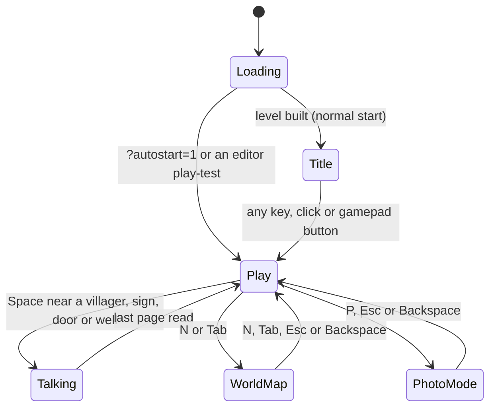
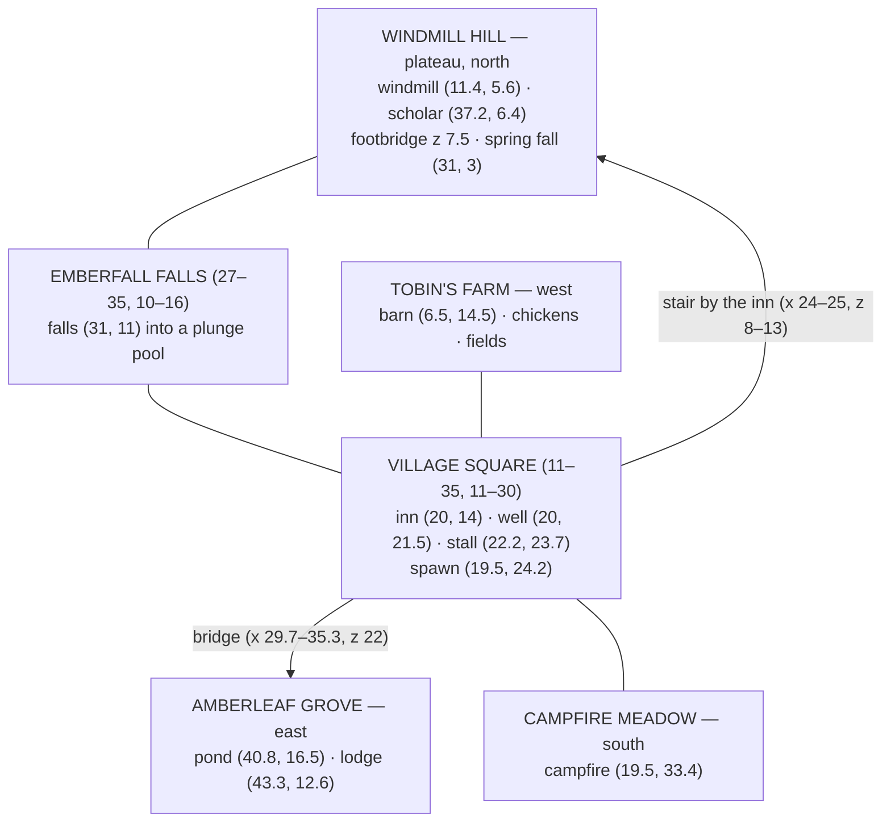
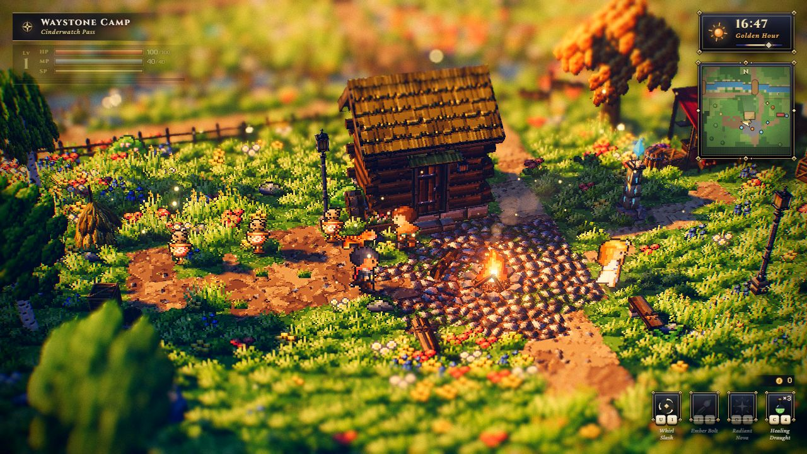

# Playing the game

> **Purpose** — The complete player's guide to the Lumina demo game: how a session flows, every
> control, the HUD and maps, talking to villagers, time of day and weather, photo mode, music, the
> debug panel, the five shipped levels, guided tours of **Emberfall** and **Starfall Vale**, and
> combat on **Cinderwatch Pass**.
>
> **Audience** — Players, level designers checking their levels, and AI agents that need to know
> what the game does from the player's side.
>
> **Source of truth** — [`src/demo/Game.js`](../../src/demo/Game.js) (flow, shortcuts, interaction,
> `CONTROLS`), [`src/engine/core/Input.js`](../../src/engine/core/Input.js) (`DEFAULT_BINDINGS`,
> `DEFAULT_PAD_BINDINGS`), [`src/engine/core/CameraRig.js`](../../src/engine/core/CameraRig.js),
> [`src/demo/config.js`](../../src/demo/config.js) (`CAMERA`, `TIME_SPEED`),
> [`src/demo/Weather.js`](../../src/demo/Weather.js) (`TIME_PRESETS`, `WEATHERS`),
> [`src/demo/dialogue.js`](../../src/demo/dialogue.js), [`src/demo/DebugControls.js`](../../src/demo/DebugControls.js),
> [`src/engine/ui/`](../../src/engine/ui/) (HUD, DialogBox, TitleScreen, Minimap / WorldMap),
> [`public/levels/*.json`](../../public/levels/); for combat [`src/demo/combat/`](../../src/demo/combat/CombatSystem.js)
> (`bindings.js`, `rules.js`, `defs.js`).
>
> **Related** — [Getting started](GETTING_STARTED.md) · [Shortcut cheat-sheet](shortcuts.html) ·
> [Input & controls spec](../specs/INPUT_AND_CONTROLS.md) · [Game architecture](../architecture/GAME.md) ·
> [Automation API](../specs/AUTOMATION_API.md) · Level notes: [Emberfall](../design/levels/emberfall.md),
> [Starfall Vale](../design/levels/starfall-vale.md), [Brightwater Crossing](../design/levels/brightwater-crossing.md),
> [Willowmere](../design/levels/sample-hamlet.md), [Cinderwatch Pass](../design/levels/cinderwatch-pass.md) ·
> [Combat contract](../contracts/COMBAT.md)

*The Emberfall screenshots in this guide were taken before the minimap and the world map were
added. The current HUD also shows a minimap under the clock and an **N/Tab · World map** row in the
controls legend (the Starfall Vale screenshots show them).*

---

## 1. How a session flows

1. **Loading** — a small ember, the level name and a gold progress bar ("Reading the map" …
   "Waking the villagers", "Warming up the lanterns", "Ready"). The screen stays up until the first
   frames — rain and snow included — have been drawn, so nothing stutters later.
2. **Title screen** — the level name in capitals, its subtitle and a blinking **Press any key**,
   while the camera drifts slowly over the level. The clock is paused. Any key (except Shift, Ctrl,
   Alt, the Windows / Cmd key, Tab, Caps Lock, F5, F11, F12 — `IGNORED_KEYS` in
   [`TitleScreen.js`](../../src/engine/ui/TitleScreen.js)), a click or any gamepad button starts
   the game; that same press unlocks audio and starts the music (unless the level has its music
   switched off).
3. **Play** — the camera glides to the traveler, an **arrival banner** shows the level name and
   the **controls legend** appears bottom-left. The clock starts running.

`?autostart=1` skips the title screen; audio then unlocks on your first key press or click (see
[Getting started › No sound](GETTING_STARTED.md#62-no-sound)).

---

## 2. Controls

The game binds **physical key positions** (`KeyboardEvent.code`), so on AZERTY / QWERTZ keyboards
use the keys that sit where the US letters are. Printable version: [shortcuts.html](shortcuts.html).

### 2.1 Keyboard and mouse

| Action | Keys | Notes |
| --- | --- | --- |
| Move | **W A S D** or **arrow keys** | Relative to the camera: W is "up the screen" whatever the camera angle. |
| Run | hold **Shift** | Walk 3.2, run 5.6 world units per second. |
| Talk / examine / advance text | **Space**, **Enter** or **F** | Also: click the dialogue window. |
| Choose a dialogue answer | **↑ / ↓** or **W / S** | Or hover and click an answer. |
| Finish the typing line at once | **Esc** or **Backspace** | Space / Enter / F do the same while text is typing. |
| Rotate the camera | hold **Q** / **E** | Up to 60° either side of north. |
| Zoom in / out | hold **Z** / **X**, or **=** / **−**, or the **mouse wheel** | Camera distance 18–42, 30 by default (`CAMERA` in [`config.js`](../../src/demo/config.js); a level's `environment.camera.distance` can change the default and widens the range to include it). |
| World map | **N** or **Tab** | **N**, **Tab**, **Esc** or **Backspace** closes it. |
| Next time of day | **T** | Dawn → Midday → Golden Hour → Dusk → Night, with a 2-second glide. |
| Next weather | **R** | Clear → Rain → Snow → Clear. |
| Photo mode | **P** | **P** or **Esc** (or Backspace) returns. |
| Music on / off | **M** | |
| Controls legend on / off | **H** | |
| Debug panel | **`** (backquote, the key left of 1) or **F1** | The legend shows it as **~**. |

### 2.2 Gamepad (standard mapping)

| Action | Button |
| --- | --- |
| Move | **Left stick** or **D-pad** |
| Rotate the camera | **Right stick** (left / right), or **LB** / **RB** |
| Run | **RT** |
| Talk / confirm | **A** |
| Cancel (finish typing, close the map, leave photo mode) | **B** |
| Zoom in / out | **Y** / **X** |
| Dialogue answers | **D-pad up / down** |
| World map | **Back / View** |
| Controls legend | **Start / Menu** |
| Photo mode | **Right stick click** |

Time of day, weather, music and the debug panel have no gamepad buttons. Any gamepad button
dismisses the title screen.

---

## 3. The HUD

| Element | Where | What it shows |
| --- | --- | --- |
| **Location plate** | top-left | The region you are in and its subtitle (e.g. *Village Square · Emberfall*). Between regions the last one stays. |
| **Clock** | top-right | 24-hour time with a sun / moon icon and the phase name (table below). |
| **Minimap** | under the clock | A painted map of the level, north up, about 34 world units across: your arrow and the camera's view wedge, villagers (light-blue dots), signs and doors (gold diamonds), wells (blue diamonds) and campfires (orange dots). A level can switch it off (`environment.minimap: false`). |
| **Controls legend** | bottom-left | The keys; toggle with **H**. Tucked away during conversations. |
| **Toasts** | top-centre | Short messages: the new time or weather, *Obtained: …*, *♪ Music on*. |
| **Interaction prompt** | above the target | *Talk*, *Read*, *Knock* or *Look* with the **Space** key cap. |
| **Arrival banner** | upper centre | The level name when play starts, and a region's name and banner line the first time you enter a region that has one. |

Clock phases (`timePhase` in [`HUD.js`](../../src/engine/ui/HUD.js)):

| Phase | Hours |
| --- | --- |
| Night | 20:30 – 4:45 |
| Dawn | 4:45 – 7:00 |
| Morning | 7:00 – 11:00 |
| Midday | 11:00 – 14:00 |
| Afternoon | 14:00 – 16:30 |
| Golden Hour | 16:30 – 18:45 |
| Dusk | 18:45 – 20:30 |

---

## 4. Exploring

- **Movement** follows the camera: pushing up always walks "into" the screen. The traveler faces
  one of four directions, climbs stairs and walks over bridges and piers smoothly, and cannot enter
  water, blocked forest, rock or buildings. A step of one height level (0.5 units) is walkable; two
  or more levels form a cliff — look for stairs.
- **The camera** looks north by default. **Q / E** swing it up to 60° either way (near the east
  and west edges of a map the swing is limited so the border forest does not come between you and
  the camera). Zoom with **Z / X** or the wheel. On high ground (Emberfall's Windmill Hill, Mount
  Lumen in Starfall Vale) the camera tilts a little further down.
- **Behind buildings and trees** the traveler shows as a pale silhouette, so you never lose them.
- **Depth of field** keeps a band around the traveler sharp and blurs the foreground and the
  distance — the tilt-shift diorama look.

**Coordinates** used in this guide are world units: **x grows east** (right on the map), **z grows
south** (down on the map, toward the camera); one tile is one unit. The world map and minimap are
drawn north-up.

> **Tip — jumping around.** `window.__game` is always available. Open the browser console (F12) and
> type `__game.teleport(24.5, 6)` to jump to a spot — here the plateau at the top of Emberfall's
> stair. A spot you cannot stand on (water, a wall) snaps to a standable point within 3 units;
> when there is none (e.g. far off the map) nothing happens and it returns `null`. Use
> `__game.setTime(22)` for 22:00, or `__game.state()` to see your position, region and more. Full
> list: [specs/AUTOMATION_API.md](../specs/AUTOMATION_API.md).

---

## 5. Talking, examining and choices

Walk up to someone or something and face it; when the prompt appears, press **Space** (Enter, F,
gamepad A).

| Target | Prompt | Reach |
| --- | --- | --- |
| Villager | *Talk* | 1.6 units (a level can change it per villager, `talkRadius`) |
| House door | *Knock* | 1.0 unit from the door step (about a unit in front of the door); walking right up to the door and facing it works too |
| Signpost | *Read* | 1.35 units |
| Well | *Look* | 1.75 units |

Doors, signposts and wells are only interactive when the level gives them text (a house's *Text
when knocking*, a sign's *Sign text*, a well's *Text when examined*).

The target must be roughly in front of you and at about your height. A villager stops, turns to
you and carries on afterwards.

**The dialogue window** types each page out letter by letter, with little blips and pauses at
punctuation. Words in **gold** are names and places (level authors mark them as `{word}`).

- **Space / Enter / F** (or a click on the window) while typing completes the page; once complete,
  it turns the page. The bobbing **▼** means "more"; the last page ends with a diamond.
- **Esc / Backspace** while typing also completes the page. A conversation cannot be skipped
  entirely.
- **Choices** appear in a list with a gold cursor: **↑ / ↓** (or W / S, D-pad) and confirm, or
  click one. For a quarter of a second after the choices appear input is ignored, so mashing
  through the text never picks one by accident — and in the built-in questions (rest, shop, music,
  Emberfall's conversations) the **first answer is the non-committal one** ("Not yet", "Just
  looking").
- After a conversation, confirm is ignored for 0.8 s so it does not start a new one.

**What villagers can do for you**

| Action | What happens |
| --- | --- |
| **Rest** (innkeepers) | Answer anything but the first choice to "Will you rest until morning?": the screen fades out, the clock jumps to **08:00** and *You feel well rested.* (A villager in a custom level whose closing question has a single answer rests you — or hands you the item — when you pick that answer.) |
| **Shop** (merchants) | Accepting the offer gives you the item: a chime and *Obtained: Crisp Apple* (or the level's item; ×2, ×3 … on repeat purchases). Items are free and there is no inventory screen. |
| **Music** (bards) | Starts the music when it is silent; when it is playing they offer to stop it. |

Emberfall's eight villagers use hand-written conversations (`CONVERSATIONS` in
[`dialogue.js`](../../src/demo/dialogue.js)). Four of them change on later visits: the elder, the
guard, the child and the scholar say something different the second time, and Wren the bard asks
whether to keep playing (or starts the music again if it is silent).

---

## 6. Time of day and weather

- **The clock runs** while you play: **one game hour ≈ 90 seconds** (`TIME_SPEED = 1/90` hours per
  second). Each level sets its start hour; Emberfall starts at 17:12 (golden hour), Starfall Vale at
  17:24. A level can stop the clock (`environment.clock: false`).
- **T** glides (2 s, always forward in time) to the next preset:

  | Preset | Hour |
  | --- | --- |
  | Dawn | 6:30 |
  | Midday | 12:30 |
  | Golden Hour | 17:12 |
  | Dusk | 18:54 |
  | Night | 22:30 |

- The light follows a 24-hour palette: pink dawn, white noon, the long raking shadows of golden
  hour, purple dusk and blue nights. At night the street lamps and windows light up, the fires
  carry the light and fireflies come out.
- **R** cycles **clear → rain → snow → clear** and blends over a few seconds: rain greys the light,
  thickens the fog, strengthens the wind and dims the sun; snow falls and **settles** on the ground,
  grass and roofs. On grey days the lanterns and windows glow. Levels can start in rain or snow.
- Resting at an inn sets the clock to 08:00.

---

## 7. Photo mode

**P** (gamepad: right stick click) shows *Photo mode · P or Esc to return* and hides the whole UI
after a moment. You can still walk, rotate and zoom the camera, and change the time (**T**),
weather (**R**) and music (**M**); talking is off. Photo mode cannot start during a conversation or
while the world map is open. **P**, **Esc**, **Backspace** or gamepad **B** bring the UI back.

For more freedom, set up the camera in the debug panel before entering photo mode (the panel is
hidden with the rest of the UI): **Camera › free yaw** lets the camera turn all the way round, and
**Camera › fov / distance** reframe the shot. **Camera › pitch** does not stick: while you play,
the game re-applies the level's pitch (or the high-ground tilt) every frame. In photo mode the
camera keeps the pitch it had when you entered, and the edge-of-map limit on Q / E is lifted
(`Game._updatePlayCamera` is skipped for both).

---

## 8. Music and sound

Everything you hear is synthesised live in WebAudio: a harp, pad and flute folk loop, footsteps
that change on wood, stone and sand, dialogue blips, chimes, and ambience that follows the world —
birds by day, crickets at night, a campfire that crackles louder as you approach, and water that
grows louder near rivers and waterfalls. **M** turns the music on and off. Audio starts after your
first key press or click (browser rule).

---

## 9. The world map

**N** or **Tab** (gamepad **Back / View**) opens a full-screen, gold-framed map of the whole level:
region names, your arrow, villagers, signs, doors and wells, campfires, buildings, roads, water and
forest, with a legend and *You are in …*. You stand still while it is open — the clock and the
villagers carry on. Close it with **N**, **Tab**, **Esc** or **Backspace** (gamepad **B** or
**Back**). It does not open during a conversation or in photo mode.

---

## 10. The debug panel

**`** (backquote) or **F1** opens a themed [lil-gui](https://lil-gui.georgealways.com/) panel under
the clock, with a stats overlay: **FPS**, frame milliseconds, a small fps graph, **Calls** (draw
calls, including the ~20 post-processing passes), **Tris**, **Geom**, **Tex**, **Prog** (shader
programs) and **Worst** (slowest frame in the last quarter second). It only opens during play.
Changes are live and are not saved.

| Folder | Controls | Use it to |
| --- | --- | --- |
| **Time & Weather** | time of day (0–24), *speed (h / s)* (0–2 game hours per real second in 0.01 steps; the default is 1/90 ≈ 0.011, shown as 0.01), paused, weather, *next preset (T)* | Freeze or scrub the clock. |
| **Post FX** | *post-processing* on / off; **Depth of field** (enabled, CoC debug view, autofocus and autofocus speed, focus distance / range, max blur, near / far scale, tilt-shift amount / centre / width / feather, bokeh boost / threshold / sprites); **Bloom** (enabled, strength, radius, threshold, knee, warmth); **Grade** (enabled, exposure, contrast, saturation, temperature, tint, vignette and its softness / roundness, grain and grain size, chromatic aberration, sharpen, dither; split-toning and vignette colour) | Tune or switch off the HD-2D look. |
| **Lighting** | sun, ambient, fog, exposure and point-light multipliers; shadows; lantern flicker; shadow extent; cliff bounce | Adjust the light on top of the time-of-day palette. |
| **Camera** | fov, pitch, distance, yaw, free yaw, look-ahead, follow speed, reset | Frame screenshots; *reset* restores the level's framing. The game re-applies its pitch every frame during play, so the pitch slider does not stick. |
| **Atmosphere** | god rays, dust motes, fireflies, falling leaves, petals, chimney smoke, waterfall mist, wind, snow cover | Thin out or boost the particles. |
| **Render** | render scale (0.5–1), dynamic resolution, show stats, *photo mode (P)* | Trade sharpness for speed ([performance tips](GETTING_STARTED.md#63-performance-tips)). |

Every knob is explained from the engine side in [architecture/RENDER_PIPELINE.md](../architecture/RENDER_PIPELINE.md)
(post-processing) and [architecture/modules/lighting.md](../architecture/modules/lighting.md).

---

## 11. The levels

| Level | URL | Size | Starts | What is there |
| --- | --- | --- | --- | --- |
| **Emberfall** — *Riverside Village* | `/` | 48 × 40 | 17:12, clear | The original demo: a village square, Windmill Hill, two waterfalls, a river and bridge, a farm, an autumn grove with a pond and a campfire meadow. 8 villagers, 6 houses, 136 objects, 7 regions. |
| **Starfall Vale** — *Where the Stars Come Home* | `/?level=starfall-vale` | 128 × 128 | 17:24, clear | The flagship: the night of the Starfall Festival across a whole vale. 29 villagers, 27 houses, 874 objects, 31 regions, 5 waterfalls, 10 bridges and piers. |
| **Brightwater Crossing** — *A Riverside Hamlet* | `/?level=brightwater-crossing` | 36 × 28 | 16:48, clear | A hamlet built entirely in the level editor: Miller's Hill with a windmill, a waterfall into a plunge pool, a river and bridge, the inn, a farm and a lily pond. 4 villagers, 68 objects. |
| **Willowmere** — *A Hamlet by the Pond* | `/?level=sample-hamlet` | 28 × 22 | 16:48, clear | The small example level: a green, an orchard terrace and a mirror pond. 3 villagers, 38 objects. |
| **Cinderwatch Pass** — *Where the Old Fires Wake* | `/?level=cinderwatch-pass` | 96 × 120 | 16:48, clear, clock stopped | The **combat** level ([§15](#15-combat-cinderwatch-pass)): a camp with training dummies, a glade of slimes, the Bramble Ruins or the Hollow Mire, the Cinder Quarry and the boss Cinderheart in its caldera. 53 enemies in 24 groups, 6 chests, 3 waystones, 5 villagers. |

Add `&autostart=1` to skip the title. Any other file in `public/levels/` plays with
`?level=<file name>`, and levels saved in the browser with `?level=local:<slot>` — see
[Getting started › URLs](GETTING_STARTED.md#41-urls-of-the-game). How the levels were designed:
[Emberfall](../design/levels/emberfall.md), [Starfall Vale](../design/levels/starfall-vale.md),
[Brightwater Crossing](../design/levels/brightwater-crossing.md),
[Willowmere](../design/levels/sample-hamlet.md), [Cinderwatch Pass](../design/levels/cinderwatch-pass.md).

---

## 12. A guided tour of Emberfall

Emberfall is a 48 × 40 tile village ringed by forest. The village sits at height level 2, Windmill
Hill rises to level 8 in the north (z 3–8), and Campfire Meadow lies one level lower in the south
(z 30 and beyond). The river comes off the hill at x ≈ 31 and runs south just east of the square.

1. **Village Square** — you start at its south end (19.5, 24.2). **Elder Maren** stands by the
   **well** (20, 21.5) and tells the village's story; **Bertram** at the market stall (22.2, 23.7)
   hands out a free apple; **Rosalind** outside **the Ember & Oak** inn (20, 14) lets you rest until
   morning. Read the signpost (15.3, 22.9) for directions, and knock on the doors — every house has
   something to say. A cat and a flock of birds that take flight share the square.
2. **Tobin's Farm** (west) — **Old Tobin** tends the fields (6.8, 26.3), and his granddaughter
   **Pip** chases the chickens round the barn yard (6.2, 18.6). The chickens scatter from you too.
3. **Windmill Hill** (north) — climb **the stair by the inn** (x 24–25, z 8–13: six stair tiles, one
   height level each, up to the plateau). At the top the banner reads *Where the valley keeps its winds* and the camera tilts
   down. The windmill turns in the west (11.4, 5.6); cross the **footbridge** (z 7.5) over the
   stream to meet **Ottoline Quill**, the scholar (37.2, 6.4), who explains the controls in
   character.
4. **Emberfall Falls** (27–35, 10–16) — the stream drops off the plateau at (31, 11) into a plunge
   pool with spray and glints; a second small fall spills from the spring at the top edge.
5. **The bridge and Amberleaf Grove** (east) — **Corporal Hale** guards the west end of the bridge
   (29, 23.6). Across it: autumn trees, falling leaves, the woodcutter's lodge (43.3, 12.6) and a
   small pond (40.8, 16.5) where fireflies dance at night.
6. **Campfire Meadow** (south) — flowers, petals and **Wren** the bard by the campfire
   (19.5, 33.4). If the music is silent, he plays *Emberfall Evening*; on a later visit he asks
   whether to keep playing.
7. **Evening** — press **T** until *Night* and walk back to the square: lamps, windows and the
   campfire light up, fireflies drift over the meadow and the grove. Try **R** for rain in the
   grove and snow on the rooftops.

| | |
| --- | --- |
|  |  |
| Dawn on Windmill Hill | Campfire Meadow at dusk |
|  |  |
| Snow settles on roofs and grass | Rain in Amberleaf Grove |

The eight villagers: `elder` Elder Maren · `innkeeper` Rosalind · `merchant` Bertram · `guard`
Corporal Hale · `farmer` Old Tobin · `child` Pip · `bard` Wren · `scholar` Ottoline Quill (the ids
work with `__game.talkTo(id)`).

---

## 13. A guided tour of Starfall Vale

`/?level=starfall-vale` — the night of the Starfall Festival. You arrive at the south edge on the
King's Road (70.5, 121.5), facing north, at 17:24. The clock runs: night falls about five minutes
later, or press **T**. Open the world map (**N**) often — the vale is large.

| # | Stop | Where (x, z) | What to do |
| --- | --- | --- | --- |
| 1 | **The Meadowlands** | the road north from (70, 120) | Read the welcome sign (72.8, 122.2). Flowers "as far as the lantern-light", the Wishing Oak sign (60.6, 116.6). |
| 2 | **The Troupe Camp** — *The Wandering Lanterns* | (50–70, 91–106) | **Lark** the bard (60.2, 97.7) introduces the troupe and its song and starts the music if it is silent; **Saffi** practises the Star Dance; **Signor Orsino** gives out Festival Ribbons. Come back at night. |
| 3 | **Southgate** | bridge at (70.5, 77–81) | **Sergeant Hobb Vane** keeps the gate (72.9, 82.6). Cross the Silverrun into town. |
| 4 | **Hearthwick Square** | (61–79, 50–66) | The market town: the old well (70, 57.5), three stallholders offering Paper Lanterns, Moonpetal Tea and Starbloom Garlands, **Mayor Aldous Bramblecote**, and **Marigold Fenn** by the Starlight Inn (65, 47.5) who lets you rest. Barnaby Crumb sells Starlight Buns by his bakery to the east. Knock on the doors — the town hall notice, the bakery, the smithy. |
| 5 | **Chapel Row** | (78–87, 40–52) | The Chapel of the Fallen Stars and **Sister Amarantha**, keeper of the Star Register. |
| 6 | **Mirrormere Landing** | (83–99, 56–75) | The fishing hamlet on Lake Mirrormere: **Grandmother Isolde** (92.4, 68.3) tells you where the stars sleep. Walk to the end of **the Long Pier** (x 94.7 → 102.6, z 66.5). |
| 7 | **After dusk on the pier** | (104, 66.5) | After dark the sleeping stars glimmer up through the water off the end of the Long Pier and by the North Pier; a glow marks the island out in the lake (out of reach). |
| 8 | **The Three Sisters** | (50–67, 18–41) | Three waterfalls stepping down Mount Lumen (60, 36) · (58, 28) · (62, 20), with bridges between them. |
| 9 | **Stargazer's Steps → the Lumen Observatory** | (66–79, 18–28) → (66–81, 4–16) | Climb the switchbacks to the plateau. **Master Casimir Vey** (75.5, 12.7) tells the story of the sleeping stars. |
| 10 | **Lumen Lookout** | (40–52, 12–22) | **Rowan the Wayfarer** and the view over the whole vale. |
| 11 | **Amberpine Heights & the Mirror Falls** | (94–125, 3–40), falls at (113, 40) | Pines above the lake; **Warden Ivo** (107.4, 34.4). |
| 12 | **The Old Quarry & Old Lumen** | (3–38, 3–38) | The ruins of the first town, the old well (7.5, 29.6) and the old shaft (sign at 19, 15) nobody knows the depth of. |
| 13 | **Goldenfield Farms** | (3–44, 37–84) | The windmill (15.5, 48.5), Barleycorn Farm, **Tansy** chasing chickens, a farm dog, the orchard. |
| 14 | **Emberwood & the Hidden Glade** | (3–45, 83–125); glade (4–26, 100–122) | The autumn forest: the woodcutter's camp and its campfire, the Hermit's hut and **Old Thistle** among the standing stones. |
| 15 | **Reedmouth & the South Beach** | (84–99, 75–90), (90–125, 93–112) | A lakeside campfire (93.5, 85.2) with **Finn Ashdown**, benches facing the lake on the South Beach, and Bramble Hollow further south. On the east shore, herons stand on the Heron Spit (sign at 120.6, 77.6). |

Quick jumps from the console: `__game.teleport(70, 60)` (the square), `__game.teleport(101, 66.5)`
(the Long Pier), `__game.teleport(74, 13)` (the observatory), `__game.teleport(15, 110)` (the
glade); then `__game.setTime(22)`.

| | |
| --- | --- |
|  |  |
| Hearthwick Square at golden hour | …and at night |
|  |  |
| The piers of Mirrormere Landing at night | The Troupe Camp |
|  |  |
| The Three Sisters | The Lumen Observatory |
|  |  |
| The Hidden Glade in the Emberwood | Master Casimir Vey |

---

## 14. Tips

- **Screenshots**: photo mode, a slow golden hour (debug panel › Time & Weather › speed 0 or
  *paused*), and zoom in with **Z** for the strongest tilt-shift blur.
- **Night is the best time** for the festival in Starfall Vale and the fireflies of Emberfall.
- **Lost?** The world map's *You are in …* line names the region, and every signpost gives
  directions.
- **Something looks wrong** in a level you made? Check it in the editor (*Level › Check for
  problems*) — see the [Level editor guide](LEVEL_EDITOR_GUIDE.md).

---

## 15. Combat (Cinderwatch Pass)

Levels with enemies — the shipped one is **Cinderwatch Pass** (`/?level=cinderwatch-pass`) — add
real-time action combat. Everything above still works there; the combat keys below do nothing on
the other levels. The title screen shows a level row: **← / →** (or the d-pad) choose a level and
**Enter / A** travels there; any other key starts the current level.

### 15.1 Combat controls

| Action | Keyboard · mouse | Gamepad |
| --- | --- | --- |
| Attack — press again as the blade comes back for a 3-hit combo (the third is a thrust) | **J** · left button | **X** |
| Dodge roll (with a direction; without one a short backstep) — invulnerable for a moment; roll just as a blow lands for a **Perfect!** dodge that slows the enemies | **K** · right button | **B** |
| Whirl Slash (Lv 1) · Ember Bolt (Lv 2) · Radiant Nova (Lv 4) | **U / I / O** or **1 / 2 / 3** | hold **LT** + **X / Y / B** |
| Healing Draught (40 % of max HP) | **C** or **4** | **Y** |
| Lock on / next target (hold to release) | **L** · middle button | **right stick click** |
| Talk, open a chest, rest at a waystone | **Space**, **Enter**, **F** | **A** |
| Zoom | **Z / X**, wheel | **right stick up / down** |
| Photo mode (refused while foes are near) | **P** | **left stick click** |

The controls legend and the skill keycaps follow the last device you used; the first gamepad
press shows a one-time hint. Captain Maren in the camp explains the keys (in the device you are
using) and rewards a full combo on a dummy plus one roll with two draughts.

### 15.2 The combat HUD

Under the location plate: level, **HP** (red), **MP** (blue), **SP** (stamina, gold) and a thin XP
track. Bottom right: the skill bar (cooldowns as a dark veil with seconds, locked skills dimmed,
a refused press shakes the slot) with the draught count and your gold. Right edge: the loot feed.
Above enemies: damage numbers, HP bars (hit enemies, the locked target, elites), small red
diamonds over foes that noticed you, and arrows at the screen edge for foes off screen (they
pulse while that foe winds up). The boss has a bar at the bottom centre with its phase gems.

### 15.3 Reading a fight

- **Every enemy attack is telegraphed**: the enemy flashes orange while it winds up, and big or
  ranged attacks draw a red marker on the ground that fills up — the hit lands when it is full.
  Arrow and charge lanes stop following you and flash white just before they fire: roll sideways.
- Enemies take turns (only a few attack at once). Hit an enemy from behind, or while it is stunned
  or staggered, for more critical hits. The third combo hit is the strongest.
- **Stamina**: rolls cost 25 SP; attacks never fail, but at 0 SP you are *winded* and recover
  slower.
- **Loot** pops out of defeated enemies and flies to you: coins, hearts (+12 % HP), mana motes
  (+8 MP), draughts. XP levels you up (full HP / MP, more HP, MP and attack; new skills at Lv 2 and
  4).
- **Chests** open with Space and give gold, draughts or an upgrade (max HP, max MP, attack); they
  appear on the map once you have seen them.
- **Waystones** attune when you walk up to one (your checkpoint); Space there **rests**: full HP /
  MP / SP, at least 3 draughts — and every enemy group comes back. Not possible while foes are near.
- **Falling**: the screen says *You Have Fallen*; any key rises you at the last waystone with full
  HP, 10 % less gold and the enemies you killed still gone.
- **Shops**: **Bram** at the camp stall and **Odo** at the Quarry Waystone sell Healing Draughts
  (25 gold) and three things you can buy once each: a **Whetstone** (attack +2, 120 gold), an
  **Ironbark Tonic** (max HP +15, 90 gold) and a **Warding Charm** (defence +3, 150 gold). Talk to
  them and pick from the list — *Nothing more* is first, so mashing Space never buys anything, and
  a ware you cannot afford says *(not enough)*. What you buy stays bought when you fall. Nobody
  trades while enemies are on your heels. Odo's advice about the boss is behind *Tell me again*
  after your first visit.
- **Enemies follow you** up stairs and onto ledges, but only so far: every pack belongs to its
  part of the pass and turns back when you leave it. If you stand somewhere it cannot reach, it
  gives up and goes home.

### 15.4 Cinderheart

The boss waits in the caldera at the north end. Stepping inside closes the gate behind you with
a wall of embers. It has three phases (at 70 % and 35 % HP): Hammer Slam, Sweep and Rock Toss;
then magma pools, Ember Rain, a Charge and bats; finally Shockwave Slams with expanding rings and a
short kneel where its core is exposed. **Bait the Charge into one of the four braziers** — it is
stunned for two seconds; **roll inward through the rings**; step out of the magma. Defeating it
opens the arena, drops its core (max HP +20) and shows a results card with your time, foes,
falls, perfect dodges and level. Odo on the quarry lip and the signposts say the same.

### 15.5 A walk up the pass (light spoilers)

The pass climbs from south to north — up the screen — so the camera always looks ahead.

1. **Waystone Camp** (safe). Talk to **Captain Maren** by the dummies: she explains the keys, and a
   full combo on a dummy plus one roll earns two draughts. **Sister Ilse** explains waystones;
   **Bram** sells draughts and a few upgrades for your gold. The camp's waystone is your first checkpoint. Not everything in the camp
   is in plain sight.
2. **Mossy Glade** (Lv 1). Slimes in the meadow and two goblins by the brook — the place to learn
   the combo, the roll and the lock-on. There is a chest out west.
3. **The Crossroads**. A second waystone, and **Pip**, who tells you what each way offers. Rest
   here before choosing.
4. **Either branch** (Lv 2–3) — both end on the quarry lip and give the same experience:
   - **Bramble Ruins** (west): goblins at a broken gate, a hex shaman in the court and archers on a
     ledge above it — close the distance or break their line of sight. A reward waits up on the
     ledge, and the ridge beside the ruins hides a small pocket.
   - **Hollow Mire** (east): bats over the ponds, slimes on the banks, a shaman, and goblins at the
     foot of the quarry stair. The islet in the great pond is reachable — find the boardwalk.
5. **Cinder Quarry** (Lv 4). Ironhide boars charge in straight lines: step aside and let them hit a
   rock or a block of cut stone for a long stun. Archers on the upper terrace, bats, a goblin
   crew — and an old boar with a name. **Odo** by the Quarry Waystone has advice for the boss and
   the watch's last stores — spend your gold there; rest at that waystone before the stair to the
   caldera.
6. **The Caldera**: Cinderheart ([§15.4](#154-cinderheart)). You should be about level 5.

The clock is stopped at golden hour on this level; **T** still changes the time if you want to
fight at night. Doing both branches is possible and gives extra experience and loot.

### 15.6 Who you meet

| Foe | Handle it by |
| --- | --- |
| **Moss Slime** | Hops toward you and leaps; weak, but they come in groups — any hit interrupts it. |
| **Bramble Goblin** | Circles you and lunges with a slash, sometimes a second; hops back when you swing. Wait for the lunge, roll, punish. |
| **Thorn Archer** | Keeps its distance and shoots along a red lane that locks before the arrow flies (every third shot a volley of three). Step off the lane when it flashes; archers on ledges see down into the court. |
| **Hex Shaman** | Keeps its distance, drops a filling fire circle where you will be, heals hurt allies and blinks away when you close in. Kill it first. |
| **Cinder Bat** | Orbits you and swoops through a small marked spot. Hard to hit in the air — strike as it dives or after. |
| **Ironhide Boar** | Paws the ground, then charges down a long lane; a wall, rock or block in the way stuns it. Up close it gores in a cone. Heavy: your hits barely push it. |
| **Straw Dummy** | The camp's training target; never fights back. |
| **Cinderheart** | The boss — [§15.4](#154-cinderheart). |

An **elite** (a gold-framed bar with a name plate) has more health, hits harder and is worth more.
